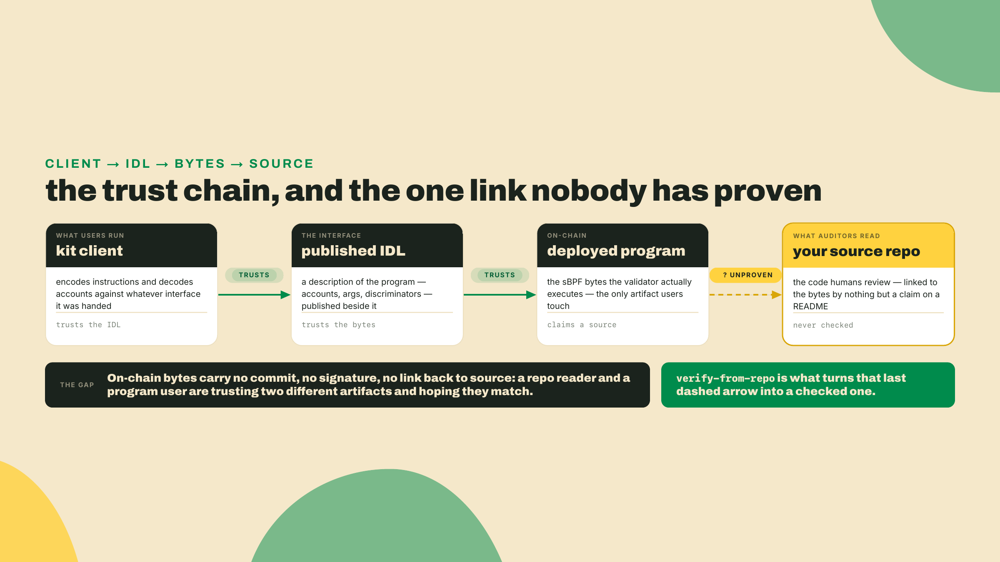
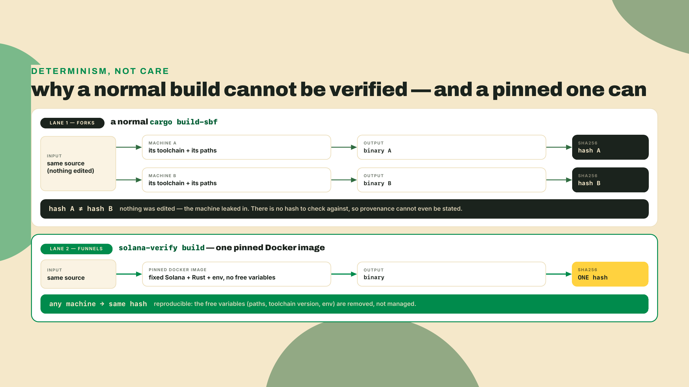
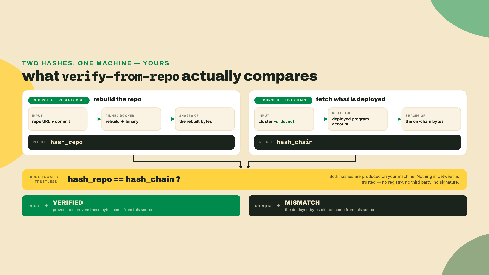
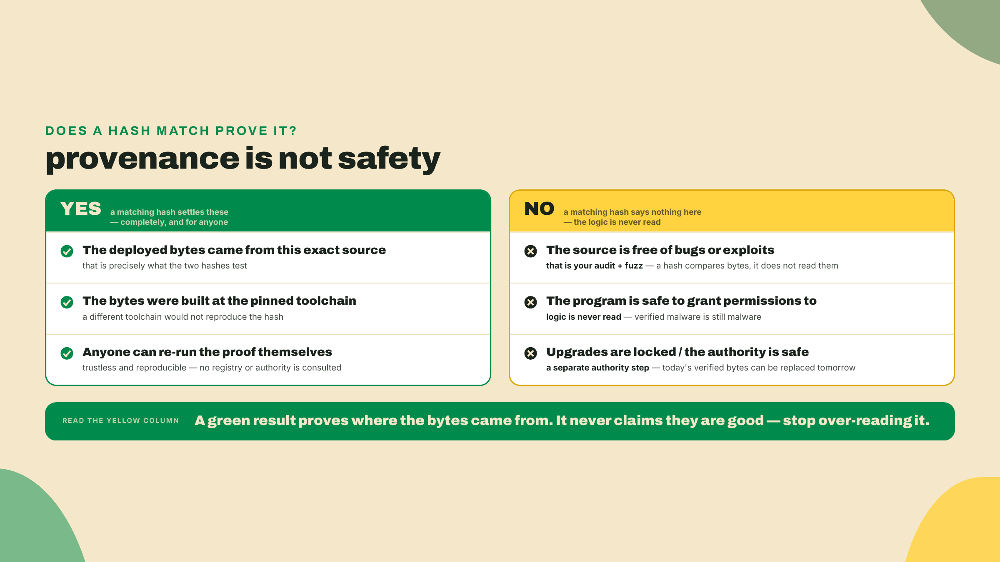
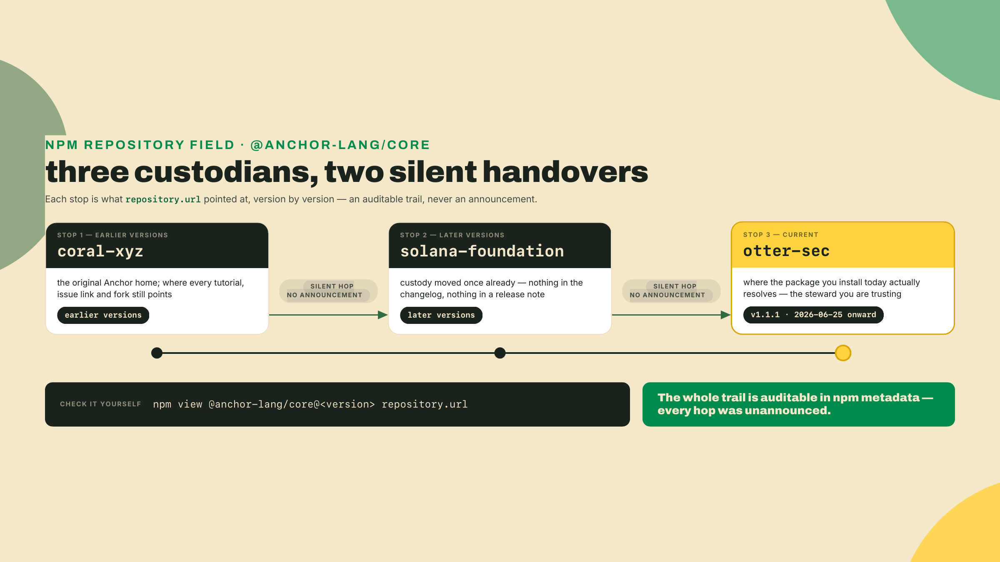
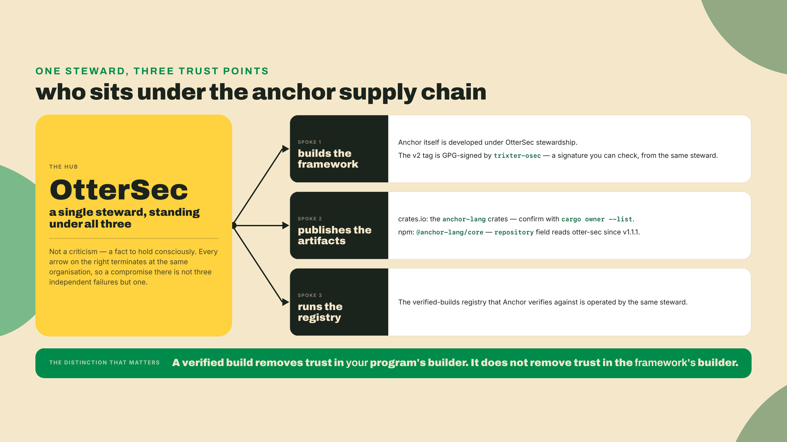
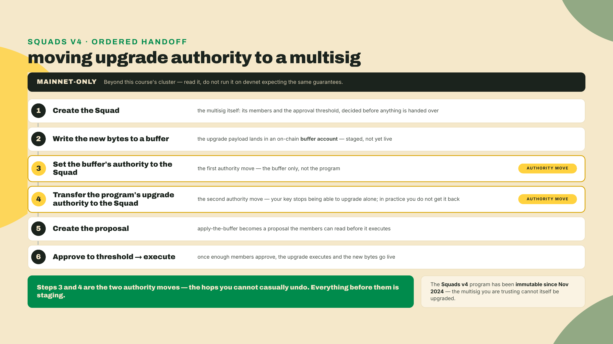
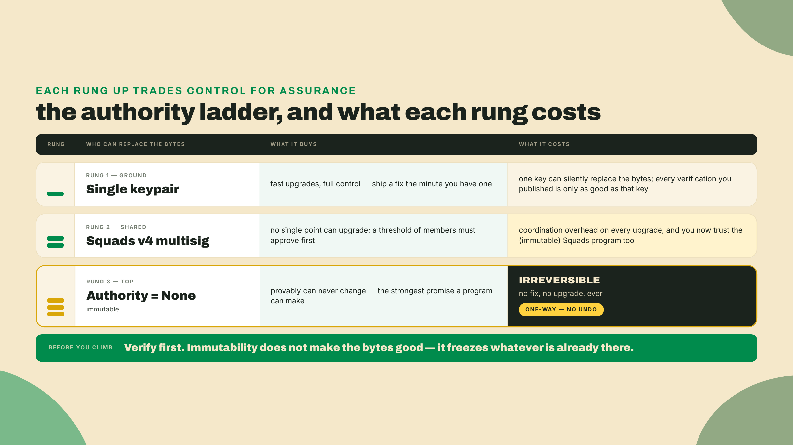
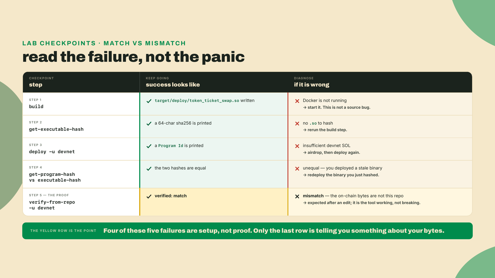

# Prove it: the on-chain bytes match your source

Last lesson you generated a kit client and published the IDL on-chain, so anything can now call the swap through a typed builder. The client trusts the IDL. The IDL trusts the deployed program. And the deployed program? Right now you are asking everyone to take your word that the bytes running on the cluster are the bytes in your repo.

That is the gap I want to close. Anyone can deploy a program, point at a public GitHub repo, and say "this is the source." Nothing about a deployed program forces that claim to be true. The account on-chain is just a blob of sBPF bytecode. It carries no link back to a commit, no signature from a compiler, nothing. So the reader of your repo and the user of your program are trusting two different artifacts and hoping they are the same one.

Before any theory, prove to yourself that the bytes even have a fingerprint. The program under the microscope for the rest of this lesson is R4, the swap crate `token_ticket_swap` whose IDL you published last lesson. Get the hash of your local build of it right now:

```bash
# Install once (Rust toolchain required). Pin the version. To see what is newer:
#   cargo search solana-verify   (reads crates.io, i.e. what is available)
# `solana-verify --version` only tells you what YOU installed, so it is the
# confirmation step, not the freshness check.
cargo install solana-verify --version 0.5.1   # latest as of 2026-08-22, re-check before you pin

# Fingerprint your compiled program. This is the "before" of everything that follows.
solana-verify get-executable-hash target/deploy/token_ticket_swap.so
```

That command prints a single sha256 hash of the executable. Write it down. It is a 64-character string that changes if even one instruction in the binary changes. The entire lesson is built on one idea: if two independently produced hashes match, the two builds are byte-identical, and if they differ, something moved. Everything else is plumbing around that comparison.

## Summary

You are going to prove, on devnet, that a deployed program was built from a specific source at a pinned toolchain. Then you are going to break it on purpose and watch the proof fail. Then you are going to look hard at what the proof does not cover, because that gap is where the real trust lives.

Here is the shape of it:

- **A verifiable build is a deterministic build.** Compile the same source on two different machines with the Solana CLI and you can get two different binaries, because build paths and toolchain versions leak into the bytes. `solana-verify build` runs the compile inside a pinned Docker image so the output is reproducible. Same source plus same pinned toolchain equals same hash, on any machine.
- **`verify-from-repo` is the whole proof, and it works on devnet.** It rebuilds your program from a public repo inside that pinned image, hashes the result, fetches the on-chain program's hash from the cluster you name, and reports match or mismatch. Point it at devnet and it proves your devnet deploy locally and trustlessly. No third party required.
- **A match proves provenance, not safety.** It proves the deployed bytes came from exactly this source at this toolchain. It says nothing about whether the source is correct, and nothing about who controls upgrades. Those are separate proofs you already did (your audit, your fuzz pass) or will do (authority).
- **The whole verify chain leans on one steward.** OtterSec builds the Anchor framework, publishes its crates, and runs the verified-builds registry Anchor verifies against. That is a real and honest single point of trust, and I am going to show you how to see it for yourself in npm's own metadata.
- **The remote registry submit and the Squads authority handoff are mainnet-only.** You will read them, narrated end to end, clearly labelled as beyond this course's cluster. Nothing in the gated section runs on devnet, and I will say so every time.

The fade this lesson: I run the full build, deploy, and verify cycle end to end in the lab, with the devnet hash match on screen, and every command in it is one you run against your own program id and your own repo. The solo rung is the mismatch: change one line, rebuild, redeploy, and make the proof go red, then say in one sentence what a green result does and does not buy you. This lesson is a build and a judgement, with no completion problem in between.



## From source to bytes and back

Start with the pain, because it is not obvious until you hit it. You build `token_ticket_swap` on your laptop, your teammate builds the same commit on theirs, and the two `.so` files hash differently. Nobody edited the source. So what moved?

The Solana CLI's normal build embeds machine-specific details into the binary. Absolute build paths, the exact compiler version, incidental ordering, all of it can bleed into the bytes. This is not a Solana quirk, it is how native compilation works. The consequence is that "here is my source" and "here is my binary" cannot be checked against each other unless everyone agrees, down to the version, on how the binary was produced. A hash comparison is only meaningful if the build is deterministic.

You might reach for the obvious fixes first, and it is worth seeing why each falls short, because that is what forces the real solution. Commit a `Cargo.lock` and pin every dependency? Necessary, but not enough: two machines with different rustc builds still diverge, and the lockfile says nothing about the compiler. Publish your exact rustc and Solana versions in the README and ask people to match them by hand? Better, but now you are trusting every verifier to reconstruct an environment step by step, and any drift in a transitive system library can still move a byte. The pattern is clear. Partial pinning always leaves a free variable, and a single free variable breaks the hash. The only fix that closes all of them at once is to ship the environment itself.

The silver bullet is Docker. `solana-verify build` runs the compile inside a pinned image with a fixed toolchain and a fixed environment, so the same source produces the same bytes no matter whose machine is underneath. You are not trusting the build anymore, you are trusting the pins. This is the same move a bridge engineer makes when they specify the exact steel grade instead of "some strong metal": determinism comes from removing the free variables, not from being careful.

The cost is real and I want it on the table. A verifiable build is slower than a native one, it needs Docker running, and the first build pulls a large image. You are buying reproducibility with build time and a heavier local dependency. For day-to-day iteration you still use the fast native `cargo build-sbf`. You reach for the verifiable build when you are about to deploy something people will trust.



Which brings up the pins, and one number I want to defuse before it misleads you. A verifiable build records the exact toolchain it used, and that toolchain includes a Solana version. That version is the build environment for these bytes. It is not a statement about what "current Solana" is. Those are two different facts and conflating them is a real footgun.

| Pin | Value for the `token_ticket_swap` build | Freshness note |
|---|---|---|
| `solana-verify` | 0.5.1 | Latest on crates.io as of 2026-08-22; `cargo search solana-verify` to see if that moved, `solana-verify --version` to confirm what you have |
| Docker | 27.x or newer | The build fails fast if the daemon is not running |
| Anchor | 2.0.0-rc.1, git `otter-sec/anchor` rev `e4878b6d` (= tag `v2.0.0-rc.1`) | Not a cut release avm can fetch; pin the commit, not the branch, and re-check at build |
| Solana build toolchain (inside the image) | 3.1.10 | LOCAL-CI / DOCKER PIN. This is the deterministic anchor for the bytes, NOT a current-Solana claim |

Read that last row twice. Solana 3.1.10 is the toolchain baked into this build so the hash is reproducible. The current stable Solana release is a different thing entirely: Agave v4.2.1 as of 2026-08-22 (re-verify, it moves). Anchor's V2 RC targets the Solana 3.x line, so a 3.1.10 build pin is exactly right for these bytes and says nothing about the newest node release. If you ever catch yourself reading a pins table and thinking "so current Solana is 3.1," stop. The pin is a build fact, the release is a network fact, and they drift apart on purpose.

A quick note on tooling, since you will meet both. Anchor ships `anchor build --verifiable`, which wraps the same idea using a `solanafoundation/anchor:v<version>` image, and V2's `anchor verify` shells straight out to the `solana-verify` binary under the hood. We use `solana-verify` directly here because it is the tool the ecosystem standardized on for the verify step, and because keeping the build and the proof in one tool means one version to pin and one set of flags to learn.

One wrinkle to name before you compare any hashes, because it trips people. The `.so` on your disk and the program as it lives on-chain are not laid out identically. An upgradeable program is deployed across two accounts: a program account, and a separate ProgramData account that actually holds the executable bytes. `solana-verify get-executable-hash` fingerprints your local `.so`. `solana-verify get-program-hash` fingerprints the executable pulled from that on-chain ProgramData account. The tooling normalizes them so the two are directly comparable, which is exactly why a clean deploy makes both hashes equal. When they disagree and you know you did not edit anything, the usual cause is mundane: you hashed a fresh build but deployed a stale `.so` from an earlier compile. Rebuild, redeploy, re-hash, and they line up.

Now the proof itself. `verify-from-repo` does four things:

```bash
# The frozen skeleton. Fill in your program id, your library name, and your repo URL.
# Two of those are flags; the repo URL is a positional argument at the end.
solana-verify verify-from-repo -u devnet \
  --program-id <SWAP_PROGRAM_ID> \
  <REPO_URL>

# For a workspace with several programs, name the one you are proving:
solana-verify verify-from-repo -u devnet \
  --program-id <SWAP_PROGRAM_ID> \
  --library-name token_ticket_swap \
  <REPO_URL>
```

It rebuilds the repo inside the pinned image, hashes that fresh binary, fetches the on-chain program from the cluster in `-u`, and hashes what is actually deployed. Two hashes, computed independently from two sources: your public code and the live cluster. If they are equal, the deployed bytes provably came from that source at that toolchain. If they differ, they did not. That is it. There is no trusted middleman in this path, which is exactly why it works on devnet: you are the one running the rebuild and the one running the comparison.



Make it concrete for a second. Say your local build hashes to `9f3c...a1` and `get-program-hash` on your devnet deploy returns the same `9f3c...a1`. `verify-from-repo` then rebuilds from the public repo, computes `9f3c...a1` a third time, and compares it to the on-chain value. Three independent computations, one value, and every one of them is something a skeptic can reproduce without asking you for a thing. Now flip one basis point in the fee, rebuild, and the local hash becomes `2b77...e0` while the repo still produces `9f3c...a1`. The mismatch is not a soft warning. It is arithmetic: different bytes, different sha256, zero overlap.

Here is where I turn and name the honest part, because a green line is seductive and it lies by omission if you let it. A match proves that the bytes on devnet were built from this source at this toolchain. It proves provenance. It does not prove the source is safe. A perfectly verifiable program can drain every vault in it, because verification never reads the logic, it only fingerprints the compiled output. Provenance and safety are orthogonal, and the reason your program is trustworthy is the audit checklist and the fuzz pass you ran in the security module, not this hash. Verification makes those results portable. It lets a stranger confirm that the code you audited is the code that is running. That is enormous, and it is also strictly less than "safe."



## The steward under the whole chain

So far the story is clean. Deterministic build, local comparison, trustless result. Now I want to derive the uncomfortable question a careful reader should already be forming, because "don't trust, verify" cuts both ways and I am not going to hand you the tool without the caveat.

The question is what exactly you are trusting when you verify an Anchor program. It feels like nothing, because the build is deterministic, and that reading is true for the comparison and false for the environment. Follow the chain. You trust the pinned Docker image to be an honest toolchain. You trust the Anchor crates you compiled against. And if you use the remote registry, you trust whoever runs it. Those trust points existing is unremarkable; every toolchain has them. What matters is that here they collapse into a single party.

OtterSec builds the Anchor framework, publishes its packages, and runs the verified-builds registry that Anchor's own tooling verifies against. One steward spans the framework, the artifacts, and the registry. This is not a rumor and you do not have to take my word for it, which is the whole point: both registries record it, and you can read it out of either.

Be precise about which command proves which half, because the two are separate artifacts. The npm walk below reads the `repository` field on `@anchor-lang/core`, the TypeScript client, and what it proves is *where the source repository moved*. Your program does not compile against that package; it compiles against the Rust crates. For those, ask crates.io directly:

```bash
# The Rust side: who owns the crate your program actually links against.
cargo owner --list anchor-lang
cargo info anchor-lang                      # the `repository:` row names the source repo
# (cargo search won't do here: it prints only name/version/description,
#  never the repository field — `cargo info` is the command that reads it.)

# The npm side: the repository field, version by version, is where the two
# custody transfers are legible.
npm view @anchor-lang/core repository.url
npm view @anchor-lang/core@1.1.1 repository.url   # the version where it changes
```

The repository field for `@anchor-lang/core` points to otter-sec starting from version 1.1.1, published 2026-06-25. Walk the history and you can watch custody move: the field trails from coral-xyz to solana-foundation to otter-sec, with no announcement anywhere. Two silent custody transfers, recorded only in a metadata field almost nobody reads. When I first traced this I did it exactly the way you just did, one `npm view` at a time, because I did not believe it from a secondhand claim either. That is the seam I want you to keep: verify the provenance of your provenance tool.



Compared to what, though? That is the question that keeps this honest instead of alarmist. Compared to no verification at all, where you take a stranger's word that their deploy matches their repo, a single well-regarded steward running a reproducible pipeline is a large step up. Compared to a fully diversified supply chain, several independent parties building the framework, publishing the crates, and running competing registries, it is a step short. Both comparisons are true at the same time. The right response is not to distrust the tool. It is to know the exact shape of what you are trusting, so that if custody ever changes hands again you notice it, the same way you just noticed the last two transfers.

One steward custodies the framework, publishes the artifacts, runs the registry Anchor verifies against, and GPG-signs the v2 tag under the key trixter-osec. That is a lot of the supply chain resting on one competent, well-regarded party. "Well-regarded" is doing real work in that sentence, and it is not the same as "trustless." A verifiable build removes your need to trust the builder of your specific program. It does not remove your need to trust the builder of the framework. Both facts are true at once, and a security engineer holds both without flinching.



## Mainnet-only, and read-only here

Two more pieces of the real workflow belong in your head even though you will not run them this lesson. I am fencing them off explicitly. **Everything in this section is mainnet-only and beyond this course's cluster.** You will read it, not execute it.

The first is the remote registry submit. Alongside the local `verify-from-repo` you just ran, `solana-verify` can queue a verification job with OtterSec's remote workers, which write a record to the on-chain registry. The old `--remote` flag on `verify-from-repo` is deprecated and now just prints the current path: upload your verify PDA with the program's upgrade authority, then `solana-verify remote submit-job --program-id <PROGRAM_ID> --uploader <UPLOADER>`. That job takes somewhere between one and thirty minutes and writes a verification record explorers and wallets read to show the little "verified" badge. **The remote submit-job is mainnet-only.** If you point it at a devnet program expecting a result, you will not get one, and the reason is not a missing deploy or a stopped Docker daemon, it is that the registry path only covers mainnet. On devnet, the local `verify-from-repo` is the proof, full stop.

Be precise about what the remote job adds, because it is a convenience layer, not a stronger proof. The trustless proof is the local one you already ran: anyone can rebuild and compare. What the registry buys is discoverability. OtterSec runs the build on their infrastructure, writes the result to an on-chain record, and every explorer and wallet that reads that record can show a verified badge without each user rebuilding your program themselves. So the remote path trades a little more trust in the steward for a lot more reach, and it is the same OtterSec you already met running the registry. On mainnet that trade is usually worth it. On devnet it is simply not offered, which is the whole reason the job comes back empty there.

The second is the upgrade authority handoff, and this is where verification meets governance. The upgrade authority is the account allowed to replace a program's bytes. A freshly deployed program has one, usually a single keypair, that can swap the executable at will. A verified build with a hot single-key authority is a program that is provably this source right now and could be silently different tomorrow. The recommended endgame is to move that authority to a Squads v4 multisig, a program that requires M-of-N member signatures before it will authorize an action, so no single key can push an upgrade on its own. **This flow is mainnet-only for this course; I am narrating it, not running it.** The Squads v4 program is `SQDS4ep65T869zMMBKyuUq6aD6EgTu8psMjkvj52pCf` (re-verify before you ever act on it), and the handoff has a specific order:



The ordering is not arbitrary, and getting it backwards is the classic footgun. You write the new bytes to a buffer and set that buffer's authority to the Squad before you hand the program's own upgrade authority over. If you transferred the program authority to the Squad first and only then found the buffer was owned by the wrong key, you would be stuck needing a multisig proposal to fix a mistake the multisig cannot yet reach. Buffer first, program second, execute last. Each step leaves you somewhere you can still recover from, right up until the final approval.

The honest caveat stacks two ways, and both belong on the table before anyone touches mainnet. First, the recommended authority holder is itself un-upgradeable: the Squads v4 program has been immutable since Nov 2024, which is a feature, the multisig you trust cannot be swapped out from under you, and also a fact you should say out loud. Second, the endgame past the multisig is to set the program authority to `None`, making your own program immutable. That is the strongest guarantee you can offer users and it is irreversible. There is no undo. An authority move you cannot take back is a trade, not a free win. Make it immutable after you have verified it, never before, because immutability freezes whatever is there, safe or not.



## Lab: prove the swap on devnet

Time to run the whole thing. The autonomy fade is explicit here. I run the full green-path cycle end to end, build through devnet verify, with the commands and the checkpoints spelled out. You then run the completion on your own deploy by filling the flags, and the solo mismatch is yours in the challenge.

First, confirm your toolchain. Every tool shows its install the first time you need it.

```bash
# solana-verify (installed above): confirm the version you pinned
solana-verify --version

# Docker must be running; solana-verify builds inside it.
# Install Docker Desktop or the engine from the official docs at docker.com/get-started.
docker info >/dev/null && echo "docker up" || echo "start docker first"

# Anchor V2 RC, if you have not already installed it for this course. `avm install`
# 404s on the RC (no GitHub Release cut for the v2 tag, so its binary is missing), so
# the documented channel is the git build you ran in m01-l2.
# macOS needs LTO off or the release build blows up at link; harmless elsewhere.
CARGO_PROFILE_RELEASE_LTO=off \
cargo install --git https://github.com/otter-sec/anchor.git \
  --rev e4878b6d anchor-cli --locked --force
anchor --version   # expect anchor-cli 2.0.0-rc.1 (freshness 2026-08-22; RC, re-check)
```

Note the `--rev` where every earlier lesson wrote `--tag v2.0.0-rc.1`. Those two resolve to the *same* source — `v2.0.0-rc.1` is an annotated tag whose commit is `e4878b6d`, which you can confirm for yourself:

```bash
git ls-remote https://github.com/otter-sec/anchor.git 'refs/tags/v2.0.0-rc.1*'
# 2f77733f...  refs/tags/v2.0.0-rc.1       <- the tag object
# e4878b6d...  refs/tags/v2.0.0-rc.1^{}    <- the commit it points at
```

So why spell it the harder way here? Because a tag is a *ref* and a commit is a *fact*. A tag can be moved or deleted and re-cut at a different commit; the hash `e4878b6d` names one immutable object and nothing else can ever answer to it. Everywhere else in this course the tag is precise enough, and it reads better. Here the whole deliverable is a hash that a stranger reproduces, so the toolchain is named at the tightest granularity that exists — the same discipline `solana-verify` applies when it pins its stock build image rather than floating one. If `anchor --version` reports something other than the RC after this, the commit has been rewritten and you re-pin from the tag.

Also worth stating plainly, since the pins table hedges it: the Anchor CLI you run locally is not inside the deterministic envelope. `solana-verify build` compiles inside the pinned Docker image, using the toolchain in that image, so the hash is a function of the image and your source, not of your host `anchor`. Pinning your local CLI keeps *you* consistent between lessons. Pinning the image is what makes the proof work.

Checkpoint: `solana-verify --version` prints `solana-verify 0.5.1`, and the docker line prints `docker up`. If docker is not up, fix that now, because the build step will fail with a daemon error, not a source error, and that mislabels the problem.

1. **Build deterministically.** From the workspace root:

```bash
solana-verify build --library-name token_ticket_swap
```

This spins up the pinned Docker image and compiles `token_ticket_swap` inside it. The first run pulls the image and is slow. Checkpoint: it finishes with `target/deploy/token_ticket_swap.so` written and no error.

2. **Fingerprint the deterministic binary.**

```bash
solana-verify get-executable-hash target/deploy/token_ticket_swap.so
```

Checkpoint: you get a 64-character sha256. This is the hash the verifier will independently reproduce.

3. **Point at devnet and fund the deploy.** A program deploy is not free, so make sure the CLI is on devnet with SOL to spend:

```bash
solana config set -u devnet
solana airdrop 2        # devnet faucet; retry if the faucet rate-limits you
solana balance
```

Checkpoint: `solana balance` shows at least a couple of SOL. If deploy later says "insufficient funds," that is a balance problem, not a build problem, and this is where you fix it.

4. **Deploy to devnet.** You already deployed the swap last lesson, so this is an upgrade in place, not a new program: pass the workspace program keypair so the deterministic bytes land at the same address your published IDL and generated client already point at.

```bash
solana program deploy target/deploy/token_ticket_swap.so -u devnet \
  --program-id target/deploy/token_ticket_swap-keypair.json
```

Checkpoint: the command prints your `Program Id`, the same one from last lesson. That is your `<SWAP_PROGRAM_ID>`. Confirm the on-chain hash matches your local one:

```bash
solana-verify get-program-hash -u devnet <SWAP_PROGRAM_ID>
```

Checkpoint: this hash equals the one from step 2. If they differ, you deployed a different binary than you hashed, usually a stale `.so`, so rebuild and redeploy before going on.

5. **Verify from the repo, against devnet.** Commit and push your source to a public repo first, then:

```bash
solana-verify verify-from-repo -u devnet \
  --program-id <SWAP_PROGRAM_ID> \
  --library-name token_ticket_swap \
  <REPO_URL>
```

Checkpoint: it reports a match, a "verified" line for the devnet program. That single line is the assessment target for this lesson. You have now proven, locally and trustlessly, that the bytes on devnet were built from your public source at the pinned toolchain.



## Challenge: make the proof go red, then say what green means

The solo rung has two parts, and both are the point.

First, break it. Change exactly one line of `token_ticket_swap` source. The cleanest choice is the slippage guard you wrote in the swap lesson, because it changes behavior and therefore the bytes without touching the interface, the accounts, or the IDL:

```diff
- require!(out >= min_out, SwapError::SlippageExceeded);
+ require!(out > min_out, SwapError::SlippageExceeded);   // one character, on purpose
```

**Do not commit or push that edit.** The whole exercise depends on the repo and the chain disagreeing, and step 5 of the lab told you to push your source, so the reflex is right there. Leave the change local. Then rebuild with `solana-verify build --library-name token_ticket_swap`, redeploy that edited binary to the *same* `<SWAP_PROGRAM_ID>` (the `--program-id target/deploy/token_ticket_swap-keypair.json` upgrade from step 4, so you are replacing the bytes you just proved rather than minting a fresh program), and run the same `verify-from-repo` against your still-unedited public repo. If you get a match instead of a mismatch, you pushed. The on-chain bytes now reject an exact-`min_out` fill; the repo still accepts it. Acceptance: `verify-from-repo` reports a MISMATCH. Then revert the line, rebuild, redeploy, and watch it go back to a match. You have now seen both outcomes with your own hands, which is the only way the green line ever means anything.

Second, write one sentence. In your own words, state what a verified match does and does not prove. A passing answer names both halves: it proves the deployed bytes came from this exact source at the pinned toolchain, and it does not prove the source is safe or that the upgrade authority is locked. If your sentence only has the first half, you have learned the tool and missed the lesson.

Third, do the one authority move devnet *can* execute, because the previous module promised you would reason about who holds the upgrade key and reading a mainnet-only flow is not that. Your devnet swap currently has a single-keypair upgrade authority: yours. Look at it, move it, and look again:

```bash
solana program show <SWAP_PROGRAM_ID> -u devnet     # read the Authority line
solana-keygen new -o /tmp/new-authority.json --no-bip39-passphrase
# Pass the new authority as a KEYPAIR, not a pubkey: the CLI requires the
# incoming authority to co-sign the handoff, the guard that stops you from
# typo-ing your program away to an address nobody holds. (A bare pubkey makes
# the command fail on a missing signature unless you add
# --skip-new-upgrade-authority-signer-check — a flag for hardware-wallet flows,
# and exactly the guard you should not rehearse turning off.)
solana program set-upgrade-authority <SWAP_PROGRAM_ID> -u devnet \
  --new-upgrade-authority /tmp/new-authority.json
solana program show <SWAP_PROGRAM_ID> -u devnet     # read it again
```

That is the first rung of the ladder, executed rather than narrated: the key that can silently replace your verified bytes is now a key you deliberately chose. The Squads rung and the `None` rung sit above it and are mainnet-only for this course, but the shape is the same move each time. Keep `/tmp/new-authority.json` if you want to keep upgrading this program, and note what just happened if you do not: you handed your program to a keypair in `/tmp`, which is a small, safe, and instructive rehearsal of exactly the irreversible mistake the ladder warns about.

Finally, in one line each, identify which two steps from this lesson are mainnet-only and cannot be proven on devnet. If you named the remote registry submit-job and the Squads authority handoff, you have the scope right.

## Before you move on

Check yourself against the four ways this goes wrong in practice, because they are the four the assessment is looking for.

Did your `verify-from-repo` actually run against devnet with your own program id, and report a real match? Reading the narrated flows does not count as the proof. The gate is a hash match you produced, plus the mismatch you produced after editing one line. If you only read, you have not passed yet.

Did the `verify-from-repo` in your terminal use `--library-name`? On a single-program workspace it is optional and on yours it is not, because `quarter-vault` holds three programs by now — five once the capstone lands — and the tool has no way to guess which one your program id belongs to.

Did you keep the pins-table Solana version in its lane? Build fact, not network fact — if that distinction is not instant by now, re-read the pins-table walk above before moving on.

And did you try the remote submit-job on devnet and get confused when it returned nothing? That silence is exactly what the cluster scope predicts, because the remote registry path is mainnet-only. On devnet, local `verify-from-repo` is the entire proof, and the reason the remote job fails there is its cluster scope, not a missing deploy and not a stopped daemon.

Last check, and this one is the module's, not the lesson's: close the notes and say the whole ship sequence back from memory, in order. IDL out of the program, IDL onto the chain, client out of the IDL, kit pinned to the peer major, deterministic build, devnet deploy, `verify-from-repo`. If a step goes missing, that is the one to re-run, not re-read.

You have shipped the swap and proven it byte-for-byte, and you have looked square at the one steward the whole verify chain rests on. Next module you tear the framework off a rung entirely. You rebuild R2, the quarter-vault from module 3, on raw pinocchio: no macros, no generated accounts struct, so you can see exactly what Anchor was writing for you under all of this. Verification proved the bytes matched the source. Pinocchio shows you what the source was hiding.

See you in the pinocchio module.
