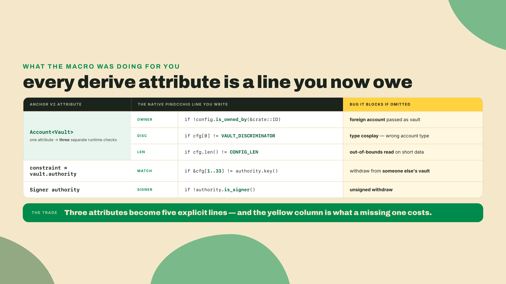
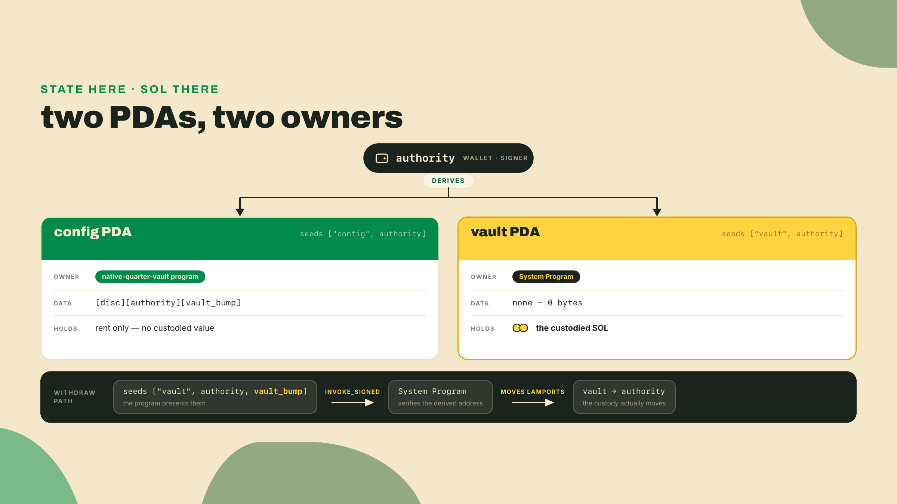
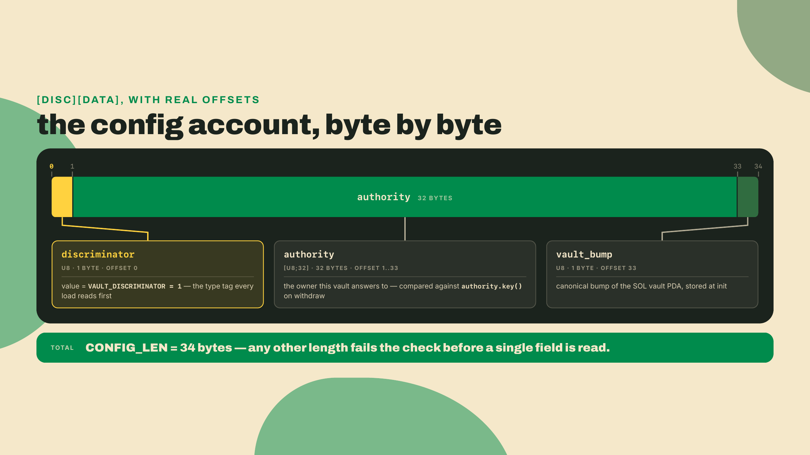
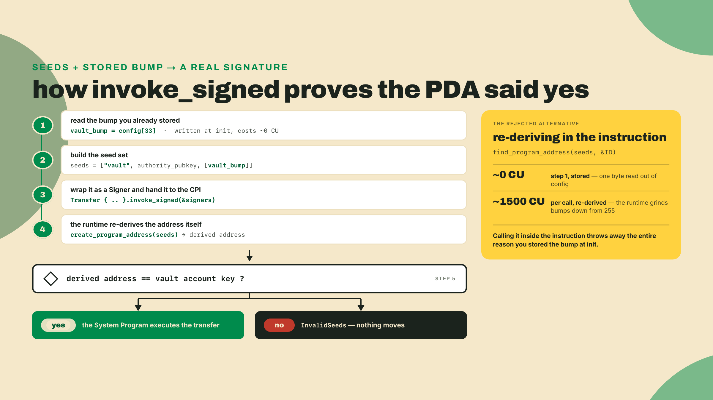
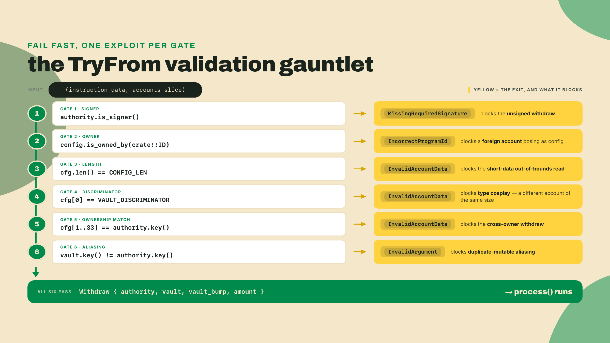
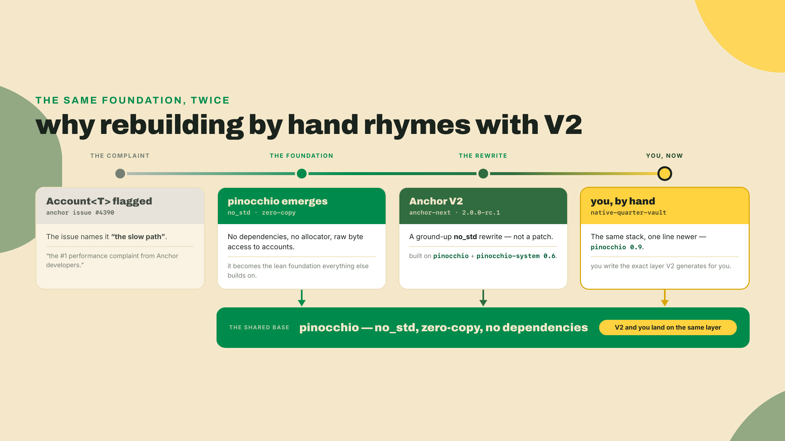
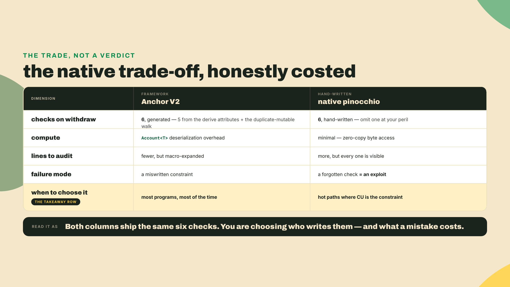

# Strip the framework I: rebuild the vault native

Last lesson you proved a build. You ran `solana-verify` locally, then verified-from-repo against your devnet program, and the two hashes matched. You watched the mainnet-only authority flow through OtterSec and Squads, demonstrated and clearly labelled as the thing you do not touch on devnet. The swap, R4, is shipped and provable. That is a real milestone: anyone can now check that the bytes on chain came from your source.

So here is the uncomfortable question. Every `#[account(...)]` line you leaned on to get there wrote a check for you. An owner check. A discriminator check. A signer check. You never saw them, because the derive macro emitted them into code you never read. Delete the framework and those checks do not disappear. They become lines you either write by hand or forget. And a forgotten check in a program that custodies lamports is not a bug, it is an exploit.

That is this lesson: you are going to rebuild R2, the quarter-vault, with no Anchor at all, on raw `pinocchio`, keeping the same behavior and the same acceptance gate. Lamports leave a PDA under program authority, and an over-withdraw is rejected. No macro in sight.

Scaffold it now, so the project exists while you read:

```bash
cargo new native-quarter-vault --lib
cd native-quarter-vault
# These three pin as a set: pinocchio-system 0.4 requires pinocchio ^0.9, and
# pinocchio-pubkey 0.3 requires ^0.9 too. Checked 2026-08-22; see the pins note
# at the end of the lesson before you bump any of them.
cargo add pinocchio@0.9 pinocchio-system@0.4 pinocchio-pubkey@0.3
# This crate has no anchor-lang in it, so it is the one place in the course where you
# pin litesvm by name: there is no anchor-v2-testing here to own the version for you.
# Checked 2026-09-01: litesvm 0.16 and solana-sdk 4 build clean on the pinocchio 0.9 line.
cargo add --dev litesvm@0.16 solana-sdk@4
```

One edit to `Cargo.toml` before anything compiles to something deployable. `cargo new --lib` gives you an rlib, and `cargo build-sbf` will not emit a `.so` from that. Add the crate type:

```toml
[lib]
crate-type = ["cdylib", "lib"]
```

`cdylib` is what produces the `.so` the runtime loads; `lib` keeps the crate usable as a normal Rust library — that serves unit tests inside the crate and rust-analyzer, not step 5's integration test, which never links your crate at all: it loads the compiled `.so` into LiteSVM with `add_program_from_file` and drives it over the wire, exactly as a validator would. Anchor writes this line for you in every scaffold, which is why you have never typed it.

One thing about how this lesson runs. Those four commands are all the typing the overview asks for: from here to the Lab I walk the shape and you read. In the Lab you code along, step by step. The Challenge at the end you do alone, cold, with no answer on the page. The framework is coming off in stages, and so is the scaffolding under you.

## Summary

You will build `native-quarter-vault`: a `no_std` pinocchio program with two instructions, `init` and a PDA-signed `withdraw`, dispatched from a single-byte discriminator. You will hand-write the validation that Anchor's `Account<T>` generated for you, sign a lamport transfer out of a PDA with `invoke_signed` using seeds you assemble yourself, and clear the exact same acceptance bar the framework version cleared, through a LiteSVM harness you write from scratch.

`no_std` means the standard library is off. No heap allocator you did not ask for, no `std::` anything, just `core` and whatever you choose to bring in. Be precise about what that is and is not, because the folklore version overreaches: ordinary Solana programs — every Anchor 1.x program included — are `std`-linked. The SBF toolchain ships a working, if trimmed, `std`, and the stock entrypoint installs a default bump allocator; that is exactly the hidden machinery `no_std` refuses. So this is not "the mode Solana programs actually run in." It is the mode V2 and pinocchio *chose*, and turning it on yourself is not an aesthetic choice: it is what keeps the binary small and the compute predictable, because nothing gets pulled in that you did not explicitly ask for. Here you flip that switch on the first line of the file.

The trade-off, stated plainly because it is the whole point of the module: native pinocchio buys back compute and hands you total control, but you now hand-write and must never forget every check the derive generated. Discriminator, owner, duplicate-mutable, signer, checked arithmetic. Omit one and you have shipped a vulnerability. This is precisely why the framework exists. You are not learning that Anchor is bad. You are learning exactly what it costs to earn, so you can decide when the CU is worth the risk.

## What the derive was doing for you

Here is the resonance that makes this exercise more than a stunt. Anchor V2, the RC you have been building on all course, `anchor-next` at `2.0.0-rc.1`, is itself a ground-up `no_std` rewrite built on pinocchio: its `lang-v2` crate depends on `pinocchio` and `pinocchio-system 0.6` directly. The crates you just added by hand are that same foundation, two minor lines back (V2's tree runs the pinocchio 0.11 line, where the core types have already been renamed; more on that in the pins note at the end). When you rebuild the vault raw, you are not doing an unrelated toy. You are hand-writing the exact layer the framework now generates.

Why did V2 go this way? Read GitHub issue #4390, the zero-copy manifesto that shaped the rewrite. It calls today's `Account<T>` "the slow path" and "the #1 performance complaint from Anchor developers." The whole V2 thesis is that the ergonomic account wrapper does deserialization and allocation work you often do not need, and that a leaner, zero-copy foundation should be the default. Stripping the framework by hand rhymes with V2's own design decision. You are following the same reasoning the maintainers did, one layer down.

Let me anchor the new mechanism to the one you already know. In Anchor, this was your vault account:

```rust
#[account(
    mut,
    seeds = [b"vault", authority.address().as_ref()],
    bump = vault.bump,
    constraint = vault.authority == *authority.address(),
)]
pub vault: Account<Vault>,
```

Every attribute on that struct is a check the macro turns into runtime code before your instruction body runs. `Account<Vault>` alone is three checks: the account is owned by your program, its first 8 bytes match the `Vault` discriminator, and the remaining bytes are cast into a `Vault`. `seeds` plus `bump` re-derives the PDA and confirms the address. The `constraint` hook confirms the stored authority field equals the passed authority account. That is a lot of security packed into six lines.

(Two V2 spellings worth re-noticing, because they are exactly the ones the migration module maps: the wrappers dropped their `<'info>` lifetimes, and `.key()` became `.address()`. The stored-key check itself used to be the `has_one = authority` keyword; V2 deprecates it in favor of the expression forms `address = ...` and `constraint = ...` you met in module 3; the keyword still parses, with a warning.)



Read the right column once more, because those are not hypotheticals: each one is a class of exploit that has drained real programs, and each one is a single `if` that Anchor wrote and you did not. Now you write them.

### The account model, and why it is two PDAs

R2 in Anchor was tidy enough to feel like one thing. Native, you see the seam the framework was papering over: a lamport-custody vault and its authority record are two different accounts, owned by two different programs, and that is not a complication, it is the truth Anchor was hiding.

Here is the constraint that forces it. The System Program will only move lamports out of an account it owns, and that account must have zero data. So the account that actually holds the SOL has to be System-owned and empty. But you also need somewhere to store your own state: the discriminator, the authority, the canonical bump. That has to be an account your program owns and can write. One account cannot be both. So the vault is a pair.

- The **config** PDA, seeds `[b"config", authority]`, owned by your program. It stores `[discriminator][authority][vault_bump]`. This is your `Account<Vault>` analogue, the thing you validate.
- The **vault** PDA, seeds `[b"vault", authority]`, owned by the System Program, holding the custodied SOL. Your program never writes its data (there is none). It signs to move its lamports.



If you are picturing R2 as a single `Account<Vault>` that both stored the bump and held lamports, it was doing the direct-lamport trick: debiting its own account balance because the program owned it. That works, but it is not a signed transfer, and it is not what we want to teach here. The invoke_signed path, where a PDA presents its seeds to authorize a real System transfer, is the pattern you will reach for constantly (token vaults, escrows, anything where the PDA must be a CPI signer). So we build the version that signs.

### The discriminator: one byte, load-bearing

Anchor spends 8 bytes on an account discriminator, the SHA-256-derived tag that says "this is a `Vault`, not a `Config` or a `Pool`." Native, you can spend one. A single `u8` gives you 255 account types, which is plenty, and the layout is dead simple: byte 0 is the tag, the rest is data.



The house rule matters here and it is not optional: read and write these fields as byte-array slices with accessor logic, never by casting the raw buffer to a packed struct with an unaligned pointer. A `&*(ptr as *const Config)` on a `#[repr(C, packed)]` struct produces unaligned references, which is undefined behavior in Rust and one of the sharpest footguns in the whole native ecosystem. Slices with `copy_from_slice` and `from_le_bytes` are safe, obvious, and only a hair slower, so that is what we will use throughout.

Now picture the exact attack the discriminator stops, because a class of bug you can see is a class of bug you will remember. Suppose Mallory finds some other instruction in your program that happens to create a 34-byte program-owned account for an unrelated purpose, a scoreboard row, say, the same length as your config. If your withdraw skipped the discriminator check, she could pass that scoreboard row into the slot where the config belongs. The owner check would pass, because your program genuinely owns the row. The length check would pass too, because it is 34 bytes. Your code would then read bytes 1 through 32 as an authority and byte 33 as a bump, out of data that was never a vault config in the first place. Now be honest about what happens next *in this particular program*, because it is subtler than a drain. Gate 5 compares those bytes against the key that actually signed, so a row Mallory can use has to carry her own pubkey in bytes 1 through 32 — and then the withdraw seeds, `[b"vault", her key, bump]`, derive her own vault, the one she could already withdraw from legitimately. The other gates happen to contain the damage here. But that containment is coupling, not design: it holds only because this program's seed scheme binds every vault to the same key gate 5 checks. Reuse this dispatch shape in a program where the config names a beneficiary, a fee destination, or any authority who is not the signer, and the crafted row becomes a real theft. The single byte at offset 0 is what makes the whole question moot: a scoreboard row carries a different tag, the check fails, and the transaction reverts before a lamport moves. That is type cosplay, and the discriminator is the costume check at the door — the check that keeps every downstream gate meaning what it says instead of leaning on its neighbours. Hold the mapping: the discriminator is the account's type tag, and the check that the tag matches is the exact line Anchor writes before it ever hands you typed data.

### Signing as a PDA: seeds plus the stored bump

A PDA has no private key. It "signs" a CPI by presenting, at call time, the exact seeds it was derived from plus its bump, and the runtime reconstructs the address to confirm the program is allowed to sign for it. That is the whole trick, and it is the part Anchor assembles for you. Be precise about *when*, because it is the same distinction m03-l1 drew: Anchor precomputes the canonical bump at macro time only when every seed is a byte literal. This vault's seeds carry the authority's key, so on the Anchor side the bump was derived during validation and then stored — which is exactly the byte you are about to read back by hand.

Native, you assemble the signer yourself. And you use the **stored** canonical bump, the one you saved at init, not a freshly derived one. Re-running `find_program_address` inside every instruction burns roughly 1500 compute units per call, because it grinds through bump candidates from 255 downward looking for the one that is off-curve. You paid for that once at init. Store it, reuse it. Anchor stores it in the account and reads it back through `bump = vault.bump`; you do the same by hand.



### The check V2 added: no duplicate mutables

There is one more check on the list, and it is the newest, so it is worth calling out on its own. Anchor V2 disallows duplicate mutable accounts by default, a guard the older versions left entirely to you. Here is why it earns its place. Your withdraw takes a writable `vault` and a writable `authority` destination, and nothing you have written so far stops a caller from passing the same account for both of them. If `vault` and `authority` resolve to the same key, you are moving lamports from an account into itself, and depending on the logic wrapped around such a transfer you can end up double-counting a balance or skating past a guard that quietly assumed the two accounts were distinct. The native fix is a key comparison you add by hand, `if self.vault.key() == self.authority.key() { return Err(ProgramError::InvalidArgument); }`, placed in the same `TryFrom` gauntlet as the other five. Anchor V2 writes that guard across your whole struct, silently, at compile time — and its rule is broader than the hand-rolled pair check: an aliased account fails validation the moment *any* of its slots is mutable, not only when two mutable slots collide. It is on the list precisely because forgetting it bit enough people to make the maintainers turn it on for everyone.

That is the shape. Overview done. Now build it.

## Lab: build the native quarter-vault

Code along from here. Each step is a real edit; the checkpoints tell you what "working" looks like.

### Step 1: turn off std and set up dispatch

Open `src/lib.rs` and replace it entirely. The first line is the one Anchor never let you see.

```rust
// Not a bare `#![no_std]`. The on-chain build has no std; the host test harness in
// step 5 does, and needs it. `cfg_attr` turns no_std on for every build except the
// test one. Anchor's entrypoint does the same thing behind your back.
#![cfg_attr(not(test), no_std)]

use pinocchio::{
    account_info::AccountInfo,
    entrypoint,
    instruction::{Seed, Signer},
    program_error::ProgramError,
    pubkey::Pubkey,
    sysvars::{rent::Rent, Sysvar},
    ProgramResult,
};
use pinocchio_system::instructions::{CreateAccount, Transfer};

// Generate the keypair, print its pubkey, and paste that string BOTH here and in
// the test's PROGRAM_ID const in step 5. They have to be the same or the test loads
// your program at an address `crate::ID` does not recognize, and gate 2 rejects
// every account with IncorrectProgramId for a reason that has nothing to do with
// your code:
//   mkdir -p target/deploy
//   solana-keygen new --no-bip39-passphrase \
//     -o target/deploy/native_quarter_vault-keypair.json
//   solana address -k target/deploy/native_quarter_vault-keypair.json
pinocchio_pubkey::declare_id!("<paste your generated pubkey>");

/// Account type tag. Anchor spends 8 bytes on this; we spend one.
const VAULT_DISCRIMINATOR: u8 = 1;

/// [disc:1][authority:32][vault_bump:1]
const CONFIG_LEN: usize = 1 + 32 + 1;

entrypoint!(process_instruction);

fn process_instruction(
    _program_id: &Pubkey,
    accounts: &[AccountInfo],
    data: &[u8],
) -> ProgramResult {
    match data.split_first() {
        Some((0, rest)) => Init::try_from((rest, accounts))?.process(),
        Some((1, rest)) => Withdraw::try_from((rest, accounts))?.process(),
        _ => Err(ProgramError::InvalidInstructionData),
    }
}
```

`split_first` peels the first byte off the instruction data. That byte is the **instruction tag**: `0` is init, `1` is withdraw. Keep it separate in your head from the **account discriminator** two lines above it, `VAULT_DISCRIMINATOR`, which tags the account's *type* rather than the call. Anchor spends eight bytes on each and calls both a discriminator; here they are one byte each and they both happen to be small numbers, so naming them apart is the only thing keeping them apart. This is your dispatch table, the thing Anchor's `#[program]` macro generated from your function names. Checkpoint: `cargo build-sbf` **fails**, and it should. `process_instruction` names `Init` and `Withdraw`, which do not exist yet, so you get two `cannot find type in this scope` errors and nothing else. That is the expected state after step 1; what you are confirming is that the errors are those two and not something about `no_std`, the entrypoint, or a missing import. Steps 2 through 4 fill those two names in, and the first green build arrives at the end of step 4.

### Step 2: validate with TryFrom (this is the worked part, read every line)

This is the layer Anchor's derive replaces, and I am showing it in full because forgetting one line here is the whole danger. Add the `Withdraw` struct and its `TryFrom`:

```rust
struct Withdraw<'a> {
    authority: &'a AccountInfo,
    vault: &'a AccountInfo,
    vault_bump: u8,
    amount: u64,
}

impl<'a> TryFrom<(&'a [u8], &'a [AccountInfo])> for Withdraw<'a> {
    type Error = ProgramError;

    fn try_from(
        (data, accounts): (&'a [u8], &'a [AccountInfo]),
    ) -> Result<Self, ProgramError> {
        let [authority, config, vault, _system_program, ..] = accounts else {
            return Err(ProgramError::NotEnoughAccountKeys);
        };

        // 1. signer check     (Anchor: Signer)
        if !authority.is_signer() {
            return Err(ProgramError::MissingRequiredSignature);
        }
        // 2. owner check      (Anchor: Account<T> proves program ownership)
        if !config.is_owned_by(&crate::ID) {
            return Err(ProgramError::IncorrectProgramId);
        }

        let cfg = config.try_borrow_data()?;

        // 3. data-length check (Anchor: deserialization would fail on short data)
        if cfg.len() != CONFIG_LEN {
            return Err(ProgramError::InvalidAccountData);
        }
        // 4. discriminator check (Anchor: the account type tag)
        if cfg[0] != VAULT_DISCRIMINATOR {
            return Err(ProgramError::InvalidAccountData);
        }
        // 5. stored-authority check (Anchor: constraint = vault.authority)
        if &cfg[1..33] != authority.key().as_ref() {
            return Err(ProgramError::InvalidAccountData);
        }
        // 6. duplicate-mutable check (Anchor V2: on by default)
        if vault.key() == authority.key() {
            return Err(ProgramError::InvalidArgument);
        }

        // read the stored canonical bump before the borrow drops
        let vault_bump = cfg[33];

        let amount = u64::from_le_bytes(
            data.try_into()
                .map_err(|_| ProgramError::InvalidInstructionData)?,
        );

        Ok(Withdraw { authority, vault, vault_bump, amount })
    }
}
```

Six checks. The first five line up one for one with the comparison table above, and the sixth is the duplicate-mutable guard V2 turns on by default, added here to the same gauntlet. The `let [authority, config, vault..] = accounts else` pattern is your account ordering, the thing `#[derive(Accounts)]` enforced by struct field order. Get the order wrong here and everything downstream reads the wrong account, which is itself a footgun the framework removed.



Notice what TryFrom buys you: by the time `process()` runs, validation is done and the business logic never re-checks. That separation, validate-then-act, is exactly what Anchor gives you by splitting the accounts struct from the instruction body, and you just built it by hand.

Checkpoint: `cargo build-sbf` still fails, and the error list should have shrunk by one: `Withdraw` now exists, so what remains is the missing `Init` plus an unresolved `Withdraw::process`, which you write next. Watch for one error that is not on that list: a borrow-checker complaint about `cfg` means your `let vault_bump = cfg[33];` read escaped the scope where the `try_borrow_data` guard is alive. Copy the byte out while the borrow is held, exactly where the comment puts it, instead of trying to read through the guard after it drops.

### Step 3: the withdraw body, and the completion you fill in

Now the signing. This is the completion step: the guard and the invoke_signed seeds are the lines you assemble. Add the `impl`:

```rust
impl Withdraw<'_> {
    fn process(&self) -> ProgramResult {
        // --- the guard (you harden this cold in the Challenge) ---
        if self.amount == 0 {
            return Err(ProgramError::InvalidInstructionData);
        }
        // Bound only. The transfer below does the actual debit; this line exists
        // to turn an over-withdraw into a clean error instead of a failed CPI.
        let _remaining = self
            .vault
            .lamports()
            .checked_sub(self.amount)
            .ok_or(ProgramError::InsufficientFunds)?;

        // --- the completion: assemble the signer from seeds + STORED bump ---
        let bump = [self.vault_bump];
        let seeds = [
            Seed::from(b"vault"),
            Seed::from(self.authority.key().as_ref()),
            Seed::from(&bump),
        ];
        let signer = [Signer::from(&seeds)];

        Transfer {
            from: self.vault,
            to: self.authority,
            lamports: self.amount,
        }
        .invoke_signed(&signer)?;

        Ok(())
    }
}
```

The seeds array is the exact set the PDA was derived from: the literal `b"vault"`, the authority's pubkey bytes, and the stored bump wrapped as its own one-byte seed. That last `Seed::from(&bump)` is the stored-bump slice. Get this array wrong, in order or in content, and `invoke_signed` derives a different address, the runtime refuses to sign, and you get `InvalidSeeds`. There is no partial credit from the runtime here: the seeds are right or the transfer does not happen.

The guard uses `checked_sub`, never `self.vault.lamports() - self.amount`. A naive subtraction underflows and panics (or worse, wraps) on an over-withdraw. `checked_sub` returns `None`, which you map to a clean error. This is the checked-arithmetic check Anchor never made you think about, because you rarely subtracted account balances directly inside a constraint.

Checkpoint: one error left, the missing `Init`, which step 4 supplies. An `InvalidSeeds` at this stage is impossible, because nothing has run yet; a compile error naming `Seed` or `Signer` means the import line from Step 1 is missing.

### Step 4: init, the hand-rolled account creation

Init creates the config account and stores the bumps. This is your `CreateAccount` CPI, funding rent-exempt lamports, and it is signed by the config PDA's own seeds because a PDA must authorize its own creation.

```rust
struct Init<'a> {
    authority: &'a AccountInfo,
    config: &'a AccountInfo,
    config_bump: u8,
    vault_bump: u8,
}

impl<'a> TryFrom<(&'a [u8], &'a [AccountInfo])> for Init<'a> {
    type Error = ProgramError;

    fn try_from(
        (data, accounts): (&'a [u8], &'a [AccountInfo]),
    ) -> Result<Self, ProgramError> {
        let [authority, config, _system_program, ..] = accounts else {
            return Err(ProgramError::NotEnoughAccountKeys);
        };
        if !authority.is_signer() {
            return Err(ProgramError::MissingRequiredSignature);
        }
        let [config_bump, vault_bump] = data else {
            return Err(ProgramError::InvalidInstructionData);
        };
        Ok(Init { authority, config, config_bump: *config_bump, vault_bump: *vault_bump })
    }
}

impl Init<'_> {
    fn process(&self) -> ProgramResult {
        // Blunt reinit guard: rejects ANY lamports at the address, including a
        // stranger's 1-lamport pre-fund (a griefing seam Anchor's init tolerates
        // by funding the shortfall instead -- see the note below the code).
        if self.config.lamports() > 0 {
            return Err(ProgramError::AccountAlreadyInitialized);
        }

        let bump = [self.config_bump];
        let seeds = [
            Seed::from(b"config"),
            Seed::from(self.authority.key().as_ref()),
            Seed::from(&bump),
        ];
        let signer = [Signer::from(&seeds)];

        let rent = Rent::get()?;
        CreateAccount {
            from: self.authority,
            to: self.config,
            lamports: rent.minimum_balance(CONFIG_LEN),
            space: CONFIG_LEN as u64,
            owner: &crate::ID,
        }
        .invoke_signed(&signer)?;

        // write [disc][authority][vault_bump] as bytes, no packed-struct cast
        let mut cfg = self.config.try_borrow_mut_data()?;
        cfg[0] = VAULT_DISCRIMINATOR;
        cfg[1..33].copy_from_slice(self.authority.key().as_ref());
        cfg[33] = self.vault_bump;
        Ok(())
    }
}
```

That first guard is doing a job the framework did more carefully, and the difference is worth naming precisely. Anchor's plain `init` refuses to run on an account that is already *initialized* — allocated data, or a foreign owner — but it deliberately accepts a merely pre-funded, unallocated one: its generated code tops up the rent shortfall, allocates, and assigns, precisely so a stranger airdropping one lamport at your PDA's address cannot brick your init forever. The blunt `lamports() > 0` gate above buys reinit protection at the cost of re-opening exactly that griefing seam. For a teaching vault the trade is acceptable, said out loud: the signal Anchor actually keys on is allocation and ownership, not balance, and a hardened native init checks `data_len() == 0` plus system ownership and *funds the shortfall* instead of refusing. `init_if_needed` is a different footgun entirely — it quietly permits re-initialization of live state, which is why the house rules ban it. Native, every one of these distinctions is one `if`, and each is yours to remember.

The bumps arrive in the instruction data, computed client-side by `find_program_address`. That keeps the expensive derivation off chain and out of your compute budget, and it is why the client, not the program, does the grinding. Checkpoint: `cargo build-sbf` compiles clean now, first green build of the lesson, and `target/deploy/native_quarter_vault.so` exists. If there is no `.so`, the `crate-type` line from the scaffold step is missing.

### Step 5: the acceptance gate

Now the same acceptance *bar* R2 cleared, through a new harness. Not the same file: R2's test built Anchor-generated instruction data and account structs, and neither exists here, so the assertions carry over and the harness is written from scratch. LiteSVM is the same in-process Solana VM you have used since module 2: no validator, no ledger, just your program loaded into a bank you drive from Rust. You added it with `cargo add --dev litesvm@0.16 solana-sdk@4` at the start. Create `tests/withdraw.rs`:

```rust
use litesvm::LiteSVM;
use solana_sdk::{
    instruction::{AccountMeta, Instruction},
    pubkey,
    pubkey::Pubkey,
    signature::{Keypair, Signer},
    system_program,
    transaction::Transaction,
};

// The SAME string you pasted into declare_id! in step 1.
const PROGRAM_ID: Pubkey = pubkey!("<paste your generated pubkey>");

#[test]
fn withdraw_signed() {
    let mut svm = LiteSVM::new();
    let program_so = concat!(env!("CARGO_MANIFEST_DIR"), "/target/deploy/native_quarter_vault.so");
    svm.add_program_from_file(PROGRAM_ID, program_so).unwrap();

    let authority = Keypair::new();
    svm.airdrop(&authority.pubkey(), 10_000_000_000).unwrap();

    let (config, config_bump) =
        Pubkey::find_program_address(&[b"config", authority.pubkey().as_ref()], &PROGRAM_ID);
    let (vault, vault_bump) =
        Pubkey::find_program_address(&[b"vault", authority.pubkey().as_ref()], &PROGRAM_ID);

    // init
    let init_ix = Instruction {
        program_id: PROGRAM_ID,
        accounts: vec![
            AccountMeta::new(authority.pubkey(), true),
            AccountMeta::new(config, false),
            AccountMeta::new_readonly(system_program::id(), false),
        ],
        data: vec![0, config_bump, vault_bump],
    };
    let bh = svm.latest_blockhash();
    let tx =
        Transaction::new_signed_with_payer(&[init_ix], Some(&authority.pubkey()), &[&authority], bh);
    svm.send_transaction(tx).unwrap();

    // fund the SOL vault PDA (this teaching build has no deposit instruction)
    svm.airdrop(&vault, 2_000_000_000).unwrap();

    // a valid PDA-signed withdraw succeeds
    let mut data = vec![1u8];
    data.extend_from_slice(&500_000_000u64.to_le_bytes());
    let ix = Instruction {
        program_id: PROGRAM_ID,
        accounts: vec![
            AccountMeta::new(authority.pubkey(), true),
            AccountMeta::new_readonly(config, false),
            AccountMeta::new(vault, false),
            AccountMeta::new_readonly(system_program::id(), false),
        ],
        data,
    };
    let before = svm.get_balance(&vault).unwrap();
    let bh = svm.latest_blockhash();
    let tx = Transaction::new_signed_with_payer(&[ix], Some(&authority.pubkey()), &[&authority], bh);
    svm.send_transaction(tx).unwrap();
    assert_eq!(before - svm.get_balance(&vault).unwrap(), 500_000_000);

    // an over-withdraw is rejected
    let mut data = vec![1u8];
    data.extend_from_slice(&999_000_000_000u64.to_le_bytes());
    let ix = Instruction {
        program_id: PROGRAM_ID,
        accounts: vec![
            AccountMeta::new(authority.pubkey(), true),
            AccountMeta::new_readonly(config, false),
            AccountMeta::new(vault, false),
            AccountMeta::new_readonly(system_program::id(), false),
        ],
        data,
    };
    let bh = svm.latest_blockhash();
    let tx = Transaction::new_signed_with_payer(&[ix], Some(&authority.pubkey()), &[&authority], bh);
    assert!(svm.send_transaction(tx).is_err());
}
```

Build the program to a `.so`, then run the test:

```bash
cargo build-sbf
cargo test -p native-quarter-vault
```

You want to see:

```
test withdraw_signed ... ok
```

That is the same gate. Lamports left the PDA under program authority, and the over-withdraw was rejected. Your native vault does exactly what the framework vault did. Sit with that for a second: no `#[account]`, no `#[program]`, no `declare_id!` magic beyond a const, and the acceptance test does not know the difference.



Before you leave the Lab, look back at the trade-off in the account model. Two PDAs and about eighty lines bought you what six Anchor attributes gave for free, plus the compute you saved by not deserializing through `Account<T>`. That is the deal native offers, and it is a real deal, not a scold. The next visual is the one to screenshot, because it is the answer to "when is this worth it."



## Challenge: the native vault's withdraw guard

Now you go solo. No answer on the page.

In the Lab, the guard rode along inside `process()`. The Challenge makes you write it cold, as a standalone pure function with explicit return codes, the way a fuzzer or a unit test would poke it. This is the exact logic that stands between your vault and an underflow, extracted so you can see it clearly.

The starter, at `lessons/m09-l1/native-vault-withdraw/starter.rs`:

```rust
/// Compute the vault's remaining balance after a withdraw, or an error code.
///
/// Contract (an i128 so the harness can signal failure without a Result):
///   -2  : the withdraw amount is zero (invalid input)
///   -1  : the withdraw exceeds the balance (over-withdraw)
///   >=0 : the remaining balance after a valid withdraw
///
/// The starter skips BOTH guards and subtracts naively. It happens to return the
/// right number for a normal withdraw, and is wrong (and unsafe) for both rejects.
const fn vault_withdraw(balance: u64, amount: u64) -> i128 {
    // TODO: reject a zero-amount withdraw with -2
    // TODO: reject an over-withdraw with -1 using balance.checked_sub(amount)
    (balance as i128) - (amount as i128)
}
```

The `const fn` is doing framework-free work: the graded file carries compile-time assertions under the function — the m03-l3 device, and what compile-only grading actually enforces — so the unguarded starter does not build, and each failing assertion names the reject case it stands for. Fitting, for the lesson where you write every check by hand: here even the harness is nothing but the compiler.

Acceptance criteria:

- a zero-amount withdraw returns `-2`, and it is rejected before the balance check
- an over-withdraw returns `-1`, computed via `checked_sub`, never a naive subtraction — including `(100, 102)`, where a naive `balance as i128 - amount as i128` produces `-2`, which is the *zero-amount* code. The sentinels are decisions, not arithmetic; if your subtraction can produce one, you do not have a guard
- withdrawing from an *empty* vault is an over-withdraw, `-1`, not a zero-amount rejection: the zero guard is on the amount, never on the balance
- a valid withdraw returns the remaining balance, across the whole `u64` range — `(u64::MAX, 1)` returns `u64::MAX - 1`, which is why the return is `i128` and why doing the subtraction in `i64` fails
- draining to exactly zero is allowed (this teaching vault's SOL PDA carries no data and the challenge is deliberately rent-agnostic; a production withdraw would also floor at the rent-exempt minimum, which is what R2's own guard did)

Two hints, and then it is yours. First: a zero-amount withdraw is invalid input, so reject it before you touch the balance. Second: `balance.checked_sub(amount)` returns `None` exactly when the withdraw exceeds the balance, which is your over-withdraw signal. Build until the assertions stop firing, then run the `tests.json` vectors until every case is green.

If you get the ordering wrong, watch which assertion fails. A zero-amount that returns `0` instead of `-2` means you subtracted before you rejected. That ordering bug is the same one that ships in real programs, so learning to see it here is the point.

## Where you landed, and what is next

You just deleted the framework and the vault still works. You wrote the six checks the derive wrote for you, in the order that matters, and you can now point at each line and name the exploit it blocks. You signed a lamport transfer out of a PDA with seeds you assembled by hand and a bump you stored instead of re-deriving. And you passed the same LiteSVM gate on raw pinocchio that you passed on Anchor V2. That is not a toy. That is the foundation the framework is built on, in your own hands.

One honest note on pins, and it is the sharpest version-discipline lesson in this module, so read it rather than skimming it. Everything above is verified against `pinocchio 0.9` / `pinocchio-system 0.4` / `pinocchio-pubkey 0.3`, Rust `1.89.0`, and Anchor V2 `2.0.0-rc.1`, checked 2026-08-22. Those three pinocchio crates must move as a set: `pinocchio-system 0.4` declares `pinocchio ^0.9`, and so does `pinocchio-pubkey 0.3`. Mix a major-ish minor and cargo will happily resolve two copies of `pinocchio` into your tree, at which point the `AccountInfo` your entrypoint hands you is a different type from the one `Transfer` wants, and the error message will be about trait bounds rather than about versions.

The crate is pre-1.0 and the API is genuinely shifting, and it has already shifted once past where you are standing. The rename is not a rumor about a main branch: **it shipped**. On the `pinocchio 0.11` line (0.11.0, 2026-04-08), `AccountInfo` became `AccountView`, `Pubkey` became `Address` (from `solana-address`), `is_owned_by` became `owned_by`, `try_borrow_data`/`try_borrow_mut_data` became `try_borrow`/`try_borrow_mut`, and `Seed`/`Signer` moved from `instruction` into `cpi`. That 0.11 line is exactly what Anchor V2's own `lang-v2` sits on, via `pinocchio-system 0.6`, which is why the V2 code you have been writing all course says `.address()` and not `.key()`. This lab pins the 0.9 line deliberately, because it is the last line where `pinocchio-pubkey` still resolves and where the pre-rename names make the one-for-one mapping to your old Anchor V1-era instincts legible. Port it to 0.11 as an exercise and you will feel the rename twice: once in the type names, once in `try_borrow_mut` taking `&mut self`, which is the API telling you it stopped pretending interior mutability was free.

So: pin exactly, move the three as a set, and re-read the pins note before you bump. Tracking a floating latest on a pre-1.0 crate is how you find out the hard way that a type name is a version.

Your native vault works. But which of your hand-written lines did Anchor generate for free, and which did it make impossible to get wrong in the first place? Next lesson we put your `lib.rs` side by side with the actual macro expansion and read the diff line by line. You will find out exactly how close your hand-rebuild came, and where the framework quietly protects you in ways you did not replicate.
