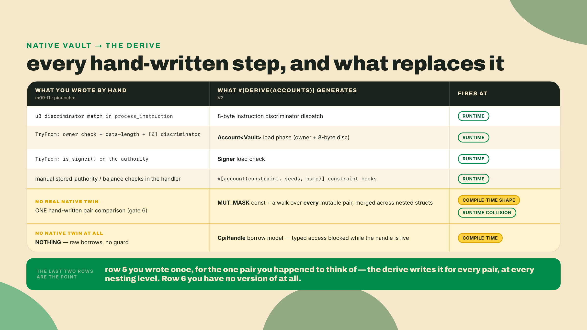
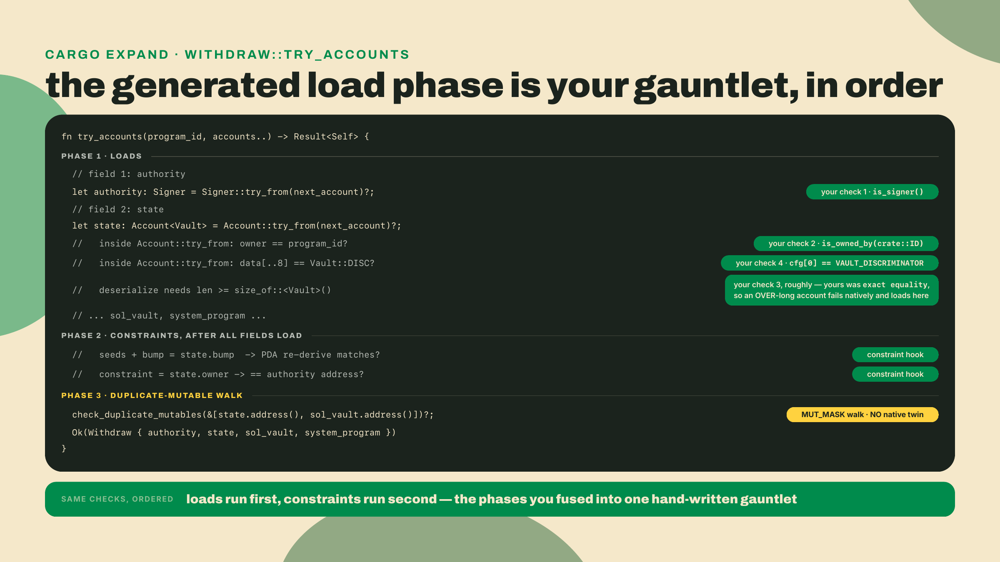
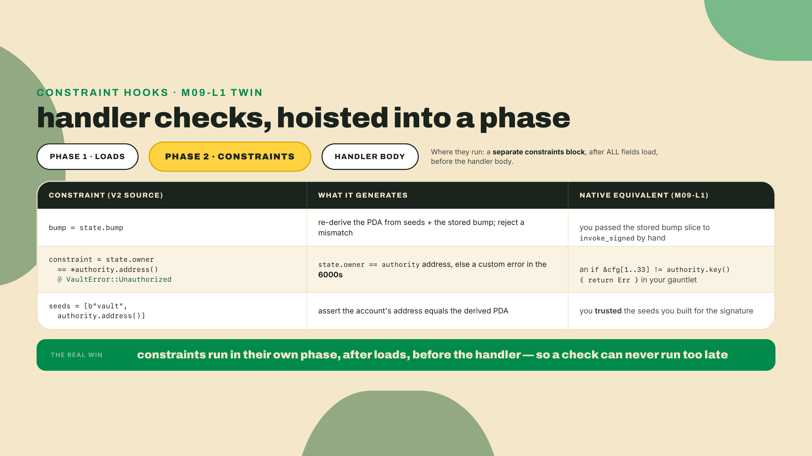
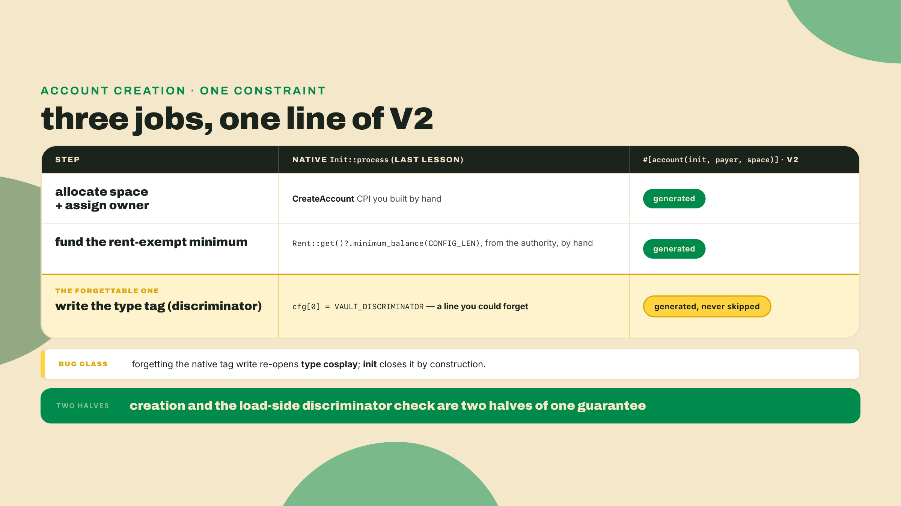
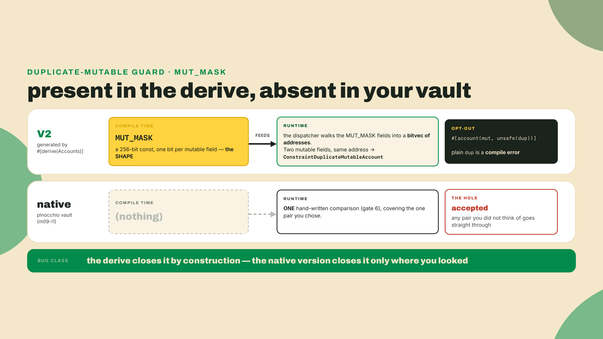
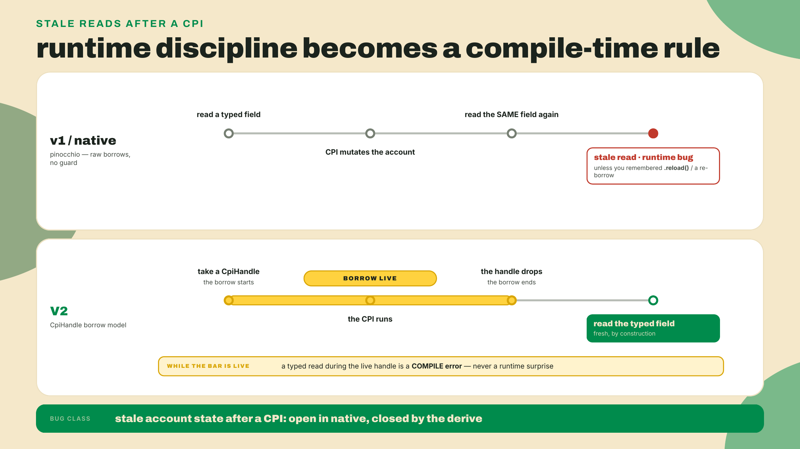
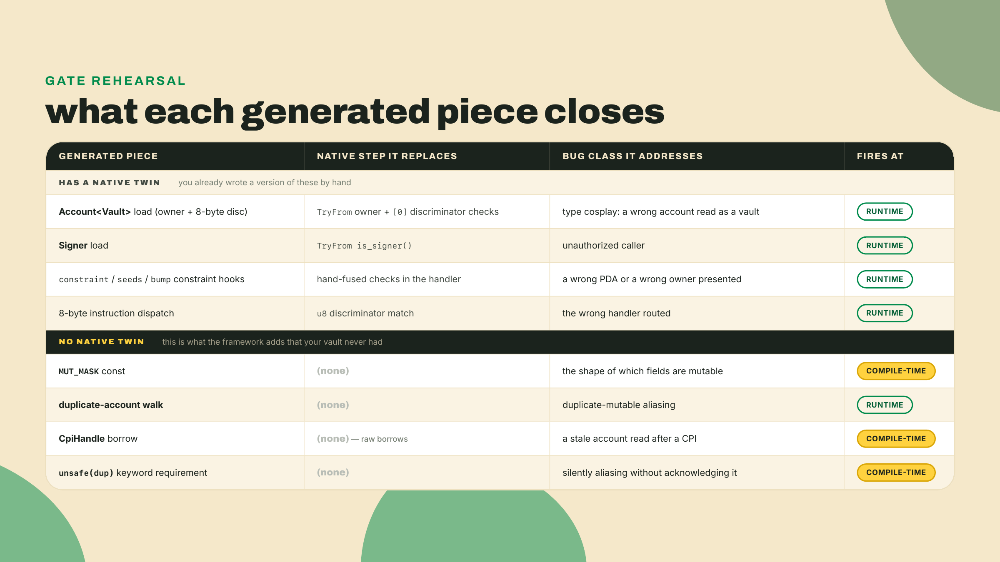
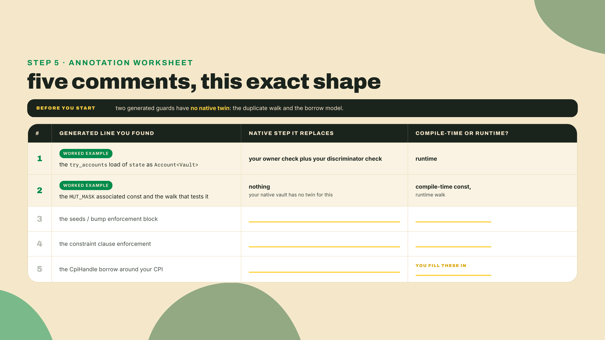

# Strip the framework II: the diff, and what Anchor generates

You just rebuilt the quarter-vault native on pinocchio: a manual single-byte discriminator, `TryFrom` validation, a hand-rolled `invoke_signed`, and it passed the same LiteSVM withdraw gate R2 passed. Lamports left the PDA under program authority, the over-withdraw bounced, and there was no Anchor anywhere in the crate. That was the build half of build-it-twice. This is the reframe half.

Here is the load-bearing claim, stated first so you leave with it even if you read nothing else. The `#[derive(Accounts)]` you deleted last lesson is not magic. It is exactly the load, check, and dispatch you just wrote by hand, plus a duplicate-account walk and a borrow guard you cannot omit by accident. You can opt out of the walk, deliberately, per field, and the spelling makes you say so out loud. Reading the expansion proves that sentence, line by line, against your own code.

So let us read it. The tool that prints the code a macro generates is `cargo-expand`. Install it once and point it at your framework vault:

```bash
cargo install cargo-expand   # re-check crates.io for a newer version at build time
# The expansion itself runs under a nightly rustc (-Zunpretty=expanded is a nightly
# flag): `rustup toolchain install nightly` once, and cargo-expand finds it on its
# own. The workspace stays pinned to stable 1.89.0; only the expansion borrows nightly.
cargo expand --package quarter-vault > expanded.rs
```

Open `expanded.rs` and search for `impl` blocks near your `Withdraw` struct. What you are looking at is a `try_accounts` function the derive wrote for you, and it is doing the same load-and-check jobs your native `TryFrom` did, in an order you can now name. That file, beside your native vault, is the whole lesson. Everything below annotates the diff.

One expectation to set before you look, because it will save you from hunting for something that is not there. Every generated block printed in this lesson is a **stylized** version of the real output: the same structure and the same order, with the noise removed. Real expansion is thousands of lines of fully-qualified paths, generated lifetimes, and `#[automatically_derived]` blocks, and reading it verbatim teaches you less than reading it against a sketch. So the sketches are a map, not a transcript, and the identifiers in them are descriptive rather than exact. When the Lab asks you to find something in your own output, it will give you the pattern to grep for rather than a symbol name to match, for exactly this reason.

The autonomy fade this lesson: the diff walkthrough is fully worked, done for you piece by piece. The Lab has you run `cargo expand` on your own vault and annotate the real output against your native code. The three-line gate at the end is solo, no scaffolding.



## The diff

### Load order: the four checks, generated in one function

Open your native `TryFrom` for the withdraw. It ran six gates before the handler ran, and it ran them in an order you chose. Here is the load half of it, trimmed to the four gates that have a generated twin:

```rust
impl<'a> TryFrom<(&'a [u8], &'a [AccountInfo])> for Withdraw<'a> {
    type Error = ProgramError;

    fn try_from(
        (data, accounts): (&'a [u8], &'a [AccountInfo]),
    ) -> Result<Self, ProgramError> {
        let [authority, config, vault, _system_program, ..] = accounts else {
            return Err(ProgramError::NotEnoughAccountKeys);
        };

        // 1. signer check on the authority
        if !authority.is_signer() {
            return Err(ProgramError::MissingRequiredSignature);
        }
        // 2. owner check: the config PDA must be owned by THIS program
        if !config.is_owned_by(&crate::ID) {
            return Err(ProgramError::IncorrectProgramId);
        }

        let cfg = config.try_borrow_data()?;

        // 3. data-length check, then 4. discriminator check
        if cfg.len() != CONFIG_LEN {
            return Err(ProgramError::InvalidAccountData);
        }
        if cfg[0] != VAULT_DISCRIMINATOR {
            return Err(ProgramError::InvalidAccountData);
        }
        // gates 5 (stored authority) and 6 (duplicate-mutable) follow; see m09-l1
        // ...
    }
}
```

One naming bridge, so the diff reads cleanly, and it is worth being exact because the two builds do not share addresses. Both programs have the same two *roles*: a program-owned record holding the discriminator, the authority, and a bump, and a System-owned account holding the actual SOL. Natively you called them `config` and `vault`, seeded `[b"config", authority]` and `[b"vault", authority]`. The framework version calls them `state` and `sol_vault`, seeded `[b"vault", authority]` and `[b"sol", authority]`. Different program ids and different seed literals, so these are four distinct addresses, not two. What maps across is the role, and that is the only thing the diff below is claiming. Where the native version stores one bump (the SOL vault's) and derives the config's from instruction data, the framework version stores both, which is the one structural difference worth carrying: it is why `state.bump` and `state.sol_bump` both appear in the constraints below and only one byte appears in your native layout.

Now look at the V2 source that generated the equivalent. It is four fields and two attributes:

```rust
#[derive(Accounts)]
pub struct Withdraw {
    #[account(mut)]
    pub authority: Signer,

    #[account(
        mut,
        seeds = [b"vault", authority.address().as_ref()],
        bump = state.bump,
        constraint = state.owner == *authority.address() @ VaultError::Unauthorized,
    )]
    pub state: Account<Vault>,

    #[account(
        mut,
        seeds = [b"sol", authority.address().as_ref()],
        bump = state.sol_bump,
    )]
    pub sol_vault: SystemAccount,

    pub system_program: Program<System>,
}
```

Your four native checks are all in there, and the expansion makes it obvious. You cracked open this same `try_accounts` machinery in module 1, on the greeter, in the abstract. Here it is again, but now every generated line has a hand-written twin you can point at. `Account<Vault>` on the `state` field generates the owner check (your check 2) and the 8-byte discriminator check (your check 4) inside its load, before any constraint runs. `Signer` on `authority` generates your signer check (check 1). The `data.len()` guard you wrote by hand (check 3) is the load itself refusing to read a slice too short for the type. Note the one asymmetry: yours was exact equality, `cfg.len() != CONFIG_LEN`, so a program-owned account that is too *long* fails your check and passes the framework's. Neither is wrong, they are different claims. Exact equality is a stronger statement about the account's shape; a minimum is what a framework can promise across every account type it does not know about. Four hand-written `if` statements collapse into two type annotations, and the type is the check.

Notice the constraint spelling while you are here, because it is a V2 delta the migration module will make you apply by hand. On the v1 line this stored-key check was the `has_one = owner` keyword. V2 deprecates `has_one` in favor of the expression forms. It still parses (and the derive deliberately keeps the keyword's source span just so codegen can underline it with a warning), but the recommended spellings are now `address = expr` for the common "this account must equal that stored key" case and `constraint = expr @ err` when you need a comparison the narrow keyword could never express. Module 3 taught the swap. Here you are just reading its output.

One structural fact the expansion nails down, and it is the one people get wrong. Field order is load order. The derive walks your struct top to bottom, so `authority` loads before `state`, which is why the constraint on `state` can safely compare against a field declared above it. Reorder the fields and you genuinely change which check runs against loaded versus unloaded data. In your native version you controlled that order by hand, by choosing where to put each `if`. The framework controls it by field position. Same order, different lever.

Make that concrete, because it is the one place field order is not cosmetic. The constraint on `state` reads the `owner` field out of the loaded `state` account and compares it against the `authority` declared above it. If you moved `state` above `authority` in the struct, the constraint would reference a field that had not loaded yet, and the derive would reject the struct at compile time rather than run a check against nothing. Native, the same mistake is a silent reorder of two `if` blocks that no compiler would ever flag. The framework turned an ordering discipline into an ordering guarantee.



### Constraint hooks: the checks that run after everything loads

The load phase proves each account is what it claims to be. The constraint hooks prove the accounts relate to each other correctly. In the source above, `seeds`, `bump = state.bump`, and the `constraint = state.owner == ...` clause are constraint hooks, and the expansion places them in a distinct block that runs only after every field has loaded.

You wrote these by hand too, just fused into your handler instead of split out. Your native withdraw re-derived the PDA and compared it, or trusted the seeds you passed to `invoke_signed`; it read `state.owner` and refused a caller who did not match. The framework pulls that logic out of the handler entirely and runs it as a separate phase, which is why a V2 constraint can never fire "too late." It physically cannot run after your handler, because it lives in a function that finishes before your handler starts. Native, that guarantee was your discipline. Generated, it is structural.



### The dispatcher: your u8 match, grown to eight bytes

Your native program routed instructions with a match on the first byte of the instruction data: `0` was init, `1` was withdraw. That was the whole dispatcher. The V2 dispatcher does the identical job with an 8-byte tag instead of one byte. It reads the leading eight bytes of the instruction data, matches them against each handler's instruction discriminator, and routes to the right handler. Then, and only then, does `try_accounts` run for that instruction.

The difference is width, not kind. One byte gives you 255 instructions; eight bytes of `sha256` over `global:withdraw` give you a collision-resistant tag that a client can build without coordinating a number registry with you. You traded a byte for a hash and bought wire compatibility. That is the entire upgrade. If you internalized the `global:` namespace trap on the greeter in module 1, you already know the one place this bites: there is no `instruction:` namespace, and a hand-built tag from the wrong preimage routes to nothing.

### The init path: creation, and the discriminator you had to write yourself

The withdraw path shows load, check, and dispatch. There is one job the withdraw never touches, and diffing it is where the discriminator bug class comes home: account creation. Your native `Init::process` created the config account by hand. You computed the rent-exempt lamports, ran a `CreateAccount` CPI to allocate the space and assign your program as owner, and then, critically, you wrote the type tag into byte zero yourself:

```rust
// native Init::process: fund rent, allocate, assign owner, THEN tag the account by hand
let lamports = Rent::get()?.minimum_balance(CONFIG_LEN);
CreateAccount {
    from: self.authority,
    to: self.config,
    lamports,
    space: CONFIG_LEN as u64,
    owner: &crate::ID,
}
.invoke_signed(&signer)?;
// forget this next line and the account has NO discriminator: type cosplay is now open
let mut cfg = self.config.try_borrow_mut_data()?;
cfg[0] = VAULT_DISCRIMINATOR;
```

The V2 source that generates all of that is one constraint:

```rust
#[account(
    init,
    payer = authority,
    space = Vault::DISCRIMINATOR.len() + Vault::INIT_SPACE,
    seeds = [b"vault", authority.address().as_ref()],
    bump,
)]
pub state: Account<Vault>,
```

`init` generates the `CreateAccount` CPI, computes and funds the rent-exempt minimum from `payer`, and writes the discriminator into the new account, all three. The one line you were most likely to forget natively, tagging byte zero, is the one the framework will never skip. Miss the tag in your hand-rolled init and any program-owned account of the same length can later be deserialized as a vault, the exact type-cosplay class the discriminator check on the load side exists to close. Native, creation and validation are two places you must keep in agreement by hand. Generated, `init` on the way in and the load check on the way out are two halves of one guarantee the derive writes together.



### MUT_MASK: the guard your native vault does not have

Here is the first place the expansion does something your native code only gestures at. Search the generated `try_accounts` and you will find a walk over the mutable fields. You did write *one* line in that family: gate 6 of your `TryFrom`, the `if vault.key() == authority.key()` comparison, which closes exactly one pair because that is the pair you happened to think of.

That is the difference, and it is the whole difference. Your gate 6 is a hand-picked comparison over one pair of accounts you chose. The derive's walk is exhaustive: every mutable field against every other, computed from the struct rather than from your attention, and merged across nested structs so a collision between a direct field and one buried in a composite is caught too. Add a third mutable account to your native struct and gate 6 does not grow with it; add one to a V2 struct and the mask does, silently, at compile time. The class is not closed by remembering to check one pair. It is closed by never having to remember.

You met `MUT_MASK` in module 1, so the mechanism is not new: the derive computes a compile-time 256-bit associated const marking which fields are mutable, and the dispatcher walks that mask against a runtime bitvec of addresses as accounts load, returning `ConstraintDuplicateMutableAccount` if two mutable fields carry the same address. The shape is fixed when you compile; the collision is only knowable when the transaction lands. What is new is seeing the gap in coverage. Put your native gate 6 beside the expansion and the difference is scope: one pair you named, versus every pair the struct implies.

Is that class real, or is it a cosmetic guard you could skip? It is real. Imagine a batch handler that touches two prize pools, both writable. Pass the same pool for both and a naive handler debits it once, credits it twice, and the accounting is wrong in a way no test with distinct accounts would ever surface. The framework rejects that call before your handler runs. When you genuinely mean to pass one account twice, you opt out per field, and the opt-out is spelled to make you feel it: `unsafe(dup)`. Plain `dup` without the `unsafe` wrapper is a compile error, on purpose. The keyword is the seatbelt light.

There is a detail here that matters more next lesson than it does now, so file it. The duplicate walk is not per-struct, it is per-tree. The derive emits a trait that reports the mutable keys a struct serializes on exit, and when you nest one Accounts struct inside another, the outer struct calls each inner struct's implementation and merges the keys into one set. So the guard catches a collision even when the same account arrives once as a direct field and once buried inside a composite. That is exactly the shape the capstone floor-registry has: it composes the cabinet-counter, the vault, the escrow, and the swap, and a naive hand-rolled composition is precisely where a duplicate-mutable aliasing bug would hide. Your native vault never had this walk at one level. A native registry would need it at every level, merged, and would have it nowhere.



### CpiHandle: the borrow that replaced a footgun you had to remember

The second line with no native twin is not a line at all. It is a compile error the framework can produce and your native code cannot.

In the 0.x line, and in v1, you could hold a deserialized account, invoke a CPI that mutated that account's bytes on-chain, and then read your stale in-memory copy as if nothing had changed. The fix was to call `.reload()` after the CPI, and forgetting was a classic way to ship a bug that reasoned about pre-CPI state. Your native vault has the same exposure with the discipline stripped away: you hold raw borrows, and nothing stops you from re-reading a value you captured before the transfer as though it were current.

V2 makes that mistake unrepresentable. You no longer hand a CPI an `AccountInfo` clone; you hand it a `CpiHandle`, obtained with `.cpi_handle()` or `.cpi_handle_mut()`, and a `CpiHandle` is a live Rust borrow of the account held for as long as the handle is in scope. While it is live, the borrow checker will not let you form a second borrow of the same accounts to read their typed data. The read and the handle cannot coexist. You met this head-on in module 4, where reordering a read past the handle's drop was the whole fix. In the diff, its meaning sharpens: this is the guard that replaced `.reload()`, and it lives at compile time. You do not remember it. The compiler does.

```rust
// V2 withdraw: the CpiHandle borrow is live for exactly this call
let owner = *ctx.accounts.authority.address();  // deref: an owned copy, not a borrow
let signer_seeds: &[&[&[u8]]] =
    &[&[b"sol", owner.as_ref(), &[ctx.accounts.state.sol_bump]]];

let cpi = CpiContext::new(
    ctx.accounts.system_program.address(),   // hands back an &Address directly
    Transfer {
        from: ctx.accounts.sol_vault.cpi_handle_mut(),
        to:   ctx.accounts.authority.cpi_handle_mut(),
    },
).with_signer(signer_seeds);
transfer(cpi, amount)?;
// only after `transfer` consumes `cpi` and the handles drop
// can you read ctx.accounts typed data again, and it is live.
```

Your native equivalent signed the same withdrawal by hand, in the seed vocabulary your own program used, and the runtime accepted it exactly the same way:

```rust
// From Withdraw::process last lesson. `self.vault_bump` is the byte you read out
// of config[33]; `b"vault"` is the SOL PDA's seed literal in the native build,
// which is `b"sol"` in the framework build. Same role, different word.
let bump = [self.vault_bump];
let seeds = [
    Seed::from(b"vault"),
    Seed::from(self.authority.key().as_ref()),
    Seed::from(&bump),
];
let signers = [Signer::from(&seeds)];
Transfer {
    from: self.vault,
    to: self.authority,
    lamports: self.amount,
}
.invoke_signed(&signers)?;
```

Both move lamports out of a keyless PDA under program authority. The difference is invisible in the happy path and decisive in the buggy one: the native version has no compiler standing between you and a stale post-CPI read. The framework built one out of the type system.

The stakes of that guard rise the moment programs compose, which is next lesson's whole subject. A single-instruction vault reads its own state, transfers, and returns; the window for a stale read is narrow. The capstone floor-registry CPIs into the vault, the escrow, and the swap, and after each of those calls returns, any typed field you were holding is a candidate for staleness. That is precisely the situation v1 shipped bugs in, because the reload you owed was one call deep in a composition you were also trying to reason about. In V2 the borrow model scales with the composition for free: each `CpiHandle` you take borrows exactly the accounts that call touches, for exactly its scope, and the compiler tracks all of them at once. The deeper you compose, the more the guard is doing, and the more the native version would have been asking you to remember.



### The tradeoff: reading it is not a license to hand-roll it

Now the honest part, because this lesson can be misread. You can read the expansion. That is a real skill and it demystifies the macro for good. But do not confuse "I can read it" with "I should write it." The generated checks are the point. The MUT_MASK walk and the CpiHandle borrow are not overhead the framework imposes on you; they are two bug classes the framework makes impossible to forget, and your native vault, elegant as it is, forgot both. The native version is a teaching mirror, not a shipping target. The framework's whole value is the guard it will not let you omit.

Which is also why trusting the generated code is reasonable rather than lazy. The glue that walks your accounts is itself fuzzed and undefined-behavior-checked, the same way you would check a program you were about to put money behind. You saw that in module 1: the framework's own test suite carries the witnesses. The code the derive writes for you is verified, not asserted. Your native vault, by contrast, is trustworthy only to the degree you personally tested it, and you tested one instruction on one happy path plus one rejection. The derive's `try_accounts` is exercised across the whole ecosystem and checked by tooling you did not have to write. That asymmetry is the quiet argument for the framework: not that you cannot write the checks, but that the framework's version of them is tested harder than yours ever will be.

One number keeps that trust honest. The generated code has a measured, moving cost, and the V2 team measures it in the open. PR #4914, merged 2026-08-13, revised the headline V2 benchmarks down, from 95% to 94% bytecode reduction and from 9.9x to 8.8x CU improvement. A framework that corrects its own marketing downward is a framework you can trust the upward numbers from. The code you are diffing is fast, and it is honestly fast.

So when is native actually the right call, and not just an exercise? The honest answer is narrow but real: a hot path where you have profiled a specific instruction, proven the framework's per-account overhead is your bottleneck, and decided the CU you buy back is worth owning every check by hand forever. That is a rare, measured decision, not a default. And notice the tell in V2's own design: the framework is itself a no_std rewrite on pinocchio, and it offers `asm-v2` for exactly those hot paths, so you can drop to the metal for one instruction without abandoning the guards on all the others. The framework is not the enemy of the CU you want back. It is the way to spend that budget where it matters and keep the seatbelts everywhere else. Reading the expansion is what earns you that judgment. Now you can look at a generated `try_accounts`, see what each line costs and what bug it closes, and decide, with numbers, which lines you would ever want to own yourself. For almost all of them, the answer is no.



### One name that survives, and one beat beneath the floor

Two footnotes before the Lab, because both are traps.

First, `AccountLoader`. If you grep the V2 docs you will still find it, and it is tempting to read that as "nothing changed." Wrong the other way, too: do not read the account-model rewrite as "AccountLoader is gone." It is neither. In V2 `AccountLoader` is repurposed as a sequential account cursor, and the docs warn that it means something else now than it did on the 0.x line. Same name, different job. Carry that carefully.

Second, the floor of this course has a trapdoor, and you get exactly one look through it. Anchor V2 can link hand-written sBPF: `asm-v2` lets you drop a hot path to assembly and have the framework link it into the program the VM runs. Look once. It tells you the framework has an escape hatch all the way down to the instruction the machine executes. Then stop, because chasing sBPF depth here is the wrong course. Why the VM runs it that way — the loader, the syscalls, the verifier, programs with no framework at all — belongs to the Low-Level Solana course, not this one. If you want to go beneath sBPF, that is the door. Here, we stay framework-level: what the macro expands to, and why.

## Lab: annotate your own expansion

Autonomy fade, stated plainly: steps 1 through 4 are worked, you run the commands and read the output; step 5 you write the annotations yourself against your real file.

1. **Generate the expansion.** From your framework quarter-vault crate, run the two commands from the top of the lesson. If `cargo expand` errors on a macro, do not go looking at your `anchor` binary — `cargo expand` never consults the Anchor CLI at all. Expansion is rustc running the proc macros out of this crate's *dependency graph*, so the only thing that decides which grammar expands is the `anchor-lang` row in `Cargo.toml`. If that row reads a 1.x version, `CpiHandle` and Pod-`Account` code cannot expand no matter which CLI sits on your PATH; pin `anchor-lang = "2.0.0-rc.1"` from crates.io, exactly as m01-l2 showed (`2.0.0-rc.1` as of 2026-08-22; re-check for a newer rc or a stable tag), and re-run. That inversion — the crate pin selects the framework, never the CLI — is the macro lesson wearing tooling clothes, and it comes back as the punchline of m10.

2. **Find the load phase.** Search `expanded.rs` for `try_accounts` near `Withdraw`. Mark the line that loads `state` as an `Account<Vault>`. Open your native `TryFrom` beside it and draw a line from that single generated load to your two hand-written checks: the owner check and the discriminator check. Confirm they load before any constraint runs.

3. **Find the constraint block.** Below the loads, find where the `constraint`, `seeds`, and `bump` clauses are enforced. Map each to the hand-fused check it replaced in your native handler. Confirm the block runs after all fields load and before the handler.

4. **Find the missing guards.** Grep the expansion for `MUT_MASK`, which is a real associated const and will be there verbatim, then read outward from it to find where it is tested against the accounts the caller sent. Do not grep for a function name; the sketches above named one for readability and the real emitted code may inline it or call it something else. Then put your native gate 6 beside it and confirm the difference in scope: yours compares one pair, this compares every pair the mask marks. Then look at your native `invoke_signed` and confirm there is no compiler guard preventing a stale post-CPI read, the job the `CpiHandle` borrow does in V2.



5. **Write the annotations.** In your own words, in a comment beside each of five generated lines, name the native step it replaces and write `compile-time` or `runtime` next to it. Checkpoint: you should be able to point at every line of your native `TryFrom` and dispatch and find its generated twin, and point at exactly two generated guards, the duplicate walk and the borrow model, that have no twin at all. If you can do that, you have read the framework.

## Challenge: the three-line gate

Solo, no scaffolding. Take these three lines from a V2 expansion. For each, state which native step it replaces (a load-order check, a constraint hook, or a dispatch or duplicate walk) and whether it fires at compile time or at runtime.

```text
(a)  let state: Account<Vault> = Account::try_from(next_account_info)?;
(b)  const MUT_MASK: [u64; 4] = /* bits set for state, sol_vault, authority */;
(c)  /* the walk over every mutable pair, run in the dispatcher */
```

Write one sentence per line. The distinction the gate turns on is the one between (b) and (c): they are the same feature at two different times. If your three answers hold, and you can say why (b) is compile-time and (c) is runtime without blurring them, you own the diff.

No answer key here. Three tests, if you want to check yourself without being told: for each line, can you name the file and roughly the line number in your own native vault where the equivalent lives, or say honestly that there is none? Can you say what information the line depends on, the struct definition or the caller's actual accounts? And for (b) and (c) specifically, can you explain why they cannot both fire at the same time? If all three answers come easily, you own the diff. If the third one is the one that sticks, re-read the MUT_MASK section, because that seam is the whole point of the gate.

That is the reframe half of build-it-twice, closed. You built the vault by hand, you diffed it against the machine that generates it, and neither one is a black box anymore. You can now predict what the derive writes and why, which means you can finally make the framework carry its full weight instead of a single instruction at a time. Next lesson you assemble the whole arcade floor, one program that runs the counter, the vault, the escrow, and the swap by CPI, and you take it through the full lifecycle to a verified devnet deploy. Now go make it carry the whole floor.
