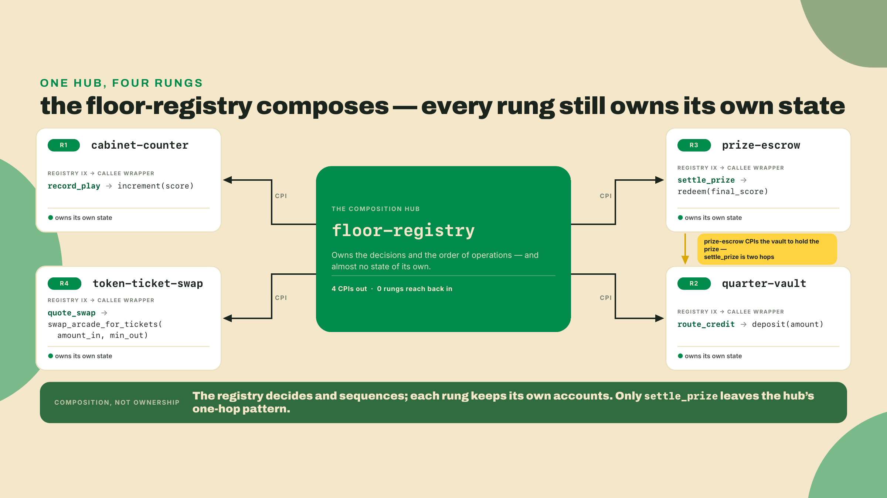
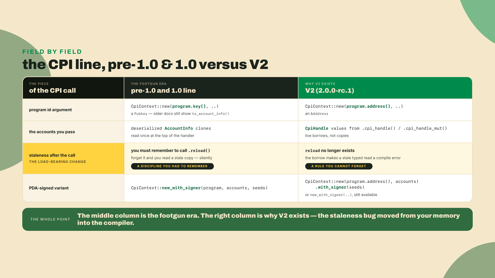
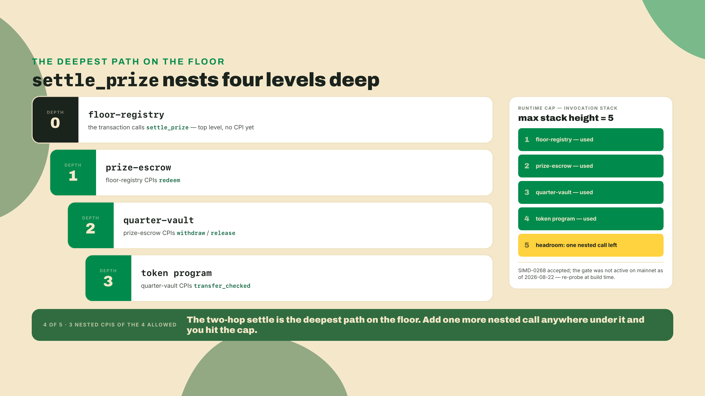
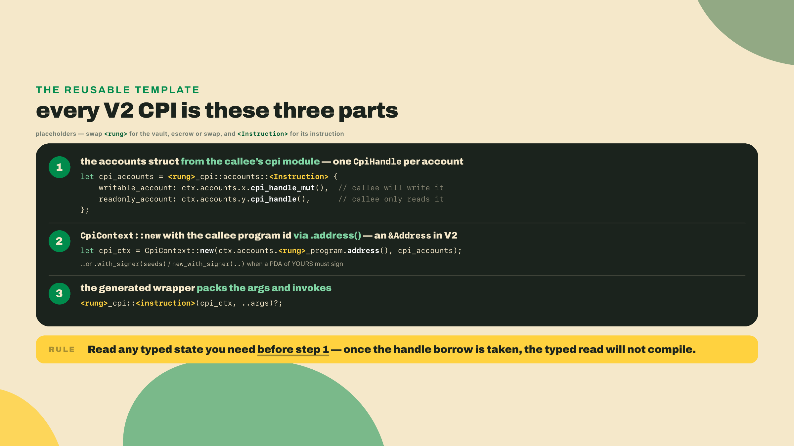
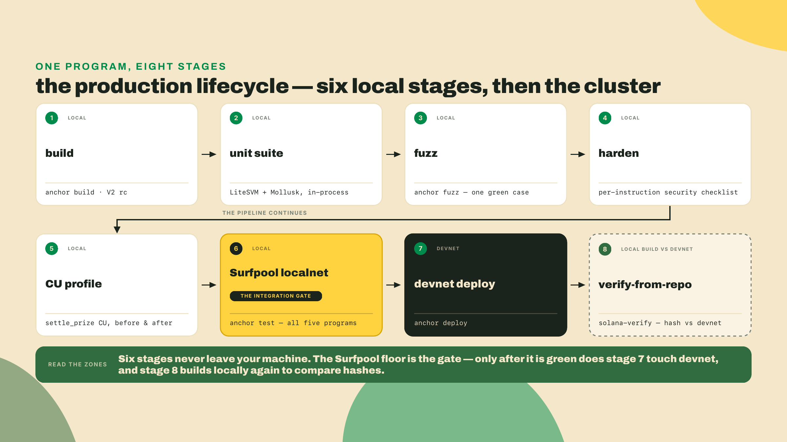
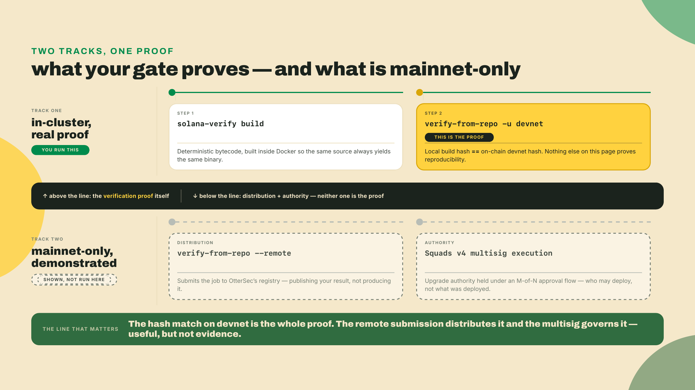
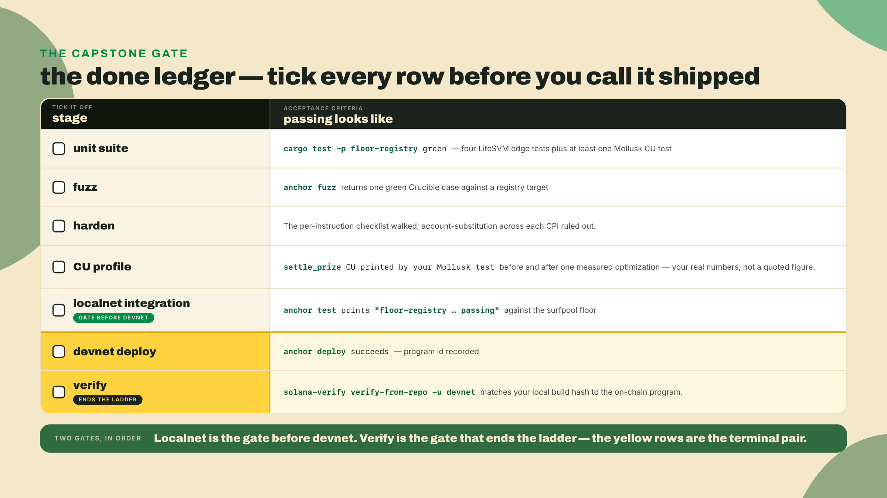

# Capstone: run the whole arcade floor

You just diffed your native vault against the V2 macro expansion, line by line, and took the one-beat asm-v2 peek. You can now predict what the derive writes and why, which means the framework stopped being a black box the last time you ran `cargo expand`. Good. Hold onto that, because this lesson spends it.

Here is the pain, stated plain. Every rung you built stands alone. The cabinet-counter counts. The quarter-vault holds. The prize-escrow settles. The token-ticket swap quotes. Four programs, four green test suites, one of them — the swap — already live on devnet, and not one of them knows the others exist. An arcade is not four machines in four rooms. It is a floor: a play bumps a counter, the counter feeds a credit into a vault, a win releases a prize from an escrow, and a pile of tickets swaps for something at the counter. Nobody wired the floor yet. That is the capstone, and it is almost entirely yours.

One piece of housekeeping first, because everything below assumes it. R1 has been living on its own since m02-l1: `anchor init cabinet-counter` made it a workspace of one, while R2, R3, and R4 all grew inside the `quarter-vault` workspace you started in m03-l1. The floor builds, tests, and deploys as one workspace — one `Anchor.toml`, one `target/deploy` every harness loads from, one `idls/` directory — so copy R1 in before you scaffold anything. The original workspace stays where it is — this is a copy, not a move, and you can delete the old tree once the registry builds. From the root of that arcade workspace:

```bash
cp -R ../cabinet-counter/programs/cabinet-counter programs/cabinet-counter
cp ../cabinet-counter/target/deploy/cabinet_counter-keypair.json target/deploy/
```

Then register it the way `anchor new` would have: add it to the workspace `Cargo.toml`'s `members` if that list names programs one by one rather than globbing `programs/*`, and add its row under `[programs.localnet]` in `Anchor.toml`. Keep the `declare_id!` the crate arrives with — that id matches the keypair you deployed R1 with in m02-l1, and hand-editing it orphans the deploy. The second `cp` above carried its keypair across, so `anchor keys sync` will confirm the pair still matches. One last check while you are in there: its `solana-address` row has to read the range from m02-l1, because R1 is a member of this workspace now and a single member holding an equality fails the whole resolve.

Now let us make the floor exist before the theory. Scaffold the last program and point it at the four you already shipped. No new install for this part:

```bash
anchor new floor-registry   # adds programs/floor-registry to the workspace
```

Then wire the registry to the four rungs the same way the escrow reached the vault in m04-l3 — through their interfaces, four times over. First, harvest every rung's IDL into the workspace-root `idls/` directory. The rungs must be named *before* the registry ever compiles, because `declare_program!` reads the JSON at macro-expansion time:

```bash
mkdir -p idls
for rung in cabinet-counter quarter-vault quarter-prize token-ticket-swap; do
  ( cd programs/$rung && anchor idl build -o ../../idls/$(echo $rung | tr '-' '_').json )
done
```

(Your `idls/quarter_vault.json` already exists from module 5's last re-harvest; the loop simply refreshes all four to whatever the rungs say today, which is the only IDL state worth building against.)

The registry's `Cargo.toml` then carries **no rung rows at all** — this is the diff against every multi-crate workspace you have seen before, and it is a deletion:

```toml
[dependencies]
# The rc.1 crates landed on crates.io (2026-08-12), and that is where the LIBRARY comes
# from course-wide: a published version is immutable. The CLI is the git build (see m01-l2).
anchor-lang = "2.0.0-rc.1"
# The pins from m01-l2 — every program crate in this course carries them (issue #4937's class).
wincode = { version = "0.5", features = ["derive"] }
# The arcade-workspace row, identical to the one every rung has carried since m02-l1.
# Step 4 puts Mollusk in this crate, and Mollusk's SVM stack reaches solana-address
# ^2.6.1; the ceiling is what the pin was always for — 2.6.1 is still wincode 0.5, and
# 2.7.0 is the version that moved. The registry and the four rungs share one
# workspace and one lock, so all five members must read this row, not just this one.
solana-address = ">=2.6.1, <2.7"
# No `{ path = "../<rung>", features = ["cpi"] }` rows — the rungs arrive as IDLs.
```

and the top of `programs/floor-registry/src/lib.rs` names the four rungs (R3 is the crate `quarter-prize`, m04-l3's scaffold — "prize-escrow" is the role it plays on the floor, not the name cargo knows it by):

```rust
use anchor_lang::prelude::*;

declare_program!(cabinet_counter);
declare_program!(quarter_vault);
declare_program!(quarter_prize);
declare_program!(token_ticket_swap);
```

Why not four path-dep rows with the scaffold's `features = ["cpi"]` hook, the way half the Anchor tutorials you have read do it? Because on rc.1 that road physically ends at one rung. `cpi` turns on `no-entrypoint`, and under `no-entrypoint` each consumed program exports its dispatch function as an unmangled symbol — so the moment a program references the `cpi` modules of *two* such rungs, the SBF link dies on `duplicate symbol: __anchor_dispatch`, and a registry that composes four rungs never links at all. The same hook has a second, quieter failure: a workspace-root `cargo build-sbf` feature-unifies `no-entrypoint` onto the consumed rung itself and emits a `.so` with *no entrypoint symbol* — it builds clean, sits in `target/deploy/` looking deployable, and the loader rejects it. `declare_program!` is not a workaround grudgingly adopted; it is V2's own cross-program mechanism, it generates the CPI surface in interface mode where no dispatch symbol exists to collide, and the course retired the `cpi` feature rows the day the four-rung floor became the goal.

Run `anchor build`. It will compile a registry that does nothing yet, but the four generated modules are now in scope, and the compiler will start telling you exactly which handles each rung expects. That feedback loop is the whole lab.

**Summary.** The floor-registry is one Anchor V2 program that composes the four rungs by CPI: it increments a cabinet's counter (R1), routes credits through the quarter-vault (R2), settles prizes through the prize-escrow (R3), and quotes through the swap (R4). You will wire the R1 edge as a worked step, then build the rest solo, then carry the whole thing through the full production lifecycle this course has been teaching: a LiteSVM plus Mollusk suite, one green fuzz case, a security-checklist pass, a CU profile with one measured optimization, a Surfpool localnet run of the five-program floor together, a devnet deploy, and a local verify-from-repo that proves your build reproduces the bytecode on chain. When `anchor test` prints `floor-registry ... passing` against the localnet floor and your verify matches, you are done.

The autonomy fade, said out loud so you know what is yours. The R1 counter CPI is worked for you in full, because accretion in this course is always demonstrated, never handed over finished. The CPI grammar you reuse for the other three rungs is on the page. Everything after that (the vault, escrow, and swap instructions, then every lifecycle step) is the capstone. It is solo. I will show you the shape of each move and the command that proves it, and you will run it against your own code.

## The floor as one program

Start with the picture, because the registry is easiest to hold as a hub. It owns almost no state of its own. What it owns is the decisions about *when* to call each rung and *in what order*, and it delegates every actual state change to the program built for it. That is the entire argument for composition: the registry is a small thing you can reason about, bolted onto four proven things you already trust.



### Why one program and four CPIs, not one big program

Pause on the design choice before the mechanics, because it is the choice the whole capstone is arguing for. You could write one monolithic program that counts plays, holds credits, settles prizes, and quotes swaps, all in a single crate. It would deploy as one `.so`, it would need no CPIs, and it would run at one invocation depth. For a weekend project it is less code. So why is the registry a hub of four calls instead?

The answer is drift, and it is the same reason the escrow did not reimplement custody. Each rung is a bounded thing you have already tested, hardened, fuzzed, and profiled. Fold its logic into a monolith and you now own a second copy of that logic, one that shares nothing with the deployed rung and starts diverging the day you fix a bug in one and forget the other. Two copies of custody math is two custody bugs waiting to fall out of sync. Composing on the rungs means the registry owns exactly one responsibility, the decision about what to call and when, and every actual state change stays behind the interface of the program built for it. When you patch the vault, the floor gets the patch for free, because the floor never had its own vault. That is not a style preference. It is the difference between a codebase that gets safer as it grows and one that accumulates copies of the same mistake.

There is a second reason that only shows up at the seam: an interface you CPI into is a contract you can verify independently. The vault's tests prove the vault. The registry's tests prove the registry calls the vault correctly. Neither has to re-prove the other, and an auditor can read each in isolation. A monolith collapses those into one blob where the counting logic and the custody logic can quietly reach into each other's state, and now nothing is provable alone. Small things bolted onto proven things, each checkable by itself, is how you keep a growing program auditable. The CPI is the bolt.

### Composition is a CPI, and the grammar is the one you already wrote

There is nothing new to learn about how one program calls another. You did it in the escrow. The registry does the same thing four times. The V2 CPI grammar has three parts and you have used all three. First, the callee exposes a generated accounts struct, one `CpiHandle` per account, which you fill with `.cpi_handle_mut()` for the accounts the callee will write and `.cpi_handle()` for the rest. Second, `CpiContext::new` takes the callee's program id through `.address()` on its `Program` account, which in V2 hands over an `&Address`, not an `AccountInfo` clone. Third, the generated wrapper packs your arguments and invokes.

Worth pausing on the contrast, because it is the difference between the line you deleted and the line you kept.



The one habit that carries straight into the capstone: read any state you need *before* you open a handle. Once `.cpi_handle_mut()` borrows an account, you cannot touch that account through its typed view until the call consumes the `CpiContext` and the handle drops. That is not a rule you follow anymore. It is a rule the compiler follows for you, and it is exactly why the vault's swap read its reserves up front, once, before quoting. Keep doing that and the borrow checker will keep catching your stale reads before a validator ever sees them.

### The trust cost, and the depth ceiling

Composition is powerful, but name the trade honestly, because it is the point of the lesson. Every rung you CPI into is a rung you trust. The registry trusts the counter to bump the right cabinet, the vault to move the right lamports, the escrow to release only on a true condition. That trust is real code you can read and tests you already ran, which is far better than trusting a stranger's program. It is still trust, and it still costs.

Two costs are concrete. The first is invocation depth. The Solana runtime caps how deep a chain of CPIs can nest: the maximum invocation stack height is **5**, which is your top-level instruction plus four nested CPIs. A raise is specified, SIMD-0268, "Raise CPI Nesting Limit", status Accepted, which would take nesting from 4 to 8, but its feature gate, `6TkHkRmP7JZy1fdM6fg5uXn76wChQBWGokHBJzrLB3mj`, had no mainnet account when this lesson was written (probed 2026-08-22), so 5 is the number in force. Re-probe the gate at build time rather than trusting this sentence forever; a pending gate is exactly the kind of fact that flips between a course being written and a course being read. It matters here because `settle_prize` is a three-hop call: the registry CPIs the escrow, the escrow CPIs the vault, and the vault CPIs the token program. Count it: your top-level instruction plus three nested calls is stack height 4, so you have exactly one nested call of headroom left. That is the kind of number you could not compute at all when every program lived alone.



The second cost is the borrow discipline itself, but that one is a gift disguised as a cost: the compiler making you sequence your reads is the reason a two-hop settle does not silently pay out against a stale balance. You pay in a little rigidity up front and it buys you a class of 2am incident you will never have.

One property works in your favor across every rung, and it is worth naming because it changes how you reason about failure. A transaction is atomic. If any CPI in the chain returns an error, the whole transaction reverts, and every state change above it rolls back with it. So `settle_prize` cannot half-settle: if the escrow's condition check fails, the redeem CPI errors, and the deposit or counter bump earlier in the same transaction unwinds too. That is a real safety net, and it is also a trap if you lean on it as your only guard. Atomicity saves you when a call *errors*. It does nothing when a call *succeeds against a false premise*, which is exactly why the escrow checks the condition before it builds the release CPI rather than paying first and trusting the revert. Order is still your guard. Atomicity is the backstop, not the plan.

## Lab: wire the floor and run it end to end

This is the capstone lab. The R1 edge is worked. The rest is yours. I will keep the lifecycle steps terse, one command and the output that proves it, because by now you have run every one of these tools at least once and the capstone is about assembling them, not re-teaching them.

> Freshness note: this is written against the Anchor V2 release candidate on the 2.x line (the docs tree published under `v2`), `2.0.0-rc.1` as of 2026-08-22. Install the toolchain from the documented git channel (Step 0, `avm` cannot fetch the RC). The machine-default `anchor-cli 1.1.2` is the V1 line and will not compile the `CpiHandle` or `&Address` grammar below. Version pins in this lab carry the date they were checked; re-verify before you build.

**Step 0. Pin the toolchain.** One line, and the trap behind it is one you already know by heart — `avm install` still 404s on the RC, no GitHub Release was ever cut for the tag — so if the check fails, re-run m01-l2's git install (`--tag v2.0.0-rc.1`, `--locked`):

```bash
anchor --version           # expect: anchor-cli 2.0.0-rc.1
```

One version-line note so nobody trips: this course pins Solana CLI `3.1.10` as the local build and CI toolchain, which is what the verifiable build container uses. That pin is a reproducibility choice, not a claim about the current network. The current stable Agave release is a separate, faster-moving thing (v4.2.1 as of 2026-08-22; check `agave-install info` or `solana --version` at build time). Never read the `3.1.10` pin as "the current version of Solana."

**Step 1. The four interfaces are already in.** You harvested the IDLs and wrote the four `declare_program!` lines in the opening. Confirm `anchor build` still compiles the empty registry with all four generated modules resolved. `` error: `idls` directory not found `` means the harvest never ran — the rungs must be named before the registry compiles. A missing *item* inside a module (a function or field the compiler cannot find) means a stale JSON: re-run the harvest loop, because `declare_program!` compiles against the file, not the source.

**Step 2. Wire R1, the counter increment (worked for you).** A play on a cabinet is one CPI: the registry calls the counter's `post_score` — `increment` as m02-l1 first wrote it, renamed in m02-l2 when the cabinet grew a board. Here it is in full. Read every line, because this is the template you will copy three times.

```rust
use anchor_lang::prelude::*;

declare_program!(cabinet_counter);
declare_program!(quarter_vault);
declare_program!(quarter_prize);
declare_program!(token_ticket_swap);

// Everything a caller needs comes out of the generated module: the `cpi`
// builders, the rung's account types (`Cabinet`, straight from the IDL), and —
// unlike source-level consumption, where the caller hand-writes it — the
// Program<T> marker, at cabinet_counter::program::CabinetCounter, with its
// IDL_ADDRESS already filled from the JSON.
use cabinet_counter::cpi as counter_cpi;
use cabinet_counter::program::CabinetCounter;
use cabinet_counter::Cabinet;

declare_id!("F1oorReg1stry111111111111111111111111111111");

#[program]
pub mod floor_registry {
    use super::*;

    // A play bumps the cabinet's counter by CPI-ing into R1.
    // This is the accretion edge, wired as a worked step, not handed to you finished.
    pub fn record_play(ctx: &mut Context<RecordPlay>, score: u64) -> Result<()> {
        // Build the callee's accounts struct from HANDLES, not AccountInfos.
        // cpi_handle_mut() takes a live borrow of `cabinet` for the callee; while it is
        // held you cannot also touch `cabinet` through its typed view. That borrow IS the
        // reload discipline, enforced by the compiler instead of your memory.
        // Named after the INSTRUCTION, and m02-l2 renamed it: `increment` became
        // `post_score` when R1 grew a leaderboard, so the generated struct is
        // `accounts::PostScore`, not `accounts::Increment`.
        let cpi_accounts = counter_cpi::accounts::PostScore {
            cabinet: ctx.accounts.cabinet.cpi_handle_mut(),
            player: ctx.accounts.player.cpi_handle(),
        };

        // .address() hands the callee's program id as &Address (V2), not an AccountInfo.
        let cpi_ctx = CpiContext::new(
            ctx.accounts.cabinet_counter_program.address(),
            cpi_accounts,
        );

        // The generated wrapper packs the score and invokes R1.post_score, whose
        // argument m02-l2 named `points`.
        counter_cpi::post_score(cpi_ctx, score)?;
        Ok(())
    }
}

// V2 wrappers carry no <'info> lifetime, and handlers take &mut Context<T>.
// If you catch yourself typing Account<'info, Cabinet>, you are on the V1 line.
#[derive(Accounts)]
pub struct RecordPlay {
    // Owner-checked to the cabinet-counter program; R1's own increment context
    // re-validates the [b"cabinet", player] seeds when the CPI lands.
    #[account(mut)]
    pub cabinet: Account<Cabinet>,
    pub player: Signer,
    pub cabinet_counter_program: Program<CabinetCounter>,
}
```

The player signs the outer transaction, and that signer privilege extends down through the CPI, so the counter sees a signed `player` without the registry signing anything itself. Nothing here is new. It is the escrow's `reserve` deposit with different names.

Expected result: `anchor build` compiles the registry with one instruction and no warnings about unresolved `counter_cpi` paths. A "no method named `cpi_handle_mut`" error means you are on the machine-default V1 CLI, not the RC from Step 0; an unresolved `cabinet_counter::cpi` means the `declare_program!` line or its `idls/cabinet_counter.json` is missing. One naming rule to keep in your pocket for the solo edges: the generated CPI accounts structs are named after the **instruction** (`accounts::PostScore` for `post_score`), not after whatever the callee called its own context type — the IDL carries instruction names, and on the rungs the two happen to coincide. Which is also why a rename you made two modules ago reaches you here: an `unresolved import counter_cpi::accounts::Increment` is a stale *name*, not a stale harvest, and re-running the harvest will not fix it.



**Step 3. Wire R2, R4, and R3 (solo).** These are the capstone. Each is the same three-part grammar pointed at a different rung. Build them one at a time and let `anchor build` tell you which handles are missing.

- `route_credit` calls `quarter_vault::cpi::deposit(cpi_ctx, amount)`. That is R2 as it stands after module 5: the SPL-upgraded vault, whose `deposit` moves tokens with `transfer_checked`, not the lamport version from module 4. So the accounts you fill are the vault state, the depositor, the mint, and the two token accounts. The player is the depositor and signs, so this is a plain `CpiContext::new`, no signer seeds. Same shape as the escrow's `reserve`, one rung out.
- `quote_swap` calls `token_ticket_swap::cpi::swap_arcade_for_tickets(cpi_ctx, amount_in, min_out)`. Read the reserves you need before you open any handle, then pass the swap's accounts. The slippage guard lives inside R4 already; the registry just routes.
- `settle_prize` calls `quarter_prize::cpi::redeem(cpi_ctx, final_score)` — R3, the prize-escrow, whose crate cargo knows as `quarter-prize`. This is the deepest call on the floor, so mind the depth: the escrow will itself CPI the vault to release. The registry does not sign for the escrow's PDA. The escrow signs for itself, as it always has.

Two of these have a wrinkle worth flagging before you hit it. `quote_swap` reads the pool's reserves to size the trade, and that read has to happen before you open any handle from those same reserve accounts, or the borrow checker stops you cold. This is the swap's own read-before-handle discipline, now one layer out: the registry reads, then routes. And `settle_prize` is the deepest path on the floor, so keep the depth diagram in mind. Count it precisely, because the number is the point: your top-level instruction is height 1, the registry's call into the escrow is 2, the escrow's call into the vault is 3, and the vault's `transfer_checked` into the token program is 4. Four of the five the runtime allows. One nested call of headroom left. Add a rung between the registry and the escrow and you have spent it.

If a call refuses to build with a borrow error, it is almost always a typed read sitting above the line that drops a handle. Move the read up, before the handle opens, and try again. That error is the compiler doing your reload discipline for you.

**Step 4. The unit suite: LiteSVM plus Mollusk.** Each rung already has tests. The registry needs its own, exercising each edge in isolation against an in-process runtime. LiteSVM runs your full compiled program in a lightweight in-memory validator; Mollusk drives a single instruction and reports the CU it burned. Add them as dev-dependencies, and note that the two arrive by different routes:

```bash
# LiteSVM comes through the V2 harness, never by name. anchor-v2-testing owns the
# litesvm version (0.11.0 at tag v2.0.0-rc.1; the anchor-next head has already moved
# it to 0.13.1), so pinning the tag pins the SVM. A bare `cargo add --dev litesvm`
# resolves the crates.io latest against your rc.1 program: two SVM majors, one graph.
cargo add anchor-v2-testing --dev \
  --git https://github.com/otter-sec/anchor.git --tag v2.0.0-rc.1

# Mollusk is a separate stack and carries its own solana pins, exactly as in m06-l1:
# 0.15 builds on the agave 4.x SVM crates, so the measurement tests need solana-sdk 4
# for their Pubkey/Account/Instruction types. Those rows are Mollusk's, not LiteSVM's.
cargo add mollusk-svm@0.15.1 --dev
# SPL Token's cache entry + account row for Mollusk, exactly as m06-l1 used it.
cargo add mollusk-svm-programs-token@0.15.1 --dev
cargo add solana-sdk@4 --dev
# And the two rows that keep Mollusk's graph on wincode 0.5, straight out of m06-l1.
# Quote them: the shell would read < and > as redirects.
cargo add 'solana-short-vec@>=3.2.2, <3.3' --dev
cargo add 'solana-signature@>=3.4.1, <3.5' --dev

cargo build-sbf                      # both harnesses load the .so; build before you measure
export SBF_OUT_DIR=$PWD/target/deploy   # Mollusk reads this, not target/deploy (m06-l1)
cargo test -p floor-registry         # runs BOTH suites
```

> Pin note, and it is the reason the `solana-address` row at the top of this lesson — and in all four rungs it pulls in — reads `">=2.6.1, <2.7"` rather than an exact `=2.6.0`. The scope is the workspace, not this crate. `cargo` resolves one `solana-address` for every member at once, so a single rung still holding `=2.6.0` fails the whole resolve with `all possible versions conflict`, and the registry never gets as far as compiling. Mollusk's SVM stack reaches `solana-address ^2.6.1`; an exact pin anywhere in the workspace refuses it. The two range rows below are the same hazard one level further down, and they behave differently: they are dev-dependencies of this crate, so they shape the lock without every sibling having to declare them — `solana-short-vec 3.3.0` and `solana-signature 3.5.0` moved to `wincode 0.6` while still satisfying `solana-message`, so without them the resolve succeeds and the *build* dies. All three rows say one thing: hold this graph on `wincode 0.5`, the line rc.1 wants. None of them survives V2 crossing to 0.6, and none goes before that.

Write two kinds of test in that crate, because the two tools answer different questions and Step 7 needs the second one. The LiteSVM tests are the behavioural suite: one per edge, `record_play`, `route_credit`, `settle_prize`, `quote_swap`, each asserting the CPI landed and the callee's state moved; their imports ride `anchor_lang` and `anchor_v2_testing` and reach past neither, the same shape every LiteSVM test in this course has used. The Mollusk tests are the measurement suite, the same shape you built in module 6: one instruction, one fixture, `process_instruction`, and a `println!` of `compute_units_consumed`, importing `Account`, `Instruction`, and `Pubkey` from `solana_sdk`. One capstone-specific wrinkle the module-6 shape did not have: a minified SVM runs only the programs you register, and `settle_prize` invokes a whole chain of them. Register each local rung on the harness — `mollusk.add_program(&quarter_prize::ID, "quarter_prize")`, and the same for the vault — which loads each `.so` by name from the `SBF_OUT_DIR` you exported above; the ids come off the registry's own generated modules (`use floor_registry::quarter_prize;` in the test — there is no `quarter_prize` extern crate to import from). Register SPL Token via its companion crate, `mollusk_svm_programs_token::token::add_program(&mut mollusk)`. Then give every CPI'd program its account row too: `mollusk_svm::program::create_program_account_loader_v3(&quarter_prize::ID)` builds the loader-owned executable account the runtime demands, and the token program's row is `token::keyed_account()`. The two halves fail in two different shapes, both worth recognizing on sight: a missing *cache entry* lets your outer instruction run and then kills the CPI with `Unsupported program id`, while a missing *account row* never reaches your program at all — the harness itself panics with `[MOLLUSK]: An account required by the instruction was not provided`. Keep the two suites in separate test files: they speak two different SVM stacks, and a file that mixes their types will not compile — separate files is the whole requirement, and the two suites then sit in one crate happily. You need at least one Mollusk test for `settle_prize`, because that printed integer is the "before" number Step 7 asks you to record.

Green here means each edge works alone. That is necessary and not sufficient, which is the whole reason Step 8 exists.

**Step 5. One green fuzz case.** Anchor V2 bundles a fuzzing harness (Crucible). Point it at the registry and let it throw generated inputs at one instruction until you have a case that survives:

```bash
anchor fuzz init floor-registry              # scaffold a Crucible target for the registry
anchor fuzz run floor-registry --release     # run it; --stateful for sequences of instructions
```

You are not chasing full coverage in a capstone. You are proving the harness runs against your composition and one target comes back green.

**Step 6. The security checklist.** Walk the per-instruction checklist this course has been building: every account validated for owner, signer, and PDA; checked arithmetic everywhere; no `unwrap()` in program code; CPI targets pinned to the right `Program<T>`; and the composition-specific one, the account-substitution class that survives every framework. Module 7 showed you which vulnerability classes V2 kills at compile time; account substitution across a CPI is the class that does not die on its own, so confirm each rung account is the one you meant, by type and by seed.

**Step 7. CU profile plus one optimization.** Profile the heaviest edge, `settle_prize`, because three hops burn the most. Read the compute units off the Mollusk test you wrote in Step 4 and record your number — for scale, the course's own verification rig measures its stub-handler registry-to-escrow-to-vault chain in the mid-thousands of CU, and your real handlers land higher; the number is yours, the thousands-not-tens shape is the sanity check. Then rebuild, make one measured change, and record it again. A concrete change that pays: if your handler reads an account both before and after a CPI, and the second read only needs a lamport or byte value rather than the typed view, drop the redundant typed read. Do not fabricate the gain; measure it. The rule is the same one this course has held since module 1: report the number you saw, not the number you hoped for.



**Step 8. The Surfpool localnet integration run.** This is the step that catches what every unit test above cannot. Your LiteSVM tests prove each rung works alone. They never stand the whole floor up together, so a CPI that passes the wrong account, or a seed that derives one vault in the test and another on the floor, sails through unit tests and fails only when the programs actually compose. `anchor test` in V2 spins up a Surfpool localnet by default, deploys the whole workspace, and runs your tests against the whole five-program floor running together, before a single byte touches devnet. Surfpool is a separate binary that `anchor test` drives; if you took Digital Assets, this is the same Surfpool you have driven since its module 2 — there it forked mainnet state under your tests, here it stands up your five-program localnet floor. Install it once so the default validator is on your PATH:

```bash
# Surfpool's documented installer. The repo moved from txtx to the Solana Foundation
# (the old URL redirects); latest release v1.5.0, checked 2026-08-22. `anchor test`
# needs surfpool >= 1.1.2.
curl -sL https://run.surfpool.run/ | bash
surfpool --version
anchor test                         # V2 default validator is surfpool; runs the floor together
# expect the registry suite line:
#   floor-registry ... passing
```

Make the failure mode concrete, because it is the one that bites. Say the registry's `settle_prize` derives the escrow's vault from `[b"vault", escrow.key()]` but your test helper created the escrow's vault from `[b"vault", operator.key()]`. Every unit test passes: the registry test builds its own accounts and never crosses the seam, the escrow test builds its own too. Then the floor runs together, the registry hands the escrow a vault address the escrow does not recognize as its own, and the release CPI fails on an account it cannot sign for. That bug has no home in any single-program test. It lives entirely in the seam, and the localnet run is the only step before devnet that stands both programs up on the same accounts at the same time. If cross-program failures exist, they surface here, on your machine, for free. That is the point of a localnet integration run and it is why skipping it to "just deploy and see" is the most expensive shortcut on this list. Worth knowing that this pipeline is not three tools someone bolted together. Jacob Creech's Anchor unification memo (discussion #3742) named it in advance: "I expect Anchor V2 to unify tools around using Litesvm, using the solana-verify standard, potentially surfpool." LiteSVM for the unit suite, Surfpool for the integration run, `solana-verify` for the proof. Your capstone is that sentence, executed.

**Step 9. Deploy to devnet.** Point `Anchor.toml` at devnet, fund the wallet, and deploy the registry alongside the rungs it calls:

```bash
solana config set --url devnet
solana airdrop 2                    # devnet SOL for the deploy
# One callback before you deploy: m08-l2 handed the swap's upgrade authority to
# /tmp/new-authority.json as a rehearsal. `anchor deploy` upgrades the whole
# workspace signed by your workspace wallet, which is no longer the swap's
# authority, so take it back first (and if a reboot already wiped /tmp, that
# program is frozen at its current bytes and you deploy the rest without it).
# Both sides are keypair FILES, which is m08-l2's own rule: a bare pubkey needs
# --skip-new-upgrade-authority-signer-check, and that is not a flag to rehearse.
solana program set-upgrade-authority <SWAP_PROGRAM_ID> -u devnet \
  --upgrade-authority /tmp/new-authority.json \
  --new-upgrade-authority ~/.config/solana/id.json
anchor deploy                       # deploys the workspace to devnet
# expect, per program:
#   Deploy success
#   Program Id: <FLOOR_REGISTRY_PROGRAM_ID>
```

Write that program id down. Step 10 needs it twice, and the done ledger asks for it as evidence. If the deploy fails on insufficient funds, airdrop again; devnet caps a single airdrop well below what five programs cost to deploy in one pass.

**Step 10. Verify from repo, locally, against the devnet program.** This is the capstone gate. `solana-verify` rebuilds your program from source inside a pinned Docker image so the bytecode is deterministic, then compares that hash to the program deployed on chain. Install it, build, deploy the verifiable artifact, and verify against your devnet program:

```bash
cargo install solana-verify --locked   # v0.5.1 (solana-foundation/solana-verifiable-build; the old Ellipsis-Labs URL redirects); re-check the latest release
solana-verify build --library-name floor_registry
solana-verify get-executable-hash target/deploy/floor_registry.so
# solana-verify build just overwrote target/deploy with the deterministic artifact.
# Step 9's anchor deploy shipped a non-deterministic build, so redeploy NOW — skip
# this and the two hashes below will not match:
solana program deploy target/deploy/floor_registry.so \
  --program-id target/deploy/floor_registry-keypair.json
# then compare against the on-chain program:
solana-verify get-program-hash -u devnet <FLOOR_REGISTRY_PROGRAM_ID>
solana-verify verify-from-repo -u devnet \
  --program-id <FLOOR_REGISTRY_PROGRAM_ID> \
  --mount-path programs/floor-registry \
  --library-name floor_registry \
  https://github.com/<you>/quarter-vault
```

When the two hashes match, you have proven your public source reproduces the exact bytecode running on devnet. That is a real proof, and it is worth being precise about what it is and is not.



The remote OtterSec job (the `--remote` flag) submits your build to a public registry, and remote verification only runs against mainnet. Squads v4 executing an upgrade under a multisig is the authority flow for a real launch. Both are demonstrated in this course and labelled mainnet-only, because they are beyond this course's cluster. Neither is the verification *proof*. The proof is the local rebuild matching the on-chain hash, and you just ran it against devnet. Reproducibility is reproducibility on whatever cluster you point it at.

Be precise about what a matching hash does and does not buy you, because this is where people over-read the green check. A verified build proves one thing exactly: the bytecode running on chain was produced by the source at that commit, byte for byte, so nobody slipped a different program in behind the address you audited. That is the property that makes an on-chain audit mean anything, and it is not small. It is also strictly a claim about *provenance*, not about *correctness*. A verified build of a buggy program is a faithfully reproduced bug. Verification tells your users "the code you can read is the code that runs." It does not tell them the code is right; that is what your tests, your fuzz case, your security checklist, and an actual audit are for. Ship the whole ladder, not just the last rung, and the green hash means what people think it means.

## Challenge: produce the floor and take it through the lifecycle

No new scaffold. The gate is the whole thing, assembled by you.

Build the three remaining registry instructions (`route_credit`, `settle_prize`, `quote_swap`) using the grammar from Step 2, then run the floor through every stage. Accept it as done when all of the following hold:



You will know you have it when three things are simultaneously true: `anchor test` prints `floor-registry ... passing`, the program is live at a devnet address you can look up, and `solana-verify verify-from-repo` against that address matches your local build. If the localnet run fails but every unit test passed, do not reach for devnet. The failure is a composition bug, which is exactly what Step 8 exists to catch, and it is cheaper to fix on your machine than to debug across a cluster. If the verify mismatches, your deployed artifact and your source have drifted; rebuild with `solana-verify build`, redeploy that exact `.so`, and verify again.

That is the ladder, top to bottom. You built a counter and felt the deserialize tax disappear. You gave it custody, then a condition, then a price. You hardened it, fuzzed it, profiled it, and shipped it. And now you have composed all of it into one program that runs the whole floor and proved, from your own source, that the thing on devnet is the thing you wrote. Worth sitting with for a second. Five programs, four of which you wrote from a blank file, composed by a fifth, proven byte-for-byte against the source you can publish. That is not a tutorial artifact. That is the shape of a real deployment.

The floor runs, verified, on devnet. One question remains, and it is the one that decides whether any of this matters for the code you already have: should you move a real codebase to V2 today? The final module maps both version deltas from primary sources and ports a real 0.31/1.0 program to compiling, tested V2. You have proven you can build V2 from scratch. Next you prove you can bring the old world with you.
