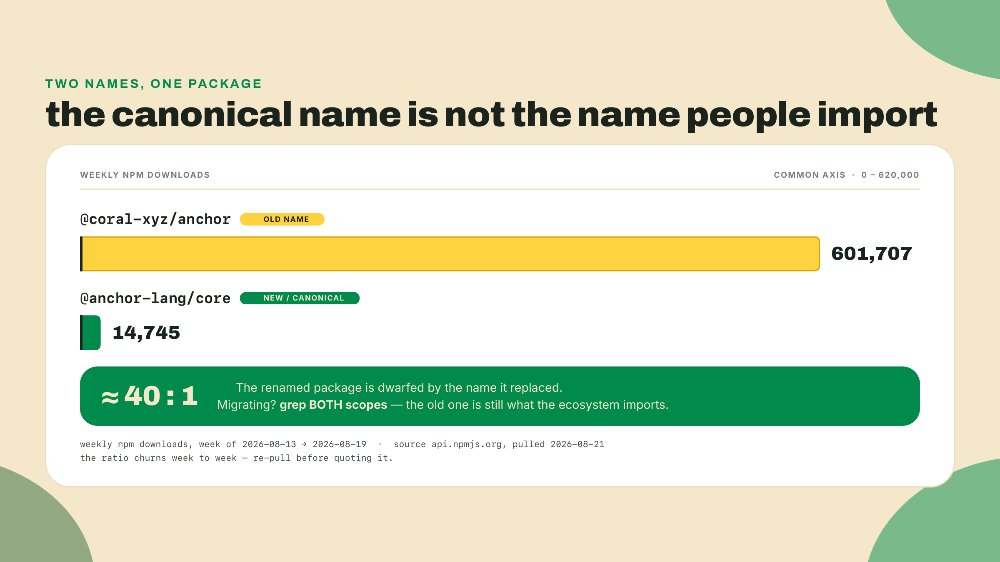
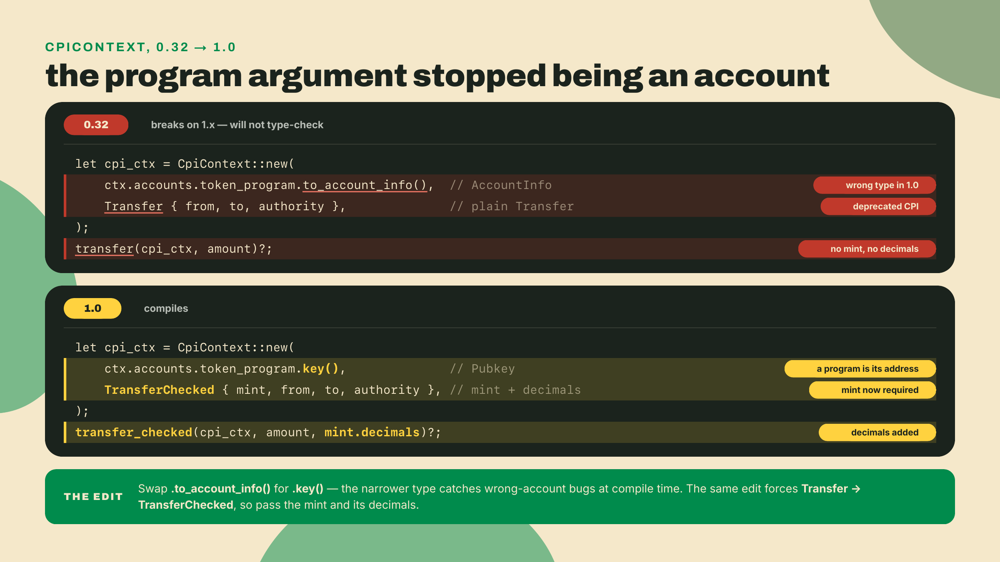
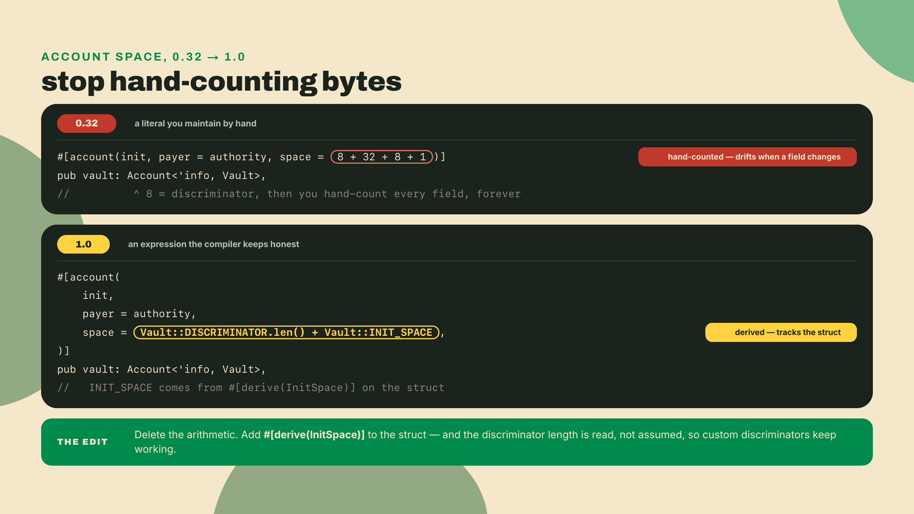
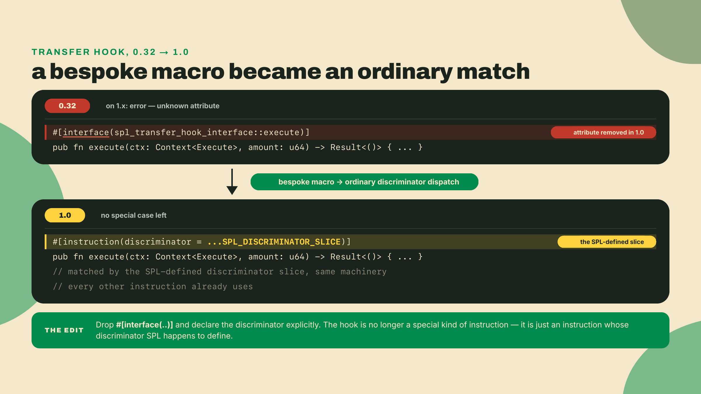
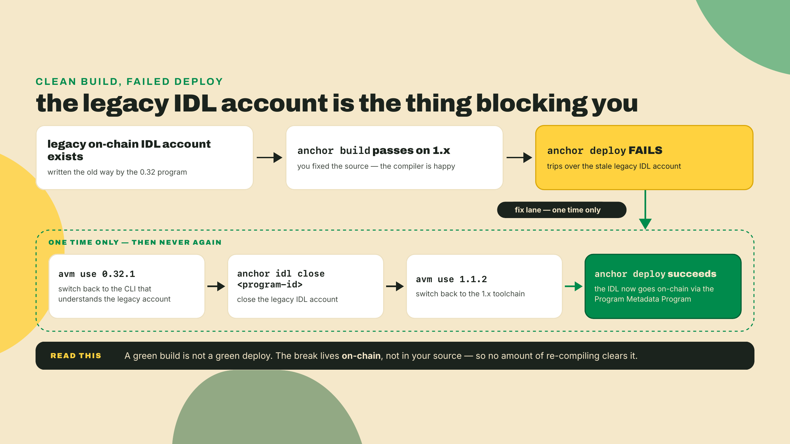
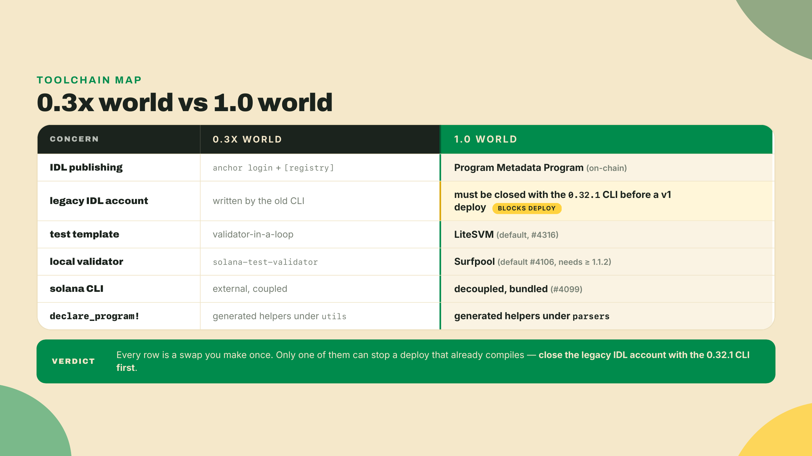
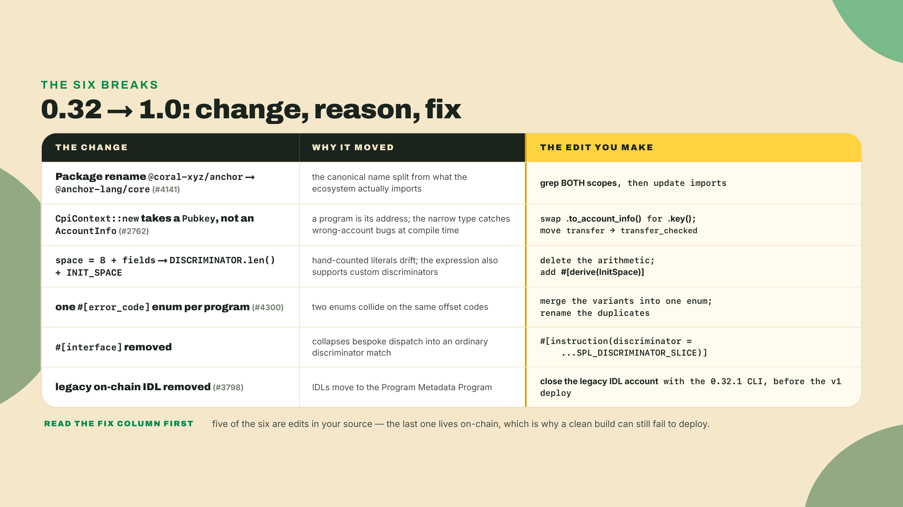
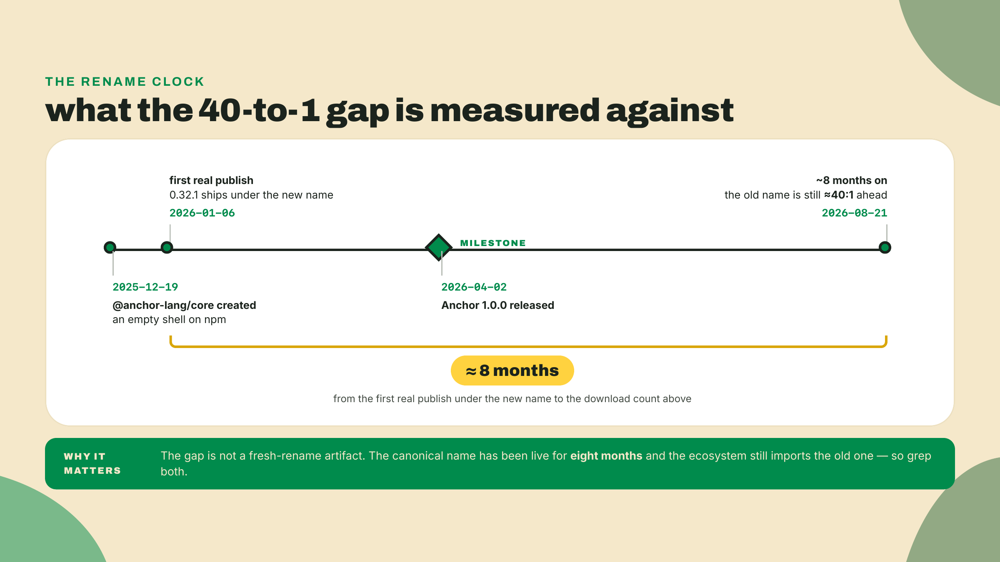

# 0.3x -> 1.0: the pains migrators still hit

You just shipped the capstone in m09-l3: the floor-registry CPIing into the counter, the quarter-vault, the prize-escrow, and the token-to-ticket swap, taken all the way through test, fuzz, profile, a Surfpool localnet run, a devnet deploy, and a local verify-from-repo pass. Every line of that came out of a blank file. Nothing you touched was inherited.

Now we turn to the codebases that did not start blank.

Here is the scenario, and it is not hypothetical. You inherit a program that built and deployed cleanly on Anchor 0.32 eight months ago. Your job is small: bump the toolchain to the 1.x line and keep going. So you do the obvious thing. Point `avm` at the current line and rebuild.

```bash
# avm ships with the Anchor installer; if you don't have it:
#   cargo install --git https://github.com/otter-sec/anchor avm --force
# (otter-sec/anchor is the repo's current home; the coral-xyz and
#  solana-foundation URLs still redirect there.)
# Toolchain is the 1.x line. 1.1.2 is the version this recon is written against;
# the line moved on 2026-09-04, when 1.2.0 shipped. Pin 1.1.2 here so the recon
# output matches the lesson, and re-check `avm list` before you pin anything else.
avm install 1.1.2
avm use 1.1.2
anchor build
```

It will not build. `#[interface]` is an unknown attribute. `CpiContext::new` rejects the program `AccountInfo` you have been passing it for two years. `anchor login` is gone entirely. And here is the part that matters: nothing you wrote is wrong. The framework moved under you, and the compiler will tell you *what* snapped without ever telling you *why*. This lesson is the map of what moved between 0.3x and 1.0, and the reason behind each move. Get the *why* and the port stops being a guessing game.

## Summary

This is the first of two migration deltas. It is a why-not-just-what tour of the Anchor 1.0.0 release (shipped 2026-04-02) and the 0.32-to-1.0 breaks that are still live in real codebases today. There is no build to complete here. That is a deliberate trade: you spend the hands-on hour of a normal lesson on a plateau instead, reading the delta cold, so that the actual port in m10-l3 becomes a checklist instead of a fight with the compiler. This lesson opens the module's migrator track, the three lessons m10-l1 through m10-l3, which exist for readers carrying an older codebase. If you are brand new to Anchor and never wrote a 0.32 line, you can skim the track and go straight to the conclusion in m10-l4. The cost of skimming is losing the trajectory context the rest of the module leans on.

We will walk six changes. For each one: the exact break, the reason the framework made it, and the one edit that fixes it. By the end you should be able to look at a 0.32 snippet and name the 1.0 change it hits from memory. That recognition is the whole point.

A word on how these lessons hand off responsibility. Early in this course I walked you command by command. Here I hand you the toolchain bump and a grep, and you read the compiler yourself. In m10-l2 you get the source and a delta table and drive a small port yourself. By m10-l3 you get a broken repo whose mechanical edits are marked and whose two hardest edits are not, because by then the compiler's own output is the marker. The training wheels come off across the module on purpose, and this lesson is where the first one comes off.

## The map of what moved, and why

The honest way to read a breaking-change list is to ask, for each item, *what problem was the old shape causing that the new shape solves?* A framework does not break a million downloads' worth of code for fun. Every one of these had a motivating limit. So we start each change from that limit, the way you would if you were the one deciding whether to ship the break.

### 1. The rename nobody finished doing

The most visible change is also the one that teaches you the most about migration as a practice. The client package moved from `@coral-xyz/anchor` to `@anchor-lang/core` (PR #4141), and 1.0 is where the old name stopped being the one the docs hand you. Read the dates in order, because they are the tell: the `@anchor-lang/core` package was created on npm on 2025-12-19, its first real publish landed 2026-01-06 under the old-line version number `0.32.1`, and 1.0.0 itself did not ship until 2026-04-02. The name moved on the 0.32 line, months ahead of the release it is usually filed under.

So the rename is old news. It has had most of a year to propagate. Here is the motivating question a migrator should ask: *if the canonical name changed eight months ago, is the old name dead?*

The naive answer is yes, of course, the docs say use the new one. That answer will quietly break your migration. Because "canonical" and "what you will actually read" have diverged, and diverged hard.



Roughly eight months after the rename, the old name still out-downloads the new one by something close to forty to one. The exact number does not matter and it churns weekly. The shape of it is what you carry: the package you are told to import is not the package the ecosystem is importing. Most example code you copy from a blog, most Stack Overflow answers, most half-migrated repos you inherit, still reach for `@coral-xyz/anchor`.

That is why the teammate who says "the rename is cosmetic, just update the import" is handing you a trap. The rename itself really is just a name move, the API in the box did not change *because of the rename*. The trap is the ecosystem reality around it. If you assume one canonical import and grep for one scope, you will miss half the call sites, because the code you are porting was written against the name that still wins the download count. The fix is a habit, not an edit: grep for both scopes before you assume anything.

```bash
# Before you touch a line, inventory BOTH names.
# ripgrep (rg) ships with most dev setups; else: brew install ripgrep
rg -l "@coral-xyz/anchor" .
rg -l "@anchor-lang/core" .
```

There is a small, grim piece of color that makes this concrete. The ecosystem's own official learning path, the one at solana.com/developers/courses, now serves a 308 redirect into an archived GitHub repo that was frozen on 2025-01-24. The canonical Anchor course is roughly 0.30-era content sitting in a read-only tree. So when a migrator goes looking for authoritative migration guidance and finds a tombstone, that is not an accident of your search. It is the state of the world, and it is exactly why this lesson exists in a paid course and essentially nowhere else.

### 2. CpiContext::new stopped taking an AccountInfo

Here is a break that stops the build, not just the linter. In 0.32 you built a cross-program call by handing `CpiContext::new` the program as an `AccountInfo`:



Anchor 1.0 changed `CpiContext::new` to take the program as a `Pubkey` (PR #2762). Pass a `.to_account_info()` there now and it fails to compile with a flat type mismatch: expected `Pubkey`, found `AccountInfo`.

Why make this break at all? Reason from what a CPI actually needs. When you built the token transfer back in m05-l1, the runtime identified the callee program by its address and nothing else, because a program's identity on Solana simply *is* its public key. When you handed the constructor a full `AccountInfo`, you were passing a fat handle where a single key was the only load-bearing part of it, and Anchor turned around and pulled the key back out internally anyway. Moving the argument to `Pubkey` removes that redundant indirection and lines the constructor up with how the runtime already thinks about the callee. It is a small tightening, and it is the shape the 2.0 borrow model later builds on. The fix is exactly two characters of intent: swap `.to_account_info()` for `.key()`.

A sharp reader pushes back here, and the pushback is worth answering because it is the objection you will hear in code review. If Anchor was going to extract the key anyway, what did passing the whole `AccountInfo` actually cost, beyond a few bytes on the stack? The honest answer is that in 0.32 it cost almost nothing at runtime, and if runtime cost were the whole story this break would not have been worth a million downloads' worth of churn. The real motivation is that the fat handle let you pass an account that was not the program at all, and the constructor would take it, deferring the mismatch to a runtime failure instead of a compile error. Narrowing the type to `Pubkey` moves a whole class of "I passed the wrong account here" mistakes from a confusing on-chain error into a flat message from your own compiler, which is exactly the trade a typed framework exists to make.

Riding along with this one is the SPL transfer idiom. Plain `transfer` is deprecated in favor of `transfer_checked`, which takes the mint and the decimals so the token program can verify you are moving what you think you are moving at the precision you think it has. So the mechanical migration is two moves at once: the program argument goes to a `Pubkey`, and the transfer call gains a mint account and a decimals value. Miss the second half and you have fixed the type error only to ship a deprecated call.

One caution so you do not conflate two deltas that look alike. The `CpiHandle` borrow model, where the accounts argument itself changes shape, is a 2.0 change, the next lesson's territory. In 1.0 the break is specifically and only the program argument moving from `AccountInfo` to `Pubkey`. If you see advice about `CpiHandle`, you are reading about a different world.

### 3. The space literal became an expression

In 0.32, half the `init` blocks in the ecosystem carried a hand-rolled space calculation that started with a magic `8`:



The `8` was the account discriminator, and everything after it was you, counting field bytes by hand and hoping you got padding right. The motivating limit is obvious once you have shipped a bug from it: a hand-counted literal drifts. Add a `u64` to the struct, forget to bump the literal, and you get a runtime failure that has nothing to do with the code you just changed.

1.0 replaces the literal with `DISCRIMINATOR.len() + INIT_SPACE`. `INIT_SPACE` comes from `#[derive(InitSpace)]` on your account struct and is computed from the fields themselves, so it tracks the struct automatically. `DISCRIMINATOR.len()` replaces the magic `8` with the actual length of the actual discriminator, which matters because 1.0 also lets you set custom discriminators that are not eight bytes. The fix is to delete the arithmetic and let the framework derive it. This is the rare break that is pure upside: you are removing a class of bug, not trading one shape for another.

### 4. One #[error_code] enum per program

0.32 let you scatter error definitions across multiple `#[error_code]` enums, one per module if you liked. 1.0's rule (PR #4300) is one enum per program — but hear the enforcement correctly, because this is the trap: a second `#[error_code]` enum still *compiles green* on the 1.x line. No error, no warning, verified against the pinned toolchain. If your inherited program split its errors into a `VaultError` and an `EscrowError`, the build that should have complained ships fine, and the hazard lands silently at runtime instead.

The hazard is discriminant collision, and it is worth walking one concrete instance to feel it. Anchor assigns each error a numeric code by its position in the enum, offset into a shared error-code space that starts at `6000`. Picture the inherited program: `VaultError` declares `Overflow` first, so it becomes `6000`, and `EscrowError` in another module also declares its first variant, which *also* wants to be `6000`. Now a client catches error `6000` off a failed transaction and has no way to know whether the vault overflowed or the escrow rejected, because two independent enums both counted from the same base and produced the same code for different meanings. Collapsing to exactly one enum per program makes the error code a single unambiguous index into a single list, so `6000` means one thing forever. The fix is a merge you impose yourself, because the compiler will not impose it for you: move every variant into one enum, and if two subsystems shipped a same-named variant, rename one of them. It is tedious rather than hard, and the payoff is that your error codes finally each mean exactly one thing, which is what a caller decoding them off-chain needed all along.

### 5. #[interface] and interface-instructions are gone

This is the break in the hook. In 0.32, an SPL interface instruction, the classic case being a transfer hook's `execute`, was declared with the `#[interface]` attribute macro. In 1.0 that macro and the whole interface-instructions machinery were removed. There is no `#[program_interface]` you rename it to, and there is no feature flag that brings it back. It is gone.

What replaced it, and why? The reason is unification. Every ordinary Anchor instruction is already dispatched by matching its discriminator, the leading bytes of the instruction data. Interface instructions needed the *same* thing, dispatch by a specific, externally-defined discriminator, but they had a bespoke macro to do it. 1.0 collapses the special case into the general one. A transfer hook's `execute` is now declared like any other instruction, except you tell Anchor which discriminator to match:



The discriminator comes from the SPL interface itself, exposed as an `SPL_DISCRIMINATOR_SLICE` constant, so you are matching the exact bytes the interface defines rather than trusting a macro to know them for you. The fix: delete the `#[interface]` attribute and declare the instruction normally with `#[instruction(discriminator = ...SPL_DISCRIMINATOR_SLICE)]`.

A boundary note, because this is where courses overlap and I want to keep the lines clean. This lesson teaches the *migration* of the hook declaration, the attribute that changed. It does not teach the transfer-hook interface itself — the accounts it forwards, the execute contract, the full program. That is the Digital Assets, Tokenization and Token Extensions course's territory, and if you are meeting transfer hooks for the first time here, that is the course that teaches them. Here we only care which attribute you swap.

### 6. The toolchain changed shape underneath the code

The first five changes are things you edit in source. The sixth is not a code edit at all. It is the ground the code stands on, and it is the one that ambushes people at deploy time rather than build time.

Start with the ambush. Your 0.32 program compiles on 1.x after you fix the source, you point it at devnet, you deploy, and the *deploy* errors on the on-chain IDL. Nothing in your Rust is wrong. The problem is a stale account from the old world.



1.0 removed the legacy on-chain IDL instructions (PR #3798). IDLs now go on-chain through the Program Metadata Program instead. But a program you inherited was likely deployed with an IDL account created the old way, and the 1.x deploy path does not know how to step around it. The fix is precise and it is a one-time move: switch to the 0.32.1 CLI, close the legacy IDL account with `anchor idl close`, switch back to 1.x, and deploy. You use the old CLI exactly once, for exactly this. It is not a downgrade and it is not permanent. 1.x writes IDLs perfectly well, just through a different program.

While we are down here, several other pieces of the toolchain shifted shape, and knowing they moved saves you from chasing ghosts:

- **`anchor login` and `[registry]` are gone.** The old flow where you logged into a registry to publish an IDL no longer exists. IDLs go on-chain via the Program Metadata Program. If your muscle memory reaches for `anchor login`, stop, that door is bricked over.
- **LiteSVM is the default test template** (PR #4316). New `anchor init` scaffolds spin up LiteSVM-based Rust tests rather than the old validator-in-a-loop shape.
- **Surfpool is the default validator** (PR #4106), and it needs at least 1.1.2. `anchor test` and `anchor localnet` drive Surfpool now, not `solana-test-validator`.
- **The CLI decoupled from an external solana CLI** (PR #4099). The Anchor toolchain bundles what it needs now instead of shelling out to a separately-installed solana binary, which is why the 1.x installer no longer nags you to match a specific solana version first. Note the direction of this carefully, because it changes how you read a version number. The Anchor CLI version and your installed Agave CLI version are now independent facts, so a pin like "Solana CLI 3.1.10" sitting in a project's toolchain block is a statement about that project's continuous-integration environment, never a claim about what the current Solana release is. Read it as a local pin, not a headline.
- **`declare_program!` moved its generated helpers** from `utils` to `parsers`. `declare_program!` is how a program consumes another program's on-chain IDL to generate a CPI and client module, and in 0.32 the generated account parsers lived under a `utils` submodule. 1.0 moved them to `parsers`, which reads as a cosmetic path change until you realize it is the kind of break the compiler catches instantly and a grep catches faster. If your inherited code consumes another program via `declare_program!` and reaches into the generated `utils` module, update the path to `parsers` and move on.



### The delta as evidence, not trivia

Step back from the six items and ask what they add up to. Each break traces to a limit the old shape was hitting: a fat CPI handle where a key would do, a hand-counted literal that drifts, colliding error codes, a bespoke macro duplicating dispatch that already existed, an IDL flow that outgrew a registry. None of them is arbitrary. That is the reading that makes a migration decision legible instead of frightening.



It is worth tying this back to the trajectory we set up in m01-l2, because that is what lets a migrator and a reader brand new to Anchor share one story instead of two. Back there the framework's whole arc was framed as a slow tightening: each version trades a little of the old looseness for a compiler that catches more of your mistakes before they reach a validator. The 0.32-to-1.0 delta is that same arc, seen from inside the one jump where the tightening happened to break source. A reader who never wrote a 0.32 line still benefits from reading it this way, because the *reasons* are the design principles of the framework they are learning, not migration trivia they can forget. The migrator gets the same principles plus a port plan. One narrative, two audiences.

It also proves something the conclusion of this module (m10-l4) will formalize into a decision tree: breaking changes cost real hours. You just counted the hours. A migrator hits every one of these on a nontrivial program, and the datum that the old package name still out-downloads the new one by forty to one proves the audience for this work is real and large. People are running 0.32 code in production right now and will be porting it long after this lesson is old. The point of holding the *why* for each change is that when you port in m10-l3, the compiler's flat "this broke" becomes your "right, that is change three, here is the edit," without a detour through documentation that may itself be a tombstone.



## Lab: port reconnaissance

No build today. The activity is diagnosis, and it is real work: you are going to make a 0.32 program fail on the 1.x line on purpose, then read every break it produces and map it to the six changes above before you fix a single line. This is the reconnaissance you would do on day one of a real port, and doing it once here is what turns m10-l3 into a checklist.

Earlier lessons handed you each command with its output. Here you get the moves and you read the compiler yourself. That is the autonomy fade in action: by m10-l3 the only guidance left is the compiler's own error text.

1. **Get a 0.32 program in front of you.** Any nontrivial 0.32 Anchor program works, and it will not be one of yours: every rung of the Quarters ladder was written against the V2 RC from a blank file. Clone any public 0.32-era Anchor program that does token transfers. Confirm the version it targets before you start:

   ```bash
   # Look at Anchor.toml [toolchain] and the anchor-lang pin in Cargo.toml
   rg "anchor_version|anchor-lang" Anchor.toml Cargo.toml
   ```

   Expect a 0.3x pin on both lines. If it already reads 1.x, this program has been ported and it is the wrong subject for the exercise; find one that has not.

2. **Inventory both package scopes.** Before touching Rust, find every client-side import, in both names:

   ```bash
   rg -l "@coral-xyz/anchor" .
   rg -l "@anchor-lang/core" .
   ```

   Write down which scope the code uses. If it is the old one, that is normal, that is the forty-to-one reality. You are not fixing this yet, you are counting.

3. **Bump the toolchain and force the break.** Point avm at the 1.x line and build:

   ```bash
   avm install 1.1.2
   avm use 1.1.2
   anchor --version   # confirm you are on the 1.x line
   anchor build
   ```

   Expect the build to fail, loudly and in several places at once. That failure is the deliverable of this step, not a problem to solve yet.

4. **Catalog every error against the six changes.** Do not fix anything. For each compiler error, write the change number it maps to. You are looking for the fingerprints: an unknown `#[interface]` attribute (change 5), a `Pubkey` vs `AccountInfo` mismatch on `CpiContext::new` (change 2). Two of the six leave no compiler error at all, so they have to be caught by grep, not by the build. A hand-rolled `8 + ...` space literal (change 3) will not always error loudly; and a second `#[error_code]` enum (change 4) never errors — two enums build green, which is exactly the trap the change-4 section warned about:

   ```bash
   rg "space\s*=\s*8\s*\+" .
   rg -n "#\[error_code\]" .   # more than one hit inside a single program crate: change 4
   ```

5. **Dry-run the deploy trap in your head, or on devnet.** You will not fix the deploy today, but locate the risk. If the program was ever deployed with an on-chain IDL the old way, note that a v1 deploy will trip on the stale IDL account until you close it with the 0.32.1 CLI. Write the exact close command you *would* run:

   ```bash
   # the one-time close, run on the 0.32.1 CLI, NOT 1.x:
   #   avm use 0.32.1
   #   anchor idl close <program-id> --provider.cluster devnet
   #   avm use 1.1.2
   ```

**Checkpoint.** You are done when you have a written list: every break the build produced *plus* the two silent ones the greps surfaced, each tagged with its change number and its one-line fix, plus a note on whether the legacy-IDL close applies. That list is a port plan. You have not written a line of the port, and you already know exactly what it will take. That is the whole trade this lesson made for you.

## Challenge

Close the loop from memory. Here are three snippets pulled from a 0.32 program. For each one, without looking back up the page, name the 1.0 breaking change it hits, the reason the change exists, and the exact edit that fixes it. Three change-to-reason-to-fix triples.

**Snippet A:**
```
let cpi_ctx = CpiContext::new(
    ctx.accounts.token_program.to_account_info(),
    Transfer { from, to, authority },
);
transfer(cpi_ctx, amount)?;
```

**Snippet B:**
```
#[interface(spl_transfer_hook_interface::execute)]
pub fn execute(ctx: Context<Execute>, amount: u64) -> Result<()> { Ok(()) }
```

**Snippet C:**
```
#[account(init, payer = authority, space = 8 + 32 + 8)]
pub vault: Account<'info, Vault>,
```

For the stretch: your inherited program deployed fine on 0.32 but its first 1.x deploy errors on the on-chain IDL, and there is no `#[interface]` block or extra `#[error_code]` enum anywhere in the source. What is the missing migration step, and why is "run `anchor login` and re-register" the wrong instinct? Write the answer before you check it against change 6.

## Before you move on

You do not need to have fixed anything to have gotten this lesson right. You need the reconnaissance list from the Lab and three clean triples from the Challenge. If any triple came out fuzzy, the fastest tell is that you named the *fix* but not the *reason*, that is the exact gap that makes a port feel like guessing, so go back to that change and re-read why the framework moved, not just what it moved to. If your list of build errors did not include a `CpiContext` type mismatch or an `#[interface]` complaint, your test program probably did not exercise CPIs or hooks; run the reconnaissance once more against one that does, because those are the two breaks that eat the most time in a real port. You do not need to carry that program forward: m10-l3 puts a v1 vault on the bench and ports it row by row.

That was the first delta: the pains of getting *to* 1.0. But the 1.x line and `anchor-next` are two parallel worlds, and the jump from 1.x to 2.0 is a ground-up rewrite, not a rename. The `CpiHandle` borrow model I told you to set aside twice in this lesson lives over there. Next lesson we cross that line and walk every place the code changes when you go from 1.x into V2. Happy porting.
