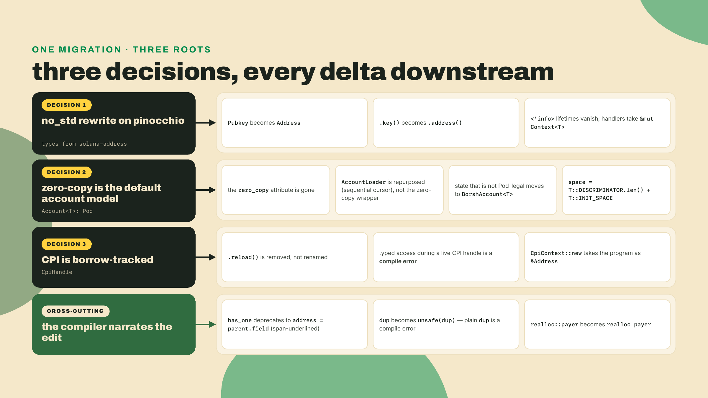
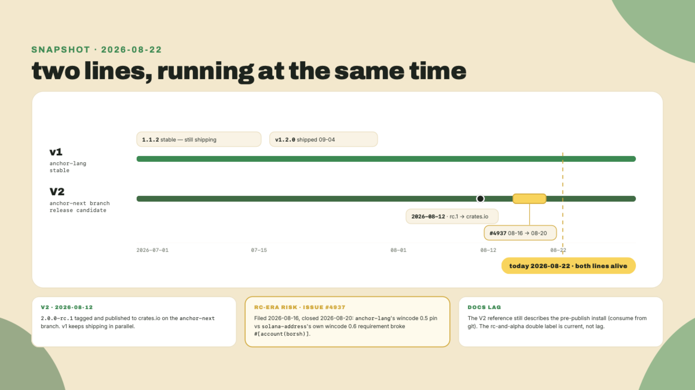
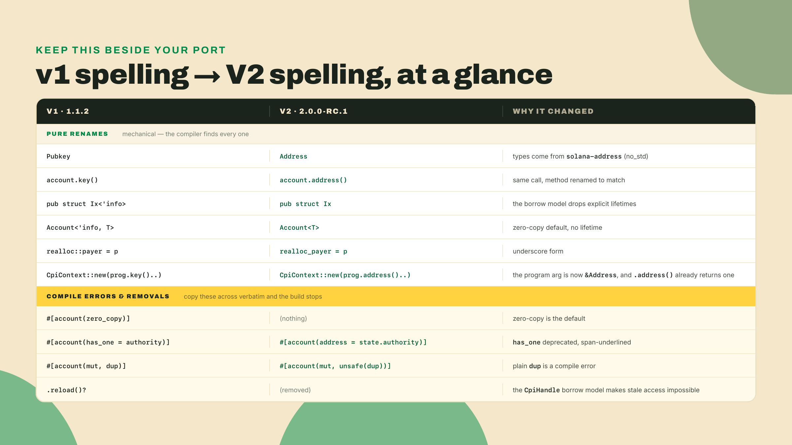
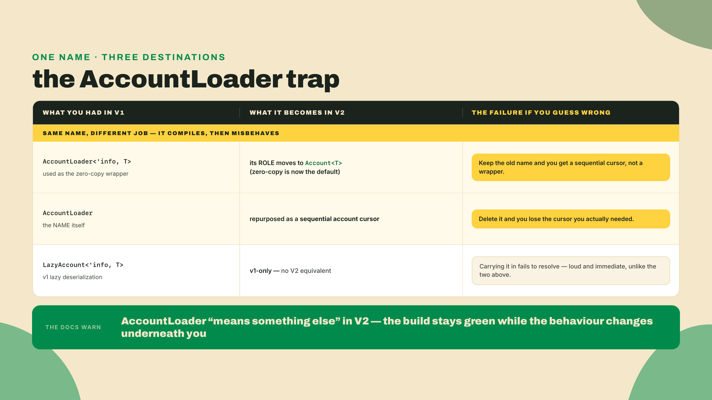
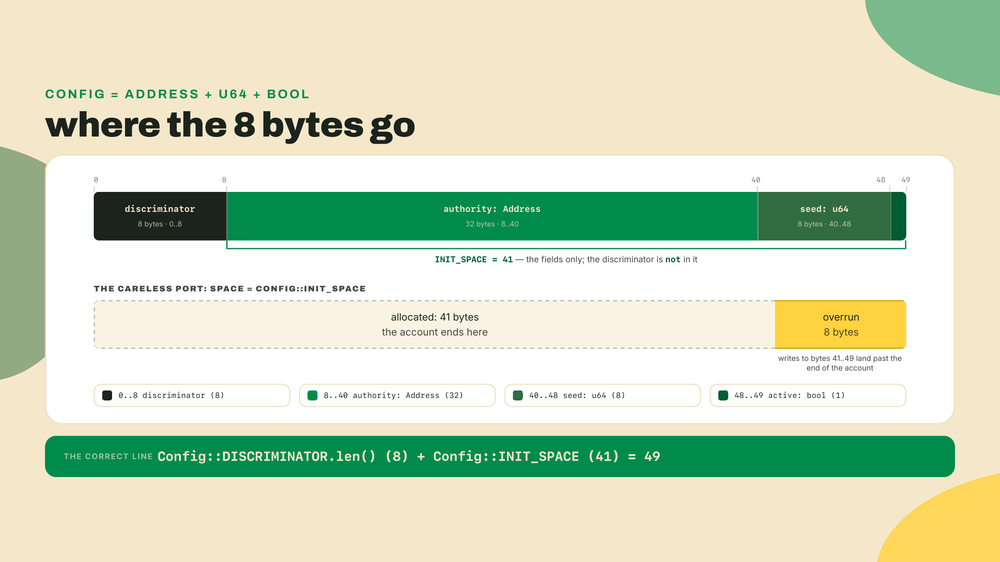
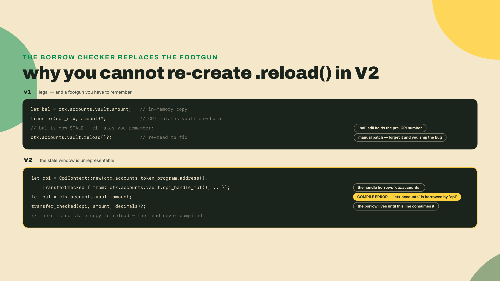
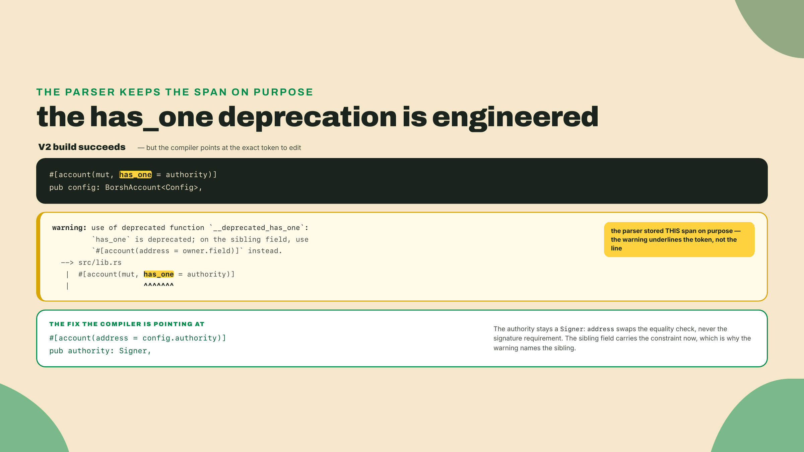
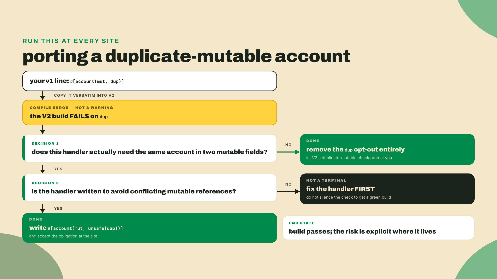

# 1.x to 2.0: the rewrite deltas

Last lesson you mapped the 0.3x to 1.0 jump: the renames, the single `#[error_code]` per program, the on-chain-IDL close step, `CpiContext::new` learning to take a `Pubkey`. Every one of those is survivable with a find-and-replace and an afternoon. You forced the break on a 0.32 program and cataloged it against the six changes; the port itself is a bump of a number in `Cargo.toml`, a chase through the compile errors, and the same program coming out the other side. That is what a version bump feels like.

The 1.x to 2.0 jump is not that. It is a ground-up `no_std` rewrite on pinocchio, and the syntax you already know stops type-checking. `Pubkey` is not a type anymore. The `<'info>` lifetimes you have written on every account struct since module 2 vanish. `has_one` compiles but underlines itself. Plain `dup` refuses to build and tells you to write `unsafe(dup)` instead. `.reload()` is gone, and not because someone renamed it. So before we reason about any of it, go see the surface area you are about to cross. In a v1 program of your own, run this:

```bash
rg -n 'Pubkey|\.key\(\)|has_one|zero_copy|<'"'"'info>|\.reload\(\)|realloc::payer|LazyAccount|AccountLoader|Migration<' src/
```

Every line that prints is a line that will change. Some are one-word renames. A few are compile errors with an opinion. One of them, `AccountLoader`, prints as an ordinary hit you will be tempted to skip, because the name survives into V2 and the build never complains about it. That one is the most dangerous of the set. That grep is your work list for this lesson.

## Summary

This is the second migration delta, and the harder one. In m10-l1 the mental model was "same program, new spelling." Here the honest model is "same intent, new program," because a 1.x codebase does not upgrade to 2.0, it gets rewritten line by line against a release candidate that lives on a separate branch and keeps moving.

The payoff for the pain is real, and it is the through-line of this whole course: V2 kills entire bug classes at compile time. The stale-data footgun that `.reload()` patched, the duplicate-mutable alias, the hand-rolled space math that silently under-counts. Each of those becomes something you cannot write, not something you must remember to check. We are going to earn that claim by deriving every syntax change back to the design decision that forced it, most of which you already met earlier in the course. Then you will port a small v1 program yourself, with the compiler as your pair, and close on a coding challenge that fixes the one space-calc bug that survives a careless port.

The hand-holding steps down here on purpose. Early modules narrated every keystroke. This late, the lab hands you the v1 source and the delta table and expects you to drive, reading the compiler's warnings as instructions rather than waiting for mine.

## The deltas, and the decisions behind them

Start with the question that actually matters, because it is the one that keeps the rest of the lesson honest: why does 1.x to 2.0 break things that 0.3x to 1.0 did not?

The naive answer is "more breaking changes piled up." Tempting, and wrong. If it were only volume, the fix would be the same as last time, only longer: bump the version, grind the errors, ship. That approach fails on the first file, and it fails for a specific reason. 0.3x to 1.0 was the same framework wearing new names. V2 is a different framework that happens to keep most of the names. It is a `no_std` rewrite built on pinocchio, the zero-copy, dependency-light runtime layer. Anchor did not edit its old code to get here. It rebuilt on a new foundation.

That single fact is the generator. Almost every delta in this lesson is a consequence of one of three design decisions baked into that rebuild, and if you carry the three decisions in your head you can predict the deltas instead of memorizing them.



Before the decisions, one piece of vocabulary and one map, because the ground is moving while you stand on it. The v1 line is `anchor-lang` 1.1.2 — or rather it was: v1.2.0 shipped on 2026-09-04, so the stable line is 1.2.0 now and still taking commits. V2 lives on the `anchor-next` branch and ships as `2.0.0-rc.1`, published to crates.io on 2026-08-12 under the git tag `v2.0.0-rc.1`. Those are two parallel lines, not a before and after. As of this writing, 2026-08-22, the V2 reference docs still carry install language that predates the crates.io publish, warning you to consume the crates from git. Do not read the alpha wording alongside it as the same kind of lag: the project labels this one release both `rc` and `alpha` on purpose, and that pair is current, not stale. RCs move fast. Re-check the crates.io version and the `anchor-next` tag before you pin anything, and treat every version number in this lesson as a snapshot with a date on it.



### Decision 1: the no_std rewrite renames the primitives

`no_std` means the framework cannot lean on Rust's standard library, so it draws its foundational types from crates built for that world. Addresses now come from `solana-address` through pinocchio. That is why `Pubkey` becomes `Address` and `.key()` becomes `.address()`. It is not aesthetic. The old type lived in a dependency graph V2 no longer sits inside.

The lifetimes go for a related reason. In v1 every account struct carried `<'info>` because the framework threaded a borrow of the transaction's account slice through your types by hand, and you paid for that plumbing in every signature you ever wrote. V2's account model tracks those borrows differently, so the lifetime annotation stops being something you write. Handlers take `&mut Context<T>`, the wrappers lose `<'info>`, and a whole column of angle brackets disappears from your code. Compared to what? Compared to a v1 struct where `pub struct Initialize<'info>` and `Account<'info, Config>` repeated the same lifetime a dozen times to say one thing the compiler now infers.

If going one layer deeper than "the framework handles it" is the itch you keep scratching, that is exactly where the Low-Level Solana course lives: beneath the framework entirely, on the machinery V2 is now sitting on.



### Decision 2: zero-copy is the default, so the ceremony around it disappears

In m02 you met the v1 ceremony as history you never had to run: `#[account(zero_copy)]`, `AccountLoader`, `load()` and `load_mut()`, all to avoid deserializing a big account into the stack. V2 makes zero-copy the ordinary path, which is why you only ever read about the old way. `Account<T>` is zero-copy by default, which requires `T: Pod` with a no-padding layout. **Pod** is plain old data, from module 2: a fixed-size, alignment-clean struct whose every bit pattern is a valid value, so the framework can lay a typed view directly over the account bytes instead of decoding them. The consequences ripple outward, and this is where a careless port quietly breaks.

First, the easy one: the `zero_copy` attribute is gone. There is nothing to opt into because you are already in. Delete it.

Now the complexity I hid, added back out loud. "Everything is zero-copy" is only true for data that is actually Pod, and the bar for Pod is higher than migrators expect. Two rules bite on the first port. First, every field must itself be Pod, and a plain `bool` is not: only two of its 256 bit patterns are legal, so V2 ships `PodBool` for it. Second, the struct must have *no padding at all*. `#[account]` emits `#[repr(C)]` plus a compile-time assertion that `size_of::<T>()` equals the sum of the field sizes, and when it does not you get this, verbatim:

```text
account struct has padding bytes; reorder fields from largest to smallest
alignment to eliminate padding (e.g. u64 before u32 before u8)
```

So a v1 struct copied across usually is not Pod-legal on arrival. You have two honest exits, and the port picks one per account. Re-lay the struct out with alignment-1 fields (`PodU64`, `PodBool`, byte arrays) so the sum matches the size, or route the account through `#[account(borsh)]` and the `BorshAccount<T>` wrapper, which is also where anything genuinely variable-length lives: a `Vec`, a `String`. The safety here is not a convention. If a layout would make the zero-copy read unsound, the program fails to compile rather than silently reading ambiguous bytes. The unsound design is unrepresentable, which is the whole thesis of V2 in one sentence.

Then the trap. `AccountLoader` still exists in V2. Your grep flags it as one more line among many, your build will not complain at all, and that is precisely the danger. It does not mean what it meant in v1. The v1 zero-copy role that `AccountLoader` used to fill has moved to `Account<T>` (the new default). The name `AccountLoader` has been repurposed as a sequential account cursor, a completely different thing, and the docs explicitly warn that it "means something else" now. This is the one delta most likely to compile and then misbehave rather than fail loudly. Treating it as "gone, delete it" is wrong. Treating it as "same as v1, keep it" is worse. It is a false friend: same face, new job.



Last consequence of Decision 2, and the one you will fix by hand in the challenge: space math. In 0.32 you hand-rolled `space = 8 + 32 + 8`, where the leading `8` was the account discriminator you added yourself. The derived form arrived with 1.0, as m10-l1's change three, and V2 keeps it unchanged: `space = T::DISCRIMINATOR.len() + T::INIT_SPACE`. The reason it still bites a migrator in 2.0 is that the hand-count is legal Rust arithmetic, so a program that skipped the 1.0 edit compiles on 1.1.2 with the magic `8` intact and arrives here still carrying it. The discriminator is still 8 bytes (sha256 default, unchanged and v1-compatible), so `DISCRIMINATOR.len()` is 8. The trap is that `INIT_SPACE` is the sum of the Pod field sizes only. It never includes the discriminator. A half-finished port that deletes the magic `8` but forgets that `INIT_SPACE` excludes it will under-count every account by exactly 8 bytes, size every account too small, and overrun the buffer on the first write.

Itemize it, because the number is the whole argument. Take the `Config` from the lab: one `Address` at 32 bytes, one `u64` at 8, one `bool` at 1. `INIT_SPACE` is `32 + 8 + 1 = 41`. The full on-chain length is `DISCRIMINATOR.len() + INIT_SPACE = 8 + 41 = 49`. The careless port computes `41` and allocates `41`, so the account is exactly one discriminator short, and the very first byte of your `authority` field lands where the runtime expected the account to end. The bug is not a crash you can read. It is an off-by-8 that sizes correctly in your head and wrongly on chain. Hold that layout. It is the challenge.



### Decision 3: CPI is borrow-tracked, so .reload() cannot exist

This is the flagship derivation of the whole migration, and it is a direct callback to m04-l2, where you already watched typed access during a live handle become a compile error. Apply that same idea to migration and `.reload()` explains itself.

Rewind to why `.reload()` existed in v1. You held a deserialized copy of an account. You did a CPI that mutated that account on-chain. Your in-memory copy was now stale, showing the balance from before the transfer. If you made a decision on that stale copy you had a real bug, so v1 gave you `.reload()` to re-read the account after the CPI and refresh your copy. It was a patch for a footgun the type system allowed.

A migrator's instinct is: "V2 removed `.reload()`, fine, I will just call it manually after each CPI like before." That is both impossible and unnecessary, and the reason is one mechanism. In V2, CPI accounts are borrow-tracked `CpiHandle`s. A handle ties the CPI to a Rust borrow of the typed wrapper it came from, which lets Anchor use pinocchio's fast unchecked CPI path while the borrow checker forbids typed aliasing at compile time. While a handle is live, typed access to that account is a compile error. So the stale-data situation cannot be written down. There is no moment where you hold a stale typed copy across a mutation, because the borrow checker will not let the copy and the live handle coexist. Nothing to reload. The method was removed rather than deprecated because the bug it patched is no longer expressible.

Notice which class of bug this kills, because it is the worst class. A forgotten `.reload()` in v1 does not fail the average case. The transfer still happens, the CPI still succeeds, the tests that do not depend on the post-CPI balance still pass. It fails only when your handler reads the mutated value and branches on it: a withdrawal that checks a balance it thinks is still 100 when the CPI just moved it to 0. That is the signature of the most expensive bugs on chain. Correct in the common path, wrong exactly when money is on the line, invisible until the worst case arrives. Deprecating `.reload()` would have left that worst-case window open for anyone who forgot to call it. Removing the ability to hold the stale copy at all closes the window for everyone, including the migrator who never read this lesson. That asymmetry, average-case-fine versus worst-case-catastrophic, is the exact reason V2 chose "unrepresentable" over "documented."



One more small delta from this decision, because it is where new migrators trip on syntax after they understand the concept: `CpiContext::new` now takes the program as `&Address`. In m10-l1 you learned the 1.0 form, where `CpiContext::new` took a `Pubkey`. V2 takes a borrowed `Address`. Same idea, one more type rename following Decision 1 downstream into the CPI API.

### The cross-cutting deltas: let the compiler narrate

Two changes do not belong to a single decision. They belong to a philosophy: make the safe path the ordinary path, and when you deviate, force you to say so at the exact spot. The compiler is the teacher here, and it was engineered to be.

Take `has_one`. Port `#[account(mut, has_one = authority)]` into V2 and it compiles, but it emits a deprecation warning that underlines the `has_one` keyword specifically. That underline is not incidental. The framework's parser stores the `has_one` keyword span on purpose so that codegen can point back at it. The warning is telling you the exact edit, in its own words: "on the sibling field, use `#[account(address = owner.field)]` instead." The right-hand side is any expression, most often the parent account's field. It is a deprecation with a map attached. Do not reach for `#[allow(deprecated)]` to silence it. `has_one` is on a path to removal, and a later RC may take it. The warning is doing you a favor.



Now the sharper one, the per-line fork. Your v1 code opts a duplicate mutable account out of the duplicate-mutable check with `#[account(mut, dup)]`. In V2 that line does not warn. It fails to build. Plain `dup` is a compile error, and the error text names the fix: write `unsafe(dup)`. This matters more than it looks. V2 still detects duplicate mutables, and the check still runs during account validation against the walked bitvec. What changed is that the escape hatch must now be spelled `unsafe`, at the call site, every time you use it. (The walked bitvec is the dispatcher's runtime pass from m01-l4: it marks every address that arrives twice, then ANDs that against the struct's compile-time `MUT_MASK`. The attribute is a compile-time event; the collision it guards is a runtime one.) The word is doing work: it makes you acknowledge, right where you deviate, that you have taken on the obligation to write the handler so it never forms conflicting mutable references. The docs say the hatch is named `unsafe(dup)` "on purpose." A `dup` that silently compiled was a risk you could forget. An `unsafe(dup)` you had to type is a risk you chose.



### Mechanical renames and the things you must leave behind

A few deltas are pure spelling, no philosophy. `realloc::payer` becomes `realloc_payer`, the double-colon namespace collapsing into a single flat token. Grep, replace, move on. These are the 0.3x-to-1.0-flavored edits still living inside the harder migration, and they are worth naming precisely because they lull you: if the first ten changes were this easy you will assume the eleventh is too, and the eleventh is `AccountLoader`.

Then the removals. `LazyAccount` and `Migration<From, To>` are v1-only. There is no V2 spelling to port them to. `LazyAccount` was v1's read-only, heap-allocated, load-on-demand wrapper; in a zero-copy-by-default world its niche is mostly absorbed by `Account<T>`, so the wrapper does not survive. `Migration<From, To>` simply does not exist on the V2 line. If your v1 program leans on either, that is not a rename, it is a redesign of that piece.

One security note for the v1 audience, since some of you will keep a program on the v1 line for a while yet. `LazyAccount` used to skip its ownership recheck on reload, so after a CPI an account you held lazily could have its owner changed under you without the lazy path re-verifying it. PR #4784, "re-run ownership checks when reloading `LazyAccount`," fixed exactly that, and it merged on 2026-07-16, which is *after* 1.1.2 shipped on 2026-06-26. Read the dates in that order, because they are the point: if you are pinned to 1.1.2 you do not have the fix. It is not a V2 concern, since `LazyAccount` does not cross over. It is a reason to audit your v1 usage, and your v1 pin, before you decide what to port and what to rewrite.

### Should you port at all, right now? Compared to what?

Worth pausing on the question a careful engineer asks before touching a working program: should you migrate to V2 today, or wait? The case for waiting is real, and I will make it in its strongest form before I answer it. V2 is a release candidate. It is explicitly not audited, the reference docs still carry alpha caveats, and, as #4937 showed, the crate pins themselves can break a correct program. A program holding real funds on the v1 line, stable at 1.1.2, has every reason to stay there until 2.0 ships a stable, audited release. That is not timidity. That is matching the risk of the tooling to the value it guards. If your program is in production, the honest default is: do not port live funds to an RC.

So compared to what? Compared to the alternative of learning the deltas after 2.0 is stable, under deadline, on a codebase you have half-forgotten. The port is a rewrite, and a rewrite you do calmly on a scratch copy, while the compiler teaches you each delta, is a completely different task from the same rewrite done in a rush because a dependency finally dropped v1 support. Learning the deltas now is cheap. Porting production funds now is not. Those are two different decisions, and the mistake is treating them as one. This lesson is the first: build the map, port a throwaway, own the reasoning. The second, when to move a real program, is a call you make later with a stable release and an audit in hand.


### The tradeoff, stated plainly, and the discipline the RC forces

Here is the honest ledger. On the win side, V2 removes bug classes at the type level: the `.reload()` stale-data window, the duplicate-mutable alias, the unsound zero-copy layout, the hand-counted discriminator. Those stop being things you check and become things you cannot express. On the cost side, a 1.x codebase does not upgrade, it gets ported, line by line, against a release candidate on a separate branch. You trade a mechanical version bump for a real rewrite, and you take on RC-era churn: the toolchain, the crate pins, even the serializer version can shift under you between one write and the next.

That last clause is not hypothetical. The first war story of the RC era is issue #4937, filed 2026-08-16 and closed four days later on 2026-08-20. `anchor-lang` pinned `wincode` (V2's serializer) at `0.5` while depending on `solana-address` with no upper bound, and `solana-address` raised its own `wincode` requirement to `0.6`. The trait-bound skew between the two broke `#[account(borsh)]` with a bare `SchemaRead is not satisfied` error. Nobody wrote bad code. The dependency graph itself bit. That is the shape of the risk on an RC: correct code, incompatible pins. So the discipline is not optional. Pin exact versions, not caret ranges. Re-verify the `anchor-next` tag and the crate versions before every work session. Treat a green build today as evidence about today only. The reward for the rewrite is a program that fails at compile time instead of on mainnet. The rent you pay for it, until 2.0 stabilizes, is version vigilance.

Vigilance, made concrete, because that exact skew is live again as you read this. #4937 closed when the pins were reconciled, but the published `2.0.0-rc.1` still pins `wincode 0.5` while leaving `solana-address` unbounded, and `solana-address 2.7.0` has since moved to `wincode 0.6` — so a fresh resolve rebuilds the very graph the issue described, and the lab below walks straight into it at the `#[account(borsh)] Config`. It wears two faces, one cause: `error[E0277]` on the account type, `SchemaWrite`/`SchemaRead` "is not satisfied" with a note about multiple versions of `wincode` in the dependency graph, and `error[E0433]: could not find wincode`, because the `#[program]` expansion names `::wincode::` absolutely and your crate does not depend on it directly. The workaround is the pair of pins every program `Cargo.toml` in this course has carried since m01-l2. Your port is a standalone crate, so it takes the exact form below; the arcade workspace states the same `< 2.7` ceiling as a range, because five members have to agree on one resolved version — m02-l1 makes that argument.

```toml
[dependencies]
anchor-lang = "2.0.0-rc.1"
wincode = { version = "0.5", features = ["derive"] }
solana-address = "=2.6.0"      # rc.1 pins wincode 0.5; solana-address 2.7.0 moved to 0.6
```

The pins belong in the program crate whichever channel `anchor-lang` itself rides, git branch or crates.io. Put them in the port's `Cargo.toml` before step 1 of the lab, or meet both errors at step 6 and add them then; either way, re-verify them every session, because this is exactly the kind of workaround a later rc deletes out from under you.

## Lab: port a v1 program to V2, compiler-guided

You are going to port a tiny but complete v1 program: a config account with an authority, initialized once, then updated by that authority. It exercises the account-model rename, the lifetime drop, the `has_one` deprecation, and the space calc, which is most of the delta surface in fifty lines. Work in a scratch crate, not a real project.

This lab fades the hand-holding. I give you the v1 source and the delta table above. You drive the port and let the compiler tell you what is left.

1. **Install and pin the V2 toolchain.** One trap before you type anything: the RC does not go through `avm`. No GitHub Release was cut for the v2 tag, so the prebuilt binary `avm install` downloads is not there and the fetch 404s. The rc.1 crates did land on crates.io on 2026-08-12, but the documented install is still a git install from the `anchor-next` branch, pinned here to the tag:

```bash
# no GitHub Release cut for the v2 tag -> no binary to download; use the git install
CARGO_PROFILE_RELEASE_LTO=off \
cargo install --git https://github.com/otter-sec/anchor \
  --tag v2.0.0-rc.1 anchor-cli --locked --force

anchor --version           # confirm 2.0.0-rc.1 before you touch code
```

Pin that exact version in your `Anchor.toml` and `Cargo.toml`. RCs move; re-check the tag on `anchor-next` first (this lab was written against `2.0.0-rc.1`, 2026-08-22).

2. **Read the v1 source you are porting.** This compiles on the v1 line (1.1.2), hand-counted space literal and all, because it is a 0.32-era program that only ever got the edits the compiler forced. Every line the earlier grep would flag is a line you will touch:

<!-- verify: expect-fail the V1 'before' program in the migration module; it is not meant to build on V2 -->
```rust
use anchor_lang::prelude::*;

declare_id!("Cfg1111111111111111111111111111111111111111");

#[program]
pub mod config_v1 {
    use super::*;

    pub fn initialize(ctx: Context<Initialize>, seed: u64) -> Result<()> {
        let config = &mut ctx.accounts.config;
        config.authority = ctx.accounts.authority.key();
        config.seed = seed;
        config.active = true;
        Ok(())
    }

    pub fn set_active(ctx: Context<SetActive>, active: bool) -> Result<()> {
        ctx.accounts.config.active = active;
        Ok(())
    }
}

#[account]
pub struct Config {
    pub authority: Pubkey,
    pub seed: u64,
    pub active: bool,
}

#[derive(Accounts)]
pub struct Initialize<'info> {
    #[account(init, payer = authority, space = 8 + 32 + 8 + 1)]
    pub config: Account<'info, Config>,
    #[account(mut)]
    pub authority: Signer<'info>,
    pub system_program: Program<'info, System>,
}

#[derive(Accounts)]
pub struct SetActive<'info> {
    #[account(mut, has_one = authority)]
    pub config: Account<'info, Config>,
    pub authority: Signer<'info>,
}
```

3. **Rename the primitives (Decision 1).** `Pubkey` becomes `Address`. `authority.key()` becomes `authority.address()`. One catch the compiler will hand you: `.address()` returns a `&Address`, not an `Address`, so the assignment needs a deref. The V2 scaffold writes it exactly this way:

```rust
config.authority = *ctx.accounts.authority.address();
```

   Then drop every `<'info>` from the struct definitions and from `Account<'info, Config>`.

4. **Fix the account model and space (Decision 2).** Here is where the naive port dies. `Config` holds an `Address` (32), a `u64` (8) and a `bool` (1). The `bool` is not Pod at all, and even if you swapped it for a `u8` the `u64` forces 8-byte alignment, so `repr(C)` pads the struct out to 48 bytes while the fields only account for 41: exactly the padding assertion from earlier. Take the second exit and route this account through borsh, which is also what `#[derive(InitSpace)]` is documented for. Then rewrite the space to the V2 idiom, and note it is not `8 + 32 + 8 + 1` copied forward:

```rust
#[account(borsh)]
#[derive(InitSpace)]
pub struct Config {
    pub authority: Address,
    pub seed: u64,
    pub active: bool,
}

#[account(
    init,
    payer = authority,
    space = Config::DISCRIMINATOR.len() + Config::INIT_SPACE,
)]
pub config: BorshAccount<Config>,
```

5. **Fix the deprecated constraint (the cross-cutting delta).** `has_one = authority` compiles but underlines itself. Replace it with the explicit address check the warning points at. Note where the constraint lands: it moves off `config` and onto the `authority` account, asserting that the passed authority's address equals the field stored in `config`:

```rust
#[account(mut)]
pub config: BorshAccount<Config>,
#[account(address = config.authority)]
pub authority: Signer,
```

6. **Build, and read the compiler as your checklist.** Run `anchor build`. Each error or warning is one remaining delta. Fix the top one, rebuild, repeat. You should reach a clean build with no `<'info>`, no `Pubkey`, no `has_one` warning, and a space line that reads `DISCRIMINATOR.len() + INIT_SPACE`.

**Checkpoint.** `anchor build` succeeds and `rg 'Pubkey|<.info>|has_one' src/` prints nothing. If the build still complains about a lifetime, you missed a `<'info>` on a struct. If it complains that a field is not `Pod`, or that the struct "has padding bytes," you left an account on the default zero-copy path that cannot legally sit there: either re-lay it out with alignment-1 fields or move it to `#[account(borsh)]` plus `BorshAccount<T>`, the way step 4 did with `Config`. A V2 program comes with a LiteSVM test path (`anchor_v2_testing::svm()`); a smoke test that initializes the config and flips `active` is the proof the port actually runs, not just compiles.

## Challenge: port the space calc without losing the discriminator

This is the one bug that survives a careful-looking port, isolated so you can kill it cleanly. A migration swept a v1 file for the standalone `8` of the `space = 8 + ...` idiom — right instinct, because V2 has no magic number — and took every additive eight it found. The `* 8` that sizes a `u64` field was left alone, correctly: that one is a field width, not a magic number. But the sweep could not tell those apart from the `checked_add(8)` inside `with_discriminator`, the sizing chain's last link, which was the step that put the discriminator back, and `INIT_SPACE` does not put it back for you. The link survives as a named function that now hands its input straight through, and everything the helper sizes comes out 8 bytes short.

Your job is to restore that link so `account_len` returns the full on-chain data length: the 8-byte discriminator (sha256 default, unchanged in V2) plus the summed field sizes, where an `Address` is 32 bytes, a `u64` is 8, and a `bool` is 1. Name the tier, because that sum only holds for one of them: these are the `#[account(borsh)]` sizes, fields written back to back with no alignment padding and no length prefixes, which is the tier step 4 routed `Config` to. Under the Pod default the same three fields never reach a length at all — the `u64` forces 8-byte alignment, the struct needs tail padding, and the build stops at `error[E0080]: account struct has padding bytes`. Note the name too: the function is not called `init_space`, because `INIT_SPACE` is exactly the half that excludes the discriminator, and naming it that is how the bug got written in the first place.

The signature is frozen, because the tests call it by exactly this interface:

```rust
/// The chain's last link: from the INIT_SPACE half (field bytes only) to the
/// full on-chain data length. A `const fn`, so the compiler can prove it while
/// it builds (the m03-l3 device — what compile-only grading actually enforces).
const fn with_discriminator(init_space: u64) -> Option<u64> {
    // TODO: the 8 goes here -- checked, so an overflowing count stays a
    // refusal. Right now this link passes its input through unchanged.
    Some(init_space)
}

/// Returns the FULL on-chain data length for a `#[account(borsh)]` account:
/// T::DISCRIMINATOR.len() (8) + T::INIT_SPACE (the field bytes only).
fn account_len(address_fields: u64, u64_fields: u64, bool_fields: u64) -> u64 {
    // the field sums are all here; the last link is the gutted one above
    address_fields
        .checked_mul(32)
        .and_then(|bytes| bytes.checked_add(u64_fields.checked_mul(8)?))
        .and_then(|bytes| bytes.checked_add(bool_fields))
        .and_then(with_discriminator)
        .unwrap_or(0)
}
```

Leave the rest of the chain checked. Those counts arrive from a caller, and the helper's contract is that a count it cannot make sense of comes back as `0` — a length no allocator will accept — rather than as a wrapped number that looks fine. Acceptance: `account_len` returns `8 + 32*address_fields + 8*u64_fields + 1*bool_fields`; an empty struct `(0, 0, 0)` returns `8`, not `0`; and the guard survives your edit. Five tests: `(1,1,1)` gives `49`, `(2,3,0)` gives `96`, `(0,0,0)` gives `8`, `(1,0,2)` gives `42`, and `(u64::MAX,0,0)` gives `0`. That last vector is not an account — no struct has eighteen quintillion fields — it is the garbage count standing in for whatever went wrong upstream, and it is there to pin *where* your 8 goes. Bolt it on after the guard as `...unwrap_or(0) + 8` and the refusal comes back as `8`, which reads exactly like a legitimate empty account.

Three hints, in order of how much they give away. The V2 idiom is `T::DISCRIMINATOR.len() + T::INIT_SPACE`, and `DISCRIMINATOR.len()` is `8`. `INIT_SPACE` is field bytes only, so you add the 8 back exactly once, never per field. And the empty-struct case is the tell: if `(0,0,0)` returns `0` you added nothing; if it returns `16` you added the discriminator twice. Restore the 8 as a `checked_add` inside `with_discriminator`, in the same chain as the field sums, not as a `+ 8` bolted on after `unwrap_or` — and because the link is a `const fn` with assertions under it, a gutted or unchecked link does not even build.

## Before you move on

The gate for this lesson has two halves. First, make the challenge pass: starter red, your fix green, all five tests. Second, and this is the one worth doing away from the keyboard, explain from memory why V2 removed `.reload()` rather than merely deprecating it. If your answer points at the `CpiHandle` borrow model, that typed access during a live handle is a compile error, so the stale-data window is unrepresentable and there is nothing left to reload, you own the derivation, not just the fact. That is the m04-l2 idea applied to migration, and it is the single clearest example of the course's thesis: the safest fix for a footgun is to make the footgun impossible to hold.

You have both maps now, 0.3x to 1.0 and 1.x to 2.0. A map is not a migration, though. Next you take a real 0.31 or 1.0 program and drive it all the way to a compiling, LiteSVM-passing V2 build, using these deltas as your checklist and the compiler's warnings as your guide. Bring the grep. Happy porting.
