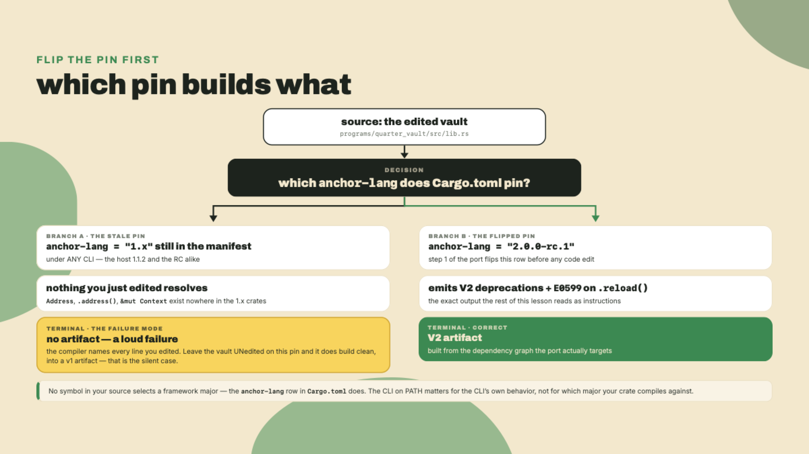
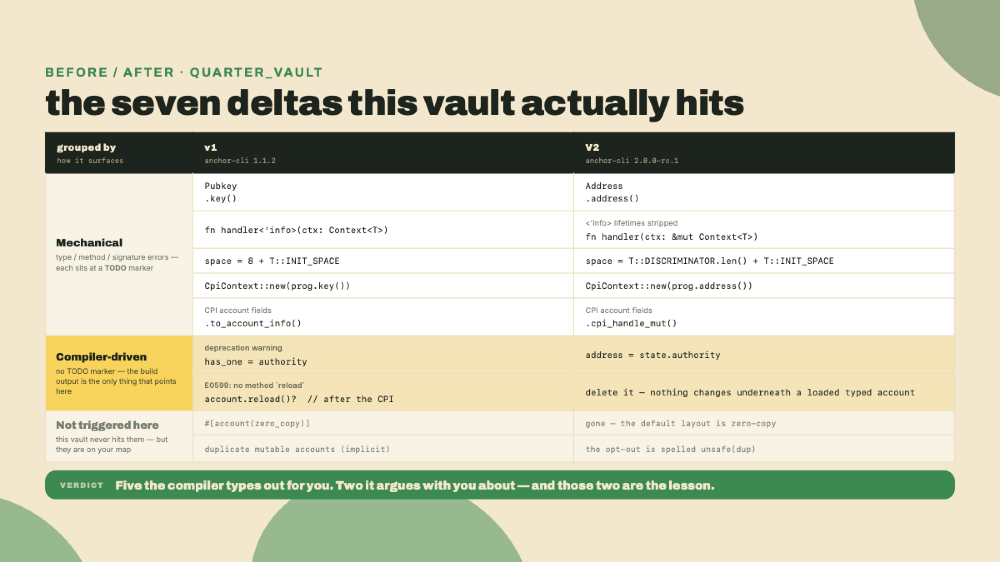
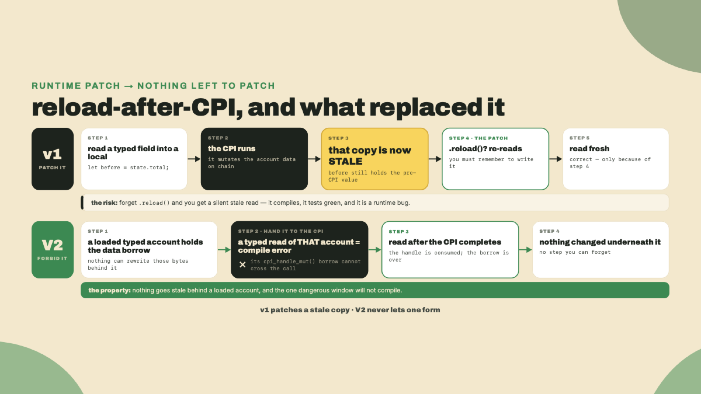
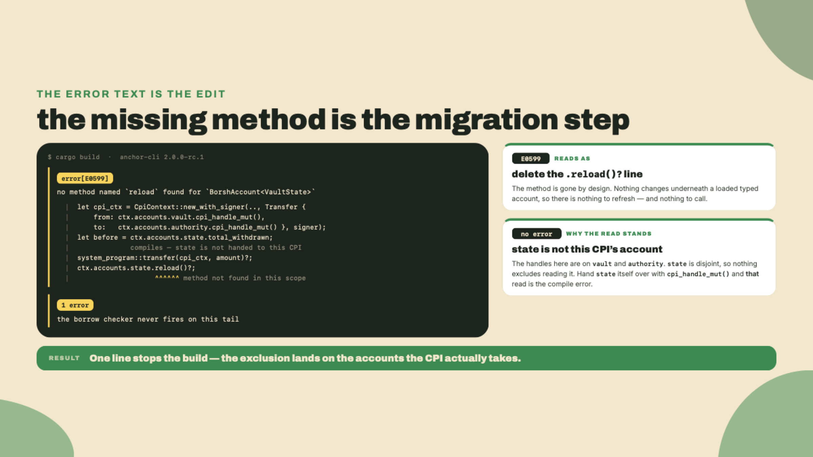
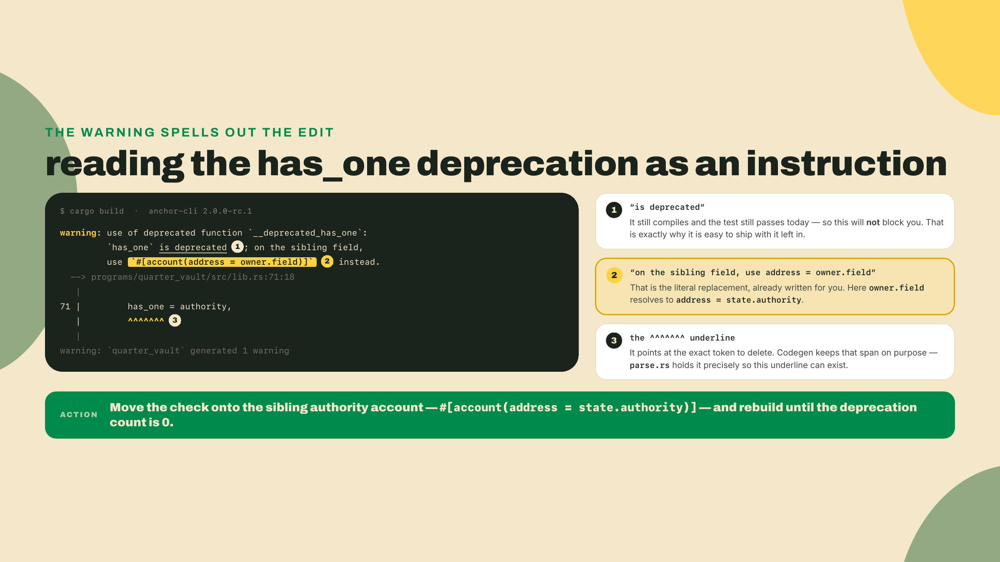
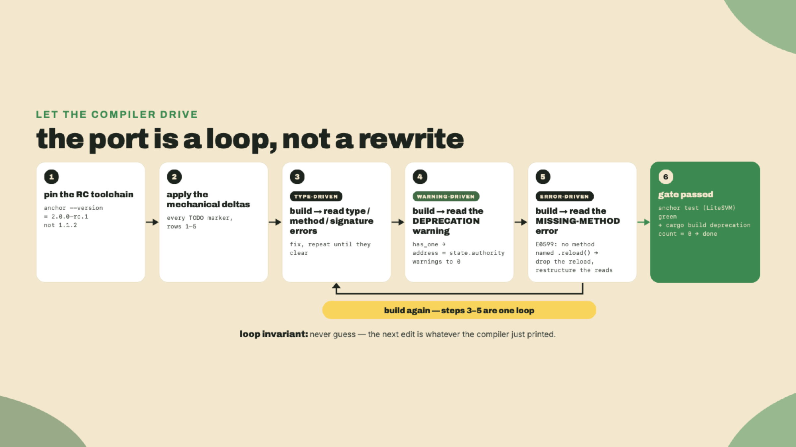
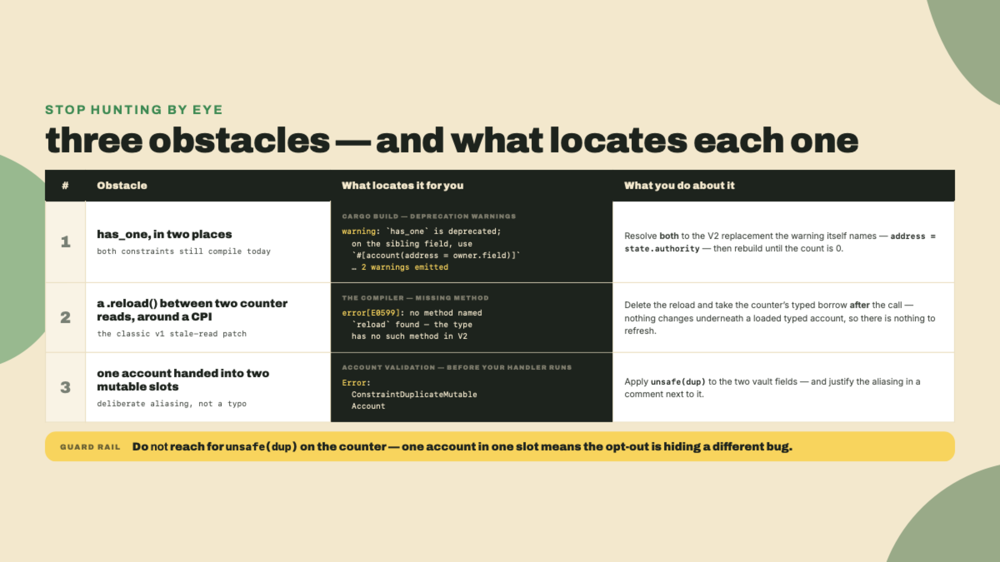

# Migration capstone: port a 0.31/1.0 program to V2

In m10-l2 you finished the second map. Every 1.x to 2.0 rewrite delta, from `Pubkey` becoming `Address` to the repurposed `AccountLoader`. You also drove two small ports: a fifty-line config program in the lab, with the delta table open beside you, and a space calc in the challenge. So: two maps and two scratch exercises. What you have not done is take a codebase you did not write across the line. That changes now.

Because here is the thing about a map: it is not the drive. You can read both delta maps front to back, nod at every arrow, and still freeze the first time a real codebase throws a wall of red error text at you. So we are going to take a real program, one that does not build on V2, and drive it to green together. Not admire the deltas. Apply them.

Before you read another paragraph, run this and look at the number it prints:

```bash
anchor --version
```

On this course's reference machine that says `anchor-cli 1.1.2`. Hold onto that number — not because the CLI decides what your build is (it does not, and the single most important fact in this lesson is *what actually does*), but because a machine that prints 1.x is a machine whose habits, and whose handed vault, are still pinned to the 1.x crates. The pin is the story. We come back to it in step 1.

## Summary

You are handed a working Anchor 0.31/1.0 lamport vault: a state account, a PDA that holds SOL, and three instructions (`initialize`, `deposit`, and a PDA-signed `withdraw`). It compiles fine on 1.x. It does not compile on the Anchor V2 RC. Your job is to make the compiler go green and the LiteSVM test pass, working the two delta maps as a checklist.

The vault was picked to be boring on purpose. It echoes the quarter-vault you built back in m03 and m04, so almost none of your attention goes to "what does this program do." All of it goes to the migration itself. That is the whole design: low domain load, high migration focus.

Most of the deltas are mechanical, and the provided program marks them for you with `// TODO(migrate):` comments. The two that matter most carry no marker at all, because by the end you will not need one. The compiler will tell you. A deprecation warning underlines the exact constraint to change. A missing method points at the exact line where a v1 habit no longer has anything to call. That is the emotional core of this capstone: you have learned enough that the toolchain's own output is a good enough guide. We call it *letting the compiler drive*, and it is a real V2 affordance, not a motivational slogan. You will see why.

One honest caveat up front, because it shapes everything: this port compiles today against a moving target. The Anchor V2 line is `2.0.0-rc.1`, and the anchor-next branch it lives on is labelled alpha by its own maintainers: not audited, APIs may break between commits, and the docs lag the code (the rc.1 crates reached crates.io on 2026-08-12, yet the install docs still describe the pre-publish world). So we build this not as an eternal artifact but as a re-verifiable one. When a later RC renames a constraint under you, you re-run the checklist. That is migration reality, and the final lesson of this course asks whether you should sign up for it at all.

## The migration, delta by delta

Let's get the toolchain right first, because every other delta is downstream of it.

### The toolchain is the whole ballgame

Remember that `1.1.2` from a minute ago? Here is the trap it sets, and it is subtler than "wrong binary." The handed vault compiles fine on 1.x, which means its `Cargo.toml` pins `anchor-lang` on the 1.x line — and *that pin, not the CLI on your PATH, is what selects the framework major*. `anchor build` is a wrapper; underneath it, cargo resolves your crate graph identically whichever anchor-cli invoked it. So if you clone the vault, start fixing type names, and never touch the manifest, you do not get a silent v1 artifact — you get a loud failure: `Address`, `.address()`, `&mut Context` exist nowhere in the 1.x crates, and the compiler says so at every site you just edited. The reverse holds too: bump the pin to `2.0.0-rc.1` and even the host's old CLI surfaces the V2 deprecations and the missing-method error, because those diagnostics come from the macros in the dependency graph, not from the binary that shelled out to cargo. You have already met this inversion twice — m10-l1's recon had you `rg "anchor_version|anchor-lang"` precisely because the pin is the fact that matters, and m10-l2 told you to pin the exact version in `Anchor.toml` and `Cargo.toml`. The version the *build* is, is the version the *manifest* says.

So the first move is not a handler edit. It is two pins, made together: the `anchor-lang = "2.0.0-rc.1"` row in the program's `Cargo.toml`, which is the switch that actually flips the major, and an isolated V2 CLI, which keeps every wrapper-level behavior — scaffolds, the test harness, IDL handling — on the same line as the crates, so `anchor --version` stays a truthful label for the whole toolchain.

The install fights you a little, and it is worth knowing why. V2 has no GitHub Release object. There is a git tag, `v2.0.0-rc.1` on the anchor-next branch, but no published release for that tag, which means `avm install` cannot download a prebuilt binary for it the way it does for stable versions — the asset URL just 404s. The rc.1 crates did land on crates.io on 2026-08-12, but the docs lag that publish and the documented path is a direct git install (the docs point at the `anchor-next` branch tip; this course pins the tag that sits on that branch, for the reproducibility reason m01-l2 laid out):

```bash
# Anchor V2 RC - installed straight from the anchor-next repo by tag.
# No GitHub Release cut for the tag, so `avm install` finds no binary to fetch.
# macOS needs LTO off or the release build blows up; harmless elsewhere.
CARGO_PROFILE_RELEASE_LTO=off \
cargo install --git https://github.com/otter-sec/anchor \
  --tag v2.0.0-rc.1 anchor-cli --locked --force
```

Freshness note: `v2.0.0-rc.1` is the pin as of 2026-08-22, and it is on a branch its own docs call alpha with APIs that may break between commits. Before you trust a build, re-check the current tag on anchor-next and update the pin. This is not a version to memorize; it is one to re-verify.

Two more toolchain facts you need. V2's minimum supported Rust is `1.89.0`, hard-coded as `ANCHOR_MSRV` in the CLI and written into the `rust-toolchain.toml` it scaffolds, so confirm your compiler and update if you are behind:

```bash
rustc --version      # need >= 1.89.0 for V2
rustup update        # if you are below it
```

And you must not let the ambient 1.1.2 leak back in during verification. The way you guarantee that is to pin the RC in the verify container so the build never touches the host toolchain:

```dockerfile
# verify/Dockerfile - the port builds ONLY against the pinned RC.
FROM rust:1.89
ENV CARGO_PROFILE_RELEASE_LTO=off
RUN cargo install --git https://github.com/otter-sec/anchor \
      --tag v2.0.0-rc.1 anchor-cli --locked --force
WORKDIR /work
COPY . .
CMD ["anchor", "test"]
```



That is the load-bearing setup. Get it wrong and every code edit below is theater. Get it right and the compiler starts doing your job for you.

### The delta map, on one page

Here is every rewrite delta the vault touches, side by side. This is the checklist. Keep it open while you work.

| # | v1 (0.31/1.0) | V2 (2.0.0-rc.1) | how you find it |
|---|---|---|---|
| 1 | `Pubkey` | `Address` | type error on the field |
| 2 | `account.key()` | `account.address()` | method-not-found error |
| 3 | `struct Foo<'info>` + `ctx: Context<Foo>` | drop `<'info>`, handler takes `&mut Context<Foo>` | lifetime / signature error |
| 4 | `space = 8 + T::INIT_SPACE` | `space = T::DISCRIMINATOR.len() + T::INIT_SPACE` | still compiles, but the map says fix it |
| 5 | `CpiContext::new(prog.key()..)` | `CpiContext::new(prog.address()..)`, CPI accounts become `.cpi_handle_mut()` | type error: expected `&Address` |
| 6 | `has_one = authority` | `address = state.authority` on the authority account | **deprecation warning underlines it** |
| 7 | `account.reload()?` after a CPI | delete it; nothing changes underneath a loaded typed account | **E0599: no method named `reload`** |

One note on row 5 before you use the table. The vault you are handed builds on 1.1.2, so its CPI already passes the program as a `Pubkey` with `.key()`; that hop was m10-l1's change two. If the codebase you bring to a real port is still on 0.31 it will read `.to_account_info()` there instead, and you make both hops at once.

Two rows are missing on purpose, and both are worth a sentence so your map is complete even though this vault does not trip them.

`zero_copy` is now the default layout in V2, so the attribute is simply gone. Our vault never used it, so there is nothing to strip. On a program that did, you would delete the attribute and the account keeps working, because what used to be an opt-in is now just how accounts are laid out.

`unsafe(dup)` is the more interesting one, and the challenge will make you use it, so understand it now. V2 disallows duplicate mutable accounts by default. The reason is a real footgun: if the same account arrives in two mutable slots, your handler ends up holding two `&mut` references to one account, and edits through one silently clobber edits through the other. v1 let you do this and hoped you knew what you were doing. V2 rejects it, at validation, before your handler runs. When you genuinely mean to be handed one account under two mutable names, you opt back in per field by spelling the constraint `unsafe(dup)`. The word `unsafe` is doing honest work: it is you telling the compiler you have checked the invariant it can no longer check for you, and taking on the obligation to write the handler so it never holds two conflicting mutable references. Note what does *not* need the opt-out: two mutable slots that always resolve to two different addresses, the way a swap's two reserves do, satisfy the check for free. Our lab vault has exactly one account of each type, so it never comes up. The challenge's consolidating sweep does.



### Why `.reload()` is gone (and why that is good)

Rows 1 through 5 are find-and-replace with a compiler checking your work. Rows 6 and 7 are the ones worth understanding, because they are where the port stops being mechanical.

Start with `.reload()`, because it is the one that trips up every experienced v1 dev, and the reasoning behind its removal is the most interesting idea in the whole migration.

Here is the v1 pattern, and it is not even a bad one:

```rust
// v1 withdraw tail: build the transfer, read state while it is pending, run it, reload.
let cpi_ctx = CpiContext::new_with_signer(sys, Transfer { from, to }, signer);
let before = ctx.accounts.state.total_withdrawn; // legal in v1: `from`/`to` are AccountInfo clones
system_program::transfer(cpi_ctx, amount)?;
ctx.accounts.state.reload()?;                    // re-deserialize after the CPI
let bal = ctx.accounts.state.total_deposited;    // read the "fresh" value
```

You derived the removal last lesson: stale typed reads across a CPI boundary were a patch-shaped bug, and `CpiHandle` borrow-tracking makes them inexpressible — one borrow per account handed to the CPI, and nothing wider, exactly as m04-l2 walked it. No re-derivation here. What this lesson adds is the *edge* of that rule, because it is narrower than it first sounds and this vault sits right on it. Port that tail line for line and exactly one line stops the build: `.reload()`, which no longer exists as a method to call. The `total_withdrawn` read a line above it survives, because this transfer's handles are on `vault` and `authority` while `state` is a disjoint account the callee could never have written — nothing to exclude there, and nothing that could have gone stale. That is the model doing its job, not failing to: the exclusion lands on the accounts the CPI can actually change. Hand a CPI a typed account, the way m04-l2's token probe did, and a mid-CPI read of *that* account is the compile error.

Sit with that for a second, because it is a genuinely different philosophy — and keep two mechanisms apart, because the borrow checker is only half of it. The first is the account model itself. V2's default `Account<T>` is a zero-copy *view* over the account's bytes, not a copy decoded once at the top of the instruction, so there is no second copy that could drift out of date. The borsh tier you are about to use here, `BorshAccount<T>`, does still decode into a copy — but it holds the account's data borrow for as long as it is loaded, and you have to hand that borrow over explicitly before a CPI can write those bytes. Either way, nothing changes underneath a loaded typed account without your say-so, so there is nothing for a re-deserialize call to re-read. That is why the method does not exist. The second mechanism is the borrow model, and it covers the remaining window: while a CPI holds a handle to an account, typed access to *that* account will not compile. v1 gave you a tool to avoid a footgun. V2 removed the places the footgun could sit. The bug class is gone, not guarded.



So the fix is not "find the V2 name for reload." There is none. The fix is structural: do not hold typed data of an account this CPI takes across the CPI. Read the scalars you need (the bump, the state key) into locals before the transfer, run the transfer, then take a fresh typed borrow after it completes to update your counters — and that post-CPI read is already live, which is why there is nothing left for a `.reload()` to do. The error is not an obstacle. It is the instruction. That is letting the compiler drive.



### Why `has_one` still compiles but you fix it anyway

Row 6 is the other no-marker edit, and it teaches a different reflex.

`has_one = authority` still works in V2. It parses, it checks, the test passes with it in place. So why touch it? Because when you build, you get this:

```text
warning: use of deprecated function `__deprecated_has_one`: `has_one` is
         deprecated; on the sibling field, use
         `#[account(address = owner.field)]` instead.
   --> programs/quarter_vault/src/lib.rs:126:9
    |
126 |         has_one = authority,
    |         ^^^^^^^
```

Two things about that warning are worth noticing. First, it names the replacement exactly, and it tells you where to put it: on the sibling field, as `#[account(address = owner.field)]`. For our vault, that is `address = state.authority` placed on the `authority` account, which checks that the passed authority's address equals the `authority` field stored in `state`. Same guarantee, new spelling. Second, and this is the color beat I want you to hold: that underline is not an accident. Down in the parser, `parse.rs` deliberately keeps the `has_one` keyword's source span around so that codegen can emit a warning pointing right back at those exact characters. Nobody underlines a token they did not plan to deprecate. The toolchain was built to guide the migration it created. The warning is a feature, not noise.



And on a moving RC, deprecated syntax is precisely what a later version is most likely to remove. Resolving deprecations to zero is not tidiness. It is how you keep the port building against next month's tag. The warning is a checklist item that the framework hands you for free.

Here is the before and after for that one constraint:

```rust
// v1: has_one lives on the state account (seeds elided).
#[account(mut, has_one = authority)]
pub state: Account<'info, VaultState>,
#[account(mut)]
pub authority: Signer<'info>,
```

```rust
// V2: the equivalence check moves onto the authority account as an address constraint.
#[account(mut)]
pub state: BorshAccount<VaultState>,
#[account(address = state.authority)]
pub authority: Signer,
```

Notice the declaration order: `state` before `authority`, so the `address = state.authority` expression can resolve — the handed vault already lists them that way, and the V2 spelling is what makes that order load-bearing. Notice too the dropped `<'info>` on the typed account. Those are rows 1 through 3 riding along. The deltas cluster; fixing one often lands three.

## Lab: drive the vault to green

Time to build. You have the delta map and you understand the two hard rows. Now apply them. The handed program is printed in full below. Scaffold a project with the 1.1.2 CLI already on your machine (`anchor init quarter_vault` — this is the one legitimate use the old toolchain has left in this course), replace the generated `programs/quarter_vault/src/lib.rs` with the listing, and make sure the program's manifest carries the v1 row the scaffold wrote:

```toml
# programs/quarter_vault/Cargo.toml — the row step 1 will flip.
[dependencies]
anchor-lang = "1.1.2"
```

Here is the vault, whole. The `// TODO(migrate):` markers sit at the mechanical sites; work top to bottom.

```rust
// programs/quarter_vault/src/lib.rs — the handed 0.31/1.0 vault.
// Builds clean on anchor-lang 1.1.2. Does NOT build on the V2 RC.
// The `// TODO(migrate):` markers flag the mechanical sites (rows 1-5).
// Rows 6 and 7 carry no marker on purpose: the compiler finds them for you.

use anchor_lang::prelude::*;
use anchor_lang::system_program::{self, Transfer};

declare_id!("Quart3rVau1t1111111111111111111111111111111");

#[account]
#[derive(InitSpace)]
pub struct VaultState {
    pub authority: Pubkey, // TODO(migrate): row 1 — Pubkey -> Address
    pub bump: u8,
    pub vault_bump: u8,
    pub total_deposited: u64,
    pub total_withdrawn: u64,
}

#[error_code]
pub enum VaultError {
    #[msg("counter overflow")]
    Overflow,
}

#[program]
pub mod quarter_vault {
    use super::*;

    // TODO(migrate): row 3 — handlers take `&mut Context<T>` in V2.
    pub fn initialize(ctx: Context<Initialize>) -> Result<()> {
        let authority = ctx.accounts.authority.key(); // TODO(migrate): row 2 — .key() -> .address()
        let state = &mut ctx.accounts.state;
        state.authority = authority;
        state.bump = ctx.bumps.state; // canonical bumps, stored once
        state.vault_bump = ctx.bumps.vault;
        state.total_deposited = 0;
        state.total_withdrawn = 0;
        Ok(())
    }

    pub fn deposit(ctx: Context<Deposit>, amount: u64) -> Result<()> {
        system_program::transfer(
            CpiContext::new(
                ctx.accounts.system_program.key(), // TODO(migrate): row 5 — &Address + cpi handles
                Transfer {
                    from: ctx.accounts.depositor.to_account_info(),
                    to: ctx.accounts.vault.to_account_info(),
                },
            ),
            amount,
        )?;
        let state = &mut ctx.accounts.state;
        state.total_deposited = state
            .total_deposited
            .checked_add(amount)
            .ok_or(VaultError::Overflow)?;
        Ok(())
    }

    pub fn withdraw(ctx: Context<Withdraw>, amount: u64) -> Result<()> {
        let state_key = ctx.accounts.state.key(); // TODO(migrate): row 2
        let vault_bump = ctx.accounts.state.vault_bump;

        let seeds: &[&[u8]] = &[b"vault", state_key.as_ref(), &[vault_bump]];
        let signer = &[seeds];

        // v1 tail: build the transfer, read state while it is pending, run it, reload.
        let cpi_ctx = CpiContext::new_with_signer(
            ctx.accounts.system_program.key(), // TODO(migrate): row 5
            Transfer {
                from: ctx.accounts.vault.to_account_info(),
                to: ctx.accounts.authority.to_account_info(),
            },
            signer,
        );
        let already_out = ctx.accounts.state.total_withdrawn; // legal in v1: the CPI holds AccountInfo clones
        system_program::transfer(cpi_ctx, amount)?;

        ctx.accounts.state.reload()?; // v1 habit: re-deserialize after the CPI

        let state = &mut ctx.accounts.state;
        state.total_withdrawn = already_out
            .checked_add(amount)
            .ok_or(VaultError::Overflow)?;
        Ok(())
    }
}

// TODO(migrate): row 3 — drop the <'info> lifetimes on every struct below.
#[derive(Accounts)]
pub struct Initialize<'info> {
    #[account(
        init,
        payer = authority,
        space = 8 + VaultState::INIT_SPACE, // TODO(migrate): row 4 — no magic 8 in V2
        seeds = [b"state", authority.key().as_ref()],
        bump
    )]
    pub state: Account<'info, VaultState>,
    #[account(mut)]
    pub authority: Signer<'info>,
    #[account(seeds = [b"vault", state.key().as_ref()], bump)]
    pub vault: SystemAccount<'info>,
    pub system_program: Program<'info, System>,
}

#[derive(Accounts)]
pub struct Deposit<'info> {
    #[account(mut, seeds = [b"state", state.authority.as_ref()], bump = state.bump)]
    pub state: Account<'info, VaultState>,
    #[account(mut)]
    pub depositor: Signer<'info>,
    #[account(mut, seeds = [b"vault", state.key().as_ref()], bump = state.vault_bump)]
    pub vault: SystemAccount<'info>,
    pub system_program: Program<'info, System>,
}

#[derive(Accounts)]
pub struct Withdraw<'info> {
    #[account(
        mut,
        seeds = [b"state", authority.key().as_ref()],
        bump = state.bump,
        has_one = authority,
    )]
    pub state: Account<'info, VaultState>,
    #[account(mut)]
    pub authority: Signer<'info>,
    #[account(mut, seeds = [b"vault", state.key().as_ref()], bump = state.vault_bump)]
    pub vault: SystemAccount<'info>,
    pub system_program: Program<'info, System>,
}
```

That file `cargo check`s clean against `anchor-lang 1.1.2` — zero errors, zero deprecation warnings, because the deprecations are a V2 story and surfacing them is what step 6 is for. And if you took From Bitcoin to Solana, this is your own vault from its an-anchor-vault lesson — the same record-plus-vault split, the same stored canonical bumps, the same authority gate, with the single `balance` field grown into the two counters — so you are welcome to port the one your own hands built instead.

**1. Flip the pin, then stand up the isolated toolchain.** First the edit that actually selects V2 — the manifest move the theory section just made load-bearing. Open `programs/quarter_vault/Cargo.toml` and change the `anchor-lang` row from its 1.x version to the RC:

```toml
[dependencies]
anchor-lang = "2.0.0-rc.1"   # was a 1.x row; THIS line is what selects the framework major
```

Without this edit, none of steps 2 through 7 can even begin to compile: every rename below targets names that do not exist in the 1.x crates. Then install the RC CLI exactly as above, and confirm the label is truthful:

```bash
CARGO_PROFILE_RELEASE_LTO=off \
cargo install --git https://github.com/otter-sec/anchor \
  --tag v2.0.0-rc.1 anchor-cli --locked --force

anchor --version    # must now report 2.0.0-rc.1, NOT 1.1.2
```

If that still says 1.1.2, your PATH is resolving the old binary first. That will not change which framework your crate graph compiles against — the pin above governs that — but a mislabeled toolchain is how scaffold, test-harness, and IDL behavior drift off the line your crates are on, so fix it before writing a single line. This is step 1 for a reason.

**2. Rename the types (rows 1 and 2).** Change every `Pubkey` to `Address` and every `.key()` to `.address()`. Build. The compiler will list the ones you missed as type and method errors. Let it. Here is the state struct after this pass:

```rust
use anchor_lang::prelude::*;
use anchor_lang::system_program::{self, Transfer};

declare_id!("Quart3rVau1t1111111111111111111111111111111");

#[account(borsh)]
#[derive(InitSpace)]
pub struct VaultState {
    pub authority: Address,   // was Pubkey
    pub bump: u8,
    pub vault_bump: u8,
    pub total_deposited: u64,
    pub total_withdrawn: u64,
}
```

Note the `(borsh)` you had to add, because this is the delta the map does not list and the port trips on immediately. Bare `#[account]` in V2 means zero-copy Pod, and Pod means `#[repr(C)]` with a compile-time assertion that the struct's size equals the sum of its field sizes. `VaultState`'s fields sum to 50 bytes, but the two `u64`s force 8-byte alignment, so `repr(C)` rounds the struct to 56 and the assertion fires: "account struct has padding bytes." You have two legal exits. Re-lay the state out with alignment-1 fields (the prelude ships `PodU64`, `PodI128`, `PodBool` for exactly this) and keep the zero-copy path, or send this one account down the borsh path with `#[account(borsh)]` and the `BorshAccount<T>` wrapper. A 1:1 port takes the second exit, which is also the one `#[derive(InitSpace)]` is documented against. Re-architecting for Pod is the separate project we talk about at the end.

**3. Strip lifetimes and fix handler signatures (row 3).** Drop `<'info>` from every accounts struct and its field types. Change each handler from `ctx: Context<T>` to `ctx: &mut Context<T>`. The `initialize` handler after this pass:

```rust
#[program]
pub mod quarter_vault {
    use super::*;

    pub fn initialize(ctx: &mut Context<Initialize>) -> Result<()> {
        let authority = *ctx.accounts.authority.address();   // .address() returns &Address
        let state = &mut ctx.accounts.state;
        state.authority = authority;
        state.bump = ctx.bumps.state;
        state.vault_bump = ctx.bumps.vault;
        state.total_deposited = 0;
        state.total_withdrawn = 0;
        Ok(())
    }
    // deposit, withdraw below
}
```

Build again. Expect every lifetime and signature error to clear, and expect the CPI and constraint rows below to still be red. That shrinking error list is your progress bar.

**4. Fix the space calc (row 4).** This one still compiles as `8 + VaultState::INIT_SPACE`, so the compiler will not force you. The map does. Replace the magic `8` with the discriminator's real length:

```rust
#[account(
    init,
    payer = authority,
    space = VaultState::DISCRIMINATOR.len() + VaultState::INIT_SPACE,  // was 8 +
    seeds = [b"state", authority.address().as_ref()],
    bump
)]
pub state: BorshAccount<VaultState>,
```

**5. Fix the deposit CPI (row 5).** Two edits ride together here. `CpiContext::new` now takes the program as `&Address`, and `.address()` already hands you one, so there is no `&` to add. The accounts inside `Transfer` are no longer `AccountInfo`s either: V2 declares them as `CpiHandleMut`, which is the borrow-tracked handle row 7 is about, so you build them with `.cpi_handle_mut()`. The deposit transfer, from the depositor into the vault PDA:

```rust
pub fn deposit(ctx: &mut Context<Deposit>, amount: u64) -> Result<()> {
    system_program::transfer(
        CpiContext::new(
            ctx.accounts.system_program.address(),   // was .key()
            Transfer {
                from: ctx.accounts.depositor.cpi_handle_mut(),
                to: ctx.accounts.vault.cpi_handle_mut(),
            },
        ),
        amount,
    )?;
    let state = &mut ctx.accounts.state;
    state.total_deposited = state
        .total_deposited
        .checked_add(amount)
        .ok_or(VaultError::Overflow)?;
    Ok(())
}
```

Build. The mechanical rows are done. Now the two the compiler drives.

A quick word on what you are probably seeing right now, because two failures are common at this exact point and both look scarier than they are. If the build spews dozens of `Address`-vs-`Pubkey` type errors in files you never touched, you missed a `.key()` somewhere upstream and the wrong type is propagating. Fix the earliest one in the compiler's list first, not the loudest, because the later errors are usually just fallout from it. And if it spews unresolved-name errors on the very lines you already fixed — `Address` unknown, `.address()` missing — the culprit is the other half of step 1: the `anchor-lang` pin is still on 1.x, so the names you renamed *toward* do not exist in the graph you are compiling against. The CLI on your PATH can neither cause nor cure either symptom; the diagnostics come from the crates cargo resolved, exactly as step 1 said. That is the manifest reaching out to bite you, precisely as promised.

**6. Solo: resolve the deprecation warning (row 6).** There is no TODO for this. Build and read the warning. It underlines `has_one = authority` and names the replacement. Move the check to an `address` constraint on the authority account, exactly as shown earlier. Rebuild until the deprecation count is zero. Do not stop at "the test passes." Stop at "the warning is gone."

**7. Solo: resolve the missing method (row 7).** Also no TODO. The provided `withdraw` copies the v1 pattern: it builds the signed `CpiContext` into a local, reads `state` while that value is still sitting there, runs the transfer, calls `.reload()`, then reads again. On V2 exactly one of those lines stops the build: `.reload()` does not exist. The `state` read a line above it is fine here, because this transfer's handles are on `vault` and `authority` and `state` is a disjoint account the callee never touches. Delete the reload, and restructure so the counter update takes a fresh typed borrow after the call — and so that nothing the signer seeds borrow goes out of scope before the CPI uses them. Here is the shape you are aiming at; write it before you read it, because step 6 and step 7 are the two the compiler is supposed to drive:

```rust
pub fn withdraw(ctx: &mut Context<Withdraw>, amount: u64) -> Result<()> {
    // Copy the scalars into locals BEFORE the CPI: `seeds` borrows `state_key`,
    // so the local has to outlive the call that uses `signer`.
    let state_key = *ctx.accounts.state.address();
    let vault_bump = ctx.accounts.state.vault_bump;

    let seeds: &[&[u8]] = &[b"vault", state_key.as_ref(), &[vault_bump]];
    let signer = &[seeds];

    system_program::transfer(
        CpiContext::new_with_signer(
            ctx.accounts.system_program.address(),
            Transfer {
                from: ctx.accounts.vault.cpi_handle_mut(),
                to: ctx.accounts.authority.cpi_handle_mut(),
            },
            signer,
        ),
        amount,
    )?;

    // NO .reload(). Take a FRESH typed borrow only after the CPI has completed.
    let state = &mut ctx.accounts.state;
    state.total_withdrawn = state
        .total_withdrawn
        .checked_add(amount)
        .ok_or(VaultError::Overflow)?;
    Ok(())
}
```

The `Withdraw` accounts struct carries row 6's fix:

```rust
#[derive(Accounts)]
pub struct Withdraw {
    #[account(mut, seeds = [b"state", authority.address().as_ref()], bump = state.bump)]
    pub state: BorshAccount<VaultState>,
    #[account(mut, address = state.authority)]     // replaces has_one = authority
    pub authority: Signer,
    #[account(mut, seeds = [b"vault", state.address().as_ref()], bump = state.vault_bump)]
    pub vault: SystemAccount,
    pub system_program: Program<System>,
}
```

**8. Run the gate.** The acceptance test is the same shape every rung in this course used: a LiteSVM test that passes. LiteSVM is the default Anchor test template, so `anchor init` scaffolded a Rust harness under `tests/`. Reach LiteSVM the way the rest of this course did, through the scaffold's wrapper rather than a direct pin, so your harness cannot drift off the version the toolchain expects (the rc.1 `anchor-v2-testing` pins `litesvm 0.11`; crates.io's latest litesvm is 0.16.0 as of 2026-09-07, four minors ahead, which is exactly why you do not pin it yourself):

```toml
# programs/quarter_vault/Cargo.toml - dev-dependencies
[dev-dependencies]
anchor-v2-testing = { git = "https://github.com/otter-sec/anchor", tag = "v2.0.0-rc.1" }
```

The provided program ships three send helpers in `tests/helpers.rs`, one per instruction, all the same shape. Here is `send_initialize` so you can see what the other two do with an added `amount: u64` in their instruction data:

```rust
// tests/helpers.rs (provided)
use anchor_lang::{
    prelude::Address, programs::System, solana_program::instruction::Instruction, Id,
    InstructionData, ToAccountMetas,
};
use anchor_v2_testing::{
    Keypair, LiteSVM, Message, Signer as _, VersionedMessage, VersionedTransaction,
};

pub fn send_initialize(svm: &mut LiteSVM, authority: &Keypair, state: Address, vault: Address) {
    let ix = Instruction {
        program_id: quarter_vault::ID,
        accounts: quarter_vault::accounts::Initialize {
            state,
            authority: authority.pubkey(),
            vault,
            system_program: System::id(),
        }
        .to_account_metas(None),
        data: quarter_vault::instruction::Initialize {}.data(),
    };
    let blockhash = svm.latest_blockhash();
    let msg = Message::new_with_blockhash(&[ix], Some(&authority.pubkey()), &blockhash);
    let tx = VersionedTransaction::try_new(VersionedMessage::Legacy(msg), &[authority]).unwrap();
    svm.send_transaction(tx).unwrap();
}
```

The test itself drives the full lifecycle, init then deposit then PDA-signed withdraw, and asserts the vault balance moved:

```rust
mod helpers;
use helpers::{send_deposit, send_initialize, send_withdraw};
use anchor_lang::prelude::Address;
use anchor_v2_testing::{svm, Keypair, Signer as _};

#[test]
fn init_deposit_withdraw_roundtrip() {
    let mut svm = svm();
    let program_id = quarter_vault::ID;
    let vault_so = concat!(env!("CARGO_MANIFEST_DIR"), "/../../target/deploy/quarter_vault.so");
    svm.add_program_from_file(program_id, vault_so).unwrap();

    let authority = Keypair::new();
    svm.airdrop(&authority.pubkey(), 5_000_000_000).unwrap();

    let (state, _) =
        Address::find_program_address(&[b"state", authority.pubkey().as_ref()], &program_id);
    let (vault, _) =
        Address::find_program_address(&[b"vault", state.as_ref()], &program_id);

    // init -> deposit(1 SOL) -> withdraw(0.4 SOL), each through the helper above.
    send_initialize(&mut svm, &authority, state, vault);
    send_deposit(&mut svm, &authority, state, vault, 1_000_000_000);
    send_withdraw(&mut svm, &authority, state, vault, 400_000_000);

    let vault_lamports = svm.get_account(&vault).unwrap().lamports;
    assert_eq!(vault_lamports, 600_000_000, "vault should hold 0.6 SOL after the round-trip");
}
```

Then the gate itself:

```bash
anchor test                              # LiteSVM suite: init, deposit, PDA-signed withdraw
touch programs/quarter_vault/src/lib.rs  # belt and braces: force a genuine recompile before the grep
cargo build 2>&1 | rg "deprecat"         # must print nothing (rg exits 1 on zero matches)
```

That `touch` is belt and braces rather than load-bearing, and the distinction is worth a sentence: modern cargo caches a crate's diagnostics and *replays* them on warm builds, so the grep would catch a lingering `has_one` even against a build that recompiled nothing. Touching the file just makes the line you grep provably this build's fresh output rather than a replay — cheap insurance when you are about to report a number as final.

Then run the same two commands inside the verify container, so the result you report was produced by the pinned RC and never by whatever is on your PATH:

```bash
docker build -t v2-port verify/ && docker run --rm v2-port
```

Green test, zero deprecation warnings, on the RC toolchain, reproduced in the container. That is the port. That is the proof.



## Challenge

The lab handed you the vault. The challenge takes the training wheels off.

The **second** 0.31/1.0 program you assemble yourself, in `challenge/`, before you port it — ten minutes of the 1.x muscle memory you just retired, and it buys you a codebase with no TODO markers at all: a two-vault `sweep` instruction that moves lamports from a source vault PDA to a destination vault PDA in one call, and updates a shared counter after the transfer, written in full v1 idiom — `has_one` gating both vault states, and the counter read again through a `.reload()` after the CPI (the lab vault is your plumbing template; confirm the original builds clean on the 1.x line before you touch it). Its operators also use it to true up a single vault's counter by sweeping that vault into itself, so write the LiteSVM test to do exactly that — one account really does arrive in both mutable slots. Then port it to V2 and make that test pass with zero deprecation warnings.

Three things make it harder than the lab, and each maps to something you now know:

1. It uses `has_one` in two places. Resolve both from the deprecation warnings alone.
2. Its handler reads a counter, does the transfer CPI, then reads the counter again with a `.reload()` in between. Kill the reload and restructure the reads around the call. The missing-method error is your map.
3. The self-sweep hands **one account into two mutable slots** (source and destination). V2 rejects duplicate mutable accounts by default, so that test fails validation with `ConstraintDuplicateMutableAccount` before your handler runs. Apply `unsafe(dup)` to the two vault fields, and, because the name says `unsafe`, write one sentence in a comment justifying the aliasing: the handler must compute the move once and apply a single checked update, so it never holds two conflicting mutable references to the one account. If you find yourself reaching for `unsafe(dup)` on the counter as well, stop: that is one account in one slot, and the opt-out would be hiding a different bug.



Accept when `anchor test` passes on the RC toolchain and `cargo build` emits zero deprecation warnings. No hints beyond your two maps and the compiler. That is the point.

## Before you move on

Notice what just happened to the shape of this lesson. The early deltas came with TODO markers in the source and worked code you could read straight off the page. The last two lab steps had no markers in the source at all: the warning and the missing-method error located them for you, and the printed answer was there to check yourself against after you wrote your own. The challenge drops even that. That fade was deliberate. It matches where you are: at the start of the migration track you needed the delta named and located for you; by now the toolchain names and locates them better than a comment could. If step 7 felt less like following instructions and more like reading the compiler's mind, that is the skill this whole track was building toward. That is worth more than any single constraint rename.

And be honest with yourself about what this port is and is not. A checklist-driven migration is fast and mechanical, and it converts a program one-to-one. Your V2 vault keeps its v1 shape. It is not re-architected for V2's strengths, it is not the leanest Pod layout it could be, it is the old design that now compiles on the new framework. That is a real trade-off, not a failure: 1:1 is exactly what you want when the goal is "get it building safely," and re-architecting is a separate project you take on later, deliberately, not smuggled into a migration. The other half of the trade-off is the ground moving under you. This compiles today against `2.0.0-rc.1` on an alpha branch whose own docs warn that APIs may break between commits. A later RC may rename `address` or change how `unsafe(dup)` is spelled. You do not fight that. You re-run the checklist.

The port compiles and the test is green. You have taken a real v1 codebase all the way to V2, by hand, letting the compiler drive the last mile. One question remains, and it is not technical: given the RC-and-alpha tension, the uncommitted stable date, and the unaudited status, *should* you actually move to V2 today? That is a judgment call, not a compile error, and the next lesson, the course conclusion, answers it honestly.
