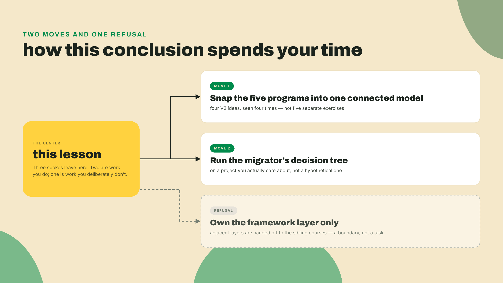
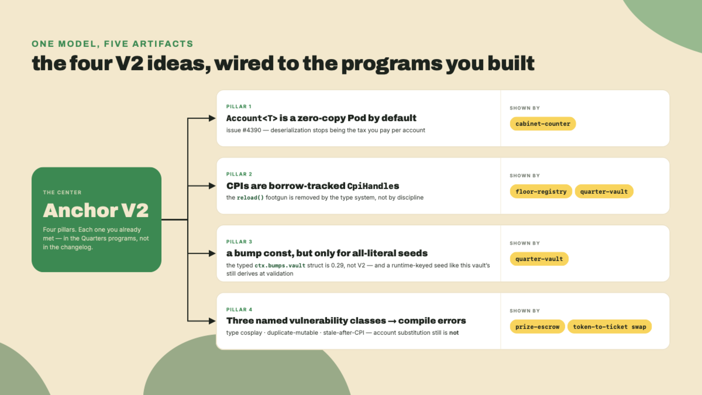
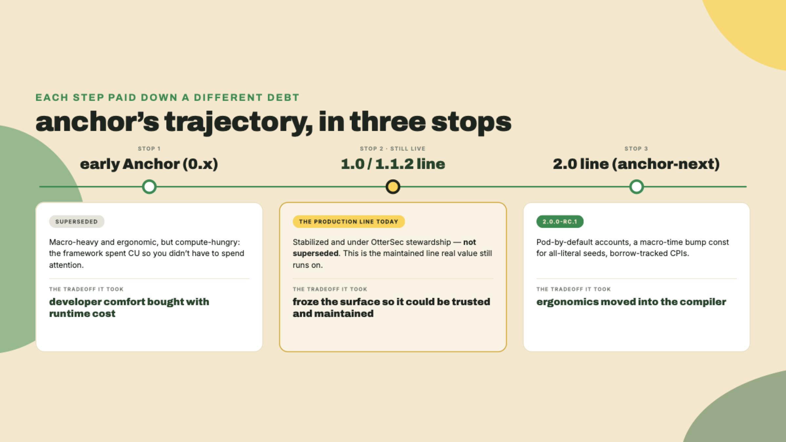
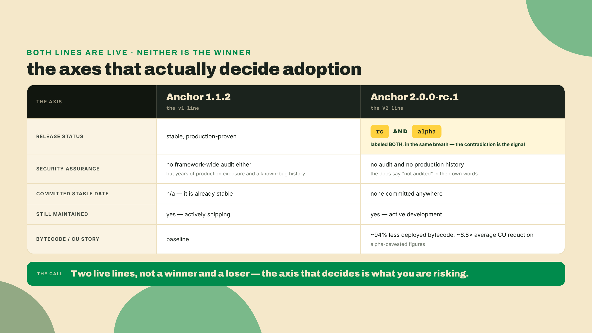
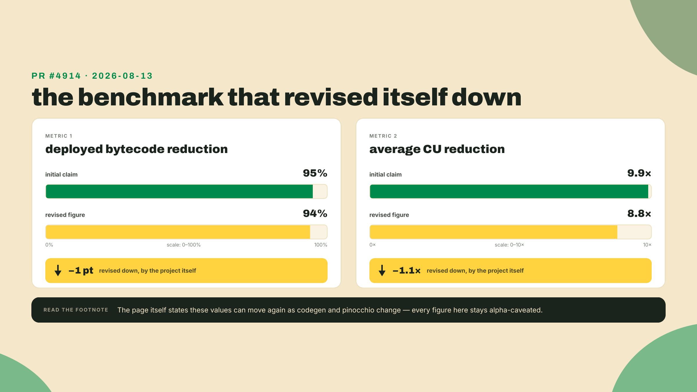
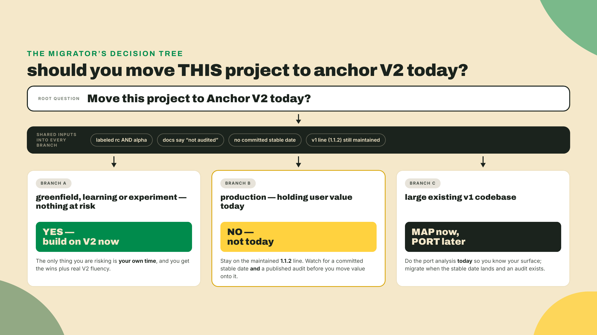
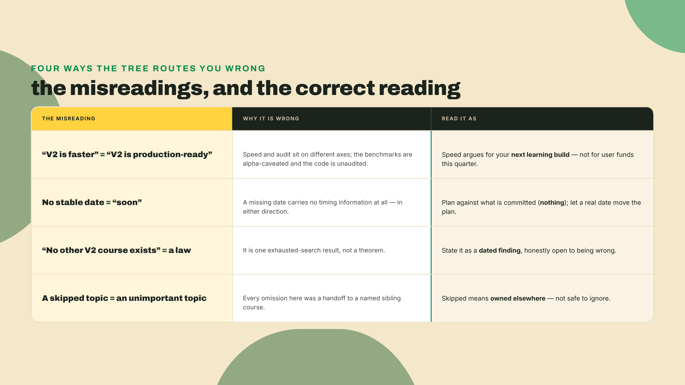
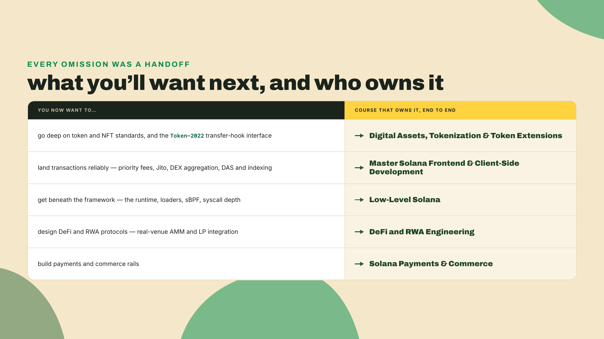

# Conclusion: what you built, and should you move to V2 today?

Last lesson you took a real 0.31/1.0 vault and drove it to a compiling, LiteSVM-passing V2 build, following the compiler's warnings like a punch-list until the port went green. That was the last thing this course had to teach you. You have now built Anchor V2 from scratch and migrated an old codebase into it. The arcade floor is done: a cabinet-counter, a quarter-vault, a prize-escrow, a token-to-ticket swap, and a floor-registry that CPIs them together. Tested, fuzzed, profiled, verified.

So here is the one thing left, and it is not a lab. Pick a project you actually care about, right now. Not a toy. Something with your name on it, or your team's. Write one line about it on a sticky note: is it holding real value today, is it a fresh build with nothing at stake, or is it a large codebase already running on the old line? Keep that note next to you. By the end of this lesson you will route it through a decision tree, out loud, and you will be able to defend the answer from the actual facts. That is the whole job of a conclusion that respects your time. Not a victory lap. One honest call you can now make alone.

## What this lesson does, and what it hands off

Two moves, and a deliberate refusal.



First, it snaps everything you built into one connected model, so the five programs stop being five exercises and become one picture of how V2 thinks. Second, it walks the migrator's decision tree against the real tensions in the project today, because "V2 is better" and "you should put your mainnet money on V2 this afternoon" are two different questions and only one of them is easy. The refusal: this course owns the framework layer and nothing else, so the close points you outward to the sibling courses that own the layers V2 sits on top of.

Here is the autonomy fade, stated plainly. Every earlier lesson walked you through the constraint at the moment you hit it. This one does not. I am not going to make the adoption call for you. I am going to hand you the tree and the honest inputs, then step back and let it be yours. That is what finishing a course is supposed to feel like: the scaffolding comes down and the thing still stands.

## The whole map, then the room you have to read

You did not learn five unrelated tricks. You learned four ideas, four times each, under different names. Line them up.

`Account<T>` is zero-copy Pod by default. That is the thesis from Anchor issue #4390, the one that reframed the whole rewrite: stop deserializing the entire account into the heap on every instruction, and start reading fields in place off a fixed layout. Your cabinet-counter was the smallest possible proof of it. It is also where the byte savings and the compute savings come from, because the work you used to pay for on every call simply is not there anymore.

CPIs are borrow-tracked `CpiHandle`s. The reload footgun — in V1, any CPI that mutated an account you were still holding typed forced a `.reload()` or a silent stale read — is gone by construction. The borrow checker now knows an account changed under a CPI, so the type system carries the freshness the old code carried in your memory. Your floor-registry, calling into the vault and the swap, is where that stopped being a rule you had to remember and became a thing the compiler remembers for you.

PDA bumps reach you through a typed struct the macro builds at expansion time. You stored canonical bumps in V1 to save the ~1500 compute units a re-derivation costs, and you still store them in V2, because a search over the caller's key can only run at validation. Say the delta precisely, because this is the one people misattribute: the typed field is *not* it. `ctx.bumps.vault` replaced the old string-keyed `ctx.bumps.get("vault").unwrap()` in Anchor **0.29**, two majors before V2, and the 1.x line you measured against reads it exactly as V2 does. V2's actual bump news is narrower — when every seed is a compile-time byte literal, the canonical bump is precomputed at macro time as a const, which is a case your quarter-vault does not hit. So what you carried across the port here was continuity, and the CU discipline stayed yours on both sides. Your quarter-vault signing for itself is that idea in the flesh.

And three named vulnerability classes are now compile errors rather than runtime exploits. Module 7 put numbers on exactly which: type cosplay, the duplicate-mutable alias, and the stale read after a CPI. You exploited all three on v1 shapes and then watched the V2 defaults refuse to build them. Keep the scope honest, because it is the scope you audited yourself: three of the eleven classes in the Foundation taxonomy, not all of them, and account substitution across a CPI is still yours to validate by hand. Your prize-escrow and your swap are where you felt that guardrail push back, and where you found its edge.



Notice what the map is really telling you. These are not four features bolted on. They are one decision, applied consistently: move work the developer used to do at runtime, and used to get wrong, up into the type system and the codegen. That is the through-line of the whole rewrite.

### The framework that narrates its own why

Zoom out one more click and you can see the trajectory that produced this. The early Anchor you might remember was macro-heavy and compute-hungry, buying developer ergonomics with runtime cost. The 1.0 line stabilized that bargain and put it under real stewardship. The 2.0 line, the anchor-next work, went back and paid down the cost it had taken on, pushing the ergonomics into the compiler and the bytes onto a leaner runtime.



A framework that revisits its own tradeoffs out loud is rare, and it is exactly the kind of thing you want under your programs. But that same honesty is what makes the adoption question hard, because the honesty extends to the parts that are not finished yet.

### The tension, stated without flinching

Here is where a lot of write-ups get cheerful and stop being useful. Let me not do that.

The same release calls itself two contradictory things. The version is `2.0.0-rc.1`. "rc" means release candidate, which reads as "nearly done, just shaking out bugs." But the project labels the very same release "alpha" elsewhere, which reads as "early, expect movement." Both labels, one artifact. That is not a typo you get to round away. It is the maintainers telling you, in two words, that the thing is genuinely in between.

The docs say, in their own words, that V2 is not audited. Not "audit pending," not "audit in progress that we will link." Not audited. For a framework whose whole pitch includes killing vulnerability classes, that is the single most important sentence on the page.

There is no committed date for the release candidate to become stable. Not "Q4," not "next quarter." As of this writing there is no such date published anywhere. Absence of a date is not a short date. It is the absence of a promise, and you should read it as exactly that and no softer.

And the old line is not standing still. Anchor 1.1.2 is the current stable, and its line is still maintained and shipping. This is the two-parallel-lines reality: a moving, audited-by-time, production-proven v1 next to a faster, unaudited, undated v2. You are not choosing between a live option and a dead one. You are choosing between two live options with opposite risk profiles.

That distinction matters more than it looks, because it changes what "wait" costs you. Waiting on 1.1.2 is not the same as stagnating on it. The line keeps getting fixes, and it keeps tracking the runtime as the network itself changes under your program. You are parked on a road that is still being paved, not stranded on an abandoned one, and that is exactly why the patient branch of the tree is a real option rather than a euphemism for falling behind.



### The number that got more honest

Now, about those savings, because they are real and you should carry them correctly.

V2's own benchmarks report roughly 94% less deployed bytecode and about an 8.8x average reduction in compute units. Those are big numbers. They are also not the numbers the project first published. A pull request, #4914, landed on 2026-08-13 and revised the headline figures down: 95% became 94% on bytecode, and 9.9x became 8.8x on compute. The project made its own boast smaller.

Sit with that for a second, because it is the most reassuring thing in this whole lesson. A project revising its marketing numbers down, on purpose, is a project you can trust more, not less. It is "don't trust, verify" applied by the maintainers to themselves. The catch is that it also tells you the numbers can still move, because the benchmark page says as much: the values shift as codegen and the underlying pinocchio runtime change. So the right way to carry them is as caveated, directional, re-verifiable evidence. V2 is dramatically leaner. That is the claim. A frozen multiplier is not.



There is one more fact worth weighing before you route anything, and it sits on the trust surface rather than the code. One steward now custodies the whole supply chain. OtterSec holds the framework, publishes its crates, runs the verified-builds registry that Anchor checks releases against, and GPG-signed the v2 tag. A single competent security-focused steward across the crates, the registry, and the signatures is a real point in V2's favor, and you can check the last part yourself rather than take my word for it. We will do that in the lab.

A verified-builds registry is worth understanding, not just noting, because it buys you something specific. It lets anyone confirm that the bytecode running on-chain was produced from the source you can actually read, instead of trusting a maintainer's word that the two match. Pair that with signed release tags and published crates under one steward, and the supply chain you are inheriting is auditable end to end. Keep this separate in your head from the audit that is still owed: you can verify provenance today, right down to the signature, while the security review of the framework's logic has not happened yet. Two different kinds of trust, and V2 has earned exactly one of them so far.

## The one call left: the migrator's decision tree

Everything above feeds one flowchart. The inputs are the same for every project: rc-and-alpha labeling, not audited, no committed stable date, a v1 line that still moves. What changes is your project, and that changes the routing.



Read each branch as a sentence you could say to a skeptical teammate.

Greenfield, learning, or an experiment with nothing at risk: build on V2 today. The only thing exposed is your time, the wins are immediate, and you come out fluent in the framework everyone will be on once the stable lands. This is the branch this whole course was quietly preparing you to take without fear.

Production, holding real user value right now: stay on 1.1.2. The compute savings are genuine and they still do not outweigh putting user funds on unaudited, undated, self-labeled-alpha code. Watch for two specific signals, a committed stable date and a published audit, and treat neither the CU win nor a feature flag as a substitute for them. Running the RC in production behind a flag does not resolve the audit risk. It hides it.

Large existing v1 codebase: split the decision in two. Map now, port later. Do the migration analysis today, exactly like the one you ran last lesson, so you know your real port surface and it does not surprise you. Then pull the trigger when the stable date lands and an audit exists. You did the hard rehearsal already; this branch just says do not confuse the rehearsal with opening night.

### Four ways to misread the tree

The tree is only as good as the reading, so here are the four misreadings that will route you wrong. Each one is a trap I have watched careful people walk straight into.

The first is reading "V2 is faster" as "V2 is production-ready today." Those are unrelated claims sitting on different axes. The benchmarks are alpha-caveated and the code is unaudited, so speed is an argument for building your next learning project on V2, and it is not an argument for moving user funds onto it this quarter. The tree keeps the two axes apart on purpose, because conflating them is the single most common way a real team talks itself into a bad deploy.

The second is treating the absence of a stable date as "soon." A missing date carries no information about timing at all. It is not a countdown you happen not to be able to see. Plan against what is actually committed, which today is nothing, and let a real published date change your plan when it appears, rather than letting your hope change it before it does.

The third is hearing "no other V2 course exists" as a proven law of the universe. It is a survey result from an exhausted search, not a theorem. New material could land next week and quietly make the claim false. State it the way you would want a claim about your own work stated: as what a careful, dated look found, and as something honestly open to being wrong.

The fourth, and the one that quietly costs the most, is assuming a topic this course skipped is a topic that does not matter. Every omission here was a handoff, not a verdict. The transfer-hook interface, transaction landing, the runtime beneath the loader: this course refused each of them because a named sibling owns it and teaches it better than a bolted-on chapter ever could. Skipped is not the same as unimportant, and confusing the two is how you end up rebuilding, badly, a thing someone already taught well.



## Lab: route three profiles, then verify a signature

The lab is a reasoning lab, not a code lab, with one real command at the end. Work it in order. The autonomy fade means I give you the profiles and the checkpoints; the justifications are yours to write.

1. Take three project profiles: a weekend learning build with nothing at stake, a live protocol holding user funds today, and a 40,000-line v1 codebase in production. For each, name the branch it routes to.

2. For each routing, write one sentence of justification that cites the actual tensions by name, not "it feels safer." A good justification for the live protocol reads like: "not today, because V2 is labeled both rc and alpha, the docs say it is not audited, and no stable date is committed, so value-at-risk stays on the maintained 1.1.2 line." Checkpoint: if your justification does not name at least two of the four frozen tensions, it is a vibe, not a decision. Rewrite it.

3. Now do the real one. Take the project on your sticky note from the start of the lesson and route it. Write its justification the same way. This is the call you actually came here to make. Checkpoint: the sticky note now carries a branch (yes, not today, or map-now-port-later) and one sentence naming the tensions that force it. If the sentence would not survive a skeptical teammate asking "why not next month instead," it is not done.

4. Confirm the toolchain your "yes" branches will land on. You installed the RC back in m10-l3; this is a check, not a fourth install:

```bash
anchor --version   # expect 2.0.0-rc.1 (the pin as of 2026-08-22; no stable date is committed)
```

Checkpoint: `anchor --version` prints the V2 string you pinned. If it prints a 1.x version, your PATH is resolving the old binary first; fix the PATH, or reinstall with the pinned git command from m10-l3, and re-check before moving on.

5. Do the "don't trust, verify" move on the trust surface. OtterSec GPG-signed the v2 tag. Every install in this course went through `cargo install --git`, which leaves you no repository to inspect, so clone one and check the signature rather than assume it:

```bash
git clone https://github.com/otter-sec/anchor.git anchor-src
cd anchor-src
git verify-tag v2.0.0-rc.1
```

Checkpoint: the command reports a good signature once OtterSec's public key is in your keyring. If it errors with "no public key," that is expected until you import their key. The point is not that it passes on the first try. The point is that the signature is checkable at all, which is the property you want from the steward of your supply chain.

## Challenge: make the call from memory

Close the notes. Here is the gate.

You are handed three projects: a weekend learning build, a live protocol holding user funds, and a 40,000-line v1 codebase. Place each on the V2-adoption decision tree and justify the routing, from memory, using the RC-and-alpha labeling, the unaudited status, the missing stable date, and the still-maintained v1 line. Produce three project-to-decision-to-justification triples.

You pass when all three routings are correct and each justification names the specific tensions that force it, not a general unease. If you can do that without looking back, you can do it in a real planning meeting, which is the only place it matters.

## Feedback, and where the framework layer hands off

One honest beat before the door. If the live-protocol routing felt anticlimactic, "the fast new thing, and the answer is wait," sit with why it did not feel that way to write. Recommending patience for someone else's user funds, on unaudited alpha, is the most builder-optimist thing in this course, not the least. Bullish on the tech, honest on the risk. That is the whole stance.

Here is a thing worth knowing, framed as a survey result and not an absolute. The official learning path at solana.com/developers/courses now 308-redirects into a developer-content repository that was archived and frozen on 2025-01-24. As of 2026-08 we went looking and found no other Anchor V2 course anywhere. That is not a boast. It is the reason this conclusion is an on-ramp rather than a competitor: you are, as far as an exhausted search can tell, holding the current map of a place almost nobody has written down yet.

This is the end of the course, so the forward hook points outward instead of to a next lesson. The framework layer is yours now, and it is deliberately just the framework layer. The things this course refused, it refused because a sibling owns them and teaches them properly.



Each of those courses builds on exactly what you just learned — the framework layer is yours now, and they stand on it. The Digital Assets course owns the token standards this course touched only from the program's seat, the transfer-hook interface included. The Client-Side course owns getting a transaction to actually land and reading chain data back out — the entire client half this course never once opened. Low-Level Solana goes beneath the loader you have been standing on this whole time, into sBPF and the syscalls, with no framework at all. DeFi and RWA Engineering owns what real protocol design and real venues demand beyond the toy swap you wrote as an Anchor pattern. And Payments and Commerce turns the whole stack into rails a business can run money over. Five layers, five owners, and one of those owners, for the framework layer, is now you.

You finished the map. You built every program on it, migrated a real codebase into it, and you can now look at any project and say, from the facts, whether it should move today. That last skill is the one that will still be true after the version numbers change. Go make the call on your sticky note. You have earned the confidence to make it, and you no longer need me in the room to check your work.
