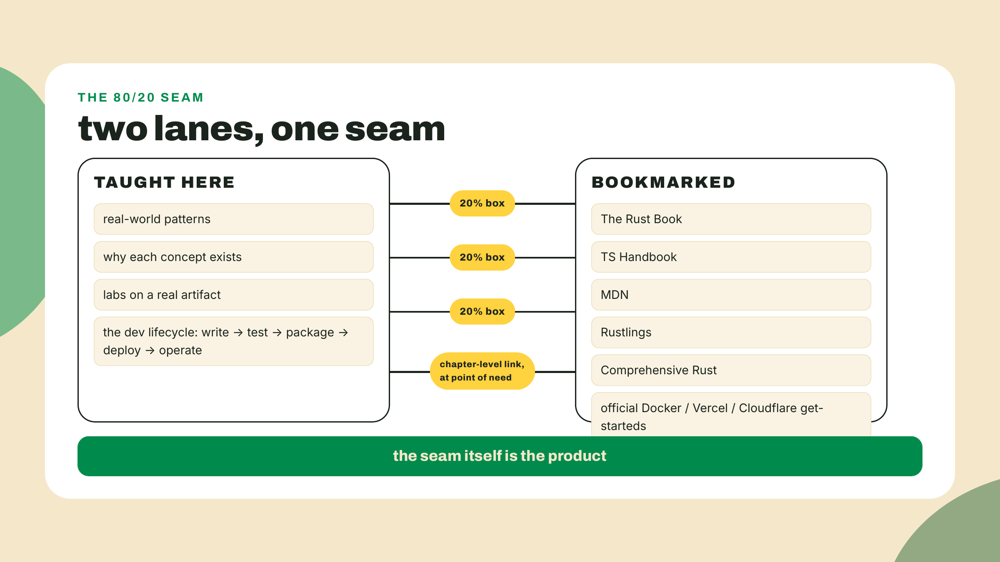
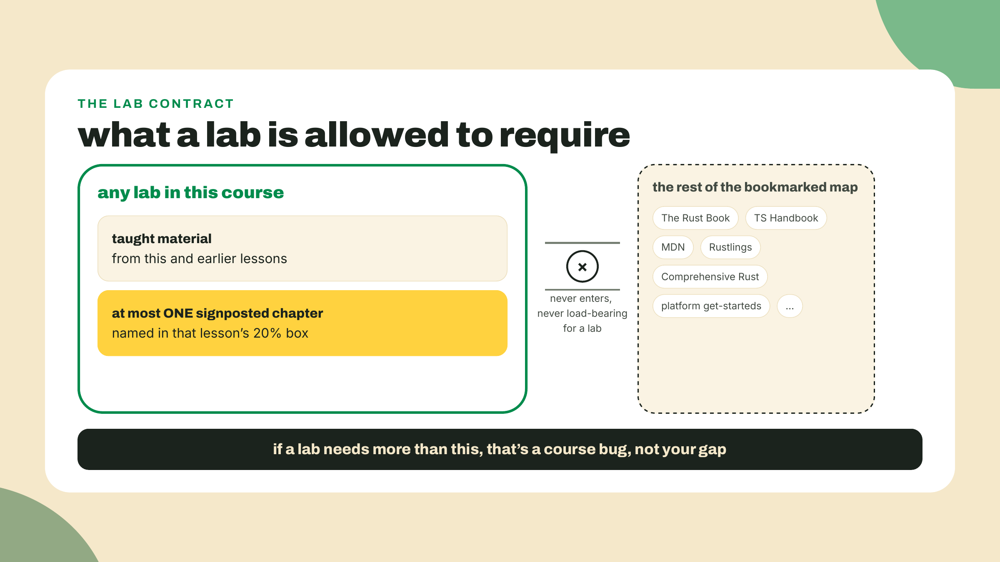
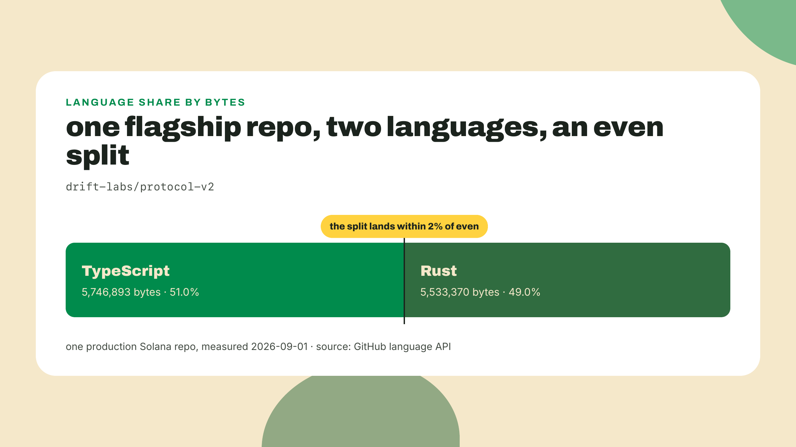
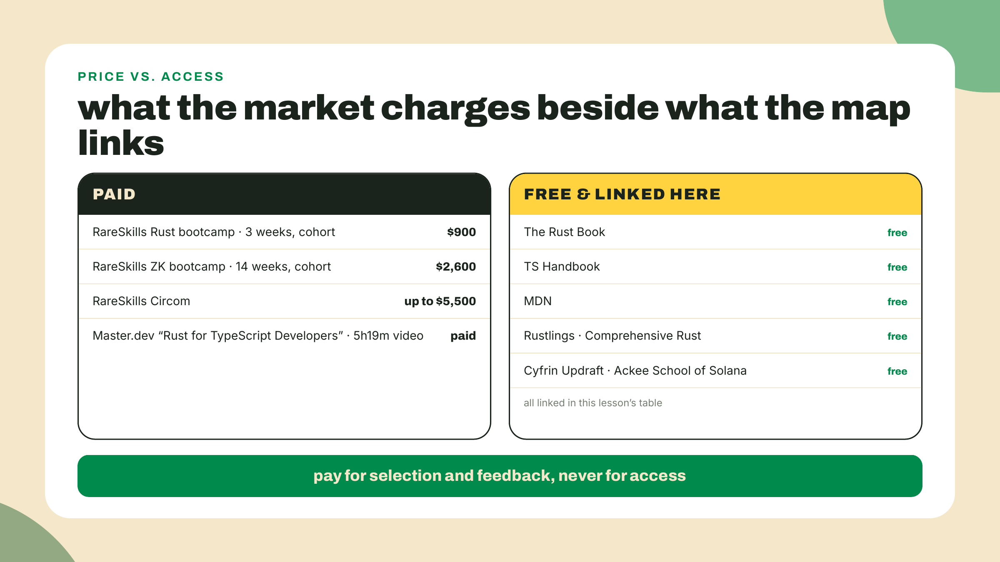
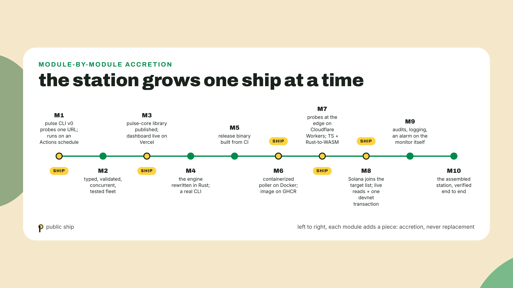
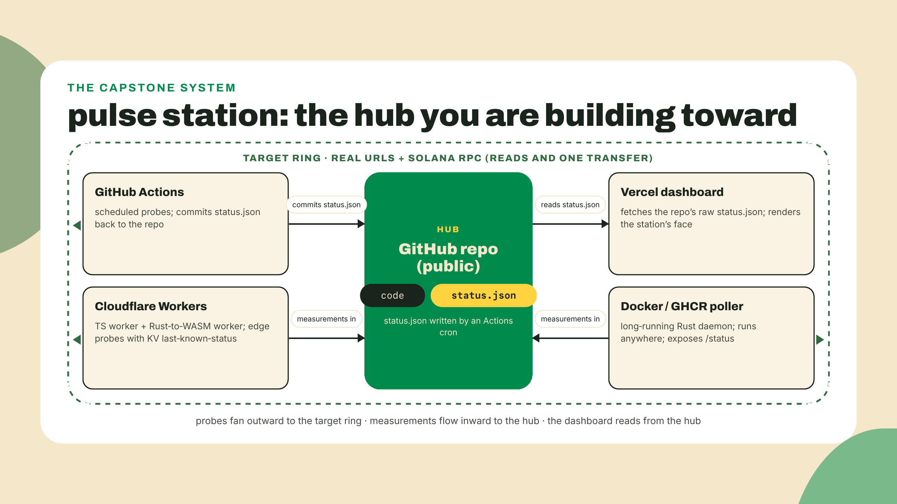
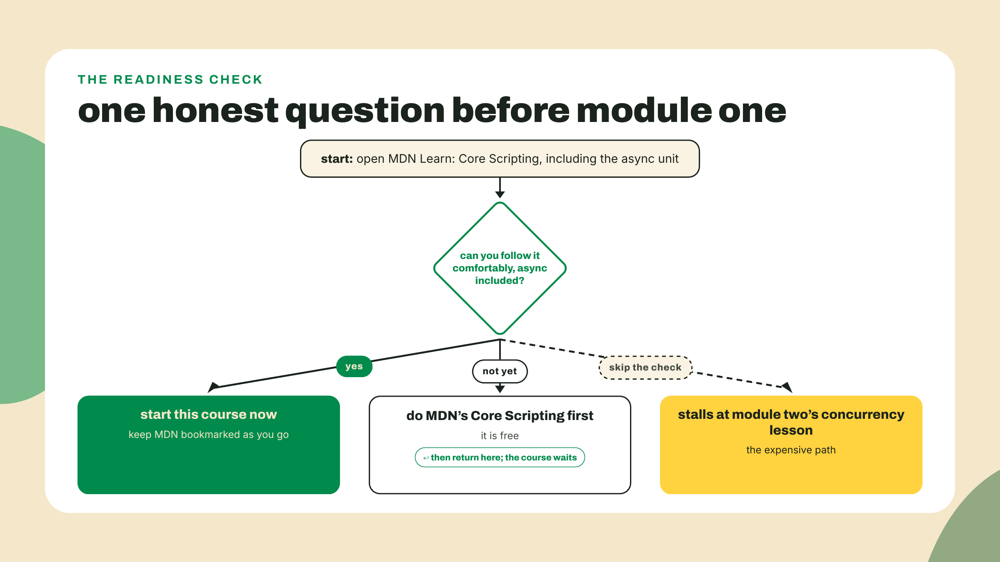

# The map: what we teach, what we bookmark, and why both languages

Lesson one. Nothing is built yet. You arrive able to program in some language, new to Rust, new to TypeScript, new to web3, and I am not going to open with a definition. I am going to make you measure the internet with the browser you already have open.

Open a new tab, go to https://rust-lang.org (the apex address, no www), press F12 (or right-click, Inspect), click the Console tab, and paste this:

```js
const t0 = performance.now();
fetch(location.origin, { cache: "no-store" })
  .then(r => console.log(`${location.host}: ${(performance.now() - t0).toFixed(1)} ms (status ${r.status})`));
```

Hit Enter. Within a second or so you get a line like `rust-lang.org: 238.5 ms (status 200)`. That is what mine printed while writing this, from a home connection in the middle of the day. (Two things in that snippet are deliberate. `location.origin` is the address of the tab you are standing in, so you are probing the site you are on rather than a URL I hardcoded, and a page is always allowed to read responses from its own origin; reading a response from a *different* origin only works when that server opts in with a CORS header, a browser safety rule you sidestep entirely by asking the tab about itself. And the no-www instruction matters: this site's www spelling quietly 301-redirects to the apex, `fetch` follows redirects silently, and a probe that crosses origins mid-flight can be blocked by that same rule even when the site is perfectly healthy.) Yours will differ, because it is a real measurement of a real server over your real network. No install, no account, no framework. You just probed live infrastructure and read its latency, and that single reflex, point a probe at something real and read the number, is the whole course in miniature.

Now the second demo, because this course has two languages and each gets an opening argument. Go to https://www.typescriptlang.org/play/ (the trailing slash matters, that is the final URL), clear the editor, and type these three lines:

```ts
const probe = { url: "https://www.rust-lang.org", timeoutMs: 3000 };
const wait = probe.timeout;
console.log(`waiting ${wait} ms`);
```

Look at line two. Before you run anything, a red squiggle appears under `timeout`, and hovering it shows:

```
Property 'timeout' does not exist on type '{ url: string; timeoutMs: number; }'.
Did you mean 'timeoutMs'?
```

Plain JavaScript would run this happily and print `waiting undefined ms`. It would lie politely, and you would find out in production, at 3 a.m., when the timeout you thought you set never fired. The compiler caught the bug while you were still typing, and it even guessed the fix. That red squiggle is the thesis of the entire TypeScript half of this course: the machine can prove things about your code before the code exists anywhere but your editor.

Two probes, two minutes, zero installs. Everything else in this lesson is a map.

## Summary

This lesson hands you three things and asks for one honest decision. First, the map: a full table of what this course teaches versus what it bookmarks to canonical free resources, and why that split is deliberate rather than lazy. Second, the evidence for teaching two languages at once, with real byte counts from a flagship Solana repo and a job-board ratio read the careful way. Third, the promise: the artifact you will build across ten modules, a personal uptime-and-latency station called Pulse Station, drawn as the exact diagram you will redraw from memory in the final module. The honest decision is the prerequisite check at the end of the theory section: a specific free resource, a specific question, and permission to leave and come back.

One thing said out loud before we start, because this course says its rules out loud. Right now, in lesson one, everything is fully worked: every command shown, every snippet complete, you run rather than derive. That hand-holding fades on a schedule. A few modules in you will get interfaces and constraints instead of finished files, and by the capstone you will get a spec and silence. The fade is the curriculum.

No Node, no compilers, no accounts today. The toolchain arrives next lesson. Today is orientation, and orientation done right is worth more than any single install.

## The map is the product

Here is the problem this lesson exists to solve. You can already make a program work in some language. Between you and shipping real software on a blockchain stack, the internet offers roughly a thousand hours of material: a 20-chapter Rust book, a TypeScript handbook, four platform documentation sites, and a chain that changes under your feet. Nobody finishes that pile. The people shipping never did. A tutorial pile is not a curriculum; it is a backlog, and backlogs do not teach. What the people shipping actually did was learn a specific 80 percent and bookmark the rest, and most of them assembled that map by trial, error, and years.

This course hands you the map up front and then walks it with you. The deal, stated in the owner's own terms: great resources to learn Rust and TypeScript already exist, so we link them instead of re-teaching them. What this course adds is the part those resources do not carry: how you use each pattern in the real world, and why you need each concept, because of what breaks without it. Selection over coverage. We call the boundary between the two the 80/20 seam: the taught side covers the patterns that carry the daily dev lifecycle, write, test, package, deploy, operate; the bookmarked side is the canonical deep material, linked chapter-level at the exact moment you might want it. Every language lesson from here on carries a fixed go-deeper box, we call it the 20% box, holding that lesson's bookmark.



The cost of that deal is real, and you should hear it now rather than discover it mid-error. You WILL meet Rust and TypeScript syntax this course never taught, sometimes inside a compiler message, three modules from now, when a lifetime annotation shows up in an error for code you did not write. The map is the mitigation, not a magic exemption. The deal only works if you actually open the bookmarked chapter when a lesson signposts it. Reading the whole Rust book front to back before starting is the thousand-hour trap; refusing to read the one chapter the map points at, when it points at it, is the opposite failure and just as expensive.

### The full table, printed as content

This table is not an appendix. It is the syllabus's honest twin, and the final module will bring you back to it to ask which bookmarks became urgent. Every URL below was verified live on 2026-09-02, and this one table gets re-verified before the course ships updates.

| Concept | Taught here | Bookmarked to |
|---|---|---|
| JS fundamentals | Never. This is the prerequisite | MDN Learn Core Scripting, free, 34 lessons: https://developer.mozilla.org/en-US/docs/Learn_web_development/Core/Scripting |
| Strict TypeScript config | M1: the ~5 flags our own code trips | TS Handbook intro: https://www.typescriptlang.org/docs/handbook/intro.html |
| Discriminated unions, narrowing, exhaustiveness | M2 | Handbook narrowing chapter; the type-challenges repo as the drill afterward |
| Generics you actually use | M2, just in time, motivated by zod | Handbook generics chapter |
| Validation at boundaries | M2, zod | Total TypeScript's free Zod tutorial: https://www.totaltypescript.com/tutorials |
| Async for real: limits, backoff, cancellation | M2 | MDN's async unit |
| Testing practice | M2 (vitest), M4 (cargo test) | vitest guide; node:test docs |
| Package and publish literacy | M3 | Node's learn path: https://nodejs.org/learn |
| React, consumer level | M3 | react.dev quick start; depth belongs to a sibling course, named below |
| Ownership and borrowing, the why and the daily use | M4 | The Brown interactive fork of the Rust Book, with quizzes and ownership visualizations: https://rust-book.cs.brown.edu/ |
| Errors as values | M4 | The Rust Book, error handling chapter: https://doc.rust-lang.org/book/ |
| Enums, structs, traits in practice | M4 | Rust Book enums and traits chapters |
| serde, cargo mastery, clap, a real CLI | M5 | serde.rs; the Cargo book; Rustlings after each Rust module: https://rustlings.rust-lang.org/ |
| tokio, at know-when-you-need-it depth | M6 | Rust Book async chapter (the Book covers async natively now) |
| Rust syntax breadth | Never re-taught | Rust by Example: https://doc.rust-lang.org/rust-by-example/ ; Comprehensive Rust, Google's own Android-team onboarding course: https://google.github.io/comprehensive-rust/ ; the half-hour syntax speed-run at fasterthanli.me |
| Lifetimes beyond reading, unsafe, macro authoring | Never, signposted | The Rustonomicon, which opens by telling you not to read it yet: https://doc.rust-lang.org/nomicon/ |
| Containers | M6 | Docker Get Started: https://docs.docker.com/get-started/ |
| Deploying the TS app | M3 | Vercel's getting started: https://vercel.com/docs/getting-started-with-vercel |
| The edge, both languages | M7 | Cloudflare Workers get started: https://developers.cloudflare.com/workers/get-started/guide/ |
| Solana depth, Anchor, wallet UX | Minimal client model only, M8 | Sibling courses in this catalog, named in prose below |

Look at the never rows. A course that can say "never" out loud, and tell you exactly where that material lives instead, is making you a promise: nothing on the taught side is filler, and nothing on the bookmarked side is secretly required to pass a lab. Every lab in this course runs on taught material plus, at most, one signposted chapter. That is the aha worth sitting with for a second: a course can be honest about what it does not teach. The bookmark list IS the product.



### Why both languages, with receipts

Fair question: why not just Rust, since the chain runs Rust? Or just TypeScript, since that is the shorter on-ramp? Because a real Solana product is not written in a language. It is written in two.

The single best number the research found: drift-labs/protocol-v2, one flagship production Solana repo, splits almost exactly in half by bytes. TypeScript 5,746,893 bytes, Rust 5,533,370 bytes. That is not a migration caught mid-flight. The Rust is the on-chain program; the TypeScript is its SDK, its clients, its tests, the entire surface users and integrators actually touch. Both halves are load-bearing. One product, both languages, nearly fifty-fifty.



The job market tells the same story from a different angle, if you read it carefully. On web3.career on 2026-09-01, a Rust plus Solana query returned 950 jobs and a TypeScript plus Solana query returned 505. Do not read those as absolute counts; job boards multi-tag aggressively and the same posting shows up under several queries. Read the roughly 2:1 Rust-heavy ratio for what it plainly says: the chain's core work is Rust, and that is where posting volume, and the ladder's upper rungs, concentrate. The TypeScript 505 is not a smaller opportunity but a shorter on-ramp: as the byte split just showed, every one of those Rust teams also ships a TypeScript surface, so TS is the half you can be hired on soonest while the Rust half compounds. A developer holding both ends of that ladder is the shape teams actually need. This course exists because that shape has no dedicated course. Which brings me to the neighbors.

### The neighbors, named honestly

I want to name the other courses in this space, because several of them are good, and because three of them are literally inside our bookmarked 20 percent. That is not a normal thing for a course to do, and the fact that it feels unusual is worth noticing.

Cyfrin ships a free Solana course on Updraft, announced through Colosseum's Codex on 2026-01-16, and it is serious work: every program built twice, once in Anchor and once in native Rust. Its prerequisite is Cyfrin's own free Rust Programming Basics course, which our Rust modules will happily point at. Ackee's School of Solana is free too, a nine-week cohort, application-gated, and its audience sentence is almost word for word ours. Neither teaches TypeScript as a first-class track, neither touches Docker, Vercel, or Cloudflare, and both go deeper on-chain than we do. Different maps, honestly drawn.

The market also charges real money for the material we link for free. RareSkills prices its Rust bootcamp at $900 for 3 weeks, its ZK bootcamp at $2,600 for 14 weeks, and its Circom material at up to $5,500. I am not mocking those prices; cohorts and code review are worth paying for. I am calibrating you: the raw knowledge is free and linked in the table above, and what you choose to pay for, here or anywhere, should be selection, sequencing, and feedback, never access.



One paid resource earns a disclosure, once, because it targets this course's exact audience. On 2023-04-25, ThePrimeagen shipped "Rust for TypeScript Developers" on what is now Master.dev, 5 hours 19 minutes, paid with a free preview. The market named our audience three years before this course did. If you finish here and want a second voice on the Rust half, that is the named paid option, and it is the only one this course will ever name.

### Pulse Station: the thing you will actually build

Maps motivate nobody. Artifacts do. So here is the promise, concrete enough to hold me to.

Across ten modules you build Pulse Station, a personal uptime-and-latency station. It starts embarrassingly small: next lesson, a TypeScript CLI that probes one URL and prints the latency, which you will notice is exactly the one-liner you ran in the console today, promoted to a real program. Then it grows. The probe moves onto a schedule on GitHub Actions, on a machine that is not yours, and commits its measurements to a file. The results get types, then validation, then disciplined concurrency, then tests that gate the schedule. A dashboard on Vercel gives it a face any stranger can open. The engine gets rewritten in Rust, side by side with the TypeScript it mirrors, grows a real CLI, then a long-running poller in a Docker container published to GHCR. Probes move to the edge on Cloudflare Workers, in both languages, one of them compiled to WebAssembly. And then the station points at the most interesting target available: Solana itself, live reads and one real transaction, a chain whose own heartbeat is a latency story. Every probe, from today's console one-liner to the capstone, hits a real target. There are no synthetic feeds anywhere in this course. And when the diagrams below say "Solana RPC" and "devnet transaction", read them loosely for now as the chain's public query endpoint and its free practice network; module 8 defines both properly before you touch either.



The finished station has a shape, and the shape matters enough that the capstone will ask you to redraw it from memory. This is that drawing. Study it now, casually; you will meet it again in module ten.



Note the word public on the hub, because it is a requirement, not a default I forgot to change. Your station repo will be public, and three course-critical paths depend on it: GitHub Actions is free and unmetered for public repositories on standard runners, which is the entire free-CI math of the schedule your probe lives on; the dashboard fetches `status.json` straight from the repo's public raw URL; and the Vercel deploy lab connects a personal public repo on the free tier. A private repo silently breaks all three, weeks apart, in confusing ways. The cost is equally real and stated out loud: your station's code and its full status history are public. For a portfolio artifact, and this is one, that cost is a feature. Employers can watch your station run.

### The honesty box, and the doors this course opens

First, the prerequisite check, and I will quote it exactly as the course states it everywhere: open MDN Learn Core Scripting, including its async unit. If you can follow it comfortably, you are ready. If not, start there. It is free, and this course will still be here.

This course is not for absolute beginners to programming; the cover says so and I am repeating it. The check includes the async unit on purpose. Module two builds concurrency discipline directly on promise literacy, with only a five-minute recap of the promise model, and a recap is not a first course in async. Skipping the check does not make you faster. It relocates the delay to module two and makes it more expensive.



Second, the doors. This is the catalog's feeder course, which means it ends where deeper courses begin, and those boundaries are drawn on purpose. Solana depth, the account model as a system, programs, PDAs, chain history, lives in the btc-to-sol-evolution course; we teach only the minimal client-side model in module eight. Wallet UX, transaction landing, and everything about getting a transaction included under pressure belongs to the client-side mastery course, which is in production as I write this; until it ships, the door is the topic itself, and our module-three dashboard builds the React consumer floor that kind of work stands on. Anchor and on-chain Rust authoring live in the Anchor V2 course, and that door deserves a straight sign: its own bar is that you already ship Anchor programs and want the V2 delta, so our Rust exit, reading and writing structs, enums, traits, and Result, with lifetimes signposted, buys you the reading level for its prose, not a seat at its bar. When a lesson here declines to go deeper on one of those topics, it will name the door instead. Same seam, catalog-sized.

## Lab: run the probes, make the call

Numbered and short, because the point of today is the decision, not the tooling. Everything here is zero-install by design; no step requires Node, an account, or a download.

1. **Run the latency probe.** Open https://rust-lang.org in a tab (apex address, no www, same as the opener), open devtools (F12, Console tab), paste the `fetch` one-liner from the top of this lesson, press Enter. Here it is again so you do not have to scroll:

```js
const t0 = performance.now();
fetch(location.origin, { cache: "no-store" })
  .then(r => console.log(`${location.host}: ${(performance.now() - t0).toFixed(1)} ms (status ${r.status})`));
```

   Copy the printed line, something shaped like `rust-lang.org: 238.5 ms (status 200)`, into a scratch note. That line is your first artifact. Because the snippet probes `location.origin`, the site the tab is on, you can paste it into any other site's console and it simply probes that site instead, and it keeps working there for the same reason it worked here: a page may always read its own origin's responses. Probing a third-party URL from someone else's tab is a different game. The browser only hands you a readable cross-origin response when the target server opts in with a CORS header, and most do not; adding `mode: "no-cors"` alongside `cache` stops the outright failure, but the browser then hands back an opaque response and the snippet prints `status 0`. A 0 there means "opaque on purpose", not a dead site. Same-origin probing is the version that always works and always shows a real status, and it is why step one starts there.

2. **Run it four more times.** Same paste, four more Enters. Watch the number move. Cold connections, DNS caching, route weather; latency is a distribution, not a value, and you just discovered that with a for-loop's worth of patience. Note your fastest and slowest. Next lesson's CLI turns exactly this repetition into code.

3. **Trigger the compiler catch.** Open https://www.typescriptlang.org/play/ and type the three-line snippet from the opener. Do not paste it; type it, and watch how early the squiggle appears. Hover it and read the full error, including the suggested fix. Screenshot or copy the error text into the same scratch note. Second artifact.

4. **Break it worse.** Still in the Playground, change line two so the file reads:

```ts
const probe = { url: "https://www.rust-lang.org", timeoutMs: 3000 };
const wait = probe.timeoutMs + probe.url;
console.log(`waiting ${wait} ms`);
```

   Read what the compiler says about adding a number to a string. It permits it (JavaScript rules allow it) but hover the result type and notice `wait` is now a string. The compiler is not a linter shouting no; it is a bookkeeper that always knows what type you actually have. Two minutes of poking here pays off all through module two.

5. **Open the honesty check.** Go to the MDN Learn Core Scripting page from the table, skim the lesson list, and open its async unit specifically. Read a page or two. Then make the call, one word in your scratch note: ready, or MDN-first. Both answers pass this lab. The only failing answer is the unexamined one.

6. **Keep the map.** Bookmark this lesson's table in whatever system you actually revisit. It is the one piece of today you will use for months.

Checkpoint: your scratch note holds a real latency line, a real compiler error, and a one-word verdict. That is the whole gate. Thirty seconds of artifacts, one honest decision.

## Challenge

**Completion (everyone):** point the probe somewhere else. Any site you care about: your own project, your favorite docs site, your bank. Same one-liner, new tab, new target, new number. If the fetch fails where rust-lang.org succeeded, read the console error and form a guess about why; you now have a mystery the security-policy discussion in a later module will resolve.

**Solo (optional, no walkthrough):** in the Playground, write a `probe` object that holds an array of target URLs and a `timeoutMs`, then write a line that accesses a property you have not defined and one that indexes past what you know the array holds. Watch which of the two the compiler catches under default settings and which it lets through. You have just found, on your own, the exact gap a strict-mode flag in the next lesson's tsconfig walk exists to close. Bring your finding with you.

## Check your bearings

Three honest questions before you move. Can you re-run both probes cold, without this lesson open? Can you explain the 80/20 seam to another dev in two sentences, including what the 20% box is? Did you actually open MDN and make the call, or did you nod at the paragraph and scroll on? The quiz for this lesson probes the same edges: what the contract says to do when a compiler error mentions bookmarked territory, what the drift byte split is evidence for, what the honest move is when the async unit is new to you, and what actually depends on the station repo being public. If any answer feels soft, the lab takes five minutes to re-run.

I ran long on the map section; that was on purpose, and it will not be the pattern. You just probed the internet from a browser console, and that measurement dies when the tab closes. Next lesson you install the real toolchain, Node 24 LTS and TypeScript 7 (Node's LTS torch passes to 26 on 2026-10-28; the lesson pins what it verifies on the day you run it), and you turn that one-liner into `pulse` v0: a probe that lives in a repo, types and all, with nothing between you and it but an install. Keep the console tab open until then if you like; by the end of the next lesson you will not need it.
