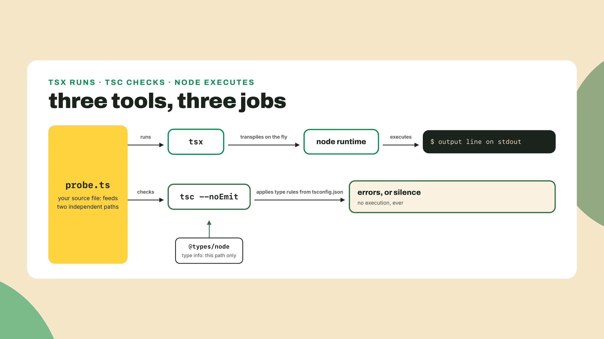
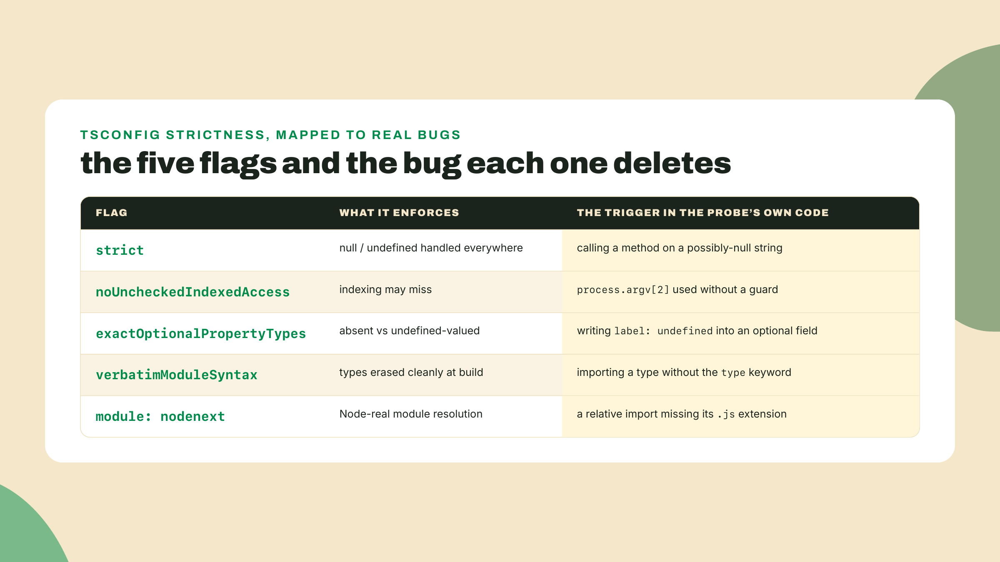
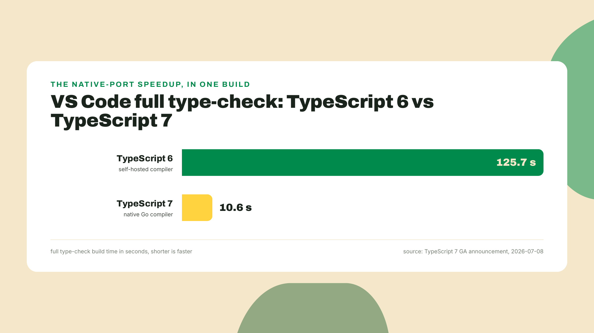
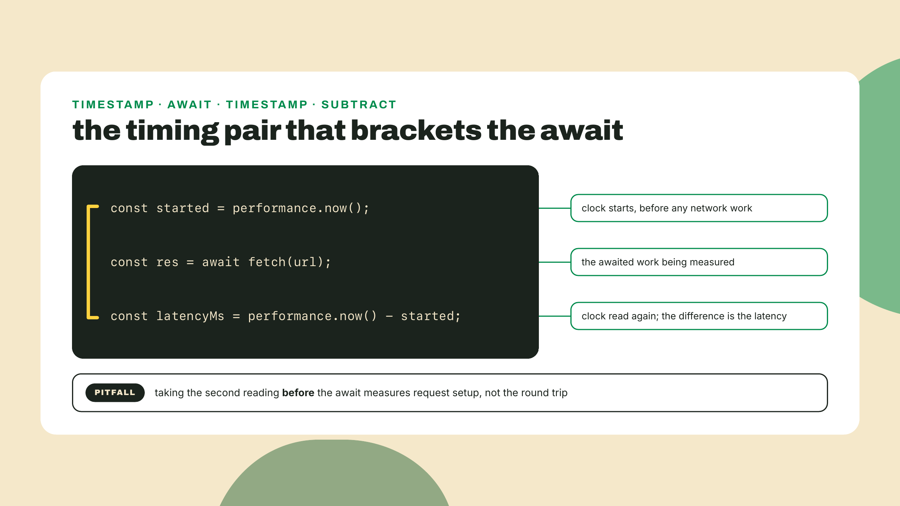
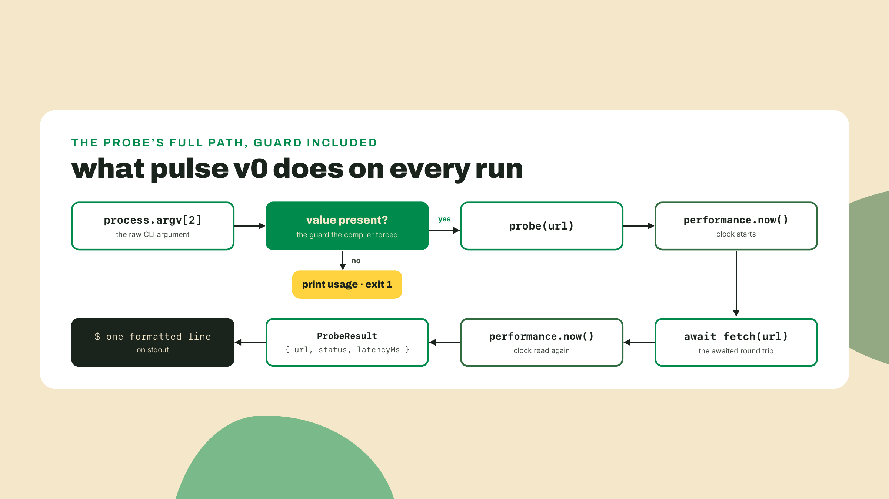
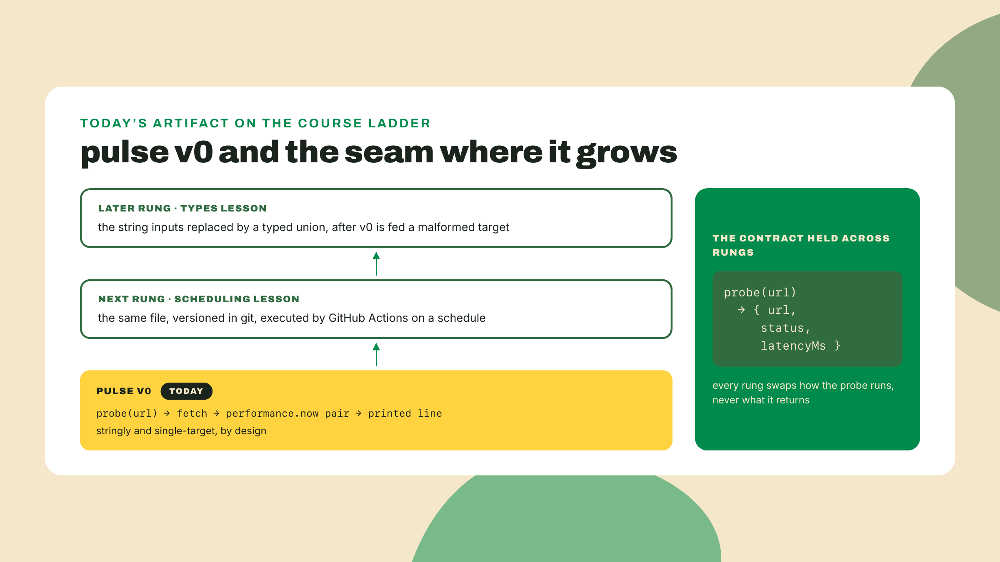

# Node 24, TypeScript 7, and your first probe

Last lesson you ran two probes without installing a single thing: a `fetch` one-liner in the devtools console against rust-lang.org, and a Playground snippet where the compiler caught a bug before the code ever ran. Both worked. Both are also gone. Close the tab and neither probe ever existed: no file, no history, no way to run it again tomorrow and compare numbers.

That is the problem with borrowed environments. Real measurement needs a home: a runtime that's yours, a compiler that catches the bug BEFORE the probe lies to you, and a file in a directory you can commit. Ten minutes from now that home exists, and `pulse` v0 prints its first latency.

So let's check what you're standing on. Open a terminal and run:

```bash
node --version
```

If that prints `v24.x.x`, you're already home. If it prints nothing, or something older, the next section fixes it in two minutes. Either way, keep the terminal open. Everything in this lesson happens in it.

And once the probe runs, we'll talk about something genuinely strange: the compiler you're about to install was itself rewritten in another language for a 10x speedup. The whole thesis of this course, TypeScript for the surfaces and a systems language for the hot paths, is running on your own machine before you've written fifty lines.

## Summary

- You install Node 24 LTS and TypeScript 7.0.2, and ship `pulse` v0: a probe that fetches one URL and prints its latency, run with tsx, inside the first ten minutes.
- You walk the ~5 strict tsconfig flags this course's code will actually trip, each with the exact compiler error it throws, and bookmark the rest.
- You get the honest TypeScript 7 story: what the native compiler bought, what it costs today, and why production repos still pin 5.x.
- The lab plants a real bug on purpose and lets the compiler catch it. The challenge sends you multi-URL, solo.

## The ten-minute toolchain

### Node 24 LTS, not "newest"

Why 24 and not whatever number is biggest on the download page? Because Node ships on two tracks. Even-numbered majors get promoted to LTS, long-term support: they receive fixes for years and are what production servers actually run. Odd-numbered majors are experiments with a short shelf life, a place for the project to test changes before an LTS line inherits them. "Newest" is a rolling beta; LTS is the ground you build on.

This isn't Node trivia, it's a habit you're forming for every runtime and toolchain in this course. When something you deploy breaks at 3am, you want to be on the line that gets security patches for years, that cloud platforms test against, that every package in your dependency tree claims to support. That line has a name and a published calendar, and checking the calendar before installing is a thirty-second act that saves real pain. "Maintenance" on that calendar, by the way, is not death: a maintenance LTS still receives critical fixes, it just stops getting new features, which for a server is usually exactly what you want.

Right now the Active LTS line is Node 24, codename "Krypton". One dated footnote, because this handover is scheduled: Node 26 becomes the new Active LTS on 2026-10-28, with Node 24 slipping into maintenance a week earlier, on 2026-10-20, per the published release schedule (still safe, still patched until 2028-04-30, just no longer the headline). As of 2026-09-02, Node 24 LTS is the correct install, and everything in this course runs unchanged on 26 when you upgrade later.


Install it from nodejs.org (pick the LTS button, it points at 24) or, if you already use a version manager like nvm, `nvm install 24`. Then verify:

```bash
node --version
# v24.x.x
```

That single binary ships more than a JavaScript engine. `fetch` is built in. `performance.now()` is built in. There's even a `node --env-file` flag for loading environment variables natively, no package needed; remember that name, it earns its own moment when we get to secrets hygiene later in the course. The probe you're about to write uses zero dependencies for its actual work. Everything you install next is for the *types*, not the runtime.

### TypeScript 7.0.2 and tsx

Make the probe a real project:

```bash
mkdir pulse-station && cd pulse-station
npm init -y
npm pkg set type=module
```

Three commands, one decision worth naming. The directory name is `pulse-station`, not `pulse`, because it is the whole station from m01-l1's diagram, not just today's probe: the GitHub repo in the next lesson takes this name, `npm init -y` stamps it into `package.json`, and both come back later (the dashboard fetches `https://raw.githubusercontent.com/YOUR_USER/pulse-station/main/status.json`, and m03-l1 hands the name down to the workspace root). `npm init -y` writes a `package.json`, the file that makes this directory a project npm understands. `npm pkg set type=module` declares that files here are ES modules, the modern import/export flavor. Why that matters gets one paragraph later; for now it's a box we tick so top-level `await` works.

Now the toolchain:

```bash
npm i -D typescript@7.0.2 tsx@4.23.13 @types/node@24
```

Versions checked against the npm registry on 2026-09-02; `latest` for typescript resolves to exactly 7.0.2 today. One cosmetic note before the trap: npm 11 may print a few `npm warn install-scripts esbuild...` lines during this install. That is npm's install-script gating being chatty about a dependency it chose not to run, not a failure; if the command exits without an `npm error` line, the toolchain landed fine. And that digit deserves a warning box of its own, because it's a genuine trap: **there is no stable typescript 7.0.0 on the registry.** GA landed with patch fixes already rolled in, so stable 7.x starts, and currently ends, at 7.0.2. A setup script that says `typescript@7.0.0` fails every single time it runs. Prose can say "TypeScript 7.0"; install lines must say 7.0.2.

Three packages, three jobs:

- **typescript** gives you `tsc`, the checker. It reads your code, applies the type rules, and tells you what's wrong. In this course we run it as `tsc --noEmit`: check everything, emit nothing.
- **tsx** is the runner. It executes a `.ts` file directly, no compile step you have to see. Dev-loop tool, and the way `pulse` runs all course long.
- **@types/node** teaches the checker what Node's own globals look like, so `process.argv` has a type instead of being a mystery.

The split is the thing to internalize: tsx runs your code and does not care about your types; tsc checks your types and never runs your code. You need both, and confusing the two is behind half the "but it ran fine!" confusion in TypeScript teams. A file can run perfectly under tsx while carrying a type error that will bite the next person who calls your function differently, which is why the lab makes you run both, every time, until the pair is muscle memory.

One more small thing, since you'll type it constantly: the `npx` prefix runs a binary from your project's own `node_modules` instead of hunting for a global install. `npx tsc` is *your* pinned 7.0.2, not whatever some other project left on your machine. Per-project pins, invoked per-project: that discipline is why two projects with different TypeScript versions can coexist peacefully on one laptop.



### First latency in one file

Payoff time. Create `smoke.ts`:

```typescript
const started = performance.now();
const res = await fetch("https://www.rust-lang.org");
const elapsed = performance.now() - started;
console.log(`${res.status} in ${elapsed.toFixed(1)}ms`);
```

Four lines. `performance.now()` gives a high-resolution millisecond timestamp; call it before and after the fetch and the difference is your latency. Why not `Date.now()`, which you may know from JavaScript elsewhere? Because `Date.now()` reads the wall clock, and wall clocks get adjusted: your OS syncs time in the background, and a clock that jumps mid-measurement can hand you a negative latency. `performance.now()` is monotonic, it only moves forward, which is the property a measurement tool actually needs. Small choice, but `pulse` is a measurement tool for the rest of the course, so it starts on the right clock. Run it:

```bash
npx tsx smoke.ts
# 200 in 254.5ms
```

That number is from my run while drafting this, and here's a detail worth your attention: my first-ever run printed 498.4ms, the second 254.5ms. Same URL, seconds apart, half the latency. DNS caching, connection reuse, network mood. One sample is noise. Hold that thought, because turning noise into signal is exactly where this course's tooling is headed, and it's also this lesson's coding challenge.

You just did the whole thing the devtools console did yesterday, except it's a file, in a project, on your machine, and it will run identically tomorrow. Now let's make the compiler earn its seat.

### The five flags you will actually trip

Run the config generator:

```bash
npx tsc --init
```

This writes `tsconfig.json`, the checker's rulebook. And I want to be direct about method here, because I've done the wrong version of this myself: copying a strict-mode config from a 2023 blog post instead of reading what the current `tsc --init` emits. Guilty, more than once. Stale configs silently disable the exact flags this course depends on. The init output IS the current canon; it's generated by the same team that ships the compiler, and it changes as the language does. Read yours, not a blog's.

Two small edits before the walk, both suggested by comments inside the generated file itself: set `"types": ["node"]` (the init default is an empty list, which hides `process` from the checker) and uncomment `"lib": ["esnext"]`. That's it. Zero invented config in this course; everything else stays exactly as init wrote it.

Now, the file turns on a lot. You will not trip most of it. Here are the five flags this course's own code will actually collide with, each with the collision:

**1. `strict`** is the umbrella: it switches on a family of checks, most importantly "null and undefined are real types you must handle". Without it, this compiles and crashes at runtime:

```typescript
function firstChar(s: string | null): string {
  return s.charAt(0); // strict says: s might be null. Handle it.
}
```

Under `strict`, that's an error until you check `s` first. Every lesson from here on assumes it's on.

**2. `noUncheckedIndexedAccess`** makes indexing tell the truth. `process.argv[2]` has no guarantee of existing; the user might run your probe with no URL at all. So under this flag its type is `string | undefined`, not `string`, and passing it straight into a function that wants a `string` is an error:

```text
error TS2345: Argument of type 'string | undefined' is not
assignable to parameter of type 'string'.
```

That's a real compiler error, and you'll trip it on purpose in the lab. The class of bug it deletes: an empty batch, a missing argument, an off-by-one index, each one a runtime crash that now cannot be written.

**3. `exactOptionalPropertyTypes`** governs a subtle lie. An optional field like `label?: string` means "may be absent". Writing `undefined` into it is not absence; it's presence with a hole in it, and code that iterates keys or serializes to JSON treats the two differently. The probe will grow an options object soon enough, so here's the collision in miniature:

```typescript
type ProbeOptions = { label?: string };
const opts: ProbeOptions = { label: undefined };
```

```text
error TS2375: Type '{ label: undefined; }' is not assignable to
type 'ProbeOptions' with 'exactOptionalPropertyTypes: true'.
```

If a field is optional, omit it. If it can genuinely hold undefined, say so in the type. The bug this deletes is quiet and nasty: `JSON.stringify` drops absent fields but a spread copies `undefined` ones, so the two "empty" objects behave differently the moment they cross a boundary.

**4. `verbatimModuleSyntax`** keeps types and values honest at the import line. When `pulse` grows a `types.ts` in a later lesson, this import looks innocent:

```typescript
import { ProbeResult } from "./types.js";
```

```text
error TS1484: 'ProbeResult' is a type and must be imported using
a type-only import when 'verbatimModuleSyntax' is enabled.
```

The fix is `import type { ProbeResult }`. Why care? Types vanish at runtime. An import that only carries a type must be erasable, and this flag guarantees the compiled output never ships a phantom import that breaks at runtime.

**5. `module: "nodenext"`** aligns the checker with how Node actually resolves modules. Its most common trip: relative imports need the full filename, extension included, and the extension is `.js` even in a `.ts` file, because that's what exists after compilation:

```typescript
import { probe } from "./probe";
```

```text
error TS2835: Relative import paths need explicit file extensions
in ECMAScript imports when '--moduleResolution' is 'node16' or
'nodenext'. Did you mean './probe.js'?
```

The compiler even suggests the fix. Take it. This one feels pedantic exactly once, and then you notice your imports now mean the same thing to the checker, to Node, and to every bundler downstream, and the whole category of "works in dev, breaks in prod resolution" disappears.

Every one of those error messages is from my terminal, not paraphrased. That's the standard this course holds: when a lesson says "the compiler catches this", you get the actual error text, and you can reproduce it.



What about the rest of the generated file? It's real and worth knowing, and it is not worth a flag-by-flag slog. Here's the remaining init output on 7.0.2 as a reference row each, so you know what you're carrying:

| Setting | One line on why it's there |
|---|---|
| `target: "esnext"` | emit and check against current JavaScript; the runtime is modern, act like it |
| `isolatedModules` | every file must be translatable alone, which is what fast per-file tools require |
| `moduleDetection: "force"` | treat every file as a module, no accidental global scripts |
| `noUncheckedSideEffectImports` | a bare `import "./x"` must point at something that exists |
| `jsx: "react-jsx"` | how to compile JSX if any shows up; inert here and inert for the whole course, because module three's dashboard arrives from create-vite carrying its own tsconfig rather than extending this one |
| `skipLibCheck` | don't re-typecheck your dependencies' declaration files on every run |
| `sourceMap`, `declaration`, `declarationMap` | outputs for debuggers and library consumers; inert until you emit |

None of these will interrupt your week the way the five above will. When one does surprise you, the Handbook's reference explains it better than a sentence here can, and that's the right division of labor.

Here's the collapse, and it's the honest one: the flags are the code review you can't skip. A human reviewer catches the missing-argument bug on a good day, if they're not tired, if the diff isn't huge. This reviewer runs in milliseconds, on every save, forever, and never gets tired. Strictness is friction you buy on purpose. The five flags will interrupt you all course long, and every interruption is a bug that never shipped.

### The compiler that got ten times faster

One story before the lab, because you just installed its ending.

In March 2025 Microsoft announced "A 10x Faster TypeScript": the TypeScript compiler, itself written in TypeScript for over a decade, was being ported to Go. Sixteen months later, on 2026-07-08, that port went GA as TypeScript 7. The headline benchmark: VS Code's full type-check build fell from 125.7s to 10.6s. Memory use dropped between 6% and 26% across tested codebases. (You'll see "~18% less memory" quoted in secondhand posts; that midpoint appears nowhere in the GA announcement. The real figure is the range. I've learned to distrust suspiciously tidy numbers, and you should too.)



Sit with what that story implies, because it is this course's thesis wearing someone else's release notes. The TypeScript team, the people best positioned on Earth to make TypeScript fast, concluded that the compiler's hot path belonged in a systems language. Not because TypeScript is bad; because different layers have different physics. TypeScript for the surfaces where types buy you correctness, a native language for the paths where memory layout buys you speed. You are learning both languages in this course for exactly this reason.

Now the caveat, and it's a real one, one box, no burying:

> **What TS 7 costs today.** TypeScript 7 shipped WITHOUT a programmatic API; the GA post says it plainly: "We expect TypeScript 7.1 to ship with a new (and different) API." Tools that drive the compiler programmatically, typescript-eslint, framework language plugins, can't sit on 7 yet, so wild repos still pin 5.x. The flagship example is one this course will lean on for weeks: @solana/kit, the modern Solana client library, builds with typescript ^5.9.3. As of 2026-09-02, 7.1 has not shipped; the registry's `next` tag is a 7.1.0 dev build. Checked live; when 7.1 lands, this paragraph rewords.

Don't take my word for the state of play, ask the registry yourself; this habit of checking versions against the source instead of assuming them is one the course will drill:

```bash
npm view typescript dist-tags.latest dist-tags.next
# dist-tags.latest = '7.0.2'
# dist-tags.next = '7.1.0-dev.20260902.1'
```

So is installing 7.0.2 a mistake? No, and the distinction matters: for *your* projects, where you run `tsc` and `tsx` directly, 7 is the fastest TypeScript ever shipped and completely ready. The lag is in the tooling ecosystem *around* the compiler. Production repos pin 5.x not from laziness but because tooling compatibility is part of what a version means: a version is a promise about everything that plugs into it, not just the binary itself. Speed of the compiler and maturity of its ecosystem are, right now, a trade.

The decision rule, since you'll face it on your own projects soon: greenfield repo where you control the toolchain and mostly need `tsc` plus a runner, take 7 and enjoy the speed. Repo that leans on typescript-eslint, a framework language plugin, or anything else that drives the compiler through its API, stay on 5.x until 7.1 lands and the tools catch up. Neither choice is wrong; they're answers to different questions. This course takes the fast side, tells you where the seam is, and you'll recognize the pattern every time an ecosystem's flagship ships ahead of its tooling again, which in this industry is roughly every quarter.

One paragraph on module systems, because that's all 2026 owes the topic: for a decade JavaScript had two competing module flavors, CommonJS (`require`) and ES modules (`import`), and the interop pain generated a thousand angry threads. That war is over. `require(esm)` is stable as of Node 24, `tsc --init` emits ESM-first settings, and you set `"type": "module"` ten minutes ago without ceremony. Author ESM-first, consume whatever you need, and if a 2022 tutorial warns you about dual-package hazards, check its date and close the tab.

**Go deeper (the 20%).** this lesson walked the flags you'll trip and skipped the language tour on purpose; the canonical resources do it better. The TypeScript Handbook, https://www.typescriptlang.org/docs/handbook/intro.html, is the official ground truth and readable in a few evenings. Node's own TypeScript introduction, https://nodejs.org/learn/typescript/introduction, covers the runtime's view of the same story. Bookmark both; this course links chapters, never re-teaches them.

## Lab: ship pulse v0

Fully worked tier, and I'll say the quiet part out loud: this is the most hand-holding you will ever get from this course. Every command is printed, the probe is built step by step, and your only blanks are two TODOs. Next module you get skeletons; by the late modules, specs. The multi-URL challenge after the lab is your first small solo step. That fade is deliberate, and it's how you get strong.

The artifact contract, because later lessons will hold you to it: `pulse` v0 is a TypeScript file where `probe(url)` fetches the target with built-in fetch, times it with `performance.now()`, and prints URL, HTTP status, and latency in ms. Deliberately stringly and single-target. That's not a compliment, and it's on purpose: in the TypeScript-types lesson coming up, we'll feed this probe a malformed target, watch it lie politely, and replace its strings with a typed union. Version 0 is supposed to have room to grow.

**1. Confirm the scaffold.** You should be inside `pulse-station/` with `package.json` (containing `"type": "module"`), `tsconfig.json` (with your two edits), and `node_modules` from the install. Prove it:

```bash
npx tsc --noEmit && echo ready
# ready
```

**2. Create `probe.ts` with the skeleton.** Two TODOs, everything else complete:

```typescript
// probe.ts - pulse v0
type ProbeResult = {
  url: string;
  status: number;
  latencyMs: number;
};

async function probe(url: string): Promise<ProbeResult> {
  // TODO 1: capture performance.now() into `started`,
  // await fetch(url) into `res`,
  // then compute latencyMs as the difference from a second performance.now()
  return { url, status: res.status, latencyMs };
}

const target = process.argv[2];

const result = await probe(target);
// TODO 2: print one line: the url, the status, and latencyMs
// with one decimal place, space-separated
```

Read the shape before filling it. `ProbeResult` is the record every probe returns: which URL, what HTTP status, how long. `process.argv` is Node's array of command-line pieces; index 0 is node itself, index 1 the script, index 2 the first argument you actually passed.

One design decision is worth pausing on: `probe()` returns a record instead of printing its own output. That split, measure in one place, present in another, looks like ceremony in a twenty-line file, and it's the reason the challenge below is easy instead of a rewrite. A function that returns `ProbeResult` values can be called ten times and its results collected, sorted, summarized; a function that prints has already spent its answer. Later lessons hold `probe(url)` to exactly this contract, so the shape you type now is load-bearing.

**3. Fill TODO 1: the timing pair.** The pattern is timestamp, await the work, timestamp, subtract:

```typescript
  const started = performance.now();
  const res = await fetch(url);
  const latencyMs = performance.now() - started;
```

Order is everything here. Both `performance.now()` calls must bracket the `await`; put the second call before the await and you'd measure the cost of starting the request, not finishing it. This bracket-the-await pair is the single most reused pattern in this course. You will write it in Rust with `std::time::Instant` before long, same shape, different language.



**4. Fill TODO 2: the output line.**

```typescript
console.log(`${result.url} ${result.status} ${result.latencyMs.toFixed(1)}ms`);
```

`toFixed(1)` keeps one decimal: sub-millisecond digits are noise at network scale. One line per probe, machine-splittable on spaces. That's a tiny design decision that pays off in two lessons when a workflow parses this output.

**5. Trip the flag on purpose.** Now check the file:

```bash
npx tsc --noEmit
```

It fails, and it should:

```text
probe.ts: error TS2345: Argument of type 'string | undefined' is
not assignable to parameter of type 'string'.
```

This is `noUncheckedIndexedAccess` doing its job, and I planted the collision: `process.argv[2]` might not exist. Run the probe with no URL and, without this flag, `fetch(undefined)` would produce a baffling runtime error three layers deep. The compiler refuses to let the situation exist. This is not hazing. The flag found a real hole in a real program eleven lines long.

**6. Fix it the flag's way.** Guard before use:

```typescript
const target = process.argv[2];
if (!target) {
  console.error("usage: npx tsx probe.ts <url>");
  process.exit(1);
}
```

After the `if`, TypeScript narrows `target` to plain `string`: the undefined case exits the process, so it can't reach `probe()`. You didn't silence the checker; you handled the case, and got a usage message for free. Check again:

```bash
npx tsc --noEmit
# (silence; silence is a pass)
```

**7. Run it for real.**

```bash
npx tsx probe.ts https://www.rust-lang.org
# https://www.rust-lang.org 200 498.4ms
```

Your number will differ; mine did between two runs seconds apart. What must match is the shape: URL, status, latency with one decimal. Try a second run and watch the latency drop as connections warm. Try `npx tsx probe.ts` with no argument and see your usage line instead of a crash.

If instead something fought you, the two classic setup misses produce unmistakable errors, both from my terminal:

- `error TS2304: Cannot find name 'performance'` (or `'fetch'`, or `'process'`): your `tsconfig.json` still has the init default `"types": []`. Set it to `"types": ["node"]` and re-run.
- `error TS1309: The current file is a CommonJS module and cannot use 'await' at the top level`: `package.json` is missing `"type": "module"`. Run `npm pkg set type=module` and re-run.

Anything else, read the error slowly before searching for it. TypeScript 7's messages usually name the flag or the fix outright, and building the read-the-error reflex now pays compound interest all course long.



**Checkpoint, the lesson's gate:** you should now have a real latency line for a real URL printed by your own strict-checked toolchain, plus the memory of one compiler error you triggered and fixed. One terminal line and one error message. That pair is the whole win: the probe works, and you've seen the machinery that keeps it honest.

## Challenge: probe a fleet

Solo now. Extend `probe.ts` to accept multiple URLs:

```bash
npx tsx probe.ts https://www.rust-lang.org https://www.typescriptlang.org https://nodejs.org
```

Requirements:

- Print one latency line per target, same format as v0.
- Order the output by latency, slowest last.
- The no-arguments case still prints the usage line and exits.
- `npx tsc --noEmit` stays silent.

Hints, not steps: `process.argv.slice(2)` hands you every URL at once. You already have a `probe()` that returns a `ProbeResult`; an array of those can be sorted with a comparator on `latencyMs`. Whether you probe sequentially or fire all fetches concurrently is your call, but notice that it changes what the numbers mean: sequential probes each get the network to themselves, while concurrent ones share your connection and can inflate each other's latency. Neither is wrong, they measure different things, and knowing which question you're asking is the actual skill. We'll formalize exactly that trade in the async lesson.

And expect to meet the flag again. The moment you index into your results array, `noUncheckedIndexedAccess` will remind you the array might be empty, and this time there's no printed fix to copy. You know its move now; handle the case the flag's way.

If you want a second workout, this lesson's page on the course platform carries a companion coding challenge in its interactive editor panel (starter code and grader included, nothing to download): `latencyStats`, which turns a batch of samples into min, max, mean, and p95. One sample is noise, a summary is signal; that exact function ships in the fleet next module, when m02-l3's fleet report puts it on station duty. Later lessons hand out their challenges the same way, so when one says "the starter", that panel is where it lives.

## Where the heartbeat goes next

`pulse` v0 works, and you watched it work. That last part is the problem. A heartbeat you have to babysit isn't a heartbeat; it measures only when you remember to ask. Next lesson your probe moves to a machine that isn't yours and runs on a schedule: git to version it, GitHub to host it, and your first green Actions run to execute it. The course's first ship.



Before you go: run the probe against a site you actually care about and look at the number. If anything in this lesson fought you, a version mismatch, a flag error you couldn't decode, that's exactly the feedback I want; bring it to the course discussion, worst case it becomes next cohort's troubleshooting box. See you at the first green check.
