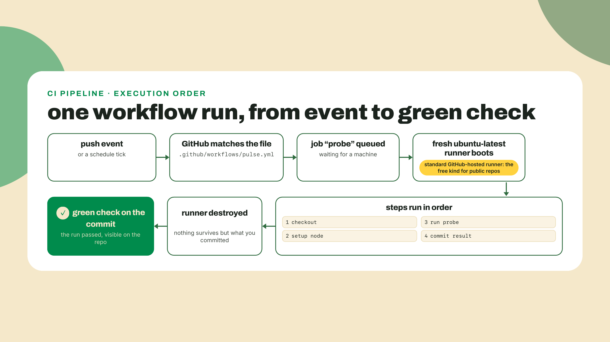
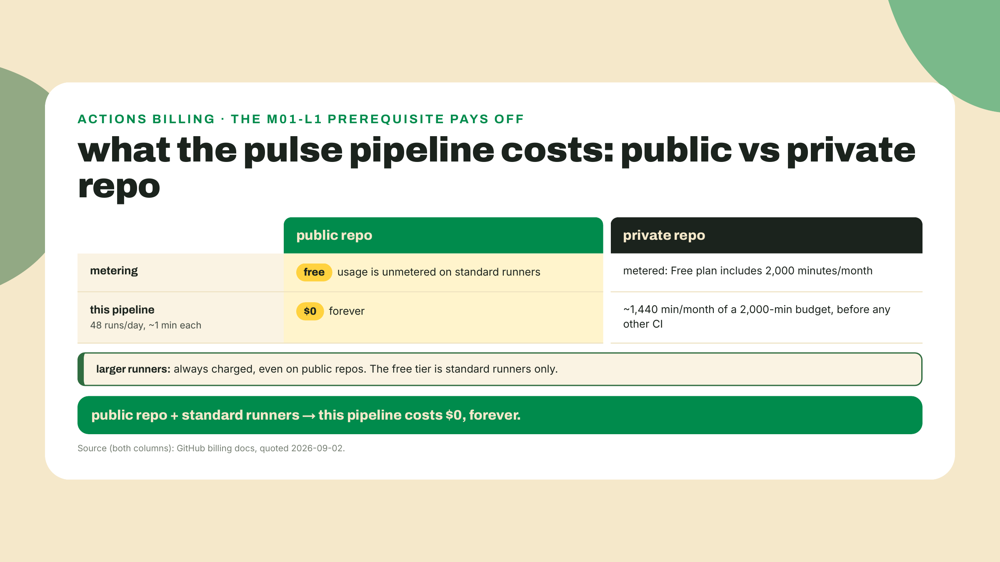
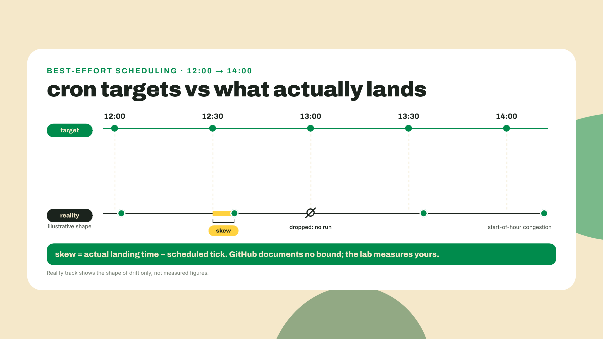
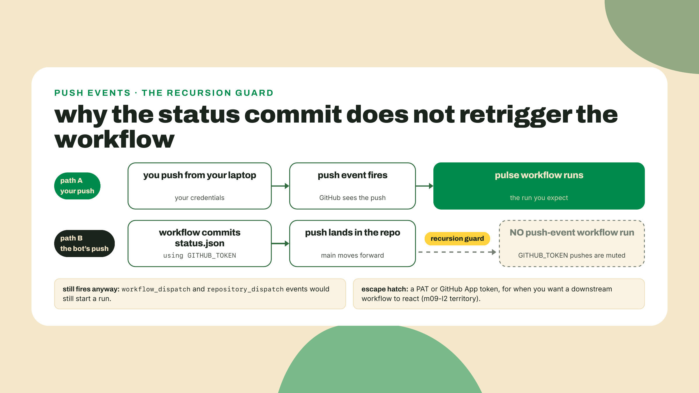
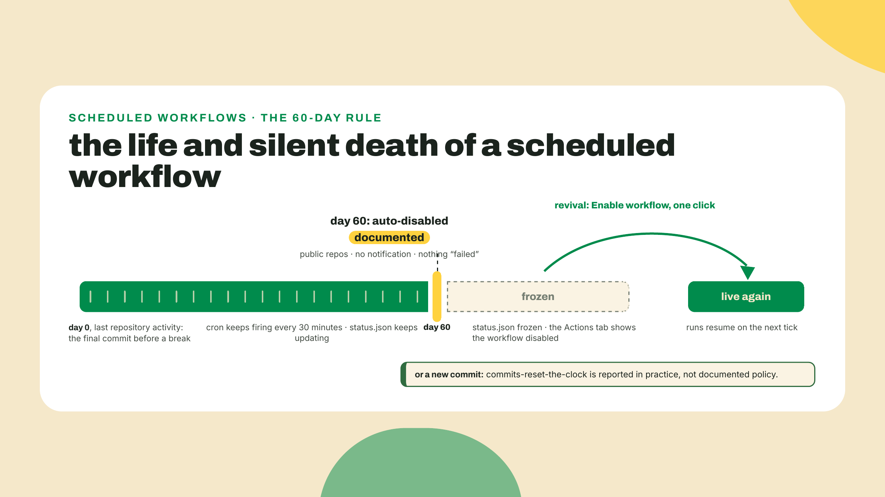
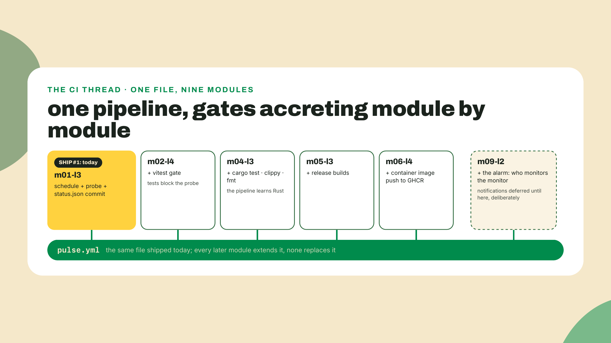
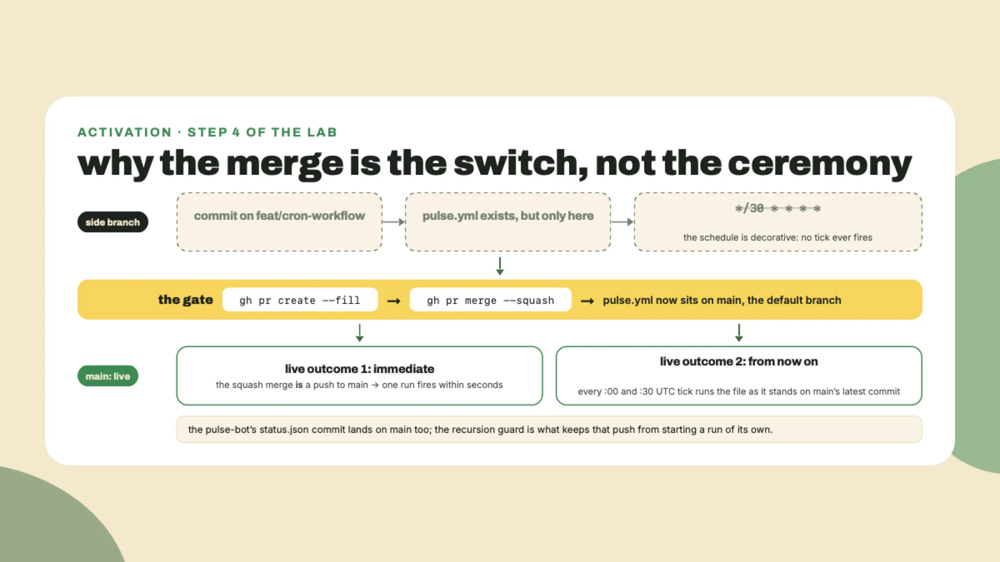

# Green means it ran without you: git, GitHub flow, Actions

Today ends with a green check on a run you did not start. Check the starting line first: open the terminal from last lesson and run:

```bash
git --version
```

If it prints a version, half of today's toolchain is already on your machine. If it errors, the first section installs it in one command. Either way, keep the terminal open; everything in this lesson happens in it, and by the end a machine you do not own will be probing the internet every half hour on your behalf.

## Summary

Last lesson you built `pulse` v0: a strict-mode TypeScript probe that prints a real latency for a real URL, but only while you sit there running it. That is the fatal flaw we fix today. A heartbeat that stops when you close the laptop is a pulse check, not a monitor. So this lesson ships the course's first ship: your repo goes public on GitHub, one YAML file goes in it, and GitHub runs your probe every 30 minutes, nights, weekends, exam season, committing each result back as `status.json`. Along the way you get git and GitHub flow at working-dev level, the anatomy of a workflow, and the platform's honest physics: why public-repo CI is genuinely free, why the schedule drifts, what silently kills an idle cron, and why the workflow's own commit doesn't trigger itself into an infinite loop.

How the work splits: this is still the fully worked tier. Every command and the complete workflow file appear annotated on the page; your TODOs are exactly three lines inside that file (the cron expression, the permissions block, the no-change guard), and the challenge at the end, a type-checking gate you build alone, is your first small solo step. The training wheels start coming off next module.

One honesty note: the first ship is the scheduled run, not a URL. The station's public web address arrives in module 3, rendering the exact `status.json` this lesson starts producing. Today's win is quieter and, I'd argue, bigger: a green check on a run you did not start.

## The first machine that isn't yours

### Ship the repo first

No theory yet. Green check first, understanding second. You need `git` and GitHub's CLI `gh`. On macOS:

```bash
# git ships with the Xcode command line tools
xcode-select --install

# gh via Homebrew
brew install gh
```

On Ubuntu/Debian: `sudo apt install git gh`. On Windows: `winget install Git.Git GitHub.cli`. Then tell git who you are (this identity goes on every commit you make):

```bash
git config --global user.name "Your Name"
git config --global user.email "you@example.com"
```

Now, in your `pulse-station` directory from last lesson, three moves: ignore the junk, snapshot everything else, and put it on GitHub. The `.gitignore` comes BEFORE the first commit. Committing `node_modules` is the classic first-week mistake, and undoing it later is far more annoying than preventing it now:

```bash
cd pulse-station
git init -b main

printf "node_modules/\n.env\n" > .gitignore

git add .
git commit -m "pulse v0: strict-mode latency probe"
```

`git init -b main` starts the repo with `main` as the default branch. Remember that phrase, default branch. It comes back with teeth in the cron section. Then authenticate `gh` and create the repo, public on purpose:

```bash
gh auth login
gh repo create pulse-station --public --source=. --push
```

That repo name is load-bearing, so type it exactly: `raw.githubusercontent.com/<user>/pulse-station/main/status.json` is the URL m03-l2's dashboard fetches and m10-l1's demo script checks. Rename it later and you get to update both.

The `--public` flag is economics, not idealism. GitHub's own billing docs say it plainly: "GitHub Actions usage is free for public repositories that use standard GitHub-hosted runners." Unmetered. No quota, no minutes counter, no card. This is the reason lesson m01-l1 (this course addresses lessons module-first: m01-l1 is module one, lesson one, the first lesson you read; from here on cross-references use that shorthand) made "your repo is public" a stated prerequisite: we are about to run a probe 48 times a day forever, and on a public repo that costs exactly nothing. We'll do the full arithmetic of the private alternative in a minute.

Now the first workflow. Create the file GitHub Actions watches for. The path is a convention the platform hardcodes:

```bash
mkdir -p .github/workflows
```

Put this in `.github/workflows/pulse.yml`:

```yaml
name: pulse

on: push

jobs:
  probe:
    runs-on: ubuntu-latest
    steps:
      - run: echo "a machine that is not yours ran this"
```

Commit and push it:

```bash
git add .github
git commit -m "ci: first trivial workflow"
git push
```

Open your repo on github.com and click the **Actions** tab. Within seconds you should see a run spinning, and shortly after, a green check next to your commit message. Click into it and read the log: a fresh Ubuntu machine booted somewhere in a datacenter, executed your echo, and shut down. That is the whole lesson, compressed into one run. Everything from here is making that machine do something worth doing, on a schedule, without you.

Checkpoint: the Actions tab shows one completed run named `pulse` with a green check. If it shows nothing, the file is probably not at exactly `.github/workflows/pulse.yml`; the path is load-bearing.

### Anatomy of the file you just shipped

Six lines of YAML just commandeered a computer, so each one deserves its name. A **workflow** is the whole file: a recipe triggered by events. A **job** is a named unit inside it (`probe`) that gets its own fresh virtual machine. A **step** is one command or one reusable action inside a job, run in order. A **runner** is the machine that executes the job; `runs-on: ubuntu-latest` asks for a standard GitHub-hosted runner, the free kind. That word standard is doing quiet work: GitHub also rents larger runners with more cores and RAM, and those are, verbatim from the billing docs, "always charged for, even when used by public repositories." The free-CI claim you just cashed holds only on the standard machines, which for a probe that fetches three URLs is more computer than we'll ever need.

`on: push` is the **trigger**: which events start the workflow. Right now, every push. Soon, also a clock.



One more anatomy piece before it earns its keep in the lab: most real workflows start with `- uses: actions/checkout@v7`. A fresh runner boots with nothing on it, not even your code. The `checkout` action clones your repo onto the machine. `uses:` pulls a reusable action from the marketplace instead of running a shell command; `@v7` pins its major version. Version pins in this lesson (checkout v7, setup-node v7) were the current majors as of 2026-09-02; actions move slower than npm, but check the marketplace page when you read this.

### Why this costs you nothing, exactly

Your friend on a private team repo watches an Actions minutes meter. You never will, and the distinction is worth getting precise, because "CI is free" and "CI is free for you" are different claims.

The included-minutes system meters PRIVATE repositories: the Free plan includes 2,000 minutes per month, and past that, private builds stop or bill. Public repositories on standard runners simply are not metered. There is no quota being generously not-consumed; the counter does not exist for you. Two catches, both already named: the word standard (larger runners always bill, public or not), and the fact that this is the vendor's current posture, quoted from their billing docs, not a law of physics.



Run the private-repo arithmetic once and you'll never forget why the repo is public: 48 scheduled runs a day at even one minute each is roughly 1,440 minutes a month, nearly three quarters of the Free plan's private-repo budget, spent on a heartbeat. On the public repo: zero, and the meter that would count it doesn't exist.

### The schedule, and its honest physics

Here is the line that turns your probe into a monitor. In the workflow's trigger block:

```yaml
on:
  push:
    branches: [main]
  schedule:
    - cron: "*/30 * * * *"
```

A **cron expression** is five fields: minute, hour, day of month, month, day of week. `*/30 * * * *` reads "every 30th minute, every hour, every day": :00 and :30, around the clock. The platform's floor is documented: "The shortest interval you can run scheduled workflows is once every 5 minutes," so our 30 is comfortably legal. Timing is UTC by default; a timezone is opt-in via an IANA string if you ever need one, and for a monitor you don't. UTC is the only timezone a fleet should think in.

Two realities about this schedule, both from GitHub's own docs, both things tutorials love to omit.

First, the gotcha: "Scheduled workflows run on the latest commit on the default branch." Your feature branch's cron does not exist as far as the scheduler is concerned. You can push a branch with a beautiful schedule and wait forever. And note that our `push` trigger is filtered to `branches: [main]`, so pushing the branch itself starts nothing either; an empty Actions tab on a feature branch is the filter working, not a bug. The flow is: build on a branch, merge to `main`, and let the merge's own push to `main` fire the workflow for instant feedback; only then does the clock start too. This is why the lab merges before watching.

Second, the physics: the schedule is best-effort. Verbatim, from two separate doc pages: "Scheduled events can be delayed during periods of high loads of GitHub Actions workflow runs. High load times include the start of every hour. If the load is sufficiently high enough, some queued jobs may be dropped." Read that twice. Not just delayed. Dropped. Your :30 run may land at :34, and occasionally it may not land at all.

How late, on average? Nobody can tell you, and I mean that literally: GitHub documents the existence of the delay and its cause, and no bound anywhere. Community threads report everything from minutes to hours and disagree with each other by orders of magnitude, which is exactly the kind of number you should refuse to repeat. So we won't. We'll measure. This course's signature move, and here is its first appearance, is targets versus reality: Solana, the blockchain this course builds toward, targets 300ms slots (a slot is the chain's heartbeat, the interval at which it produces blocks), and a 20-sample probe on 2026-09-01 measured 316ms. Same physics here. Your cron has a target (:00:30) and a reality (whenever the queue allows), and the lab has you diff the two and report YOUR skew, the same way lesson m08-l1 will make you gauge the chain's slot time instead of quoting its target. A 30-minute heartbeat shrugs at a four-minute drift and survives a dropped run. A trading bot would not. Choosing workloads that tolerate the platform's slop is a design decision, and you're making it right now, on purpose.



### The commit that doesn't echo

The workflow you'll finish in the lab ends by committing `status.json` back to the repo. Two questions should bother you about that, and both have one-word answers hiding in the platform.

Question one: can the workflow even push? Not by default. Every run gets a built-in credential called **`GITHUB_TOKEN`**, automatically created, scoped to your repo, expiring with the run. Recent default policy grants it read-only contents permission, so a push with it fails with a 403 unless you ask for more. You ask in the workflow file, and the ask is visible, reviewable, and version-controlled:

```yaml
permissions:
  contents: write
```

That block is the workflow declaring, in the open, "I intend to write to this repository." Anyone auditing your repo can see exactly what the automation may touch. Forgetting it is the most common way this lab fails; the symptom is a 403 on the push step.

Question two, the fun one: our workflow triggers on `push`, and the workflow itself pushes. Why is this not an infinite loop, 48 recursive runs deep by lunch? Because GitHub thought of it, verbatim: "Events triggered by the `GITHUB_TOKEN` will not create a new workflow run," with exactly two exceptions, `workflow_dispatch` and `repository_dispatch`, neither of which we use. The docs give the rationale in the same breath: it "prevents you from accidentally creating recursive workflow runs." The status commit is data, not a signal. It lands in the repo, it does not wake the pipeline. For our station this guard is a quiet gift: the one behavior we'd have had to engineer ourselves ships as the default.



One forward pointer so the guard doesn't surprise you later: someday you'll WANT a commit to wake a second workflow, and the documented path is authenticating with a personal access token or a GitHub App token instead of `GITHUB_TOKEN`. That bridge comes back in module 10's capstone assembly, where you reread this exact guard as an operator; today, the guard working against propagation is exactly what we want.

### The silent stop

Now the trap that gets everyone eventually, me included. I've come back from a few weeks away to one of my own station repos and found its data frozen mid-month: no error, no email, no red X. Just silence, weeks deep. The first time it happens you'll swear the platform broke. It didn't. It documented this.

Verbatim: "In a public repository, scheduled workflows are automatically disabled when no repository activity has occurred in 60 days." Sixty idle days and GitHub switches your cron off. Nothing failed, so no failure notification fires; the schedule just stops. Re-enabling is one click: Actions tab, select the workflow in the sidebar, **Enable workflow**.

The countermeasure everyone uses is the keepalive commit: automated or manual activity that resets the clock. Here I owe you a hedge, because this is where the docs go quiet: GitHub never defines what "repository activity" means. Community practice, and the existence of purpose-built keepalive actions, says commits reset the 60-day clock, and that's how I'd play it. But that is reported-in-practice, not GitHub policy, and this course won't dress the one up as the other. For your station, the practical read is gentler anyway: a repo you're actively building in resets its own clock constantly, and a finished station that must outlive your attention is precisely the case module 9's alarm lesson exists for.

Adjacent trap, same family: forks. Verbatim: "When a public repository is forked, scheduled workflows are disabled by default." If a colleague forks your station expecting a running heartbeat, they get a dead one until they visit their own Actions tab and enable it. Fork-and-wait-forever is a rite of passage; now it won't be yours.



### The spine this file becomes

Zoom out once before the lab, because this YAML file is not a one-lesson prop. It is the course's spine, and I want that contract in writing.

CI isn't a test-runner. It's the first machine that isn't yours to run your code. Tests are just one thing you can put on it. Today the machine runs your probe on a clock. In m02-l4 this same file grows a `vitest` gate, and from then on code that fails its tests cannot reach `main`. In m04-l3 it learns Rust: `cargo test`, `clippy`, `fmt` as non-negotiables. In m05-l3 it builds release binaries; in m06-l4 it pushes container images to a registry. Every module that follows adds one gate to THIS pipeline, the one you ship today. By the capstone, "it's on main" and "a machine verified it" will mean the same thing, and that equivalence is the single most transferable habit this course installs.



The trade-off you're accepting deserves equal daylight. On your laptop the probe ran exactly when you said. On the free tier's shared infrastructure the schedule is best-effort: runs drift, and under load some drop, which is survivable for a 30-minute heartbeat and disqualifying for anything needing exact timing. The platform can also silently stop you, as the 60-day rule just showed. You traded control for permanence, and free CI on someone else's machines means engineering for THEIR failure modes. That skill, designing around a platform's documented slop instead of resenting it, is the ops thread of this whole course.

**Go deeper (the 20%).** this lesson taught the slice of GitHub Actions the station needs: triggers, one job shape, the token, and the platform's scheduling physics. The rest, matrix builds, caching strategies, reusable workflows, environments, secrets, self-hosted runners, lives in the GitHub Actions documentation at https://docs.github.com/en/actions (verified live 2026-09-02). Bookmark it now; when a later module's gate needs a feature we haven't taught, that is where we'll point, chapter by chapter. Nothing in today's lab depends on it.

## Lab: put your heartbeat on the schedule

Time to make the green check happen without you. Full pipeline: a fleet runner that writes `status.json`, the grown-up workflow with your three TODOs, a proper branch-and-merge, and then the wait for a run you didn't start.

1. **Make the probe write a file, not just a line.** Your `probe.ts` prints to a terminal nobody will be watching at 3 a.m.; the fleet needs evidence on disk. Create `fleet.ts` next to it:

   ```ts
   import { writeFile } from "node:fs/promises";

   const TARGETS = [
     "https://www.rust-lang.org",
     "https://www.typescriptlang.org",
     "https://solana.com",
   ];

   type ProbeResult = {
     url: string;
     status: number;
     latencyMs: number | string; // deliberate v0 sin, see below
     checkedAt: string;
   };

   async function probeOne(url: string): Promise<ProbeResult> {
     const checkedAt = new Date().toISOString();
     const start = performance.now();
     try {
       const res = await fetch(url, { signal: AbortSignal.timeout(10_000) });
       const latencyMs = Math.round((performance.now() - start) * 10) / 10;
       return { url, status: res.status, latencyMs, checkedAt };
     } catch {
       return { url, status: 0, latencyMs: "timed out or unreachable", checkedAt };
     }
   }

   const results: ProbeResult[] = [];
   for (const url of TARGETS) {
     results.push(await probeOne(url));
   }

   const report = {
     generatedAt: new Date().toISOString(),
     targets: results,
   };

   await writeFile("status.json", JSON.stringify(report, null, 2) + "\n");
   console.log(`wrote status.json: ${results.length} targets`);
   ```

   Same timing pair as `probe.ts`, three targets in sequence, one JSON file out. That report shape, `generatedAt` plus a `targets` array of `{ url, status, latencyMs, checkedAt }`, is a contract: module 3's dashboard renders exactly this file, so treat the field names as frozen from today. And yes, `latencyMs: number | string` is a lie waiting to happen: a timeout gets recorded as prose and a downstream consumer doing math on it gets a surprise. That sin is deliberate, module 2 is entirely about making this fleet fail loudly instead of politely, and it needs something to fix. Run it once locally:

   ```bash
   npx tsx fleet.ts
   cat status.json
   ```

   Expected: three real latencies (or an honest string if a target timed out) in pretty-printed JSON. Last lesson's install pinned `tsx` into `devDependencies`; confirm it's listed in `package.json`, because the runner's `npm ci` is about to need a reproducible install. If it's somehow missing, `npm i -D tsx` fixes it.

2. **Grow the workflow.** Replace the echo version of `.github/workflows/pulse.yml` with the real one. Three TODOs are yours; everything else is given. Fill them before peeking at step 3:

   ```yaml
   name: pulse

   on:
     push:
       branches: [main]
     schedule:
       # TODO 1: a cron expression that fires every 30 minutes
       - cron: "TODO"

   # TODO 2: the permissions block that lets GITHUB_TOKEN push
   #         (without it, the final step dies with a 403)

   jobs:
     probe:
       runs-on: ubuntu-latest
       steps:
         - uses: actions/checkout@v7
         - uses: actions/setup-node@v7
           with:
             node-version: 24
             cache: npm
         - run: npm ci
         - run: npx tsx fleet.ts
         - name: Commit status.json if it changed
           run: |
             git config user.name "pulse-bot"
             git config user.email "pulse-bot@users.noreply.github.com"
             git add status.json
             # TODO 3: skip the commit when status.json is unchanged
             #         (hint: git diff --staged --quiet exits 0 when staged is empty)
             git commit -m "pulse: scheduled probe"
             git push
   ```

   Reading the given parts: `checkout` puts your code on the blank runner, `setup-node` installs Node 24 (the current LTS line; Node 26 takes over as LTS on 2026-10-28, and the `24` here will get bumped when the course's ops thread revisits) with npm caching, `npm ci` does a clean install from your lockfile, and the commit step gives the robot a name so `status.json`'s history reads honestly.

3. **The filled TODOs.** Compare, don't copy first:

   ```yaml
   on:
     push:
       branches: [main]
     schedule:
       - cron: "*/30 * * * *"

   permissions:
     contents: write
   ```

   And the guard, inside the commit step's `run:` block, replacing the TODO comment and the two lines after it:

   ```bash
   if git diff --staged --quiet; then
     echo "status.json unchanged, nothing to commit"
     exit 0
   fi
   git commit -m "pulse: scheduled probe"
   git push
   ```

   The guard is defensive practice, and I'll be honest about that: as `fleet.ts` stands, `generatedAt` is a fresh timestamp every run, so `status.json` always changes and the guard never fires. But the moment a future edit drops or coarsens the timestamps, a run with identical latencies would try an empty commit and fail the step. `git diff --staged --quiet` exits 0 exactly when nothing staged changed, so the step ends cleanly and the run stays green.

4. **Ship it the working-dev way: branch, PR, merge.** You could push straight to `main`; get in the habit of not doing that, because every gate this pipeline grows later assumes changes arrive as pull requests. A **branch** is a movable label for a line of commits; a **pull request** is the unit of change: a named diff someone (today: you) reviews and merges.

   ```bash
   git checkout -b feat/cron-workflow
   git add .github fleet.ts package.json package-lock.json
   git commit -m "ci: probe fleet on a 30-minute schedule"
   git push -u origin feat/cron-workflow
   gh pr create --fill
   gh pr merge --squash
   ```

   Merging is not bureaucracy here, it is activation: remember, scheduled workflows run on the latest commit of the default branch. Until this lands on `main`, your cron is decorative.



5. **Watch the push-triggered run, then check the robot's commit.** The merge to `main` fires the `push` trigger, so you get instant feedback without waiting for the clock. In the Actions tab, watch the run go green. You are still on the feature branch, and step 1's local run left an untracked `status.json` that the workflow's commit now also adds, so git would refuse the pull to avoid overwriting it. Switch back to `main`, clear the local file, and pull:

   ```bash
   git checkout main
   rm -f status.json
   git pull
   git log --oneline -3
   ```

   Expected: a commit authored by `pulse-bot` touching `status.json`, sitting on top of your merge. Now stare at the Actions tab for a second longer: that bot commit did NOT start another run. The recursion guard from the theory section, live in your own repo. If instead your run's final step failed with a 403, that is TODO 2 missing or misindented; fix, push, rerun.

6. **The moment you actually shipped for: a run you didn't start.** The next :00 or :30 UTC boundary is at most 30 minutes away. Close the laptop if you like; that's the point. When you come back:

   ```bash
   gh run list --workflow pulse.yml --limit 2
   ```

   Expected: at least one completed run whose event column says `schedule`, green, with a fresh `pulse-bot` commit on `status.json` behind it. Your probe ran on a machine that isn't yours, on a clock that isn't watched, and committed evidence. That's SHIP #1. Savor it for a full ten seconds.

7. **Measure your skew.** Targets versus reality, your own edition. Pull the timestamps of your scheduled runs:

   ```bash
   gh run list --workflow pulse.yml --event schedule --limit 3 \
     --json createdAt,status,conclusion
   ```

   Take one run's `createdAt`, note the :00/:30 tick it was aiming for, and subtract. Write the sentence: "scheduled :30, landed :3X, skew Xm." That sentence is the lesson's gate, and it makes you the only person in the room with a real number for a delay GitHub documents only as existing. Keep the habit; you'll do the same thing to a blockchain's slot time in module 8.

Checkpoint, all of it: Actions history shows a green schedule-triggered run you did not start; `status.json` carries a workflow-authored commit; that commit visibly did not retrigger the pipeline; and you can state your measured skew for one run. Four boxes, and the first ship is real.

## Challenge: your first gate

The pipeline runs your code, but nothing yet stops bad code from reaching it. Fix that yourself.

Add a second job named `typecheck` to `pulse.yml` that checks out the code, sets up Node the same way, installs, and runs `npx tsc --noEmit`. Then make the `probe` job depend on it, so a type error anywhere in the repo blocks the probe from running at all. Two hints and no more: jobs run in parallel unless one declares `needs:` on another, and everything the `typecheck` job requires is already demonstrated in the `probe` job's first three steps.

Acceptance, in order: introduce a deliberate type error in `fleet.ts` and push it (yes, straight to `main`, this once: the workflow's push trigger only watches `main`, so a branch push would fire nothing; step 4's habit still stands for real changes). Watch the run fail at `typecheck` with `probe` skipped entirely. Then revert the error, push again, and watch the whole pipeline go green. When m02-l4 formalizes CI gates with a real test suite, you'll already have built one from nothing.

If your scheduled run stubbornly refuses to appear, or your skew number looks wild, bring the `gh run list` output to the course community; a dozen measured skews side by side teach more about best-effort scheduling than any doc page, and I read those threads.

Your heartbeat now beats without you: a machine you don't own probes the internet every half hour and commits the evidence. But read a week of `status.json` and you'll find polite lies, the ones we planted knowingly today: timeouts recorded as strings, garbage targets probed without complaint. Module 2 makes the fleet fail loudly, starting with feeding your v0 a malformed target and watching it shrug. Bring a malformed target; it will not know what hit it.
