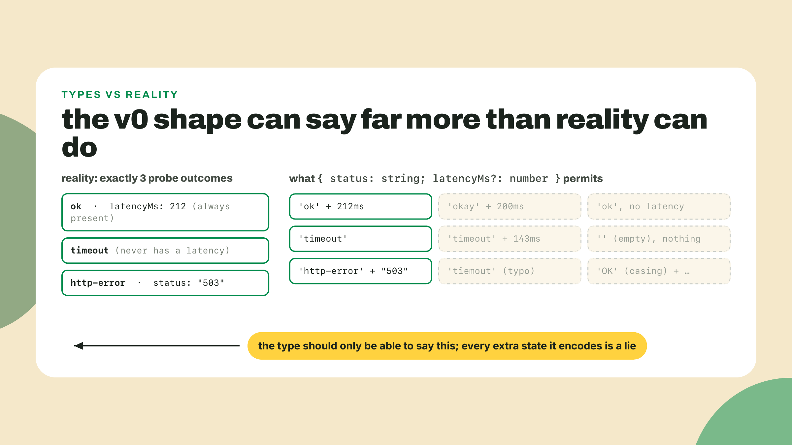
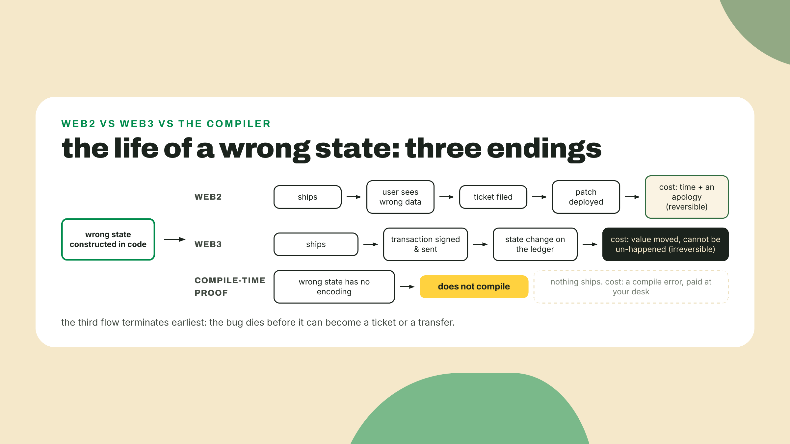
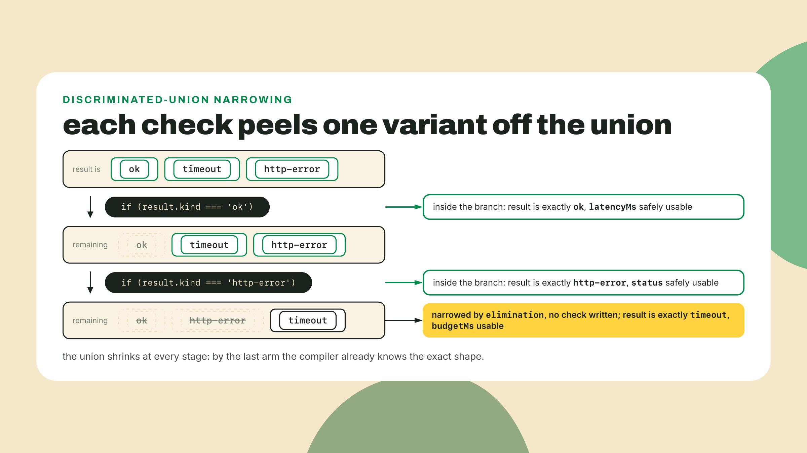
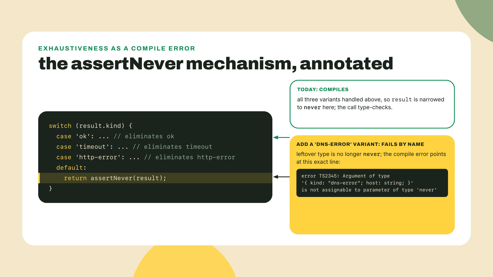
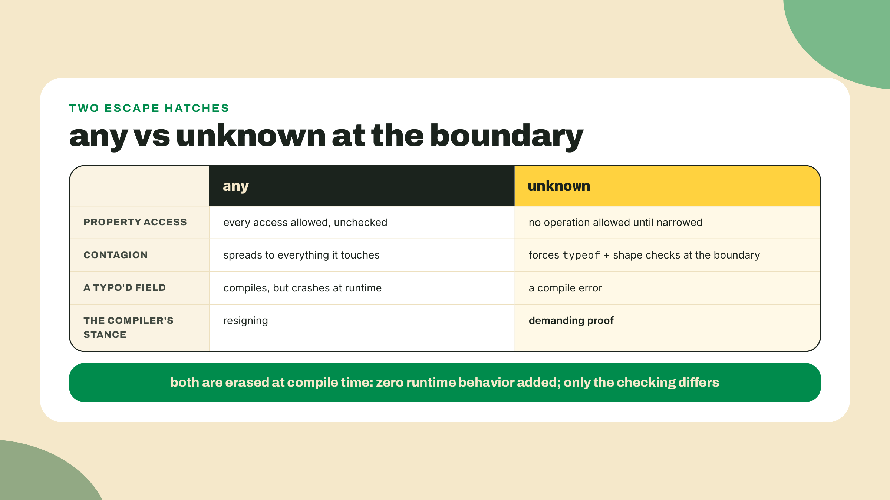
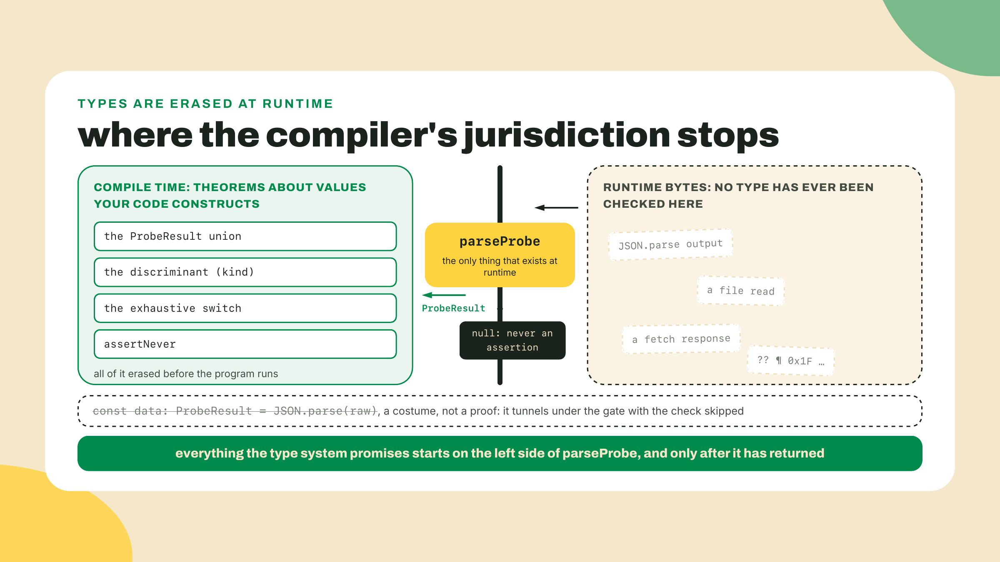
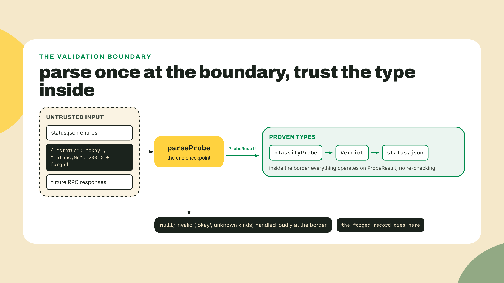
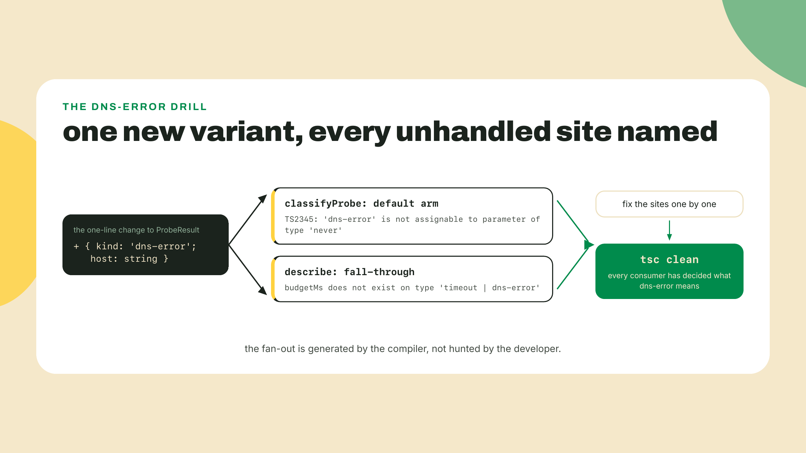

# Make impossible states unrepresentable

**Summary:** Module 1 shipped the heartbeat: pulse v0 probes a URL with built-in fetch, and the m01-l3 Actions cron runs it on a schedule and commits status.json, a machine that isn't yours, running your code. It also runs your bugs. This lesson is about one bug in particular, the kind that never crashes. You'll forge a malformed probe record, watch v0 publish it as healthy without complaint, and then delete the entire category of that bug by rebuilding the fleet's result type as a discriminated union with an exhaustive switch. By the end, a wrong state won't be caught. It won't be constructible.

Before any theory, do this. Open your pulse repo and drop these four lines at the top of the probe file (top matters: v0's usage guard exits early when no URL is passed), then run it with `npx tsx probe.ts`:

```ts
type ProbeRecord = { status: string; latencyMs?: number };

const forged: ProbeRecord = { status: 'okay' };
console.log(forged.status !== 'timeout' ? 'healthy' : 'down');
```

It prints `healthy`, then v0's usage guard complains about the missing URL and exits 1. Ignore the guard's line; it is doing its old job. The line that matters is the first one. Read the forged record again. Its status is the string `'okay'`, not `'ok'`. No probe ever ran. There is no latency. And yet: healthy. No exception, no red text, nothing for the cron to fail on. If this record were sitting in status.json right now, your workflow would commit it green, and the dashboard you'll build in Module 3 would render a target as up that was never actually probed.

Nothing crashed. That is the problem. Sit with that sentence for a second, because it's the whole lesson: in v0, a wrong state is representable, so it flows. Every downstream consumer either re-checks it or trusts it, and the one that trusts it lies to whoever is watching.

Your instinct might be "so add a check." Hold that thought. We're going to do something better than checking. We're going to make the wrong state impossible to write down.

## The pattern: states you cannot misspell

### A shape that can lie

Here is the v0 result shape, boiled down to the two fields that decide health. It is a close cousin of the record your probe has been writing since m01-l2, that one also carries `url` and a timestamp, and it commits the same sin with a different spelling: m01-l3 shipped `latencyMs: number | string`, a timeout recorded as prose:

```ts
type ProbeRecord = { status: string; latencyMs?: number };
```

Two fields. Looks harmless. Now count what it can say. `status` is `string`, which means it can hold `'ok'`, `'timeout'`, `'okay'`, `'OK '` with a trailing space, or the complete text of Moby Dick. `latencyMs` is optional, which means every one of those statuses comes in two flavors: with a number, or without. The type happily encodes all of these:

- `{ status: 'ok' }` with no latency. An "ok" probe that measured nothing.
- `{ status: 'okay', latencyMs: 200 }` the typo you just forged, now wearing a plausible latency.
- `{ status: 'timeout', latencyMs: 143 }` a timeout that somehow has a latency.

None of these states can happen in reality. A successful probe always has a latency. A timeout never does. But the type can't say that, so every consumer of `ProbeRecord` has to re-derive reality at the point of use: check the status string, check whether latency is there, decide what a missing field means. Every check is a place to forget a check. Your forged record sailed through because one consumer, that little `!== 'timeout'` line, made a reasonable-looking assumption the type never promised.



### Why money code cannot shrug

Now the why, because this course promised you the why and this is the lesson that earns it.

Start from how web2 handles this exact bug. The forged record ships. Some dashboard shows a stale green tile. A user files a ticket, someone greps the logs, a fix goes out Tuesday. The wrong state cost you an apology. This is a fine way to live, and it's why plenty of web2 shops still ship happily on plain JavaScript: when mistakes are cheap and reversible, compile-time proof is a tax you can rationally decline.

Web3 breaks that arithmetic. The code this course is walking you toward, the code most real web3 codebases are made of, moves value. A transaction that type-checks its way into existence with the wrong state doesn't produce a ticket. It produces a transfer that already happened, on a ledger whose entire design goal is that nobody can quietly un-happen it. A drained account does not un-drain. The cost of a wrong state stops being "an apology" and becomes unbounded and irreversible, and once that's true, the cheapest insurance on the market is a proof the compiler will make for free, every build, forever.

So ask the sharper question: what exactly does a compile-time proof buy that a runtime check cannot? A runtime check is a sentence someone must remember to write, at every site, on every refactor, forever. It runs when the bad value arrives, which means it runs in production, at the worst possible moment, if it was written at all. A compile-time proof is different in kind, not degree: it's validation you never have to remember, because the program that contains the mistake is not a program. It never compiles, so it never exists, so it never runs. Validation you never have to remember beats validation someone will eventually forget. That's the entire trade, and web3 is the environment where the price of forgetting finally made everyone pay for the proof.



The ecosystem has been voting on this with its feet for a while, and 2026 gave us the loudest ballot yet. Between March 2025 and 2026-07-08, Microsoft ported the TypeScript compiler to Go and shipped it as TS 7: an ecosystem so committed to compile-time proof that it rebuilt the prover itself for speed. That's not the behavior of a community that thinks types are lint. Types are load-bearing infrastructure in 2026, and the compiler checking your probe today is the fastest one ever built precisely because so much now leans on it.


### The union: each variant carries exactly its own data

Before the fix, rule out the tempting non-fixes, because you'll meet all three in real codebases and each fails for a reason worth owning.

Naive fix one: validate everywhere. Write an `isValidRecord` helper and call it at every use site. This works until the day someone adds a use site and doesn't know the helper exists, which in a growing codebase is next Tuesday. You've turned a design problem into a memory test, and the failure mode is silent, exactly like the one you just watched.

Naive fix two: test harder. Write a unit test for the `'okay'` case. Good instinct, wrong tool: a test proves the inputs you thought of behave, and this bug's whole identity is being the input nobody thought of. Tests sample the state space. We need to shrink it.

Naive fix three: comments and discipline. Document that status must be `'ok'` or `'timeout'` and trust the team. This is the one everyone actually ships, and it's the polite lie's natural habitat, because a comment compiles no matter what the code does.

Notice the shape of all three failures: each one leaves the wrong state representable and then posts a guard somewhere, hoping the guard is always awake. So the real fix inverts the approach. Not more guards. A shape that has no encoding for the lies.

Ask what a probe result actually is. It's one of exactly three stories: the target answered in time, the target never answered, or the target answered with an HTTP error. Each story comes with its own evidence, and crucially, only its own evidence. TypeScript lets you write that down directly:

```ts
type ProbeResult =
  | { kind: 'ok'; latencyMs: number }
  | { kind: 'timeout'; budgetMs: number }
  | { kind: 'http-error'; status: number };
```

This is a discriminated union. Three object shapes joined by `|`, sharing one property, `kind`, whose type in each branch is not `string` but a single literal: exactly `'ok'`, exactly `'timeout'`, exactly `'http-error'`. That shared literal property is called the discriminant, and it's what makes the whole pattern click, because the compiler can tell the variants apart by looking at it.

Walk the variants like an auditor. `'ok'` carries `latencyMs`, required, because a success without a measurement is not a success. `'timeout'` carries `budgetMs`, the budget it blew, and has no latency field at all, not an optional one, none. `'http-error'` carries the `status` code the server sent back. Nothing optional anywhere. Now re-run yesterday's lies against this type. An ok with no latency? Missing required property, no encoding. A typo'd `'okay'`? Not one of the three literals, no encoding. A timeout with a latency? `latencyMs` doesn't exist on that variant, no encoding. The incoherent combinations didn't get caught. They ceased to have a spelling.

I'll confess: I have shipped the optional-field version of this more times than I want to admit. `latencyMs?: number` feels so reasonable when you write it, one field, covers both cases, moving fast. Optionality is exactly how impossible states sneak back in. Every `?` on a field that's really "present on some variants" is a small door you've left open, and something will eventually walk through it wearing the wrong status string. The union's discipline, each variant carries exactly its own data, is the habit that keeps the door shut.

### Narrowing in anger

A fair objection lands right here: fine, the type is honest, but `result.latencyMs` no longer compiles at all, because `latencyMs` only exists on one of the three branches. Did we just make the type unusable?

No. We made it demand proof before use, and TypeScript's narrowing is how you supply the proof. Check the discriminant and the compiler narrows the union to the one arm that matches, inside that block only:

```ts
function describe(result: ProbeResult): string {
  if (result.kind === 'ok') {
    return `${result.latencyMs.toFixed(1)}ms`;
  }
  if (result.kind === 'http-error') {
    return `HTTP ${result.status}`;
  }
  return `no answer in ${result.budgetMs}ms`;
}
```

Inside the first branch, `result` is `{ kind: 'ok'; latencyMs: number }` and nothing else, so `latencyMs` is guaranteed, no optional check, no undefined. Inside the second, `status` is guaranteed. And look at the last line: after two checks have eliminated two variants, the compiler has narrowed the leftover to `'timeout'` all by itself, so `budgetMs` just works. You never told it. It did the elimination.

The same narrowing engine runs on plainer fuel too. `typeof value === 'string'` narrows an `unknown` to `string` inside the block. `value === null` narrows a `T | null` to `T` in the else branch. Discriminant checks, `typeof` checks, equality checks: they're all the same move, a runtime test the compiler watches and turns into type information. You'll use all three at the fleet's edges before this lesson is over.

And here's a payoff you already earned without noticing. Remember the opener's forged `'okay'`, the typo that started this whole lesson? Write the same typo against the union and watch what happens:

```ts
function isUp(result: ProbeResult): boolean {
  return result.kind === 'okay';
}
```

```
error TS2367: This comparison appears to be unintentional because the types
  '"http-error" | "ok" | "timeout"' and '"okay"' have no overlap.
```

Against the v0 shape, `record.status === 'okay'` was a perfectly legal comparison between two strings, and the compiler had nothing to say. It couldn't. `string === string` is always a reasonable question. Against the union, the discriminant's type is three specific literals, so comparing it to `'okay'` is provably always false, and the compiler flags the comparison itself as a bug. The typo class didn't get harder to write. It got impossible to compile. That before and after is worth replaying in your head, because it's the clearest single demonstration of what you bought: the check you used to have to eyeball in code review, a machine now performs on every keystroke.



### Exhaustiveness is a feature you opt into

Narrowing gives you safe access. There's a second guarantee available, and you have to reach for it deliberately: the guarantee that you handled every variant. This is where the pattern goes from tidy to genuinely load-bearing, and the price of admission is one four-line function:

```ts
function assertNever(value: never): never {
  throw new Error(`Unhandled variant: ${JSON.stringify(value)}`);
}
```

Nothing magic. An ordinary function whose parameter type is `never`, the type with no values. Any function taking `never` would behave identically. The magic is entirely in narrowing: switch on the discriminant, handle every variant, and in the `default` arm the compiler has eliminated everything, so the leftover type is `never`, and the call type-checks. Miss a variant, or add a new one later, and the leftover is no longer `never`. The call stops compiling, and the error names the exact variant you haven't handled, at the exact line.



Read that consequence again, because it inverts how refactoring feels. Adding a `'dns-error'` variant to a codebase full of these switches doesn't create a hunt for every place that needs updating. It creates a compile-error checklist: every unhandled site fails, by name, until each one decides what dns-error means for it. The compiler writes the refactor worksheet for you. Honestly, of everything in this lesson, this is the part I most wish someone had shown me earlier, and it's not TypeScript-only wisdom either. This exact move returns in Module 4 wearing a Rust flag, where `match` is exhaustive by default and the compiler holds the pen from the start. Learn it here, collect it again there.

One warning, and it's the sharpest footgun in the lesson. A `default:` arm that does anything other than `assertNever`, say `default: return 'down'`, silences the compiler and quietly sells the guarantee you just bought. Future variants sail through it, unclassified, forever, and tsc says nothing, because you told it not to. A catch-all default is the polite lie with a type signature. Reach for one only at a true don't-care boundary, and know what you're selling when you do.

### unknown over any at the boundary

There's one more discipline to install before the lab, and it lives at the edges of your program, where JSON files, RPC responses, and other people's data arrive.

TypeScript gives you two types for "I don't know what this is," and they are opposites wearing similar names. `any` is the compiler resigning: every operation on an `any` is allowed, unchecked, and every value it touches inherits the shrug, spreading through your call graph like a solvent. `unknown` is the compiler demanding proof: no operation is allowed until you narrow it, with the exact tools you just learned. Same runtime, both erased to nothing, opposite defaults. One permits everything and asks nothing. The other permits nothing until you've shown your work.



This matters to the fleet right now because `JSON.parse` hands you back data you haven't proven anything about, and its return type should be treated as `unknown` at every boundary you own. Type it `any` to move fast and one fetch site infects every downstream consumer with unchecked access. Type it `unknown` and the compiler forces the parse-at-the-boundary discipline you'll build into `parseProbe` in the lab: prove the shape once, at the edge, and everything inside operates on honest types. That discipline is exactly what the config file the fleet grows next lesson, and every RPC response after it, will need, and it's precisely where next lesson picks up.

Let's use it in anger once, so it's a habit and not a slogan. Suppose a raw record arrives from a file, shape unknown, trust zero. Here's the border guard, built entirely from the narrowing moves you already have:

```ts
function readRecord(raw: unknown): ProbeResult | null {
  if (typeof raw !== 'object' || raw === null) return null;
  const kind = (raw as Record<string, unknown>)['kind'];
  const value = (raw as Record<string, unknown>)['value'];
  if (typeof kind !== 'string' || typeof value !== 'number') return null;
  return parseProbe(kind, value);
}
```

Trace the proofs as they accumulate. The `typeof raw !== 'object'` check plus the `raw === null` equality check together prove we're holding a real object before we touch it, and note that both are needed: `typeof null` is `'object'`, a twenty-year-old JavaScript wart the equality check patches. Then each field gets pulled out as `unknown` and interrogated with `typeof` until it confesses to being a `string` or a `number`. Only then, with every claim proven, does the value earn the right to enter `parseProbe`. Try skipping any check and the compiler stops you at the next line, because you're operating on a value whose shape you haven't demonstrated yet. That constant demand for receipts is annoying for about a day. Then some malformed record arrives at three in the morning, bounces off this function as a `null`, and you stop noticing the annoyance forever.

Yes, this is verbose. Five lines of interrogation for two fields, and a real config object has twenty. Feel that friction and remember it, because it's the exact pain that makes next lesson's tool land: a schema library writes this entire function from a declaration, and the type comes out as a bonus. You're allowed to be annoyed. The annoyance is the curriculum.

Which brings us to the honest limit, and it deserves its own paragraph rather than a footnote. TypeScript's types are erased at runtime. The union proves theorems about the values your own code constructs, but it proves nothing, nothing at all, about the bytes that arrive from a file or the network. Declaring `const data: ProbeResult = JSON.parse(raw)` is not a proof, it's a costume. The type system's guarantees begin only after a real runtime check has earned them, which is why `parseProbe` returns `ProbeResult | null` instead of asserting, and why the systematic version of that idea, schemas that generate both the runtime check and the type from one source, is the entire subject of the next lesson.



### The trade-off

Every lesson in this course names the cost, so here it is. Union modeling is ceremony you pay up front: more type declarations than the one-line v0 shape, a parse step at every boundary, and a new variant breaks every switch in the codebase until each site decides what to do with it. On a hackathon Sunday, that noise is real friction, and `{ status: string }` will genuinely get you to the demo faster. The bill arrives later, at exactly the moment you can least afford it, and in this course's domain the bill doesn't come with a refund policy. Noisy for velocity, magnificent for correctness: you now know which side of that trade this course sits on, and more usefully, you know how to choose per project instead of by habit.

**Go deeper (the 20%).** this lesson taught you why unions exist and the patterns you'll use daily: the discriminant, the exhaustive switch, `unknown` at the edges. The full taxonomy of narrowing, type guards, the `in` operator, assertion functions, lives in the TypeScript Handbook's Narrowing chapter, and its discriminated-unions section is the canonical treatment of today's pattern: [https://www.typescriptlang.org/docs/handbook/2/narrowing.html#discriminated-unions](https://www.typescriptlang.org/docs/handbook/2/narrowing.html#discriminated-unions). Bookmark it, read it this week, and when this module ends, the type-challenges repo is the drill yard where these muscles get built for real. The lab below needs none of the bookmarked material.

## Lab: delete the category

Here's how the training wheels sit this module: I'll work steps 1 through 8 with you, every file shown and explained. Step 9 you complete with only the compiler's errors as your guide, no prose walkthrough. The challenge after that is fully yours. That fade is deliberate, and it gets steeper next module.

All of this happens in your pulse repo from Module 1, in `probe.ts`, the same probe file you've been growing since m01-l2. One housekeeping note before you start: that file already declares v0's `ProbeResult` record (the `{ url, status, latencyMs }` shape, with a timestamp riding along in the fleet's copy). The union in step 2 takes over the name, so delete the old declaration when you add the new one, two types with one name is a compile error, and this time the error would be right.

A second housekeeping note, about the file you are NOT editing. `fleet.ts`, the cron writer from m01-l3, declares its own separate v0-shaped result type (that's where `url` and `checkedAt` live) and doesn't import anything from `probe.ts`, so nothing you do today touches it: it keeps compiling, the m01-l3 CI typecheck gate stays green, and `status.json` keeps its frozen `{ url, status, latencyMs, checkedAt }` contract until m03-l2 rewires the writer, right before the dashboard schemas the file. Yes, that means the fleet writer still speaks v0's lying dialect after today. Deliberate: this lesson deletes the category inside `probe.ts`; the fleet side gets rebuilt on schemas across the next two lessons.

1. **Reproduce the lie first.** If you skipped the opener's forged record, do it now: add `const forged: ProbeRecord = { status: 'okay' };` and the `!== 'timeout'` check, then run both of these:

```bash
npx tsx probe.ts     # prints: healthy
                     # then: usage: npx tsx probe.ts <url>, exit 1
npx tsc --noEmit     # exits clean. green.
```

   The usage error and the exit 1 are v0's no-args guard doing its normal job; the forged line prints before the guard fires, and that first `healthy` is the lie we care about. Watch it print, and confirm the compiler is green too. It has no objection, because the type you gave it genuinely permits this. That green check is your before photo.

2. **Model the union.** At the top of the file, delete v0's old `ProbeResult` record and add the fleet's new type layer in its place. Delete the step-1 forged lines too, all three of them (the `ProbeRecord` type, the `forged` const, and its `console.log`); they were the before photo, and left in place they would print a stray `healthy` before every probe run forever. (tsc goes red the moment you make these edits, because v0's probe still returns the old shape; steps 5 through 7 walk every one of those errors back to green, which is exactly the workflow this lesson is selling.)

```ts
type ProbeResult =
  | { kind: 'ok'; latencyMs: number }
  | { kind: 'timeout'; budgetMs: number }
  | { kind: 'http-error'; status: number };

type Verdict = 'up' | 'degraded' | 'down';

function assertNever(value: never): never {
  throw new Error(`Unhandled variant: ${JSON.stringify(value)}`);
}
```

   Note `Verdict` is itself a small union of literals. The same trick that fixed the result type also stops `'degarded'` from ever leaving your classifier.

3. **Put the old and new shapes on one screen.** This side-by-side is the whole lesson in two declarations, so actually look at them together before deleting anything:

```ts
// v0: one shape, many lies
type ProbeRecord = { status: string; latencyMs?: number };

// typed fleet: three shapes, no spare states
type ProbeResult =
  | { kind: 'ok'; latencyMs: number }
  | { kind: 'timeout'; budgetMs: number }
  | { kind: 'http-error'; status: number };
```

   The diff is the lesson. The stringly field became three literal discriminants. The optional field became a required field that exists only where it's true. Everything v0 could misspell, the union cannot spell at all.

4. **Parse at the boundary.** Untrusted pairs of `(kind, value)` come from outside; this function is the border checkpoint that turns them into proof or turns them away:

```ts
function parseProbe(kind: string, value: number): ProbeResult | null {
  switch (kind) {
    case 'ok':
      return { kind: 'ok', latencyMs: value };
    case 'timeout':
      return { kind: 'timeout', budgetMs: value };
    case 'http-error':
      return { kind: 'http-error', status: value };
    default:
      return null;
  }
}
```

   Note what the return type says out loud: `ProbeResult | null`. Parsing can fail, so the type admits it, and every caller is forced by the compiler to handle the `null` before touching the result. The malformed target from the opener dies right here, at the border, as a `null` you must handle loudly, instead of deep in a dashboard as a green tile.



5. **Rewrite the classifier exhaustively.** Replace whatever v0 logic decided health with this:

```ts
function classifyProbe(result: ProbeResult): Verdict {
  switch (result.kind) {
    case 'ok':
      if (result.latencyMs < 400) return 'up';
      if (result.latencyMs <= 1000) return 'degraded';
      return 'down';
    case 'timeout':
      return 'down';
    case 'http-error':
      return result.status === 429 ? 'degraded' : 'down';
    default:
      return assertNever(result);
  }
}
```

   Two judgment calls in here are worth their why. The bands: under 400ms is healthy, 400 through 1000 inclusive is degraded, and only strictly above 1000 is down, because a slow answer is still an answer. And 429: a rate-limit response means the target is alive and talking, just tired of you, so it's `'degraded'`, not `'down'`. The rest of the switch is plumbing, and notice how little defensive code it contains. Inside each arm, the fields just exist. Narrowing already proved them.

6. **Wire the probe itself to the union.** The probe function now returns the honest type end to end:

```ts
async function probe(url: string, budgetMs = 5000): Promise<ProbeResult> {
  const started = performance.now();
  try {
    const res = await fetch(url, { signal: AbortSignal.timeout(budgetMs) });
    const latencyMs = performance.now() - started;
    if (!res.ok) {
      return { kind: 'http-error', status: res.status };
    }
    return { kind: 'ok', latencyMs };
  } catch {
    return { kind: 'timeout', budgetMs };
  }
}
```

   Try, just as an experiment, to return the forged state from this function: `return { kind: 'ok' }` with no latency. The compiler refuses before you can save the file. That's the before and after of this whole lesson compressed into one red squiggle: the lie you watched print `healthy` in step 1 now cannot leave the function that would have told it.

7. **Rewrite the driver, the last v0 holdout.** Run `npx tsc --noEmit` now and the errors that remain, five of them, all point at the bottom of the file: the m01-l2 driver loop still collects `results`, sorts on `latencyMs`, and prints `result.url`/`result.status`/`result.latencyMs.toFixed(1)`, none of which exist on every arm of the union (and `url` on none of them). That is the compiler telling you the CLI's output format was designed for the old shape, so the driver gets redesigned, not patched. First, if you haven't already, add the theory section's `describe` function to the file, verbatim from the narrowing section; it is about to become the CLI's detail formatter. Then keep the `targets`/usage-guard lines and replace everything below them with:

```ts
for (const target of targets) {
  const result = await probe(target);
  console.log(`${target} ${classifyProbe(result)} (${describe(result)})`);
}
```

   The `results` array, the sort, and the old log line all go. The new output is the verdict-first line the fleet actually wants, with the evidence in parentheses:

```bash
npx tsx probe.ts https://www.rust-lang.org
# https://www.rust-lang.org up (88.7ms)
```

   Your latency will differ; the shape won't. Notice what the redesign dropped: sorting by latency made sense when every record had a `latencyMs`, and under the honest union it doesn't, because a timeout has no latency to sort on. The type didn't just find the bug, it retired the feature the bug lived in.

8. **Verify, then extract the negative proof.** First the positive check: `npx tsc --noEmit` should exit clean. Green. But green-when-correct is only half of what you bought, so now prove the guarantee is real by breaking it on purpose. Comment out the entire `case 'http-error':` arm in `classifyProbe` and run `npx tsc --noEmit` again:

```
probe.ts: error TS2345: Argument of type '{ kind: "http-error"; status: number; }'
  is not assignable to parameter of type 'never'.
```

   Look at what it did. It didn't say "something's wrong somewhere." It named the missing variant, at the `assertNever` line, in the function that stopped handling it. The compiler is doing the review. Restore the arm, confirm clean, and that's your checkpoint: you should now be able to produce both states on demand, green when exhaustive, a named error when not.

9. **The dns-error drill. Your turn, compiler as guide.** Right now, a DNS failure, probing `https://definitely-not-a-real-host.example`, lands in the `catch` and gets recorded as a timeout, which is a small lie of its own: the host didn't time out, it doesn't exist. Add a fourth variant, `{ kind: 'dns-error'; host: string }`, to `ProbeResult`, then run `npx tsc --noEmit` and fix nothing but what the compiler names, one error at a time, until it's green. No walkthrough for this one, and no need: expect the errors to march you to exactly two sites, the classifier's `assertNever` and the `describe` function's fall-through (it relied on `'timeout'` being the only leftover, and step 7 made `describe` part of the CLI). When tsc is green again, every switch in your fleet has consciously decided what a DNS failure means. That worksheet you just followed was written by the compiler, and it's the exact experience of maintaining typed code in a real team.



## Challenge: parse once, classify exhaustively

Now the unguided rep. The classify-probe-result challenge lives in the interactive coding-challenge panel on this lesson's page, same as m01-l2's `latencyStats`: starter, grader, and hints all in the in-browser editor, nothing to download. The starter it hands you is pure v0 thinking: only `'ok'` probes are considered, the degraded band doesn't exist, and everything else lumps into `'down'`. Rebuild it the way you just rebuilt the fleet. Model `ProbeResult` as a discriminated union, parse the incoming `(kind, value)` pair once at the boundary (unknown kinds parse to `null`, exactly like `parseProbe` in step 4), then classify with an exhaustive switch closed by `assertNever`. To be precise about `'invalid'`, since it is not a fourth verdict: keep `Verdict` as the three-member union from step 2, and have the grader-facing function return `Verdict | 'invalid'`, where `'invalid'` is what it answers when the parse came back `null`. Parse failure and classification stay two different facts, and the return type says so. Mind the edges the grader minds: 400 and 1000 both land in `'degraded'`, a 429 means the target answered so it's `'degraded'` too, and the eight tests include the boundary values and the unknown-kind case. Everything you need is above; nothing you bookmarked is required. If you want the extra flex afterward, delete an arm and predict the error before you run tsc.

## Checkpoint

Before you close the tab, the 30-second retrieval, out loud or in a note, no peeking: what does `assertNever` prove, and when does it fire? You're reaching for something like: if every variant is handled, the default arm's value narrows to `never`, so the call compiles; a new variant makes it not-never and the compile fails right there. If that sentence came out clean, you own the mechanism. If it didn't, re-read step 8, run the negative proof once more, and it will.

And tell me how the drill went, honestly: did the compiler's errors actually walk you to every site in step 9, or did you find a gap where the worksheet missed something? That feedback shapes how hard the next modules lean on this move. Where you get stuck, say so in the community thread for this lesson; a stuck-point named early saves five learners behind you.

Your results are typed now. But the fleet is about to grow a config file, JSON on disk arriving as untrusted, untyped data, and so does every RPC response you'll ever fetch, and you now know exactly why a union can't help there: types are erased, and a costume is not a proof. A union can't prove anything about bytes you haven't parsed. Next lesson: zod at the boundary, where the schema is the runtime check and the type's single source at once, and `parseProbe` grows into something that can guard the whole border. The border guard is about to get a schema.
