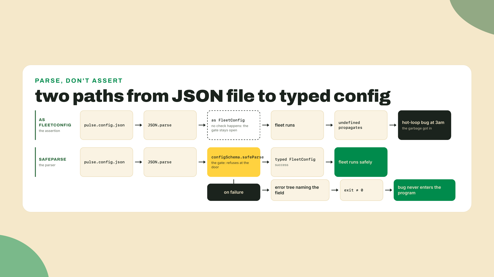
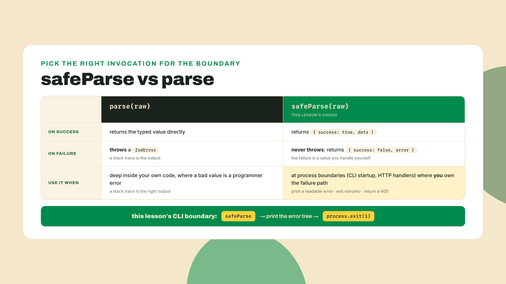
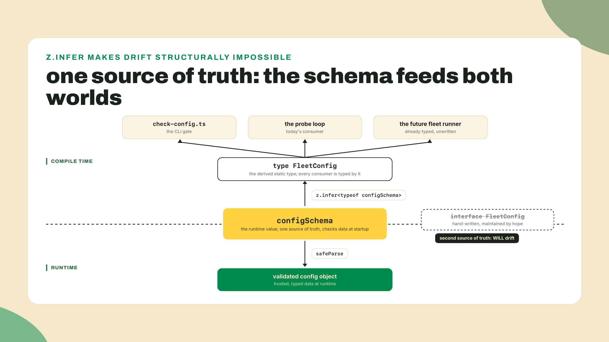
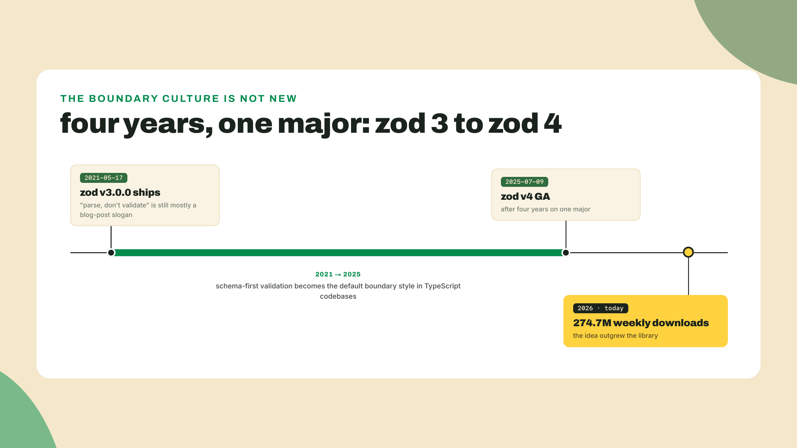
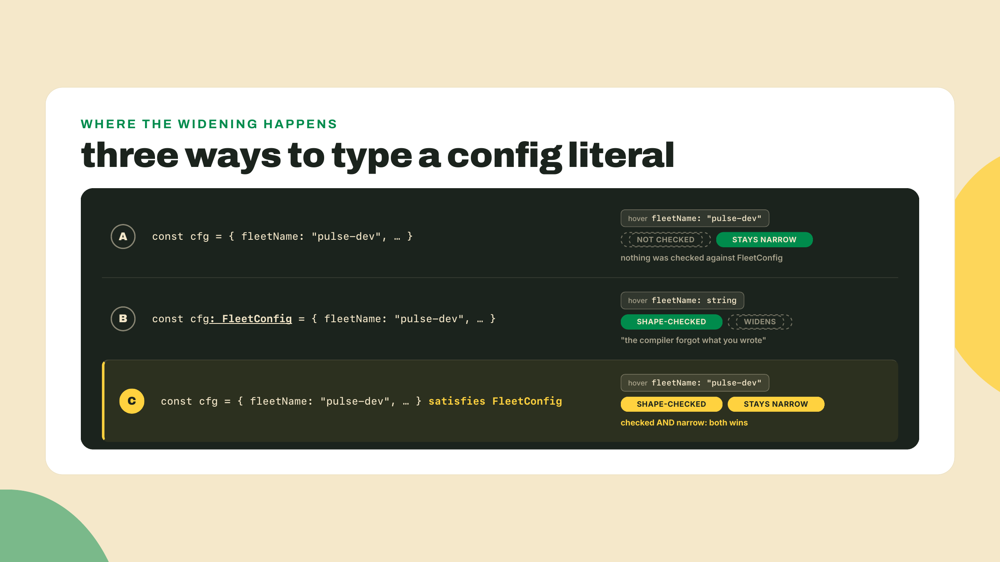
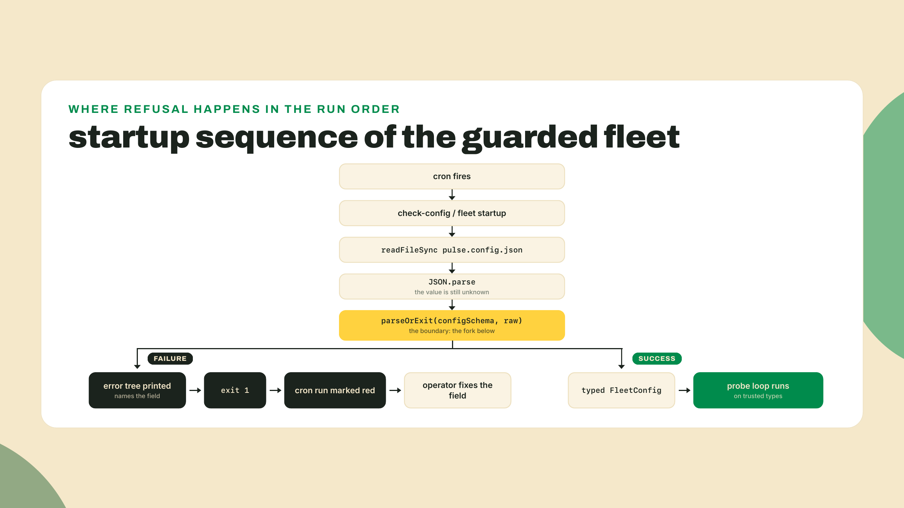

# Parse, don't validate: zod at the boundary

## Summary

Last lesson you replaced v0's stringly probe results with the `ProbeResult` union. Impossible states lost their encoding, and the classifier's switch is now compiler-proven exhaustive. But that proof covers only values born inside the program. Today you extend it to values born outside: the fleet's config file, and the fleet's first real Solana RPC response. You will build the config layer of the pulse fleet: a zod v4 schema that refuses garbage at startup with a field-level error, a `FleetConfig` type derived from that schema so type and validation can never drift apart, one honest generic helper used at both boundaries, and a `getBalance` parser that surfaces lamports as `bigint` because a JavaScript number would quietly lie to you. By the end, `npx tsx src/check-config.ts pulse.config.json` prints a typed summary for a good config and dies loudly, naming the exact broken field, for a bad one.

## The pattern: a parser returns the type

Before any theory, run the bug this lesson exists to kill. The fleet's dials move from hardcoded arrays into a `pulse.config.json` today, and the obvious way to load it is how half of production does: `JSON.parse` plus a cast. Commit the crime in miniature, one throwaway file, `src/naive-load.ts`. (A layout note, since this is the first time you have seen `src/`: from this module on, new fleet code lives in a `src/` directory, so `mkdir -p src` if you do not have one. `probe.ts` and `fleet.ts` stay at the repo root, where the m01-l3 workflow's `npx tsx` paths expect them; the two get knitted together as the module goes on.) The file is a cast-based loader holding a config with one typo'd field, `"intervalSeconds"` where the code reads `intervalSecs`:

```ts
type FleetConfig = { intervalSecs: number };
const raw = '{ "intervalSeconds": 60 }'; // the typo: Seconds, not Secs
const config = JSON.parse(raw) as FleetConfig;
const waitMs = (config.intervalSecs || 0) * 1000;
console.log(`waiting ${waitMs}ms between probes`);
```

```bash
npx tsx src/naive-load.ts   # prints: waiting 0ms between probes
npx tsc --noEmit            # exits clean. green.
```

Nothing fails. Not at load, not at the cast, not at the compile. The missing `intervalSecs` reads as `undefined`, the `|| 0` fallback converts it to zero, and the probe loop's wait time is now nothing. Put that loader inside the GitHub Actions cron from module one and the fleet would happily probe in a hot loop, hammering your targets as fast as fetch can fire, and every individual line of code involved looks correct.

Here is the part that should bother you. Last lesson's union cannot save you here. `ProbeResult` guards values your own code constructs. The config was never constructed by your code. It was read from disk, `JSON.parse`d into `any`-shaped mush, and then somewhere there is a line like this:

```ts
const config = JSON.parse(readFileSync(path, "utf8")) as FleetConfig;
```

That `as FleetConfig` is the bug. I have shipped exactly this line, more times than I want to count, and it always feels safe because the editor autocompletes beautifully afterward. But a type assertion is a comment the compiler is forced to believe. TypeScript types are erased at runtime; the assertion checks nothing, converts nothing, guards nothing. It is a promise nobody checks, and the runtime garbage walks straight past the compiler wearing your type's name tag.

The silver bullet? A parser.

The distinction has a name, and it is the title of this lesson. A **validator** blesses data in place: it looks at a value, maybe throws, and hands you back the same untyped thing you gave it, plus a warm feeling. A **parser** is a function that either returns the typed value or refuses. After a parser runs, the type is TRUE, not asserted. That is the whole pattern: parse where data enters, trust types after.



### zod v4, the working subset

You could write parsers by hand, and in Rust later this course you effectively will. In TypeScript the ecosystem already settled the question. Install zod:

```bash
npm i zod@4.5.4
```

That digit is the latest release as of 2026-09-02; re-check with `npm view zod version` before you pin. The prose in this course says "zod v4" and any 4.x you install today will run this lab.

A zod schema is a value that describes a shape and knows how to check it. Here is the fleet's config schema, whole, because you will build it in the lab and I want you to have seen the destination first:

```ts
import { z } from "zod";

export const targetSchema = z
  .strictObject({
    name: z.string().min(1),
    url: z.url(),
    intervalSecs: z.number().int().positive(),
    timeoutMs: z.number().int().positive(),
  })
  .refine((t) => t.timeoutMs < t.intervalSecs * 1000, {
    message: "timeoutMs must be under the probe interval, or probes pile up on a slow target",
    path: ["timeoutMs"],
  });

export const configSchema = z.strictObject({
  fleetName: z.string().min(1),
  targets: z.array(targetSchema).min(1),
});
```

Read it top to bottom. `z.strictObject` describes an object and rejects keys it does not know, which is exactly what catches the `intervalSeconds` typo: an unknown key is an error, not a shrug. `z.url()` and `z.number().int().positive()` push rules into the schema that would otherwise live as scattered `if` statements in five consumers. And `.refine` is the cross-field escape hatch: any predicate over the whole object, with a message you author and a `path` so the error lands on the field a human would look at. Note the units doing real work in that refinement: the interval is in seconds, the timeout in milliseconds, so the comparison multiplies by 1000. Cross-field rules are precisely where hand-rolled validation rots first, because no single field owns them.

### Error maps: write the message for the operator at 2am

zod's default messages are correct and slightly robotic: "Invalid input: expected number, received undefined" tells you what the machine saw, not what the human should do about it. At an internal boundary that is fine, nobody reads those. At a CLI boundary the error text IS the user interface, and zod v4 lets you replace any message at the point where the rule is declared, with an `error` parameter:

```ts
const s = z.strictObject({
  url: z.url({ error: "url must be a full URL, scheme included (https://...)" }),
  intervalSecs: z.number({ error: "intervalSecs is the probe cadence in SECONDS, as a number" })
    .int()
    .positive({ error: "intervalSecs must be a positive number of seconds" }),
});
```

Feed that a config with `"url": "example.com"` and `"intervalSecs": -5` and the printed tree reads like a colleague wrote it:

```
✖ url must be a full URL, scheme included (https://...)
  → at url
✖ intervalSecs must be a positive number of seconds
  → at intervalSecs
```

The house rule I use for these: a good boundary message names the unit, the constraint, and when it can, the WHY, because the person reading it is editing a config file under time pressure and has zero interest in your type system. Fold custom errors into the lab's `targetSchema` wherever a default message would leave the operator guessing; the acceptance criteria do not depend on them, your future self does. There is a whole further tier of this machinery (per-schema error maps, localization) that the fleet does not need; if you ever ship a product where validation errors reach end users, that is the moment to go read it.

Two ways to run a schema, and the difference matters at a CLI boundary:



The fleet's startup wants `safeParse`. A config typo is not an exception in your logic, it is the operator's mistake, and the kindest thing a CLI can do is print exactly what is wrong and exit nonzero so the cron marks the run red. You will wire that in the lab with `z.prettifyError`, which turns zod's error into the readable tree a human fixes a config file with.

### The schema is where the type comes from

Now the move that makes this pattern systematic instead of just tidy. You do not write a `FleetConfig` interface next to the schema. You derive it:

```ts
export type FleetConfig = z.infer<typeof configSchema>;
```

`z.infer` reads the static type out of the runtime schema. One source of truth. This is honestly a godsend, and here is the drift bug it kills. Suppose the schema and a hand-written interface live side by side. Someone renames `intervalSecs` to `intervalMs` in the interface during a refactor, updates every consumer the compiler flags, ships. The schema still validates the OLD field name. Now valid configs fail validation, or worse, the interface claims a field the validator never checks. Two sources of truth do not drift because your team is sloppy; they drift because they are two, and every rename is a coin flip on which one gets updated. With `z.infer` there is no coin. Rename the field in the schema and every consumer of the type redlines immediately, because the type IS the schema. You will run this drill on purpose in the lab and watch the errors cascade.



Worth a beat of history, because this idea is bigger than this library. zod shipped v3 on 2021-05-17 and took four years to ship one major, v4 on 2025-07-09. In that window "parse, don't validate" went from a blog-post slogan to an entire ecosystem's boundary culture, 274.7M weekly downloads' worth. The idea outgrew the library. You are learning the idea; zod is just the best current tool for it in TypeScript, and when this course reaches Rust you will meet the same discipline running at compile time with serde.



### Generics, just in time

This is the just-in-time moment the module promised: generics land here, exactly when you need them, because you have been consuming them for three paragraphs without a name.

Look again at what you wrote. `z.array(targetSchema)`: you handed a type-shaped value to a function and got back a schema for arrays OF that shape. `z.infer<typeof configSchema>`: you applied a type-level function to a type and got a new type out. Both are generic APIs, and in both cases you CONSUMED the type parameter someone else declared. Here is the honest proportion nobody puts on the tin: reading and applying someone else's generics is about 90% of the generics a working developer touches. `Array<string>`, `Promise<Response>`, `Map<string, ProbeResult>`, `z.infer<typeof T>`. You have been doing it since module one, every time `await fetch(...)` handed you a `Promise<Response>` and the compiler knew what came out of the `await`.

The mental model that makes generic signatures readable in any library's docs: a type parameter is a function argument that happens to be a type. `Array<T>` is a factory that takes a type and returns an array type; `z.ZodType<T>` takes the output type and returns "a schema producing that". When a signature looks intimidating, read it the way you read a function call: find what gets passed in, find where it comes back out, ignore the machinery between. That reading skill, not authoring skill, is what unblocks you in real codebases.

The other 10% is authoring your own, and this lesson needs exactly one, because the fleet now has two boundaries doing the same dance: read raw data, safeParse it, print the tree and die on failure, return the typed value on success. Twice is a pattern:

```ts
export function parseOrExit<T>(schema: z.ZodType<T>, raw: unknown): T {
  const result = schema.safeParse(raw);
  if (!result.success) {
    console.error("boundary refused this input:");
    console.error(z.prettifyError(result.error));
    process.exit(1);
  }
  return result.data;
}
```

Read the signature slowly, it is the whole generics lesson. `<T>` declares a type variable. `schema: z.ZodType<T>` says "a schema that produces T", and `raw: unknown` is last lesson's discipline holding the line: the input is untouchable until proven. The return type `T` closes the loop: whatever the schema produces, the caller gets, fully typed. Call it with `configSchema` and `T` becomes `FleetConfig`; call it with a balance schema later and `T` becomes that. One helper, both boundaries, zero casts. This is also last lesson's closing promise cashed in: `parseProbe` guarded one hand-rolled pair shape, and `parseOrExit` plus a schema is that same border guard generalized to any boundary you can describe, which is what "guard the whole border" turns out to mean. Notice what we did NOT do: no `<T extends ...>` towers, no conditional types, no clever inference tricks. Elaborate generic signatures are a skill you can acquire when a library forces you to; today you learn the shape you will actually use weekly.

### `satisfies`: checked, not widened

One more tool and the theory is done. The fleet wants a default config in code, for local dev when no file is given. Three ways to write it:

```ts
// 1. No annotation: narrow types, zero shape checking. A typo'd key sails through
//    until something consumes it.
export const defaultConfig = { ... };

// 2. Annotation: shape checked, but WIDENED. fleetName is now just `string`;
//    the compiler forgot what you wrote.
export const defaultConfig: FleetConfig = { ... };

// 3. satisfies: shape checked AND every field keeps its narrow literal type.
export const defaultConfig = {
  fleetName: "pulse-dev",
  targets: [
    { name: "local", url: "http://localhost:3000/health", intervalSecs: 30, timeoutMs: 2000 },
  ],
} satisfies FleetConfig;
```

`satisfies` is check-without-widening. The compiler verifies the literal conforms to `FleetConfig`, exactly like the annotation would, but the value's own inferred type survives: hover `defaultConfig.fleetName` and you see the literal `"pulse-dev"`, not `string`. With the annotation you get the worst trade at a constant: you wanted precision AND the check, and it silently sold the precision. Why the fleet cares: downstream code can branch on `cfg.fleetName === "pulse-dev"` with the compiler tracking the exact value, and a typo'd key in the default still fails to compile, which option 1 would have let slide until some consumer tripped over it in production. To be clear about what `satisfies` is not: it is purely compile-time. It runs nothing, refines nothing at runtime, never calls your `.refine`. The schema guards the file on disk; `satisfies` guards the literal in your source. Different boundaries, different tools, and the fleet now uses both on the same shape.



**Go deeper (the 20%).** this lesson taught you the boundary discipline and the generics you consume daily. The rest of zod's surface (transforms, brands, async refinements) and the craft of authoring elaborate generic signatures are deliberately bookmarked. When you want them: Total TypeScript's free Zod tutorial (totaltypescript.com/tutorials, 10 exercises, free as of this writing) is the best drill set on the library, and the TypeScript Handbook's Generics chapter (typescriptlang.org/docs/handbook/2/generics.html) is the canonical treatment of authoring. Do the tutorial after this module, not instead of the lab.

## Lab: the boundary that refuses

The autonomy fade, said out loud: step 1 is fully worked, you type along and I explain every line. Steps 2 and 3 are completions, I hand you a skeleton and you author the load-bearing part. Step 4 is a guided drill where the compiler does the teaching. No unguided challenge this lesson; the module's coding challenges sit on the lessons either side of this one, so the lab and the quiz carry the assessment here.

You are working in the fleet repo from module one. Node 24 LTS is assumed (that is the active LTS today; Node 26 takes over the LTS line on 2026-10-28, and nothing in this lab changes with it). `tsx` and `typescript` have been dev dependencies since the v0 build; if you are joining fresh:

```bash
npm i -D tsx typescript @types/node
npm i zod@4.5.4
```

### 1. Schema the config, wire the boundary, kill the opener's bug (worked)

Create `src/config.ts` with the schema you saw in the theory section, plus the derived type, the default, and the helper. Complete file, nothing elided:

```ts
import { z } from "zod";

export const targetSchema = z
  .strictObject({
    name: z.string().min(1),
    url: z.url(),
    intervalSecs: z.number().int().positive(),
    timeoutMs: z.number().int().positive(),
  })
  .refine((t) => t.timeoutMs < t.intervalSecs * 1000, {
    message: "timeoutMs must be under the probe interval, or probes pile up on a slow target",
    path: ["timeoutMs"],
  });

export const configSchema = z.strictObject({
  fleetName: z.string().min(1),
  targets: z.array(targetSchema).min(1),
});

export type FleetConfig = z.infer<typeof configSchema>;

export const defaultConfig = {
  fleetName: "pulse-dev",
  targets: [
    { name: "local", url: "http://localhost:3000/health", intervalSecs: 30, timeoutMs: 2000 },
  ],
} satisfies FleetConfig;

export function parseOrExit<T>(schema: z.ZodType<T>, raw: unknown): T {
  const result = schema.safeParse(raw);
  if (!result.success) {
    console.error("boundary refused this input:");
    console.error(z.prettifyError(result.error));
    process.exit(1);
  }
  return result.data;
}
```

Two lines earn commentary. `path: ["timeoutMs"]` aims the refinement's error at the field an operator would actually edit; without it the message lands on the whole target object, which is technically true and practically useless. And `process.exit(1)` inside `parseOrExit` is what makes the helper honest about its name: the type says "returns T", and the only way that is always true is if the failure branch never returns at all. TypeScript understands this because `process.exit` returns `never`, so the compiler proves the success branch is the only branch that reaches `return`.

Now the boundary script, `src/check-config.ts`:

```ts
import { readFileSync } from "node:fs";
import { configSchema, parseOrExit, type FleetConfig } from "./config.js";

const path = process.argv[2] ?? "pulse.config.json";
const raw: unknown = JSON.parse(readFileSync(path, "utf8"));

const config: FleetConfig = parseOrExit(configSchema, raw);

console.log(`fleet "${config.fleetName}": ${config.targets.length} target(s)`);
for (const t of config.targets) {
  console.log(`  ${t.name} -> ${t.url} every ${t.intervalSecs}s, timeout ${t.timeoutMs}ms`);
}
```

Two details before you run it, both of which have eaten an afternoon for someone. The import says `./config.js` even though the file on disk is `config.ts`; that is ESM resolution rules, where import specifiers name the OUTPUT file, and `tsx` resolves it correctly, so do not "fix" the extension. And note the type on `raw`: `unknown`, never `any`. That is last lesson's rule meeting this lesson's tool; `JSON.parse` returns `any`, and annotating the binding as `unknown` un-poisons it so nothing downstream can touch it unparsed, which means the ONLY way from here to a usable config is through the parser. The compiler now enforces the pattern this lesson is named after. And a real `pulse.config.json` at the repo root:

```json
{
  "fleetName": "pulse-prod",
  "targets": [
    {
      "name": "docs",
      "url": "https://example.com",
      "intervalSecs": 60,
      "timeoutMs": 3000
    },
    {
      "name": "api",
      "url": "https://example.org/health",
      "intervalSecs": 30,
      "timeoutMs": 2000
    }
  ]
}
```

Run the boundary:

```bash
npx tsx src/check-config.ts pulse.config.json
```

You should see the parsed, typed summary:

```
fleet "pulse-prod": 2 target(s)
  docs -> https://example.com every 60s, timeout 3000ms
  api -> https://example.org/health every 30s, timeout 2000ms
```

Now the moment this lab exists for. Copy the config to `pulse.config.broken.json` and commit the opener's typo for real: rename the first target's `intervalSecs` key to `intervalSeconds`. Run the boundary against it:

```bash
npx tsx src/check-config.ts pulse.config.broken.json
```

```
boundary refused this input:
✖ Unrecognized key: "intervalSeconds"
  → at targets[0]
✖ Invalid input: expected number, received undefined
  → at targets[0].intervalSecs
```

Exit code 1. Compare this against the opener's naive-load run, because this is the before/after that matters: the same file that v0 ran green on now cannot enter the program. The failure did not move somewhere nicer; it stopped existing at runtime and became a startup refusal with the exact field named twice, once as the unknown key you wrote and once as the required key you starved. My broken run printed exactly those two errors and nothing else, which is the other thing a good error tree buys you: no scroll, no stack trace archaeology, just the fix.



### 2. The cross-field refinement (completion)

Your turn to author the rule. Delete the `.refine` from `targetSchema` and rebuild it yourself from this skeleton:

```ts
export const targetSchema = z
  .strictObject({
    name: z.string().min(1),
    url: z.url(),
    intervalSecs: z.number().int().positive(),
    timeoutMs: z.number().int().positive(),
  })
  .refine(
    (t) => /* your predicate: the timeout budget must fit inside the probe interval */,
    {
      message: /* your message: say WHY, not just what */,
      path: [/* aim it at the field the operator should edit */],
    },
  );
```

Mind the units; the interval is seconds and the timeout is milliseconds, so the honest predicate is `t.timeoutMs < t.intervalSecs * 1000`. A predicate with mixed units is exactly the kind of rule that never survives as tribal knowledge, which is why it lives in the schema and not in a code review comment. Then prove it works. Make a copy of the good config with one target set to `"intervalSecs": 2, "timeoutMs": 5000` and run the checker against it:

```
boundary refused this input:
✖ timeoutMs must be under the probe interval, or probes pile up on a slow target
  → at targets[0].timeoutMs
```

Acceptance: the run exits nonzero and the error lands on `targets[0].timeoutMs` with your message, like the output above. If your message just restates the math, rewrite it; six months from now the operator reading it will not remember why the rule exists, and "probes pile up on a slow target" is the difference between a fix and a workaround.

### 3. The chain-shaped boundary: getBalance as bigint (completion)

Now the second boundary, and the reason this course is drifting Solana-ward. The fleet will eventually watch chain infrastructure, so its first chain read happens here, with no SDK, because a JSON-RPC call is just a POST and you already own a parser discipline.

One orienting sentence and no more: on Solana, balances live in accounts and are denominated in lamports, an integer count of the chain's smallest unit, and everything deeper about what an account IS belongs to the Bitcoin-to-Solana evolution course, which walks that model end to end. The call itself is the JSON-RPC shape you would guess: POST a method name and params, get a result back. Here is a real response body from the endpoint you are about to hit, captured while writing this lesson:

```json
{"jsonrpc":"2.0","result":{"context":{"apiVersion":"4.2.1","slot":443610065},"value":1},"id":1}
```

That `"value":1` is the balance in lamports, and it arrives as a bare JSON number, which brings us to what actually matters in this step: the type of that integer. Lamport balances are u64 on the wire: an unsigned 64-bit integer whose maximum is 18446744073709551615. JavaScript numbers are doubles, exact only up to `Number.MAX_SAFE_INTEGER`, which is 9007199254740991. Any u64 past that rounds silently. A one-lamport balance rides through `JSON.parse` untouched; a whale's balance does not have to. Run the lie yourself, one line:

```bash
node -e "console.log(JSON.parse('{\"value\":9007199254740993}').value)"
```

```
9007199254740992
```

Off by one, no error, no warning, and it happened inside `JSON.parse` before any schema could look at the value. A wrong-by-a-few-lamports balance with no error anywhere is the politest lie in this course so far. So the fix cannot be "validate the number afterward"; the damage predates validation. The fix is to intercept the raw text before it becomes a double.


Node 21 and later gives the interception point: `JSON.parse` passes your reviver a context object carrying the raw source text of each primitive, so you can build a `BigInt` from the digits before the double ever exists. TypeScript's bundled types have not caught up to that third reviver argument yet, so the file bridges it with one typed alias, which is itself a small honest lesson: runtimes ship before types do. Create `src/balance.ts` from this skeleton and complete the two marked parts:

```ts
import { z } from "zod";
import { parseOrExit } from "./config.js";

// Plain z.object here, not strictObject, on purpose: this boundary reads
// someone ELSE's shape, and the RPC server may add fields (apiVersion already
// rides along) without that being your bug. Strictness is for shapes you own,
// like the config; tolerance of unknown keys is for shapes you only consume.
const balanceResponseSchema = z.object({
  jsonrpc: z.literal("2.0"),
  id: z.number(),
  result: z.object({
    context: z.object({ slot: z.number() }),
    // YOUR SCHEMA (a): the balance field. It must come out as bigint, not number.
  }),
});

const RPC_URL = "https://api.mainnet.solana.com";
const address = process.argv[2] ?? "Vote111111111111111111111111111111111111111";

const res = await fetch(RPC_URL, {
  method: "POST",
  headers: { "Content-Type": "application/json" },
  body: JSON.stringify({
    jsonrpc: "2.0",
    id: 1,
    method: "getBalance",
    params: [address],
  }),
});

const text = await res.text();

// Node 21+ passes a { source } context to the reviver; TypeScript's lib types
// have not caught up yet, so bridge the gap with one typed alias.
type ReviverWithSource = (
  this: unknown,
  key: string,
  value: unknown,
  context?: { source?: string },
) => unknown;

const parseWithSource = JSON.parse as (text: string, reviver?: ReviverWithSource) => unknown;

const raw: unknown = parseWithSource(text, (key, value, ctx) =>
  /* YOUR REVIVER (b): when the key is "value" and ctx.source exists,
     build the BigInt from ctx.source; otherwise return value unchanged */
);

const body = parseOrExit(balanceResponseSchema, raw);

console.log(`slot ${body.result.context.slot}`);
console.log(`balance: ${body.result.value} lamports (${typeof body.result.value})`);
```

For (a) the answer is one line, `value: z.bigint()`, and it is doing more than it looks like: if your reviver ever stops running, the schema fails loudly instead of letting a rounded double impersonate a balance. For (b): `key === "value" && ctx?.source !== undefined ? BigInt(ctx.source) : value`. The reviver sees every key named `value` in the document; here only the balance matches, and the guard on `ctx?.source` keeps you honest because the context only carries source text for primitives.

Run it exactly once:

```bash
npx tsx src/balance.ts
```

```
slot 443609276
balance: 1 lamports (bigint)
```

Your slot will differ; the vote program's balance genuinely is 1 lamport, and the word in parentheses is the acceptance check: `bigint`. Feed it a busier address as the first argument if you want a large number, but note the once: `https://api.mainnet.solana.com` is the public endpoint, it is rate-limited, and Solana's docs say plainly it is not intended for production applications. One fetch in this lab is a courtesy call. Fifty targets on a cron is a ban, and the shape of that limit is precisely where the next lesson picks up.

### 4. The drift drill (guided discovery)

Last step, and the point of `z.infer` made physical. In `src/config.ts`, rename the schema field `intervalSecs` to `intervalMs`. Change nothing else. Now run the compiler over the project:

```bash
npx tsc --noEmit
```

Watch the cascade: `check-config.ts` redlines where it prints `t.intervalSecs`, the refinement redlines inside the schema itself, `defaultConfig` redlines under its `satisfies`. Every consumer of the type learned about the rename instantly, because there is exactly one place the type comes from. This is the drift bug from the theory section running in reverse: with two sources of truth this rename would have been a silent divergence; with one source it is a compiler-written checklist of every site that must decide. Revert the rename, run `npx tsc --noEmit` again, confirm green.

**Verify before moving on**: `npx tsx src/check-config.ts pulse.config.json` prints the typed two-target summary and exits 0. The same command against `pulse.config.broken.json` prints the error tree naming `intervalSeconds` and `intervalSecs` and exits nonzero. Your bad-timeout copy is refused with your refinement message on `targets[0].timeoutMs`. And `npx tsx src/balance.ts` prints a lamports line ending in `(bigint)`.

## Challenge

The fleet publishes `status.json` on every cron run; you built that file in module one and you have been trusting your own output ever since. Stop. Write `src/check-status.ts`: a zod schema for `status.json` as your fleet actually writes it, a `StatusReport` type derived with `z.infer`, and a parse of the file through the same `parseOrExit` helper, printing one summary line per target on success. Constraints: the schema must be strict, at least one field needs a rule tighter than its primitive type (a timestamp format via `z.iso.datetime()`, the one validator here the lesson did not teach, so that option costs you a docs lookup; a nonempty array; a latency that cannot be negative), and no new helper; `parseOrExit` was written generic precisely so this third boundary costs you zero new plumbing.

```bash
npx tsx src/check-status.ts status.json
```

Acceptance: your current real `status.json` parses clean, and hand-editing one field into garbage gets refused with a readable, field-level error. It runs entirely local, so no RPC involved. If the schema fights you because your own output format is inconsistent between runs, congratulations: the parser just found a real bug, and fixing the writer is part of the challenge.

## Where the boundary ends

Time to be honest about what you bought and what it cost. A parser at every boundary costs a dependency, a schema to maintain alongside every config change, and startup-time work, and zod's error trees can genuinely overwhelm when schemas nest deep: a failure four levels down a nested union prints a tree that takes real reading, which is why the fleet keeps its config shallow and its messages hand-written. The discipline also has a border, and knowing where it stops matters as much as adopting it. Parse at BOUNDARIES, the places where data enters from outside your type system: a config file on disk, an HTTP response, the environment (when the fleet grows secrets in the deploy modules, `process.env` gets a schema too, and for the same reason). Nowhere else. Internal functions passing each other schema-parsed values should trust their types; re-validating between your own functions is noise that says you do not believe your own compiler, and if that is true the types were pointless. And a passed parse proves shape, never truth. A well-formed config can still point probes at the wrong URL; a well-formed RPC response can still be stale by the time you act on it; the schema cannot know your intent, only your structure. Parsing buys you exactly one sentence: "this data is the shape I reasoned about." That happens to be the one sentence the compiler needed to make every downstream guarantee real.

Your thirty-second win, say it out loud before you close the tab: a validator blesses data in place; a parser RETURNS the typed value, so after it runs the type is true by construction. If you can say that and point at the line in `parseOrExit` where it happens, you have this lesson.

If something in the lab fought you, or the reviver trick felt like it deserved a deeper why, tell me: that feedback steers where the course spends its depth, and the boundary lessons are the ones I most want tuned to where people actually slip. Your boundaries refuse garbage now. So point the fleet at fifty real targets at once, and discover that the internet refuses YOU: rate limits, hung sockets, and a wall of 429s. Next lesson is async that survives contact: concurrency as a budget, backoff with jitter, and cancellation. Pack a rate limit.
