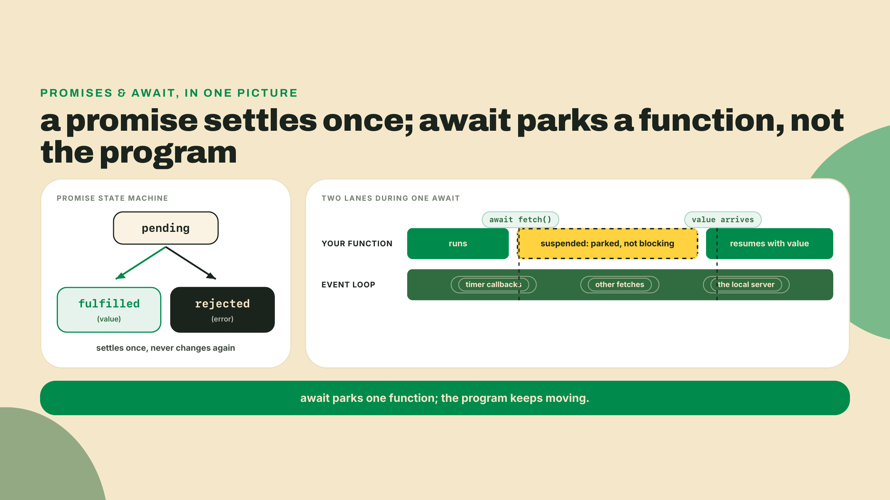
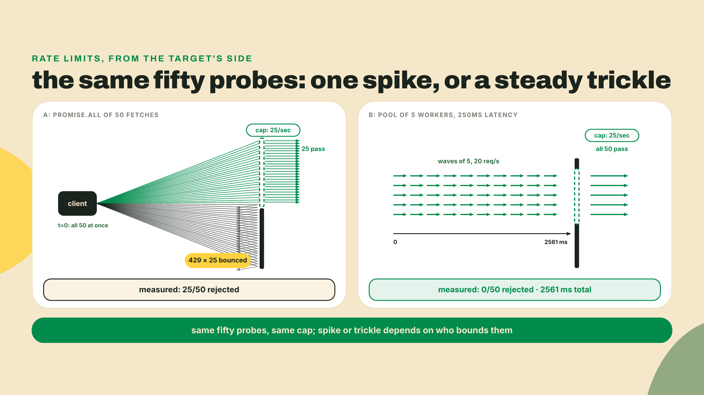
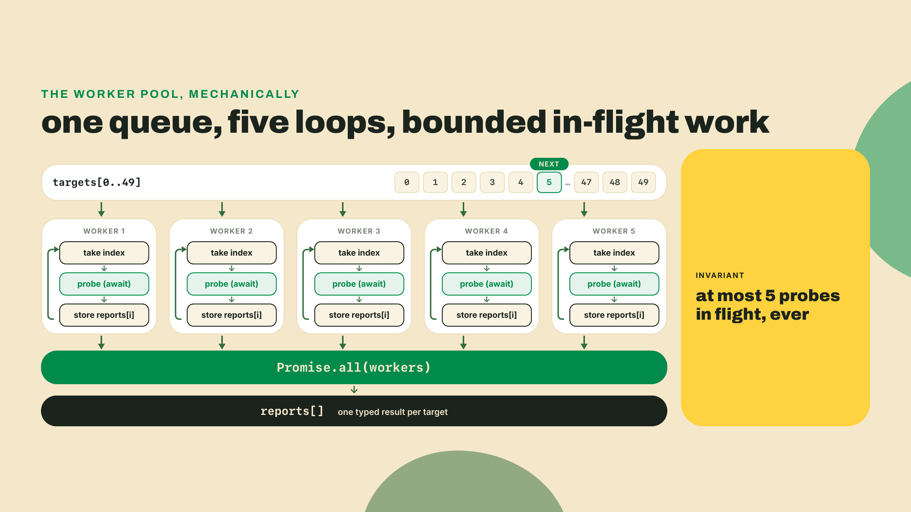
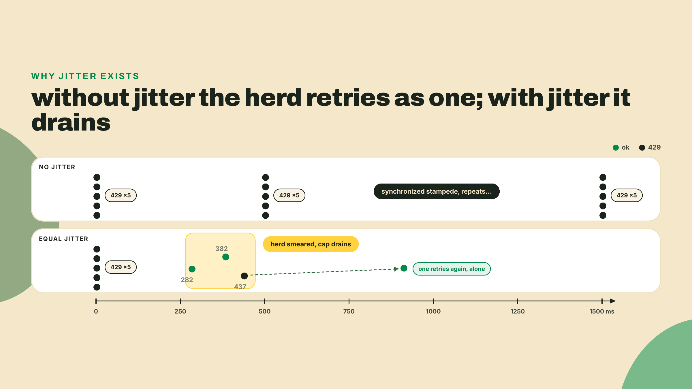
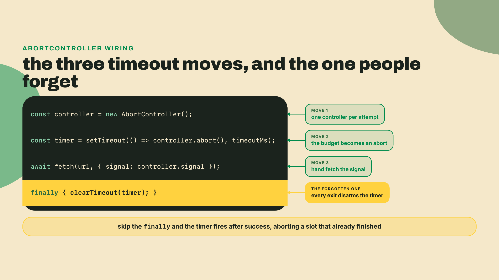
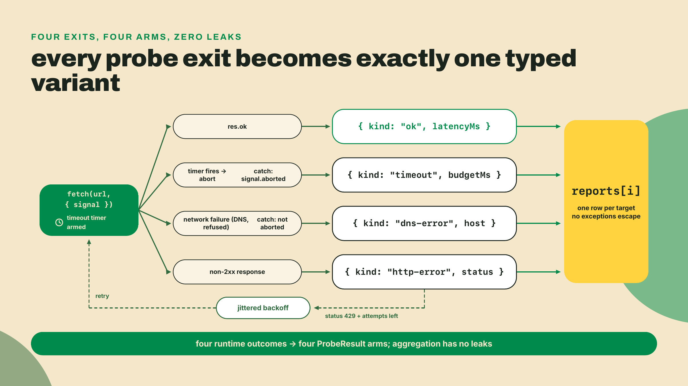
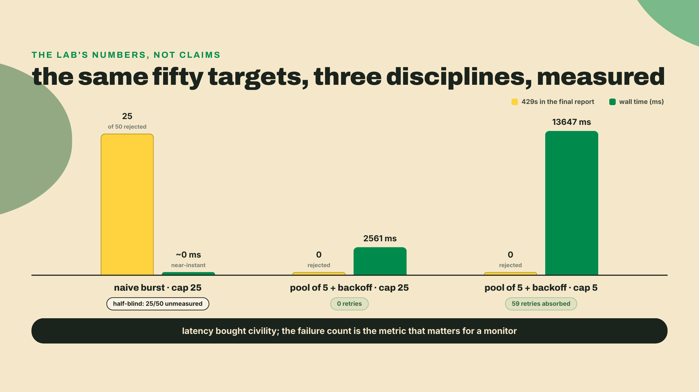

# Async that survives contact: limits, backoff, cancellation

## Summary

m02-l2 put a parser on every boundary: the config is zod'd (typed by `z.infer`, refined, `satisfies`-checked), and the fleet even parsed a real `getBalance` response with lamports as bigint. Data can no longer sneak in malformed. But the fleet still probes one target at a time, and the moment you point it at fifty targets at once, you discover the internet has opinions about how you ask. This lesson builds the fleet's concurrency discipline by hand: a worker pool that bounds how many probes are in flight, jittered exponential backoff for 429s, AbortController timeouts that turn hung sockets into typed results, and an aggregate report where every target ends in exactly one `ProbeResult` variant. You will cause a wall of 429s on purpose, then make it disappear, and you will measure both.

## Concurrency is a budget

Before any theory, cause the problem. Nothing to install today; everything runs on what you already have (Node 24 LTS from m01-l2, `tsx` as the runner, zod from last lesson). Two files, three minutes.

First, a target you are allowed to hammer. This is a local server that behaves like every rate-limited API you will ever meet: it serves a capped number of requests per window, then answers 429 until the window rolls over. Save it as `src/limited-server.ts`:

```ts
// A local target that behaves like every rate-limited API you will ever meet.
// CAP requests per WINDOW_MS, then 429s until the window rolls over.
import { createServer } from "node:http";

const CAP = Number(process.env.CAP ?? 25);
const WINDOW_MS = Number(process.env.WINDOW_MS ?? 1000);
const LATENCY_MS = Number(process.env.LATENCY_MS ?? 250);

let windowStart = Date.now();
let seen = 0;

const server = createServer((req, res) => {
  const now = Date.now();
  if (now - windowStart >= WINDOW_MS) {
    windowStart = now;
    seen = 0;
  }
  seen += 1;
  if (seen > CAP) {
    res.writeHead(429, { "content-type": "application/json", "retry-after": "1" });
    res.end(JSON.stringify({ error: "too many requests" }));
    return;
  }
  setTimeout(() => {
    res.writeHead(200, { "content-type": "application/json" });
    res.end(JSON.stringify({ ok: true, path: req.url }));
  }, LATENCY_MS);
});

server.listen(8787, () => {
  console.log(`limited target on http://localhost:8787 (cap ${CAP}/${WINDOW_MS}ms, latency ${LATENCY_MS}ms)`);
});
```

Start it in one terminal (`npx tsx src/limited-server.ts`), leave it running. Now the naive fleet, `src/burst.ts`:

```ts
// The naive fleet: fifty probes, one instant.
const targets = Array.from({ length: 50 }, (_, i) => `http://localhost:8787/t/${i}`);

const statuses = await Promise.all(
  targets.map(async (url) => {
    const res = await fetch(url);
    return res.status;
  }),
);

const walls = statuses.filter((s) => s === 429).length;
console.log(`429s: ${walls} / ${targets.length}`);
```

Run it:

```bash
npx tsx src/burst.ts
```

On my machine:

```text
429s: 25 / 50
```

Half the fleet got refused. Look at what happened from the target's side: fifty requests arrived in the same instant. The server admits 25 per second, so the first 25 got through and the other 25 hit the wall, all inside one tick of the event loop. The fleet that exists to measure availability just made itself the availability problem. Your "monitoring" arrived shaped exactly like an attack, and the server treated it like one.

Here is the sentence this whole lesson unpacks: concurrency is a budget you spend, not a speed you get. The naive version spent the entire budget in one instant. Today you learn to meter it out.

### Five minutes on the promise model

Time-boxed, one diagram, then we move. If you came from a sync-only language (Python without asyncio, PHP, plain old Java), this is the mental model everything below stands on. If promises are already comfortable, skim to the diagram and keep going.

A promise is a value that represents a result that does not exist yet. Not the result: the claim ticket for it. It is in exactly one of three states: pending (work in flight), fulfilled (here is your value), or rejected (here is your error). It settles once, one way, and never changes again.

`await` is where sync-brain gets burned, so say it precisely: `await` suspends this function until the promise settles. It does not block the program. The function parks itself, the event loop keeps running everything else (timers, other fetches, the server you just wrote), and when the promise settles, the function resumes from that exact line with the value in hand. One thread, many suspended functions, and I/O that overlaps because nobody is standing still waiting for a socket.



That is the whole recap. If any of that felt new rather than rusty, this lesson will still be here tomorrow: the honesty box from m01-l1 pointed at MDN's Learn Core Scripting track (developer.mozilla.org/en-US/docs/Learn_web_development/Core/Scripting) for exactly this reason, and its async lessons are the fastest respectable route to promise literacy. Do those, come back, everything below will read at half the effort.

### Promise.all starts nothing

Now the burst from the opener, explained in one line: by the time `Promise.all` runs, every probe has already started.

People treat `Promise.all` like a scheduler, some smart dispatcher that will feed requests out at a reasonable pace. It is not. It is a join. The `targets.map(...)` created fifty promises, which means fifty `fetch` calls already fired, in the same synchronous instant, before `Promise.all` even received the array. All the join does is wait for all of them and hand you the results in order. The stampede happened at `.map`. `Promise.all` just watched.

One more property while we are being precise, because it decides the fleet's aggregation shape. `Promise.all` is all-or-nothing: the moment any one promise rejects, the whole join rejects with that first error, and the other forty-nine results, including the ones that had already succeeded, are simply gone. For a fleet whose entire job is "a result for every target," that is exactly backwards; one flaky DNS lookup should not vaporize forty-nine good measurements. The platform's answer is `Promise.allSettled`, which waits for everything and hands you a wrapper object per promise, `{ status: "fulfilled", value }` or `{ status: "rejected", reason }`, where `reason` is typed as an unknown you still have to interrogate. Ours is better for this codebase, and you already built it: probes that never reject, because every outcome lands in the `ProbeResult` union with its own named arm and its own typed payload. Same allSettled spirit, no untyped `reason` to fish through. Know that `allSettled` exists for the day you are aggregating promises you do not control; inside the fleet, the union is the aggregation.



### The pool: N workers, one queue

The fix is embarrassingly small, and building it by hand is the point. Libraries like `p-limit` exist and are fine; after today you will know exactly what they do, which is about twelve lines:

```ts
export async function probeAll(targets: string[], config: FleetConfig): Promise<ProbeReport[]> {
  const reports = new Array<ProbeReport>(targets.length);
  let next = 0;

  async function worker(): Promise<void> {
    while (next < targets.length) {
      const i = next;
      next += 1;
      const url = targets[i]!; // i < length, but noUncheckedIndexedAccess can't see it
      reports[i] = await probeWithRetry(url, config);
    }
  }

  const size = Math.min(config.concurrency, targets.length);
  await Promise.all(Array.from({ length: size }, worker));
  return reports;
}
```

Read it as a job site: one shared queue of work (`next` is just an index into the targets), and `size` workers, each running a loop of "grab the next index, do the probe, store the result at that index, repeat." Each worker is an async function, so while its probe is suspended on `await`, the other workers' probes are in flight too. At most `size` probes exist at any instant. Same fifty targets, same total work, but the burst rate is now bounded by a number you chose.

Notice `Promise.all` came back, and now it is being used for what it is: a join over exactly `size` worker promises, not fifty unbounded fetches. And notice the workers never throw. `probeWithRetry` (we build it next) returns a typed result for every outcome, so a rejection can never tear down the join. That is the aggregation shape the fleet needs: every target ends in exactly one `ProbeResult`, failures included.

While we are on rejections, one Node-specific footgun deserves its own paragraph, because it does not fail politely. A promise nobody awaits is called fire-and-forget, and when it rejects, there is no catch anywhere on its chain. Node's default response to an unhandled rejection is to print the error and kill the process. Not the probe. The process. A monitoring fleet that dies because probe 37 hit a DNS hiccup nobody was listening for is a genuinely embarrassing incident report, and I have written a milder version of it: an early scraper of mine ran fine for two days, then a single unawaited retry rejected at 3am and took the whole loop down with it. The pool structure you just read is the cure as much as the meter: every probe promise is created inside a worker, every worker is awaited by the join, so every rejection has somewhere to land. If you ever find yourself typing `void somePromise()` or calling an async function without awaiting or collecting it, stop and ask who owns that promise when it rejects. In this fleet the answer is always: the aggregate.

Two honest notes on that snippet. The `next` counter is safe without locks because JavaScript is single-threaded: the two lines that read and bump it run synchronously, and no other worker can interleave between them. That reasoning is a gift of the event-loop model, enjoy it, it does not travel to Rust. And the `!` on `targets[i]` is us overruling `noUncheckedIndexedAccess` from our strict tsconfig: the flag cannot prove `i < targets.length` across the two statements, we can, and a one-line comment carries the proof.

The dial matters more than the mechanism. What should `concurrency` be? Here is the reframe that separates people who have been rate-limited from people about to be: the pool is not sized to your machine. Node will happily hold thousands of sockets. The constraint is the target's budget, the published cap of whoever you are probing. A pool of 5 against our local cap of 25/sec, with each request taking 250ms, produces at most 20 requests per second: under the wall by design, not by luck. Your CPU never entered the math.



### Backoff, and why jitter is not optional

The pool bounds your burst rate, but caps get hit anyway: another process shares your IP, the window straddles your waves, someone lowers the cap on a Tuesday. When a 429 arrives, the polite response is to wait and retry, and the schedule of those waits is where engineering happens.

The canonical schedule is exponential: wait a base delay, then double it on each successive failure, with a ceiling so it cannot grow forever. Attempt 0 waits `baseMs`, attempt 1 waits `2 * baseMs`, attempt n waits `min(capMs, baseMs * 2^n)`. With a 500ms base and a 5000ms cap, the schedule runs 500, 1000, 2000, 4000, 5000. The doubling gives the target room to breathe; the cap keeps a long outage from producing hour-long waits. Deterministic, ten lines, you will write it yourself in the challenge:

```ts
export function backoffDelay(attempt: number, baseMs: number, capMs: number): number {
  return Math.min(capMs, baseMs * 2 ** attempt);
}
```

Now derive the missing piece instead of memorizing it. Picture the low-cap disaster: five workers fire, all five get 429 in the same window, because the same cap refused them all at once. All five compute the same attempt-0 delay of 500ms. All five sleep 500ms. All five wake in the same instant and fire again, a synchronized stampede of five, into the same cap that just refused a stampede of five. They fail together, sleep 1000ms together, stampede again. Synchronized failures retry synchronized, and the herd re-triggers the exact limit that created it, forever. The schedule is perfect and the fleet never drains.

The fix is noise. Jitter means each worker randomizes its wait around the scheduled delay, so the herd smears across the window instead of arriving as one. We use the common "equal jitter" flavor at the call site: keep half the delay, randomize the other half.

```ts
const delay = backoffDelay(attempt, baseMs, capMs);
const jittered = delay / 2 + Math.random() * (delay / 2);
await sleep(jittered);
```

Notice jitter did not make anything faster. Spread around the base delay, the average wait is about what it was. Jitter is not a latency tool, it is a desynchronization tool: it exists to stop your own clients from coordinating an accidental attack on the thing they are retrying. Later, in the low-cap lab run, you will watch the smear in your own log: a clump of 429s lands together, and the retries come back scattered (mine landed at 437, 282, and 382ms) instead of in one block. Your exact digits will differ, that is `Math.random()` doing its one job; the shape, no two waits matching, is what you are looking for.



One more rule before we wire it in, because this is where the l1 type work pays rent: retry policy is per-variant. A 429 is the server saying "not now," so it earns backoff. A 404 is the server saying "never," and retrying it is a bug that costs five delays to discover. A timeout is ambiguous and for a status fleet the honest move is to record it and let the next scheduled round decide. The discriminated union is what makes this policy expressible as code instead of vibes: match on the variant, retry exactly one of them.

### AbortController: a timeout is a cancellation

The last failure mode is the worst one: the target that neither answers nor refuses. A hung socket holds your pool slot hostage; with five workers, five hung sockets equal a dead fleet. Timeouts are how a slot gets its life back, and on `fetch` a timeout is spelled AbortController.

The wiring is three moves: create a controller, hand its signal to `fetch`, and arrange for `abort()` to be called when the budget expires. Abort makes the in-flight `fetch` reject, and we catch that rejection and turn it into a first-class, typed outcome:

```ts
async function probeOnce(url: string, timeoutMs: number): Promise<ProbeResult> {
  const controller = new AbortController();
  const timer = setTimeout(() => controller.abort(), timeoutMs);
  const started = performance.now();
  try {
    const res = await fetch(url, { signal: controller.signal });
    if (res.ok) {
      return { kind: "ok", latencyMs: Math.round(performance.now() - started) };
    }
    return { kind: "http-error", status: res.status };
  } catch {
    if (controller.signal.aborted) {
      return { kind: "timeout", budgetMs: timeoutMs };
    }
    return { kind: "dns-error", host: new URL(url).hostname };
  } finally {
    clearTimeout(timer);
  }
}
```

Walk the exits, because every one of them is a lesson. The happy path returns `ok` with a measured latency. A non-2xx response returns `http-error` with the status (the retry loop upstairs decides whether 429 earns another attempt). If the catch block finds `controller.signal.aborted` true, the rejection was our own timer firing, and it becomes the `timeout` variant with the budget it blew, not an unhandled rejection rattling up the stack. Anything else in the catch is the network itself failing (DNS, connection refused), and it lands in the `dns-error` arm you added in the l1 drill. If that name bugs you now that connection failures live there too, rename it `network-error` and let the compiler walk you to every switch that needs updating. That errand costing minutes instead of an afternoon is exactly what you bought in m02-l1.

And the `finally`: `clearTimeout` runs on every exit. Skip it and the probe works anyway, which is what makes this footgun so well hidden. The timer outlives the finished request, fires later, and aborts a controller nobody is using. Harmless today; then someone reuses the controller, or the process should have exited and did not because a timer was pending. Cleanup is part of the pattern, not a flourish.



Now the honest part, and this lesson's real trade-off. Cancellation is cooperative and local. Aborting the fetch frees your slot, settles your promise, and gives your report a clean typed row. It does not reach across the wire and un-send anything: the request you already sent may still complete on the server. I measured this in the lab you are about to run: with the timeout squeezed to 100ms, all fifty probes came back `timeout`, and the server still burned budget serving requests nobody was waiting for, enough that 10 retries got triggered along the way. Every discipline in this lesson trades latency for civility. The pool finishes in ten waves instead of one. Backoff makes failing targets slower to report. A timeout converts a slow-but-alive target into a declared failure at a threshold you picked. There is no correct pool size or timeout, there is the target's budget, your deadline, and a dial; the sin is not knowing which limit you are trading against.



### The wall this fleet actually lives under

Everything so far used a toy cap so you could measure it without bothering anyone. Now the real number, because this fleet is aimed at Solana infrastructure from M8 on. Solana's public RPC endpoints publish their limits on the official clusters reference (solana.com/docs/references/clusters, checked 2026-09-02): 100 requests per 10 seconds per IP, and 40 per 10 seconds for any single RPC method, with 40 concurrent connections per IP and 100 MB of data per 30 seconds. The same page says plainly that these endpoints are "not intended for production applications." Those four numbers are a target budget, exactly like `CAP=25` was, and last lesson's single `getBalance` fetch already lived under them without knowing it.

Run the math the way you would size any pool. A status fleet probing via `getBalance` burns the per-method budget first: 40 per 10 seconds. Fifty targets through a pool of 5 with our 250ms latencies would push 20 requests per second, five times over that method cap. The same fleet with `concurrency: 3` and a modest per-round pause sits under it. The point is not these particular digits; the point is that the dial has a correct input, and it is the target's published budget, never your machine's appetite.

Here is the habit this course keeps drilling, and it is worth naming as a habit: documented targets, measured reality. Solana targets 300ms slots and a 20-sample probe on 2026-09-01 measured 316ms average. The docs say 100 requests per 10 seconds; your log says where the 429s actually started. Systems publish intentions, and engineers verify them with their own instruments. Today your instrument is a counter in a fifty-line fleet. In M8 you will point the same habit at the chain itself and build a gauge that measures slot times live.

One boundary, stated plainly so nobody over-applies today's patterns: everything in this lesson is read-path manners, the etiquette of GETs and JSON-RPC reads you can re-send blindly. Retrying a transaction is a different sport with different stakes (did the first send actually land?), and that depth, transaction landing and everything wallet-adjacent, is the client-side mastery course's territory; that course is in production as I write, and until it ships the honest pointer is the topic itself. Probes are idempotent; payments are not; do not port this retry loop to money.

**Go deeper (the 20%).** everything here was the daily-driver layer. The event loop's internals, microtasks versus macrotasks, async iterators and `for await`, promise combinators beyond `all`: bookmark MDN's Asynchronous JavaScript unit (developer.mozilla.org/en-US/docs/Learn_web_development/Extensions/Async_JS, free, verified live 2026-09-02) and go deeper when a bug sends you. This lesson deliberately does not re-teach what those pages own.

## Lab: the fleet, concurrent and polite

The fade this module has been running continues: the pool and the burst were fully worked above; the backoff loop in step 3 is a completion, skeleton given, two organs yours; the abort wiring in step 4 is retrieval, written from memory against a listing you have already read; the challenge afterwards is yours alone.

1. **Rebuild the config schema for the concurrent fleet.** The fleet's dials belong in `pulse.config.json`, behind last lesson's parser, not hardcoded. The lab probes a flat list of local URLs under one shared budget, so reshape l2's schema in `src/config.ts`: targets become plain URLs, `timeoutMs` moves to the top level, and two new fields, `concurrency` and `retry`, carry the dials. Same boundary discipline, new shape, still `strictObject` because a config is a shape you own and l2's rule stands: an unknown key in it is an error, not a shrug. And `z.infer` updates `FleetConfig` for free:

   ```ts
   import { z } from "zod";

   const retrySchema = z.strictObject({
     maxRetries: z.number().int().min(0),
     baseMs: z.number().int().positive(),
     capMs: z.number().int().positive(),
   });

   export const configSchema = z.strictObject({
     targets: z.array(z.url()).min(1),
     timeoutMs: z.number().int().positive(),
     concurrency: z.number().int().min(1).max(50),
     retry: retrySchema,
   });

   export type FleetConfig = z.infer<typeof configSchema>;
   ```

   Three consequences of the reshape, handled now so `npx tsc --noEmit` and your m01-l3 CI gate stay green instead of rotting quietly. First, keep `parseOrExit` in `src/config.ts` when you swap the schema in; the snippet above shows only what changes, and both this lab's step 5 and your l2 scripts still import the helper. Second, `src/check-config.ts` prints `config.fleetName` and `t.intervalSecs`, fields the new schema no longer has, so either trim it to the new shape (one line: targets count, pool size, timeout) or delete it together with `pulse.config.broken.json` and, if its schema fought the reshape, your l2 challenge's `src/check-status.ts`; those were l2's teaching props, and the discipline they taught now lives inside the fleet itself. Third, notice what quietly left the config and why: per-target `intervalSecs` (and the refine built on it) has nothing to attach to in a fleet that probes every target in one shared round; cadence now belongs to the cron that fires the round, not to individual targets, and the shared `timeoutMs` is the budget that survived.

2. **Generate the lab config.** Fifty local targets, pool of 5, the backoff schedule from the theory section. A throwaway generator beats hand-typing fifty URLs:

   ```ts
   // src/make-targets.ts
   import { writeFileSync } from "node:fs";

   const targets = Array.from({ length: 50 }, (_, i) => `http://localhost:8787/t/${i}`);
   const config = {
     targets,
     timeoutMs: 3000,
     concurrency: 5,
     retry: { maxRetries: 5, baseMs: 500, capMs: 5000 },
   };
   writeFileSync("pulse.config.json", JSON.stringify(config, null, 2));
   console.log("wrote pulse.config.json");
   ```

   Run `npx tsx src/make-targets.ts` once.

3. **Author the retry loop (completion).** In `src/fleet.ts`, the loop below is given with two holes. Everything around them is complete; fill them from the theory section without scrolling back if you can.

   ```ts
   async function probeWithRetry(url: string, config: FleetConfig): Promise<ProbeReport> {
     const { maxRetries, baseMs, capMs } = config.retry;
     let retries = 0;
     for (let attempt = 0; ; attempt++) {
       const result = await probeOnce(url, config.timeoutMs);
       // TODO 1: set `retryable` from the variant. Retry policy is per-variant,
       // and exactly one of the four earns another attempt.
       if (!retryable || attempt >= maxRetries) {
         return { url, result, retries };
       }
       retries += 1;
       // TODO 2: compute `jittered` from `backoffDelay(attempt, baseMs, capMs)`
       // run through the equal-jitter line: keep half, randomize the other half.
       console.log(`  429 from ${url}: attempt ${attempt}, waiting ${Math.round(jittered)}ms`);
       await sleep(jittered);
     }
   }
   ```

   The filled versions, once you have written yours:

   ```ts
   const retryable = result.kind === "http-error" && result.status === 429;
   ```

   ```ts
   const delay = backoffDelay(attempt, baseMs, capMs);
   const jittered = delay / 2 + Math.random() * (delay / 2);
   ```

   (`ProbeReport` is `{ url: string; result: ProbeResult; retries: number }`: the union from l1 carrying its target and its cost. `sleep` is the two-liner `new Promise((resolve) => setTimeout(resolve, ms))`. One wiring note before the compiler asks: declare the four-variant `ProbeResult` union and this `ProbeReport` type at the top of `src/fleet.ts` yourself. There is nothing to import yet, deliberately: the l1 union lives in root `probe.ts`, which is a CLI script, not a module, so the fleet gets its own local copy today. m02-l4 moves the canonical copy into `src/classify.ts` and M3 extracts it into a package; this local one is the duplication that motivates both.)

4. **Wire the abort (from memory).** `probeOnce` is printed complete in the theory section, so this one is retrieval, not completion: close this page or scroll past it and write the function into `src/fleet.ts` yourself from the three moves, the controller creation, the `signal` on the fetch options, and the `clearTimeout` in `finally`, plus the exit mapping (`signal.aborted` in the catch becomes the `timeout` variant, everything else in the catch becomes `dns-error`). Then scroll back and diff yours against the listing. The line you most likely dropped is the `clearTimeout`, and the theory section says why that one hides.

5. **Assemble and run.** `probeAll` from the theory section plus a small CLI footer: parse the config with l2's `parseOrExit`, call `probeAll`, then fold the reports into counts. An object keyed by variant kind is the quick version shown below; rewriting the fold as l1's exhaustive switch with `assertNever` is the sturdier version, and worth the five minutes.

   ```ts
   const path = process.argv[2];
   if (!path) {
     console.error("usage: npx tsx src/fleet.ts pulse.config.json");
     process.exit(1);
   }

   const config = parseOrExit(configSchema, JSON.parse(readFileSync(path, "utf8")));

   const startedAt = performance.now();
   const reports = await probeAll(config.targets, config);
   const elapsed = Math.round(performance.now() - startedAt);

   const counts = { ok: 0, timeout: 0, "http-error": 0, "dns-error": 0 };
   let retriesTotal = 0;
   let finished429 = 0;
   for (const { result, retries } of reports) {
     counts[result.kind] += 1;
     retriesTotal += retries;
     if (result.kind === "http-error" && result.status === 429) finished429 += 1;
   }

   console.log(`${reports.length} targets in ${elapsed}ms with pool of ${config.concurrency}`);
   console.log(`ok: ${counts.ok}  timeout: ${counts.timeout}  http-error: ${counts["http-error"]}  dns-error: ${counts["dns-error"]}`);
   console.log(`429s in final report: ${finished429}  (retries spent absorbing them: ${retriesTotal})`);
   ```

   One more line joins the footer, and it is a homecoming. m01-l2's companion challenge, `latencyStats`, was sold with a promise: that exact function ships in the fleet. It ships now. Paste your graded solution into `src/fleet.ts` (or write it fresh from the same contract: min, max, mean rounded to two decimals, nearest-rank p95), then fold the successful probes through it below the counts. Its contract takes a comma-separated string, so the adapter is one `join`:

   ```ts
   const okLatencies = reports.flatMap(({ result }) =>
     result.kind === "ok" ? [result.latencyMs] : [],
   );
   if (okLatencies.length > 0) {
     const s = latencyStats(okLatencies.join(","));
     console.log(`latency: min ${s.min}  max ${s.max}  mean ${s.mean}  p95 ${s.p95}  (ms, over ${okLatencies.length} ok probes)`);
   }
   ```

   The stats function you built in m01-l2, now on station duty: one sample was noise, and fifty per sweep is exactly the batch it was built to summarize. The `length` guard is not politeness, and it is worth knowing exactly what it saves you from. Its starter says "input is guaranteed non-empty", and that promise is the caller's to keep: run `latencyStats([].join(","))` and you get no error, you get `{ min: 0, max: 0, mean: 0, p95: 0 }`, because `"".split(",")` is `[""]` and `Number("")` is `0`. So a sweep where every single probe failed would print a confident `min 0 max 0 mean 0 p95 0` line, the most dangerous kind of wrong: a monitor reporting perfect latency for a fleet that answered nothing. Skipping the line is the honest report. Boundary functions inherit their preconditions from whoever calls them, and this guard is where that one is kept.

   With the server from the opener still running:

   ```bash
   npx tsx src/fleet.ts pulse.config.json
   ```

   My run:

   ```text
   50 targets in 2562ms with pool of 5
   ok: 50  timeout: 0  http-error: 0  dns-error: 0
   429s in final report: 0  (retries spent absorbing them: 0)
   latency: min 251  max 279  mean 254.7  p95 263  (ms, over 50 ok probes)
   ```

   The latency spread sits a hair above the server's 250ms floor, connection setup being what it is; your digits will differ, the shape will not.

   Put it next to the opener's burst run and its `429s: 25 / 50`. Same fifty targets, same server, same cap. The only thing that changed is who bounds the in-flight work: nobody, or you. That side-by-side is the artifact of this lesson and your verify gate: fifty targets, one typed result each, zero 429s.

6. **Make the backoff visible.** Zero retries is a boring victory, so lower the wall until the discipline has to work. Restart the server with a fifth of the budget (`CAP=5 npx tsx src/limited-server.ts`), run the fleet again, and read the log while it fights:

   ```text
   429 from http://localhost:8787/t/6: attempt 0, waiting 437ms
   429 from http://localhost:8787/t/5: attempt 0, waiting 282ms
   429 from http://localhost:8787/t/8: attempt 0, waiting 382ms
   429 from http://localhost:8787/t/7: attempt 1, waiting 816ms
   429 from http://localhost:8787/t/8: attempt 2, waiting 1920ms
   ```

   There is the whole theory section in five log lines: attempt 0 waits cluster around the 500ms base, attempt 1 around double that, attempt 2 doubles again, and no two waits match because jitter smeared the herd. My run finished all fifty in 13647ms with 59 retries absorbed and, again, zero 429s in the final report. Slower, and civil: that is the trade you chose when you set the dials.

7. **Two failure drills, thirty seconds each.** Kill the server and run the fleet: fifty `dns-error` rows, instantly, no crash, because every exit is typed. Restart it, set `timeoutMs` to 100 in the config (under the server's 250ms latency), run again: fifty `timeout` rows in about 2.3 seconds, the pool never stalling because every abort freed its slot. A fleet that reports its failures in the same calm shape as its successes is the thing next lesson's tests are built against.



## Challenge: the backoff schedule, exactly

The unguided rep. The grader hands you a naive schedule, the kind that would earn a fleet its ban if you ever shipped it: it starts doubling immediately, so the first wait is double the base, and it never applies the cap, so late attempts wait absurdly long. Fix both. The contract: attempt n (0-based) waits `min(capMs, baseMs * 2^n)` milliseconds, delays joined into a comma-separated string, and `retries = 0` returns the empty string. The schedule stays deterministic; there is no `Math.random()` in the graded function, and the starter file says why: jitter lives at the call site so the schedule itself can be tested to the digit, which is precisely what the six tests do. Watch the edge the tests watch: a cap below the base clamps every delay to the cap.

If you want the fifteen-second sanity check before submitting, base 500 and cap 5000 over five retries must print `500,1000,2000,4000,5000`, the exact schedule your fleet ran in the lab.

## Where you stand

Thirty-second win, out loud: concurrency is a budget you spend, not a speed you get. And the two dials that spend it: pool size, and the retry schedule. If you can also say why jitter exists without the word "random" appearing before the word "stampede," you have the whole lesson.

The fleet now probes fifty targets typed, parsed, bounded, and polite: it respects a published cap, absorbs 429s with jittered backoff, converts hung sockets into typed timeouts, and finishes with a result for every single target, no matter what the network did. And here is the uncomfortable part: it is completely unproven. Every classifier boundary, every backoff delay, every timeout mapping is a claim nobody has tested; the evidence so far is "it looked right in my terminal," which is exactly the standard you would reject from anyone else. Next lesson: vitest. Probes for your own code, wired into the cron before it publishes another status.json. Time to prove it.
