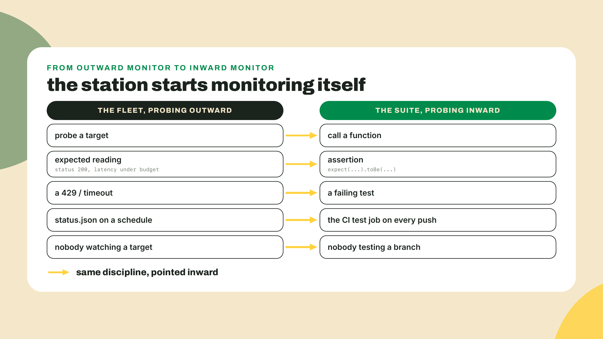
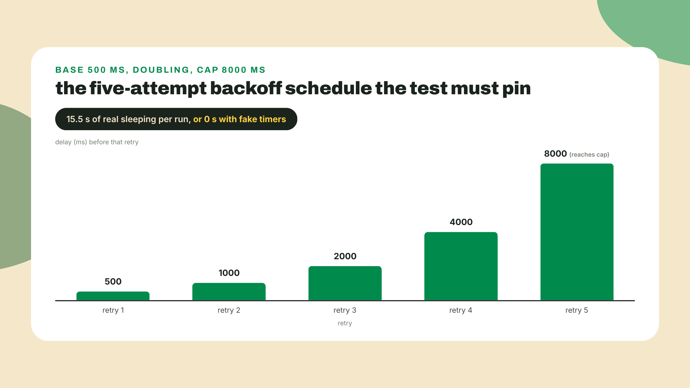
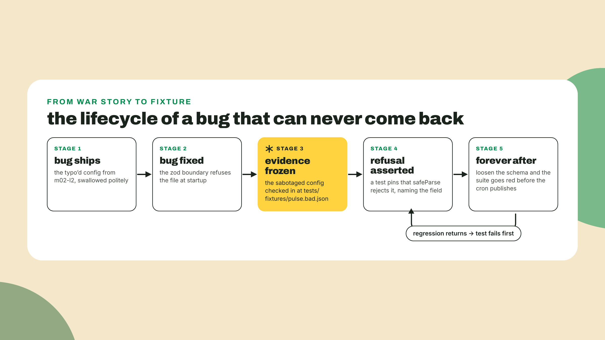
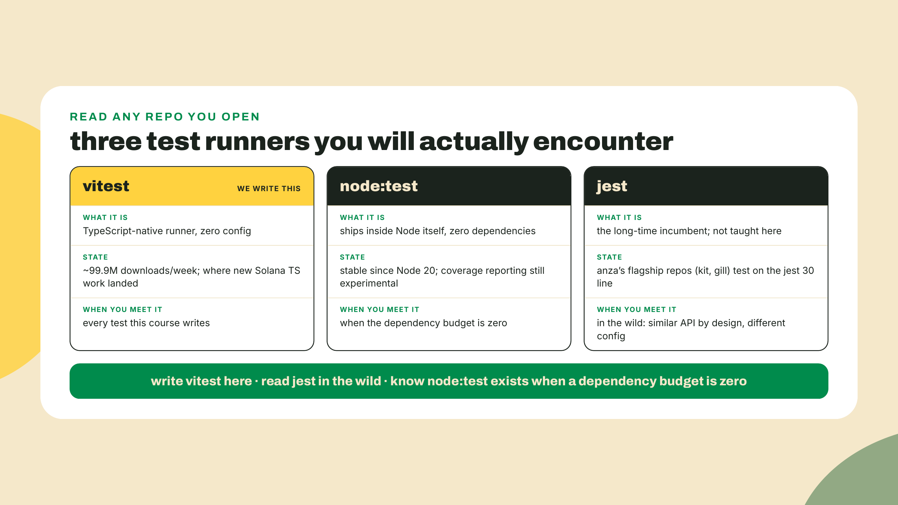
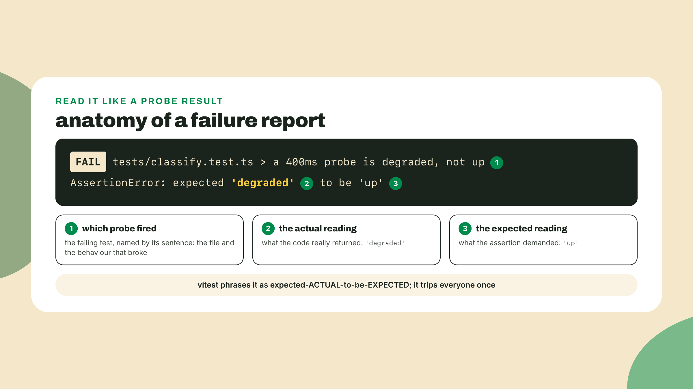
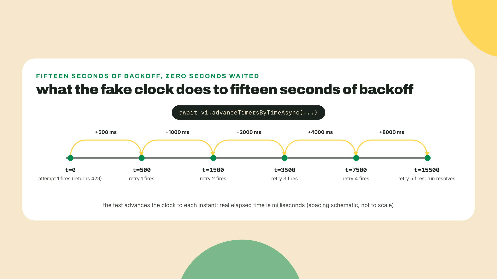
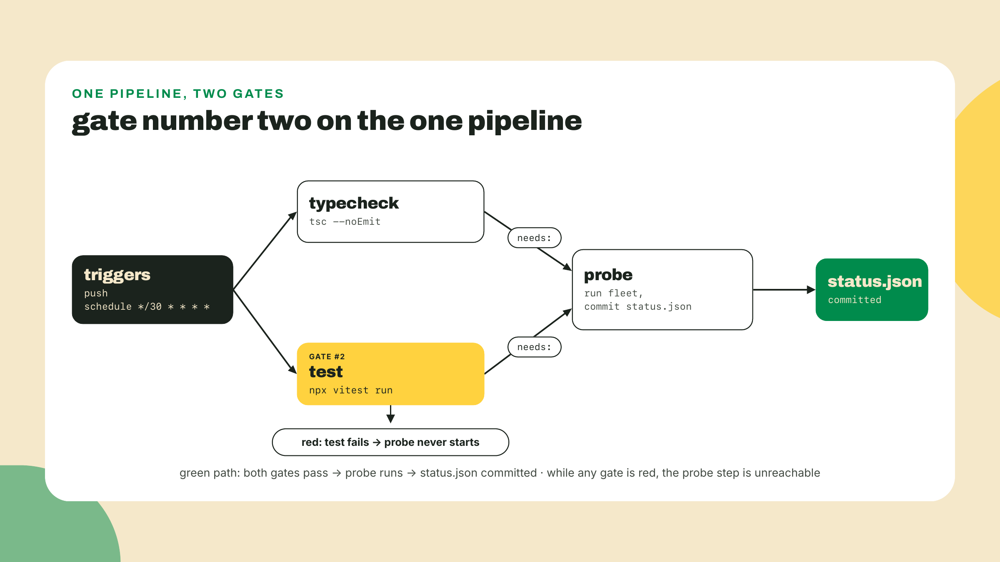

# Tests are probes for your code: vitest

## Summary

The fleet probes fifty targets and publishes what it finds. Nothing probes the fleet. This lesson turns that around: you write a vitest suite that pins the classifier's boundaries as a table, asserts the backoff schedule without waiting a single real millisecond, and locks the m02-l2 config bug out forever, then wires the whole suite into the pulse.yml workflow so a broken classifier can never publish status.json again. Gate #2 on the pipeline, and the station starts monitoring itself.

## First, break something

m02-l3 taught the fleet manners under load: a hand-rolled pool, jittered backoff, AbortController timeouts. Fifty targets probed with zero 429s, every outcome landing typed. The fleet works. Nothing yet proves it keeps working.

That distinction is the whole lesson, so let's make it concrete before any theory. Install the tool:

```bash
npm i -D vitest@4.1.11
```

(Re-probed 2026-09-06, and this is a lesson in dist-tags all by itself: when this lesson was written on 2026-09-02, v5 was still a release candidate and `latest` served the v4 line. Vitest 5.0.0 went GA on 2026-09-03 and took `latest`; the v4 line now lives on its own `V4` tag, at 4.1.11. The pin above is exactly why the install names a version instead of trusting `latest`: every transcript in this lesson is v4's. Start on v5 if you prefer, read its migration notes first, and everything this lesson teaches about tests as a gate still applies. `npm view vitest dist-tags` prints the current map in one line.)

One piece of setup so the probe has a stable target, and it carries a rename you have to make on purpose, because the two classifiers you have written so far both want the same name. Your l1 classifier still lives where that lab left it, called `classifyProbe` and keyed to the union object; m02-l1's challenge graded a different signature under the same name. Move the file to `src/classify.ts` and split the name in two:

- **`classify(result: ProbeResult): Verdict`** — the union form from l1, renamed. It stays, and not for sentiment: it is the only form that can judge a `dns-error`, which carries a hostname and no number, and M3's dashboard will need exactly that.
- **`classifyProbe(kind: string, value: number)`** — the boundary form the challenge graded. It runs `parseProbe` first (unknown kinds come back `'invalid'`), then hands the parsed result to `classify`.

Two exported names, one exhaustive switch underneath: write the boundary form on top of the union form, never beside it, or you have just built the drift this course keeps warning you about inside a single file. Do the rename in one pass and let `npx tsc --noEmit` walk you to every call site, including l1's driver line; that errand is the thing m02-l1 sold you and this is the first time you spend it. These are also the exact names m03-l1's package extraction moves and m03-l2's board imports, so getting them right today is a rename you do not do later. Ten minutes, no new logic, and every test in this lesson imports that one file. (Root `probe.ts` shrinks to a CLI that imports from `./src/classify.js`. One honest wrinkle to notice rather than fix: `src/fleet.ts` keeps the local `ProbeResult` copy it declared in l3, so the repo now holds two structurally identical unions. `src/classify.ts` is the canonical one from today, the duplication is exactly the drift risk M3's package extraction exists to close, and you are allowed to be bothered by it until then.)

Now write one test. Create `tests/classify.test.ts` next to your fleet:

```ts
import { expect, test } from 'vitest';
import { classifyProbe } from '../src/classify.js';

test('a 400ms probe is degraded, not up', () => {
  expect(classifyProbe('ok', 400)).toBe('degraded');
});
```

Run it:

```bash
npx vitest run
```

If your boundary logic is right, you get one green check. If your boundary check says `> 400` where the m02-l1 spec said the degraded band starts AT 400, you just caught the kind of bug the cron would have published every thirty minutes, forever, with a green checkmark next to it. Either way you learned something real in five minutes, which is the entire sales pitch.

Two spellings of that command, and the difference matters all lesson: `npx vitest run` executes the suite once and exits, which is what CI wants. Bare `npx vitest` starts watch mode: it stays alive, re-runs the affected tests every time you save a file, and turns the suite into a live readout while you work. Use watch mode at your desk for the rest of this lab; the `run` form is what goes in the workflow later. And notice we invoke vitest with `npx` everywhere this module, never through a `package.json` `test` script: the npm-init stub in `scripts.test` stays untouched today, deliberately, and m03-l1 wires `"test": "vitest run"` in the moment the workspace's `pnpm -r test` actually needs a script to find.

Here is the collapse that earns this lesson its title: a test suite is an uptime monitor pointed at your own code. You already built the outward-facing version. An assertion is a probe with an expected reading. A failing test is a 429 from your own logic. Same discipline, pointed inward, and you already know the discipline.

## Probes pointed inward

You have been doing "testing" manually since m01-l2: run the fleet, eyeball the output, nod. That works until the code changes while you are not looking at the output, which is what the rest of this course is. Every module from here adds code that other code depends on. The suite is how a careless change to the fleet's output shape gets caught before it breaks the dashboard you will ship in module 3, which reads that shape and nothing else.



vitest is the runner this course uses: it speaks TypeScript natively with zero config, and it finds anything matching `*.test.ts`. Around 99.9 million downloads a week as of this writing, for whatever download counts are worth; not a Solana-ecosystem verdict, though, and this lesson will show you the other camp before it ends. The patterns below are the daily 80%: tables, fake timers, fixtures, coverage. Everything else is bookmarked at the end of this section.

### The table is the spec

Your classifier has a contract, and you already know it by heart because m02-l1's challenge graded you on it: latency under 400 is `up`, 400 through 1000 is `degraded`, above 1000 is `down`, a 429 means the target answered so it is `degraded` not `down`, unknown kinds are `invalid`. Five boundary rules. You could write five separate test functions and repeat the ceremony five times, or you could notice that they are all the same sentence with different numbers:

```ts
import { expect, test } from 'vitest';
import { classifyProbe } from '../src/classify.js';

const rows: Array<[kind: string, value: number, expected: string]> = [
  ['ok', 399, 'up'],
  ['ok', 400, 'degraded'],
  ['ok', 1000, 'degraded'],
  ['ok', 1001, 'down'],
  ['http-error', 429, 'degraded'],
  ['http-error', 500, 'down'],
  ['timeout', 0, 'down'],
  ['gopher', 200, 'invalid'],
];

test.each(rows)('classifyProbe(%s, %d) is %s', (kind, value, expected) => {
  expect(classifyProbe(kind, value)).toBe(expected);
});
```

`test.each` (a table test: one test body, run once per row) turns the contract into data. Read the rows out loud and you are reading the spec. That is the real win, not the saved typing: when m02-l1's challenge added the 429-is-degraded rule, that was one row. When a boundary bug ever surfaces in production, the regression pin is one row. The cheapest tests to extend are the ones most likely to be extended, and a table costs one line per lesson learned.

Notice which rows are here. Not random inputs: the exact values where the behavior changes. 399 and 400. 1000 and 1001. Boundaries are where off-by-one bugs live, so boundaries are where probes point.

A quick word on the assertion itself, because you will reach for it two hundred times this course. `toBe` checks identity: right answer for strings, numbers, booleans, anything the classifier returns. The moment you assert on an object or an array, switch to `toEqual`, which compares structure. `expect({ a: 1 }).toBe({ a: 1 })` fails, two different objects, same shape; `toEqual` passes. That pair covers most of your assertion life. The matcher catalog goes much deeper (`toMatchObject`, `toThrow`, `resolves`, and you will meet `resolves` in step 3), but toBe-for-values and toEqual-for-shapes is the daily reflex worth installing now.

### Fake timers: assert the schedule, skip the waiting

The backoff schedule from m02-l3 is a contract too: attempt n waits `min(capMs, baseMs * 2^n)`. With a 500ms base, an 8000ms cap, and five retries, that is 500, 1000, 2000, 4000, 8000. (The lab fleet ran a 5000ms cap; the test raises it to 8000 so every delay exercises the doubling before the clamp.) Test it with real timers and every run of the suite spends fifteen real seconds sleeping, which means you stop running the suite, which means you no longer have a suite.



`vi.useFakeTimers()` (vitest's clock replacement: it intercepts `setTimeout` and friends so scheduled callbacks fire when YOU advance the clock, not when the wall clock does) is built for exactly this shape of code. The key mental model, and the one the quiz will poke at: fake timers do not shrink the delays. The scheduled times keep their exact values. You jump the clock to each scheduled instant and assert what fired. That precision is why the test can pin the schedule value by value instead of asserting "roughly five waits happened".

The pattern, on a toy first:

```ts
import { afterEach, beforeEach, expect, test, vi } from 'vitest';

beforeEach(() => {
  vi.useFakeTimers();
});
afterEach(() => {
  vi.useRealTimers();
});

test('the callback fires at 500ms, not before', async () => {
  const fired = vi.fn();
  setTimeout(fired, 500);

  await vi.advanceTimersByTimeAsync(499);
  expect(fired).not.toHaveBeenCalled();

  await vi.advanceTimersByTimeAsync(1);
  expect(fired).toHaveBeenCalledTimes(1);
});
```

`vi.fn()` is a spy: a fake function that records how it was called. `advanceTimersByTimeAsync` moves the fake clock and lets any promises that were waiting on those timers settle. The 499-then-1 dance is the same boundary discipline as the table: assert nothing happens one millisecond early, then assert it happens exactly on time. You will do this against the real retry loop in the lab.

One footgun before you meet it: fake timers only help if the code under test is pure enough to be driven. Your classifier and your backoff formula take values and return values; they never touch the network. That was a design decision m02-l1 and m02-l3 made before you knew why, and this is why. Probing real URLs inside unit tests makes the suite flaky, slow, and rate-limited, and you already know exactly how the target feels about bursts. The M4 Rust engine will make the same keep-the-core-pure move on purpose, and we will say so again there.

### Fixtures: the bug that can never come back

In m02-l2 you typo'd one config field, `intervalSeconds` where the code reads `intervalSecs`, and traced how the unparsed version of the fleet would swallow it politely. Then you built the zod boundary and watched the same file die at startup with a field-level error. That typo'd file is about to get a promotion: from war story to fixture (a checked-in input file that tests load; frozen evidence, replayed forever).

The move is small and it is one of the highest-value habits in this lesson: every bug you fix becomes a test that fails if the bug returns. In the lab you will re-commit that crime against the fleet's CURRENT schema (m02-l3 reshaped the config for the concurrent fleet, so the original file is a schema out of date), park the sabotaged copy in `tests/fixtures/`, and assert that `safeParse` REFUSES it. Not "the fleet seems fine". Refusal, asserted, by name. If anyone ever loosens the schema and the polite lie becomes representable again, the suite goes red before the cron can publish a single wrong line.



### Coverage: signal, not idol

Run a suite with coverage and you get a percentage: how many lines of your source executed while the tests ran. Useful question to ask, terrible number to worship, and you need both halves of that sentence.

The useful half: an uncovered branch is a probe target nobody is watching. Your classifier has arms for `timeout`, for `http-error`, for unknown kinds. If coverage shows the `timeout` arm never ran, no test in the suite would notice if it started returning `up`. That is exactly the outward-monitoring instinct you already have: a target with no probe pointed at it can be down for a week without anyone knowing. Read the coverage report the way you read the fleet's target list, looking for the gap that matters.

The idol half: 100% line coverage proves every line RAN under some test. It proves nothing about whether the assertions on those lines would catch a wrong answer. A suite that calls every function and asserts nothing scores perfectly. And the last uncovered branches are often unreachable on purpose: your `assertNever` arm exists precisely so it CANNOT run, and chasing a number that penalizes it means deleting your own safety rail to please a metric. Coverage flags what to look at. Humans decide what matters.

### The ecosystem, named honestly

One beat each, because you will meet all three in the wild:



`node:test` is the zero-dependency sidebar: a real test runner that ships inside Node itself, stable since Node 20, no install at all. Its coverage story is still experimental, which is why it is the sidebar and not the lesson. Worth knowing it exists; some small tools genuinely need nothing more.

jest is the incumbent, and honesty matters more than tribal loyalty here: you will meet the jest 30 line in anza's repos, kit and gill both test with it. The APIs are similar by design, so reading their tests will feel familiar. The configs are not similar, which is the footgun: copying jest config from a wild repo into a vitest project produces mysterious failures, because the resemblance is in the test files, not the plumbing.

If the decade-scale of ecosystems surprises you, it shouldn't by now: Express 5 followed Express 4 after ten years (2014-04-09 to 2024-09-10), and the ecosystem ran the old major happily the whole time. Testing is the same story. You learn the current tool and you read the incumbent, because the wild runs both, and "read the wild" is a skill this course keeps buying you on purpose.

### The honest part

Tests are code you must also maintain, and pretending otherwise is how teams end up hating their suites. Every classifier change now breaks table rows. The backoff test pins delays so tightly that intentionally retuning the schedule means editing tests, which is mildly annoying exactly when you are in a hurry. The CI gate you are about to build adds minutes between merge and publish. All of that friction is the point: friction on the path to publishing a lie is the product.

But name where it inverts, because it does. Over-specified tests, the kind that assert incidental log strings or reach into private internals, make every refactor expensive while catching no real bugs: the test breaks on every reword and never on a logic error. And a coverage TARGET, "we require 95%", chases lines instead of risk and gets you tests that execute code without checking it. The compass for both: test the contract, not the implementation; gate the publish, not every keystroke.

**Go deeper (the 20%).** the daily patterns above are what the fleet needs; the rest of vitest is a deep toolbox you should raid on demand, not memorize. The [vitest guide](https://vitest.dev/guide/) (verified live 2026-09-02) covers what we deliberately bookmarked: the mocking taxonomy (mocks, spies, module mocks), snapshot testing, and browser mode. Sidebar for the zero-dependency path: the [node:test docs](https://nodejs.org/api/test.html). Nothing in the lab below depends on the bookmarked material.

## Lab: the suite, then the gate

The M2 training-wheel schedule closes out in this lab, and here is the fade, out loud: the table tests we build together line by line, the fake-timer test and the config test you complete from given setups, and the CI wiring is worked again BUT you drive every push. Next module the scaffolds start thinning for real.

### 1. The first failing test, on purpose

You wrote `tests/classify.test.ts` in the opener. Now make it lie to you deliberately, because you should never trust a test you have not seen fail. Flip the expectation:

```ts
expect(classifyProbe('ok', 400)).toBe('up'); // wrong on purpose
```

```bash
npx vitest run
```

```
 FAIL  tests/classify.test.ts > a 400ms probe is degraded, not up
AssertionError: expected 'degraded' to be 'up'
```

Read that failure the way you read a probe result: expected reading, actual reading, delta. Flip the expectation back to `'degraded'`, watch it go green. That red-then-green rhythm is the trust loop, and you will run it on the whole pipeline at the end of this lab.



### 2. The classifier table, row by row

Replace the single test with the `test.each` table from the theory section, all eight rows. Build it in this order and watch what each addition buys: the four `ok` rows first (both sides of both latency boundaries), run it, green. The two `http-error` rows (429 versus 500, the rule the challenge graded), run it, green. Then `timeout` and the unknown kind. Eight rows, eight green checks, and the contract you have been carrying in your head since m02-l1 now lives somewhere the compiler and the runner can both reach.

### 3. The backoff test (you write the clock)

Setup given, assertions yours. One extraction first: m02-l3 left the retry loop inline in `probeWithRetry`, with `Math.random()` baked into the jitter line, and a schedule with a random term in it cannot be pinned. Pull the loop into `src/backoff.ts` as `retryOn429(fn, { baseMs, capMs, retries, jitter, isRetryable })`: deterministic base curve in the code, and both judgment calls injected at the call site. The jitter injection you expected; the `isRetryable` predicate is the one that makes the extraction possible at all, because the helper is generic over whatever `fn` returns and cannot know what "busy" looks like for it. The fleet passes the equal-jitter function plus `isRetryable: (r) => r.kind === 'http-error' && r.status === 429`, mapping its config's `maxRetries` onto the option's shorter `retries` spelling at the call (the config name lives at the parse boundary; the helper is free to spell its options its own way). The test passes `jitter: () => 0`, a toy `fn` that answers the string `'429'`, and a matching one-line predicate, then pins exact values. Point `probeWithRetry` at the new helper, confirm the fleet still runs, then come back. Here is the harness:

```ts
import { afterEach, beforeEach, expect, test, vi } from 'vitest';
import { retryOn429 } from '../src/backoff.js';

beforeEach(() => {
  vi.useFakeTimers();
});
afterEach(() => {
  vi.useRealTimers();
});

test('five retries wait exactly 500, 1000, 2000, 4000, 8000 ms', async () => {
  const alwaysBusy = vi.fn(async () => '429' as const);
  const run = retryOn429(alwaysBusy, {
    baseMs: 500,
    capMs: 8000,
    retries: 5,
    jitter: () => 0,
    isRetryable: (r) => r === '429',
  });

  await vi.advanceTimersByTimeAsync(0); // flush the first attempt
  expect(alwaysBusy).toHaveBeenCalledTimes(1);

  // YOUR TURN from here: advance to one ms BEFORE the first retry,
  // assert nothing fired, then land each retry on its exact instant.
  await vi.advanceTimersByTimeAsync(499);
  expect(alwaysBusy).toHaveBeenCalledTimes(1);

  await vi.advanceTimersByTimeAsync(1); // t = 500
  expect(alwaysBusy).toHaveBeenCalledTimes(2);

  // ... continue: t = 1500, 3500, 7500, 15500 ...

  await expect(run).resolves.toBe('429');
});
```

(If your m02-l3 file spells the helper differently, keep your names. The test pins behavior, not spelling.)

Work out the remaining clock advances yourself before running: each retry lands at the previous instant plus the next delay in the schedule, so 500, then 1500, then 3500, then 7500, then 15500. Six calls total: the first attempt plus five retries. When your assertions land green, look at the run time vitest reports for the file. Milliseconds. You just verified fifteen and a half seconds of scheduled behavior without waiting for any of it.



### 4. The config boundary test (the fixture earns its keep)

Recreate m02-l2's crime against the fleet's current schema: take your good `pulse.config.json`, rename one required field, `timeoutMillis` for `timeoutMs`, and save the sabotaged copy as `tests/fixtures/pulse.bad.json`. It is the same typo class as the `intervalSeconds` original; the schema has since been rebuilt for the concurrent fleet, so the pin targets a field it still owns. Setup given, assertion yours:

```ts
import { readFileSync } from 'node:fs';
import { expect, test } from 'vitest';
import { configSchema } from '../src/config.js';

test('the m02-l2 typo class is refused at the boundary', () => {
  const raw = JSON.parse(
    readFileSync(new URL('./fixtures/pulse.bad.json', import.meta.url), 'utf8'),
  );

  const result = configSchema.safeParse(raw);

  expect(result.success).toBe(false);
  if (!result.success) {
    const paths = result.error.issues.map((issue) => issue.path.join('.'));
    expect(paths.join('\n')).toContain('timeoutMs');
  }
});
```

Two assertions, two different guarantees. The first says the schema refuses the file at all. The second says the refusal NAMES the missing field, because a boundary that fails without saying where is barely better than one that lies. This is the regression pin: the polite lie from m02-l2 now cannot return without this test going red first.

Add the mirror test yourself before moving on: a second fixture, `pulse.good.json` (a copy of your real config), and a test asserting `safeParse` ACCEPTS it, `expect(result.success).toBe(true)`. It feels redundant today. It stops feeling redundant the first time someone tightens a refinement and accidentally locks the production config out; a boundary that rejects everything is just as broken as one that admits everything, and now both directions have a probe.

I will confess the origin of my enthusiasm here: I once ran a monitor for months with a classifier boundary bug almost identical to the one in step 1, and found it not through any alarm but by idly reading the raw log on a Sunday. Every report it had published in that window was subtly wrong, and every one had shipped with a green deploy next to it. Cost me nothing but trust, which is the expensive thing. The fixture habit is what I do about that memory.

### 5. Read the coverage, fix one gap

```bash
npm i -D @vitest/coverage-v8@4.1.11
npx vitest run --coverage
```

(The coverage package versions in lockstep with vitest itself; keep the two pinned together.)

Read the report like a target list, not a scoreboard. Look at `src/classify.ts` first, and one toolchain honesty note before you go hunting: on the current pins (vitest 4.1.11 with coverage-v8 4.1.11 on Node 24), `src/backoff.ts` may simply not appear in the coverage table at all, even when its test file runs, so if the row is missing, that is the tool's reporting gap, not proof of perfect or zero coverage, and `src/classify.ts` is where to spend the exercise. Somewhere in your fleet there is a branch the suite never executes; in most builds of this project it is an error-mapping arm (the `dns-error` classifier arm is a common find) or, if your table does show backoff, the cap-below-base edge of the formula, the case where `capMs` is smaller than `baseMs` and every delay clamps flat. Find YOUR gap, ask whether a bug there would reach status.json, and if yes, add the row or the case that covers it. If the uncovered line is your `assertNever` arm, leave it uncovered and enjoy the reminder of why the number is a signal and not a goal.

### 6. The re-ship: tests gate the cron

Now the module's seam: the suite joins the pipeline you built in m01-l3, and this workflow is the one artifact this course grows all the way to the capstone. Rust gates join it in M4, release builds later still. Today it learns to refuse.

Open `.github/workflows/pulse.yml`. You are adding one job and one edge:

```yaml
name: pulse

on:
  push:
    branches: [main]
  schedule:
    - cron: "*/30 * * * *"

permissions:
  contents: write

jobs:
  typecheck:
    runs-on: ubuntu-latest
    steps:
      - uses: actions/checkout@v7
      - uses: actions/setup-node@v7
        with:
          node-version: 24
      - run: npm ci
      - run: npx tsc --noEmit

  test: # NEW: the suite as a job
    runs-on: ubuntu-latest
    steps:
      - uses: actions/checkout@v7
      - uses: actions/setup-node@v7
        with:
          node-version: 24
      - run: npm ci
      - run: npx vitest run

  probe:
    needs: [typecheck, test] # CHANGED: was `needs: typecheck`
    runs-on: ubuntu-latest
    steps:
      # your existing probe-and-commit steps, unchanged
```

(Action tags `checkout@v7` and `setup-node@v7` probed as the current majors on 2026-09-02; Node 24 is the Active LTS as of this writing, with v26 scheduled to take over on 2026-10-28.)

The load-bearing line is `needs: [typecheck, test]` (the `needs:` key declares job dependencies: `probe` will not start unless every job it names has succeeded). Without that edge, the test job runs BESIDE the probe and gates nothing; a red suite and a fresh status.json commit would land in the same run, which is a decoration, not a gate. The diff is the lesson. Read it.



Now prove the gate exists, red first, because step 1 taught you to never trust an untested check. Plant the classifier bug on purpose: flip your 400 boundary to `> 400` in `src/classify.ts`, commit to a branch, merge it (or push straight to main; it is your station, and this is the one honest occasion to break main deliberately). Watch the Actions run: the test job goes red on the `classifyProbe(ok, 400) is degraded` row, and the probe job shows as skipped. Open the repo: status.json has no new commit. The pipeline refused to publish the lie. Take the screenshot; this red run is the acceptance evidence, and honestly it is a satisfying artifact to keep.

Then revert the planted bug, push, and watch the green sequence: typecheck passes, test passes, probe runs, status.json updates. One more thing you now know that most people never check: because scheduled workflows run the latest commit on the default branch, the NEXT cron tick after a red merge would have run the same red suite and refused again, every thirty minutes, until someone fixed it. An ungated red merge becomes a wrong status.json on schedule with nobody watching. A gated one becomes a stalled publish and a red X someone will see. Stalled beats lying. That is the whole design.

Now the honest footnote on what exactly got gated, because a module that spent four lessons on truthful types should not be vague about its own publish path. The job named `probe` still runs the original `fleet.ts` writer from m01-l3, untouched: v0 shape, `latencyMs` still typed loosely, still the only thing that writes `status.json`. Everything you retyped in l1 and rebuilt concurrently in l3 lives beside it, and what the two gates protect is that code. That is deliberate, not an oversight: `status.json`'s `{ url, status, latencyMs, checkedAt }` shape is a frozen contract that m03-l2's dashboard is about to render, and swapping the publisher underneath a consumer that does not exist yet is how you break both at once. The writer gets rewired in m03-l2, on the far side of the workspace move, as that lesson's first lab move, once there is a dashboard schema on screen to keep green while you do it.

Verify locally and remotely before moving on: `npx vitest run` green on your machine, and the pushed commit's Actions run showing the test job completing before the probe step starts.

## Challenge

No graded challenge this lesson; the module's strongest live on l1 and l3, and test-writing is proven by the suite the lab just gated. Instead, an unguided rep with real stakes: plant a DIFFERENT bug, one the current suite does NOT catch. Break the jitter call site, or make the config schema accept a negative `timeoutMs`, and confirm the pipeline stays green all the way to a published status.json. Sit with how that feels. Then write the test that would have caught it, watch it fail against the planted bug, revert the bug, watch it pass, and leave the test in. You have just done the full professional loop: find the unwatched target, point a probe at it, keep the probe. Repeat forever, at every job you ever hold.

## Where this leaves the station

The 30-second win before you close the terminal: in one sentence, why must the test job gate the CRON specifically, not just run on pushes? Say it out loud. If your sentence contains "default branch", "on a schedule", and "wrong status.json with nobody watching", you have the whole lesson. And the promise made forward, verbatim so you recognize it when it lands: in M4 you'll meet cargo test. Same idea, different flag.

If the suite caught a real bug of yours today, even a planted-adjacent one, I genuinely want to hear about it; that first save is the moment this habit stops being homework.

The fleet is typed, parsed, disciplined, and self-monitoring, and it all lives in one growing file tree that only you can use. Next module the engine becomes a real package: workspaces, package.json as a contract, a React dashboard, and the first URL a stranger can open. The training wheels come off at the workspace door.
