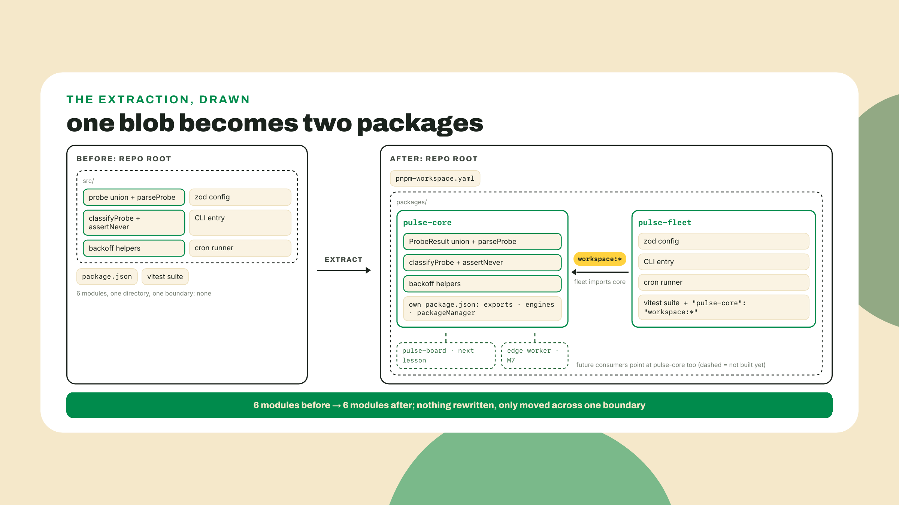
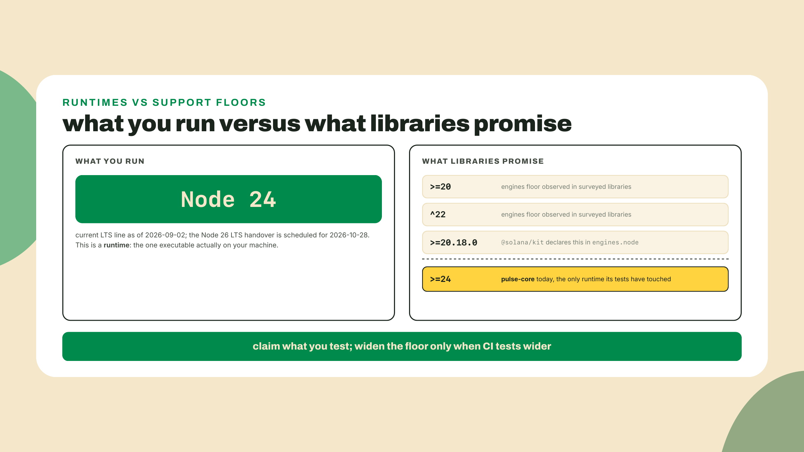
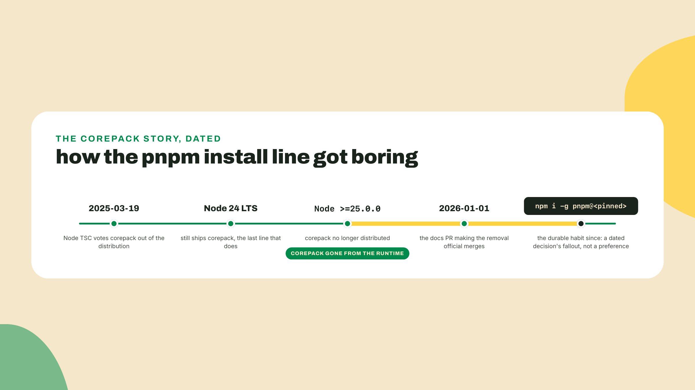
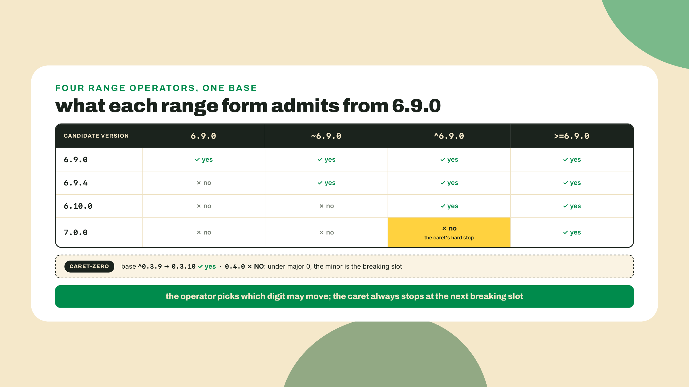
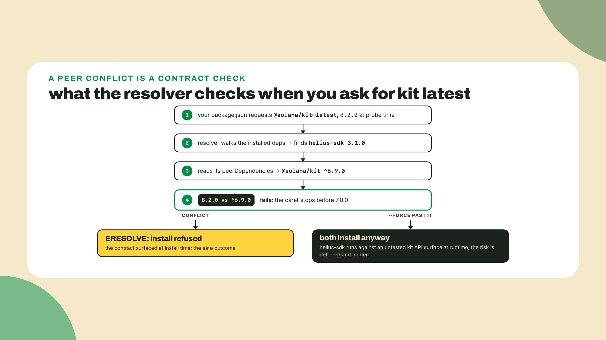
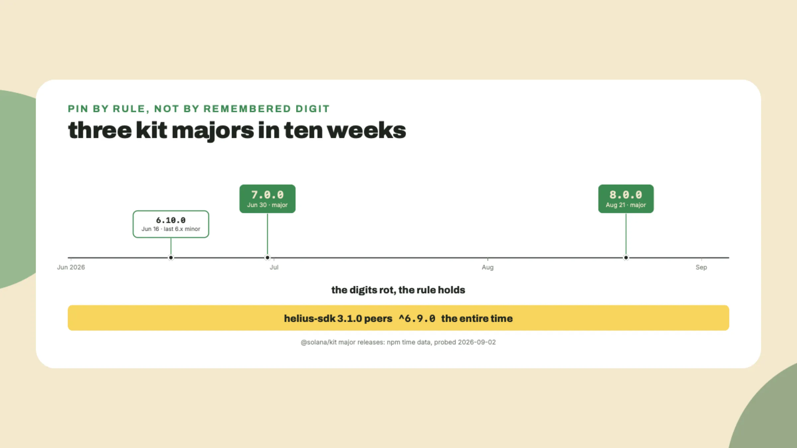
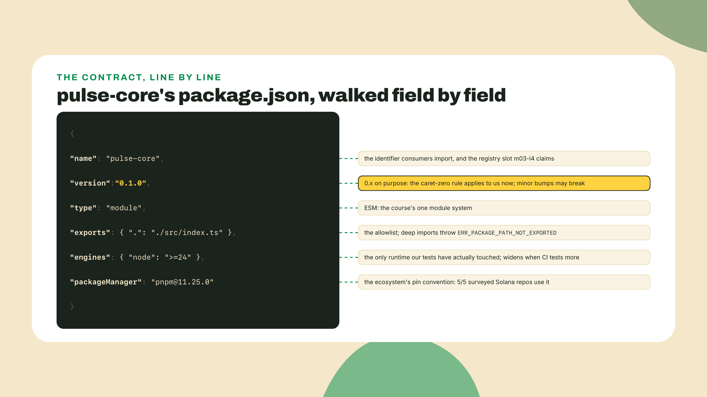
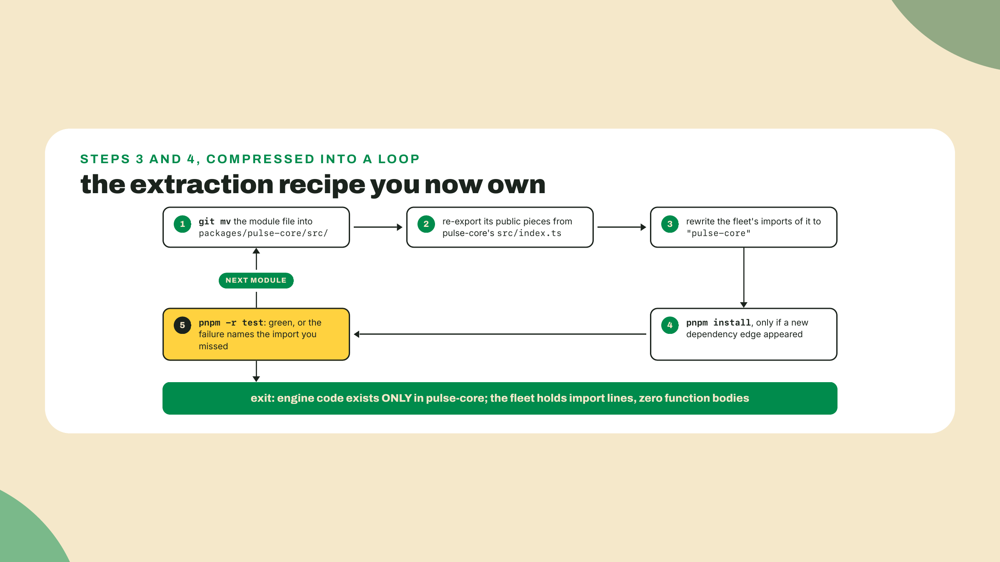

# package.json is a contract: workspaces, engines, peers

M2 closed with a tested fleet: typed probe results, zod'd config, disciplined concurrency, and a vitest suite gating the Actions cron before it probes. The fleet works. It is also one undifferentiated blob of code, and in three lessons part of it ships to npm, where every consumer's machine gets to enforce promises you haven't consciously made yet.

So before any theory, break one of those promises on purpose. Open the fleet's `package.json` and add an engines clause claiming a Node major that does not exist:

```json
{
  "engines": {
    "node": ">=99"
  }
}
```

Now run a fresh install with engine checking turned on (npm only warns by default; the flag makes it enforce):

```bash
rm -rf node_modules
npm install --engine-strict
```

```
npm error code EBADENGINE
npm error engine Unsupported engine
npm error engine Not compatible with your version of node/npm: pulse-station@1.0.0
npm error notsup Not compatible with your version of node/npm: pulse-station@1.0.0
npm error notsup Required: {"node":">=99"}
npm error notsup Actual:   {"node":"v24.20.0","npm":"11.19.0"}
```

(Transcript from npm 11.19; the package name is the one `npm init -y` took from your `pulse-station` directory back in m01-l2, your digits will differ, and older npm spells the `notsup` label out longer.) Read that like a working dev. `Required` is what your package.json claims; `Actual` is the machine it landed on; the install refused because a written promise and a real environment disagreed. Not an error message, a contract clause firing, and every field we cover today fires exactly like this on somebody's machine, eventually. Revert the sabotage and reinstall before moving on.

## Summary

The findings up front:

- `package.json` is a contract with machines and consumers you will never meet: `exports` promises an API surface, `engines` a runtime range, `packageManager` pins the tool, dependency ranges pick which futures you accept, `peerDependencies` names what the CONSUMER must provide.
- You will extract the fleet's engine (the `ProbeResult` union, `classifyProbe`, the backoff helpers) into `pulse-core`, a pnpm workspace package, with the m02-l4 suite green before and after: structure changes, behavior does not.
- The extraction earns its ceremony because the second consumer is real, not speculative: next lesson a React dashboard imports the classifier, and in M7 an edge worker imports the pure core.
- The live peer artifact: `helius-sdk` 3.1.0 peers `@solana/kit ^6.9.0` while kit's latest sits at 8.2.0 (both probed 2026-09-02). Install them together and npm refuses. The durable rule, paid off in M8: pin what your deps peer against, per workspace, never a memorized digit.
- Autonomy fades on schedule: I drive the first extraction move diff by diff, you move the remaining modules from the same recipe, and the peer-conflict diagnosis plus the coding challenge are yours alone.

## The contract, clause by clause

Here is the collapse that makes the whole file make sense: a package is a promise about environments you'll never see. Your code will run on a laptop you never touched, a Node you never installed, next to versions you never chose, imported by a person you will never meet. `package.json` writes down which of those futures you promise to survive; every field below is one clause, and the opening sabotage already showed you enforcement.

### Why extract now: the second consumer test

Everything in the fleet lives in one `src/`. The classifier that decides "up" versus "degraded", the union type that makes wrong states unrepresentable, the backoff math that keeps the fleet polite: all of it sits next to the CLI wiring and the cron entry point. That was correct. One consumer, one blob, zero ceremony.

I have been on the other side of this, big time: two repos, each with its own pasted copy of the same classification function, and the week one copy got a boundary fix the other did not, our dashboards disagreed about whether production was healthy. Nobody noticed for days because both copies were green in their own tests. Copies drift. That is the entire argument.

The honest rule is not "always extract". A package boundary costs ceremony: two `package.json` files to keep truthful, an exports map to maintain, every refactor asking "is this API public?" Copy-paste has none of those costs, right up until the second consumer appears. So: extract when the second consumer is REAL. Ours is scheduled: next lesson the dashboard renders `status.json` with the same classifier the fleet publishes with, and if the two disagree about "degraded", the board lies to human eyes. M7's edge worker makes three. The extraction happens now because the drift window opens now.



The shape we use is deliberately small, and it has a name worth coining once: monorepo-lite. One repo, a `packages/` directory, a two-line workspace file, and nothing else. No Nx, no turborepo, no task graph. Those tools solve build orchestration for dozens of packages; we have two. Reaching for them here would be adopting a freight train to cross the street. When your workspace grows past the point where `pnpm -r` feels slow, you will know, and the tools will still be there.

### The workspace and the protocol

The wiring is two files. First, `pnpm-workspace.yaml` at the repo root tells pnpm where packages live:

```yaml
packages:
  - "packages/*"
```

Second, the consumer declares its dependency using the workspace protocol:

```json
{
  "dependencies": {
    "pulse-core": "workspace:*"
  }
}
```

`workspace:*` means: resolve this from the workspace, never from the registry, whatever version it currently is. On install, pnpm symlinks `packages/pulse-core` into the fleet's `node_modules`, so the import line in fleet code reads exactly like any third-party dependency:

```ts
import { classifyProbe, type ProbeResult } from "pulse-core";
```

Honestly, this link is a godsend. Edit a file in `pulse-core`, and the fleet sees the change instantly, no publish, no version bump, no reinstall. You get the package boundary's discipline with none of the registry's round trips. At publish time, `pnpm publish` rewrites `workspace:*` into a real version range, so the ergonomics stay local and the published artifact stays honest. One caveat that becomes load-bearing in m03-l4, the module's victory lap: plain `npm publish` performs no such rewrite, and that lesson publishes with npm; it gets away with it only because pulse-core ships zero runtime dependencies, so no `workspace:*` line exists to leak into the registry. Publish a package that depends on a workspace sibling, and the pnpm spelling stops being optional.

Fair question before we commit: npm has workspaces too, so why pnpm? Two honest reasons. The ecosystem chose: every serious Solana TypeScript repo you will read is a pnpm workspace, and reading the wild fluently is a stated goal here. And pnpm's stricter layout (packages only see what they declare, not whatever got hoisted within reach) means a missing dependency line fails on your machine today instead of on a consumer's machine after publish; for a package headed to npm in three lessons, that strictness is a feature pointed at ourselves.

One house note, stated plainly so it never reads as sloppiness: this course's lab install lines standardize on `npm i`, because our verification toolchain harvests and replays them. pnpm is what the Solana TypeScript ecosystem actually runs, so this lesson teaches it as ecosystem truth and uses it where the workspace demands it (`workspace:*` and `pnpm -r` are pnpm idioms). You are learning both spellings on purpose: npm literacy for anywhere, pnpm fluency for the repos you will actually read.

### exports: the public API boundary made literal

Before the exports map existed in practice, "public API" was a comment and a hope. Anyone could reach into your package's guts with `import { thing } from "pulse-core/src/classify"` and now your internal file layout is load-bearing for strangers. Rename a file, break the world.

The `exports` field forbids exactly this. It is an allowlist of entry points; anything not listed does not resolve, full stop:

```json
{
  "exports": {
    ".": "./src/index.ts"
  }
}
```

With that map, `import ... from "pulse-core"` works and `import ... from "pulse-core/src/classify"` throws `ERR_PACKAGE_PATH_NOT_EXPORTED`. Your public surface is now one file you curate, `src/index.ts`, re-exporting exactly what consumers may touch. Everything else is private by mechanism instead of by etiquette. We export TypeScript source for now because every consumer in this workspace speaks TypeScript; the publish lesson adds a build step and points this map at compiled output, and nothing about the boundary changes.

### engines, packageManager, and the runtime you actually run

`engines` declares which runtimes you claim to support. The verb matters: claim. Nothing tests your code on Node 20 because you typed `>=20`. The wild shows the gap: the ecosystem runs Node 24 (current LTS as of 2026-09-02; the Node 26 handover lands 2026-10-28), while surveyed library floors sit at `>=20` or `^22`, because maintainers keep supporting runtimes their users have not left yet. `@solana/kit` itself declares `engines.node >=20.18.0` while its maintainers certainly develop on newer.

Why do the floors trail the runtime by two LTS lines? Because an engines field is the intersection of every environment a package's users still deploy to. A team on a Node 20 base image reads `>=20` as "this will not strand us"; a whim-bump cuts those teams off from fixes for no technical reason. The floor moves when the code needs a newer API or the old line leaves LTS, not before. kit's `>=20.18.0` says "we still carry the fleet that has not migrated", a deliberate, costly kindness.



For `pulse-core` the honest claim is the narrow one: `"node": ">=24"`, because Node 24 is the only runtime our tests have touched. Widening to `>=20` without testing on 20 would be decorating the contract with a promise nobody verified. When CI grows a version matrix (that thread continues in M6), the claim can widen to match the evidence.

`packageManager` is a different kind of pin: not which runtime, but which package manager and exactly which version, hash-pinnable, tool-readable:

```json
{
  "packageManager": "pnpm@11.25.0"
}
```

This field is the ecosystem's real convention. In the research survey behind this course, 5 of 5 surveyed Solana TypeScript repos pin pnpm via `packageManager`, and kit goes further: its repo blocks `npm install` and `yarn` outright with a preinstall guard whose name says everything, "please-use-pnpm". Copy this course's `npm i` lab lines into a repo like that and it will refuse you. Read the `packageManager` field first; the repo tells you its rules.

Now the install-path honesty beat, because it changed recently and most tutorials have not caught up. The tool that historically auto-activated the right pnpm from this field was corepack, shipped inside Node; on 2025-03-19 Node's TSC voted it out (gone from Node 25+, remaining only in Node 24 LTS). The runtime decided package managers are not its job, so the durable install line is the boring one:

```bash
npm i -g pnpm@11.25.0
```

Pinned, explicit, works on every Node that has npm, which is all of them. (Version freshness, and the answer changed while this course was being written: 11.25.0 held the `latest` dist-tag on 2026-09-02, but pnpm 12 took it on 2026-09-04, and a re-check on 2026-09-06 reads `latest` = 12.3.4 with the 11 line surviving under `latest-11` at 11.26.0. The course keeps pinning 11.25.0 anyway, on purpose: this digit has to match the `packageManager` field below, the CI job in step 7, and M6's Dockerfile, and `npm i -g pnpm@11.25.0` installs it no matter where `latest` has wandered. That is what a pin is for. For a repo of your own, run `npm view pnpm dist-tags` and choose deliberately.) `corepack enable` still works on your Node 24 laptop today and dies on the next base image; a habit with an expiry date is a bad habit, and M6's Dockerfile will use the npm line for exactly this reason.



### Semver ranges: which futures you accept

Every dependency line in `package.json` is a range, and a range is a policy about the future: which versions, published after you stopped looking, is the resolver allowed to hand you? Four forms cover real usage.

**Exact** (`6.9.0`): this version and nothing else. Maximum protection, zero fixes.

**Caret** (`^6.9.0`): at or above the base, inside the same major. `6.9.1`, `6.10.0`, `6.44.0` all satisfy it; `7.0.0` never does. The caret trusts semver's core promise, that breaking changes only ship behind a major bump, so it stops exactly at the boundary where breakage is allowed to live. This is the form npm writes by default, and the form you will read most.

**Tilde** (`~6.9.0`): at or above the base, same major AND same minor. Patch walks only: `6.9.4` yes, `6.10.0` no. The tighter trust for when you want fixes but not features.

**Floor** (`>=6.9.0`): anything at or above, majors included. Almost never what an app wants, because it accepts futures semver explicitly refuses to vouch for. It shows up in `engines` (where "this runtime or newer" is the actual intent) far more than in dependencies.

Notice which of these you actually author. Almost none: `npm i some-dep` and `pnpm add some-dep` write a caret range for you, so most dependency lines in most repos are a policy their author never consciously chose. The default is defensible (fixes flow, majors blocked), but teams that want exact pins flip it deliberately with `npm config set save-exact true` and lean on the lockfile plus an update tool. Either stance is coherent; drifting into one because a tool wrote it for you is the only wrong option.

And the trap inside the caret, worth its own paragraph because reading `^` as "roughly this version" will eventually hurt you: under major zero, the minor becomes the breaking slot. `^0.3.9` admits `0.3.10` and refuses `0.4.0`, because pre-1.0 packages reserve minor bumps for breaking changes and the caret respects that. `^0.3.9` and `^1.3.9` look like siblings and admit completely different futures. The rule has one more floor below that: with major AND minor both zero, npm treats the patch as the breaking slot, so `^0.0.3` admits `0.0.3` and nothing else. The `@solana-program/*` packages you will meet in M8 live in 0.x land, so this rule is not trivia.



Name the trade-off before moving on, because ranges are policy and every policy costs something. Tight pins protect you from surprise majors and starve you of fixes; wide ranges deliver fixes and occasionally deliver a Tuesday-morning breakage you did not schedule. Either way the range in `package.json` is only half the story: the lockfile records the exact resolution your install actually produced, and it is the real pin in both worlds. That thread, and what CI should do with it, is picked up properly in m09-l1.

### peerDependencies: the deepest clause

Regular dependencies say "I need this, install it for me." Peer dependencies say something stranger and stronger: "I work alongside a dependency YOU provide, in THIS range." A library that peers on `@solana/kit` is telling you it will call kit's APIs at runtime but refuses to own which kit instance exists in your app, because there must be exactly one and it must be yours.

Why refuse ownership at all? Suppose helius-sdk declared kit as a regular dependency. Your app installs its own kit, helius-sdk a second private one, and every value crossing between them (an rpc object, an address type) was built by one copy and inspected by the other; identity checks fall apart with the least helpful errors in the ecosystem, because the object IS valid, just from the wrong copy. The peer declaration says "we must share the one instance"; the range says which instances it has actually been tested sharing.

Here is the live artifact, probed 2026-09-02, not from memory:

```bash
npm view helius-sdk version peerDependencies
```

```
3.1.0
{
  '@solana-program/compute-budget': '^0.15.0',
  '@solana-program/stake': '^0.6.1',
  '@solana-program/system': '^0.12.0',
  '@solana-program/token': '^0.13.0',
  '@solana/kit': '^6.9.0'
}
```

Meanwhile `@solana/kit`'s latest sits at 8.2.0, two majors ahead of that `^6.9.0` peer range. Install `helius-sdk` and then ask for kit latest in the same package, and npm's resolver refuses with an `ERESOLVE` error. The lab triggers this on purpose, because the refusal protects something real: helius-sdk calls kit APIs from the 6.x line it was tested against, and forcing kit 8 next to it just runs a library against an API surface it has never seen, moving the failure from install time (loud) to runtime (quiet, in production).



So what do you actually pin? Not the newest everything, and not a digit somebody memorized. The rule, and it is the single most durable sentence in this lesson: **pin what your deps peer against, per workspace.** Read your dependencies' peer ranges, and give each workspace the version those ranges agree on. Per workspace matters because the fleet, the dashboard, and a future bot are separate packages with separate dependency sets; one repo-wide digit is how you manufacture a conflict that no individual package has.

Why a rule instead of a number? Because the digits rot on a timescale npm's own timestamps prove: kit shipped 6.10.0 on 2026-06-16, 7.0.0 on 2026-06-30, 8.0.0 on 2026-08-21. Any wiki that froze "use kit 6" was wrong twice before the season changed. The peer ranges in your actual `node_modules` are the only version advice that updates itself. M8 lesson two builds the Solana workspace where this rule becomes the setup step.



### Read one wild manifest before you write your own

The skill this lesson is actually installing is manifest literacy, so close the theory by reading a real one, just eyes. Pull up any serious Solana TypeScript repo (kit is the one this course keeps citing) and read its `package.json` asking one question per field: what is this line promising, and to whom? You will find the `packageManager` pin (all five surveyed repos carry one), an engines floor older than your Node (audience data, not neglect), a preinstall guard refusing the wrong package manager, and `exports` maps with conditional entries per environment (bookmarked depth, not taught today). Two minutes of this per unfamiliar repo: the repo tells you its rules before you run a command in it.

**Go deeper (the 20%).** this lesson taught the fields our shipping path exercises and the why of each. The rest of npm's surface, scripts semantics, config precedence, publishing flags, dist-tags, workspace-protocol edge cases, is real material we deliberately bookmark instead of re-teach. The canonical path is the Node.js learn track's package-manager material: [An introduction to the npm package manager](https://nodejs.org/learn/getting-started/an-introduction-to-the-npm-package-manager) (URL probed 2026-09-02). Read it after the lab, not instead of it; nothing below depends on it.

## Lab: extract pulse-core

The autonomy fade, out loud: step 1 through 4 are fully worked, diffs on screen, because the first extraction move is the recipe. Steps 5 and 6 hand you the same recipe un-narrated for the remaining modules; step 7 rewires the CI pipeline as a worked diff, because breaking the station's heartbeat is not a place to practice. Step 8's diagnosis rep and the challenge after that are entirely yours. By m03-l4 you will do this dance without the sheet music.

1. **Install pnpm, pinned.** First tool of the lesson, so here is its install (freshness: `latest` was 11.25.0 on 2026-09-02; re-check with `npm view pnpm version`):

   ```bash
   npm i -g pnpm@11.25.0
   pnpm --version
   ```

2. **Declare the workspace and move the fleet into it.** From the repo root, create the layout and relocate everything fleet-shaped into `packages/pulse-fleet` (your filenames may differ; move what you have):

   ```bash
   mkdir -p packages/pulse-fleet packages/pulse-core/src
   git mv src tests package.json tsconfig.json pulse.config.json probe.ts fleet.ts smoke.ts packages/pulse-fleet/
   ```

   Three notes on the move:

   - `tests` is in the list on purpose: the m02-l4 suite imports `../src/config.js` and reads `./fixtures/`, so it must stay a sibling of `src/` or the checkpoint below runs zero tests.
   - The three loose `.ts` files are the fleet's root-level scripts. Everything fleet-shaped moves; `status.json` and `.github/` stay at the root on purpose.
   - If a listed file does not exist in your repo, drop it from the command rather than letting `git mv` refuse the whole batch.

   Then open the moved `packages/pulse-fleet/package.json` and make two edits:

   1. Set `"name"` to `"pulse-fleet"`. The root manifest below is about to reuse the old name for the private glue, and pnpm keys everything on the name field, not the directory: `pnpm -r` prefixes, `--filter` selectors (step 7 needs one), and m03-l3's Vercel build-skip all want a unique name per package.
   2. Replace the npm-init stub in `scripts` with `"test": "vitest run"`. m02-l4 ran the suite as `npx vitest run` and never needed the script; `pnpm -r` below runs each package's `test` script, and without this line it would run the stub, which prints `Error: no test specified` and exits 1.

   Create `pnpm-workspace.yaml` at the root:

   ```yaml
   packages:
     - "packages/*"
   ```

   And a minimal root `package.json` (the root inherits the old repo-level name, `pulse-station`, freed up by the rename you just did; it is private glue, never published):

   ```json
   {
     "name": "pulse-station",
     "private": true,
     "packageManager": "pnpm@11.25.0"
   }
   ```

   Your `.github/workflows` directory stays at the root, because Actions only reads workflows from there. But notice what the move did to the pipeline: every job in `pulse.yml` still runs `npm ci` against a root whose `package.json` is now private glue with no lockfile. Push right now and all three jobs go red; that is expected, and step 7 rewires it before anything gets pushed. While you are here, delete the stale `package-lock.json` at the root: pnpm writes its own `pnpm-lock.yaml` on the next install, and that file (commit it) is the workspace's real pin from now on. Checkpoint: `pnpm install` from the root completes and `pnpm -r test` runs the m02-l4 suite green from its new home. One likely speed bump: pnpm 11 refuses to run dependency build scripts it has not been told to trust, so the first install can abort with `ERR_PNPM_IGNORED_BUILDS` naming `esbuild` (vitest's engine, which compiles a native binary on install). The fix is one command, `pnpm approve-builds esbuild`, which records an `allowBuilds` entry in `pnpm-workspace.yaml`; commit that file and re-run the install. (Older docs mention an `onlyBuiltDependencies` key; pnpm 11.25 ignores it silently, so use the command.) Nothing is extracted yet; we just proved the move broke nothing before changing anything else.

3. **Create pulse-core and move the first engine module.** The classifier and its union go first, because they are the module the next lesson imports. If you followed m02-l4's consolidation, all of it lives in one file, `src/classify.ts`: the `ProbeResult` union, `parseProbe`, the union-form `classify`, the boundary-form `classifyProbe`, and `assertNever`. (Root `probe.ts` is the CLI wrapper around them; it is app wiring and it already moved with the fleet in step 2.) One file, one move:

   ```bash
   git mv packages/pulse-fleet/src/classify.ts packages/pulse-core/src/
   ```

   Give `pulse-core` its contract, every field from the theory section filled honestly:

   ```json
   {
     "name": "pulse-core",
     "version": "0.1.0",
     "private": false,
     "type": "module",
     "exports": {
       ".": "./src/index.ts"
     },
     "engines": {
       "node": ">=24"
     },
     "packageManager": "pnpm@11.25.0"
   }
   ```

   And the curated public surface, `packages/pulse-core/src/index.ts`:

   ```ts
   export type { ProbeResult, Verdict } from "./classify.js";
   export { classify, classifyProbe, parseProbe, assertNever } from "./classify.js";
   ```

   That `.js` in the specifiers is not a typo and not optional: under the `nodenext` resolution this course's tsconfigs run, relative ESM imports must name the emitted extension, exactly as every m02 file already did. Write `"./classify"` bare and vitest will still happily run (its bundler resolves looser), which makes the mistake extra treacherous: the first tool to refuse is `tsc --noEmit`, with a TS2835 per import, in step 7's CI gate, two steps from the file you mistyped.



4. **Wire the fleet to import across the boundary.** In `packages/pulse-fleet/package.json`, add the workspace dependency:

   ```json
   {
     "dependencies": {
       "pulse-core": "workspace:*"
     }
   }
   ```

   Then run `pnpm install` from the root to create the symlink, and update every fleet import of the moved module. The probe CLI at `packages/pulse-fleet/probe.ts`:

   ```ts
   // before
   import { classify, type ProbeResult } from "./src/classify.js";

   // after
   import { classify, type ProbeResult } from "pulse-core";
   ```

   Note the boundary's side effect on spelling: relative imports of your own files need the `.js` extension, but a bare package specifier never carries one; the exports map resolves it. Your test files change the same one line and nothing else (`../src/classify.js` becomes `pulse-core`), so the m02-l4 suite now exercises `pulse-core` through its public boundary, exactly the way next lesson's dashboard will. Checkpoint: `pnpm -r test` green again, and the output teaches you how `-r` thinks: every workspace package's `test` script, output prefixed with the package name, shaped like:

   ```
   Scope: all 2 workspace projects
   packages/pulse-fleet test$ vitest run
   ...
   Test Files  3 passed (3)
        Tests  14 passed (14)
   ```

   Your counts will match whatever your m02-l4 suite grew to; the shape is what to recognize. Only `pulse-fleet` runs tests because only it has a `test` script, and that is fine today: the suite crosses the boundary, so the core is exercised, and when `pulse-core` grows its own script `-r` picks it up with zero config. If TypeScript cannot resolve `pulse-core`, you skipped the root `pnpm install` that creates the link; if it resolves but complains about the entry point, your `exports` path does not match where `index.ts` sits.

5. **Move the remaining engine modules yourself.** The backoff helpers from m02-l3 belong in the core (the M7 edge worker will want them; the zod config does not move, because config parsing is app wiring, not engine). Same recipe as steps 3 and 4: `git mv` the file, re-export the public pieces from `index.ts`, update the fleet's imports, `pnpm -r test`. No diff provided this time; you have the pattern.



6. **Prove the boundary forbids the back door.** From any fleet file, try the deep import the exports map exists to kill, `import { classifyProbe } from "pulse-core/src/classify"`, and run the tests. The refusal wears two costumes: through vitest you get Vite's phrasing, `"./src/classify" is not exported under the conditions ["node", "development", "import"]`, while plain Node resolution (run the import through `npx tsx` and watch) throws the canonical `ERR_PACKAGE_PATH_NOT_EXPORTED`. Same law, two courtrooms; recognize both spellings, then delete the line. Acceptance for the extraction: `pnpm -r test` green from the root, and `grep -r "classifyProbe" packages/pulse-fleet/src` shows only import lines, zero function bodies. Engine code lives in exactly one place.

7. **Re-wire the pipeline (the workspace's third consumer).** Step 2's warning comes due: `pulse.yml`'s jobs still install with `npm ci` and run their tools from a root that no longer holds the fleet. Teach the workflow the layout you just taught yourself. All three jobs swap `npm ci` for a pair of lines; the probe job, the only one carrying a `cache: npm` line, deletes that too:

   ```yaml
         - uses: actions/setup-node@v7
           with:
             node-version: 24              # CHANGED (probe job): cache: npm line deleted
         - run: npm i -g pnpm@11.25.0        # CHANGED: was `npm ci`
         - run: pnpm install --frozen-lockfile
   ```

   The cache deletion is not optional cleanup: `cache: npm` makes setup-node go looking for `package-lock.json`, the file step 2 deliberately deleted, and on a real runner it hard-fails with `Dependencies lock file is not found` before that job's first `run:` step executes. Grep your own `pulse.yml` before you edit: that line exists in exactly one place, the probe job m01-l3 wrote, because the typecheck and test jobs m02-l4 added were never given it. And note when the failure would reach you, because `needs: [typecheck, test]` decides that: the probe job does not start until both gates go green, so this one surfaces as a red run whose first two jobs passed, several minutes in. (`cache: pnpm` exists, but setup-node asks pnpm for its store path, so it only works if pnpm is installed BEFORE setup-node; dropping the line is the honest minimum today.) Then point each job at the workspace: the typecheck gate becomes `- run: pnpm --filter pulse-fleet exec tsc --noEmit`, the test gate `- run: pnpm -r test` (the exact command you have been running locally), and the probe job's run steps gain `working-directory: packages/pulse-fleet`, with one contract deliberately unchanged: `status.json` stays at the REPO ROOT. That path is load-bearing, because m03-l2's dashboard and m03-l3's config both fetch the raw file at `.../main/status.json`, so point the fleet's write at the root (write to `../../status.json`, or take the output path as an argument) and keep the commit step adding `status.json` from the repo root; if a second copy ever appears inside `packages/pulse-fleet/`, the write is aimed wrong and the board would silently render the frozen root copy. `--frozen-lockfile` is `npm ci`'s job in pnpm spelling: take exactly what `pnpm-lock.yaml` recorded or fail loudly. Commit the workflow change together with `pnpm-lock.yaml`, push, and watch the run. Checkpoint: both gates green, the probe job commits a fresh `status.json`, and the `needs: [typecheck, test]` edges from m02-l4 survive untouched. The pipeline is the extraction's third consumer, and because `-r` walks whatever the workspace declares, every future package is already inside the gate.

8. **The diagnosis rep (unguided).** In a scratch directory, reproduce the theory section's conflict with your own hands and read the refusal:

   ```bash
   mkdir peer-scratch && cd peer-scratch
   npm init -y
   npm i helius-sdk
   npm i @solana/kit@latest
   ```

   The first install succeeds (npm auto-installs the declared peers, all from the 6.x-compatible lines). The second refuses, noisier than the theory section's tidy `npm view` output: expect roughly thirty `npm warn ERESOLVE overriding peer dependency` lines first (the helius line you know, `peer @solana/kit@"^6.9.0" from helius-sdk@3.1.0`, scrolls past among them), then the block that matters, opening `npm error code ERESOLVE`. It names the conflict through helius-sdk's TRANSITIVE peers, lines shaped like `peer @solana/kit@"^6.4.0" from @solana-program/system@0.12.2`, and closes with `Conflicting peer dependency: @solana/kit@6.10.0`, the newest kit the whole tree can agree on: the `@solana-program/*` packages helius-sdk peers on carry their own kit ranges, and any one of them is enough to refuse kit 8. Your deliverable is ONE written sentence diagnosing the fix in pin-rule terms. It must name the range and the rule; a bare version digit as the answer will be stale before the module ends.

## Challenge

The semver logic you just used by eye becomes code: implement `satisfiesRange(version, range)` for the four range forms this lesson taught, exact, `>=`, tilde, and caret, including the caret-zero rule where major 0 makes the minor the breaking slot. `parseSemver` and `compare` are provided in the starter, in the coding-challenge panel on this lesson's page; the exact-match arm is done for you. Eleven tests grade it, one of them this lesson's lab in miniature: does `7.0.2` satisfy `^6.9.0`? Your implementation should agree with npm's resolver on that call: it does not. One honest boundary: the drill's caret rule stops at the major-zero floor; the `^0.0.z` sub-rule, where the patch becomes the breaking slot, is not modeled and not tested here, so do not treat the drill as a full reimplementation of npm's matcher. Hints escalate from operator-ordering to the caret-zero branch; spend them in order.

One design note before you start, the first hint in disguise: the ORDER you test operators in is load-bearing. Check for `>=` before anything single-character, or you will slice the wrong prefix and every floor test fails at once, a string bug wearing a logic bug's face. After this challenge, a caret in any manifest is something you compute, not squint at: the difference between reading a peer conflict and being read to by one.

## Checkpoint, and the first outside consumer

What you can now do: read any `package.json` and say what each field promises and to whom; run a two-package pnpm workspace where a green suite proves structure changed and behavior did not; diagnose a peer conflict by reading ranges instead of force-flagging past them. The 30-second retrieval, out loud: what does `^6.9.0` admit, and where does it stop? (Any 6.x at or above 6.9.0. Never 7. With a `^0.9.0` base, the stop moves to the minor.)

Two asks while it is fresh: if a lab step fought you, note WHERE it fought you (the symlink? the exports path? the ERESOLVE block?) in your course notes, and if the peer-conflict sentence took more than one try, keep your failed drafts; M8 will show you the same diagnosis with higher stakes and your old wording is useful evidence of how your model improved.

`pulse-core` is now a real package with a real boundary, and the boundary gets its first outside test immediately: next lesson a React dashboard imports the classifier across it and renders the cron's `status.json` for human eyes, which means the extraction you just made stops being an argument and becomes a pixel. See you at the render.
