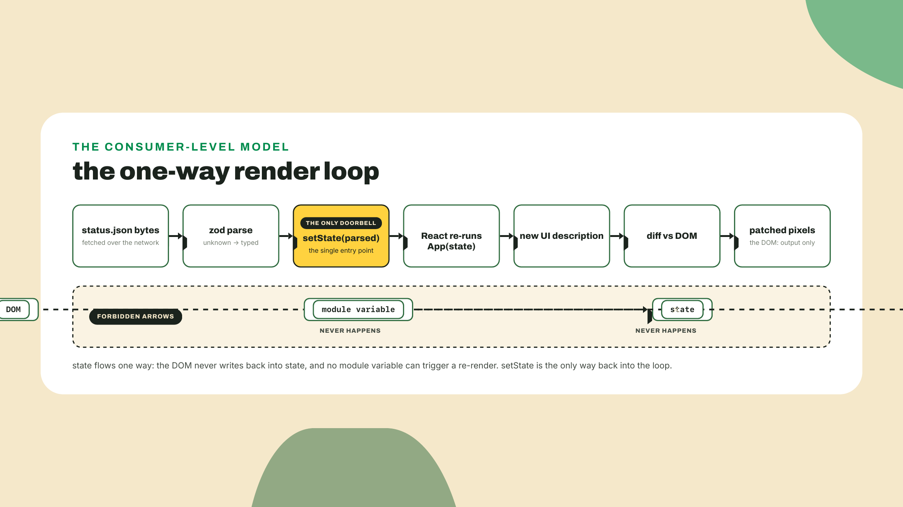
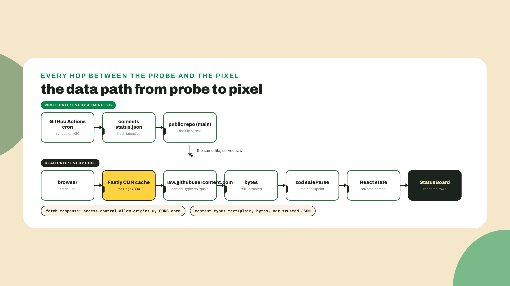
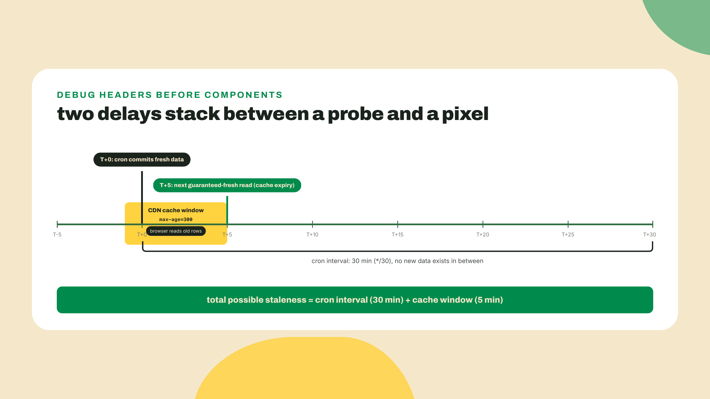
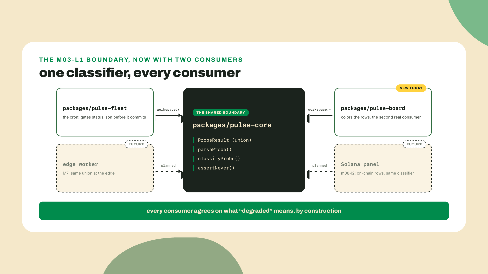
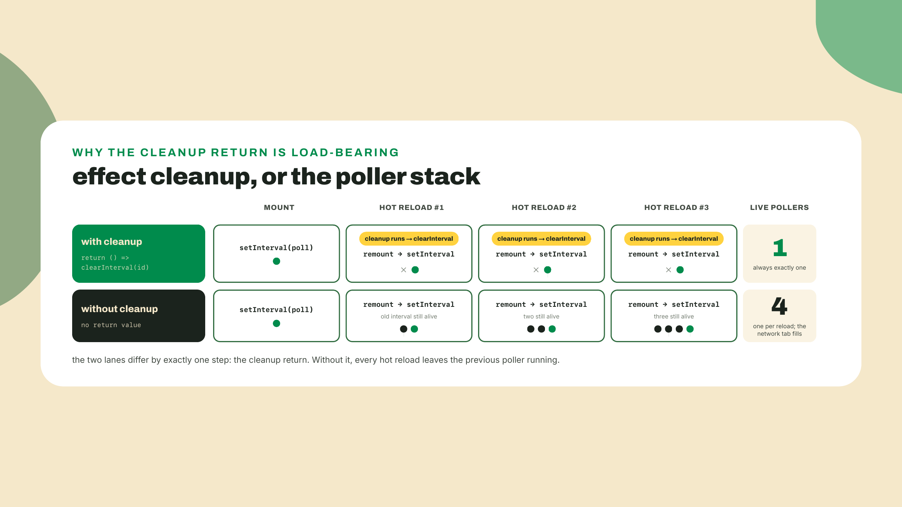
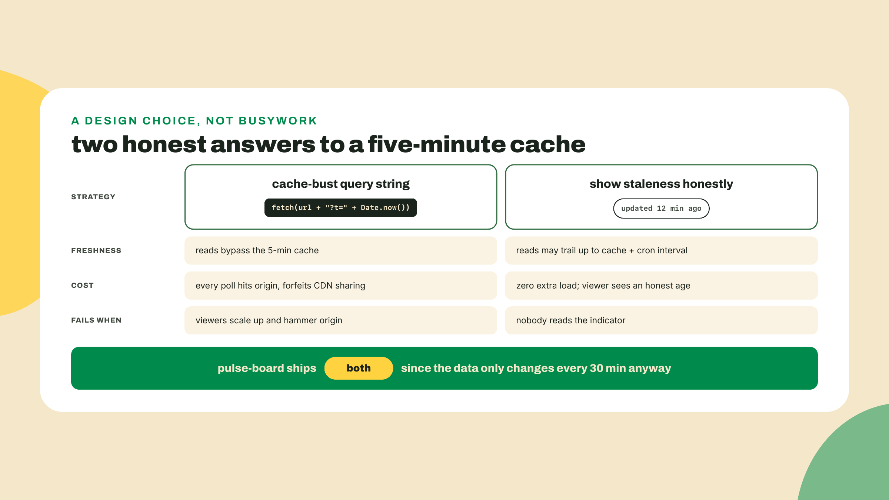

# React as a consumer: the dashboard

Last lesson split the repo into a real workspace: `pulse-core` extracted with an honest `package.json`, the fleet importing it across the boundary, the m02-l4 suite still green, and a promise on the way out that a second consumer was coming. This is that lesson. The station has been committing `status.json` every 30 minutes since module 1, nights and weekends, and in all that time not one pixel has ever shown it. Today it gets a face.

And we do the face first, theory after. From the repo root:

```bash
cd packages
pnpm create vite pulse-board --template react-ts
```

(That runs `create-vite`, 9.2.0 as I write this on 2026-09-02; the `--template react-ts` flag makes it non-interactive.) Now gut the demo and replace `packages/pulse-board/src/App.tsx` with the smallest thing that can possibly show your data. Swap in your own GitHub username:

```tsx
import { useEffect, useState } from "react";

const RAW_URL =
  "https://raw.githubusercontent.com/YOUR_USER/pulse-station/main/status.json";

export default function App() {
  const [raw, setRaw] = useState("loading...");

  useEffect(() => {
    fetch(RAW_URL)
      .then((res) => res.text())
      .then(setRaw)
      .catch((err) => setRaw(String(err)));
  }, []);

  return <pre>{raw}</pre>;
}
```

Install and run it:

```bash
cd pulse-board
pnpm install
npm run dev
```

(On the mixed spellings, invoking m03-l1's house note once so it never itches again: installs inside the workspace are pnpm's job, while `npm run` and `pnpm run` read the same `scripts` block and are interchangeable; this course's script lines use whichever the verification toolchain replayed, and `pnpm run dev` here would behave identically.)

Open the printed localhost URL. That wall of JSON in your browser is not sample data, it is your fleet: the targets you chose, latencies your cron measured on a machine you don't own, fetched cross-origin from your public repo with zero backend and zero keys. Weeks of unmanned probing, on a page, inside fifteen minutes. Keep that tab open; the whole lesson is about turning it from a `<pre>` dump into a board you'd show someone.

## Summary

The findings up front:

- A dashboard is a pure function of a JSON file; React is just the render loop. Component = function from props to UI, state the one input that triggers a repaint. This lesson teaches React at consumer level only, on purpose: it lands the consumer floor that real dApp client work stands on, and depth stays with the client-side mastery course.
- Your public repo is already a data API. `raw.githubusercontent.com` sends `access-control-allow-origin: *` unconditionally (probed 2026-09-02), caches for 5 minutes (`cache-control: max-age=300`, Fastly), and serves `.json` as `text/plain`. All three facts shape today's code.
- The lab's first move cashes m02-l4's IOU: the fleet writer is rewired to emit `ProbeResult` union rows, so `status.json` finally speaks the typed dialect the rest of the station has spoken since M2.
- The fetched bytes crossed a network boundary, so they go through a zod schema like every boundary since m02-l2: a corrupt file produces a visible error state, never a blank page.
- The board imports `classifyProbe` from `pulse-core`, so fleet and dashboard provably run the same classification code: the m03-l1 extraction demonstrated, not asserted.
- Autonomy fades on schedule: I drive the scaffold and the polling effect, you build `StatusRow` from a signature-level spec, and the challenge's staleness indicator is yours alone.

## The render loop and the data path

One fence before anything else, stated without apology: this is not a React course. React is a career-sized topic, and this catalog's home for it, the client-side mastery course, is in production as I write; expect wallet UX, transaction landing, and real dApp client depth there. Our job is the consumer level that kind of work starts from: components, props, state, one effect. That turns out to be enough to ship a real dashboard, which tells you something about where the 80 percent actually lives.

### A component is a function, state is the doorbell

Strip the mystique first. The best model of a React component is the thing you have been writing all course: a pure function. It takes an object of inputs, called props, and returns a description of UI. Same inputs, same UI. No hidden mood.

```tsx
function Greeting({ name }: { name: string }) {
  return <p>hello, {name}</p>;
}
```

The angle-bracket syntax is JSX, and it deserves exactly one paragraph: it is compiled sugar for function calls. `<p>hello, {name}</p>` becomes a call that builds `{ type: "p", props: { children: [...] } }`, a plain object describing what should exist. Vite's toolchain does the compile; you never configure it. That is the entire ceremony JSX gets in this course.

So if components are pure functions, what makes the page ever change? One thing: state. `useState` gives you a value plus a setter, and calling the setter is the only doorbell React answers. Set state, React re-runs your function with the new value, diffs the description against the DOM, patches the difference. Data flows one way, always: state in, render out, pixels last. React never reads your table back out of the DOM, and reassigning some module-level variable next to the component is invisible to it. Only the setter schedules a repaint.



Which yields the aha this lesson is named for: a dashboard is a pure function of a JSON file. `status.json` is the state of the world; the board is `render(state)`. Everything else, fetching, polling, caching, is plumbing to keep that one input fresh. Hold onto that model and most React tutorials collapse into details about the plumbing.

One more primitive, because "fetch a file every minute" is a side effect, not a pure computation. `useEffect` is React's container for exactly that: code that runs after render, touching the world. It takes a closure and a dependency array; empty array `[]` means run once on mount. One dev-mode asterisk before you count anything in devtools: the create-vite template wraps the app in React's StrictMode, which in development deliberately mounts, unmounts, and remounts each component once to shake out missing cleanups, so "once on mount" shows up as twice in the Network tab while you develop; production builds run it once. Crucially, the closure can return a cleanup function, called on unmount or hot-reload; skip it on an interval and every dev save stacks another poller, a bug the lab makes you meet on purpose. That is the entire hooks API this course teaches: `useState`, `useEffect`, done. Context, reducers, refs, server components, suspense: all real, all deferred by name to the client-side mastery course.

One preemptive footgun. Type "react fetch data" into a search box and you will be told hand-rolled effects are amateur hour and a data-fetching library is table stakes. Those libraries are excellent, and they solve problems this lesson does not have: deduplication across dozens of components, cache invalidation, optimistic writes. Your requirement is one URL, one interval, one schema; `useState` plus `useEffect` plus zod is the whole job, and knowing that is the skill. The library case gets made properly when mutations and shared server state arrive, and that is client-side mastery territory.

### The data path: your public repo is already an API

Now the plumbing, and this is where module 1's your-repo-is-public decision pays off. Your station repo is public, which means every file in it is served at `raw.githubusercontent.com/<user>/<repo>/<branch>/<path>`. No token, no SDK, no server you run. The question a working dev asks before trusting that path: what does that endpoint actually do? Not what a blog post says it does. So I probed it, and everything in this section is taught from the observed headers, dated 2026-09-02.



Three findings matter. First, CORS. Browsers block cross-origin fetches unless the server opts in, and raw.githubusercontent opts all the way in: `access-control-allow-origin: *`, unconditionally. The probe checked the sneaky case, sending a bare request and then an Origin-tagged one, and the headers came back identical, so the permissiveness is not reflected per-origin, it is just open. This is why your fifteen-minute `<pre>` dump worked on the first try instead of dying with a CORS error in the console.

Second, the cache, which changes your mental model of "live". The endpoint returns `cache-control: max-age=300` with a strong `etag`, served through Fastly; the probe watched a MISS turn into a HIT one second later. Five minutes of CDN cache, stacked on a 30-minute cron: your board can trail reality by the cron interval plus the cache window, and no React code changes that, because the stale bytes arrive stale. When your dashboard "isn't updating", look at the response headers in devtools first, not the component.



Third, the content type. The endpoint serves your `.json` file as `content-type: text/plain; charset=utf-8`. And yet `await res.json()` parses it without complaint, because the WHATWG fetch spec parses the body you asked it to parse; the MIME header rides along unread. Convenient, and slightly dishonest. The day you swap in an HTTP library that sniffs content-type before parsing, this exact response becomes a bug report, so you learn the fact now, while it is cheap.

One honesty line to complete the picture. GitHub documents no rate limit for this endpoint, and I will not invent one; what you are consuming is unauthenticated static bytes behind a CDN with undocumented abuse controls. And GitHub does not bless raw.* as a hosting product at all. In this course it is only ever the data endpoint. The dashboard itself, the HTML and JS, ships to Vercel next lesson, which is the sanctioned path.

So the bytes arrive: open CORS, possibly stale, mislabeled MIME. Do you trust them? You already know the answer, because it is the same answer as m02-l2: they crossed a network boundary, so they get parsed, not asserted. A zod schema mirroring `pulse-core`'s `ProbeResult` union sits at the fetch boundary, and a hand-corrupted file dies there as a visible error state instead of deep in a render as a blank page. Parse, don't validate, now guarding pixels.

Name the trade while it is fresh: a genuinely great deal with a printed expiry date. Polling a raw file costs nothing (no backend, no keys, no bill, your repo's uptime) at the price the CDN math just showed you: up to cron-plus-five-minutes behind reality, no push, no auth, public-only. The moment you need real-time updates, private rows, or a write path, you need an actual API; the M7 edge worker starts that story. Until then, a backend here would be pure ceremony.

There is a React-shaped trade hiding here too. A framework render loop buys declarative UI: describe what the board looks like for a given state, and the diffing is somebody else's problem. The price is a build step and a dependency that outlives your interest in it. For one static table, vanilla DOM would do; for a board that grows panels through M8 to M10 (a Solana lane, a latency chart, a worker health strip), you take the deal, because every new panel is another pure function of the same state. Pick frameworks by where the artifact is going, not by what the current commit needs.

### The second consumer: the import that proves the boundary

Movement three is short because m03-l1 did the heavy lifting. The board must decide what color each row gets, and "up versus degraded" is a judgment the station already makes, in `classifyProbe`, inside `pulse-core`. Reimplementing those three lines locally would work today and drift tomorrow: someone retunes the latency band in the fleet, forgets the board, and the pixels start disagreeing with the alerts about what "degraded" means. So the board does the only defensible thing:

```ts
import { classifyProbe, type ProbeResult } from "pulse-core";
```

Same import line the fleet uses, resolved through the same `workspace:*` symlink, executing the same code. Last lesson extraction was an argument; this line makes it a pixel. One classifier, two consumers, zero drift possible.



One small consumer-level TypeScript move earns its keep here. The board wants a type for its color map keys: the verdict `classifyProbe` returns. Your own `index.ts` happens to re-export `Verdict`, so a direct import works, but do the move you'd need against a third-party package whose surface you don't control: `type Verdict = ReturnType<typeof classifyProbe>`. `ReturnType` is a built-in utility type (a generic you consume, exactly the m02-l2 skill) that extracts a function's return type, and here it also catches something the exported alias doesn't advertise, as the next paragraph shows. The color map stays typed either way.

One honest detail falls out of extracting the type this way. `classifyProbe` is the boundary form m02-l4 froze: it takes the untrusted `(kind, value)` pair and answers `'invalid'` for a kind it does not recognize. So the type you just extracted has four members, not the three the exported `Verdict` union carries, and a `Record` over it needs an `invalid` entry or the compiler will name the missing key.

Two dated beats close the theory. Your `pulse-board` runs on Vite 8, and Vite 8.0.0 (shipped 2026-03-12) is Rolldown-powered: the bundler crunching your TypeScript is written in Rust, pinned as `rolldown ~1.2.4` in Vite's own manifest. The two-language thesis is sitting in your `node_modules` right now, and that is the entire bundler tour you get. And when this board grows its Solana panel in m08-l2, its `@solana/kit` will be pinned by reading peer ranges, not by memory: the m03-l1 rule, already compounding.

**Go deeper (the 20%).** this lesson taught the components-props-state-effect slice that a data consumer needs, and stops. Hooks depth, context, routing, forms, everything framework-shaped, is deliberately bookmarked. The canonical on-ramp is React's own [Quick Start](https://react.dev/learn) (URL probed 2026-09-02): interactive, free, maintained by the React team. Read it after the lab if React clicked and you want the full vocabulary; nothing below depends on it, and the serious client-side depth lives in the client-side mastery course anyway.

## Lab: pulse-board

Goal: the `<pre>` dump becomes a typed, parsed, classifier-colored status board that polls on an interval and fails loudly on garbage. I drive steps 1 through 4 with devtools open; step 5 hands you a spec instead of a diff; the challenge after the lab is unguided.

1. **Wire the scaffold into the workspace.** The opener's `pnpm create vite` already created `packages/pulse-board`, and because `pnpm-workspace.yaml` globs `packages/*`, it is already a workspace member. Clean out the demo (`src/App.css`, `src/assets`, the logo imports) and add the two dependencies the board actually needs, from `packages/pulse-board`:

   ```bash
   pnpm add zod
   pnpm add pulse-core --workspace
   ```

   (Freshness: `pnpm add zod` resolved to 4.5.4 on 2026-09-02; the `--workspace` flag forces the `workspace:*` protocol so `pulse-core` links from your repo, never the registry.) Checkpoint: `packages/pulse-board/package.json` now lists `"pulse-core": "workspace:*"`, and `npm run dev` still serves.

2. **Cash the m02-l4 IOU: rewire the fleet writer to the union.** m02-l4's footnote froze `status.json`'s flat v0 rows and promised the writer would be rewired in M3 once there was a dashboard to keep green. The dashboard is twenty minutes away, so the rewire happens now, first, or the schema you write in the next step will refuse your own file. Open `packages/pulse-fleet/fleet.ts`, the cron writer. Its `TARGETS` list, report envelope, and `../../status.json` write path all stay; what changes is the row type, from the lying `{ url, status, latencyMs: number | string, checkedAt }` to a wrapper carrying the real union:

   ```ts
   import { writeFile } from "node:fs/promises";
   import type { ProbeResult } from "pulse-core";

   type TargetStatus = {
     url: string;
     checkedAt: string;
     result: ProbeResult;
   };

   async function probeOne(url: string): Promise<TargetStatus> {
     const checkedAt = new Date().toISOString();
     const start = performance.now();
     try {
       const res = await fetch(url, { signal: AbortSignal.timeout(10_000) });
       const latencyMs = Math.round((performance.now() - start) * 10) / 10;
       if (!res.ok) {
         return { url, checkedAt, result: { kind: "http-error", status: res.status } };
       }
       return { url, checkedAt, result: { kind: "ok", latencyMs } };
     } catch (err) {
       if (err instanceof Error && err.name === "TimeoutError") {
         return { url, checkedAt, result: { kind: "timeout", budgetMs: 10_000 } };
       }
       return { url, checkedAt, result: { kind: "dns-error", host: new URL(url).hostname } };
     }
   }
   ```

   Walk the catch, because it is the m02-l3 exit map compressed to two arms. `AbortSignal.timeout` rejects with an error *named* `TimeoutError`, so that name check is the "our own timer fired" exit and becomes the `timeout` variant with the budget it blew. Everything else in the catch is the network itself failing, DNS, connection refused, TLS, before any budget could expire; `fetch` rejects those immediately as a `TypeError`, and they land in the `dns-error` arm exactly as the m02-l1 drill taught. A bare `catch` here would publish a dead host as a ten-second timeout, the precise small lie this rewire exists to evict. Delete the local v0 `ProbeResult` declaration while you are in there; the type now arrives from `pulse-core`, type-only, costing the runtime nothing. Rename the writer's result array element type to `TargetStatus` and the rest compiles untouched. Run it once from `packages/pulse-fleet`, `npx tsx fleet.ts`, and open the fresh `status.json` at the repo root: every row now reads `{ "url", "checkedAt", "result": { "kind": ... } }`. The v0 dialect m02-l1 made unrepresentable in `probe.ts` has finally been evicted from the one file still allowed to lie in it. Commit and push before building the board, so the cron's next run publishes union rows for your live URL too.

3. **Schema the boundary.** Create `src/status.ts`, the board's border checkpoint. The schema mirrors the report the writer you just rewired emits: `generatedAt`, plus one entry per target wrapping the `ProbeResult` union:

   ```ts
   import { z } from "zod";

   const probeResultSchema = z.discriminatedUnion("kind", [
     z.object({ kind: z.literal("ok"), latencyMs: z.number() }),
     z.object({ kind: z.literal("timeout"), budgetMs: z.number() }),
     z.object({ kind: z.literal("http-error"), status: z.number() }),
     z.object({ kind: z.literal("dns-error"), host: z.string() }),
   ]);

   const targetStatusSchema = z.object({
     url: z.string(),
     checkedAt: z.string(),
     result: probeResultSchema,
   });

   export const statusFileSchema = z.object({
     generatedAt: z.string(),
     targets: z.array(targetStatusSchema),
   });

   export type StatusFile = z.infer<typeof statusFileSchema>;
   export type TargetStatus = StatusFile["targets"][number];
   ```

   Note what `z.infer` buys at this boundary: the parsed `result` is structurally identical to `pulse-core`'s `ProbeResult`, so narrowing on it in the next step is real narrowing against the real union, no casts anywhere. If your fleet's field names differ from mine, the schema is the one place you reconcile them; that is what a border checkpoint is for.

4. **The polling effect, with devtools open.** Replace `src/App.tsx`. Before you paste, open the browser devtools Network tab and keep it visible; the point of this step is watching the theory happen.

   ```tsx
   import { useEffect, useState } from "react";
   import { statusFileSchema, type StatusFile } from "./status";
   import { StatusBoard } from "./StatusBoard";

   const RAW_URL =
     "https://raw.githubusercontent.com/YOUR_USER/pulse-station/main/status.json";
   const POLL_MS = 60_000;

   type BoardState =
     | { phase: "loading" }
     | { phase: "error"; message: string }
     | { phase: "ready"; data: StatusFile };

   export default function App() {
     const [state, setState] = useState<BoardState>({ phase: "loading" });

     useEffect(() => {
       let cancelled = false;

       async function poll() {
         try {
           const res = await fetch(RAW_URL);
           if (!res.ok) throw new Error(`HTTP ${res.status}`);
           const parsed = statusFileSchema.safeParse(await res.json());
           if (cancelled) return;
           if (parsed.success) {
             setState({ phase: "ready", data: parsed.data });
           } else {
             const message = parsed.error.issues
               .map((i) => `${i.path.join(".")}: ${i.message}`)
               .join("; ");
             setState({ phase: "error", message });
           }
         } catch (err) {
           if (!cancelled) setState({ phase: "error", message: String(err) });
         }
       }

       poll();
       const id = setInterval(poll, POLL_MS);
       return () => {
         cancelled = true;
         clearInterval(id);
       };
     }, []);

     if (state.phase === "loading") return <p>loading fleet status...</p>;
     if (state.phase === "error") return <p>board error: {state.message}</p>;
     return <StatusBoard data={state.data} />;
   }
   ```

   One thing to notice before you blame me for contradicting myself: those two local imports carry no `.js` extension, and m03-l1 was emphatic that this course's tsconfigs make the extension non-optional. Both are true, because they are different tsconfigs. m03-l1's rule is about `nodenext` resolution, where a specifier names the emitted file. The board is a create-vite package with its own tsconfig set on `bundler` resolution, where the bundler resolves the specifier and extensionless is the idiom. The durable rule is not "always write `.js`", it is "write what your resolution mode requires", and the fast way to know which you are in is to read `moduleResolution` in the tsconfig you are actually compiling under. Do not "fix" these two lines.

   Familiar bones, deliberately: `BoardState` is a discriminated union (m02-l1's move, now shaping UI), and the render at the bottom is just narrowing. `StatusBoard` doesn't exist yet, so the dev server shows an import error; fine for one step. Two reads before moving on. In the Network tab, click the `status.json` request and read the response headers yourself: `cache-control: max-age=300`, the `etag`, the varnish `via` line. (No browser handy? `curl -s -D - -o /dev/null https://raw.githubusercontent.com/YOUR_USER/pulse-station/main/status.json` dumps the identical headers, `access-control-allow-origin: *` included.) Second read: why 60 seconds? The data changes every 30 minutes and the CDN reuses one copy for 5, so polling faster buys only cached re-reads; 60s keeps the tab honest within a minute of the cache going fresh. The interval and the cron are different clocks, and confusing them is the footgun.

   Now the bug you must meet once. Comment out the two cleanup lines (`cancelled = true; clearInterval(id);`), save, and edit any file a few times to trigger hot reloads. Watch the Network tab fill: every reload stacked another poller, none of the old ones died. I have shipped exactly this, and the tab-eats-a-CPU-core bug report that follows is no fun. Restore the cleanup, watch requests drop back to one per minute, and never write an interval effect without its return again. (This drill needs a real browser, because hot reload is the trigger; working headless, read the flowchart below as the drill's transcript and drop a `console.count("poll tick")` inside `poll` so the stacking shows as a counter racing ahead next time you do have devtools.)



5. **StatusRow and the classifier colors, from a spec.** Your turn, signature-level only. Build `src/StatusRow.tsx` exporting `StatusRow({ target }: { target: TargetStatus })`, a table row that: derives its verdict from the imported `classifyProbe`, which takes the frozen `(kind, value)` pair, so you narrow on `target.result.kind` and hand it that variant's reading; colors the verdict cell from a `Record<Verdict, string>` map (get `Verdict` via `ReturnType<typeof classifyProbe>`, and remember it carries `'invalid'`); renders a human detail string per variant by narrowing on that same `target.result.kind` (latency for `ok`, budget for `timeout`, code for `http-error`, host for `dns-error`); and shows `checkedAt` as a local time. One variant needs a decision from you: a `dns-error` carries a hostname, not a numeric reading, so it has nothing to hand the classifier. Mine, for after you've tried:

   ```tsx
   import { classifyProbe } from "pulse-core";
   import type { TargetStatus } from "./status";

   type Verdict = ReturnType<typeof classifyProbe>;

   const VERDICT_COLOR: Record<Verdict, string> = {
     up: "#22c55e",
     degraded: "#eab308",
     down: "#ef4444",
     invalid: "#a1a1aa",
   };

   export function StatusRow({ target }: { target: TargetStatus }) {
     // classifyProbe is the frozen (kind, value) boundary form. A dns-error
     // has a hostname and no reading, so the board decides that one here.
     const verdict: Verdict =
       target.result.kind === "ok"
         ? classifyProbe("ok", target.result.latencyMs)
         : target.result.kind === "timeout"
           ? classifyProbe("timeout", target.result.budgetMs)
           : target.result.kind === "http-error"
             ? classifyProbe("http-error", target.result.status)
             : "down";

     const detail =
       target.result.kind === "ok"
         ? `${target.result.latencyMs} ms`
         : target.result.kind === "timeout"
           ? `no answer in ${target.result.budgetMs} ms`
           : target.result.kind === "http-error"
             ? `HTTP ${target.result.status}`
             : `DNS failed for ${target.result.host}`;

     return (
       <tr>
         <td>{target.url}</td>
         <td style={{ color: VERDICT_COLOR[verdict] }}>{verdict}</td>
         <td>{detail}</td>
         <td>{new Date(target.checkedAt).toLocaleTimeString()}</td>
       </tr>
     );
   }
   ```

   And the board that maps rows, `src/StatusBoard.tsx`, which is honestly too plain to spec:

   ```tsx
   import type { StatusFile } from "./status";
   import { StatusRow } from "./StatusRow";

   export function StatusBoard({ data }: { data: StatusFile }) {
     return (
       <table>
         <thead>
           <tr>
             <th>target</th>
             <th>verdict</th>
             <th>detail</th>
             <th>checked</th>
           </tr>
         </thead>
         <tbody>
           {data.targets.map((t) => (
             <StatusRow key={t.url} target={t} />
           ))}
         </tbody>
       </table>
     );
   }
   ```

   Checkpoint, and it is the lesson's whole point: the dev server now shows rows of your real targets, latencies your cron measured, colored by the exact function that gates the fleet's publishes. A green `solana.com` on your screen and a green `solana.com` in the cron's logs can never disagree, because they are one function.

6. **The corrupt-file drill.** Prove the boundary before trusting it. Copy a real response into `public/corrupt.json`, then break it by hand: change one row's `"kind": "ok"` to `"kind": "okay"` (the m02-l1 forgery, back for revenge). Point `RAW_URL` at `/corrupt.json` temporarily and reload. Expected: no blank page, no console-only whining, but your error state, on screen, naming the path and the discriminator that failed. That message is zod refusing at the border, exactly as designed. Point `RAW_URL` back at your raw URL and confirm rows return.

7. **Build clean.** From `packages/pulse-board`:

   ```bash
   npm run build
   ```

   The react-ts template's build script runs `tsc -b` before `vite build`, so this is the type gate and the bundler in one line. Expected: zero type errors and a `dist/` folder. That folder is a fully static site, which is precisely what makes next lesson so short.

## Challenge

Unguided, closing the loop on the staleness math. Add a "last updated" indicator that: (a) shows `generatedAt` as local time; (b) computes the age of the newest data from the fetched values, not from when you fetched them; (c) visually flips stale (color, badge, your call) past two cron intervals, 60 minutes, because one missed run is a hiccup and two is an incident. While you are in there, add a cache-busting query string to the fetch (`` `${RAW_URL}?t=${Date.now()}` `` makes each poll a distinct cache key, trading CDN kindness for freshness). The silver bullet for stale-looking boards? There isn't one; there are two honest strategies, and now your board does both.



Acceptance, all four: the board renders real fleet rows colored by the imported classifier; the corrupt-file drill shows the zod error state on screen; the staleness indicator flips on old data (test it by feeding a doctored local file with hour-old timestamps); `npm run build` exits clean.

## Checkpoint, and the first stranger-visible URL

Take stock of what got proven. The extraction survived a second real consumer: one import line, and fleet and board can never drift on what "degraded" means. The public-repo bet paid its dividend: a browser app with zero backend, reading real data across origins because the probed headers permit it. And boundary discipline held in new territory: garbage bytes die at the schema with a message, not in the render with a blank page. The retrieval question, cold, no notes: name the two delays stacked between a probe running and a pixel changing. If you said the cron's schedule and the CDN's 5-minute cache, the mental model is installed.

If the board renders but the rows look wrong, trust the debugging order the lesson taught: response headers first (is it the cache?), schema error state second (is it the shape?), component last. The component is almost never the liar; it is a pure function of whatever it was handed.

The board runs beautifully, on localhost, where exactly one person on Earth can see it. That `dist/` folder from step 7 is sitting there, fully static, needing nothing but a host. Next lesson: `vercel login`, `vercel`, and a URL you can text to a stranger. The first URL of the course, at lesson ten. Bring a phone.
