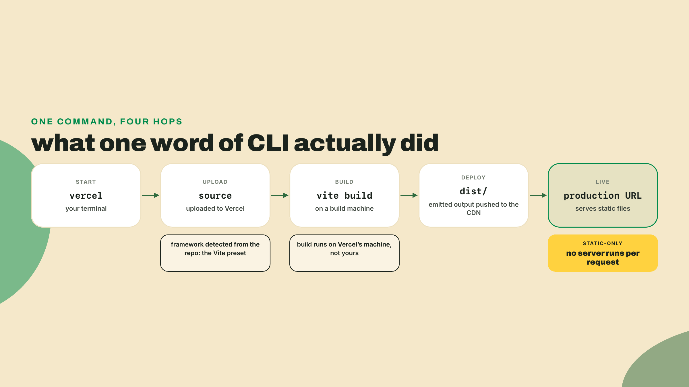
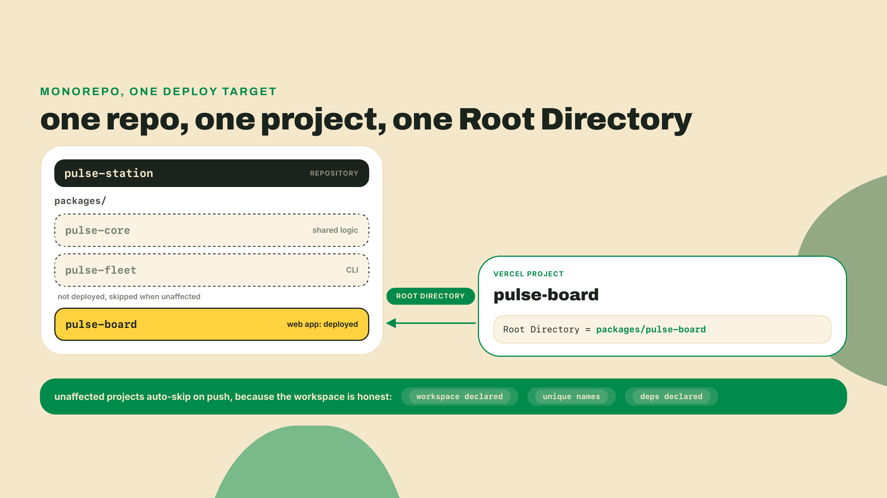
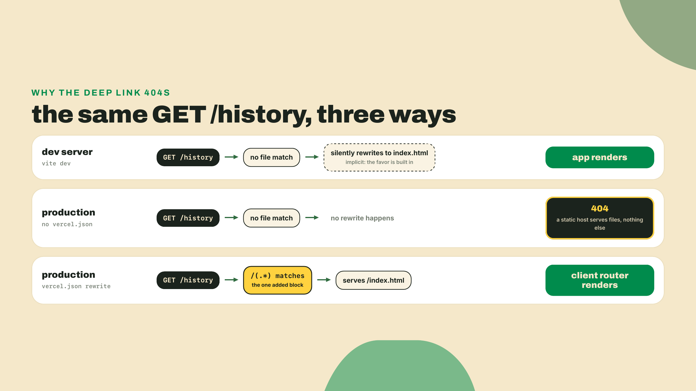
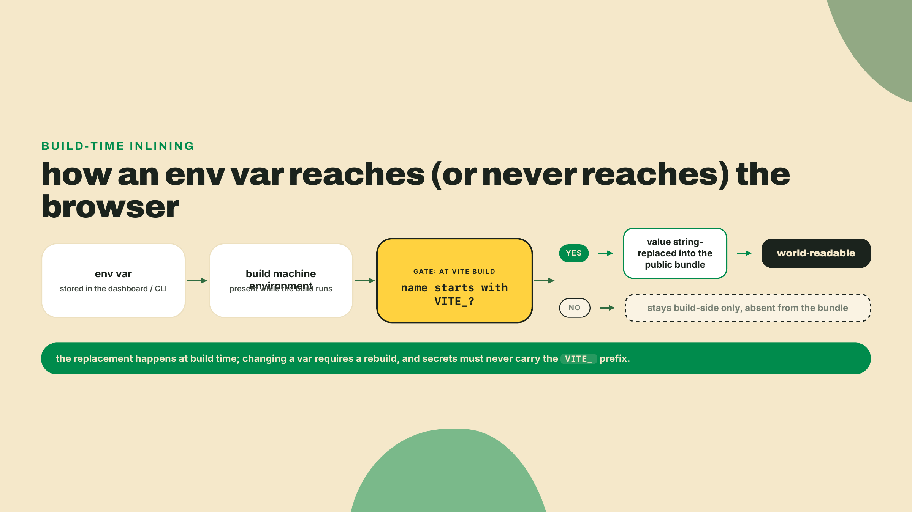
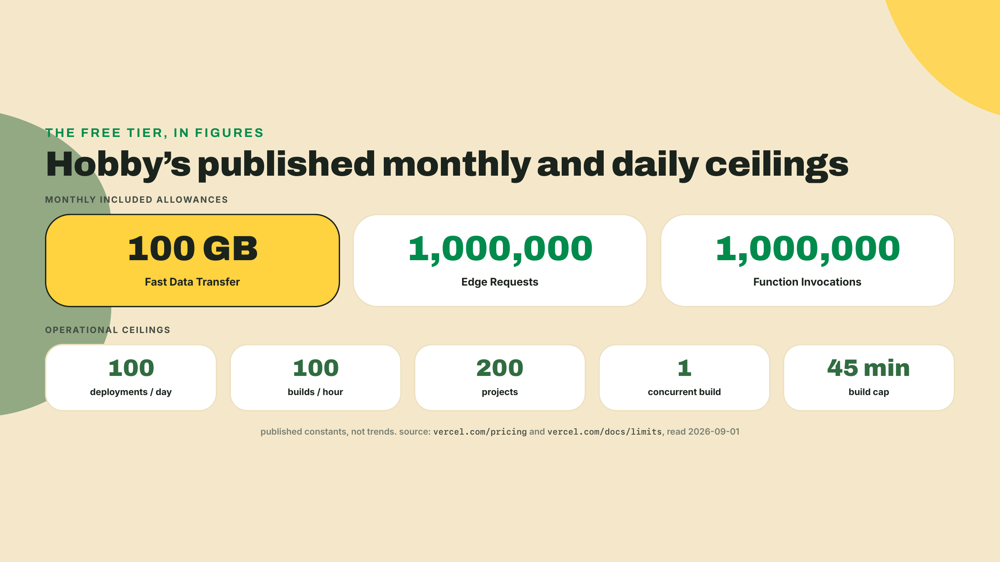
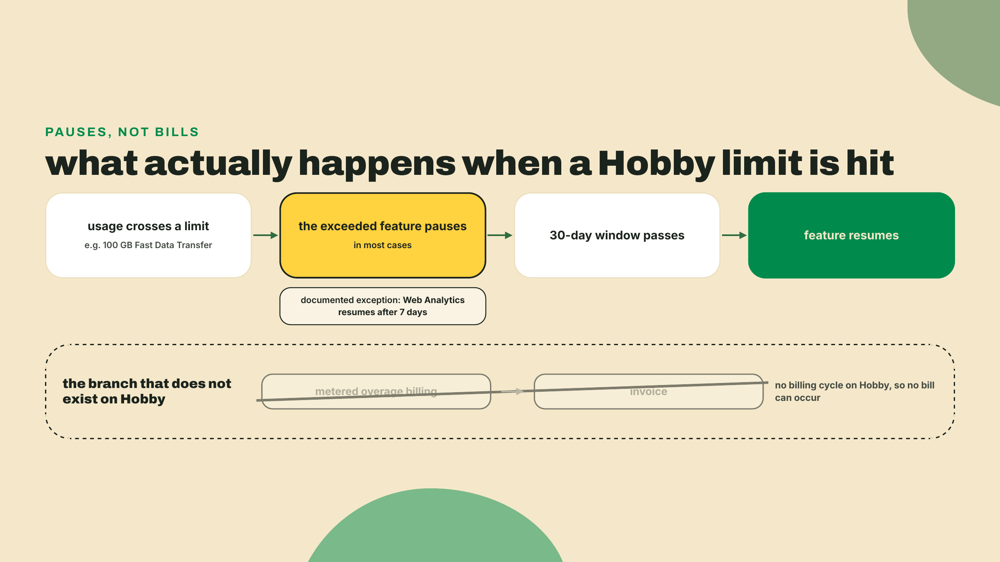
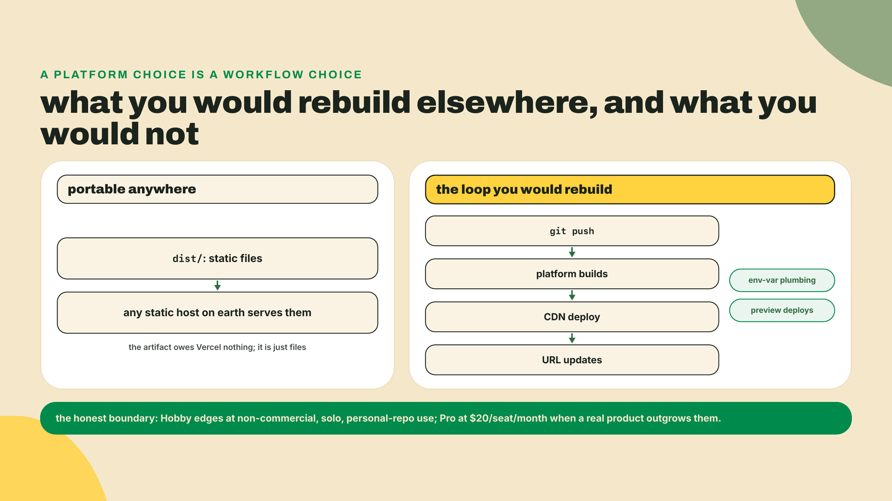
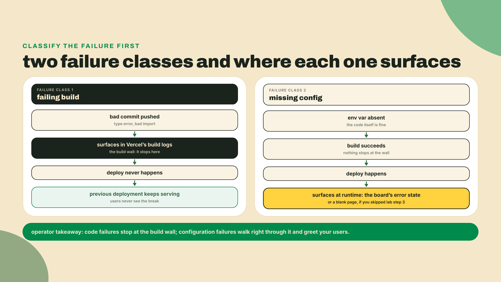

# Vercel: the URL

## Summary

Last lesson gave the station a face: a Vite + React board in `packages/pulse-board`, polling the cron's `status.json` and coloring rows with pulse-core's classifier. It runs beautifully, on localhost, which means its total audience is one person, and that person already knows what the numbers say. Nine lessons of real, compounding work, and not a single other human can see any of it.

Today that ends. This is SHIP #2 and the course's first URL: you deploy pulse-board to Vercel from the workspace, and inside the first quarter of this lesson there is a production address you can text to someone on another continent whose phone will render YOUR probe data. The rest of the lesson earns the understanding: what actually happened when you typed one word, the one-block rewrite and the env-var rule that make a SPA production-honest, and the free tier's contract read from its published numbers instead of from a blog post's vibes.

Do this right now, before reading another paragraph:

```bash
npm i -g vercel   # Vercel CLI (59.11.2 as of 2026-09-02; the CLI moves fast, expect a higher digit)
vercel login
```

Pick the GitHub login when the browser opens, and make sure it is your PERSONAL account, the one the station repo lives on. That choice was made for you back in M1, and this lesson is where you find out why it mattered.

The autonomy fade, out loud: we drive the first deploy together with every prompt narrated, the hardening steps come as a checklist you execute yourself, and the closing drill hands you two broken deploys and no guardrails at all.

## The ship and the fine print

### Ship first, understand after

From the workspace ROOT, not the package directory (the CLI prefers the repo root and will ask where the code lives):

```bash
vercel
```

The CLI walks you through a short questionnaire. Set up and deploy: yes. Scope: your personal account. Link to an existing project: no. Project name: `pulse-board` is fine. And then the question that matters, the one about which directory your code is located in: answer `packages/pulse-board`. The CLI detects Vite, runs the build remotely, and hands back a preview URL. Poke it, confirm the board renders, then promote it:

```bash
vercel --prod
```

A production URL prints. That is the whole ship.

Two URLs in two commands deserves one definition, because the split is load-bearing for the rest of your deploy life. The bare `vercel` created a **preview deployment**: its own unique URL, a full build of exactly what you sent, safe to share and safe to throw away. `vercel --prod` created a **production deployment**, the one your project's main address points at. Same pipeline, different audience: previews are where you look at a change before believing in it, production is the address you give strangers. Once the repo is connected in the lab, this split automates: pushes to a branch get preview URLs, merges to main go to production, and you will never again wonder whether a reviewer is looking at the version you think they are.

Now do the thing this lesson exists for: open that URL on a device that has never seen your code. A phone on mobile data works. Better, send it to a friend and watch real probe rows, latencies YOUR cron measured, render on hardware you have never touched. The first URL I ever shipped went to a friend who opened it on a bus, and I refreshed the analytics like it was election night. Nothing I have deployed since has hit quite the same. This milestone, lesson ten's ship, cost you nine lessons of TypeScript, a test suite, a workspace extraction, and a cron that has been faithfully committing JSON for weeks. You earned the URL. Take the minute.

Okay. Minute over. What actually happened?



The teardown, stage by stage. The CLI bundled your source and sent it up. A Vercel build machine looked at the repo, recognized Vite from what the repo itself declares (the `vite` dependency, the build script, the config file), ran `vite build`, and took the emitted `dist/` directory. Those files went onto Vercel's CDN, replicated to edge locations, and the URL you got is a name pointing at them. Note what is NOT in that pipeline: your laptop's dist folder. The build ran on their machine from your source, which is why a failing build will surface in THEIR logs, and why, once the repo is connected, a git push can trigger a deploy while your laptop stays closed.

People call this zero-config, and the honest mechanism is worth stating without anyone's marketing attached: your repo already declares its framework, its build command, and its output directory, so the platform reads those declarations and provisions infrastructure to match. You configured plenty. You just did it in `package.json` and `vite.config.ts`, files you were maintaining anyway, and the platform treated them as the config. Collapse it all the way down: deployment became a build artifact. The repo is now the single source of truth for what production looks like.

One prompt deserves a second look: the directory question. That answer is the **Root Directory** setting wearing a terminal prompt. Vercel's monorepo model is one project per deployable directory: your repo holds `pulse-core`, `pulse-fleet`, and `pulse-board`, and the project you just created points at exactly one of them. The setting is chosen at import and editable later under Settings, then Build and Deployment, then Root Directory. This was the course's open contingency for a while (the fallback plan was extracting the board to a standalone repo), and the docs probe closed it: Root Directory is the supported, documented path, no surgery needed.



There is a bonus buried in here that you already paid for. When the repo is GitHub-connected, Vercel skips builds for monorepo projects a commit did not affect, and the documented requirements for that skip read like a checklist of m03-l1: a real workspace definition with the packages declared, a unique `name` per package, and inter-package dependencies stated in each `package.json`. The manifest hygiene you did two lessons ago was not ceremony. It is the reason this import Just Works and the reason future sibling deploys will not burn build slots on commits that only touched the fleet.

### Making it production-honest

Your board is live but it is not honest yet. Two gaps, both invisible on localhost.

Gap one: deep links. Visit your production URL with any path appended, `your-board.vercel.app/history`, say. You get Vercel's 404 page. The same path under `npm run dev` renders the app fine. I have shipped this exact 404 myself, more than once, and the second time was more embarrassing because I had written the fix into a wiki the first time. The asymmetry is the lesson: the dev server silently rewrites unknown paths to `index.html` as a favor, and a production static host does no favors. There is no file called `history` in `dist/`, so a file server correctly says 404. Your SPA routes on the client, which means the host must hand `index.html` to EVERY path and let React take it from there.

The entire fix is one block. Create `packages/pulse-board/vercel.json`:

```json
{
  "rewrites": [{ "source": "/(.*)", "destination": "/index.html" }]
}
```

Every request, whatever the path, gets the app shell; the client router (today, just your one-page board; from M8, real routes) decides what to render. The board does not even have a second route yet and this still matters: the day it grows one, and the M8 Solana panel adds one, deep links shared in chat will either work or 404 depending on whether this block shipped today.



Gap two: the hardcoded URL. Right now the board fetches `status.json` from a raw GitHub URL pasted into the source. Works, but it welds your deployment to one repo: anyone forking the station, and you yourself when M8 adds a second data source, has to edit code to repoint it. Configuration belongs in the environment. Here is where Vite has a rule you must know cold: **only env vars prefixed with `VITE_` ever reach client code.** Everything else stays build-side, invisible to the bundle.

The prefix is not bureaucracy, it is a consent form. Everything in client JavaScript is world-readable, forever, by anyone with a devtools tab. So exposure is opt-in, and the ugly prefix is you signing the form: this value will be public. Read the rule backwards and it is the security lesson: anything secret must NEVER wear `VITE_`. No API keys, no tokens, nothing you would not print on a T-shirt. The four-platform secrets sweep in m09-l2 comes back to this exact rule with a checklist.

Wire it up. First the typed config, in `packages/pulse-board/src/config.ts`:

```ts
const repo = import.meta.env.VITE_STATION_REPO;

export const statusUrl: string | null = repo
  ? `https://raw.githubusercontent.com/${repo}/main/status.json`
  : null;
```

And teach TypeScript about the variable in `packages/pulse-board/src/vite-env.d.ts`. Older create-vite templates scaffolded this file; the current 9.x react-ts template does not, so create it yourself, and the name still matters, because `vite-env.d.ts` is the conventional home Vite's docs and every teammate will look for:

```ts
/// <reference types="vite/client" />

interface ImportMetaEnv {
  readonly VITE_STATION_REPO: string | undefined;
}

interface ImportMeta {
  readonly env: ImportMetaEnv;
}
```

The `string | undefined` is deliberate honesty: the variable might not be set, and the type forces every consumer to say what happens then. In the board, a `null` statusUrl should render a visible configuration-error state, not a blank page. Fail loud. A dashboard that renders nothing and says nothing is the worst of both.

One mechanism note that will save you a confused evening: Vite inlines these values at BUILD time. The bundler literally string-replaces `import.meta.env.VITE_STATION_REPO` with the value during `vite build`. A static site has no runtime environment to read, so changing the variable in the dashboard does nothing to the deployed files until the next build bakes the new value in. Set a var, redeploy, always in that order.



Set the value where the build machine can see it:

```bash
vercel env add VITE_STATION_REPO
# paste your owner/repo when prompted, e.g. yourname/pulse-station
# when it asks which environments, select all three: Production, Preview, Development
vercel env pull packages/pulse-board/.env.local
```

Environments matter here, and they map onto the deployment split you just learned: Vercel scopes every variable to Production, Preview, Development, or any combination, which is why the prompt asks. Select all three for this one, because the board should render the same data everywhere. The `pull` then syncs the Development values into a gitignored `.env.local`, so local dev reads the same configuration production bakes in. Watch the pull's destination path: the CLI runs from the workspace root like every vercel command here, but Vite only reads env files from the Vite project's own root, so the file must land inside `packages/pulse-board/`. Pull it to the repo root instead and local dev never sees the variable, renders your configuration-error state, and sends you hunting for a "missing" var that is sitting one directory too high. One variable, one source of truth, three environments. Had you scoped it to Production only, previews would build with the variable absent and render your error state, which is a legitimate configuration for values that differ per environment, and a confusing surprise for ones that should not. (House rule from the platform's own limits page, read 2026-09-01: all your env vars together are capped at 64 KB. You will never hit it with one repo slug; a team stuffing JSON blobs into vars will, and now you know the ceiling exists.)

### The Hobby contract, from its own pages

Before trusting a free tier with your station, read the vendor's pages, dated, and nobody's summary. This habit has a fresh reason attached: on 2026-09-01 this course probed Cloudflare's own Pages docs and found them telling you to start new projects with Workers instead. A vendor sunsetting a product in plain sight, in its own documentation, while three-year-old tutorials keep recommending it. The docs move; blog posts fossilize. So here is Vercel's Hobby tier from vercel.com's pricing and limits pages as read on 2026-09-01, numbers, not adjectives.

Included per month: 100 GB of Fast Data Transfer, 1M Edge Requests, 1M Function Invocations. Operational ceilings: 100 deployments per day, 100 builds per hour, 200 projects, one concurrent build, a 45-minute build cap. Those two lists are different kinds of numbers. The first is consumption you spend by being popular; the second is throughput you spend by iterating. Your station strains neither: a small JSON file plus a modest bundle against 100 GB is enormous headroom, and you would need to ship code faster than one deploy every 15 minutes all day to feel the deployment ceiling.



Now the part that makes Hobby genuinely teachable: the overage model. Hobby has no billing cycle. There is nothing to meter against, so there is no invoice, ever. Exceed a limit and the documented behavior is that the feature PAUSES until the 30-day window passes, in most cases (the one documented exception the research pass found: Web Analytics resumes after 7 days). Then service resumes. Sit with what that means: on this tier, the worst case of your station going viral is downtime. Never debt. Every other pricing model you will meet in your career should be measured against that sentence.



Read the model against your station's actual traffic and the headroom stops being abstract. The board's payload is a status JSON measured in kilobytes and a built bundle that ships once per visitor and then sits in their cache. To spend 100 GB you would need traffic in the millions of page loads, and if the station somehow finds that audience, what happens is a pause and a very good problem, not a surprise invoice. Knowing the failure mode BEFORE it fires is the operating habit this course keeps drilling, and here the failure mode is documented, bounded, and survivable by design.

The generosity has edges, and they are design, not fine print to resent. Three documented constraints compose here. Hobby is for non-commercial, personal use, per the fair-use policy. Hobby is SOLO: the plan comparison table shows a dash for team collaboration features, so there is no inviting a collaborator into the project. And Hobby teams cannot connect repositories owned by Git organizations. Personal account, personal repo, one human, nothing for sale. Now look back at M1, when the course insisted the station live public on your PERSONAL GitHub account. That was this lesson reaching backwards. The station's whole shape was designed so that lesson ten's ship needs zero workarounds, which is what a free-tier-honest core path actually costs: decisions made months early.

And the credit-card question, which deserves to be answered the way this course answers everything. You will read "no credit card required" about Vercel Hobby all over the internet. Vercel never writes that sentence. What the docs show: the Hobby plan has no billing cycle, and the only place card details appear in the plan documentation is step five of the upgrade-to-Pro flow. Multiple 2026 third-party writeups say no card is requested at signup. But as of 2026-09-02 this course has not verified that with a fresh signup, so we phrase exactly as far as the evidence reaches: free, no billing cycle, usage pauses instead of billing. When you cannot source a sentence, do not say the sentence. If you assert "no credit card" to a friend, you are quoting bloggers, not the vendor, and knowing the difference is a professional skill this lesson is deliberately modeling.

The honest trade-off, both directions. Zero-config is a loan, not a gift: Vercel inferred your build because your repo matches a pattern it knows, and the day you drift from the pattern, an odd monorepo layout, an exotic build step, the magic becomes configuration you now have to learn anyway, with an inference layer sitting between you and the error message. And Hobby's edges disqualify real cases by design: a startup's production app is commercial, collaborative, and probably org-owned, which is zero for three. The honest upgrade path exists (Pro, $20 per seat per month). So does the honest alternative: `dist/` is just files, and any static host on earth can serve files. What you would rebuild elsewhere is not the hosting, it is the loop, push to deploy, plus the CDN and the environment plumbing. That loop is the actual game-changer, and it is worth knowing that THAT is what you would miss, not the brand.



### What the platform did not do

One more piece of honesty, because the platform you just used is famous for features you did not touch. No server ran tonight. Your deployment is static files on a CDN, full stop. Vercel's compute layer is real and large: since 2025-04-23, Fluid compute has been the default for new projects, meaning serverless functions that behave like servers you do not manage, concurrency inside instances, billing on active CPU, across Node.js, Python, Edge, Bun, and Rust runtimes (the optimized in-function concurrency piece is Node.js and Python only, a distinction worth keeping straight when someone hypes it at you). The board needs none of it. A dashboard that reads a public JSON file is the static-site case in its purest form, and knowing precisely which layer of a platform you are NOT using is what separates positioning from cargo-culting. The station WILL grow an API, and when it does, in M7, it goes to a different edge entirely, and you will make that platform read its own pricing pages too.

**Go deeper (the 20%).** this lesson taught the deploy path our artifact exercises, and stopped. Functions runtimes, Fluid compute depth, and the Next.js-on-Vercel world are real material this course deliberately signposts instead of teaching. The canonical entry is Vercel's own getting-started track, which runs CLI-first exactly like this lesson did: [Getting started with Vercel](https://vercel.com/docs/getting-started-with-vercel) (URL probed 2026-09-01; the page itself was last updated 2026-08-11). Read it after the lab if the platform interests you; nothing below depends on it.

## Lab: harden the ship

You deployed with training wheels. Now the checklist, and it is a checklist, not a walkthrough: each step names the goal and the proof, and you supply the keystrokes.

1. **Prove the 404 first.** Open `https://<your-board>.vercel.app/history` (or any made-up path) and confirm the 404 page. Never fix a bug you have not watched fail; you want the before picture for step 2's after.

2. **Ship the rewrite.** Add the one-block `vercel.json` from the theory section to `packages/pulse-board/`, commit it, and run `vercel --prod` from the workspace root. Acceptance: the same deep-link path now renders the board, and so does any other path you invent.

3. **De-hardcode the data source.** Land `config.ts` and the `vite-env.d.ts` extension, replace the pasted raw URL in the fetch with `statusUrl`, and make the null case render a visible configuration-error message instead of a blank board. Acceptance: `pnpm run build` inside `packages/pulse-board` is clean, and running dev WITHOUT the variable set shows your error state, not a white page.

4. **Set the variable both places.**

   ```bash
   vercel env add VITE_STATION_REPO
   vercel env pull packages/pulse-board/.env.local
   ```

   The first prompts for a value (your `owner/repo` slug) and for which environments; select all three, exactly as the theory section argued. Had you scoped it to Production only, the `pull`, which syncs the Development values, would hand you an empty `.env.local` and a confusing dev session. The second writes `.env.local` inside the board package, where Vite actually reads env files, so local dev agrees with production. Confirm `.env.local` is gitignored (it is, if your M1 hygiene held; check anyway). Redeploy with `vercel --prod`. Acceptance: production renders live rows again, and view-source on the deployed bundle finds your repo slug baked into the JavaScript, which is the build-time inlining made visible, and a preview of why secrets never wear the prefix.

5. **Close the loop through GitHub.** In the Vercel dashboard, connect the project to your station repo in the project's Git settings. Then push a trivial change (bump a heading, fix a typo) and watch the dashboard build and deploy it with your laptop's involvement ending at `git push`. Acceptance: a new production deployment appears that you did not run `vercel` for. From this commit forward, the repo IS the deploy button.

6. **The social checkpoint.** Send the URL to one human who has never seen your code, on a different network than yours, and get confirmation that live probe rows rendered. A stranger's phone is the only honest integration test a URL has.

## Challenge: break it twice, read where it bleeds

Unguided, and worth doing slowly. Production failures come in classes, and the operator's first skill is knowing WHERE each class surfaces before it happens at 2 a.m.

Break one: remove the env var (`vercel env rm VITE_STATION_REPO production`), redeploy, and open the URL. Find the failure. Break two: introduce a build-breaking change (delete a semicolon's worth of type-correctness somewhere, a bad import works well) and push it. Find that failure too.

For each break, write ONE sentence stating where the failure surfaced (the build logs? the deployed page at runtime?) and which class of failure that makes it. Then repair both: restore the variable, revert the commit, confirm green.



Acceptance for the whole lesson: production URL live and rendering real data on a foreign device, a deep-link path loads directly, and your two sentences classify the failures correctly, build-time versus runtime. Notice which failure was safer: the broken build never touched your users, because the previous deployment kept serving. The missing variable shipped. Configuration errors are the sneakier class, which is exactly why step 3 made them loud.

## Checkpoint, and the engine's turn

What you can now do, concretely: deploy one package out of a monorepo with Root Directory doing the aiming; make a SPA production-honest with a rewrite and a consciously-public env var; read a free tier's contract from its published numbers and say what fits on it (a personal, solo, non-commercial station: perfectly) and what does not (anything with customers or teammates); and classify a production failure by where it surfaced. The 30-second retrieval before you close the tab: the day your station blows past 100 GB of transfer, what happens? Say it out loud. The feature pauses until the 30-day window passes, no bill arrives, because there is no billing cycle for one to arrive on.

Two asks while it is fresh. First, note WHERE the lab fought you (the prompt answers? the env var round-trip? the Git connect?) in your course notes; M7 repeats this whole dance on a different platform and your friction list becomes your checklist. Second, put the URL somewhere you will see it: bio, README, wherever. Public artifacts compound differently than local ones, and you now have one.

The station has a public face. And pulse-core, the engine behind everything on that page, is still trapped in your workspace where only your own packages can import it. Next lesson is the module's victory lap: build it with tsdown, publish it to npm as a real package other humans can install, and learn to read the warning signs of a dying dependency before you ever adopt one. The victory lap has a registry at the end.
