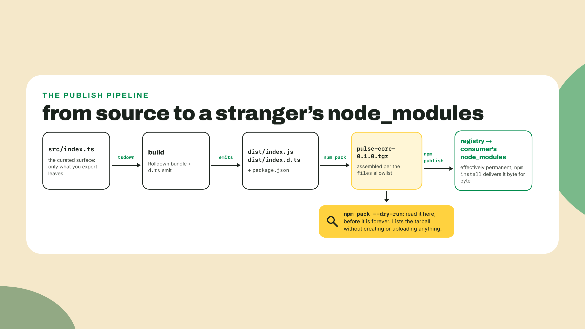
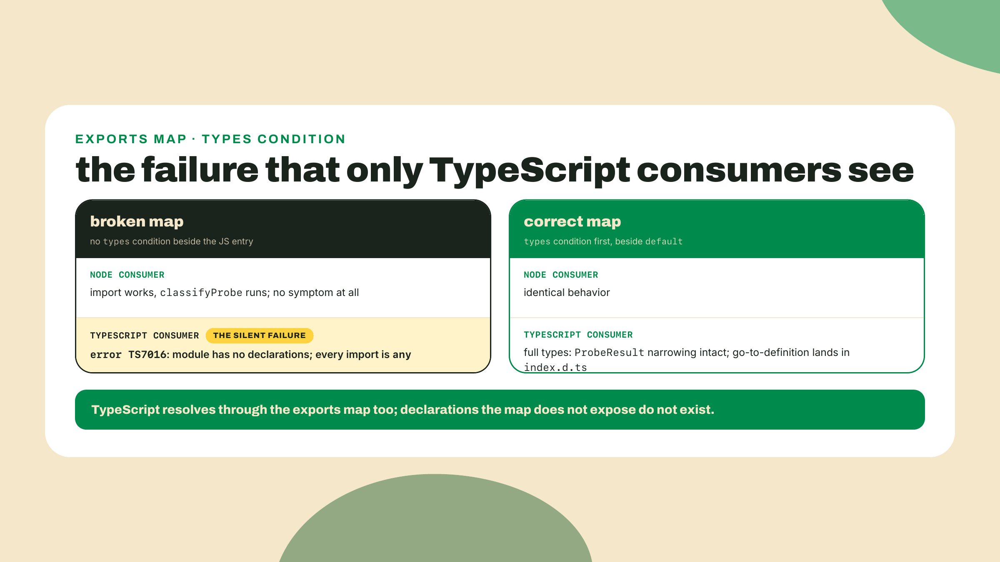
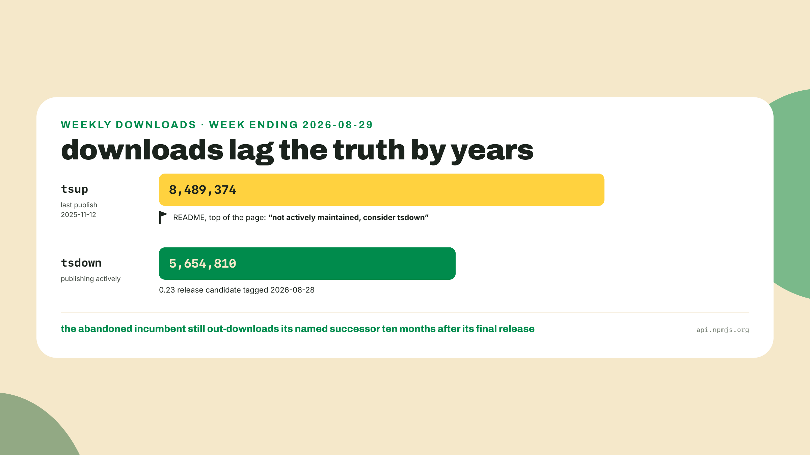
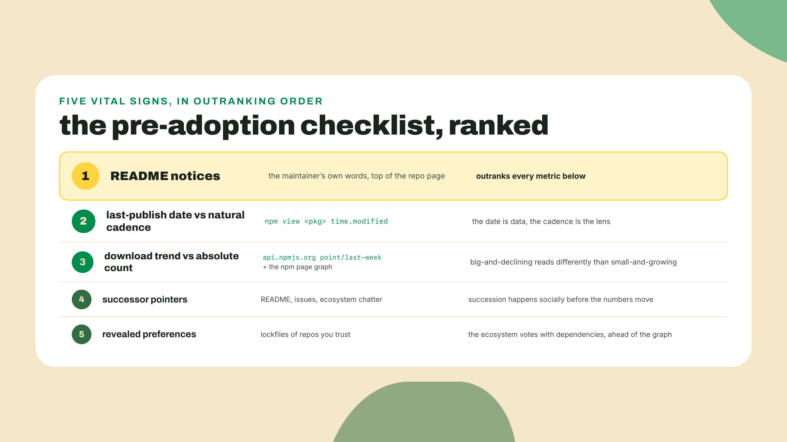
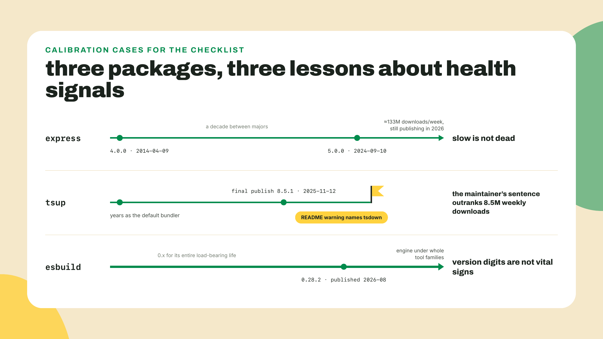
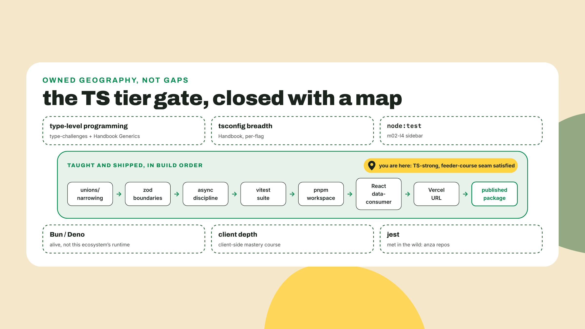
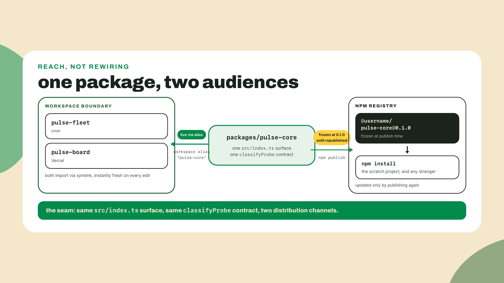

# Publish something real: tsdown and the signs of a dying dep

## Summary

Last lesson shipped the first URL: pulse-board live on Vercel, poked from a stranger's phone. The station has a public face, but not yet a public engine: `pulse-core`, the classifier every part of the station agrees on, still lives only inside your workspace, importable by your packages and nobody else's. Today is the module's victory lap. You build `pulse-core` with a real build tool, read the tarball you are about to hand the world, publish it to npm as a scoped public package, and prove it installs for a stranger. Then the lesson teaches the skill hiding inside the tool choice: reading whether a dependency is alive before you adopt it, using the build tool we just picked as the worked example, because the tool it replaced is teaching that lesson about itself in its own README.

Most developers publish their first package without ever looking inside it. You will not be one of them. Do this right now, from the workspace root:

```bash
cd packages/pulse-core
pnpm add -D tsdown@0.22.14 typescript
npx tsdown src/index.ts
npm pack --dry-run
```

That pin is current as of 2026-09-02; tsdown has a 0.23 release candidate already tagged, so expect a higher digit by the time you type this, and take whatever `pnpm add -D tsdown` gives you if the pin has aged. The `typescript` line is there because pnpm's strict layout means a package must declare what its build uses, even when the workspace root already has it.

The last command printed a file listing. Read it slowly, every line, like a stranger would, because in about twenty minutes a stranger CAN. Mine showed `dist/index.mjs`, `package.json`, and then every file of `src/` riding along uninvited (three in a repo that followed the labs: `index.ts`, the classifier, the backoff helpers). Yours will look similar. Notice what is NOT there too: no type declarations at all, which for a package whose whole value is its union types would be a silent catastrophe; the build section below explains why the zero-config run couldn't emit them and fixes it. That listing is the exact contents of what `npm publish` would upload today, and today it is a mess. The whole first half of this lesson is turning that listing into a contract.

The autonomy fade, stated out loud: the build configuration and the exports wiring we do together, walked line by line. The publish and the scratch-project proof you run yourself from a checklist. The closing drill, reading the vital signs of three real packages, is fully unguided, and it is the last rung of the TypeScript tier's ladder. Next module restarts the ladder from the bottom for a new language.

## The tarball and the vital signs

### What a build step buys, and what tsdown is

Until now `pulse-core` shipped raw TypeScript source and got away with it, because every consumer lived in the same workspace and spoke TypeScript through the same tooling. m03-l1 said the publish lesson would change that, and this is the publish lesson. A stranger's project cannot be assumed to compile your `.ts` files; some runtimes experiment with running TypeScript directly, but a published library that requires it has shrunk its audience for no reason. So a package headed for the registry ships two artifacts: compiled JavaScript for every runtime, and `.d.ts` type declarations so TypeScript consumers keep every guarantee the union types earned in M2. One source, two outputs, and a tool whose whole job is emitting both correctly.

That tool, for us, is tsdown. It is the successor to tsup, the long-reigning default for exactly this job, and the reason we reach past the incumbent is the second half of this lesson, so hold the question for a few sections. Mechanically: tsdown bundles your entry point with Rolldown, the Rust bundler that also powers Vite 8, and can emit declarations beside the JavaScript. You already ran it once with zero config. Two observations from that run are worth pinning before we configure it.

First, it wrote `index.mjs`, not `index.js`. tsdown defaults to extensions that scream "ESM" no matter what the surrounding `package.json` says, which is defensive engineering for packages that dual-ship formats. Our package declared `"type": "module"` back in m03-l1, plain `.js` is already ESM here, and matching the extension the rest of our workspace expects keeps the exports map boring. So we turn that default off.

Second, the missing declarations. Declaration emit is TypeScript's job, tsdown just orchestrates it, and the TypeScript machinery refuses to run without a `tsconfig.json` in the package. `pulse-core` has never had one: the m03-l1 extraction moved the repo's only tsconfig into `pulse-fleet` along with everything else, and nothing since has needed one here, because vitest and the workspace consumers all resolved raw source. The build step is where that free ride ends. Ask for declarations without a tsconfig and the build dies with `ERROR Error: tsgo generator requires a tsconfig file to be specified.` So the package gets its own contract-with-the-compiler first, `packages/pulse-core/tsconfig.json`, minimal and strict, matching the settings the fleet has used all course:

```json
{
  "compilerOptions": {
    "target": "es2023",
    "module": "nodenext",
    "moduleResolution": "nodenext",
    "strict": true,
    "declaration": true,
    "skipLibCheck": true
  },
  "include": ["src"]
}
```

Now the tsdown configuration, `packages/pulse-core/tsdown.config.ts`:

```ts
import { defineConfig } from "tsdown";

export default defineConfig({
  entry: ["src/index.ts"],
  format: "esm",
  dts: true,
  fixedExtension: false,
});
```

Four lines, each earning its place: the entry is the same curated `src/index.ts` that has been the public surface since the extraction, `format` is ESM because this course ships one module system, `dts` asks for declarations (which is why the tsconfig above had to exist), and `fixedExtension: false` is the opt-out that gets us `.js` and `.d.ts`. One cosmetic note for this run and every one after it: expect a `WARN TypeScript 7.0 does not yet have a stable API and is experimental` line. As of this writing (2026-09-02, tsdown 0.22.14 against typescript 7.0.2, the current stable) it is exactly what it says, a warning; declarations emit fine. Version-note it and move on. Add the script to `packages/pulse-core/package.json`:

```json
{
  "scripts": {
    "build": "tsdown"
  }
}
```

Run `pnpm build` from the package directory and `dist/` now holds `index.js` and `index.d.ts`. Total output for our little engine: two or three kilobytes. Small is correct; this package is three modules of pure logic, and the tarball size is about to become something you read, not something you guess at.



### The dual concern: types must travel with the JavaScript

The exports map has been the package's front door since m03-l1: an allowlist of entry points, deep imports refused with `ERR_PACKAGE_PATH_NOT_EXPORTED`. It currently points at TypeScript source. Point it at the built output instead, and note that the value for `"."` grows from a string into an object with two conditions:

```json
{
  "exports": {
    ".": {
      "types": "./dist/index.d.ts",
      "default": "./dist/index.js"
    }
  }
}
```

This is the dual concern at the heart of publishing typed packages, and it deserves the emphasis. Under modern resolution (the `nodenext` family your consumers' tsconfigs use), TypeScript walks the exports map to find types, the same map Node walks to find JavaScript. Two resolvers, one map. The `types` condition must sit right there beside the JavaScript entry it describes, and order matters: `types` goes first in the conditions object, because resolvers take the first condition that matches and `default` matches everything.

Skip it and you manufacture the most confusing bug report a library author gets: the JavaScript imports and runs perfectly, and TypeScript consumers cannot find your module. I broke this deliberately in a scratch project while writing this lesson, by parking the declarations somewhere the map does not point, and the error is worth reading in full because one day a consumer will paste it at you:

```text
error TS7016: Could not find a declaration file for module '@kaue/pulse-core'.
  There are types at '.../node_modules/@kaue/pulse-core/types/index.d.ts',
  but this result could not be resolved when respecting package.json "exports".
  The '@kaue/pulse-core' library may need to update its package.json or typings.
```

Read the middle line twice. TypeScript FOUND the declarations. It refused to use them, because when an exports map exists it governs everything, and a file the map does not expose might as well not exist. The JavaScript kept running the entire time. That asymmetry, working JS with invisible types, is exactly what the scratch-project proof in the lab exists to catch before a stranger does.



One consequence of repointing the map, said plainly so it never surprises you: your workspace consumers now resolve `dist/` too. The board and the fleet need `pulse-core` built before their own tooling can see it, so a fresh clone runs the core's build once before anything else, and while actively editing core code you keep `npx tsdown --watch` running so consumers always see fresh output. And "fresh clone" is not hypothetical: two of your automated consumers are fresh clones on every run, so wire the build into both NOW, before the next push turns them red. In `.github/workflows/pulse.yml`, add one step right after the `pnpm install --frozen-lockfile` line in all three jobs:

```yaml
      - run: pnpm --filter pulse-core build
```

(The filter matches the package's `name` field; when the lab renames the core to your npm scope, update all three filters to the scoped name.) And for the git-connected Vercel deploy, which builds the board from its own fresh clone, prefix the board's build script in `packages/pulse-board/package.json` so the core is always built first:

```json
{
  "scripts": {
    "build": "pnpm --filter pulse-core build && tsc -b && vite build"
  }
}
```

That one edit also fixes any future collaborator's first local `npm run build`. Skip either wiring and the failure arrives on the next push, in someone else's logs, two surfaces away from this paragraph. That is the honest cost of one map serving both audiences. The deeper pattern, letting the workspace resolve source while only the published artifact points at dist, exists in pnpm's `publishConfig` overrides, and it is bookmark territory, not today's path.

### The tarball is the product

Now fix the listing you read at the top. What `npm publish` uploads is exactly what `npm pack` assembles, and what npm packs is, by default, nearly everything in the folder: source, config files, stray notes, whatever `.env`-shaped thing wandered in. Nothing is stripped later. The tarball IS the deliverable; whatever the listing shows is what lands, byte for byte, in every consumer's `node_modules`, and thanks to npm's heavily restricted unpublish policy it is effectively forever. The fix is the `files` field, an allowlist, the same philosophy as the exports map one layer down:

```json
{
  "files": ["dist"]
}
```

`package.json` itself, the README, and license files always ship regardless, which is what you want. Run the pre-flight again, `npm pack --dry-run`, and the listing collapses to three entries:

```text
npm notice 📦  pulse-core@0.1.0
npm notice Tarball Contents
npm notice 510B dist/index.d.ts
npm notice 607B dist/index.js
npm notice 374B package.json
```

Sizes will differ; the shape should not. Compiled output, declarations, manifest, nothing else. No `src/`, no config, no test files, nothing environment-shaped. This dry-run-before-publish habit costs twenty seconds and is the single cheapest professionalism-and-security habit in this course. The story of what happens when the registry side of this goes wrong is the opener of the dependency-audit lesson late in the course; for now, the rule is enough: read the listing, every time, before the tarball becomes permanent.

Two publishing facts complete the pattern. First, names: `pulse-core` as a bare name belongs to whoever registered it first, so you publish under your scope, the `@username/` prefix every npm account gets for free, where you own the namespace outright. Second, a lab gotcha worth pre-empting: scoped packages default to PRIVATE on first publish, private packages are a paid feature, and so a plain `npm publish` of a scoped package on a free account fails with an error about payment that reads like a billing bug. It is not. It is npm asking which visibility you meant. The flag `--access public` is the answer, and forgetting it is a rite of passage this paragraph just saved you from.

**Go deeper (the 20%).** this lesson taught the publish mechanics our artifact exercises: build, exports, files, pack, publish. The rest of the shipping-a-library world, watch workflows, multiple entry points, platform targets, unbundling choices, lives in the [tsdown docs](https://tsdown.dev/guide/) (URL probed 2026-09-02), and the automation layer above it all, changesets, CI-driven publishing, provenance attestations, is real machinery this course deliberately signposts instead of teaching. Nothing in the lab depends on any of it.

### Reading the vital signs of a dependency

Now the question I parked: why tsdown and not tsup, the tool with years of incumbency and, to this day, more downloads?

Because tsup's own README answers it in its first sentence. At the top, above the project's name, sits a maintainer warning: "This project is not actively maintained anymore. Please consider using tsdown instead." One sentence, written by the person who would know, in 2025, and it may be the single most honest sentence the ecosystem produced that year. The numbers around it make the case study perfect. tsup's last publish is 8.5.1, dated 2025-11-12. Its downloads for the week ending 2026-08-29: about 8.5 million. tsdown, the named successor, actively publishing, same week: about 5.7 million. The abandoned tool still out-downloads its own replacement, ten months after its final release, and serious repos still depend on it; anza's kit workspace and the gill SDK both build with tsup today.

Sit with that tension, because it is the meta-skill of this entire lesson: download counts are a lagging indicator with years of inertia baked in. Every existing lockfile, tutorial, and template keeps pulling tsup long after its author told everyone to leave. The market's vote is old information. The README is today's. You are always one README sentence away from an abandoned dependency, and the entire skill is knowing to look for the sentence before you install, not after.

And one thing should be said in tsup's defense, because the lesson is about reading signals, not mocking the fallen: that warning is GOOD maintainership. The author shipped a tool the whole ecosystem leaned on, and when they stopped maintaining it they said so, plainly, at the top, with a successor named and a migration guide linked. Compare the alternative you will meet constantly in the wild: packages that just quietly stop, no notice, issues accumulating, downloads chugging along. An honest abdication note is a gift. Learn to receive it.



So systematize it. Before adopting a dependency, five signals, in ranked order:

1. **README notices.** The maintainer's own words outrank every metric on this list. Deprecation warnings, "looking for maintainers", successor pointers. Thirty seconds on the repo page.
2. **Last-publish date, read against the project's natural cadence.** `npm view <pkg> time.modified` gives the date; the judgment is contextual. A feature-complete utility can go quiet and be fine; a bundler tracking a moving ecosystem that goes silent for a year is a different story. The date is data, the cadence is the lens.
3. **Download trend versus absolute count.** `curl -s https://api.npmjs.org/downloads/point/last-week/<pkg>` for the snapshot, the npm page graph for the shape. tsdown's 5.7 million as a young successor is a stronger vitality signal than tsup's larger, older, declining number.
4. **Successor pointers.** When the README, the issues, or the ecosystem's chatter all point somewhere specific, the succession has already happened socially even if the numbers have not caught up.
5. **Revealed preferences of repos you trust.** What do the codebases you already read depend on? When the repos you respect start migrating, that is the ecosystem voting with its lockfiles, ahead of the download graph.



Two more worked reads calibrate the checklist against its failure modes, because a checklist you only ran on one package teaches the wrong lesson.

Express, the failure mode of impatience. Express 4.0.0 published 2014-04-09. Express 5.0.0: 2024-09-10, registry dates, one decade and five months between majors. By a "recent major version" test, Express spent ten years looking dead while moving what is now about 133 million downloads a week, nine figures, with maintenance releases continuing right through this summer. Slow is not dead. A mature package at rest is often just done, and the checklist reads maintainer signals against cadence precisely so it never mistakes stability for abandonment.

esbuild, the failure mode of version-number superstition. esbuild sits at 0.28.2 as of this writing, zero-point-x after years as one of the most load-bearing tools in the JavaScript world; it is the engine tsup itself was built on, and it published within the last month. Meanwhile plenty of packages wearing a confident 2.x or 3.x have not seen a commit in years. Version digits are branding. They are not vital signs, and nothing on the five-signal list asks for one.



The trade-off that completes the picture, and it points at you now: publishing is a commitment dressed as a milestone. The moment version 0.1.0 exists on the registry, every consumer's lockfile is a promise you are keeping, semver discipline, changelogs, security response, the works, and an abandoned package WITH users is worse than no package at all, because at that point you have become the tsup README, hopefully with its honesty. So name the honest scope of today: you publish to learn the mechanics and to claim a real portfolio piece, a defensible thing for a 0.x package with one known consumer, you. Adopt the maintenance burden deliberately only for code you genuinely want strangers running. The checklist cuts both ways; one day someone runs it on you, and the kindest thing your future ghost package can do is say so at the top of its README.

This five-signal read returns late in the course, systematized into a written audit verdict in the dependency-audit lab, where the stakes stop being tool choice and start being supply chain.

### The tier gate: what M1 through M3 skipped, and where it lives

The TypeScript tier ends at this lesson, so the course owes you the map it promised in m01-l1: what we deliberately did not teach, and the named home of each piece. This is owed territory, not apology. The 80% you now hold is real: unions and narrowing, boundaries and zod, async discipline, a tested cron, a workspace, a dashboard, a URL, and as of today a published package. The 20% was never missing. It was filed:

- **Type-level programming and generics authoring.** You consume generics fluently (`z.infer`, `ReturnType`, the m02-l2 toolkit); you do not yet write conditional and mapped types. The drill yard is type-challenges (m02-l1's after-M2 gym) plus the Handbook's Generics chapter. Go when a library's type signature makes you curious instead of tired.
- **The full tsconfig surface.** You own the strict canon from m01-l2's table; the remaining several dozen flags get looked up per-flag, on demand, forever. Nobody memorizes them. Now you know that.
- **node:test.** The zero-dependency runner got its honest sidebar in m02-l4; vitest is this course's lane. If a dependency-free context wants tests, the sidebar is the on-ramp.
- **Bun and Deno.** Both alive and shipping (Bun 1.4, Deno 2.9, both with late-August 2026 releases). This course runs Node because the surveyed Solana ecosystem does: every studied repo declares Node engines and a pnpm packageManager pin, none declare Bun or Deno. Positioning, not disdain; revisit signal five in a year and see if the lockfiles moved.
- **React beyond the data-consumer slice, and everything client.** Routing, forms, state libraries, wallet UX, transaction landing: that is the client-side mastery course's territory, in production as I write, and the TS strength you now hold is exactly the foundation that kind of work builds on.
- **jest.** Named, not taught: it is vitest's older sibling and you will meet it in anza's repositories. The API surface is close enough that your vitest fluency mostly transfers.

That is the whole gate. Every bookmark has an address, every address has a trigger for when to visit, and the map you got in the course opener just gained its first "you are here" pin: TS-strong, with the 20% locations memorized.



## Lab: pulse-core, published

The worked half is done: the build runs, the exports map carries types beside JavaScript, the tarball is clean. What remains is yours, from a checklist. You will need a free npm account: sign up at npmjs.com if you have not, and note your username, because it is about to become a namespace.

1. **Claim your scope in the name.** In `packages/pulse-core/package.json`, change the name to your scope: `"name": "@YOUR_NPM_USERNAME/pulse-core"`. Registry names must be unique; your scope is the corner of the registry where uniqueness is your problem alone.

2. **Re-link the consumers without touching an import.** The fleet and the board import from `"pulse-core"`, and the pnpm workspace protocol has an alias form built for exactly this rename. In `packages/pulse-fleet/package.json` and `packages/pulse-board/package.json`, change the dependency line:

   ```json
   {
     "dependencies": {
       "pulse-core": "workspace:@YOUR_NPM_USERNAME/pulse-core@*"
     }
   }
   ```

   Then `pnpm install` from the root. The alias says: the local specifier `pulse-core` resolves to the workspace package now named `@YOUR_NPM_USERNAME/pulse-core`. Every `import { classifyProbe } from "pulse-core"` line across the station keeps working, verbatim. Checkpoint: `pnpm -r test` green from the root, zero import lines changed.

3. **Build and pre-flight.** From `packages/pulse-core`: `pnpm build`, then `npm pack --dry-run`. Acceptance is the clean shape from the theory section: `dist/index.js`, `dist/index.d.ts`, `package.json`, nothing else. If anything extra appears, the `files` field is your allowlist; fix it and re-run the dry-run until the listing is boring.

4. **Publish.** Two commands, one flag that matters:

   ```bash
   npm login
   npm publish --access public
   ```

   `npm login` bounces through the browser. The `--access public` flag is the gotcha from the theory section: without it, a scoped first publish fails with an error about payment plans, because scoped packages default private and private is paid. With it, the terminal prints your package name and version, and that is the whole ceremony. `@YOUR_NPM_USERNAME/pulse-core@0.1.0` now exists on the public registry. Go look at its page on npmjs.com; you have a shipped-artifacts page now. It will say no README was found, truthfully, because the clean tarball you inspected in step 3 contains none; writing one is the first post-ship polish this lesson leaves to you.

5. **Prove it like a stranger.** Somewhere OUTSIDE the workspace, your home directory, anywhere:

   ```bash
   mkdir pulse-scratch && cd pulse-scratch
   npm init -y
   npm pkg set type=module
   npm i @YOUR_NPM_USERNAME/pulse-core
   ```

   Then `smoke.mjs`:

   ```js
   import { classifyProbe } from "@YOUR_NPM_USERNAME/pulse-core";

   console.log(classifyProbe("ok", 240));
   console.log(classifyProbe("ok", 700));
   ```

   `node smoke.mjs` should print `up` then `degraded`, straight from the m02-l1 contract: under 400 is up, 400 through 1000 is degraded. This is your code, installed from the public internet, running the same judgment your cron publishes with. If you want the full proof, run `npm i -D typescript` (a bare `npx tsc` in a project without it resolves the wrong registry package, a deprecated stub named `tsc`), add a `tsconfig.json` with `"module": "nodenext"` strict settings and a `.ts` file importing `ProbeResult`; `npx tsc --noEmit` passing proves the types traveled. This step is the one that catches the invisible-types failure from the theory section, which is why it is a step and not a suggestion.

6. **Say the wiring truth out loud.** Back in the workspace: `pnpm -r test`, still green. Open the board, still rendering. And since the rename just happened, finish the theory section's pipeline wiring: update the `pnpm --filter` in all three `pulse.yml` jobs and in the board's build script to the new scoped name, push, and watch the Actions run and the Vercel deploy both stay green from their own fresh clones. Only then is the claim honest everywhere, not just on the laptop where `dist/` already exists. Nothing about the station consumes the npm copy; the cron and the dashboard resolve the workspace copy through the alias, same symlink as yesterday. Publishing changed the package's REACH, not the station's wiring. Two copies of the truth now exist, workspace for you, registry for strangers, and keeping them honest with each other is what version numbers are for, a discipline the Rust tier will meet again from the cargo side.



## Challenge: three verdicts, no guardrails

The unguided drill, and the tier's last rep. Run the five-signal checklist on these three real packages: `request`, `body-parser`, and `zod`. For each, write a one-paragraph verdict, adopt, avoid, or adopt-with-eyes-open, citing at least two concrete signals you personally checked: a README or registry notice, a last-publish date read against cadence, a download figure with its date, a successor pointer, or a named repo's revealed preference. The commands are already in your hands: `npm view <pkg>`, `npm view <pkg> time.modified`, the downloads endpoint, and the repo page. One of these three is in strong health, one has been telling people to leave for years while millions keep arriving weekly, and one sits somewhere more interesting; I am not telling you which is which, because reading that cold is the entire skill. Acceptance: three paragraphs, every claim checkable, and at least one verdict that surprised you enough to double-check it.

## Checkpoint, and the language handoff

What you can now do, concretely: take a workspace package from TypeScript source to a public, scoped, installable npm artifact with types that travel; read a tarball listing as a pre-flight and keep it clean with an allowlist; and read a dependency's vital signs in ranked order before adopting it. The 30-second retrieval before you close the tab: name the two signals that outrank download counts when judging a dependency's health. Say them out loud. The maintainer's own README notice, and the last-publish date read against the project's natural cadence. If those two came instantly, the meta-skill is installed.

Two asks while it is fresh. First, drop your package's npm URL next to the Vercel URL from last lesson, bio or README, wherever the first one went; the portfolio compounds. Second, note in your course journal which lab step fought you, the rename, the access flag, the scratch proof, because the Rust tier publishes to a registry too and your friction list is the checklist you will want open when crates.io asks the same questions with different spelling.

The TypeScript tier is complete: typed fleet, tested cron, workspace, dashboard, URL, published package. Every promise from the m01-l1 map, kept and shipped. Next module the same probe engine gets rebuilt under a compiler that refuses to guess: ownership, the borrow checker, and your first E0382, on purpose, inside ten minutes. It will feel like the strictest code review of your life, and it is the one review you cannot skip. Bring the published package tag and a thick skin.
