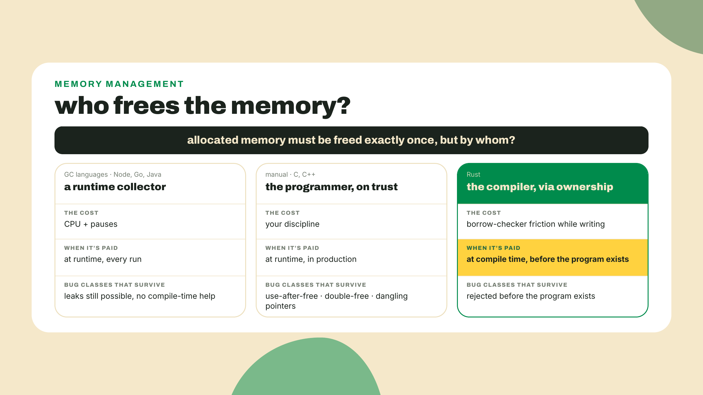
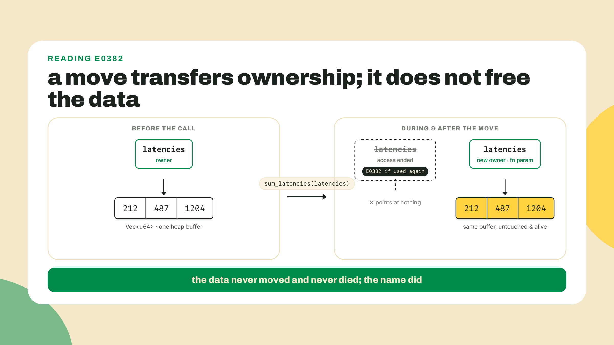
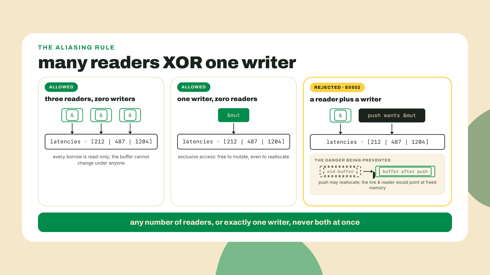
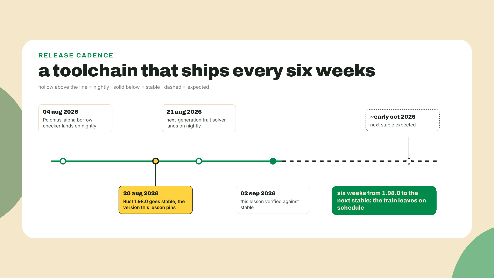
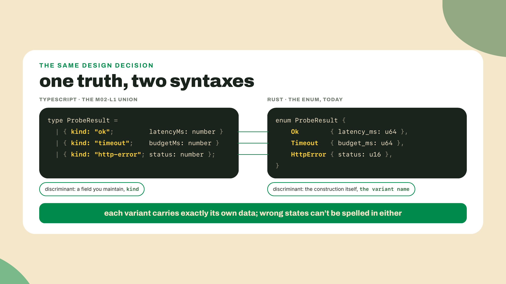
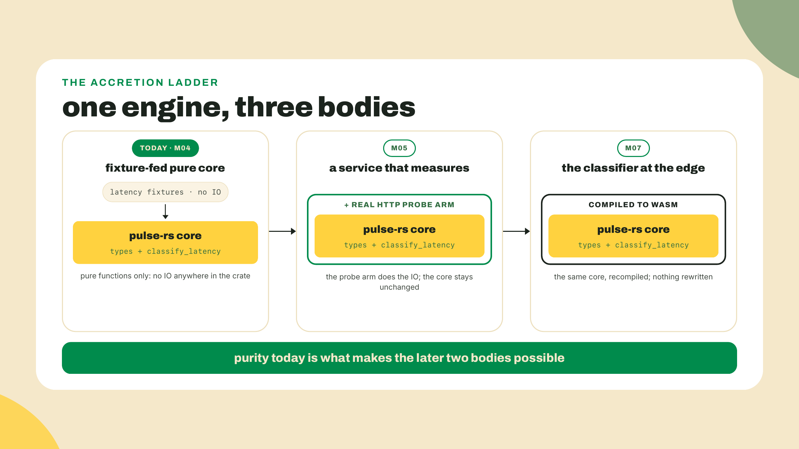

# Ownership is the point

## Summary

M3 closed the TypeScript tier: `pulse-core` is published on npm, the dashboard is live on Vercel, and the tier gate named exactly what we skipped. The TS half of the station is shipped and gated. Now the second language begins, and it begins with a fight. Within ten minutes you will install the Rust toolchain, scaffold `pulse-rs`, paste five innocent lines, and get refused by a compiler for code that TypeScript would run without blinking. The whole lesson is why that refusal is the feature you came for. One heads-up about how this module works: M4 runs at the finest grain of the entire course. Everything here is either worked with me or repair-a-given-snippet. You never author from a blank file; the only unguided rep is the challenge at the end.

## Break something first

Install the toolchain. rustup is the installer, the whole thing, one command on macOS or Linux:

```bash
curl --proto '=https' --tlsv1.2 -sSf https://sh.rustup.rs | sh
```

On Windows, download and run `rustup-init.exe` from the same site. Restart your shell, then confirm:

```bash
rustc --version
cargo --version
```

You should see rustc 1.98.0 or later (1.98.0 went stable on 2026-08-20; checked 2026-09-02, and since a new stable ships every six weeks, your digit may already be higher, which is fine). Now scaffold the Rust half of the station and run it. Do it from the root of your station repo, the one holding `packages/` and `pnpm-workspace.yaml`, because `pulse-rs` is the station's Rust half, not a side project: it lives inside the repo, next to `packages/`, and m04-l3 wires it into the station's own CI on exactly that assumption.

```bash
cargo new pulse-rs
cd pulse-rs
cargo run
```

Hello, world. Cargo is npm, tsc, and vitest in one binary, and we will tour it properly in a later lesson. Today it exists to compile your first rejection. Replace everything in `src/main.rs` with this:

```rust
fn sum_latencies(latencies: Vec<u64>) -> u64 {
    latencies.iter().sum()
}

fn main() {
    let latencies = vec![212, 487, 1204];
    let total = sum_latencies(latencies);
    println!("total: {total} across {} probes", latencies.len());
}
```

Read it as the TypeScript developer you now are: make an array, pass it to a helper, print the sum and the length. In TS this is a Tuesday. Run `cargo check` (compiles without producing a binary, your fast feedback loop from here on):

```text
error[E0382]: borrow of moved value: `latencies`
 --> src/main.rs:8:49
  |
6 |     let latencies = vec![212, 487, 1204];
  |         --------- move occurs because `latencies` has type `Vec<u64>`,
  |                   which does not implement the `Copy` trait
7 |     let total = sum_latencies(latencies);
  |                               --------- value moved here
8 |     println!("total: {total} across {} probes", latencies.len());
  |                                                 ^^^^^^^^^ value borrowed here after move
```

E0382. Use of moved value. The compiler refused a program that would run correctly, today, on your machine, in any GC language. Sit with how unreasonable that feels for a second, because the rest of this lesson is the argument that it is the most reasonable thing a compiler has ever done to you. Leave the error in place. We fix it in the lab, on purpose, the principled way.

## The rules, derived from the problem

### Somebody has to free it

Start from the fact every language lives with: when your program makes a `Vec` of latencies, memory gets allocated, and at some point that memory has to be given back. By somebody. There is no fourth option, only three answers to "who?"

Answer one: a garbage collector. Node, Java, Go, Python. A runtime watches your objects, figures out which ones nothing points to anymore, and frees them. You write code as if memory were infinite, and you pay for the illusion at runtime: the collector consumes CPU, and it pauses your program on its own schedule, not yours. For the fleet's dashboard that cost is invisible. For a validator client or a trading system, a pause at the wrong millisecond is real money, which is one honest reason so much of the Solana stack is Rust.

Answer two: you. C and C++. You call `free` when you are done, and the compiler trusts you completely. The failure modes of that trust have names you have heard even if you have never written C: use-after-free, double-free, dangling pointer. Decades of security advisories are the receipts.

Answer three, the Rust answer: make "who frees this?" a property of the code itself, decided at compile time. Every value has exactly one owner, the variable responsible for it. When the owner goes out of scope, the value is freed, deterministically, no collector involved. That is the first ownership rule, and notice you did not memorize it, you derived it: if cleanup must happen exactly once with no runtime watching, exactly one binding must be on the hook for it.



### The move, and why your snippet died

Follow the rule into the snippet. `let latencies = vec![...]` makes `latencies` the owner. Then `sum_latencies(latencies)` passes the `Vec` by value, and here Rust does something TS never made you think about: ownership transfers. The parameter inside the helper is the new owner; it will free the memory when the function ends. So what is `latencies` in `main` after that line? If Rust let you keep using it, two bindings would both believe they own the same allocation. Two owners means either double cleanup, freeing the same memory twice, or ambiguous mutation, two places entitled to change one thing without the other knowing. So the old binding's access simply ends. That is a move, and E0382 is the compiler telling you, precisely: this value has a new owner, your name is no longer on it.

Notice what the error is not saying. Nothing was freed early. The data is alive and well inside the helper. The rejection is not about dangling memory; it is about ambiguity, about the question "who owns this?" momentarily having two answers. Rust's entire bet is that ambiguity, not allocation, is where the bodies are buried.



### Borrowing: use it without owning it

The helper never wanted to own the latencies. It wanted to read them for a moment and give them back. Rust has a word for exactly that: a borrow. Write `&latencies` and you hand the function a reference, permission to read, ownership unmoved. The helper's signature declares it accepts borrowed data by taking `&[u64]`, a slice, which is "a view into a run of u64s" and the standard way to accept borrowed list data (a `&Vec<u64>` coerces into it automatically, so one signature serves everybody). This is the daily-use move of the whole language. When you watch working Rust programmers, the overwhelming majority of function parameters are borrows, because most functions are guests, not heirs.

Then there is the second kind of borrow, and with it the second rule, which you can also derive instead of memorize. Suppose one part of your code holds `let worst = &latencies[2];`, a reader, while another calls `latencies.push(90)`, a writer. A push can reallocate the Vec's buffer, moving every element to a new address, at which point `worst` points at freed memory. In C that is a Tuesday too, the segfault kind. So what must the rule be, if this is to be caught at compile time? Readers and writers cannot overlap. Any number of shared borrows (`&`), OR exactly one exclusive borrow (`&mut`), never both at once. Try the overlap and you get the sibling of your opener:

```text
error[E0502]: cannot borrow `latencies` as mutable because it is also borrowed as immutable
```

Think of a shared spreadsheet: any number of people can view it at once, but the moment someone holds the edit lock, viewers see a consistent frozen state or nobody edits. The analogy breaks in one place worth naming: the spreadsheet enforces the lock at runtime, while Rust enforces it before the program exists, which is why the same rule that saves `worst` from a reallocated buffer is also, in multithreaded code, the rule that makes data races unrepresentable. One writer XOR many readers is the data-race rule wearing single-threaded clothing, and you just met it in a five-line file.



So the three rules, none of them recited, all of them forced by the problem: every value has one owner; ownership moves when you hand the value itself away; borrows let you lend access, many readers XOR one writer. Here is the collapse, and it is this module's handle, so keep it: the borrow checker is the code review you can't skip. Every rejection in this lesson is a comment a careful senior would have left on your PR, "who owns this after line 7?", "you're mutating a list someone else is reading". The checker is not stopping you from doing the thing. It is stopping you from doing the thing ambiguously. You already ship working TypeScript; you are not being demoted, you are getting the review earlier, from a reviewer that never gets tired.

And this reviewer is a living project, not a frozen spec. Polonius-alpha, a next-generation formulation of the borrow checker that accepts more correct programs, landed on nightly on 2026-08-04, and the next-generation trait solver followed on 2026-08-21, seventeen days later. Fights you lose today at the margins are fights the checker is learning to concede where you were right all along. The code review you can't skip is still getting smarter.

### The box rustup gave you

Short and honest, because you will hear myths. The stable toolchain you just installed is not a bare compiler. clippy (the linter) and rustfmt (the formatter) arrive installed with the default rustup profile, and rust-analyzer (the IDE engine your editor speaks to) is a stable-channel rustup component too, though that one is a `rustup component add rust-analyzer` away rather than preinstalled, and most editors' Rust extensions fetch their own copy anyway. First-party tools, not third-party add-ons. The one tool people expect in the box and do not get is miri, the interpreter that catches undefined behavior in unsafe code: miri is nightly-only. You will not need it this course, and now you will not go install a third-party substitute for tools you already own. Two habits start today and never stop: `cargo fmt` before you commit, `cargo clippy` before you push. They are this language's Prettier and ESLint except nobody debates the config.



### What this costs you

The trade-off, named plainly: you pay in fights. The borrow checker rejects programs a GC language would happily and correctly run, and beginners lose real hours restructuring code that "was fine". Those hours buy you no GC pauses, no use-after-free, no data races, and cleanup that happens at a line you can point to. Whether that trade is worth it depends on what you build; for the infrastructure this stack runs on, the industry has voted.

And know when not to fight. `.clone()` makes an independent copy with its own owner, and a clone in cold code, a config struct copied once at startup, is often the correct engineering call, not a defeat. The sin is the reflexive clone: E0382 appears, you sprinkle `.clone()`, it compiles, and you learn nothing. I cloned my way through my own first weeks of Rust, big time, and the habit cost me twice, once in allocations and once in never hearing what the checker was trying to tell me. In this module the clone escape hatch is named and then locked: every repair below must be a borrow-based fix, and the challenge's no-clone rule is one you enforce on yourself (its tests grade inputs and outputs, so a cloned solution would pass them, and prove nothing).

**Go deeper (the 20%).** this lesson taught you why ownership exists and the daily moves, move, `&`, `&mut`, and the honest role of clone. The full progression, stack versus heap, how a String is laid out, slice mechanics, lives in the ownership chapter of the Book, and the version to read is Brown University's interactive fork, with built-in quizzes and Aquascope visualizations that animate exactly the moves and borrows you just met: [https://rust-book.cs.brown.edu/ch04-00-understanding-ownership.html](https://rust-book.cs.brown.edu/ch04-00-understanding-ownership.html). That fork exists because ownership is hard enough to have spawned an academic research program: Brown's Cognitive Engineering Lab built it on peer-reviewed OOPSLA 2023 and 2024 research about how people actually learn this model. Bookmark it, do ch04 with the quizzes this week. And after every M4 lesson, Rustlings (`cargo install rustlings`, then `rustlings init` and `rustlings`) is the drill yard: small fix-the-code exercises, the same completion-loop shape as this module, maintained by the Rust project itself. The lab below needs none of the bookmarked material.

## Lab: mirror the fleet in Rust

The rewrite begins. `pulse-rs` becomes the Rust twin of your probe engine's types, and the M2 TypeScript goes on screen right next to the new Rust, because you already designed these types once and I refuse to pretend otherwise.

1. **Fix the opener, the principled way.** The compiler's own note already told you: the helper should borrow. Change the signature to a slice and lend at the call site:

   ```rust
   fn sum_latencies(latencies: &[u64]) -> u64 {
       latencies.iter().sum()
   }

   fn main() {
       let latencies = vec![212, 487, 1204];
       let total = sum_latencies(&latencies);
       println!("total: {total} across {} probes", latencies.len());
   }
   ```

   `cargo check` goes green, `cargo run` prints `total: 1903 across 3 probes`. Two characters of punctuation, and `main` still owns its Vec, lends it once, and uses it after. That is the fix pattern you will apply all module: not "make the error go away" but "say who owns and who borrows".

2. **Put the TS spec on screen.** Open your `pulse-core` from M2 next to `pulse-rs`. This is the side-by-side moment; here is the TypeScript you shipped, minus one arm. Your fleet's real union carries a fourth variant, `{ kind: 'dns-error'; host: string }`, the one m02-l1's drill added; today's port mirrors the three below and consciously leaves dns-error out, the same trimming any port does when it starts from the load-bearing core:

   ```ts
   type ProbeResult =
     | { kind: 'ok'; latencyMs: number }
     | { kind: 'timeout'; budgetMs: number }
     | { kind: 'http-error'; status: number };

   type Verdict = 'up' | 'degraded' | 'down';
   ```

3. **Model the same truth in Rust.** Replace `src/main.rs` with the types, variant for variant. Two newcomers: a struct for the probe target (a record type, fields and nothing else) and the newtype pattern, `LatencyMs(u64)`, a one-field struct that costs nothing at runtime but stops you from ever passing a port number where a latency belongs. In M2 you bought this safety with literal types; here it is a free wrapper:

   ```rust
   #[derive(Debug)]
   struct ProbeTarget {
       name: String,
       url: String,
   }

   #[derive(Debug, Clone, Copy, PartialEq, Eq)]
   struct LatencyMs(u64);

   #[derive(Debug)]
   enum ProbeResult {
       Ok { latency: LatencyMs },
       Timeout { budget: LatencyMs },
       HttpError { status: u16 },
   }

   #[derive(Debug, PartialEq, Eq)]
   enum Verdict {
       Up,
       Degraded,
       Down,
   }
   ```

   Look at `ProbeResult` next to its TS twin. A Rust enum IS your discriminated union, except the discriminant is not a `kind` field you maintain by convention, it is the variant name itself, enforced by construction. The `#[derive(...)]` lines ask the compiler to write boilerplate for you; `Debug` is what lets `{:?}` print a value, and `Copy` on `LatencyMs` marks it cheap enough to copy instead of move, which is why a `u64` never E0382s on you but a `Vec` does. The error message in the opener said exactly that, go re-read its second line. One honest wrinkle you may have spotted: `Timeout`'s budget wears `LatencyMs` too, though a budget is a duration you chose, not a latency you measured. That reuse is a deliberate economy (one milliseconds newtype for a five-type file), not a category claim; the day the two roles meet in one signature, a second newtype, `BudgetMs`, is the same port-versus-latency argument applied to ourselves.



4. **Port the classifier, pure and fixture-fed.** Now the function the whole station orbits. Same bands you froze in M2: under 400 is up, 400 through 1000 inclusive is degraded, above 1000 is down, and a 429 means the target is alive but tired, so degraded. Add below the types:

   ```rust
   fn classify_latency(latency: LatencyMs) -> Verdict {
       let ms = latency.0;
       if ms < 400 {
           Verdict::Up
       } else if ms <= 1000 {
           Verdict::Degraded
       } else {
           Verdict::Down
       }
   }

   fn classify_probe(result: &ProbeResult) -> Verdict {
       match result {
           ProbeResult::Ok { latency } => classify_latency(*latency),
           ProbeResult::Timeout { .. } => Verdict::Down,
           ProbeResult::HttpError { status } => {
               if *status == 429 {
                   Verdict::Degraded
               } else {
                   Verdict::Down
               }
           }
       }
   }
   ```

   Three things earn their why here. No `return` and no semicolon on the tail lines: a block's last expression is its value, that is just Rust's shape. `match` is your exhaustive switch with `assertNever` built into the language: delete the `Timeout` arm and `cargo check` refuses the whole program, the negative proof you extracted manually in M2 is now the default. And `classify_probe` takes `&ProbeResult`, a borrow, because a classifier is a guest: it reads, it answers, it owns nothing. Say the purity out loud too: this engine calls nothing, fetches nothing, and that is not a placeholder apology. Its real HTTP arm arrives in M5, and the purity is exactly what lets this same engine compile to WASM in M7 and run at the edge. Fixture-fed today, on purpose.

5. **Feed it a fixture, and hit the module's third rejection.** Write a `main` that mirrors the M2 `describe` idea, then classifies a fixture. Type it exactly like this first, with `for result in fixture`:

   ```rust
   fn describe(result: &ProbeResult) -> String {
       match result {
           ProbeResult::Ok { latency } => format!("{}ms", latency.0),
           ProbeResult::Timeout { budget } => format!("no answer in {}ms", budget.0),
           ProbeResult::HttpError { status } => format!("HTTP {status}"),
       }
   }

   fn main() {
       let target = ProbeTarget {
           name: String::from("solana-rpc"),
           url: String::from("https://api.mainnet.solana.com"),
       };

       let fixture = vec![
           ProbeResult::Ok { latency: LatencyMs(212) },
           ProbeResult::Ok { latency: LatencyMs(487) },
           ProbeResult::Timeout { budget: LatencyMs(3000) },
           ProbeResult::HttpError { status: 429 },
           ProbeResult::Ok { latency: LatencyMs(1204) },
       ];

       println!("target: {} ({})", target.name, target.url);
       for result in fixture {
           println!("{} -> {:?}", describe(&result), classify_probe(&result));
       }
       println!("probes classified: {}", fixture.len());
   }
   ```

   `cargo check`: E0382 again, and this one is sneakier than the opener. `for result in fixture` consumes the Vec, the loop takes ownership and eats it element by element, so the `fixture.len()` afterward is use-after-move. The fix is the same idea as always, lend instead of hand over: loop over `&fixture`, at which point each `result` is already a reference and the two `&result` arguments simplify:

   ```rust
       for result in &fixture {
           println!("{} -> {:?}", describe(result), classify_probe(result));
       }
       println!("probes classified: {}", fixture.len());
   ```

6. **Verify.** The acceptance gate for this lesson's artifact:

   ```bash
   cargo fmt
   cargo clippy
   cargo check
   cargo run
   ```

   `cargo check` must pass with zero errors and, as written here, zero warnings (I ran this exact file today, both checks clean). `cargo run` prints:

   ```text
   target: solana-rpc (https://api.mainnet.solana.com)
   212ms -> Up
   487ms -> Degraded
   no answer in 3000ms -> Down
   HTTP 429 -> Degraded
   1204ms -> Down
   probes classified: 5
   ```

   Hold that output next to what your TS classifier says for the same five inputs. Same verdicts, variant for variant. The engine's second body is alive.



### Repair reps: three borrows of rising nastiness

The completion loop, finest grain. Each snippet below fails to compile, each is fixed by ONE principled change, and clone is the named escape hatch that dodges the lesson, so it is banned. Work in a scratch file (`cargo new borrow-reps` if you want a clean bench). Predict the error before you run `cargo check`, then read what the compiler actually says; the prediction gap is where the learning is.

**Rep 1, the move into a helper.** The opener's pattern in new clothes. Fix by changing one signature and one call site:

```rust
fn max_latency(latencies: Vec<u64>) -> u64 {
    latencies.iter().copied().max().unwrap_or(0)
}

fn main() {
    let latencies = vec![212, 487, 1204];
    let max = max_latency(latencies);
    println!("max {max} out of {} probes", latencies.len());
}
```

**Rep 2, the reader-writer clash.** E0502 in the wild. No signatures to change here; the fix is a reorder, moving one line so the writer finishes before the reader begins:

```rust
fn main() {
    let mut latencies = vec![212u64, 487, 1204];
    let worst = &latencies[2];
    latencies.push(90);
    println!("worst so far: {worst}ms");
}
```

**Rep 3, the loop that eats its own list.** You met this in the lab; now catch it yourself, and destructure while you are at it: iterating a borrowed slice hands you references, and `for &l in` unwraps them so the body works with plain numbers:

```rust
fn main() {
    let latencies = vec![212u64, 487, 1204];
    let mut slow = 0;
    for l in latencies {
        if l > 1000 {
            slow += 1;
        }
    }
    println!("{slow} slow out of {}", latencies.len());
}
```

Acceptance for the reps: all three compile, zero clones, and for each one you can say in one sentence WHICH rule fired and WHY your change satisfies it, borrow, reorder, or restructure. If a rep took you three tries, good, that was the calibrated amount of nasty. One door I am deliberately not opening: at some point an online answer will suggest lifetime annotations for problems shaped like these. Lifetimes beyond simply reading them are out of this course's scope by design, the M5 tier gate names where they live, and none of M4 needs them.

## Challenge

The unguided rep, and it is itself a repair. The `fix-the-borrow` starter lives in the interactive coding-challenge panel on this lesson's page (the in-browser editor with its own grader and hints, the same panel the TypeScript-side challenges used; most graded challenges in this course live there, though not every rep does, and the very next lesson's is a local self-graded build). It hands you a `latency_report` that moves its Vec into `max_latency`, then tries to hand it to `count_over`, which is the opener's crime at production scale. Make both helpers borrow `&[u64]`, lend `&latencies` at the call sites, and leave `latency_report` owning its data the whole way through, still printing the starter fixture's expected `"max=930,over=1"`. No `.clone()` anywhere, and be honest about who checks that: the tests are input-output pairs, so a `.clone()` solution passes every one of them while dodging the entire lesson. Grep your own solution for `clone` before you call it done; that self-audit is the rep. Five tests, including the empty list (max is 0, not a panic) and the strictly-greater boundary, because an off-by-one in a threshold is the kind of bug that classifies a degraded RPC as healthy. Everything you need is the three reps you just did; the hints in the starter escalate from "which call consumed it" to the `for &l in` destructure, spend them in order.

## Checkpoint

What you can now do, concretely: install and verify a Rust toolchain and say what is actually in the stable box (and that miri is not); read E0382 and E0502 as information about ownership, not obstruction; and choose between moving, borrowing, and exclusively borrowing on purpose, with clone demoted from reflex to decision. Your `pulse-rs` passes `cargo check` with the fleet's core types mirrored, three of the union's four arms with dns-error consciously deferred, and it did so without a single clone.

The 30-second retrieval before you close the tab, out loud: what are the two things a move prevents? (Double cleanup and ambiguous mutation, one owner means one answer to both.) And the borrow rule in five words? (Many readers XOR one writer.)

One ask while it is fresh: note which rep fought you hardest and what the compiler said versus what you predicted. That gap is data, for you and for me, and if rep 2 in particular felt arbitrary, tell me in the feedback, because the reorder fix is the one whose why deserves the most airtime and I want to know if it landed. This module's grain is an experiment in teaching by repair; your friction reports are how it gets tuned.

Your types compile and your classifier runs on fixtures. Today's fixture is constructed in source, typed enum values that cannot be malformed. Next lesson the fixture becomes raw text parsed at a boundary, and the question turns live: the moment a line of it is malformed, what does the parser RETURN? There is no exception to throw; Rust does not have them. Next lesson, the error IS the return type, and the enum you built today turns out to be exactly the machine that makes that work. Bring the enum.
