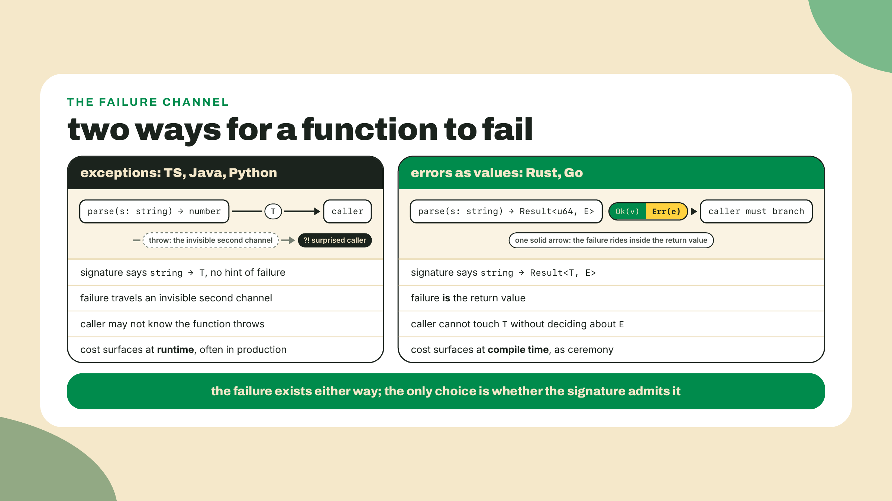
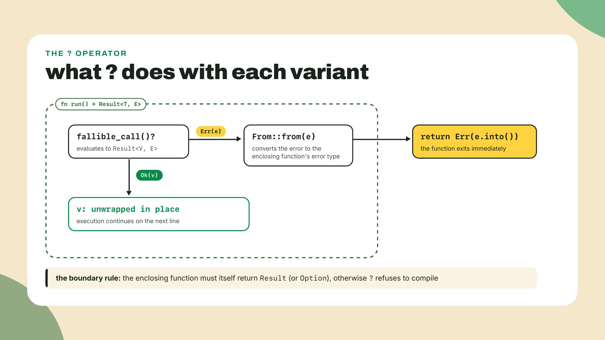
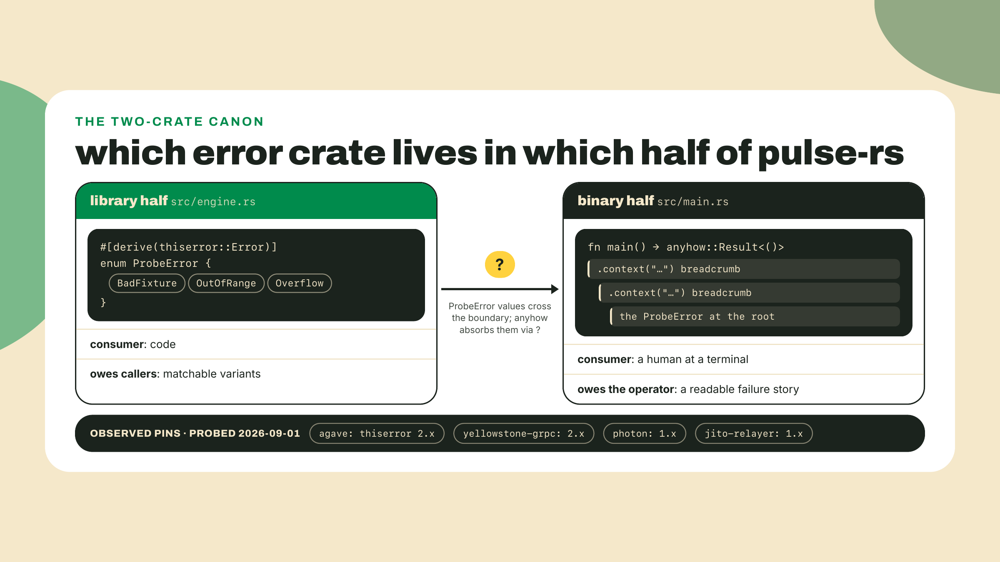
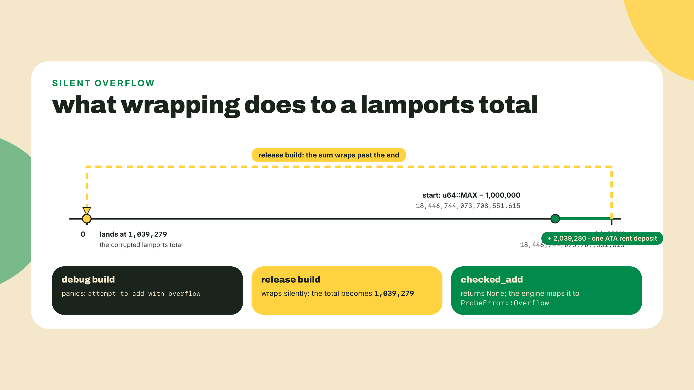
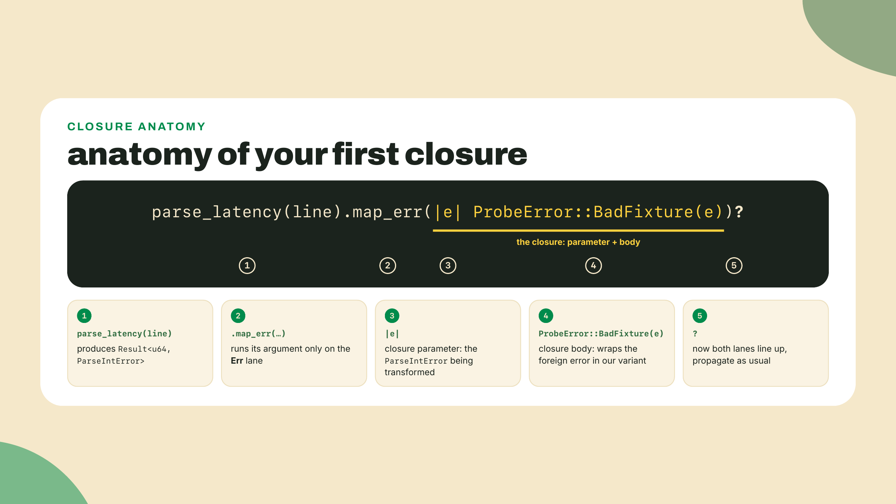
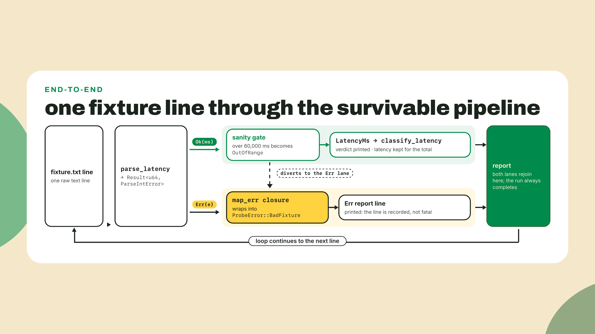
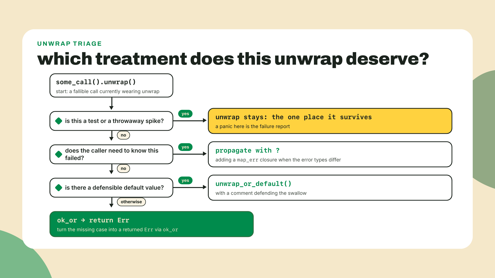

# Errors are values: Result, `?`, and the two-crate canon

## Summary

Last lesson got `pulse-rs` compiling: ownership-clean types and a pure classifier running over fixture latencies. But any malformed input still kills the whole run with a panic, and that is today's target. Not catch the panic. DELETE it. By the end, every probe outcome flows through the engine as a `Result` the caller must look at, the malformed lines come back as printed `Err` values while the report finishes around them, and your money math refuses to wrap. Along the way you will write your first closure, split the project into a library half and a binary half, and adopt the exact two-crate error canon the biggest Solana repos run in production. M4's grain continues: the lab and the repair reps are worked with me or repair-of-given-code, and the only lines you author unguided inside them are the `map_err` closure and the checked-math replacements. The challenge at the end then breaks the no-blank-file grain once, on purpose: a scratch rebuild-and-convert, because the conversion only proves it travels when the crime scene is yours.

## Kill the report first

Open `pulse-rs` from last lesson. Real fixtures do not arrive as neat `vec![LatencyMs(212)]` literals; they arrive as text, and text lies. Simulate that in two minutes. Add this helper above `main`:

```rust
fn parse_latency(line: &str) -> u64 {
    line.trim().parse().unwrap()
}
```

And replace the fixture loop in `main` with a raw-text version:

```rust
    let raw_fixture = ["212", "487", "fast", "1204", "930"];

    println!("target: {} ({})", target.name, target.url);
    for line in raw_fixture {
        let latency = LatencyMs(parse_latency(line));
        println!("{line}ms -> {:?}", classify_latency(latency));
    }
    println!("probes classified: {}", raw_fixture.len());
```

`cargo run`:

```text
target: solana-rpc (https://api.mainnet.solana.com)
212ms -> Up
487ms -> Degraded

thread 'main' panicked at src/main.rs:58:25:
called `Result::unwrap()` on an `Err` value: ParseIntError { kind: InvalidDigit }
```

(The compile also greets you with three dead-code warnings, `describe`, `classify_probe`, and `ProbeResult` just lost their only callers when you swapped the loop. Expected, harmless, and temporary: the lab's step 5 puts all three back on the payroll.)

Two probes classified, then death. `"fast"` is not a number, `parse` said so, and `unwrap()` translated "said so" into "kill the process." The 1204 and the 930 never got looked at. Remember module 1's untyped v0 fleet, the one that lied politely and recorded timeouts as prose strings? This is its Rust cousin, except louder: instead of wrong output you get no output. Neither is what an operator staring at a fleet report needs at 3am. Leave the panic in place. We are about to take it apart, and then we are going to delete it so thoroughly that a grep for `unwrap` in your production code returns nothing.

## Errors as return values, derived

### What that panic actually was

A panic is Rust declaring the program's state unreliable and tearing the thread down: unwind, print, die. It is the right tool for "this can never happen and if it did, memory is suspect." It is catastrophically the wrong tool for "a text file had a typo," which is not an emergency, it is Tuesday. And `unwrap()` is the one-word bridge between the two: it means "if this operation failed, panic." Every `unwrap` in your code is a small signed confession that you chose not to think about the failure case.

So what should `parse` do instead when the input is garbage, given that Rust has no exceptions to throw? Here is the whole design, and honestly it barely needs deriving: if a function can fail, say so in the return type. That's it. An exception, viewed coldly, is a second return channel that never appears in the signature: `JSON.parse` in your TypeScript claims it returns `any`, and the throw is a side door you learn about in production. You handled that well in M2, with `try/catch` at the boundary and a discriminated union carrying the outcome inward, and that instinct was exactly right. Rust just removes the side door entirely. The failure IS the return value, first-class, typed, visible in every signature it passes through.



### Result and Option are enums you already own

Here is the part that should feel like a rerun, because it is. `Result` is defined in the standard library roughly like this:

```rust
enum Result<T, E> {
    Ok(T),
    Err(E),
}
```

An enum with two variants, each carrying data. You BUILT one of these yesterday: `ProbeResult` with its `Ok`, `Timeout`, and `HttpError` variants was you doing errors-as-values by hand, in your own domain, before the language told you it had a general-purpose version. `Option<T>` is the same idea for absence: `Some(T)` or `None`, the standard library's answer to `null`, except the compiler makes you look before you touch. And because they are ordinary enums, the tool you already trust applies: `match` on them, exhaustively, with the compiler refusing to let you forget an arm.

```rust
match parse_latency("212") {
    Ok(ms) => println!("got {ms}"),
    Err(e) => println!("bad line: {e}"),
}
```

The generic parameters `<T, E>` are the first generics you have met in Rust, and today you only need the reading-level version: `Result<u64, ParseIntError>` means "Ok carries a u64, Err carries a ParseIntError." That is the entire required understanding for this module.

One field note on how universal this shape is: while building this course's tooling I hit crates.io's API with a bare `curl` and got refused, because crates.io rejects calls without a User-Agent header. The refusal arrived as data, a non-JSON body my script had to parse and report as an `Err`, not as an exception someone upstream forgot to catch. Out in the real world, failure is just another value on the wire. Rust's type system is agreeing with reality, not inventing ceremony.

### ? is early return with taste

Matching on every fallible call gets old fast. Watch what happens to a function that does three fallible things with explicit matches: it becomes a staircase of `match` blocks where the actual logic hides in the corners. Rust's answer is one character. Writing `?` after a `Result` means: if this is `Ok(v)`, unwrap to `v` right here and keep going; if this is `Err(e)`, return `Err(e)` from the enclosing function immediately. Early return, on the error lane, with the happy path left flat and readable.



There is one more thing hiding in that red lane, and it is the detail that makes `?` compose across libraries: on the way out, the error is run through the `From` trait. If your function returns `Result<T, ProbeError>` and the inner call failed with a `ParseIntError`, `?` will convert the foreign error into yours, provided a conversion exists. When one does not exist, the compiler stops you, and you will hit exactly that wall in the lab, on purpose, because the fix is your first closure. Name the mechanism now, so the error message reads as information later: ? propagates, and it converts via From on the way out.

So the house rule, and notice it is taste, not law: no `unwrap()` on the production path. In a test, `unwrap` is fine, honestly it is correct: a panic in a test IS the failure report, delivered to you, at your desk. In a throwaway spike, fine too. The difference is who pays when it fires. You pay at your desk, or an operator pays at 3am staring at a half-printed fleet report. Write the unwrap where you are the one holding the bill.

### The two-crate canon: thiserror in the engine, anyhow in the binary

Now the ecosystem layer, because real Rust error handling is two crates, and WHERE each one goes matters more than either crate does. The split follows from one question: who consumes the error?

A library's errors are consumed by code. Your engine's caller wants to `match` on what went wrong, because a malformed line and an out-of-range value deserve different treatment. Code needs variants, so a library owes its callers a real error TYPE: an enum. Writing the boilerplate for those enums (the `Display` impl, the trait wiring) is what `thiserror` deletes: you derive it, annotate each variant with an `#[error("...")]` message string, and the crate writes the rest. Pure saved labor, and the closest thing Rust has to a universal convention.

A binary's errors are consumed by a human reading a terminal. `main` does not match on variants; it reports, with as much context as possible, and exits nonzero. That is `anyhow`: a single flexible `anyhow::Result` that any error converts into, plus `.context("...")` to stack human-readable breadcrumbs on the way up.

The trade-off that locks the two into their lanes: anyhow's flexibility comes from ERASING the type information thiserror preserves. Use anyhow in a library and it compiles fine, feels convenient, and quietly steals your callers' ability to match on what went wrong. That inversion is the most common real-world mistake with these crates, which is exactly why the canon is two crates and not one.

And it is the canon, not my preference. I probed the Cargo.toml files of the load-bearing Solana repos on 2026-09-01: agave (the validator client) and yellowstone-grpc are on thiserror 2.x, while photon and jito-relayer still run the 1.x line, and anyhow rides along across the board. Two majors coexisting in one ecosystem is itself a small lesson: before you upgrade a foundational crate, read what your ecosystem actually pins. The repos you depend on move slower than crates.io's latest tag, and matching your neighbors beats chasing the front.



### Money math: the compiler will not save you from +

One more failure mode belongs in this lesson because it does NOT announce itself. Your latencies and, later in this course, your lamports are `u64` values, and `u64` addition can overflow. Here is the nasty part: debug builds panic on overflow, release builds wrap around silently by default. The same line of code, two behaviors. Your teammate says "ship the release build, it doesn't panic there," and your teammate is technically right in the worst possible way, because a wrapped u64 is not a crash, it is a wrong number wearing a straight face.

Work it with real values. The rent-exempt balance for one associated token account on Solana is 2,039,280 lamports (a worked number here and nothing more; what an ATA actually is belongs to the Digital Assets course). Say a balance counter sits near the top of the range, at `u64::MAX - 1_000_000`, which is 18,446,744,073,708,551,615. Add one rent deposit of 2,039,280 in a release build and the sum wraps past zero to 1,039,279. Eighteen and a half quintillion lamports become roughly one thousandth of a SOL, no panic, no log line, and every calculation downstream happily consumes the corpse. I have shipped this bug's cousin: a balance ticker that hit 18,446,744,073,709,551,615 on screen because a refund landed twice and my subtraction wrapped underneath zero. Nobody caught it for a day, because nothing crashed. "It didn't crash" is not "it was right."



The fix is the method family the standard library grew for exactly this: `checked_add` and `checked_sub` return `Option<u64>`, `Some(sum)` normally and `None` on overflow. And look at what that returns: an Option, which feeds straight back into the machinery you just learned. Overflow stops being a silent state corruption and becomes one more error value flowing up the same `?` pipeline as a bad fixture line. One error-handling story for the whole program.

**Go deeper (the 20%).** this lesson taught the daily-use pattern: Result and Option, `?`, the no-unwrap house rule, the two-crate split, checked math. The full treatment of recoverable versus unrecoverable errors, when a panic is genuinely correct, and `Result`'s deeper API surface is chapter 9 of The Rust Book: [https://doc.rust-lang.org/book/ch09-00-error-handling.html](https://doc.rust-lang.org/book/ch09-00-error-handling.html). And the closure you are about to write has an entire chapter of depth behind it (capture modes, the Fn traits, closures as arguments and returns) in chapter 13: [https://doc.rust-lang.org/book/ch13-00-functional-features.html](https://doc.rust-lang.org/book/ch13-00-functional-features.html) (both links checked live 2026-09-02). Bookmark both, read ch09 this week. The lab needs neither.

## Lab: the report that survives its fixtures

Target state, so you know when you are done: `pulse-rs` split into an engine module (the library half, typed errors, no printing, no exiting) and a main binary (the anyhow half, all the printing), reading a deliberately dirty fixture file end to end, with zero unwraps outside tests.

1. **Add the two crates.** From the `pulse-rs` root:

   ```bash
   cargo add thiserror anyhow
   ```

   `cargo add` is npm-install for Cargo, and it wrote both dependencies into `Cargo.toml` for you. Today (2026-09-02) that pulls thiserror 2.0.20 and anyhow 1.0.104; your patch digits may be newer, and for these two famously stable crates that is fine.

2. **Split the project into halves.** Create `src/engine.rs` and move every type and function from `main.rs` into it EXCEPT `main` itself: `ProbeTarget`, `LatencyMs`, `ProbeResult`, `Verdict`, `classify_latency`, `classify_probe`, `describe`, and the doomed `parse_latency`. Mark each moved item `pub` (public: visible outside the module; module privacy is Rust's default and we will tour it properly with Cargo in M6), and be precise about what "each" means, because privacy is per item, not per file: the two structs need `pub` on their FIELDS too, since `main.rs` constructs and reads them. `ProbeTarget` becomes `pub struct ProbeTarget { pub name: String, pub url: String }`, and the newtype's inner value gets it as well: `pub struct LatencyMs(pub u64);`. The enums are easier: a variant is exactly as public as its enum, so `ProbeResult` and `Verdict` need only the one `pub` in front of `enum`. Skip a field and `cargo check` greets you with a private-field error at the construction site in `main`. Then declare the module at the top of the now-tiny `main.rs`:

   ```rust
   mod engine;
   ```

   That single line tells Cargo that `src/engine.rs` exists and belongs to this program. Your binary now has a library half and a binary half, which is exactly the seam the two-crate canon wants.

3. **Derive the engine's error type.** At the top of `engine.rs`:

   ```rust
   use std::num::ParseIntError;
   use thiserror::Error;

   /// A latency past this is a corrupted fixture line, not a slow probe.
   pub const MAX_SANE_LATENCY_MS: u64 = 60_000;

   /// Worked-example constant for the checked-math path. The number is real;
   /// what an ATA actually is belongs to the Digital Assets course.
   pub const ATA_RENT_LAMPORTS: u64 = 2_039_280;

   #[derive(Debug, Error)]
   pub enum ProbeError {
       #[error("not a latency reading: {0}")]
       BadFixture(ParseIntError),
       #[error("{0}ms is past the {MAX_SANE_LATENCY_MS}ms sanity ceiling")]
       OutOfRange(u64),
       #[error("u64 arithmetic overflowed")]
       Overflow,
   }
   ```

   Read it as what it is: a plain enum, like `Verdict`, except each variant is one way the engine can fail, and each carries its evidence. `BadFixture` holds the underlying `ParseIntError` so nothing is lost; `OutOfRange` holds the offending number. The `#[error("...")]` strings are the human-readable rendering, and the `{0}` interpolates the variant's data field. That derive plus those strings replace the dozen lines of `impl Display` you would otherwise hand-write per error type.

4. **Convert the parse, and meet the wall.** Delete the `unwrap` version of `parse_latency` and write the honest pair. First attempt, exactly like this:

   ```rust
   pub fn parse_latency(line: &str) -> Result<u64, ParseIntError> {
       line.trim().parse()
   }

   pub fn parse_fixture_line(line: &str) -> Result<LatencyMs, ProbeError> {
       let ms = parse_latency(line)?;
       if ms > MAX_SANE_LATENCY_MS {
           return Err(ProbeError::OutOfRange(ms));
       }
       Ok(LatencyMs(ms))
   }
   ```

   `cargo check`:

   ```text
   error[E0277]: `?` couldn't convert the error to `ProbeError`
      |
      |     let ms = parse_latency(line)?;
      |                                 ^ the trait `From<ParseIntError>` is not
      |                                   implemented for `ProbeError`
      |
      = note: the question mark operation (`?`) implicitly performs a conversion
        on the error value using the `From` trait
   ```

   There is the mechanism from the theory section, live: `?` tried to convert `ParseIntError` into `ProbeError` via `From`, found no conversion, and stopped. Two fixes exist. The one this lesson teaches is the explicit map on the error lane, and writing it means writing your first closure. Change the line to:

   ```rust
       let ms = parse_latency(line).map_err(|e| ProbeError::BadFixture(e))?;
   ```

   Now stop and look at `|e| ProbeError::BadFixture(e)`, because this is a big small moment: your first closure, arriving just in time, exactly where the language makes it necessary. A closure is an anonymous function, written inline, that can capture variables from the scope around it. `|e|` declares its parameter, the expression after is its body, and the whole thing is a VALUE you hand to `map_err` like any other argument. `map_err` runs it only if the Result is an `Err`, transforming the error lane and leaving the `Ok` lane untouched (`map` is its twin for the value lane; mixing the two is a classic first-week stumble, so say out loud which lane you mean). This one captures nothing yet; closures that capture, and the iterator chains where closures live their best lives, arrive in the next module. The full depth is bookmarked in the ch13 link above.



   Run `cargo clippy` before moving on and it will needle you about this exact line:

   ```text
   warning: redundant closure
       .map_err(|e| ProbeError::BadFixture(e))?;
                ^ help: replace the closure with the tuple variant itself:
                  `ProbeError::BadFixture`
   ```

   Clippy is right, and the reason is worth the detour: a tuple-variant constructor like `ProbeError::BadFixture` is ALREADY a function, so a closure that only forwards to it adds nothing. `.map_err(ProbeError::BadFixture)` is identical and shorter. We keep the written-out closure this module anyway, so the shape stays in front of you while it is new, and we tell clippy so explicitly. Put this attribute on the function:

   ```rust
   #[allow(clippy::redundant_closure)]
   ```

   with a comment saying why and when it dies (collapse the closure in M5, delete the allow). An `#[allow]` with a written expiry date is a tool loan; an `#[allow]` without one is how lint debt is born. The second fix for the E0277 wall, for completeness: thiserror can derive the `From` conversion itself with a `#[from]` attribute on the variant, at which point bare `?` just works. We chose the explicit closure today because you need to SEE the conversion once before you let a derive hide it.

5. **Wire the anyhow half.** Replace `main.rs` below the `mod engine;` line with the binary half in full:

   ```rust
   use anyhow::{Context, Result};
   use engine::{LatencyMs, ProbeResult, ProbeTarget};

   fn main() -> Result<()> {
       let target = ProbeTarget {
           name: String::from("solana-rpc"),
           url: String::from("https://api.mainnet.solana.com"),
       };

       let raw = std::fs::read_to_string("fixture.txt")
           .context("could not read fixture.txt from the pulse-rs root")?;

       let mut clean: Vec<LatencyMs> = Vec::new();
       let mut rejected = 0u32;

       println!("target: {} ({})", target.name, target.url);
       for line in raw.lines() {
           match engine::parse_fixture_line(line) {
               Ok(latency) => {
                   println!("  {line}ms -> {:?}", engine::classify_latency(latency));
                   clean.push(latency);
               }
               Err(e) => {
                   println!("  {line:?} -> Err({e:?}): {e}");
                   rejected += 1;
               }
           }
       }

       // The structured path keeps a heartbeat on fixtures until the M6 daemon
       // feeds real network outcomes into the state machine.
       let structured = [
           ProbeResult::Ok {
               latency: LatencyMs(212),
           },
           ProbeResult::Timeout {
               budget: LatencyMs(3000),
           },
           ProbeResult::HttpError { status: 429 },
       ];
       for probe in &structured {
           println!(
               "  {} -> {:?}",
               engine::describe(probe),
               engine::classify_probe(probe)
           );
       }

       let total = engine::total_latency(&clean).context("summing the latency budget")?;
       let funding = engine::station_funding(1_000_000, engine::ATA_RENT_LAMPORTS, 50_000)
           .context("computing station funding")?;
       println!(
           "{} clean probes, {rejected} rejected, {total}ms total latency",
           clean.len()
       );
       println!("station funding needed: {funding} lamports");
       Ok(())
   }
   ```

   Walk the seams, because each one is a decision. `main` returns `anyhow::Result<()>`, which is what lets `?` work inside it: any error that escapes gets printed with its context chain and the process exits nonzero, which is the entire error-handling job of a binary. The file read wears `.context("...")`, a breadcrumb for the human. And the report loop is the lesson's thesis in four lines: `match` on each line's Result, print the verdict on `Ok`, print the error on `Err`, and KEEP GOING. An error value cannot kill a loop; only a panic can. The two calls in the summary block (`total_latency`, `station_funding`) do not exist yet; that is step 6. This will not compile until they do, and now you can read that state calmly instead of superstitiously.



6. **Make the math refuse to lie.** In `engine.rs`, add the summing path and the funding helper, both built on checked arithmetic feeding the same error pipeline:

   ```rust
   pub fn total_latency(latencies: &[LatencyMs]) -> Result<u64, ProbeError> {
       let mut total: u64 = 0;
       for latency in latencies {
           total = total.checked_add(latency.0).ok_or(ProbeError::Overflow)?;
       }
       Ok(total)
   }

   pub fn station_funding(base: u64, rent: u64, buffer: u64) -> Result<u64, ProbeError> {
       let subtotal = base.checked_add(rent).ok_or(ProbeError::Overflow)?;
       subtotal.checked_add(buffer).ok_or(ProbeError::Overflow)
   }
   ```

   `ok_or` is the bridge method: it turns `Option` into `Result` by supplying the error for the `None` case, and from there `?` takes over as usual. Then pin the behavior down with tests at the bottom of `engine.rs`, including one that documents what release mode WOULD have done, so the wrap number from the theory section lives in executable form:

   ```rust
   #[cfg(test)]
   mod tests {
       use super::*;

       #[test]
       fn overflow_is_an_error_not_a_wrap() {
           let nearly_full = LatencyMs(u64::MAX - 1_000_000);
           let rent_sized = LatencyMs(ATA_RENT_LAMPORTS);
           assert!(matches!(
               total_latency(&[nearly_full, rent_sized]),
               Err(ProbeError::Overflow)
           ));
       }

       #[test]
       fn what_release_mode_would_have_done() {
           let nearly_full: u64 = u64::MAX - 1_000_000;
           assert_eq!(nearly_full.wrapping_add(ATA_RENT_LAMPORTS), 1_039_279);
       }

       #[test]
       fn epoch_wall_clock_shrank_with_faster_slots() {
           let at_400ms = 432_000u64.checked_mul(400);
           let at_300ms = 432_000u64.checked_mul(300);
           assert_eq!(at_400ms, Some(172_800_000)); // 48 hours of milliseconds
           assert_eq!(at_300ms, Some(129_600_000)); // 36 hours of milliseconds
       }
   }
   ```

   The `#[cfg(test)]` attribute compiles this module only for `cargo test`, which is why unwraps and panics are legal citizens inside it. That last test is a checked-math warm-up with Solana's own numbers: an epoch is fixed at 432,000 slots, so when the network's slot time target dropped from 400ms to 300ms this August, epochs shrank from 48 hours to 36 in wall-clock terms. Same slot count, faster heartbeat, derivable in one line of honest u64 math. Add two or three more tests of your own for the parse path (a garbage line is `Err(BadFixture(_))`, a day in milliseconds is `Err(OutOfRange(_))`; `matches!` is the one-line way to assert an enum's shape).

7. **Feed it dirt and verify.** Create `fixture.txt` in the project root, deliberately filthy:

   ```text
   212
   487
   fast
   1204
   86400000
   930
   ```

   Then the full gate:

   ```bash
   cargo fmt
   cargo clippy
   cargo test
   cargo run
   ```

   fmt silent, clippy zero warnings (the one lint we earned is explicitly allowed, with its expiry note), tests green, and the run prints:

   ```text
   target: solana-rpc (https://api.mainnet.solana.com)
     212ms -> Up
     487ms -> Degraded
     "fast" -> Err(BadFixture(ParseIntError { kind: InvalidDigit })): not a latency reading: invalid digit found in string
     1204ms -> Down
     "86400000" -> Err(OutOfRange(86400000)): 86400000ms is past the 60000ms sanity ceiling
     930ms -> Degraded
     212ms -> Up
     no answer in 3000ms -> Down
     HTTP 429 -> Degraded
   4 clean probes, 2 rejected, 2833ms total latency
   station funding needed: 3089280 lamports
   ```

   Hold that against the opener. Same class of garbage in the input, and instead of two lines and a corpse you get the whole report: verdicts for the four clean probes, a typed, printed reason for each of the two rejects (the debug form AND the `#[error]` rendering side by side), and honest totals. The opener's panic is gone, and one grep proves how gone:

   ```bash
   grep -n "unwrap" src/main.rs src/engine.rs
   ```

   The expected result is silence, and for the code exactly as given, total silence: the production path has zero unwraps, and this lesson's test module happens to assert with `matches!` and `assert_eq!` rather than `unwrap`, so the grep returns nothing at all. If the extra tests you write reach for `unwrap` (legal there, and often the right call), the audit rule is: every hit must sit BELOW the `#[cfg(test)]` line in `engine.rs`, and `main.rs` must show none. Test-side unwraps are panics working as intended, at your desk, as failure reports.

### Repair reps: three fixes you now own

The completion loop, same grain as last lesson: broken or ugly code, one principled repair each, in a scratch bench (`cargo new error-reps && cd error-reps && cargo add thiserror`). One setup move before rep 1: copy the lab's `ProbeError` enum into the bench's `main.rs`, along with its `use std::num::ParseIntError;` and `use thiserror::Error;` lines, because rep 1 returns it and rep 2's `HeaderError` is given while `ProbeError` is assumed. Predict before you check.

**Rep 1, author the closure unguided.** This function will not compile. Fix it by writing the `map_err` closure yourself, no peeking at the lab:

```rust
fn checked_line(line: &str) -> Result<u64, ProbeError> {
    let ms = line.trim().parse::<u64>()?;
    Ok(ms)
}
```

**Rep 2, three unwraps, three DIFFERENT fixes.** This helper works right up until any of its three assumptions breaks. Convert it to return `Result<String, HeaderError>` (the enum below is given; the fixes are yours). The catch: the three unwraps deserve three different treatments, and knowing which is which is the actual skill. One should propagate with `?` and a `map_err`, one should become a returned `Err` via `ok_or`, and one should be swallowed with `unwrap_or_default` plus a comment defending the swallow:

```rust
#[derive(Debug, Error)]
enum HeaderError {
    #[error("the fixture is empty")]
    EmptyFixture,
    #[error("the first line is not a probe count: {0}")]
    BadCount(std::num::ParseIntError),
}

fn report_header(raw: &str) -> String {
    let first = raw.lines().next().unwrap();
    let count: u64 = first.trim().parse().unwrap();
    let label = std::env::var("STATION_NAME").unwrap();
    format!("{label}: expecting {count} probes")
}
```

Reasoning check, before you type: the missing env var is the defensible swallow (a nameless station is annoying, a dead report is worse), the empty input is a real error the caller must hear about, and the bad count rides `?` up as `BadCount`. If you assigned them differently, argue with me in the feedback; there is honest room on the env var.



**Rep 3, the checked-math replacement, unguided.** Back in `pulse-rs`: this version of `station_funding` compiles, passes a happy-path test, and lies under pressure. Replace the two `+` operators with checked arithmetic mapping `None` into `ProbeError::Overflow`, then pin the repair with a test of your own, because step 6's overflow test exercises `total_latency`, not this function. Write `station_funding_overflow_is_an_error` in the same shape (feed `u64::MAX - 1_000_000` as `base` and `ATA_RENT_LAMPORTS` as `rent`, assert `Err(ProbeError::Overflow)` with `matches!`) and make it pass:

```rust
pub fn station_funding(base: u64, rent: u64, buffer: u64) -> Result<u64, ProbeError> {
    Ok(base + rent + buffer)
}
```

Acceptance for the reps: all three compile, `cargo test` green, and for each unwrap you removed you can say in one sentence who would have paid when it fired.

## Challenge

The unguided rep is a sweep, and you build the crime scene yourself so the conversion is honest. `cargo new no-unwrap-report && cd no-unwrap-report && cargo add thiserror anyhow`, then reconstruct a small fixture-report binary in the state your `pulse-rs` was in this morning: the opener's `unwrap`-riddled parse and raw-fixture loop (put four or five unwraps on the production path while you are at it, an env var, a file read, a `lines().next()`), a bare `+` in its lamports total, and a dirty `fixture.txt` that kills it three lines in. Then convert it end to end: a thiserror enum in its engine module, anyhow with context in its `main`, every unwrap replaced by the treatment it deserves, checked math on the total. The grader is the same gate you just ran by hand: the run must complete over the dirty fixture printing both `Ok` and `Err` lines, `grep -rn 'unwrap()' src/` must print nothing outside test modules (note the `-r`; a bare `grep -c` over a directory refuses to run), and the overflow test must pass. Mind the exact pattern: it is `'unwrap()'` with the parentheses, not bare `unwrap`, because `unwrap_or_default` and its siblings are treatments, not confessions, and rep 2's env-var fix would trip a bare-`unwrap` grep while being exactly right. Everything you need is above; if you stall, escalate along the lab's own order, find which line dies first, then the `map_err` closure, then the `ok_or` bridge.

## Checkpoint

What you can now do, concretely: read a `Result` signature as a contract instead of ceremony; propagate with `?` and explain the `From` hop in the red lane; write a closure at `map_err` and say what makes it a closure; split errors on the two-crate canon and defend the split with the trade-off (anyhow erases what thiserror preserves); and refuse wrapping arithmetic anywhere money-shaped numbers live. Your `pulse-rs` survives a filthy fixture file and says exactly why each bad line was rejected, in a type a caller could match on.

The 30-second retrieval before you close the tab, out loud: what does `?` do on an `Err`? (Early-returns the error from the enclosing function, converting via `From` on the way out.) And which build profile wraps on overflow? (Release. Debug panics. Neither is a substitute for `checked_add`.)

One ask while it is fresh: in rep 2, did the three-different-fixes split feel principled or arbitrary, and which unwrap did you almost fix wrong? Tell me in the feedback. That rep is the module's whole philosophy in nine lines, and if the env-var swallow felt like cheating I want to hear the argument, because "when is a default acceptable" is a debate real teams have weekly.

Outcomes are values now. But a probe's LIFE over time (pending, up, degraded, down) is still loose data your code merely remembers to update. Next lesson: enums as state machines, the compiler holding the pen on every legal transition, plus the cargo test, clippy, and fmt gate wired into your Actions workflow, which is the honest answer to "how do you change code you're afraid of?" See you there.
