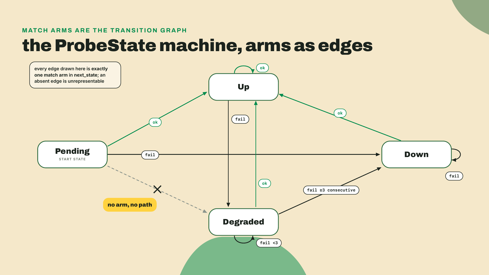
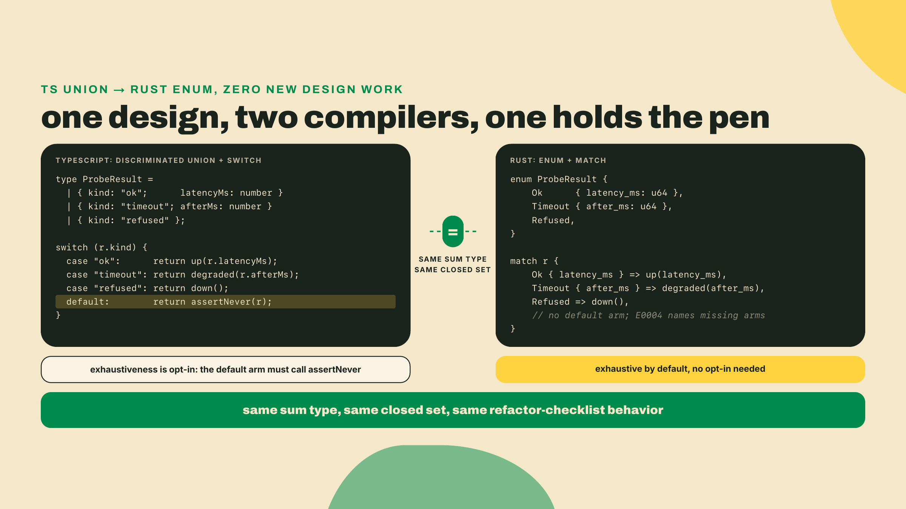
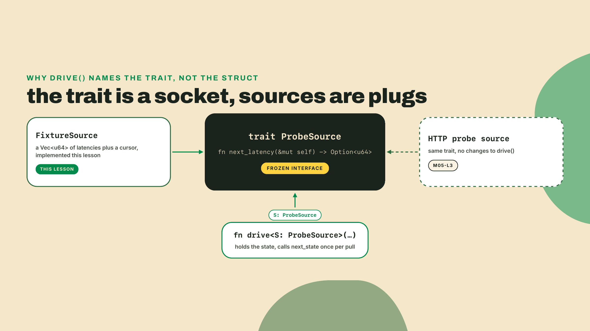
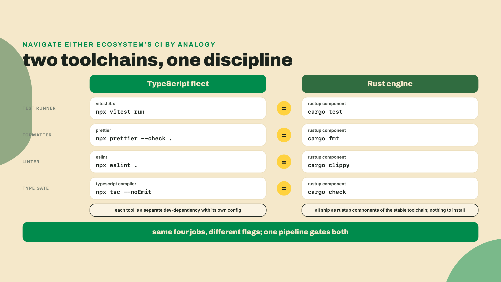
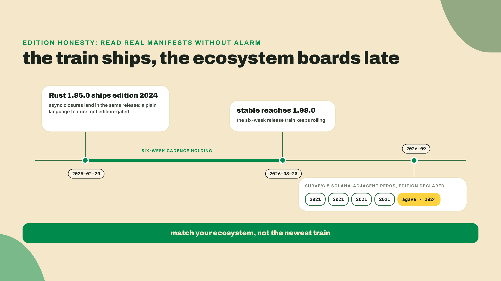
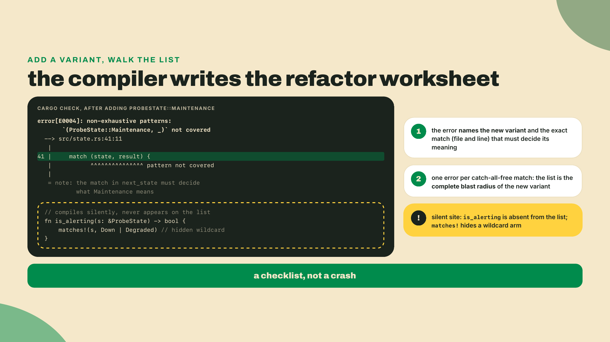
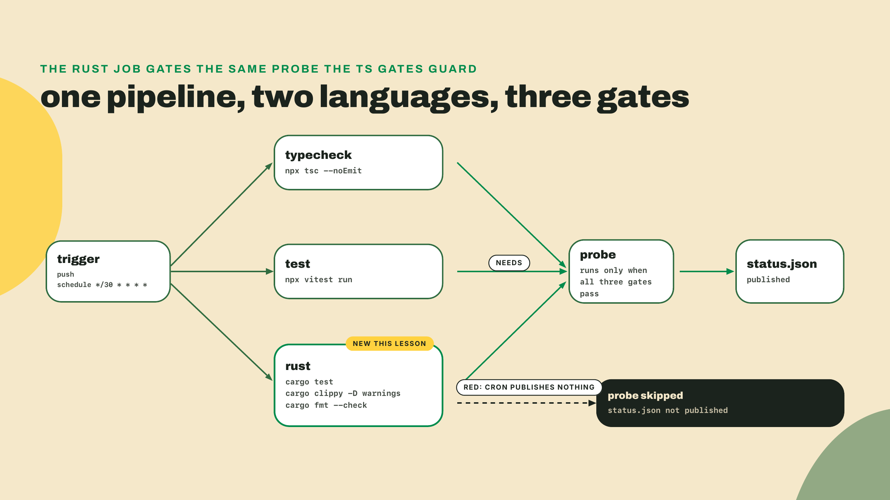
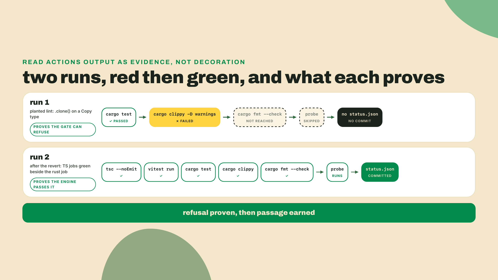

# Enums are state machines

## Summary

m04-l2 made every probe outcome a Result: a thiserror-typed engine, an anyhow binary, your first closure at map_err, and checked lamports math. The run survives dirty fixtures now. What it does not survive is time. A target is not just "ok this instant"; it has a history, and nothing in the station tracks it: the TS fleet classifies each probe in isolation (the m02-l1 verdicts, up, degraded, down) and forgets. Today the Rust engine writes the missing half of the canon: a target's life as four states, Pending, Up, Degraded, Down, an enum whose match IS the transition table, and illegal transitions stop being bugs you catch and become programs that do not exist. Then the module's other thread lands: cargo test, clippy, and fmt join the Actions pipeline as gate #3, and both languages end up gated on one workflow. The driving question for the whole lesson: how do you change code you're afraid of?

## Break the machine first

Start by getting refused, on purpose, inside three minutes. Open `pulse-rs`, create a scratch file `src/bin/scratch.rs`, and paste exactly this, missing arm and all:

```rust
#[derive(Debug, Clone, Copy)]
enum ProbeState {
    Pending,
    Up,
    Down,
}

fn next_state(state: ProbeState, probe_ok: bool) -> ProbeState {
    use ProbeState::*;
    match (state, probe_ok) {
        (Pending, true) => Up,
        (Pending, false) => Down,
        (Up, true) => Up,
        (Up, false) => Down,
        (Down, false) => Down,
    }
}

fn main() {
    println!("{:?}", next_state(ProbeState::Pending, true));
}
```

```bash
cargo check
```

The compiler answers with the missing case, by name:

```text
error[E0004]: non-exhaustive patterns: `(ProbeState::Down, true)` not covered
  --> src/bin/scratch.rs:10:11
   |
   |     match (state, probe_ok) {
   |           ^^^^^^^^^^^^^^^^^ pattern `(ProbeState::Down, true)` not covered
```

Read that error again, slowly, because it is the lesson. You did not write a test for the recovery path. You did not remember the recovery path. You forgot it, the way everyone forgets one case, and the compiler printed the forgotten case by name and refused to build until you decide what a Down target's successful probe means. In m02-l1 you bought this exact guarantee for the TS fleet with the `assertNever` trick: a clever function you had to know about, wire in, and remember on every switch. Here it is the default behavior of `match`. Nobody opts in. The pen is in the compiler's hand.

Add the arm `(Down, true) => Up,` and `cargo check` goes quiet. Delete the scratch file when you're done breaking things; the real machine goes in the engine.

## The pen is in the compiler's hand

### States as data, transitions as arms

A target's life needs four states, so the engine gets a four-variant enum. This goes in `src/engine.rs`, next to the ProbeError work from last lesson:

```rust
#[derive(Debug, Clone, Copy, PartialEq, Eq)]
pub enum ProbeState {
    Pending,
    Up,
    Degraded,
    Down,
}
```

The `derive` attribute is code generation you get for free: `Debug` gives you `{:?}` printing, `Clone` and `Copy` make the type cheap to pass around by value (it is one byte, copying it is cheaper than thinking about borrowing it), and `PartialEq`/`Eq` let `assert_eq!` compare states in the tests you're about to write. You have been using derive since m04-l1 without ceremony. That's the correct amount of ceremony.

Now the machine itself. The rules are new canon, written today; they extend the TS fleet's per-probe verdicts (which judge one answer) into a policy about a target's life across answers, and the TS half will adopt the same states when the two halves meet. A first success brings a Pending target Up, one failure degrades an Up target instead of killing it, a Degraded target dies only after three consecutive failures, and any success recovers straight to Up. Write the rules as a match over the pair:

```rust
pub fn next_state(state: ProbeState, probe_ok: bool, consecutive_failures: u32) -> ProbeState {
    use ProbeState::*;
    match (state, probe_ok) {
        (Pending, true) => Up,
        (Pending, false) => Down,
        (Up, true) => Up,
        (Up, false) => Degraded,
        (Degraded, true) => Up,
        (Degraded, false) if consecutive_failures >= 3 => Down,
        (Degraded, false) => Degraded,
        (Down, true) => Up,
        (Down, false) => Down,
    }
}
```



Two things in that match are new, and both earn their keep. The tuple `(state, probe_ok)` lets one match cover the full state-times-outcome grid, which is exactly the shape of a transition table. And `if consecutive_failures >= 3` is a match guard: an extra condition bolted onto one arm. Guards come with a rule worth saying out loud, because it will bite you the first time you lean on them: the compiler cannot see into a guard's boolean, so a guarded arm does not count toward exhaustiveness. That is why `(Degraded, false)` appears twice, once guarded and once bare. Delete the bare one and E0004 comes back, telling you the guarded arm alone is not a promise.

Here's the part that took me embarrassingly long to internalize when I learned this: notice what is NOT in the function. No `if state is valid` check. No error branch for illegal transitions. The rule "Pending never goes directly to Degraded" lives nowhere, because it does not need to live anywhere. There is no arm that produces it, so there is no code path that performs it, so the engine cannot do it, in the same way your m02-l1 union could not represent a successful probe without a latency. Unrepresentable beats validated. Validation you never have to remember beats validation someone will eventually forget.

### The union you already shipped, wearing a flag

Put the two artifacts side by side, because you designed this machine once already and I refuse to pretend otherwise. From your `pulse-core`, m02-l1:

```typescript
type ProbeResult =
  | { kind: 'ok'; latencyMs: number }
  | { kind: 'timeout'; budgetMs: number }
  | { kind: 'http-error'; status: number };

function assertNever(value: never): never {
  throw new Error(`unhandled variant: ${JSON.stringify(value)}`);
}

switch (result.kind) {
  case 'ok': /* ... */ break;
  case 'timeout': /* ... */ break;
  case 'http-error': /* ... */ break;
  default:
    assertNever(result); // compile error here if a variant is unhandled
}
```

A match over a Rust enum IS that exhaustive switch, with one difference that changes the daily experience: the never-hack is gone. In TS, exhaustiveness was a pattern you applied; skip `assertNever` and the switch compiles happily with a missing case. In Rust it is the semantics of `match`; there is no unchecked version to fall back into by accident. Same guarantee, but in one language you carry it and in the other the language carries you. And Rust variants carry data directly (`Ok { latency: LatencyMs }` from m04-l1) where TS spells it as object shapes with a discriminant field. Different syntax, same sum type, and one of this course's TS-to-Rust seams closes right here: everything you learned about modeling with unions transfers one to one.



### Structs, impl, derive: the trio you already half know

You've been using all three since m04-l1, so this is naming, not teaching. A `struct` is your record type. An `impl` block hangs functions off a type; a method taking `&self` reads, `&mut self` mutates. Here is the one this lesson actually needs, a convenience the status-rendering code will call:

```rust
impl ProbeState {
    pub fn is_alerting(&self) -> bool {
        matches!(self, ProbeState::Degraded | ProbeState::Down)
    }
}
```

`matches!` is a shorthand macro: it expands to a match that returns true for the listed patterns and false for everything else. Which means, and file this away for the lab, it contains a hidden `_ => false` arm. It is a catch-all in disguise. That will matter in about twenty minutes.

### One trait, because a source should be swappable

The engine still reads latencies from fixture data, and in m05-l3 it grows a real HTTP probe arm. Those are two sources for the same question: what's the next latency? In TS you'd reach for an interface. Rust's word is trait:

```rust
pub trait ProbeSource {
    fn next_latency(&mut self) -> Option<u64>;
}
```

That signature is a frozen contract in this course: get it verbatim, because `drive` below is written against it and nothing later is allowed to reshape it. `&mut self` because a source advances as you pull from it; `Option<u64>` because every source eventually runs dry, and you already know from m04-l2 that "maybe a value" is spelled Option, not a sentinel like `-1`. One honest forward note, so this socket never becomes a promise the course quietly drops: m05-l3's HTTP arm is a standalone call returning one measurement, not a `ProbeSource` implementation, and that lesson says out loud why it keeps the two apart. The trait is the seam that lets `drive` run on fixtures today and lets a second source slot in the day one earns its place; that day is m06-l1, when a live reqwest-backed source finally takes the socket. Today's implementation is the fixture-backed one:

```rust
pub struct FixtureSource {
    latencies: Vec<u64>,
    cursor: usize,
}

impl FixtureSource {
    pub fn new(latencies: Vec<u64>) -> Self {
        Self {
            latencies,
            cursor: 0,
        }
    }
}

impl ProbeSource for FixtureSource {
    fn next_latency(&mut self) -> Option<u64> {
        let latency = self.latencies.get(self.cursor).copied();
        self.cursor += 1;
        latency
    }
}
```

`impl Trait for Type` is the whole ceremony: it declares that FixtureSource fulfills the ProbeSource contract, and the compiler checks the signature matches to the letter. Code that consumes a source names the trait, not the struct:

```rust
pub fn drive<S: ProbeSource>(source: &mut S, budget_ms: u64) -> ProbeState {
    let mut state = ProbeState::Pending;
    let mut consecutive_failures: u32 = 0;
    while let Some(latency) = source.next_latency() {
        let probe_ok = latency <= budget_ms;
        if probe_ok {
            consecutive_failures = 0;
        } else {
            consecutive_failures += 1;
        }
        state = next_state(state, probe_ok, consecutive_failures);
    }
    state
}
```

That `<S: ProbeSource>` is a generic bound: "any type S, as long as it implements ProbeSource." You are reading generics-in-signatures right now, and reading is all this course asks of you; writing your own generic abstractions, trait objects, and the bounds vocabulary are exactly the depth the box below bookmarks. `while let` is match's little sibling: loop as long as the pattern matches, destructure the Some, stop on None.



### The flavored beat: an instruction set is an enum's home game

One detour before the pairing lands, because this exact pattern is why Rust owns the web3 niche. A Solana transaction carries instructions, and an instruction is one of a closed set of operations, each with its own payload: transfer this many lamports there, delegate authority to that key, close this account. Closed set. Per-variant data. Exhaustive dispatch. You have been staring at the shape all lesson:

```rust
#[derive(Debug)]
pub enum StationInstruction {
    Transfer { lamports: u64, to: [u8; 32] },
    Delegate { authority: [u8; 32] },
    Close,
}

pub fn describe_instruction(ix: &StationInstruction) -> String {
    match ix {
        StationInstruction::Transfer { lamports, to } => {
            format!("move {lamports} lamports to the address ending {:02x}", to[31])
        }
        StationInstruction::Delegate { authority } => {
            format!("hand probe authority to the key starting {:02x}", authority[0])
        }
        StationInstruction::Close => "tear the account down".to_string(),
    }
}
```

Three variants, three payload shapes (named fields, named fields, none at all), one match that must handle every operation or fail to compile. (The function is `describe_instruction`, not `describe`, because the engine already owns a `describe` for `ProbeResult`, and two functions cannot share one name in a module.) A struct-per-instruction design plus a `kind` string gives you none of that: the closed set becomes open, dispatch becomes stringly-typed hoping. This is modeling practice, said plainly: nothing deploys here, and the `[u8; 32]` arrays are byte arrays standing in for addresses. What programs DO with instructions is the Master Anchor V2 course's business; why transactions carry instructions at all belongs to the Bitcoin-to-Solana course. We borrow the shape because it is the best real-world argument for data-carrying enums, and so a real Solana program's big instruction enum reads as home, not as impressive.

### The pairing: cargo test is vitest wearing a different flag

Now the module's second thread. Back in m02-l4 you gave the TS fleet a test suite and wired it into the pipeline as gate #2. The Rust engine has been living without any of that, and "how do you change code you're afraid of?" has a two-part answer in this course: make illegal states unrepresentable, then gate everything else. Here is the whole Rust testing story, and the honest version is that you already know it:

| you pay for, in TS | you get free, in Rust | same job |
|---|---|---|
| vitest | `cargo test` | run the assertions, fail the build |
| prettier | `cargo fmt` | end style diffs forever |
| eslint | `cargo clippy` | flag code that compiles but smells |
| tsc --noEmit | `cargo check` | is this even a program |

No install lines in this section and that is the point: all three tools ship in the stable toolchain you installed in m04-l1, alongside rust-analyzer. Zero packages, zero config files, zero runner debates. The same jobs the TS fleet pays four dev-dependencies to do, in the box. Same idea, stricter foreman.

Tests live in the same file as the code, inside a module that only exists for test builds:

```rust
#[cfg(test)]
mod tests {
    use super::*;
    use ProbeState::*;

    #[test]
    fn one_failure_degrades_instead_of_killing() {
        assert_eq!(next_state(Up, false, 1), Degraded);
    }

    #[test]
    fn third_consecutive_failure_goes_down() {
        assert_eq!(next_state(Degraded, false, 3), Down);
    }
}
```

`#[cfg(test)]` compiles the module only when testing, `use super::*` pulls in the enclosing file's items, `#[test]` marks a function as a test, `assert_eq!` is your `expect(x).toBe(y)`. That is the entire API surface you need this module. Table-driven tests, fixtures, the m02-l4 patterns: all of them translate, and the lab writes the full transition suite. One cultural difference worth registering as you go: your TS fleet keeps tests in sibling `*.test.ts` files, while Rust's convention puts unit tests in the SAME file as the code they pin, which felt wrong to me for about a week and then became the thing I miss everywhere else, because the test and the match it guards scroll past each other in one screen. Rust also has a second tier, integration tests in a top-level `tests/` directory that exercise your crate from the outside; the engine earns that tier when the workspace split happens next module, so park it.

clippy deserves one more sentence, because "the compiler already checks types" is the objection every team hears when the lint step goes in. The type checker proves your code is well formed. clippy argues about whether it is wise: the lossy `as` cast, the ignored Result, the needless clone you learned to distrust in m04-l1. It is the review-comment generator, the eslint seat in the table, and with `-D warnings` (deny: promote every warning to a hard error) it stops being advice and becomes a gate.



While we're being honest about the ecosystem: teach your editor to run clippy, but teach your Cargo.toml the ecosystem's actual pace. Current Rust is edition 2024, shipped in Rust 1.85.0 on 2025-02-20 (`cargo new` has written `edition = "2024"` into your manifests all module), and stable rustc sits at 1.98.0 as of 2026-08-20, checked 2026-09-02, with a new stable every six weeks. But of five Solana-adjacent Rust repos this course surveyed in research, four still declare edition 2021. Only agave has migrated. The release train runs on time; the ecosystem boards late, and that is normal, not negligence. So when a tutorial shows `edition = "2021"`, it is not wrong, it is older, and when you contribute to a real repo, match ITS edition rather than helpfully bumping it in a drive-by PR. (One dated footnote so nobody is surprised later: the Academy's on-chain Solana courses write 2021 by rule, because their graded Rust builds on a toolchain that does not yet accept edition 2024. Everything Rust in THIS course compiles on your own machine, where 2024 is simply current; m05-l2 owns that split in full when editions get their proper treatment.)



One more piece of honesty, my favorite fact in this module because it cuts both ways. On 2025-11-19, while TypeScript's compiler team was porting tsc to a native language for speed, Prisma went the other direction: Prisma 7 deleted its Rust query engine for a TypeScript query compiler, around 90% smaller bundles, a vendor-claimed 3x on queries. Read the two moves together and the language war dissolves into the only real question: right tool for the layer. A compiler wants Rust's performance envelope; a query layer inside a Node process wants to stop paying the boundary tax. Your station runs both languages because each half sits in the layer it is best at, and this lesson gating them on one pipeline is the course's thesis in miniature.

**Go deeper (the 20%).** this lesson taught enums, match, and one trait the way the fleet needs them daily. The depth is deliberately bookmarked: the full enum chapter, Option's method zoo (`map`, `and_then`, `unwrap_or` and friends), pattern syntax beyond tuples and guards, live in The Rust Book ch. 6 ([https://doc.rust-lang.org/book/ch06-00-enums.html](https://doc.rust-lang.org/book/ch06-00-enums.html)), and writing your own generics, trait bounds, and trait objects in ch. 10 ([https://doc.rust-lang.org/book/ch10-00-generics.html](https://doc.rust-lang.org/book/ch10-00-generics.html)), both verified live 2026-09-02. When this module ends, Rustlings is the drill yard: its enums and traits exercise sets map one to one onto today's material. The lab below depends on none of the bookmarked depth.

### The honest part

Exhaustiveness is a contract with a price, and you will feel the price before you love the contract. Every new variant breaks every match, across every file, until each one decides what the variant means. Magnificent for correctness, noisy for velocity, and that noise is why `_ =>` catch-alls tempt: one wildcard arm and the errors stop. But run the trade to the end. A catch-all buys compile-silence today by selling the very guarantee you modeled the enum for; the next variant sails through, silently classified as whatever the wildcard says, and you are back to the m02-l1 forged record, in the language you came to for the guarantee. The honest rule: `_ =>` only at true don't-care boundaries, and treat one on a state machine as a code smell. Same trade on the CI gate: `-D warnings` keeps the engine honest and occasionally holds an innocent merge hostage to a pedantic lint. That friction is not a malfunction. That friction IS the code review.

## Lab: the machine, the trait, and gate #3

Autonomy check before you start, because this is the completion-loop's last stand: steps 1 and 2 are repairs of given code, step 5 is worked with you driving the push, and the challenge is fully yours. M5 returns to the standard overview-lab-challenge shell; you graduate from training wheels today.

### 1. Finish the match

Into `src/engine.rs` goes the machine, exactly as shipped here, which is to say: broken. The enum and derives from the theory section, `is_alerting`, and this next_state, two arms short:

```rust
pub fn next_state(state: ProbeState, probe_ok: bool, consecutive_failures: u32) -> ProbeState {
    use ProbeState::*;
    match (state, probe_ok) {
        (Pending, true) => Up,
        (Pending, false) => Down,
        (Up, true) => Up,
        (Degraded, true) => Up,
        (Degraded, false) if consecutive_failures >= 3 => Down,
        (Degraded, false) => Degraded,
        (Down, false) => Down,
    }
}
```

Run `cargo check` and use the error as the worksheet: E0004 names both missing patterns. Decide each one from the fleet's rules (one failure degrades, it does not kill; recovery is immediate), write the two arms, and get to quiet. Then pin the machine with the transition suite. One placement rule before you paste: `engine.rs` already ends in a `#[cfg(test)] mod tests` block, the one m04-l2 built, and Rust allows exactly one module per name, so pasting this block verbatim below it is E0428, "the name `tests` is defined multiple times." Merge instead: add the five `#[test]` functions inside the existing module, and add its `use ProbeState::*;` line next to the `use super::*;` already there.

```rust
#[cfg(test)]
mod tests {
    use super::*;
    use ProbeState::*;

    #[test]
    fn pending_first_success_goes_up() {
        assert_eq!(next_state(Pending, true, 0), Up);
    }

    #[test]
    fn one_failure_degrades_instead_of_killing() {
        assert_eq!(next_state(Up, false, 1), Degraded);
    }

    #[test]
    fn degraded_holds_below_three_failures() {
        assert_eq!(next_state(Degraded, false, 2), Degraded);
    }

    #[test]
    fn third_consecutive_failure_goes_down() {
        assert_eq!(next_state(Degraded, false, 3), Down);
    }

    #[test]
    fn down_recovers_straight_to_up() {
        assert_eq!(next_state(Down, true, 0), Up);
    }
}
```

```bash
cargo test
```

Checkpoint: all five transition tests pass, alongside everything m04-l2 already had in that module, so expect a total in the ten-or-more range depending on how many parse-path tests you added last lesson, with the five names above green in the list. If a transition test fails, you filled an arm with the wrong target state; the test name tells you which rule to reread.

### 2. Add the variant, follow the errors

The drill that answers the driving question. The station needs a Maintenance state someday: probes suspended on purpose, no alerts. Add it now and watch what the compiler does with your fear. In the enum:

```rust
    Down,
    Maintenance,
```

`cargo check`. E0004, at next_state, naming `(ProbeState::Maintenance, _)`. Every match without a catch-all now demands a decision, and that error list is a complete, compiler-written inventory of every place in the engine that must learn what Maintenance means. Your TS instincts say you just broke the project. Reframe: you asked the project a question and got every relevant site back, by name, with line numbers. This is the refactor-without-fear beat, and it is the concrete answer to how you change code you're afraid of: you make the compiler enumerate the blast radius, then walk the list. Give Maintenance its arms (suspended probes ignore outcomes, so both `(Maintenance, true)` and `(Maintenance, false)` stay put in Maintenance).



Now the trap you were promised. `cargo check` is quiet, but ask yourself: did `is_alerting` learn about Maintenance? It did not, and it never complained, because `matches!` hides a `_ => false` arm. The wildcard silently decided that Maintenance is not alerting, which happens to be what we want, by luck, not by decision. That is a catch-all doing exactly what the tradeoff section warned: absorbing new variants without telling you. On a real machine that silence has teeth. I once added a state behind a wildcard in a status pipeline and it took two days of wrong dashboards to find where the decision had been made for me, by a `_` arm written months earlier. Keep `matches!` here if you accept the default-false behavior consciously, and now you have felt both sides of the wildcard trade in one drill.

Finish the drill by reverting: the fleet's canon is four states, and the challenge's tests are written against exactly those four. `git restore src/engine.rs` from the `pulse-rs` root if you committed before the drill (you did commit before the drill, yes?), or delete the variant and its arms by hand and let a clean `cargo check` confirm the surgery. And since that commit is `pulse-rs`'s first, one hygiene move belongs in front of it: cargo skips writing a `.gitignore` when it scaffolds inside an existing repo, and the station's own ignore file is node-only, so append `target/` to the station repo's `.gitignore` before you `git add`, or you will stage the entire build tree, hundreds of megabytes of compiler output nobody reviews.

### 3. Land the trait

Worked, with less scaffolding than the theory section gave you. Add `ProbeSource`, `FixtureSource`, and `drive` from the theory section to `src/engine.rs`, verbatim, then teach `main.rs` the machine. The m04-l2 report STAYS: every engine function it exercises would go dead the moment you deleted it, and dead code is exactly what step 5's `-D warnings` gate refuses to ship. The machine lines go below the report, still inside `main`, just above the final `Ok(())`. Two separate pastes into two separate places, so keep them apart. First, extend the imports at the very top of `main.rs`, next to the m04-l2 `use` lines:

```rust
use engine::{drive, parse_state, FixtureSource};
```

(`StationInstruction` is deliberately not imported yet; it does not exist until step 4, and importing it now is an unresolved-import error.) Second, append inside `main`, below the station-funding println:

```rust
    let boundary_input = "Pending";
    let Some(start) = parse_state(boundary_input) else {
        eprintln!("unknown state in fixture: {boundary_input}");
        return Ok(());
    };
    println!("starting from {start:?}");

    let mut source = FixtureSource::new(vec![212, 487, 1600, 1700, 1800, 90]);
    let state = drive(&mut source, 1500);
    println!("station state: {state:?} (alerting: {})", state.is_alerting());
```

One small tell that you are inside last lesson's `main` and not a fresh one: the early exit is `return Ok(());`, because `main` still returns `anyhow::Result<()>` and a bare `return;` would refuse to compile.

One function referenced there does not exist yet: `parse_state`. The M2 rule, parse, don't validate, wears its Rust flag here. Strings from the outside world get parsed into the enum ONCE at the boundary, and everything inland speaks ProbeState:

```rust
pub fn parse_state(raw: &str) -> Option<ProbeState> {
    match raw {
        "Pending" => Some(ProbeState::Pending),
        "Up" => Some(ProbeState::Up),
        "Degraded" => Some(ProbeState::Degraded),
        "Down" => Some(ProbeState::Down),
        _ => None,
    }
}
```

And there is your legitimate `_ =>`: a true don't-care boundary, where every unknown string means exactly one thing, not-a-state. This is the wildcard's honest home. If stringly states ever creep back inland, if you catch a `&str` state deep in the engine, drag the parse back to the edge.

One honesty note about the wiring you just did, before a careful reader asks: `start` gets parsed, printed, and then never fed to `drive`, because `drive` hardcodes its own `ProbeState::Pending` start. The parse rep is real (a string crossed the boundary and became a typed state or a loud refusal), but the plumbing is deliberately not closed: `drive`'s signature is part of the frozen m05 contract, so today the parsed state stops at the println. If the dangling variable bothers you, good instinct; a `drive_from(start...)` variant is a five-line exercise, just do not rename the frozen `drive` to make room for it.

Checkpoint: `cargo run` prints the m04-l2 fixture report first, unchanged, then `starting from Pending`, then `station state: Up (alerting: false)`. Before believing the printout, walk the six fixtures by hand against the transition rules: two clean probes hold it Up, then 1600 degrades it, 1700 is the second consecutive failure so Degraded holds, 1800 is the third so the guard fires and the target goes Down, and the final 90ms probe recovers it straight to Up. If your printout says Down instead, the recovery arm is the suspect: a `(Down, _) => Down` arm, or any wildcard that swallows `(Down, true)`, makes Down terminal, and then the final 90ms success cannot rescue the target. Check that `(Down, true) => Up` exists and is reachable. (Forgetting to reset `consecutive_failures` on success is a real bug too, but this fixture cannot expose it: the trailing success recovers the target regardless of what the counter says, which is itself a lesson about what one fixture can and cannot prove.)

### 4. The instruction detour, shipped

Add `StationInstruction` and `describe_instruction` from the theory section to the engine, extend step 3's import line to `use engine::{drive, parse_state, FixtureSource, StationInstruction};`, then dispatch a queue in main, after the drive report:

```rust
    let queue = vec![
        StationInstruction::Transfer {
            lamports: 2_039_280,
            to: [7u8; 32],
        },
        StationInstruction::Delegate {
            authority: [9u8; 32],
        },
        StationInstruction::Close,
    ];
    for ix in &queue {
        println!("instruction: {}", engine::describe_instruction(ix));
    }
```

That lamports figure is last lesson's rent number doing one more shift as a worked value, nothing else. Small honesty note: if you add the enum without using every variant and field, `-D warnings` will fail the build on dead-code lints in step 5. That is clippy-grade strictness from rustc itself, and it is why the queue above constructs all three variants. Dead code in a binary is a warning; behind the deny flag, warnings are the law.

### 5. Gate #3: the pipeline learns Rust

The re-ship. Same repo, same `pulse.yml` you have grown since m01-l3; make sure `pulse-rs/` lives inside the station repo (if you scaffolded it elsewhere in m04-l1, move the directory in and commit before wiring, with `target/` in the station `.gitignore` per step 2). Then the workflow diff, one new job and one changed line:

```yaml
  rust: # NEW: the engine's triple gate
    runs-on: ubuntu-latest
    defaults:
      run:
        working-directory: pulse-rs
    steps:
      - uses: actions/checkout@v7
      - uses: dtolnay/rust-toolchain@stable
        with:
          components: clippy, rustfmt
      - run: cargo test
      - run: cargo clippy -- -D warnings
      - run: cargo fmt --check

  probe:
    needs: [typecheck, test, rust] # CHANGED: was [typecheck, test]
```

The toolchain step earns its why. GitHub's ubuntu-latest image happens to ship Rust 1.98.0 preinstalled as of this writing (probed 2026-09-02), but the image updates on GitHub's schedule, not yours, and it does not carry clippy. `dtolnay/rust-toolchain@stable` (the community-standard toolchain action, verified live 2026-09-02) installs the current stable plus exactly the components you name, so the gate's toolchain is your decision instead of an image accident. `working-directory` points every `run` step at the Rust half of the repo. And `needs` gains a third name, which is the entire point of the lesson's second thread: the cron that publishes status.json now waits on both languages.

Look at the third command inside the job before you commit, because its flag carries the whole design. Local `cargo fmt` rewrites files in place; `cargo fmt --check` rewrites nothing and fails if anything WOULD change. CI gets the check form, always, for the same reason m02-l4's workflow ran `npx vitest run` instead of watch mode: a gate's job is to refuse, not to fix. It is the cheapest step on the pipeline and buys the most social peace per second of any gate you will add: with the machine settling style, no pull request ever again spends three review comments on brace placement, and every diff shows logic only. When it goes red, the fix is one command, no judgment calls: `cargo fmt`, commit, done. The prettier seat from your TS pipeline, same reasoning, different flag. Do not soften it to warn-only; a style gate that only warns decays into no gate within a month.



Red first, always. Plant the lint from m04-l1's world, a needless clone on a Copy type, in `drive`:

```rust
        let probe_ok = latency.clone() <= budget_ms;
```

Commit, push, watch the run: the rust job fails on its clippy step (`-D warnings` promoting the lint to a hard error) with `using clone on type u64 which implements the Copy trait`, the probe job shows skipped, status.json gets no commit. The engine wrote a review comment and blocked its own merge. Note what did NOT catch it: `cargo test` passed, because the clone is correct code, just unwise. That is the clippy seat doing a job the test seat cannot. Revert the clone, run the local triple before pushing, because the third footgun of this lesson is wiring `-D warnings` into CI without ever running clippy locally, then discovering lints one push at a time like a coin-operated linter:

```bash
cargo test && cargo clippy -- -D warnings && cargo fmt --check
```

Push, and watch the green sequence: three gates, then the probe.



Checkpoint, and it is the module's: the pushed commit's Actions run shows the rust job green NEXT TO the vitest job. Screenshot it. Two languages, one pipeline, three gates, and nothing ships to status.json that both compilers and both suites have not signed.

## Challenge

The unguided rep: the probe-state-machine challenge, in this lesson's coding-challenge panel. The starter compiles and is wrong in the two ways you now know how to fix: Degraded is missing from the machine entirely, and unknown state strings leak through as Pending instead of being rejected. To be precise about the shape, because `"Invalid"` is NOT a fifth state: the grader-facing `next_state` takes the current state as a string and returns the next state's NAME as a string. So model the four canonical states as a real enum, parse the incoming string once at the boundary (the parse's `_ =>` arm is its honest home, exactly like `parse_state` in the lab), return the string `"Invalid"` when that parse fails, and dispatch every successfully parsed state through an exhaustive match over state and outcome with the consecutive-failures guard at three. No `_ =>` inside that inner match, and the enum stays four variants, and here honesty matters about who enforces that: nobody but you. The grader runs input-output pairs and never reads your source, so a wildcard shortcut passes every test while dodging the entire lesson; grep your own solution for `_ =>` before you call it done and make sure the only hit is the boundary parse. Six tests, including the recovery path and the boundary between the second and third failure. Everything you need is above; the hints in the starter escalate from the enum shape to the guard syntax, spend them in order.

## Where this leaves the engine

Say the retrieval out loud before you close the terminal, thirty-second win: vitest is to cargo test as prettier is to WHAT as eslint is to WHAT. If both answers came instantly, the pairing landed; it is the hinge the module quiz swings on. Locally, your triple gate runs the same three commands the workflow now enforces, which means "it works on my machine" and "it will pass CI" have become the same sentence, and that identity is worth more than any individual test.

One ask while the module template is fresh: this was the last lesson on the finest grain, repairs and worked reps all the way down, and next module hands you blank files again. If the add-a-variant drill was the moment exhaustiveness clicked, or if it still feels like ceremony, say so in the feedback; that drill is the lesson's bet, and I want to know if it paid.

The Rust engine now matches the TS fleet's spec: typed, error-honest, state-machined, and gated in CI. But it still reads latencies from a hardcoded vector, and its config lives in the source. Next module: serde parses the SAME config file your zod schema parses, one file feeding two languages, the crate splits into a real workspace, and the CLI grows an actual HTTP probe arm, a standalone reqwest call first; plugging live HTTP in behind the very trait you froze today lands one module later, in the long-running poller's lesson, from the CLI side, where a blocking source stays legal. One config file is about to serve two masters.
