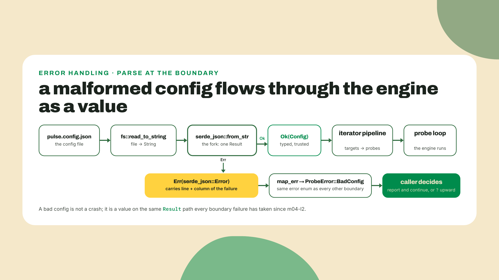
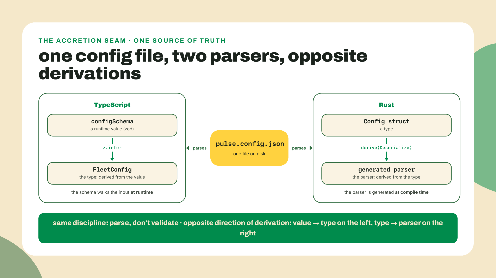
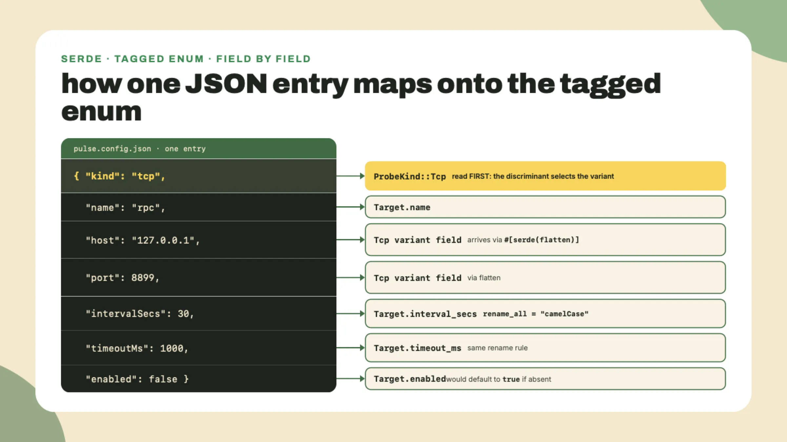
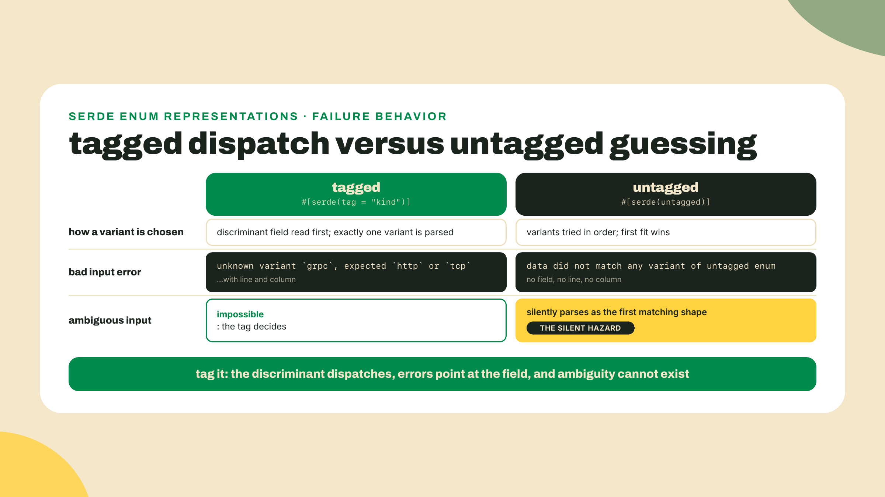
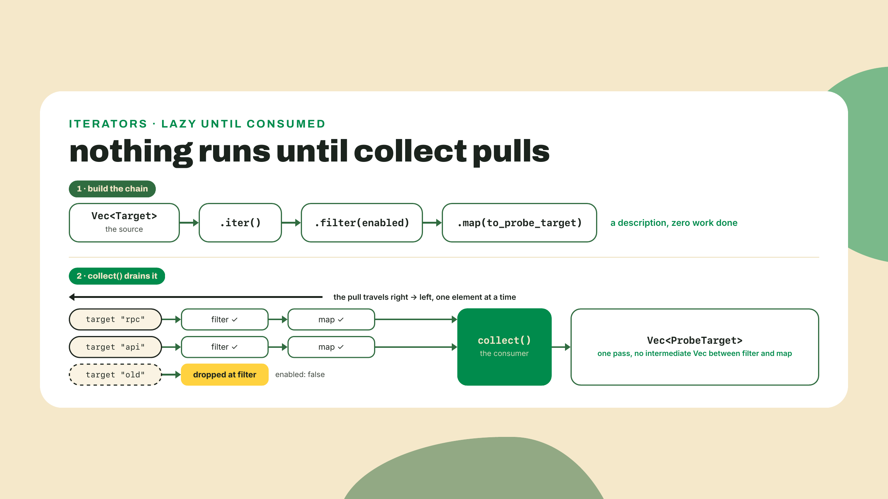
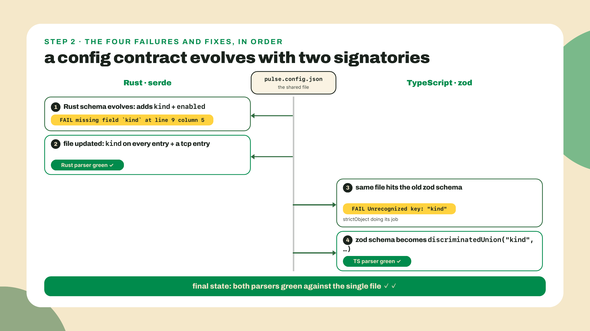

# serde: the boundary parser

## Summary

m04-l3 completed the Rust engine: the ProbeState machine, typed errors end to end, the cargo test, clippy, and fmt gate green next to vitest on the one pipeline. But the engine's config is hardcoded and its latencies are fixtures. Today the config problem dies. You hand-write a config parser, feel exactly what it costs, then delete it with one derive line, because serde generates the parser from your types the way zod inferred your types from a schema in M2. Same file on disk, both languages parsing it, one discipline wearing two flags. Along the way: tagged enums, the attribute mini-language, your first iterator pipeline. Housekeeping: M4's completion-loop grain is over, deliberately. M5 returns to the default shell: overview worked with me, lab scaffolds thinning as you go, the pipeline step yours, the challenge fully unguided.

## Feel the pain first

Before serde earns anything, you pay retail. Here is one probe target as a flat config line:

```text
name=api;url=https://example.com/health;timeout_ms=500
```

Parse it by hand, in `pulse-rs`, using nothing but `split`, `match`, and the `Result` plumbing you built in m04-l2. And do it honestly, because the dishonest version is ten minutes and a lie. Honest means: split pairs on `;`, split each pair on the FIRST `=` only (that URL is one query string away from containing `=`), reject unknown keys as errors instead of shrugging them off, validate the url scheme and the timeout digits, and report missing keys in a fixed order. Every failure comes back as an `Err` value, never a panic.

This lesson's coding-challenge panel has a starter, `kv-config-parser`, that compiles and cheats on every one of those rules; open it in the in-browser editor and start making it honest now. Set a timer, actually. The core of the honest version looks like this:

```rust
let (key, value) = match pair.split_once('=') {
    Some((k, v)) => (k, v),
    None => return Err(format!("bad pair: {pair}")),
};
match key {
    "name" => name = Some(value.to_string()),
    "timeout_ms" => {
        let parsed = value
            .parse::<u64>()
            .map_err(|_| format!("invalid timeout_ms: {value}"))?;
        timeout_ms = Some(parsed);
    }
    other => return Err(format!("unknown key: {other}")),
}
```

And that is only the per-pair half. Each field also has to be tracked as an `Option` across the loop, because "the key never appeared" is a different failure from "the key appeared broken", and the spec wants missing keys reported in a fixed order. The endgame of the honest version is three lines of the m04-l2 `ok_or_else` move:

```rust
let name = name.ok_or_else(|| "missing key: name".to_string())?;
let url = url.ok_or_else(|| "missing key: url".to_string())?;
let timeout_ms = timeout_ms.ok_or_else(|| "missing key: timeout_ms".to_string())?;
```

Twenty minutes, give or take, of `Option` tracking, `ok_or_else` calls, and error strings. For ONE flat record. With THREE fields. Now scale that up to a fleet-level config, a fleet name plus an array of target records, the m02-l2 shape this lesson is about to resurrect (the full story of where that file went lives a few screens down), and do the math on hand-parsing that. That number is what this lesson deletes. Keep your hand-rolled parser though; it comes back as the challenge, and finishing it is how you will know exactly what the derive bought you.

## The compiler writes the parser

Two installs, and note the digits carry a date:

```bash
cargo add serde@1.0.229 --features derive
cargo add serde_json@1.0.151
```

Those versions were checked against crates.io on 2026-09-02; serde has lived on the 1.x line for years, so whatever `cargo add` resolves for you today is fine. Small war story from checking them: crates.io rejects API calls that do not send a User-Agent header. Our own research tooling hit that during this course's fact sweep, a bare curl got non-JSON back where the version data should have been. The first thing you parse from a real boundary may be somebody's error page. Boundary parsing exists because boundaries lie, and that includes the boundary you query to learn about boundary parsers.

The `--features derive` flag matters. serde without the derive feature compiles fine as a crate and then fails on your `#[derive(Deserialize)]` line with an error that points at the attribute, not at `Cargo.toml`, which is exactly the wrong place to send you looking. If your first build explodes on the derive, check the features list before anything else.

Now the delete. This is the entire replacement for the parser you just sweated over, covering the whole config file:

```rust
use serde::{Deserialize, Serialize};

#[derive(Debug, Deserialize, Serialize)]
#[serde(rename_all = "camelCase")]
pub struct Config {
    pub fleet_name: String,
    pub targets: Vec<Target>,
}

#[derive(Debug, Deserialize, Serialize)]
#[serde(rename_all = "camelCase")]
pub struct Target {
    pub name: String,
    pub url: String,
    pub interval_secs: u64,
    pub timeout_ms: u64,
}
```

No parsing code. You describe the shape; the derive macro generates the parser at compile time, field checks, type checks, missing-key errors, all of it. `rename_all = "camelCase"` is the seam with the TypeScript side: the file on disk says `intervalSecs` and `timeoutMs` because the fleet wrote it, Rust fields are `snake_case` because clippy has opinions, and one attribute translates between the two conventions so neither language has to hold its nose.

Using it is one function call that returns, and this should feel familiar by now, a `Result`:

```rust
pub fn parse_config(raw: &str) -> Result<Config, ProbeError> {
    serde_json::from_str(raw).map_err(ProbeError::BadConfig)
}
```

`serde_json::from_str` gives you `Result<Config, serde_json::Error>`, and the failure is a value carrying what went wrong and where, down to line and column. No exception, no panic, nothing you have not held before. `map_err(ProbeError::BadConfig)` is the m04-l2 muscle doing its exact job, bridging the foreign error into your engine's taxonomy, and yes, that is the variant name used bare as a function, the trick clippy taught you when it flagged the redundant closure. Which means a loan just came due: m04-l2 parked `#[allow(clippy::redundant_closure)]` on `parse_fixture_line` with a written expiry reading "collapse the closure in M5, delete this allow." It is M5. Open `engine.rs`, change that line to `.map_err(ProbeError::BadFixture)?`, delete the attribute and its comment, and let `cargo clippy` confirm the debt is cleared. `ProbeError` grows one variant to receive the config failure:

```rust
#[error("config rejected: {0}")]
BadConfig(serde_json::Error),
```



One resist-the-reflex note before we go on. The whole point of m04-l2 was that a boundary failure is a value you route, so `from_str(...).unwrap()` at the config boundary would be spending two lessons of discipline to save nine characters. The malformed-config case is not exceptional. It is Tuesday. It gets a variant, a message, and a decision, like everything else.

### Same file, both parsers, one screen

Here is the part I have been waiting to show you since M2, with one piece of station history told straight first. In m02-l2 you designed a fleet-level config, `fleetName` plus an array of named targets, and a zod schema to guard it. Then m02-l3's burst drill overwrote both: the fleet's live `packages/pulse-fleet/pulse.config.json` has been the burst shape ever since (`targets` as a flat URL list, `timeoutMs`, `concurrency`, `retry`), and its `configSchema` is burst-shaped and load-bearing for `fleet.ts` and the test suite. The fleet-level shape did not survive on disk. Today it comes back on purpose, at a new address: the station repo root, as the config the Rust arc parses from here on, while the burst config stays exactly where it is. Two files, two jobs, honestly split: the burst config says which URLs to hammer this instant; the root config says which targets the station watches forever. This is the file the lab has you create:

```json
{
  "fleetName": "pulse-prod",
  "targets": [
    {
      "name": "docs",
      "url": "https://example.com",
      "intervalSecs": 60,
      "timeoutMs": 3000
    },
    {
      "name": "api",
      "url": "https://example.org/health",
      "intervalSecs": 30,
      "timeoutMs": 2000
    }
  ]
}
```

And in m02-l2 you wrote the schema for it. The lab rebuilds that schema in a new module, `src/root-config.ts`, beside the burst schema rather than over it, so the fleet can sign this file too:

```ts
export const rootTargetSchema = z.strictObject({
  name: z.string().min(1),
  url: z.url(),
  intervalSecs: z.number().int().positive(),
  timeoutMs: z.number().int().positive(),
});

export const rootConfigSchema = z.strictObject({
  fleetName: z.string().min(1),
  targets: z.array(rootTargetSchema).min(1),
});

export type RootConfig = z.infer<typeof rootConfigSchema>;
```

Put that beside the `Target` struct above and read the two slowly. zod: you wrote a schema, a runtime value that walks the input, and `z.infer` derived the static type FROM the schema. serde: you wrote a type, and the derive generated the parser FROM the type. Same file. Same refusal at the door. Same "after this line, the data is the shape I reasoned about." The direction is opposite and the discipline is identical: parse, don't validate, cross the boundary once into a type that cannot represent the garbage, and let the rest of the program trust it.

The collapse, and it is not a metaphor: derive(Deserialize) is zod running at compile time. zod pays for its flexibility with a runtime schema object walking your data; serde pays for its speed with a macro expansion you cannot tweak at runtime. Underneath, one idea.

Why this concept carries so much weight in web3 specifically: on the Rust side of this ecosystem, nearly everything that crosses a process boundary crosses it through serde. When this course's research surveyed five production Solana-adjacent repos, agave, yellowstone-grpc, photon, jito-relayer, and carbon, serde and serde_json were in every single manifest, five for five, in the same universal tier as tokio, thiserror, anyhow, and clap. RPC requests and responses, config files, webhook payloads, the JSON a keypair file is stored as: all of it enters typed Rust through the machinery you are learning right now. This is not a chapter you are sampling. It is load-bearing infrastructure for the rest of your Rust life.



That discipline has a history worth thirty seconds. zod 3.0.0 shipped on 2021-05-17; version 4 did not go GA until 2025-07-09. Four years on one major, and in that window "parse, don't validate" grew from a blog-post slogan into the default boundary culture of an entire ecosystem. The idea was never TypeScript-specific. Rust just enforces it harder, because here there is no `any`-shaped escape hatch to smuggle unparsed data past the boundary; the only way to a `Config` is through the parser the compiler wrote.


### Tagged enums: making a bad kind unrepresentable

The config is about to grow, because real configs always do. Right now every target is an HTTP probe, but a monitoring fleet's target list never stays one shape for long: a plain socket check needs a host and a port where an HTTP probe needs a url. Different kinds, different fields, one closed set. In m04-l3 you modeled exactly this shape in memory: a closed set of variants, each carrying its own data. The question is what that looks like when it has to survive a trip through JSON, and the answer is a discriminant field, the same `"kind"` move your `ProbeResult` union has used on the TS side since M2:

```rust
#[derive(Debug, Deserialize, Serialize)]
#[serde(tag = "kind", rename_all = "lowercase")]
pub enum ProbeKind {
    Http { url: String },
    Tcp { host: String, port: u16 },
}
```

`tag = "kind"` is the internally tagged representation: serde reads the `"kind"` field first, dispatches to exactly one variant, and parses the remaining fields against that variant's shape. `rename_all = "lowercase"` maps `Http` to `"http"` on disk. A config entry that says `"kind": "grpc"` fails with a named error listing the legal variants, and you will read that exact error in the lab. The `Target` struct absorbs the enum inline:

```rust
#[derive(Debug, Deserialize, Serialize)]
#[serde(rename_all = "camelCase")]
pub struct Target {
    pub name: String,
    pub interval_secs: u64,
    pub timeout_ms: u64,
    #[serde(default = "default_enabled")]
    pub enabled: bool,
    #[serde(flatten)]
    pub kind: ProbeKind,
}

fn default_enabled() -> bool {
    true
}
```

Two new attributes, both daily-use. `#[serde(flatten)]` splices the enum's fields into the target's JSON object instead of nesting them one level down, so the file stays flat and human-editable. `#[serde(default = "default_enabled")]` makes `enabled` optional in the file with an explicit default, which is the migration kindness that lets every existing entry keep working when a field arrives; strictness where it protects you, lenience where you opted in, field by field.



You may have noticed every derive line in this lesson also says `Serialize`. That is the return ticket, and it is not decoration. The same attributes drive both directions, so a `Target` serializes back to the exact flat, camelCased, kind-tagged JSON it was parsed from:

```rust
let json = serde_json::to_string_pretty(&target)?;
```

```json
{
  "name": "rpc",
  "intervalSecs": 30,
  "timeoutMs": 1000,
  "enabled": false,
  "kind": "tcp",
  "host": "127.0.0.1",
  "port": 8899
}
```

One set of attributes, two directions, zero drift between what you read and what you write. Today the engine only reads; next module, the long-running poller grows a `/status` endpoint that has to EMIT JSON, and this derive is the reason that will cost you one function call instead of a templating session.

Now the trap, shown once so you recognize it in the wild. Delete the tag and serde still offers you a way out:

```rust
#[derive(Debug, Deserialize)]
#[serde(untagged)]
pub enum LooseKind {
    Http { url: String },
    Tcp { host: String, port: u16 },
}
```

Untagged means serde tries each variant in order and takes the first that fits. Feed it garbage and the error degrades to `data did not match any variant of untagged enum LooseKind`, no line, no field, no clue. Worse is what happens when data fits more than one shape: an object carrying both a `url` and a `host` parses cheerfully as `Http` and drops the rest on the floor, first match wins, silently. Untagged is for consuming formats you do not control and cannot fix. The moment you own the format, and you own this one, tag it.



The honest cost of all this, because there is one. The attribute language, `tag`, `rename_all`, `default`, `flatten`, is a mini-DSL, and the compile-time guarantee covers your TYPES, not your attribute spelling. Misspell a tag value or point `rename_all` the wrong way and the code compiles clean, then fails at runtime. Try it: delete the `rename_all` line from `Config` and run against the fleet's file. Green build, then the parse dies with ``missing field `fleet_name` ``, naming a field sitting RIGHT THERE in the file, one naming convention over. The attributes are configuration, not code the compiler checks against your data, and a derived parser is a contract with the config's exact shape: schema evolution becomes a parse failure you design for on purpose. The design rules are short: additive fields get `#[serde(default)]` so deployed files keep parsing, closed sets get tagged enums so a new variant is a loud named error, and renames are breaking changes you schedule. You will feel all of this the moment the old file meets the new schema. One more honesty note: serde ignores unknown fields by default for self-describing formats like JSON, looser than your zod `strictObject`; `deny_unknown_fields` exists but, per serde's own docs, does not combine with `flatten`. Trade-offs all the way down; know which posture each boundary has.

### Your first iterator pipeline

Just-in-time concept, and the last one this lesson needs. The parsed `Vec<Target>` is raw material; the engine wants a probe list. Only enabled targets, mapped into the engine's shape:

```rust
#[derive(Debug)]
pub struct ProbeTarget {
    pub name: String,
    pub endpoint: String,
    pub budget_ms: u64,
}
```

And this is the transformation, your first iterator chain:

```rust
let probes: Vec<ProbeTarget> = config
    .targets
    .iter()
    .filter(|t| t.enabled)
    .map(|t| t.to_probe_target())
    .collect();
```

You have written this program before. `targets.filter(t => t.enabled).map(toProbeTarget)` has been in the fleet since M2, and the closures inside are the `map_err` closures from m04-l2 with different jobs. Read it as the same array chain wearing a Rust flag and you have 90% of it. The remaining 10% is one word: lazy. `iter`, `filter`, and `map` do no work; they build a description of work, and nothing runs until a consumer like `collect` pulls elements through. That is why Rust chains do not allocate an intermediate collection per step the way chained JS array methods do, and it is all the laziness theory you need today; the full treatment lives in the go-deeper box below.



`collect` is one consumer among several, and swapping the consumer changes the question the same chain answers. Two you will use this week, straight off the fleet's config:

```rust
let enabled = config.targets.iter().filter(|t| t.enabled).count();
let slowest: u64 = config.targets.iter().map(|t| t.timeout_ms).max().unwrap_or(0);
```

`count` answers "how many survive the filter", `max` answers "what is the largest budget", and both drain the chain without building a collection at all. (That `unwrap_or` is not a lapse: `max` returns an `Option` because an empty list has no maximum, and zero is a defensible answer for it, the m04-l2 rule about defaults you can defend in a comment.)

Two footguns before the lab. `collect` needs a destination type, because it can build a Vec, a HashMap, a String, and more from the same chain; leave the type off and the compiler stops you with E0282, `type annotations needed`. Annotate the binding like above, or use the turbofish, `collect::<Vec<_>>()`. That error is the classic first-pipeline rite of passage, and now it is information, not obstruction. Second: `iter()` borrows. Your closures see `&Target`, which is why `to_probe_target` takes `&self` and clones the strings it keeps, m04-l1's rules quietly holding the floor.

**Go deeper (the 20%).** this lesson taught the derive, the tagged representation, and the four attributes you will actually type this year. The rest of serde, custom `Deserialize` impls, the data model, zero-copy deserialization, every attribute, lives at [https://serde.rs/](https://serde.rs/), the crate's own book; its enum-representations page is the canonical map of tagged versus untagged and the two styles we skipped. For closures and iterators with the full laziness and performance story, the Book's chapter is [https://doc.rust-lang.org/book/ch13-00-functional-features.html](https://doc.rust-lang.org/book/ch13-00-functional-features.html), and the punchline there is worth the trip: iterators compile down to the same code as the hand-rolled loop. Both URLs checked live on 2026-09-02. The lab needs none of the bookmarked material.

## Lab: one file, two parsers

Numbered, scaffolds thinning as you descend. Steps 1 and 2 we do together, step 3 hands you signatures, step 4 is a drill you run alone.

1. **Create the root config, then parse it (worked).** Two moves. First the file itself: at the station repo root, one level above `pulse-rs/` (the m04-l3 gate moved `pulse-rs/` inside the station repo), create `pulse.config.json` with exactly the two-target content printed in the overview, `fleetName: "pulse-prod"`, `docs`, and `api`. This is a new file at a new address, the fleet-level config the theory section resurrected; nothing in `packages/pulse-fleet` moves or changes. Then the Rust side: in `pulse-rs`, create `src/config.rs` with the first `Config` and `Target` structs from the overview, the v1 shapes with `url` directly on `Target`, plus `parse_config` and the `BadConfig` variant added to `ProbeError` in `src/engine.rs`. Copy nothing into `pulse-rs`: from `pulse-rs/`, a symlink keeps the cwd-relative read below working: `ln -s ../pulse.config.json pulse.config.json` (or just read `"../pulse.config.json"` directly; the point is one file, not two copies). Temporary main, and note it inlines the same serde call `parse_config` wraps; that is deliberate, step 4's boundary drill is where `parse_config` takes over, so the function you just wrote sits briefly unused rather than misplaced:

   ```rust
   mod config;
   mod engine;

   use engine::ProbeError;
   use std::fs;

   fn main() -> anyhow::Result<()> {
       let raw = fs::read_to_string("pulse.config.json")?;
       let config: config::Config =
           serde_json::from_str(&raw).map_err(ProbeError::BadConfig)?;

       println!("fleet \"{}\": {} target(s)", config.fleet_name, config.targets.len());
       for t in &config.targets {
           println!(
               "  {} -> {} every {}s, timeout {}ms",
               t.name, t.url, t.interval_secs, t.timeout_ms
           );
       }
       Ok(())
   }
   ```

   One expectation set before you run it: this temporary main orphans the entire m04 engine surface, so the build arrives wearing a wall of dead-code warnings, a couple dozen of them, every lesson-long. Expected, and temporary: next lesson's workspace split puts the engine back in a consumed crate. Just do not push until then, because the station's CI runs `cargo clippy -- -D warnings` and would count every one of them as an error. `cargo run` should print:

   ```text
   fleet "pulse-prod": 2 target(s)
     docs -> https://example.com every 60s, timeout 3000ms
     api -> https://example.org/health every 30s, timeout 2000ms
   ```

   Now give the TS side its pen. The burst `configSchema` cannot sign this file (wrong shape, and it is load-bearing for `fleet.ts` and the tests, so it stays untouched); the root config gets its own module. Create `packages/pulse-fleet/src/root-config.ts` with the `rootTargetSchema`, `rootConfigSchema`, and `RootConfig` from the overview (plus `import { z } from "zod";` at the top), and a four-line checker beside it, `src/check-root-config.ts`, the m02-l2 move replayed:

   ```ts
   import { readFileSync } from "node:fs";
   import { parseOrExit } from "./config.js";
   import { rootConfigSchema, type RootConfig } from "./root-config.js";

   const path = process.argv[2] ?? "../../pulse.config.json";
   const raw: unknown = JSON.parse(readFileSync(path, "utf8"));
   const config: RootConfig = parseOrExit(rootConfigSchema, raw);
   console.log(`fleet "${config.fleetName}": ${config.targets.length} target(s)`);
   ```

   Run it from `packages/pulse-fleet` with `npx tsx src/check-root-config.ts ../../pulse.config.json`, and let the moment land: two languages, two type systems, one file, both boundaries refusing garbage. Checkpoint: both commands green on the same bytes.

2. **Evolve the contract (guided).** Swap in the tagged `ProbeKind` enum and the evolved `Target` from the overview, with `flatten` and the `enabled` default. The compiler objects before serde gets a turn: the temporary `main` still prints `t.url`, and `url` now lives inside the `Http` variant. Change that println to show `t.kind` with `{:?}` instead of the url, and rebuild. Now `cargo run` again, against the UNCHANGED file, and read your first schema-evolution failure:

   ```text
   Error: config rejected: missing field `kind` at line 9 column 5
   ```

   (The `Error:` prefix is anyhow's, printing the failure your `?` handed back out of `main`.)

   The derived parser is a contract with the shape, and you just changed the contract without telling the file. So tell the file: add `"kind": "http"` to both existing targets, and add a third target the TS fleet has never seen:

   ```json
   {
     "kind": "tcp",
     "name": "rpc",
     "host": "127.0.0.1",
     "port": 8899,
     "intervalSecs": 30,
     "timeoutMs": 1000,
     "enabled": false
   }
   ```

   It ships `"enabled": false` because no arm of the station can run a socket check yet, and a config that names a probe nobody can run should say so. (That port is where a local Solana validator answers RPC, a door we knock on much later in the course.) Break it on purpose before you fix it: set `"kind": "grpc"` on that entry and run:

   ```text
   Error: config rejected: unknown variant `grpc`, expected `http` or `tcp` at line 26 column 5
   ```

   A named refusal listing the legal variants. Compare that with the untagged error in the overview and you have the whole tagged-versus-untagged argument in two lines of terminal output. Fix the kind back. One parser still objects, though: `check-root-config.ts` now refuses the file, `Unrecognized key: "kind"`, and it is RIGHT to, that is the `strictObject` strictness you asked for doing its job on an evolved contract. Both signatories re-sign or nobody ships. In `src/root-config.ts`, update `rootTargetSchema` to a discriminated union, the shape you already know from `ProbeResult`:

   ```ts
   const baseFields = {
     name: z.string().min(1),
     intervalSecs: z.number().int().positive(),
     timeoutMs: z.number().int().positive(),
     enabled: z.boolean().default(true),
   };

   export const rootTargetSchema = z.discriminatedUnion("kind", [
     z.strictObject({ kind: z.literal("http"), url: z.url(), ...baseFields }),
     z.strictObject({
       kind: z.literal("tcp"),
       host: z.string().min(1),
       port: z.number().int().min(1).max(65535),
       ...baseFields,
     }),
   ]);
   ```

   `z.discriminatedUnion("kind"...)` and `#[serde(tag = "kind")]` are the same machine on opposite sides of the file. Checkpoint: `cargo run` prints three targets' worth of config, and `check-root-config.ts` accepts the same file again.



3. **The pipeline (yours).** Wire `ProbeTarget` and the filter-map-collect chain from the overview into `main`, then feed the result to the engine you built in m04-l3. One retirement first: `engine.rs` still exports the skeletal `ProbeTarget { name, url }` from m04-l1, and the config module's `ProbeTarget { name, endpoint, budget_ms }` is its grown-up replacement. Two pub types with one name in one crate is drift waiting to happen, so delete the m04 one from `engine.rs` now; nothing calls it since step 1's temporary main, and `cargo check` will vouch. The new type and `Target::to_probe_target` belong in `src/config.rs`, next to the structs they are derived from, which is exactly where next lesson's re-export list expects them. Then the pipeline: for each probe, drive the state machine over fixture latencies with the target's own `timeout_ms` as the budget. The closure signatures are your scaffold, the bodies and the wiring are not: `filter` takes `|t: &&Target| -> bool` (double reference, `iter` lends and `filter` lends again; `t.enabled` just works through both), `map` takes `|t: &Target| -> ProbeTarget`. Write `to_probe_target(&self)` as a `match` on the kind: `Http` yields the url as the endpoint, `Tcp` formats `host:port`. My `main` ends up like this; write yours before comparing:

   ```rust
   let probes: Vec<ProbeTarget> = config
       .targets
       .iter()
       .filter(|t| t.enabled)
       .map(|t| t.to_probe_target())
       .collect();

   println!(
       "fleet \"{}\": probing {} of {} targets",
       config.fleet_name,
       probes.len(),
       config.targets.len()
   );

   for probe in &probes {
       let mut source = FixtureSource::new(vec![212, 487, 2400, 2600]);
       let state = drive(&mut source, probe.budget_ms);
       println!(
           "  {} -> {} settles {:?} (budget {} ms, fixture latencies)",
           probe.name, probe.endpoint, state, probe.budget_ms
       );
   }
   ```

   Checkpoint output, worth reading closely:

   ```text
   fleet "pulse-prod": probing 2 of 3 targets
     docs -> https://example.com settles Up (budget 3000 ms, fixture latencies)
     api -> https://example.org/health settles Degraded (budget 2000 ms, fixture latencies)
   ```

   Two of three: the filter dropped the disabled TCP target, so the pipeline is load-bearing, not decoration. And the same four fixture latencies settle differently under different budgets, 2400 and 2600 ms sail under docs' 3000 budget and blow api's 2000 twice, which is the m04-l3 machine consuming real config for the first time. Say the limits out loud: the latencies are still fixtures, the engine still probes nothing, and the real HTTP arm is two lessons away in m05-l3.

4. **The boundary drill (alone).** Copy the config to `pulse.config.broken.json` and set the api entry's `timeoutMs` to `"fast"`. Put the copy wherever the read below will find it, which depends on which of step 1's two wirings you took: if you made the symlink, the broken copy goes in `pulse-rs/` next to it; if you are reading `"../pulse.config.json"` directly, the copy goes at the repo root and the path in the snippet becomes `"../pulse.config.broken.json"`. Get this wrong and `?` hands you an `anyhow` NotFound before the refusal message this drill exists to show ever prints. Then make `main` load the broken copy AFTER the real one, reporting the failure without dying:

   ```rust
   let broken = fs::read_to_string("pulse.config.broken.json")?;
   if let Err(e) = parse_config(&broken) {
       println!("broken copy refused: {e}");
   }

   println!("run complete");
   ```

   Expected tail of the run:

   ```text
   broken copy refused: config rejected: invalid type: string "fast", expected u64 at line 16 column 25
   run complete
   ```

   The line and column will match wherever your editor put that field; what matters is that they are THERE, in an error value you routed, printed by a run that then kept going. Recognize the shape? It is m02-l2's broken-config drill, wearing the other flag. **Verify before moving on**: `cargo run` prints the three-target fleet summary with two probed, the broken-copy refusal with line and column, and `run complete`. That is this lesson's whole contract in one screen.

## Challenge

Now go finish what the opener started: `kv-config-parser`, fully unguided, in the coding-challenge panel. The starter's parser is a liar: it splits on every `=`, swallows unknown keys, invents defaults where it should refuse. Make it honest: first-`=` splitting via `split_once`, an allowlist of keys, url scheme and timeout validation, missing keys reported in the fixed order name, url, timeout_ms, every failure an `Err`, no unwrap on the parse path. Eight tests grade it, including the query-string URL that punishes lazy splitting and the trailing semicolon that punishes lazy iteration. Hints escalate from `split_once` to the missing-key `ok_or_else` endgame; spend them in order. This is deliberately the last hand-rolled parser you write in this course, which is exactly why it is worth writing well: after it, you know to the line what every future derive does for you.

## Checkpoint

What you can now do, concretely: turn a struct definition into a JSON parser with one derive and read the four attributes that carry daily serde use; model a discriminated format as a tagged enum and explain, with two error messages as evidence, why tagged beats untagged on formats you own; route a parse failure through your error taxonomy as a value with line and column attached; and transform a parsed list with filter, map, and collect, knowing nothing runs until the consumer pulls. One interface note for your future self: `parse_config(&str) -> Result<Config, ProbeError>` and `Target::to_probe_target` are now part of the engine's public surface. Next lesson moves them into a library crate, and later lessons call them by exactly these signatures, so resist the urge to "tidy" them between now and then.

The 30-second retrieval before you close the tab, out loud: zod infers the what from the schema, and serde derives the what from the type? (The type; the parser. Opposite directions, one discipline.) And what single word explains why your chain did no work before `collect`? (Lazy.)

Friction report, while it is fresh: did the schema-evolution failure in lab step 2 feel like the lesson breaking or the lesson landing? That beat is designed to sting, the contract-with-a-shape idea does not stick without it, but there is a version of it that just reads as churn, and your report is how I find out which one shipped. Same for the double reference in `filter`; if `|t: &&Target|` cost you more than a minute, say so.

Your engine now reads the fleet's real config through a parser you did not have to write, and everything lives in one crate, which is about to become the problem. The CLI you grow next needs the engine as a library, and a release binary should not drag test fixtures along with it. Next lesson: cargo workspaces, editions, features, and reading other people's version pins, Cargo.toml as a negotiation with every machine that will ever build your code. Bring your manifest; every line of it is about to mean something.
