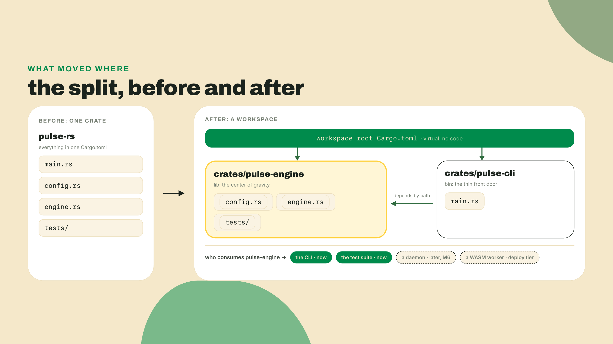
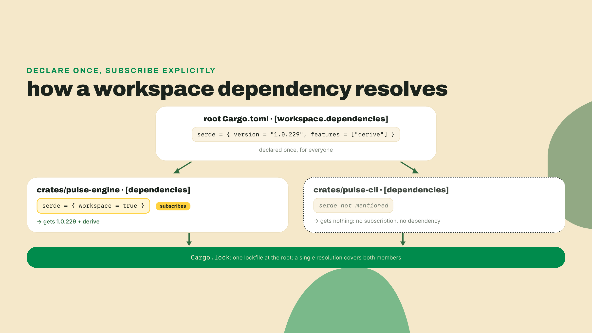
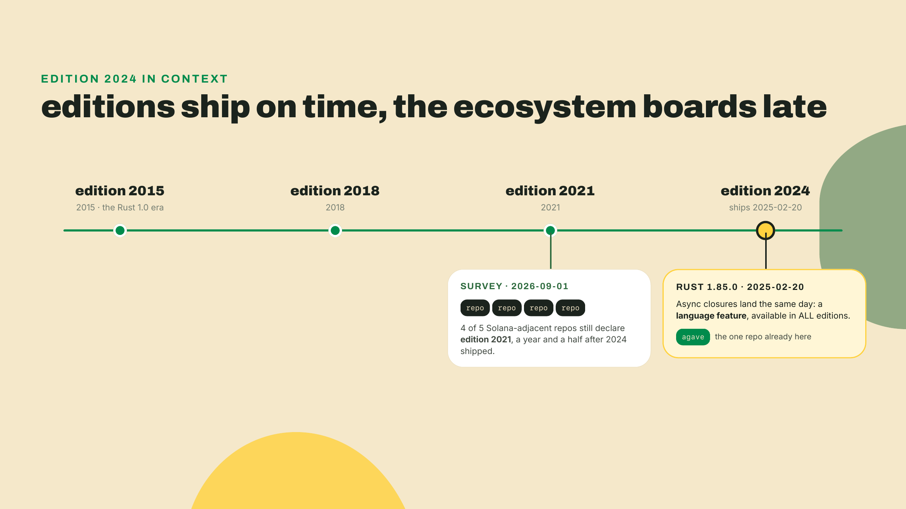
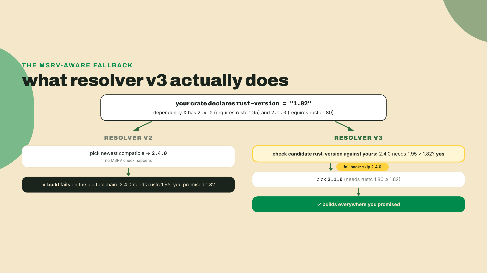
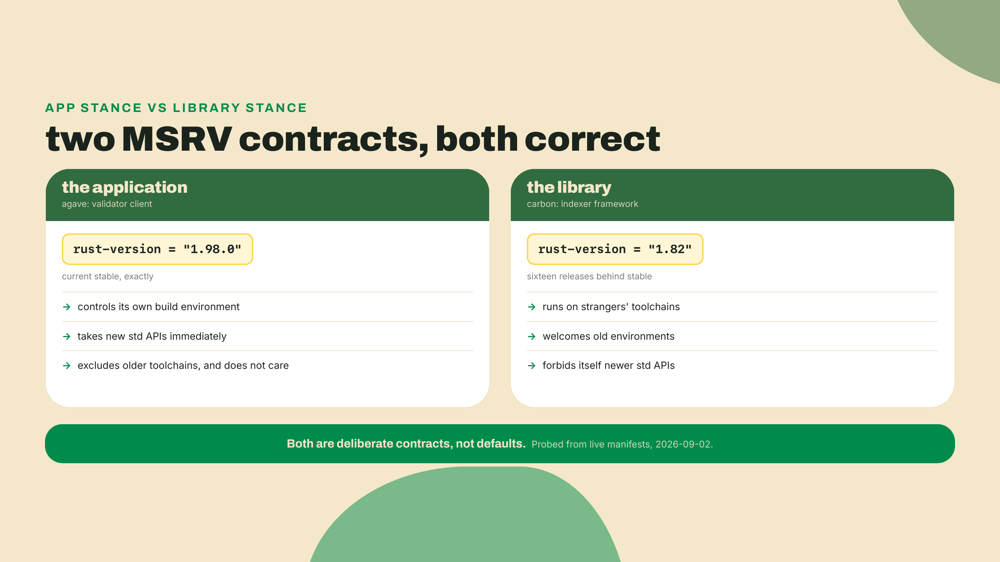
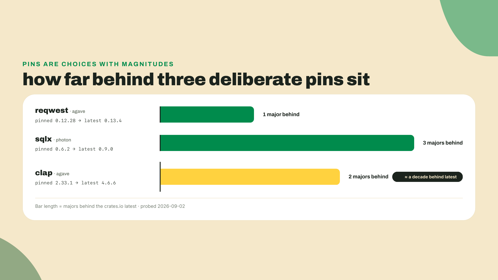
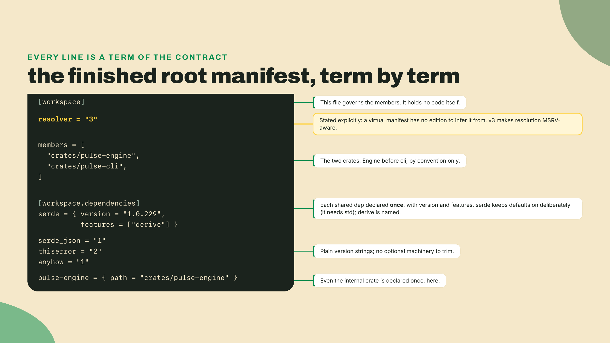

# cargo mastery: editions, workspaces, features, MSRV

## Summary

m05-l1 gave the engine serde: `pulse-rs` parses the same config file the TS fleet zod-parses, probe kinds live in a tagged enum, and your first iterator pipeline filters and maps the target list. All of it still sits in one crate. This lesson fixes the shape, not the code: you split `pulse-rs` into a two-crate cargo workspace in the first ten minutes, then spend the rest of the session learning to read the file that split produced, because Cargo.toml is where editions, MSRV, features, and other people's version pins all live. How the reps run this time: the split itself is worked with me, hoisting dependencies is guided by the compiler's own errors, declaring your MSRV is on you, and the closing pin-reading drill is fully unguided. That last one is the muscle this lesson exists to build.

## The negotiation

Cargo.toml looks like configuration. It is actually a negotiation with every machine that will ever build your code: your laptop, CI, a contributor's three-year-old toolchain, the resolver picking versions on a machine you will never see. Every line in it is a term in that contract. We are going to write one worth signing, starting now, split first, theory after.

From the root of `pulse-rs`:

```bash
cargo new crates/pulse-engine --lib
cargo new crates/pulse-cli
```

Two fresh crates, one a library, one a binary. Now replace the entire root `Cargo.toml` (the one that has carried the whole project since m04-l1) with three lines:

```toml
[workspace]
resolver = "3"
members = ["crates/pulse-engine", "crates/pulse-cli"]
```

That middle line earns its explanation later this lesson. Move the code: every module except `main.rs` goes into the engine, `main.rs` goes into the CLI. One trap first: `cargo new` already dropped a hello-world `main.rs` into `crates/pulse-cli/src/`, and `git mv` refuses to overwrite an existing destination (`fatal: destination exists`), so delete the stub before the move:

```bash
git mv src/config.rs src/engine.rs crates/pulse-engine/src/
rm crates/pulse-cli/src/main.rs
git mv src/main.rs crates/pulse-cli/src/main.rs
rm -rf src
```

Your filenames may differ from mine depending on how you carved up m05-l1; the rule does not: everything pure goes to the engine, the entry point goes to the CLI. Give the engine its dependencies by pasting the old `[dependencies]` block into `crates/pulse-engine/Cargo.toml`, minus one line: `anyhow` stays out of the engine, because it is binary-side machinery by the m04-l2 canon (thiserror in the library, anyhow in the binary) and it moves to the CLI manifest below instead:

```toml
[package]
name = "pulse-engine"
version = "0.1.0"
edition = "2024"

[dependencies]
serde = { version = "1.0.229", features = ["derive"] }
serde_json = "1.0.151"
thiserror = "2.0.20"
```

(Those are the digits current on crates.io as I write, probed 2026-09-02; yours are whatever m05-l1 left you with, and that is fine for now, the lab revisits them.) The engine's `src/lib.rs` declares the modules and re-exports the names the outside world may use:

```rust
pub mod config;
pub mod engine;

pub use config::{Config, ProbeKind, ProbeTarget, Target, parse_config};
pub use engine::{
    FixtureSource, LatencyMs, ProbeError, ProbeState, drive, next_state, total_latency,
};
```

Curate that list against its consumers, not against today's `main.rs` alone: `next_state`, `LatencyMs`, and `total_latency` are on it because m05-l3's report arm and the m06 poller call all three by these bare `pulse_engine::` names. A re-export list that only covers the current caller forces every future consumer to spelunk `pulse_engine::engine::` module paths, which defeats the point of naming a public surface at all.

The CLI depends on the engine by path and keeps only what a thin binary needs:

```toml
[package]
name = "pulse-cli"
version = "0.1.0"
edition = "2024"

[dependencies]
pulse-engine = { path = "../pulse-engine" }
anyhow = "1.0.104"
```

And `main.rs` shrinks to a consumer, calling the exact `parse_config` signature m05-l1's checkpoint told you to leave alone:

```rust
use pulse_engine::{Config, parse_config};

fn main() -> anyhow::Result<()> {
    let raw = std::fs::read_to_string("pulse.config.json")?;
    let config: Config = parse_config(&raw)?;
    for target in &config.targets {
        println!("{} -> {:?}", target.name, target.kind);
    }
    Ok(())
}
```

Fix the `use` paths in the moved modules (`crate::engine::ProbeError` still works inside the engine; anything `main.rs` used now comes through `pulse_engine::`), then:

```bash
cargo check --workspace
```

Green. Ten minutes in, and your Rust now has the shape of every serious Rust repo you will ever open. agave, the validator client this whole ecosystem runs on, is this exact structure scaled up: one root manifest, a `crates`-style member list, libraries in the middle, binaries at the edge.



Why this shape, and why now? Because M4 made you pay for purity: the classifier, the config types, the error enum all take values in and hand values back, no I/O anywhere near them. That investment starts paying rent today. A pure core compiles to a library that anything can consume: the CLI you just made, the test suite, the daemon this course builds later, even a WASM worker in the deploy tier. The impure edge stays thin and swappable. If this song sounds familiar, it should: it is m03-l1 note for note, where you extracted `pulse-core` into a pnpm workspace so the dashboard and the cron could share it. Monorepo-lite is one idea wearing two toolchains, and you have now built it in both.

### One declaration, many subscribers

Right now each member declares its own dependency versions in its own manifest: the engine carries digits for serde, serde_json, and thiserror, and the CLI carries digits for anyhow plus its own `path` spelling of the engine dependency. Nothing is duplicated yet, and that is exactly the trap: the first future crate that needs one of these, and this workspace will grow, gets its digits by copy-paste from whichever manifest you happen to open, and from that moment two crates can sit on different lines without any single diff saying so. Two manifests, two places for versions to drift apart, and today, while the count is small, is the cheap moment to close the door. agave has hundreds of internal crates, and at that scale drift is a supply-chain incident waiting for a lockfile diff nobody reads. Their answer, and the pattern you adopt in the lab, is `[workspace.dependencies]`: declare each shared dependency once at the root, with its version and features, and let member crates subscribe.

Here is the root manifest you will have by the end of the lab:

```toml
[workspace]
resolver = "3"
members = ["crates/pulse-engine", "crates/pulse-cli"]

[workspace.dependencies]
serde = { version = "1.0.229", features = ["derive"] }
serde_json = "1.0.151"
thiserror = "2.0.20"
anyhow = "1.0.104"
pulse-engine = { path = "crates/pulse-engine" }
```

And each member's dependency block collapses to subscriptions:

```toml
[dependencies]
serde = { workspace = true }
serde_json = { workspace = true }
thiserror = { workspace = true }
```

Note what the member does NOT carry: version digits. The root declares; the member opts in with `workspace = true`. Members that never mention serde never get it, which is the point, automatic injection would bloat every crate with every dependency. A version bump becomes a one-line diff at the root, and no two crates in the workspace can silently sit on different serde lines. This is agave's observed shape, not a course invention: their root manifest declares every shared dependency exactly once, features and all, probed live on 2026-09-02.



Before the second half of the hygiene, pin down what a feature actually is, because we have been using one since m05-l1 without naming it. A feature is a named flag a crate author exposes that gates optional code and optional dependencies behind conditional compilation. `serde = { version = "1.0.229", features = ["derive"] }` is you flipping serde's `derive` flag, which pulls in the `serde_derive` proc-macro crate and the machinery behind `#[derive(Deserialize)]`; leave the flag off and that entire subtree never compiles. Features are additive by convention: turning one on adds capability, never removes it, which is what lets cargo do feature unification, building each crate once with the union of every feature any crate in the graph asked for. And every crate ships a special feature named `default`, the set the author turns on for you unless you say otherwise.

Which is where the second half of agave's hygiene comes in: `default-features = false`. Every crate author picks a default feature set for the average consumer, and a workspace is not average. Turning defaults off and naming only the features you use means every capability in your build was chosen on purpose: smaller binaries, faster builds, and a manifest that documents what each dependency is actually for. agave applies it with judgment rather than dogma, which is worth copying too. Their serde keeps defaults on with `derive` added; their reqwest and clap run defaults-off because those crates carry heavy optional machinery (TLS stacks, terminal helpers) that a validator does not want by accident.

The catch, and you will hit it deliberately in the lab: when you turn off a default feature something needed, the error does not say so. It surfaces as a missing item inside the DEPENDENCY's own code, a trait not implemented, a module that seems to have vanished from a crate that definitely has one. The compiler is telling the truth, the item was compiled out, but it points at their source, not your manifest line. The debugger for this is `cargo tree -e features`, which prints the resolved dependency graph with every feature edge visible. For manifest archaeology there is nothing better, and it ships inside cargo, nothing to install:

```bash
cargo tree -e features -p pulse-engine
```

Run it now against the workspace you just split and read serde's edges before the lab makes you need them.

The trade-off, named before you get attached: workspaces cost coupling. Every member resolves against the same dependency graph, one lockfile, one negotiation. If the CLI someday wants a shiny new major of some crate and the engine depends on something that pins the old one, the CLI waits. One crate's upgrade appetite can be held hostage by another's constraint, and you will see in a few minutes exactly how far that can go inside agave. Shared versions and zero drift, bought with shared fate. For a project like ours, and for most, the trade is worth taking on purpose.

### Editions, honestly

Both of your new crates say `edition = "2024"`, because `cargo new` wrote it. Time to know what you signed. An edition is Rust's mechanism for making breaking changes to the language without breaking anyone: your crate states which set of rules it was written against, and the compiler holds every crate to its own declaration, forever. Crates on different editions link together fine. That is why a 2015-edition crate still compiles today and why editions are per-crate contracts, not ecosystem events.

Edition 2024 is the current one. It shipped in Rust 1.85.0 on 2025-02-20, and at our level it changed three things you will actually notice: the dependency resolver defaults to v3 (next section), `extern` blocks must be marked `unsafe`, and taking references to `static mut` is denied. The same release also shipped async closures, and here is a distinction most blog posts get wrong: async closures are a language feature of Rust 1.85.0, available in every edition, not gated behind 2024. "Rust 1.85 shipped edition 2024 plus async closures" is the accurate sentence, and it matters because it tells you what an edition is not: new features arrive with compiler releases; editions only house the incompatible rule changes.

Now the honest part. I surveyed the manifests of five Solana-adjacent Rust repos while researching this course (agave, yellowstone-grpc, photon, jito-relayer, carbon, probed 2026-09-01), and four of the five still declare `edition = "2021"`. Only agave has moved. The train runs on time; the ecosystem boards late. So we teach 2024 and we write 2024, but nobody should pretend the ecosystem has migrated, and the contributor's rule follows directly: when you PR into a 2021 repo, you write 2021. Editions are the repo's contract, not your personal preference, and copying `edition = "2024"` out of a tutorial into someone else's crate is exactly the kind of drive-by nobody merges. For your OWN crates, when the next edition eventually arrives, the boarding fee is small: `cargo fix --edition` rewrites the incompatible patterns mechanically, you flip the digit, you review the diff. The edition guide documents that dance end to end, which is part of why the train can keep running on time at all.

And one disclosure with a date on it, 2026-09, because the catalog this course lives in has a rule that looks like it contradicts this lesson, and you should hear it from me. The Academy's on-chain Solana courses write `edition = "2021"` by rule, and for them 2024 is not unfashionable, it is rejected: their graded Rust compiles on a build server whose toolchain does not yet accept edition 2024, so writing 2024 there produces a broken build, not a style disagreement. This course is a deliberate carve-out from that rule, and it is safe for exactly two reasons: every line of Rust here compiles on your own machine with your own current rustc, and the graded challenges are single-file exercises that would compile identically under either edition. So we teach the current edition on purpose, and when you later enroll in an on-chain course, you already own the rule that resolves the tension: the build server is the repo. Match ITS edition.



One more thing your three-line root manifest already handled, and now I can explain it. The root of a workspace like ours is a virtual manifest: it has no `[package]`, so it has no `edition`, so cargo cannot infer which resolver you meant. Leave `resolver = "3"` out and cargo tells you about it on every build:

```text
warning: virtual workspace defaulting to `resolver = "1"` despite one or more
workspace members being on edition 2024 which implies `resolver = "3"`
```

That warning is cargo asking you to state a term of the contract explicitly. You already did.

### MSRV is a contract

`rust-version` is the manifest field nobody teaches and every serious repo carries. It declares your Minimum Supported Rust Version: the oldest toolchain allowed to build your crate. It is enforced, not decorative. Point a too-old cargo at a crate that declares `rust-version = "1.98.0"` and the build dies immediately with:

```text
error: rustc 1.93.1 is not supported by the following package:
  pulse-engine@0.1.0 requires rustc 1.98.0
```

Read that error once and you understand the field: it is a bouncer, checked before any code compiles. And `cargo add` respects it in the other direction, picking dependency versions whose own MSRV fits yours instead of handing you something your floor cannot parse.

Which brings us back to `resolver = "3"`. Resolver v3 is the edition 2024 default (it needs Rust 1.84 or newer to run at all), and its one job is making version resolution MSRV-aware. Under v2, cargo grabs the newest semver-compatible version of every dependency and lets an old toolchain discover the problem at compile time. Under v3, cargo checks each candidate's declared `rust-version` against yours and falls back past releases that demand a newer compiler than you support. Mechanically it flips one config key, `resolver.incompatible-rust-versions`, from `allow` to `fallback`.

Spell that key carefully: it is plural, `incompatible-rust-versions`. I flag it because the edition guide itself prints a singular typo on its resolver page, while the cargo reference prints the real key, four times. Copy the spelling from the wrong official page and you ship a config key that cargo silently ignores. Two official sources, one of them wrong: this is the course's verify-your-sources habit in miniature, and it applies to rust-lang.org exactly as much as to a random blog. When two docs disagree, the reference closest to the implementation wins.



So what number do you write? There is no correct answer, only a contract you choose on purpose, and the ecosystem shows you the two poles. agave declares `rust-version = "1.98.0"`, which is the current stable exactly (1.98.0 shipped 2026-08-20; both facts probed 2026-09-02, and with a stable release every six weeks the digit will move again soon). carbon, a library framework for building indexers, declares `rust-version = "1.82"`, sixteen releases back. Both are right. An application like a validator controls its own build environment, so it tracks latest and takes every new std API the day it lands. A library runs on other people's toolchains, so it trails, welcoming users it has never met at the cost of forbidding itself newer APIs. Declaring 1.82 welcomes older users AND ties your hands; declaring 1.98 frees your hands AND excludes people. Apps track, libraries trail, and the only real sin is not choosing.



For `pulse-rs` you will declare `rust-version = "1.85"` on both crates in the lab. The reasoning is the library stance: nothing in our code needs anything newer than the edition 2024 floor itself, and the engine is a library by construction, so it trails on purpose. One footgun before you write it: `rust-version` is a floor, not a pin. It stops an old toolchain from building you; it does not stop YOU, on a new toolchain, from writing an idiom your declared floor cannot parse. The honest enforcement is a CI job that builds on the MSRV toolchain itself. We are not adding one today, but know that serious libraries do, and that the field without the CI job is a promise without a test.

### Reading pins like a working dev

Everything so far was writing your own manifest. The dev-lifecycle skill hiding in this lesson is reading other people's, because every dependency line in a real repo is a decision someone made, and pins are where the decisions show. Three live artifacts, all probed from their repos' manifests on 2026-09-02. For each one, the working question: what is this pin telling you?

First. agave's root manifest:

```toml
reqwest = { version = "0.12.28", default-features = false }
```

crates.io's latest reqwest is 0.13.4, and 0.13.0 has been out since the end of 2025. The most actively maintained repo in the Solana ecosystem is a full major behind on its HTTP client, and it is not an accident, nobody forgets a dependency in a codebase that audited. A pinned old major in a living repo means someone evaluated the upgrade and said not yet: migration cost, behavior risk, review surface, something. The pin is a decision you are reading, not a chore nobody did.

Second, same manifest, further down:

```toml
clap = { version = "2.33.1", default-features = false, features = ["suggestions"] }
```

clap today is 4.6.6, and the 4.x line has been stable since 2022. This pin is a DECADE-old major, still shipping in production, still parsing the arguments of the software that runs a monetary network. I remember the first time a pin like this stopped me cold in someone else's repo: my instinct said under-maintained, and my instinct was wrong. The correct read is colder. Whatever clap 2 does for those binaries, it does it, and the cost of touching a thing that works, times every binary in the workspace, has lost the cost-benefit fight every year for ten years. The worst response to this line is the classic rejected first PR: a drive-by upgrade to clap 4 from someone who read the version number but not the repo. Notice also that this pin is the workspace trade-off from earlier at full scale: because agave centralizes every version in `[workspace.dependencies]`, one crate's clap is every crate's clap, so an upgrade is not one migration, it is all of them at once, and that is precisely why the pin holds.

Third, from photon, the Helius indexer for compressed accounts:

```toml
sqlx = { version = "0.6.2", features = [
    "macros",
    "runtime-tokio-rustls",
    # ...more features elided
] }
# time pinned because of https://github.com/launchbadge/sqlx/issues/3189
```

sqlx today is 0.9.0, three majors ahead. But look at what sits under the block: a comment linking the exact upstream issue the pin traces to. This is the gold standard, the pin that explains itself. A contributor arriving at this manifest does not have to reverse-engineer intent from git blame; the reason is one click away, and when the upstream issue closes, whoever sees it knows precisely what to retest. When you pin something in `pulse-rs` for a reason that is not obvious, this comment is the shape to copy.



If the pattern feels Rust-specific, it is not. You watched the TypeScript half of this same stack do it faster and louder: @solana/kit shipped two majors in just over nine weeks, between 2026-06-16 and 2026-08-21, right behind a minor, and this course's M3 lessons taught you to pin what your dependencies actually peer against rather than what npm calls latest. Same rule, both toolchains: read what your ecosystem pins before you upgrade anything. It is a survival habit, not pedantry.

The professional deliverable from a manifest read is one line per pin: what it implies for a contributor, what to match if you PR in. You will write three of those lines in the challenge, and the habit returns with real stakes in the M9 dependency-audit lab, where the tree you read is your own.

**Go deeper (the 20%).** this lesson taught the workspace, edition, MSRV, and feature patterns you will use weekly, plus the pin-reading skill. What it deliberately skipped is the full manifest field reference, profiles and build customization, and how resolution works from the inside. The canonical chapters, both probed live today: the cargo reference on the resolver at [https://doc.rust-lang.org/cargo/reference/resolver.html](https://doc.rust-lang.org/cargo/reference/resolver.html), and on rust-version at [https://doc.rust-lang.org/cargo/reference/rust-version.html](https://doc.rust-lang.org/cargo/reference/rust-version.html). That resolver page is also the correct place to copy the `incompatible-rust-versions` key from. Nothing in the lab depends on either page; bookmark them for the day a resolution surprises you.

## Lab: hoist, break, declare, verify

The split already happened in the opener, so the lab starts from a green `cargo check --workspace` and makes the workspace earn its keep. Steps 1 through 3 are guided; step 4, the MSRV declaration, is the one that is yours; step 5 hands you the integration-test file complete, because what earns its keep there is reading the second runner line and knowing why the tier exists, not typing eight lines; step 6 proves the whole thing to CI. The unguided rep this lesson is actually betting on is the challenge, three pin verdicts written cold.

1. Commit the split as it stands, so every following diff is readable:

   ```bash
   git add -A && git commit -m "split pulse-rs into engine + cli workspace"
   ```

2. Hoist the dependencies. Add the `[workspace.dependencies]` table from the theory section to the root manifest (serde with `derive`, serde_json, thiserror, anyhow, and the `pulse-engine` path entry), then rewrite both member `[dependencies]` blocks to subscriptions: `serde = { workspace = true }` and friends in the engine, `pulse-engine = { workspace = true }` and `anyhow = { workspace = true }` in the CLI. Run `cargo check --workspace` after each manifest you touch, not at the end; a manifest error found immediately names its own cause. And the classic slip here fails loudly and helpfully: subscribe to something you forgot to declare at the root and cargo says exactly what is missing:

   ```text
   error inheriting `thiserror` from workspace root manifest's
   `workspace.dependencies.thiserror`

   Caused by:
     `dependency.thiserror` was not found in `workspace.dependencies`
   ```

   Hold onto the contrast: manifest errors like this one name their cause in plain text, while the feature error you are about to meet in the next step does anything but.

3. Now break it on purpose, because the guided rep here is reading the breakage. In the root declaration, flip serde to defaults-off:

   ```toml
   serde = { version = "1.0.229", default-features = false, features = ["derive"] }
   ```

   `cargo check --workspace` again and read what you get. Not a friendly note about features. This (on cargo 1.98.1; older toolchains name different helper items from the same module, `Content` instead of `TaggedContentVisitor`, and the shape is identical):

   ```text
   error[E0433]: failed to resolve: cannot find `TaggedContentVisitor` in `de`
     --> crates/pulse-engine/src/config.rs
   note: found an item that was configured out
     --> .../serde-1.0.229/src/private/de.rs
   ```

   The error points into serde's own source, at your derive line, about an item that was "configured out," and repeats itself for a handful of sibling names (`ContentDeserializer`, `Content`, `ContentVisitor`). Nothing anywhere says you turned off `std`. This is the footgun from the theory section live on your screen, and the debugger is:

   ```bash
   cargo tree -e features -p pulse-engine
   ```

   In the output, find serde and read which feature edges exist. With defaults off you will see the `derive` edge but no `default` edge, and that absence is the entire bug. Now make the deliberate choice: our engine parses files with `String`s and `Vec`s everywhere, it needs `std`, and agave itself keeps serde's defaults on. Revert the flip. Defaults-off is a tool for heavy crates with optional machinery you do not want; applied to serde here it is cargo-culting the hygiene without the judgment. Knowing when NOT to apply the pattern is the pattern.



4. Declare the MSRV contract. This one is learner-led: add `rust-version = "1.85"` to both crates' `[package]` tables, and be able to say why 1.85 and not 1.98 in one sentence before you move on (the theory section's app-versus-library split is the sentence). Prove to yourself the field is enforced by reading, not running: the error text in the MSRV section above is what a 1.84 toolchain would print at your users. Then `cargo test --workspace`. Both crates build, the engine's m04 tests pass from the root, same green as before the split, new shape.

5. Collect the integration tier. m04-l3 named Rust's second testing tier, integration tests in a top-level `tests/` directory, and told you to park it until the workspace split happened. It just happened, so collect it. Create `crates/pulse-engine/tests/engine_contract.rs`:

   ```rust
   // The integration tier: this file compiles as its own tiny crate, linked
   // against pulse-engine, so it sees exactly what any outside consumer sees.
   // Private items are unreachable from here; pub ones are, either by the
   // short name lib.rs re-exported or by their full module path.
   use pulse_engine::{FixtureSource, ProbeState, drive};

   #[test]
   fn the_fixture_story_survives_the_public_surface() {
       // m04-l3's six-fixture walk: two clean probes, three failures past the
       // budget, one recovery. Ends Up, exactly as you walked it by hand.
       let mut source = FixtureSource::new(vec![212, 487, 1600, 1700, 1800, 90]);
       assert_eq!(drive(&mut source, 1500), ProbeState::Up);
   }
   ```

   Run `cargo test --workspace` and read the output with new eyes: below the unit-test binary you get a second runner line, `Running tests/engine_contract.rs`, because cargo compiled that file as its own crate and linked it against your library. That is the seam between the two tiers, and it is visibility, not geography: a `#[cfg(test)] mod tests` block lives inside the module and sees private items, while a file in `tests/` consumes the crate exactly as `pulse-cli` does, through the public surface you curated ten minutes ago. Which lets this one test do a job the five unit tests cannot: strip a name from the `lib.rs` re-export list and the unit suite stays green while this file stops compiling, the first consumer to notice the front door changed. One test holds the tier open today; the m04-l3 transition suite stays where it is, inside the module next to the match it pins, because poking `next_state`'s edge cases is unit-tier work and the file placement should say so.

6. Push, and watch the m04-l3 CI gate run unchanged. No workflow edits: the gate's cargo commands run against whatever the root manifest describes, and the root manifest now describes a workspace, so `cargo test` covers both members and both tiers, the new `tests/` crate included. Layout-agnostic CI is one of the quiet payoffs of cargo being one tool instead of five. When the run is green, the acceptance bar for the build half of this lesson is met: deps declared once at the root, both crates on edition 2024 with `rust-version` stated, `cargo test --workspace` green locally and in CI.

## Challenge

The unguided rep, on paper, no compiler to lean on. Three manifest excerpts from the theory section: agave's reqwest 0.12.28, agave's clap 2.33.1, photon's sqlx 0.6.2 with its issue-link comment. For each, write ONE line stating what the pin tells a contributor who is about to open a PR against that repo: what it implies about the codebase, and what you would match or avoid touching. No scaffold, no hints, and resist the urge to peek back at my readings; the drill is producing the verdict yourself, cold. Acceptance: three written lines, each naming a concrete implication (which API idioms your patch must use, what you must not relitigate inside an unrelated PR, or what the linked issue means for retesting). Do not keep the three lines in a scratch file. Commit them, at the station repo root, as `docs/pin-reads.md`, one heading per pin and your verdict under it, dated. Two reasons, and the second is the real one. A verdict nothing can find again is a verdict you will silently revise; a committed one you can be wrong in front of. And m09-l1's dependency-audit lab, which asks for exactly this skill against your own tree and grades it, opens this file and makes you read your cold verdicts against a checklist you will not have until then. Written today, graded in four lessons.

## Checkpoint

What you can now do, concretely: split a Rust project into the workspace shape the ecosystem actually uses, with dependencies declared once and members subscribing; say what edition 2024 changed and what it did not (async closures are a 1.85 language feature, all editions); declare an MSRV as a chosen contract and explain whose contract it mirrors, agave's or carbon's; and read a stranger's version pin as information instead of noise.

The 30-second retrieval before you close the tab: what does resolver v3 do that v2 did not, in one sentence? (It considers each dependency's declared rust-version when picking versions, falling back past releases your MSRV cannot build, instead of always grabbing the newest compatible.) If that sentence took you more than one try, reread the flowchart in the MSRV section, it is the one piece of this lesson that shows up in interviews.

One ask while it is fresh: the defaults-off breakage in lab step 3 is deliberately disorienting, and I want to know how disorienting. Note whether the "configured out" error made sense before or only after `cargo tree -e features`, and tell me in the feedback. If most of you only got it after, the next revision teaches the tree first and breaks second.

The workspace is shaped like the ecosystem now: a pure engine crate anything can consume, a thin CLI over it that does nothing but consume it. Which means the CLI is currently a hollow shell with a borrowed brain, and next lesson it earns the name: clap gives it a real command-line interface, blocking reqwest finally gives the station a REAL probe arm instead of fixture latencies, and CI starts handing strangers a binary they can download and run. Cargo.toml was the negotiation; next lesson ships something worth negotiating for.
