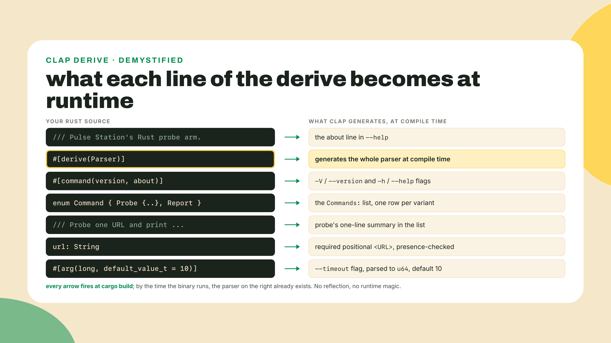
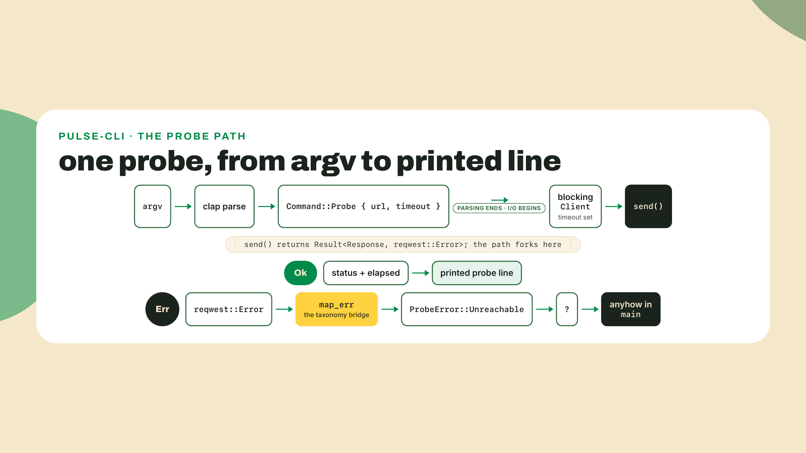
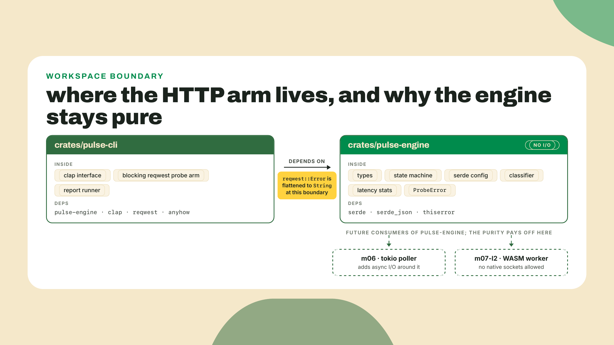
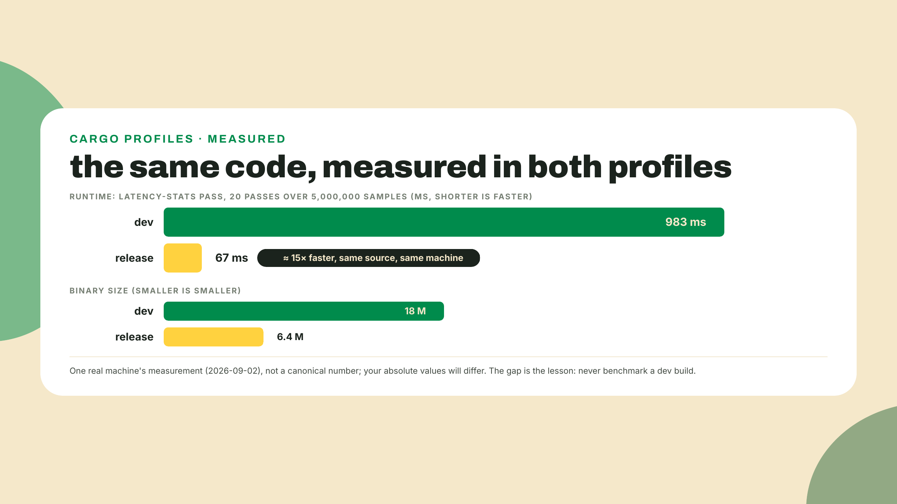
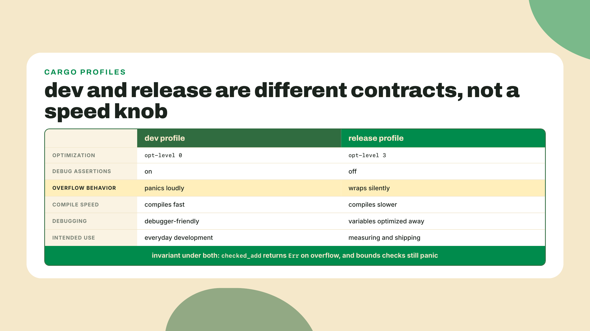
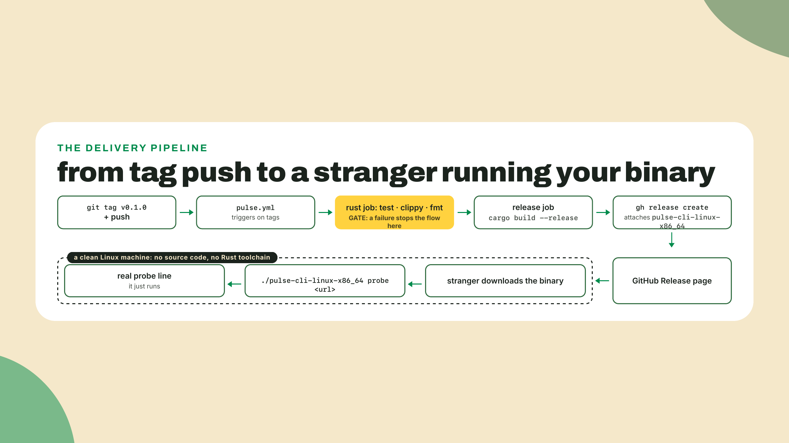
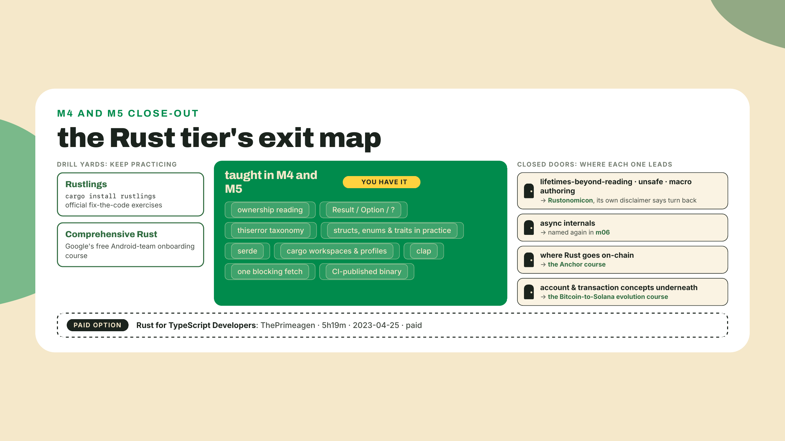

# clap, a real probe arm, and a binary anyone can download

## Summary

m05-l2 shaped the code like the ecosystem: a two-crate workspace with deps declared once, editions and MSRV chosen on purpose, and three real-world pins read like a working dev. The engine is a library now. And nothing calls it except tests. Today that ends three times over: the CLI gets a real interface with clap, the station's probe path finally touches a live URL over HTTP (from the CLI side; the engine stays I/O-free, exactly as designed), and CI starts publishing a binary a stranger can download and run without ever seeing your source. This is the last build of the Rust tier, one more shipped artifact on the station's shelf, and the scaffolds are the thinnest of the module: the clap derive is worked with me, the fetch is guided, the measurements and the second subcommand are yours, and the workflow extension at the end is fully unguided. That is the fade finishing what M4 started.

## Ten minutes to a help screen you never wrote

Do this before reading anything else. In your `pulse-rs` workspace root, open `crates/pulse-cli/Cargo.toml` and add one dependency:

```toml
clap = { version = "4.6", features = ["derive"] }
```

(`cargo add clap --features derive` from inside `crates/pulse-cli` does the same edit and writes today's exact digit, 4.6.6. Current on crates.io as of 2026-09-02; the 4.x line has been stable since 2022-09-28, so the pin is a calm one. And yes, member-local with an inline version, one lesson after the hoisting sermon: deliberate. The m05-l2 rule earns its keep for SHARED deps, and clap, like the reqwest you add later, has exactly one consumer; hoist them to `[workspace.dependencies]` the day a second crate wants either.)

Now replace `crates/pulse-cli/src/main.rs` with this skeleton. Note what the replacement parks, deliberately, not forgetfully: the m05-l2 body that read `pulse.config.json` through `parse_config` goes away, because the CLI's subcommands take their target from argv today. The config wiring returns when the m06 poller runs whole fleets on a schedule, and `parse_config`'s frozen signature is exactly what it will call; nothing about the engine's surface changes in the meantime.

```rust
use clap::{Parser, Subcommand};

/// Pulse Station's Rust probe arm.
#[derive(Parser)]
#[command(version, about)]
struct Cli {
    #[command(subcommand)]
    command: Command,
}

#[derive(Subcommand)]
enum Command {
    /// Probe one URL and print its status and latency
    Probe {
        /// The target to hit, scheme included
        url: String,
    },
    /// Run the latency-stats pass over a synthetic fixture set
    Report,
}

fn main() -> anyhow::Result<()> {
    let cli = Cli::parse();
    match cli.command {
        Command::Probe { url } => println!("would probe {url}"),
        Command::Report => println!("would report"),
    }
    Ok(())
}
```

(Keep `main`'s `anyhow::Result<()>` signature from m05-l2 even though nothing fails yet; the fetch you wire in later uses `?`, which only compiles inside a function that returns `Result`, and the `Ok(())` tail is the whole cost.)

Run it (the bare double-hyphen is cargo's separator: everything after it goes to YOUR binary, not to cargo):

```bash
cargo run -- --help
```

And look at what comes back:

```text
Pulse Station's Rust probe arm

Usage: pulse-cli <COMMAND>

Commands:
  probe   Probe one URL and print its status and latency
  report  Run the latency-stats pass over a synthetic fixture set
  help    Print this message or the help of the given subcommand(s)

Options:
  -h, --help     Print help
  -V, --version  Print version
```

A formatted, versioned help screen with usage lines, subcommand summaries, and a working `-V`. You wrote none of it. Back in M1 the TS `pulse` CLI's argument handling was your code and your bugs: the `process.argv` slicing, the "did they pass a URL" check, the usage string you kept forgetting to update. Here the interface is derived, the same trick serde pulled last module: the type is the spec, and the macro writes the machinery. For CLI surfaces, it is the best trade in the toolbox.

## From derived to downloadable

### The type is the interface

Look at what each piece of that struct became. The doc comment on the `Cli` struct became the about line. The doc comment on each enum variant became its one-line summary in the command list. The `url: String` field became a required positional argument, and because it is typed, clap owns the complaining:

```bash
cargo run -- probe
```

```text
error: the following required arguments were not provided:
  <URL>

Usage: pulse-cli probe <URL>

For more information, try '--help'.
```

Add a typed flag and the value parsing comes free too. Give `Probe` a timeout:

```rust
    Probe {
        /// The target to hit, scheme included
        url: String,
        /// Request timeout in seconds
        #[arg(long, default_value_t = 10)]
        timeout: u64,
    },
```

(The compiler will immediately point out that your `match` arm now needs the new field: `Command::Probe { url, timeout }`. Let it guide you; that is exhaustiveness working for you, not against you.) Now `--timeout 5` parses into a `u64`, no flag means 10, and garbage gets rejected with a message that names the flag, the value, and the reason: `error: invalid value 'abc' for '--timeout <TIMEOUT>': invalid digit found in string`. Every one of those behaviors is code you did not write and tests you do not maintain.



The mechanism matters because you already met its inverse. Rust has no runtime reflection: nothing can inspect your struct while the program runs. So `#[derive(Parser)]` does its work at compile time, reading the struct definition and generating the parsing, validation, and help code right there, exactly like `#[derive(Deserialize)]` did for your config file in m05-l1. Same move, different target: serde derives the data boundary, clap derives the human boundary.

And here your pin-reading muscle from last lesson gets a workout. The clap you just added is 4.6.6. agave, the main Solana validator codebase, pins `clap = "2.33.1"`, a major from roughly a decade ago, and ships it to production daily. After m05-l2 you can read that pin instead of being confused by it: a decade-old major in an actively maintained repo is a decision, held by something, probably the sheer surface area of migrating every CLI flag a validator exposes. Your project, your 4.x. Their repo, their 2.x. Both correct, and now you know what a PR against each should look like.

One boundary before we move on: everything above is clap's derive API, structs in, interface out. clap also has a builder API where you construct the parser by hand at runtime, and dynamic-completion and custom-help layers below that. Daily use is the derive. The rest is bookmarked at the end of this section.

### The probe arm, at last

Two modules of Rust, and every latency your engine has ever classified was a fixture. That was the deal we made in m05-l1, said out loud: latencies stay fixtures, the HTTP arm arrives in m05-l3. It is m05-l3. Add the second dependency to `crates/pulse-cli/Cargo.toml`:

```toml
reqwest = { version = "0.13", features = ["blocking"] }
```

reqwest 0.13.4 is current as of 2026-09-02, and you have technically already met this crate: it was the star of last lesson's pin-reading drill, where agave sits on 0.12.28 a major behind. Now you hold it yourself. The `blocking` feature is not optional decoration. reqwest's default surface is async, and without the feature the `reqwest::blocking` module simply does not exist. Forget it and the compiler's error points at a missing module, not at your Cargo.toml, which makes it a genuinely mean first footgun: the fix lives in a different file than the error.

Why blocking, when every Rust HTTP tutorial on the internet reaches for async? Because of what this program is. A CLI probes one target, prints one line, and exits. There is no concurrency to exploit, so an async runtime would be pure overhead and a new concept spent on no benefit. Blocking is the right engineering call for this shape of program, chosen on purpose, not a shortcut. The honest cost: the moment you want fifty probes in flight on a schedule, blocking becomes the bottleneck. That exact pressure is next module's opening problem, and the async delta grows out of this same crate. One landmine to flag now so it never detonates later: the blocking client panics if called from inside an async runtime. Fine today, in a plain CLI with no runtime anywhere. Remember it in m06-l1.

Here is the worked fetch, the shape of the whole thing:

```rust
use std::time::Instant;

fn probe(url: &str, timeout: u64) -> Result<(), ProbeError> {
    let client = reqwest::blocking::Client::builder()
        .timeout(std::time::Duration::from_secs(timeout))
        .build()
        .map_err(|e| ProbeError::Unreachable {
            reason: e.to_string(),
        })?;

    let started = Instant::now();
    let response = client
        .get(url)
        .send()
        .map_err(|e| ProbeError::Unreachable {
            reason: e.to_string(),
        })?;
    let elapsed = started.elapsed();

    println!(
        "{url} -> {} in {} ms",
        response.status(),
        elapsed.as_millis()
    );
    Ok(())
}
```

(The line breaks inside the `map_err` closures and the `println!` are rustfmt's, not taste: this is the shape `cargo fmt` settles on, printed pre-settled so the CI gate's `fmt --check` has nothing to complain about. Type it tighter and the gate will ask for exactly this.)

Twenty-odd lines, and half of them are the error path. Here is the whole journey in one picture before we dissect that half.



Read the error path closely, because it is your m04-l2 muscle firing in a new gym. `send()` returns a `Result` whose error type is `reqwest::Error`, a stranger to your engine's `ProbeError` taxonomy. The `map_err` closure is the bridge, the same move you used to pull serde's error into `BadConfig` last lesson, and `std`'s parse error into `BadFixture` back in m04-l2. The variant it lands in is new:

```rust
#[derive(Debug, Error)]
pub enum ProbeError {
    #[error("not a latency reading: {0}")]
    BadFixture(ParseIntError),
    #[error("{0}ms is past the {MAX_SANE_LATENCY_MS}ms sanity ceiling")]
    OutOfRange(u64),
    #[error("u64 arithmetic overflowed")]
    Overflow,
    #[error("config rejected: {0}")]
    BadConfig(serde_json::Error),
    #[error("probe could not reach the target: {reason}")]
    Unreachable { reason: String },
}
```

(The first four are reprinted exactly as m04-l2 and m05-l1 left them, messages included, so you can diff this against your own file: only the last variant is new. If your `#[error]` strings read differently because you wrote your own, keep yours, the strings are yours to phrase; the variant SHAPES are what the rest of the course leans on, and `BadFixture(ParseIntError)` in particular is what m05-l1's `.map_err(ProbeError::BadFixture)?` collapse compiles against.)

Notice what `Unreachable` carries: a `String`, not a `reqwest::Error`. That is deliberate, and it is the architectural decision of the lesson. The enum lives in `pulse-engine`, and if the variant held reqwest's error type, the engine would grow a reqwest dependency, and the pure core you have been protecting since M4 would be pure no more. Why does that purity matter enough to flatten an error into a string? Because the engine has more futures than this CLI: m06 wants it inside a long-running poller, and m07-l2 wants to compile it to WASM for a Cloudflare Worker, an environment where a native HTTP stack cannot follow. An I/O-free engine ports; an engine with a socket in it does not. So the HTTP arm lives in `pulse-cli`, the engine stays a calculator, and the seam between them is a `String` crossing a crate boundary.

One promise kept honest while we are here: this `probe` is a standalone call, and it does NOT implement the `ProbeSource` trait you froze in m04-l3. `drive` never sees these latencies today; the printed line is the whole product. Nor does the m06 poller plug it in later: that daemon calls `next_state` directly with each probe's result, which is the shorter path when there is exactly one kind of source and it already runs under an async runtime. So the trait stays what m04-l3 built it for, the seam that lets `drive` run against canned latencies instead of a socket, which is precisely what m05-l2's `tests/engine_contract.rs` does from the integration tier, sitting ready for the day a second source shows up, and that day is next lesson: m06-l1 closes the loop with a blocking reqwest source plugged in behind the trait, right here in `pulse-cli`, where the blocking client stays legal. If your fingers itch to write `impl ProbeSource for` a reqwest-backed source right now, that is a healthy itch and precisely the m06-l1 move, so hold it one lesson; nothing in this lesson, the lab, or the challenge expects it.



Wire `probe` into the match arm, run it against a live URL, and the fixture era ends:

```bash
cargo run -- probe https://www.rust-lang.org
```

```text
https://www.rust-lang.org -> 200 OK in 557 ms
```

That number is real, and it will not repeat. My own first run printed 557 ms, the next 208 ms, connection reuse and DNS caching being what they are. Latency is weather, not architecture. Which sets up the question the next section answers with a stopwatch: if the numbers wobble, how do you make a performance claim at all?

### Two binaries, two personalities

Everything you have built so far ran through `cargo build`, which means the dev profile: fast compiles, slow code, loud failures. `cargo build --release` produces a different binary from the same source, and the differences are not cosmetic. Optimizations go from essentially none to full. Debug assertions turn off. And integer overflow stops panicking and starts wrapping, the exact personality change you met in m04-l2 as a rule; today it gets a lab number attached.

How different? I timed the engine's latency-stats pass, the checked_add summing walk from m04-l2, over five million synthetic latency samples, twenty passes, both profiles, on my own machine:

| profile | 20 passes over 5M samples | binary size |
|---|---|---|
| dev (`cargo build`) | 983 ms | 18M |
| release (`cargo build --release`) | 67 ms | 6.4M |

Fifteen times faster, and the binary shrank to about a third (debug info is heavy). Your numbers will differ, and that is partly the point: the lab has you produce your own pair, because the ratio is the durable lesson, not my digits.



Two consequences, both binding. First: any performance claim made off a debug binary is a lie. Not exaggerated, a lie, off by an order of magnitude. Measure `--release`, always; this course's own performance numbers follow that rule. Second, subtler: the profiles disagree about arithmetic. Dev builds panic on integer overflow, release builds wrap silently, so a `u64` sum that crashes honestly on your laptop can ship garbage from CI. This is exactly why m04-l2 made you write `checked_add` instead of `+`: your arithmetic returns `Err(Overflow)` in both profiles, and the personality change cannot touch you. The discipline was never about style. It was about making both binaries tell the truth.



The rhythm to internalize: develop on dev, measure and ship on release. The knobs behind the personalities (`opt-level`, `debug-assertions`, `overflow-checks`) live in `[profile]` sections of Cargo.toml and can be overridden per project; knowing they exist is enough for this course.

### Ship it to a stranger

The last movement is short because the platform is not new. Your `.github/workflows/pulse.yml` has been accreting jobs since M1: the TS probe, the typecheck gate, m04-l3's `rust` job running test, clippy, and fmt. Today it learns to hand out binaries. No new platform, one new job.

Three concepts, glossed once. A **GitHub Release** is a first-class object attached to a git tag: a title, notes, and downloadable files. A **release asset** is one of those files, and it is served to anyone with the URL, no account, no toolchain, no clone. And a **tag push** (`git tag v0.1.0 && git push origin v0.1.0`) is the event that will trigger ours, which is the conventional contract: merges to main run gates, tags cut releases. The pieces you already own cover the rest: the workflow needs `permissions: contents: write` for the same reason your commit-back job did in m01-l3, and the runner image ships both a stable Rust toolchain (m04-l3's job already leans on it) and the `gh` CLI, which can create a release and attach files in one command.



Honesty about what this ships: a single-target binary, x86_64 Linux, built on the runner. Real distribution grows target matrices, macOS and Windows signing, and checksums; those are named here and taught nowhere in this course, because one target is enough to cash the claim that matters. And the claim is worth saying plainly: cargo turns "works on my machine" into a file you can hand to a stranger. The interpreter tier could never say that. Your TS fleet ships as source plus a lockfile plus a Node version plus an install step; this ships as one file that already is the program. You will build the job yourself in the challenge. Not before.

**Go deeper (the 20%).** this lesson taught derive-level clap, one blocking fetch, and a single-target release pipeline, which covers daily CLI work. The layers below are bookmarked: clap's own derive tutorial walks every attribute the derive supports, including the builder API underneath it, at [https://docs.rs/clap/latest/clap/_derive/_tutorial/index.html](https://docs.rs/clap/latest/clap/_derive/_tutorial/index.html), and reqwest's blocking-module docs cover the client options we skipped, timeouts, headers, redirect policy, at [https://docs.rs/reqwest/latest/reqwest/blocking/index.html](https://docs.rs/reqwest/latest/reqwest/blocking/index.html). Both URLs checked live 2026-09-02. Middleware, connection-pool tuning, and cross-compilation stay bookmarked too. The lab needs none of them.

## Lab: the CLI earns its name

Work from the `pulse-rs` workspace root. Estimated 60 to 75 minutes.

1. **The interface (worked, mostly done).** If you did the opener, you have clap wired with `probe` and `report` subcommands and the `--timeout` flag. Checkpoint the three free behaviors, one command each:

   ```bash
   cargo run -- --help                 # prints the derived help
   cargo run -- probe                  # refuses with the missing-URL error
   cargo run -- probe x --timeout abc  # rejects the value by name
   ```

   Three behaviors, zero lines of your handling code.

2. **The taxonomy grows a variant (guided).** In `pulse-engine`, add `Unreachable { reason: String }` to `ProbeError` with a `#[error(...)]` message like mine above. The compiler will not force you to update old matches unless you match exhaustively somewhere; check any `match` over `ProbeError` you wrote in M4 and extend it deliberately, not by wildcard.

3. **The fetch (guided, you write the bridge).** Add the reqwest dependency, then write `probe` from my worked version but leave both `map_err` closures out and try to compile. Read the resulting error fully: it names `reqwest::Error` and your `Result`'s error type, and reading it end to end is the same discipline E0382 drilled into you in m04-l1, information, not obstruction. Now write the two bridges yourself. Checkpoint:

   ```bash
   cargo run -- probe https://www.rust-lang.org
   ```

   That prints a real status and a real latency. Then probe a URL that cannot resolve and confirm you get your own `Unreachable` message, not a panic.

4. **The second subcommand (yours).** Implement `report` so the Rust CLI mirrors the TS `pulse` CLI's shape: it should run the engine's latency-stats pass (the checked_add walk from m04-l2; if yours carries a different name, keep it) over a generated fixture set and print mean, max, and sample count. The names you need, `total_latency` and `LatencyMs`, come straight off `pulse_engine::`, both on the re-export list m05-l2 curated for exactly this consumer. Mine generates five million samples with a seeded multiply-and-add scrambler so runs are comparable, and prints one line: `mean=479 ms, max=929 ms over 5000000 samples; 20 passes took 983 ms`. Twenty passes exist purely to make the next step measurable. No scaffold for this one, and to be honest about what "everything it needs" means: the stats pass is already in your engine, and the fixture generator is your call, because nothing in the course taught PRNGs and nothing here requires one. Any deterministic source passes: a seeded scrambler if you enjoy the flex, or simply a small slice of latencies cycled out to five million (`[212u64, 487, 930, 479].iter().cycle().take(5_000_000)` is plenty). Your printed mean and max will reflect your generator, not mine; the deliverable step 5 grades is the dev-versus-release ratio, which any of these produce.

5. **Measure both personalities (yours).** Build both profiles and run the same report:

   ```bash
   cargo build --workspace
   cargo build --release --workspace
   ./target/debug/pulse-cli report
   ./target/release/pulse-cli report
   ls -lh target/debug/pulse-cli target/release/pulse-cli
   ```

   Write down all four numbers: both timings, both sizes. That written pair is a lab deliverable, and the acceptance bar is honest: your ratio will not be my 15x, but a dev build that is not several times slower than release means your report is not doing real work yet.

6. **Watch the overflow personality flip (2 minutes).** Drop this file in as `crates/pulse-cli/src/bin/overflow_demo.rs` (any file in `src/bin/` becomes its own binary, a cargo convention worth knowing):

   ```rust
   fn main() {
       let start: u8 = std::env::args()
           .nth(1)
           .and_then(|s| s.parse().ok())
           .unwrap_or(250);
       let mut v = start;
       for _ in 0..10 {
           v += 1;
       }
       println!("{v}");
   }
   ```

   `cargo run --bin overflow_demo` panics with `attempt to add with overflow`. `cargo run --release --bin overflow_demo` prints `4`, silently, exit code zero. Same source, 250 plus 10 wrapped around a `u8`. Delete the demo after it has properly disturbed you, and note your report subcommand is immune: its sums go through `checked_add`.

7. **Green before shipping.** Run `cargo fmt` first, then the local triple (`cargo test && cargo clippy -- -D warnings && cargo fmt --check`); a hand-typed lesson's worth of code almost always carries a wrap or two that rustfmt wants back, and finding out locally costs seconds where finding out in CI costs a push. Then push the branch and confirm m04-l3's rust job passes on the new code: test, clippy, fmt, all green. The release job you are about to write will sit downstream of this gate, which is the point of having built the gate first.

## Challenge

Fully unguided, and it is this rung's interim check. Extend `pulse.yml` so a tag push publishes your binary:

- The workflow currently triggers on `push` to `main` and on the schedule. Make it also fire on tags shaped `v*`, and keep the probe's commit-back job off tag runs (a tag checkout is not a branch; a push from it fails. The gate is a job-level `if:` condition, new right here; GitHub's expressions docs have the syntax, and the reference job below shows it, after your attempt, not before).
- Add a `release` job that runs only on tag refs, `needs` the rust job, builds `--release`, and uses `gh release create` to publish a Release with the binary attached as `pulse-cli-linux-x86_64`. Everything required is named in the ship section: the permission, the token env var (`GH_TOKEN: ${{ github.token }}`), the preinstalled `gh`, and your workspace's working directory.
- Tag `v0.1.0`, push the tag, watch the pipeline, and then perform the real acceptance test: download the asset on a machine that has never seen your source and run `./pulse-cli-linux-x86_64 probe https://www.rust-lang.org`. A friend's Linux box or any Linux VM or WSL works. If you are on macOS and Docker happens to be installed already, this one-liner-in-a-container works with zero Docker knowledge (we demystify all of it next module): `docker run --rm -it ubuntu:24.04 bash`, then inside, `apt-get update && apt-get install -y curl ca-certificates`, download the asset URL with curl, `chmod +x`, run. Apple Silicon needs `--platform linux/amd64` on the run command. The asset is Linux-only and that is stated honestly, not apologized for: single target, taught limits.

Acceptance: the verify command green, meaning

```bash
cargo run --release -- probe https://www.rust-lang.org
```

prints a status and a latency from your binary; both profile measurements written down from the lab; and the downloaded Release asset printing the same probe-line shape on a clean machine. When yours works, compare against my job below. After, not before; the diff review is where the learning is, and an unguided rep you peeked at is a guided rep with extra steps.

```yaml
on:
  push:
    branches: [main]
    tags: ["v*"]

# ...schedule and existing jobs unchanged; probe job gains:
#   if: github.ref == 'refs/heads/main' || github.event_name == 'schedule'

  release:
    if: startsWith(github.ref, 'refs/tags/v')
    needs: rust
    runs-on: ubuntu-latest
    permissions:
      contents: write
    defaults:
      run:
        working-directory: pulse-rs
    steps:
      - uses: actions/checkout@v7
      - run: cargo build --release --workspace
      - name: Attach the binary to a GitHub Release
        env:
          GH_TOKEN: ${{ github.token }}
        run: |
          cp target/release/pulse-cli pulse-cli-linux-x86_64
          gh release create "$GITHUB_REF_NAME" pulse-cli-linux-x86_64 --title "$GITHUB_REF_NAME" --generate-notes
```

## The doors we left closed

This closes the Rust tier, so let me hand you the map of what we deliberately did not teach, because knowing where a door is beats pretending it does not exist. Three doors: lifetimes beyond reading them, `unsafe`, and authoring macros (plus async internals, which m06 will name again). The first two live behind the Rustonomicon, the official book of dark-arts Rust, whose own opening disclaimer I will simply quote, verified on the page 2026-09-01: "Should you wish a long and happy career of writing Rust programs, you should turn back now and forget you ever saw this book. It is not necessary." The official documentation telling you not to read it is the whole 80/20 argument of this tier made by the language's own maintainers. It sits at [https://doc.rust-lang.org/nomicon/](https://doc.rust-lang.org/nomicon/) for the day you genuinely need it, and that day is not a prerequisite for anything you want to do next. The third door, macro authoring, lives elsewhere, and it surprises people who assume all advanced Rust hides in one book: the macros chapter of The Rust Programming Language covers `macro_rules!` and a first look at procedural macros, and The Little Book of Rust Macros is where the deep patterns live. The Rustonomicon has no macro chapter at all; you already used macros the consumer way every time you typed `println!`, and consuming is the only side this course needs.



What you should actually do next is drill, not descend. Rustlings (`cargo install rustlings`, then `rustlings init` and `rustlings`) remains the drill yard, small fix-the-code reps maintained by the Rust project itself. And Comprehensive Rust, at [https://google.github.io/comprehensive-rust/](https://google.github.io/comprehensive-rust/), is the course Google's Android team uses to onboard working engineers onto Rust, free, actively maintained (its repo took commits the very day this course's research ran, 2026-09-01). The course a trillion-dollar company uses to retrain C++ engineers costs you nothing; that is the free-resource bar this tier's bookmarks have been leaning on all along. One paid option earns a mention because it named this course's exact audience three years before we did: ThePrimeagen's "Rust for TypeScript Developers", 5h19m, published 2023-04-25, paid with a free preview. Disclosed once, here, beside the free canon.

And where does Rust go on-chain? Through a different door than the Nomicon, and this matters: writing Solana programs does not require unsafe tourism or lifetime wizardry. Read the signs honestly, though. The Mastering Anchor course in this catalog is the deep end, not the on-ramp: its own bar is that you already ship Anchor programs and want the V2 delta. What your exit level here buys you is the reading level for that world's code, structs, enums, traits, `Result`, serde-shaped thinking; the distance that remains is shipping experience, not vocabulary. And the account and transaction concepts underneath program authoring, what a program actually receives and why, belong to the Bitcoin-to-Solana evolution course. Reading level from here, concepts from there, reps on your own: that is the honest route on-chain.

## Checkpoint

What you can now do, concretely: derive a typed CLI whose help, parse errors, and defaults are generated from the type; make real HTTP requests from Rust and bridge foreign errors into your own taxonomy without polluting a pure crate; measure the dev-vs-release gap with your own numbers and say precisely what changed between the profiles; and publish a binary through CI that runs on a machine that never saw your source. The station's Rust half is no longer a library only tests can love. It is a tool.

The 30-second retrieval before you close the tab, from memory: name the three deep-Rust doors this tier left closed and where each lives. (Lifetimes beyond reading and unsafe, both behind the Rustonomicon, whose own disclaimer told you to turn back; macro authoring, behind TRPL's macros chapter and The Little Book of Rust Macros. And on-chain Rust is not behind any of them: that is the Anchor course's door.)

One ask while the tier is fresh: of everything in M4 and M5, tell me in the feedback which single concept cost you the most wall-clock time, and whether the payoff arrived by today or is still an IOU. The tier's whole bet is that the 20% we taught covers your daily 80%, and your friction report is the only instrument that measures whether the bet paid.

Your binary really probes, and then it exits. A station needs a heartbeat that does not. Next module the same engine crate goes inside a long-running tokio poller with a `/status` endpoint, the blocking fetch you wrote today grows its async delta under real concurrency pressure, and the whole thing goes in a box. Next time you start the process, plan on leaving it running.
