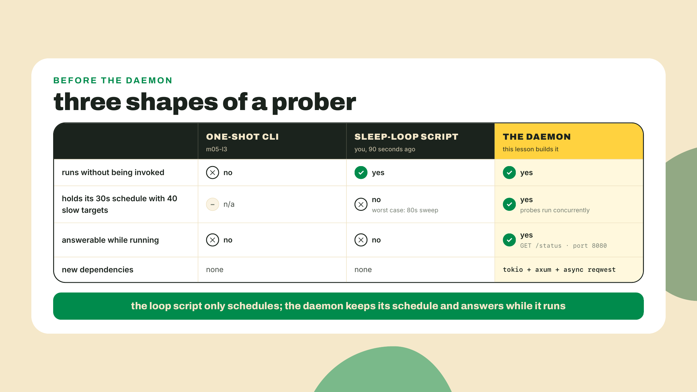
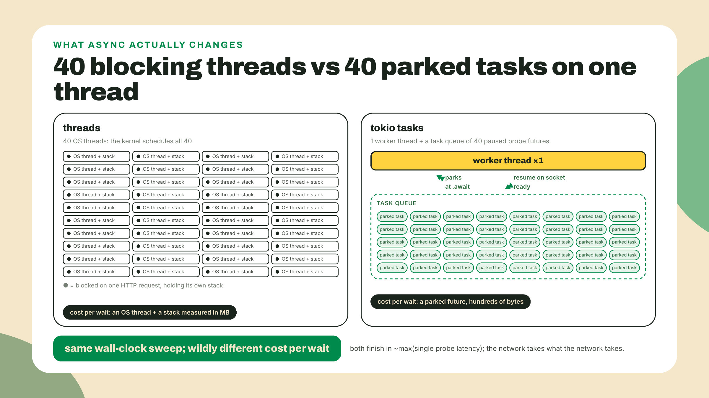
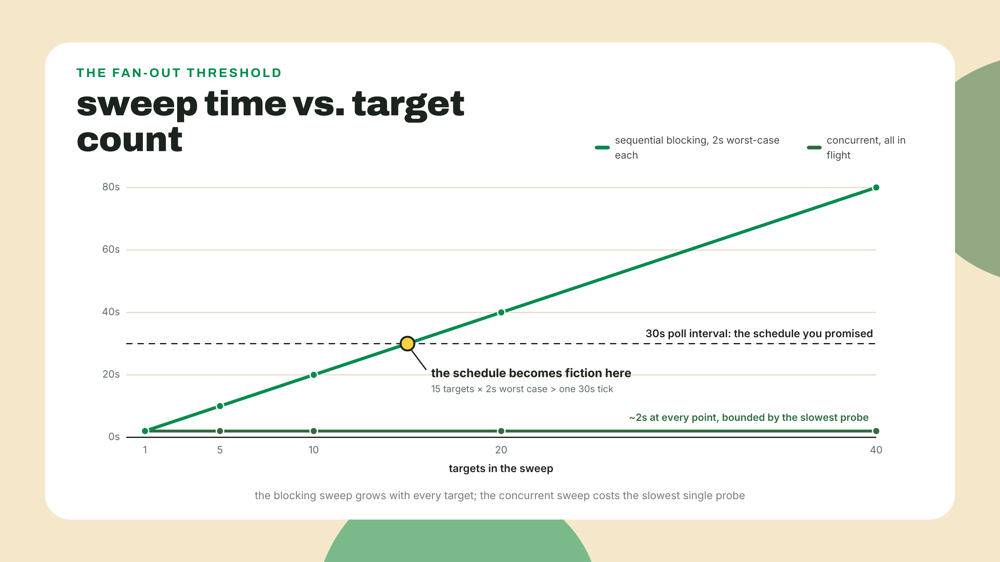
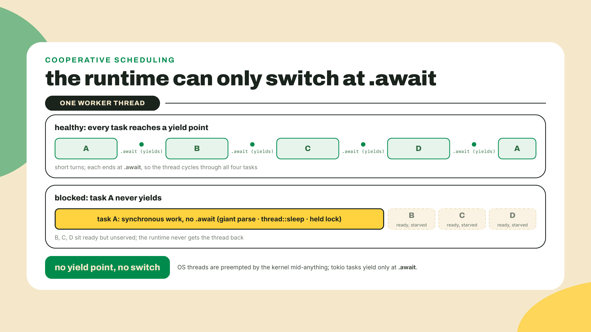
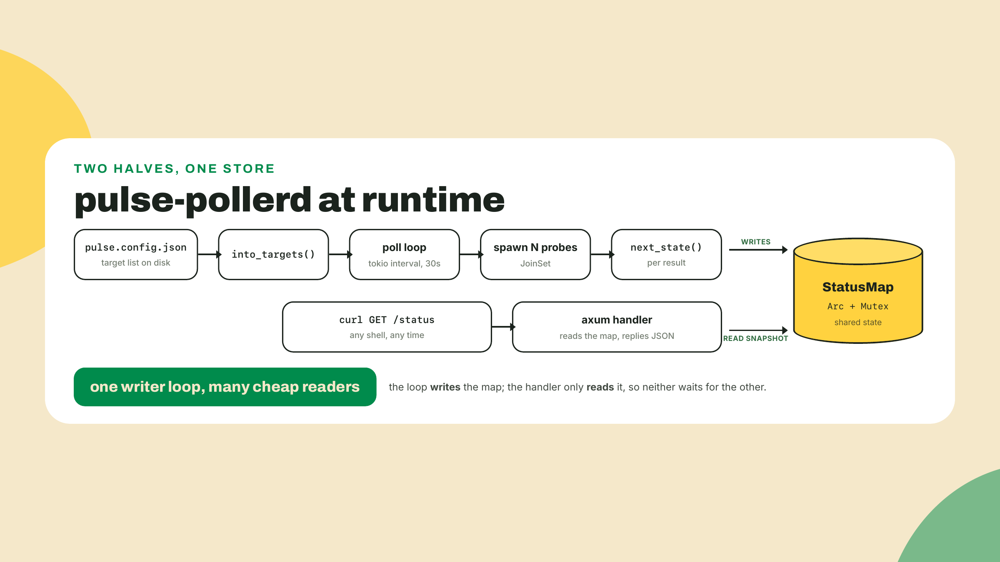
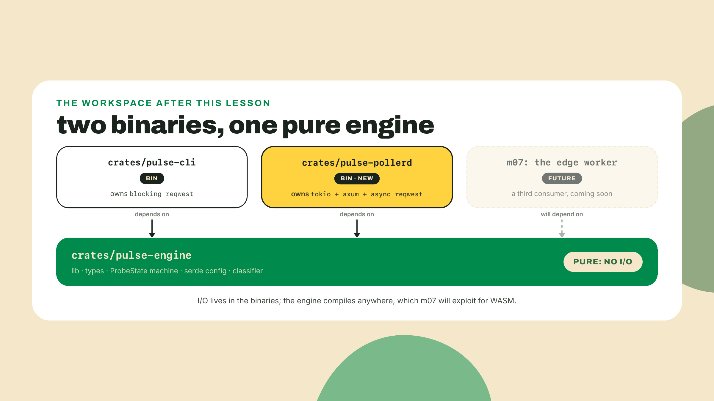
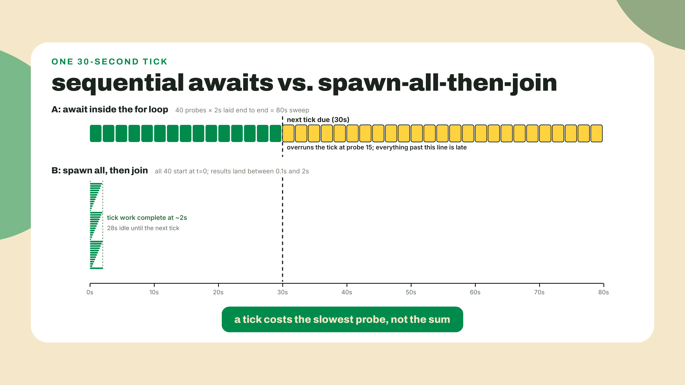
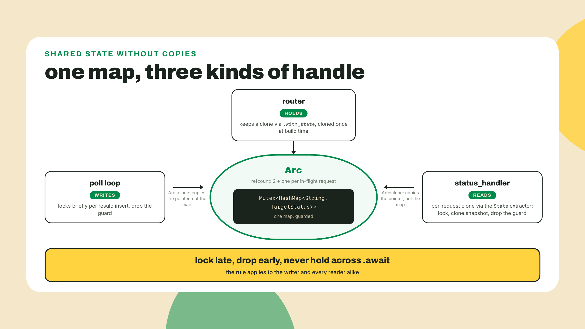

# A daemon, not a script: tokio + a /status endpoint

## Summary

m05-l3 ended the Rust-that-ships module: a clap CLI with its first real probe arm on blocking reqwest, debug versus release measured with actual numbers, and CI attaching a release binary to a GitHub Release. That binary probes, prints, and exits. Today it stops exiting. You will grow a third crate in the workspace, `pulse-pollerd`, that probes every configured target on an interval forever and answers `GET /status` with JSON while it does. The fade contract, out loud: the tokio poll loop is the single authored hard thing of the lesson and you get it as a completion skeleton with two holes. The axum endpoint (axum is the Rust HTTP-server crate serving the daemon's one JSON door) is the opposite: a fully worked drop-in you read and edit but never author, a deliberate step backwards in autonomy at a real spike, and I will say so again when we get there. Everything else is muscle you already have.

## The loop you can write right now

Your CLI probes and exits. A monitor that only runs when you remember to invoke it is not a monitor. It is a rumor with a command line. The station needs a process that outlives the invocation: a loop that probes forever, and a door you can knock on to ask how everything is, right now.

You could build the first half of that in ninety seconds with what you already know. Read this shape (and if you want to feel it run, do it on a throwaway branch, wrapping your m05-l3 `probe` in it; do NOT leave it in `pulse-cli`'s shipped main, which the m05-l3 release job would publish and which lab step 1 needs untouched):

```rust
use std::time::Duration;

fn main() {
    let interval = Duration::from_secs(30);
    loop {
        // your m05-l3 blocking probe(url, timeout), called for each URL you care about
        std::thread::sleep(interval);
    }
}
```

That is a daemon: a long-running foreground process that does its job on a schedule without being asked twice. No new crates, no runtime, no async. `Ctrl+C` kills it. For a handful of targets this is legitimately fine, and I want you to hold onto that feeling, because the whole lesson is about knowing exactly when it stops being fine. (If you did run it on a branch, delete the branch now; the real home for the loop is the new crate the lab builds.)

So let's stop it being fine. The sweep inside that loop is the m05-l3 blocking fetch, one target at a time. Each probe holds the thread until the network answers. Now do the arithmetic for a grown-up station: 40 targets, and say a slow one takes 2 seconds to time out. Worst case your sweep takes 40 times 2, which is 80 seconds, inside a loop that promised to run every 30. The schedule is fiction. The thread spends almost all of that time doing nothing: parked in a syscall, waiting for bytes that are somewhere over the Atlantic. Waiting is not work. You do not need more CPU. You need a way for one thread to hold many waits at once.



That is the entire pitch for async Rust, and you have already used the model.

## One thread, many waits

### The suspension you already know

Back in m02-l3 you wrote the TS fleet: `probeAll` fired a pool of fetches, and every `await` suspended a function mid-body until its promise settled, freeing the event loop to run someone else. The mental model was suspension: `await` is a bookmark, not a wall. Rust's async is the same model with one honest difference. In Node the event loop is ambient, always there, invisible in your package.json. In Rust the runtime is a dependency you can see: you add tokio to Cargo.toml, you annotate main, and the scheduler that parks and resumes your tasks is a crate with a version number. Same suspension, now with a name in the lockfile. One paragraph, that is the whole spiral. Everything you learned about awaiting in TypeScript transfers; what changes is that the machinery stops being furniture.

What tokio buys an I/O-bound prober, concretely: a task is a paused function, a few hundred bytes of state, and one thread can hold thousands of them. Each probe runs until it hits `.await` on the network, parks, and the thread moves on to the next task. When the socket has news, the runtime resumes the right task where it left off. Forty in-flight probes cost roughly one thread. The alternative spelling of concurrency you already know, one OS thread per probe, buys the same wall-clock win at the price of a full stack per thread and a kernel context switch per handoff. For 40 waits it would honestly work. For 40,000 it would not, and an indexer watching every account change on Solana lives a lot closer to the second number.



Notice what is not on that diagram: latency. Async does not make a single request faster. The network takes what the network takes. If your teammate proposes migrating a one-shot CLI to tokio for performance, the honest answer is that a single fetch that blocks once and exits has no fan-out for a runtime to exploit, so the migration buys a dependency and a new annotation and nothing else. m05-l3's blocking call was the right call. It is still the right call for that binary. Async pays at fan-out, and today, for the first time, we have fan-out.



### The migration is three edits

Here is where the course's sequencing pays you back. You met reqwest in m05-l3 wearing its `blocking` feature, precisely so that today's move would be a visible, small diff instead of a first contact tangled up with a runtime. Same crate. The blocking client you used is a feature-gated wrapper inside reqwest; async is the crate's default face. The migration is three edits.

In Cargo.toml, the feature flag goes:

```toml
# m05-l3, in pulse-cli:
reqwest = { version = "0.13", features = ["blocking"] }
```

```toml
# today, in pulse-pollerd:
reqwest = "0.13"
```

At the call site, the module path loses `blocking` and the calls gain `.await`:

```rust
// m05-l3, blocking:
let client = reqwest::blocking::Client::new();
let resp = client.get(url).send()?;

// today, async:
let client = reqwest::Client::new();
let resp = client.get(url).send().await?;
```

And around it all, a runtime, because a `.await` needs a scheduler to yield to. That is the third edit and the only genuinely new one: `#[tokio::main]` on an `async fn main`. Worth demystifying before you type it, because the attribute looks like magic and is actually a typing-saver. It expands to roughly this:

```rust
fn main() {
    tokio::runtime::Builder::new_multi_thread()
        .enable_all()
        .build()
        .expect("failed to build the tokio runtime")
        .block_on(async {
            // the body of your async main goes here
        });
}
```

Read it plainly: build a scheduler, hand it your async main as one big task, run that task to completion. An `async fn` in Rust does not run when you call it; calling it builds a value that describes the work, and something has to drive that value. In the TS fleet the driver was the event loop Node started before your first line executed. Here the driver is five lines of builder code you could write yourself, and once you have seen them, "where does my await go" stops being a mystery forever. The rest is unchanged by the migration: the request shape, the error type feeding your thiserror taxonomy, the status and latency you measure. Feature flag out, `.await` in, runtime around it. When someone tells you async Rust migrations are a rewrite, this is your counterexample; when someone tells you they are free, the next section is theirs.

One footgun before we move, because it is the classic: the blocking client and the runtime are enemies. If you call `reqwest::blocking` from inside a tokio task, you park a whole worker thread of the runtime for the duration, and the blocking client's own internals fight the runtime they are sitting on. You do not have to take my word for it; this program panics before it ever touches the network:

```rust
#[tokio::main]
async fn main() {
    // the footgun: the BLOCKING client inside the tokio runtime
    let resp = reqwest::blocking::get("http://127.0.0.1:9");
    println!("{resp:?}");
}
```

```text
thread 'main' panicked at .../tokio-1.53.1/src/runtime/blocking/shutdown.rs:51:21:
Cannot drop a runtime in a context where blocking is not allowed. This happens
when a runtime is dropped from within an asynchronous context.
```

I ran that on this machine to get you the message verbatim, because you will meet it in the wild sooner or later and it never says the word reqwest. Inside `pulse-pollerd`, the async client, always. The blocking client stays in `pulse-cli`, where it remains correct.

### What the runtime costs you

Time to name the trade, because tokio is not free and this course does not do free lunches. An async runtime is a dependency on a scheduler you now have to understand. And the first thing to understand about it is that its scheduling is cooperative: the runtime can only switch between tasks at `.await` points, because a suspension point is the only place a task hands control back. A thread can be preempted by the kernel mid-anything; a task cannot. That single design fact is where the new bug class comes from, the one that did not exist in your blocking CLI: blocking the runtime. Any long synchronous stretch inside a task, a giant JSON parse, a `std::thread::sleep` someone pastes in from muscle memory, a locked mutex held too long, never reaches an `.await`, never yields, and stalls not just that task but every task parked on that worker thread. The kernel would have rescued you; tokio, by design, will not. Your stack traces get worse too: a panic now surfaces through layers of runtime plumbing, and the function that logically caused it may be three suspension points away from the frame that shows it. These are real costs paid by real teams every week.



So the decision rule, and I will put it as plainly as I can. A handful of tasks, mostly waiting, no fan-out: a plain thread or a blocking call is the honest right-size, and reaching for tokio there is resume-driven engineering. I/O-bound work with real fan-out, many sockets in flight on a schedule: the runtime earns its complexity, and nothing else scales past it. The one-shot CLI sits on the first side. A 40-target poller sits on the second. Same codebase, both answers correct, one layer apart.

This is a live argument in 2026 engineering at large, not Rust parochialism. On 2025-11-19, Prisma 7 deleted its Rust query engine in favor of a TypeScript query compiler, the same season TypeScript's own compiler was being ported to Go for a roughly 10x build speedup. Two flagship projects crossing the language bridge in opposite directions, and both were right, because "which language" was never the question. Right tool for the layer was. Our tokio-when-you-have-fan-out, thread-when-you-do-not rule is the same discipline one layer down.

While I am being honest about right-sizing: axum, the HTTP-server crate this lesson uses to give the daemon its one JSON door, is our right-size, not the ecosystem's default. Survey the plumbing of real Solana infrastructure and gRPC via tonic dominates; of five Solana-adjacent Rust repos we surveyed, four speak tonic, and axum appears in two. For a fundamentals course that needs one JSON door you can `curl`, axum 0.8 is the correct honest choice, and when you later read an indexer's source and find tonic where you expected axum, you will know it is the neighborhood, not a mistake. That streaming-data plumbing is deeper infrastructure territory than this course goes; when an indexer's source sends you there, tonic's own docs are the door. Same honesty about observability: `println!` is where we are, `tracing` is the grown-up answer, and it stays a bookmark until m09-l2 does logging properly.

A service, collapsed to its true shape, is just this: a loop, plus an answerable question. The loop is the poll; the question is `/status`. Every orchestrator, every load balancer, every uptime page you have ever seen is this pattern wearing layers. Build the naked version once and the layers stop being magic.

**Go deeper (the 20%).** this lesson teaches tokio at the know-when-you-need-it level: what a runtime buys an I/O-bound prober, the blocking-to-async delta, and one honest poll loop. How futures actually work under the hood, `Pin`, executors, streams, `select!`, and the deeper concurrency patterns live in the async chapter of the Book, which now covers async natively: [https://doc.rust-lang.org/book/ch17-00-async-await.html](https://doc.rust-lang.org/book/ch17-00-async-await.html) (URL checked 2026-09-02). Bookmark it, read it after this module. The lab below needs none of the bookmarked material.

## Lab: pulse-pollerd

The plan, so you can see the whole board before the first command: a new binary crate joins the workspace, depends on `pulse-engine`, runs a tokio interval loop that probes every target from `pulse.config.json`, keeps the latest `ProbeState` per target in shared memory, and serves it on port 8080.



1. **Grow the workspace.** From the workspace root:

   ```bash
   cargo new crates/pulse-pollerd
   ```

   Add the member to the root Cargo.toml alongside the two crates from m05-l2:

   ```toml
   [workspace]
   resolver = "3"
   members = ["crates/pulse-engine", "crates/pulse-cli", "crates/pulse-pollerd"]
   ```

   Then the new crate's manifest. This is another of the course's build-on-what-you-already-own moments landing: a second binary consuming the same pure engine, which is the entire reason m05-l2 made you split the workspace. The purity investment starts paying rent today.

   ```toml
   [package]
   name = "pulse-pollerd"
   version = "0.1.0"
   edition = "2024"

   [dependencies]
   pulse-engine = { path = "../pulse-engine" }
   serde = { workspace = true }
   serde_json = { workspace = true }
   tokio = { version = "1.53", features = ["macros", "rt-multi-thread", "time", "net"] }
   axum = "0.8"
   reqwest = "0.13"
   ```

   Pins checked against crates.io on 2026-09-02: tokio 1.53.1, axum 0.8.9, reqwest 0.13.4; tokio's 1.x line has been semver-stable since 2020, so your patch digits may be higher and that is fine. Note the tokio features line: after m05-l2 you can read it. We opt into the macros, the multi-threaded runtime, timers, and TCP, instead of the kitchen-sink `full` feature, because you now know what a feature flag costs and buys. Only the daemon pays for tokio; the engine and the CLI stay exactly as they were.



2. **Promote your config pipeline.** The daemon needs config-to-targets, and the filter-map pipeline you wrote in m05-l1 currently has no home: m05-l3's clap rewrite replaced `pulse-cli`'s main wholesale, and the pipeline went with it. Rebuild it where it should have lived all along, in the engine, as a method on `Config`, so every present and future binary shares one definition. It goes in `crates/pulse-engine/src/config.rs`, next to the structs it transforms (not `lib.rs`, which is the five-line re-export shim and holds no logic):

   ```rust
   // crates/pulse-engine/src/config.rs
   impl Config {
       pub fn into_targets(self) -> Vec<ProbeTarget> {
           self.targets
               .iter()
               .filter(|t| t.enabled)
               .map(|t| t.to_probe_target())
               .collect()
       }
   }
   ```

   That is the m05-l1 chain, verbatim, one method deep. Run `cargo test --workspace`, green. This is what a workspace refactor should feel like.

3. **One derive line.** The `/status` response serializes `ProbeState` to JSON, and serde is already an engine dependency, so add the derive to the state enum in the engine, which should now read `#[derive(Debug, Clone, Copy, PartialEq, Eq, serde::Serialize)]`. The `serde::` path is doing quiet work: `engine.rs` has no `use serde::Serialize;` line (the config module imports it, this module never needed to), so the bare `Serialize` token would be a cannot-find-derive-macro error; the fully qualified form needs no import. One line, no new deps, and one audit while you are there: the `Clone` and `Copy` your m04-l3 enum has carried since birth are load-bearing today, because step 4's skeleton copies states out of the shared map (`map.get(&name).map(|s| s.state)`) and derives `Clone` on a struct holding one. If your derive list ever drifted from that canon, restore those two now, or step 4 greets you with E0507s the "one line" framing did not promise.

4. **The poll loop: your one authored hard thing.** Named in the summary, delivered here as a completion skeleton. Two holes. Everything else in this file is given, because the hard idea is the loop's shape, not its plumbing. Replace `pulse-pollerd/src/main.rs` with:

   ```rust
   use std::collections::HashMap;
   use std::sync::{Arc, Mutex};
   use std::time::{Duration, Instant, SystemTime, UNIX_EPOCH};

   use pulse_engine::{Config, ProbeState, ProbeTarget, next_state, parse_config};
   use serde::Serialize;
   use tokio::task::JoinSet;

   const POLL_INTERVAL_SECS: u64 = 30;

   #[derive(Clone, Serialize)]
   struct TargetStatus {
       state: ProbeState,
       latency_ms: u64,
       last_poll: u64,
   }

   type StatusMap = Arc<Mutex<HashMap<String, TargetStatus>>>;

   async fn poll_loop(targets: Vec<ProbeTarget>, statuses: StatusMap) {
       let client = reqwest::Client::new();
       let mut ticker = tokio::time::interval(Duration::from_secs(POLL_INTERVAL_SECS));
       // consecutive failures per target: the third argument your m04-l3 machine demands
       let mut failures: HashMap<String, u32> = HashMap::new();

       loop {
           // TODO(1): wait for the next tick of `ticker`.

           let mut probes = JoinSet::new();
           for target in &targets {
               let client = client.clone();
               let name = target.name.clone();
               let url = target.endpoint.clone();
               let timeout = Duration::from_millis(target.budget_ms);
               probes.spawn(async move {
                   let started = Instant::now();
                   let ok = matches!(
                       client.get(&url).timeout(timeout).send().await,
                       Ok(resp) if resp.status().is_success()
                   );
                   (name, ok, started.elapsed().as_millis() as u64)
               });
           }

           while let Some(joined) = probes.join_next().await {
               let Ok((name, ok, latency_ms)) = joined else {
                   continue; // a probe task panicked; skip it, keep draining
               };
               let count = failures.entry(name.clone()).or_insert(0);
               *count = if ok { 0 } else { *count + 1 };
               let count = *count;
               let now = SystemTime::now()
                   .duration_since(UNIX_EPOCH)
                   .expect("system clock is set before 1970")
                   .as_secs();
               let mut map = statuses.lock().expect("status lock poisoned");
               let prev = map
                   .get(&name)
                   .map(|s| s.state)
                   .unwrap_or(ProbeState::Pending);
               // TODO(2): insert the fresh TargetStatus for `name` into `map`,
               // running `prev`, `ok`, and `count` through the engine's next_state.
           }
       }
   }
   ```

   Walk it before you fill it, because the shape is the lesson. `tokio::time::interval` gives a ticker that fires on schedule, and it is the right tool over the tempting alternative, sleeping for 30 seconds at the bottom of the loop, for two reasons you can verify: the first tick fires immediately, so your daemon probes at startup instead of staring at the wall for half a minute, and the interval measures from tick to tick rather than from end-of-work, so two seconds of probing does not quietly stretch your period to 32. TODO(1) is genuinely one line, awaiting that tick, and the point of making you write it is that you feel where the loop breathes.

   Then the spawn block: every target's probe becomes a task in a `JoinSet`, and `spawn` means exactly what it meant conceptually in the theory section, hand this future to the runtime and let it run concurrently with everything else. All 40 go into flight before you await any of them. This is the fix for the footgun that bites almost everyone's first poll loop, awaiting probes one at a time inside the for loop, which compiles fine, runs fine on three targets, and quietly rebuilds the 80-second sequential sweep you did the arithmetic on earlier, just with extra steps. Spawn them all, then drain the set with `join_next` as results land, in whatever order the network decides. The tick costs you the slowest single probe instead of the sum.

   And read the drain carefully, because `join_next` hands you a `Result` and that is not ceremony. A spawned task is a separate unit of failure: if its body panics, the panic is caught by the runtime and comes back to you here as an `Err`, instead of tearing down the daemon. Our probe body cannot realistically panic, there is no unwrap in it, but the `let ... else { continue }` (read it as destructure-or-skip) is the daemon-grade posture anyway: one poisoned probe should cost you one data point, never the rest of the tick. A monitor that dies of the thing it was monitoring is a bad joke.

   TODO(2) is the state write: build a `TargetStatus` from `next_state(prev, ok, count)`, the measured latency, and `now`, and insert it under `name`. Your m04-l3 state machine, fed by real network results at last, and fed directly: a loop that already owns each result just hands it to `next_state`, no trait in between. The `ProbeSource` trait from that lesson is not being left behind, it is being paid off in step 7, one crate over, where the live plug m04-l3 promised finally goes in. The `failures` map above the loop exists because that machine's signature demands its third argument: `next_state` only lets `Degraded` fall to `Down` when the consecutive-failure count clears the threshold, so the loop has to remember the count between ticks, zeroed on success, bumped on failure. Note also the previous state defaulting to `Pending` for a target the map has never seen; first poll after boot, everything is `Pending` until evidence arrives, which is the honest answer.

   And look hard at the two lines around the lock. The mutex here is `std::sync::Mutex`, the plain one, and the critical section is tiny: lock, read the old state, insert, and the guard drops at the end of the iteration. There is no `.await` between lock and unlock. That is not an accident, it is the rule: hold a std lock across an `.await` and the task can be parked mid-critical-section while other tasks on the same thread try to take the same lock. Best case contention, worst case deadlock. Lock late, drop early, never await while holding. Say it once out loud; it will save you an evening within the year.



5. **The /status door: a worked drop-in.** Here is the stated regression from the summary, and here is why it exists. HTTP servers are a spike: routing, extractors, state injection, graceful binding, each its own small rabbit hole, and none of them is this course's fight. In production Rust you will meet servers mostly as things you extend, not things you author from a blank file. So the endpoint arrives fully worked and annotated, you read every line, and your editing seam is exactly two places: the shared state, and the JSON shape. Append to main.rs:

   ```rust
   use axum::{Json, Router, extract::State, routing::get};

   async fn status_handler(State(statuses): State<StatusMap>) -> Json<HashMap<String, TargetStatus>> {
       // Lock, clone a snapshot, unlock. The response is built AFTER the guard drops.
       let snapshot = statuses.lock().expect("status lock poisoned").clone();
       Json(snapshot)
   }

   #[tokio::main]
   async fn main() -> Result<(), Box<dyn std::error::Error>> {
       let raw = std::fs::read_to_string("pulse.config.json")?;
       let config: Config = parse_config(&raw)?; // m05-l3's parked promise, called at last
       let targets = config.into_targets();

       let statuses: StatusMap = Arc::new(Mutex::new(HashMap::new()));

       // The loop gets its own handle on the state...
       let poller_state = Arc::clone(&statuses);
       tokio::spawn(async move {
           poll_loop(targets, poller_state).await;
       });

       // ...and the router gets another. Clones of the Arc, one shared map underneath.
       let app = Router::new()
           .route("/status", get(status_handler))
           .with_state(Arc::clone(&statuses));

       let listener = tokio::net::TcpListener::bind("0.0.0.0:8080").await?;
       println!("pulse-pollerd listening on http://localhost:8080/status");
       axum::serve(listener, app).await?;
       Ok(())
   }
   ```

   The one real idea in this drop-in is the sharing. `Arc` is a reference-counted pointer: cloning it copies the pointer and bumps a counter, not the map. The poll loop owns one clone, the router owns another via `.with_state`, and axum hands the handler a cheap clone per request through that `State` extractor in the signature. One map, many owners, and the `Mutex` inside arbitrates writes. Watch the two `Arc::clone` calls in main: if you `move` the original into the spawned loop instead of cloning, the router has nothing left to hold, and the compiler will tell you so in its E0382 voice you know from m04-l1. The handler itself is four lines and the comment is load-bearing: snapshot under the lock, serialize outside it, so a slow client downloading JSON never holds your poll loop hostage. Notice also what the handler does not do: it does not probe. The loop owns producing state; the door only reports it. An endpoint that re-probed on demand would hammer your targets every time someone curls, and make `/status` as slow as a sweep.

   Your one TODO in this drop-in is a shape edit so you have touched the seam: the response currently returns whatever `TargetStatus` serializes to. Confirm `last_poll` is in the JSON, and rename or reshape one field to taste, maybe `latency_ms` to `latencyMs` with a serde `rename_all`, your m05-l1 attribute muscle. The JSON shape is yours to own; the plumbing is not, yet.



6. **Run it and knock on the door.** From the workspace root, with `pulse.config.json` present:

   ```bash
   cargo run -p pulse-pollerd
   ```

   The daemon prints its listening line and then appears to do nothing, which is what a daemon looks like from the outside. From a second terminal, knock twice, one poll interval apart:

   ```bash
   curl -s http://localhost:8080/status
   sleep 30
   curl -s http://localhost:8080/status
   ```

   The first response looks like this, with your target names and honest numbers where mine are placeholders:

   ```json
   {
     "docs": { "state": "Up", "latency_ms": 143, "last_poll": 1788350402 },
     "api": { "state": "Down", "latency_ms": 611, "last_poll": 1788350402 }
   }
   ```

   Every ENABLED target from your config is present, each with a state your m04-l3 machine assigned from a real network result, a measured latency, and a `last_poll` timestamp in unix seconds. Count the keys against the config before you move on: the station's config carries three targets, and the disabled tcp `rpc` entry is legitimately absent, because `into_targets` filters on `enabled` before the loop ever sees it. Two of three in the JSON is the pipeline working, not a bug. The exact state a failing target lands in depends on where your transition table routes a failure from its previous state, which is your machine's business, not the poller's; the poller only reports the verdict. The second response shows the same targets with `last_poll` advanced by roughly 30 seconds, and that word roughly is honest, because timers tick when the scheduler gets to them, so expect a second or so of skew rather than metronome precision. That advancing timestamp is your proof of life: the loop polled while nobody was watching, which is the entire job description. This pair of outputs, taken one interval apart and showing the timestamp advance with per-target states populated for every target in the config, is the lesson's gate. Keep both.

   One more expectation set on purpose, and it is sharper than "square one": kill the daemon, restart it, and `curl` `/status` before the first tick finishes. You do not get every target at `Pending`. You get `{}`, because the map is created empty and the only writes happen down in the drain loop. Then the first tick lands and every target appears already judged, `Up` or `Down`, because your m04-l3 table has no arm that RETURNS `Pending`: `(Pending, true) => Up` and `(Pending, false) => Down`. `Pending` is the loop's internal assumption about a target the map has never seen, not a state `/status` can ever hand you. State lives in a HashMap in process memory. Persistence is nobody's promise yet, and nothing in the station has claimed otherwise; when the poller deserves a memory that survives restarts, that will be its own decision with its own trade-offs.

7. **Cash the m04-l3 promise: live HTTP behind the trait.** One IOU from the Rust tier falls due this lesson, and the daemon is deliberately not the crate paying it. m04-l3 froze the `ProbeSource` trait and promised live HTTP would one day plug in behind it; m05-l3 built the HTTP arm as a standalone call and told you to hold the itch. The poller you just built skips the trait too, on grounds you can now defend twice over: its loop already owns each result, so it hands them straight to `next_state`, and the blocking client is banned inside its runtime anyway, as the panic at the top of this lesson proved. So the plug lands one crate over, in `pulse-cli`, where blocking is legal and the m05-l3 client already lives. First give the trait a public name: it never made m05-l2's re-export list because no consumer had earned it a spot, and one just did, so add `ProbeSource` to the engine's `lib.rs` re-export line. Then extend `crates/pulse-cli/src/main.rs`:

   ```rust
   use pulse_engine::{ProbeSource, drive};

   struct LiveSource {
       client: reqwest::blocking::Client,
       urls: Vec<String>,
       cursor: usize,
   }

   impl LiveSource {
       fn new(urls: Vec<String>, timeout_secs: u64) -> Result<Self, ProbeError> {
           let client = reqwest::blocking::Client::builder()
               .timeout(std::time::Duration::from_secs(timeout_secs))
               .build()
               .map_err(|e| ProbeError::Unreachable {
                   reason: e.to_string(),
               })?;
           Ok(Self {
               client,
               urls,
               cursor: 0,
           })
       }
   }

   impl ProbeSource for LiveSource {
       fn next_latency(&mut self) -> Option<u64> {
           let url = self.urls.get(self.cursor)?;
           self.cursor += 1;
           let started = Instant::now();
           match self.client.get(url).send() {
               Ok(_) => Some(started.elapsed().as_millis() as u64),
               // A request that never came back is not the source running dry;
               // it is one infinitely slow sample, and drive's budget check
               // turns it into a failure.
               Err(_) => Some(u64::MAX),
           }
       }
   }
   ```

   Read the impl against m04-l3's `FixtureSource` and watch the contract absorb a second source without a single edit to `drive`: same signature, same `Option`, only the answer's origin changed from a vector to a socket. The `Err` arm is the one design decision in the file: `None` would mean "source exhausted" and end the drive early, so a failed request reports `u64::MAX` instead, an infinite latency no budget clears. Now make the plug a shipped surface rather than a code comment: give the CLI a third subcommand next to `Probe` and `Report`, a `Sweep` variant carrying a `urls: Vec<String>` positional and a `#[arg(long, default_value_t = 1500)] budget: u64`, all m05-l3 clap muscle, with this match arm:

   ```rust
       Command::Sweep { urls, budget } => {
           let mut source = LiveSource::new(urls, 10)?;
           let state = drive(&mut source, budget);
           println!("sweep verdict: {state:?} (alerting: {})", state.is_alerting());
       }
   ```

   ```bash
   cargo run -p pulse-cli -- sweep https://www.rust-lang.org https://www.typescriptlang.org
   # sweep verdict: Up (alerting: false)
   ```

   That printed line closes the loop m04-l3 opened: the trait that spent two modules feeding `drive` fixtures now feeds it live measurements, the socket from that lesson's diagram finally holds its second plug, and every boundary this module drew stayed where it was: the daemon keeps its direct path, the CLI keeps its blocking client, and the engine still contains no I/O at all.

## Visibility, now that the engine has outsiders

The daemon runs, the CLI sweeps, and the engine in the middle is being consumed by two binaries at once. That is the moment to collect a promise: m04-l2 made you mark the moved items `pub` and said module privacy would get its proper tour with Cargo in M6. This is that tour, and it waited for right now on purpose, because visibility only means something once there are outsiders, and you have just finished building the second one. Nothing below changes the station; it is fifteen minutes with the compiler, and you revert it when you are done.

Rust's default is private, and your own layout already walks the levels that matter:

- `pub` plus a `lib.rs` re-export: `drive`, `next_state`, `parse_config`, `total_latency`, the curated front door. Consumers reach these as bare `pulse_engine::` names with no module path in sight, which is the whole point of curating the list: the poller's `main` calls `parse_config`, its loop calls `next_state`, and the CLI calls `total_latency` in its `report` arm and `drive` in the sweep you just wrote. `parse_config` is the one worth noticing, because it sat on that list from m05-l2 with nobody calling it: m05-l3 parked the CLI's config wiring and promised the m06 poller would pick the frozen signature back up. Step 4 is where that promise came due, and the front door stopped being aspirational.
- `pub` without the re-export: `parse_state`. Still reachable, at the full path `pulse_engine::engine::parse_state`, which is exactly the module-path spelunking the m05-l2 re-export list exists to spare consumers. Reachable and advertised are different promises.
- Private, the default: `FixtureSource`'s `cursor` field. No path reaches it from outside the engine; type `FixtureSource::new(vec![1]).cursor` anywhere in the poller and ``error[E0616]: field `cursor` of struct `FixtureSource` is private`` is the whole conversation.

Between those poles sits `pub(crate)`: visible everywhere inside the engine crate, invisible to every consumer. Prove it with the compiler instead of taking my word. Flip the engine's `parse_state` to `pub(crate) fn parse_state`, drop `let _ = pulse_engine::engine::parse_state("Up");` in as the first line of the poller's `main`, and run `cargo check --workspace`:

```text
warning: function `parse_state` is never used
 --> crates/pulse-engine/src/engine.rs
  |
  | pub(crate) fn parse_state(raw: &str) -> Option<ProbeState> {
  |               ^^^^^^^^^^^
  |
  = note: `#[warn(dead_code)]` (part of `#[warn(unused)]`) on by default

error[E0603]: function `parse_state` is private
  --> crates/pulse-pollerd/src/main.rs
   |
   |     let _ = pulse_engine::engine::parse_state("Up");
   |                                   ^^^^^^^^^^^ private function
```

Two messages, and the warning is not noise, it is the same fact told from inside. The engine still compiles and its unit tests would still pass, but the moment `parse_state` stopped being reachable from outside, the only remaining callers were `#[cfg(test)]` ones, which a plain `cargo check` does not build, so `dead_code` correctly reports a function nobody uses. That is structural, not a mistake in the drill: any `pub(crate)` item whose only non-test caller lived in another crate warns exactly like this, and the fix in real code is either a caller inside the crate or `#[allow(dead_code)]` with a written reason. The error below it is the outsider getting refused, and that split, quiet inside, hard stop outside, is the entire meaning of the setting. `pub(crate)` is the honest marking for helpers that engine modules share but no consumer should couple to, because a `pub` you did not mean is a public API you now maintain. Revert both edits and run `cargo check --workspace` once more to confirm you are back to quiet; the tour's residue is the reflex, not the code.

## Challenge

Solo, pure state logic, no new async concepts: surface each target's consecutive-failure counter in `/status`. The loop already tracks one per target, because `next_state`'s third argument demands it; what the JSON does not yet show is the count itself. Add a field to `TargetStatus`, fill it from the `failures` entry in TODO(2)'s neighborhood, and it rides into the JSON for free, because serde derives do not care how many fields you add.

You do not have to break anything to see it work, because the station's config already ships one target that cannot succeed: `api` points at `https://example.org/health`, which answers 404, and the poller gates `ok` on `resp.status().is_success()`, so api has been failing every tick since you booted the daemon. That is why step 6's sample shows it Down. Acceptance: restart the daemon so the counters start from zero (they live in `failures`, a plain HashMap in process memory, so a new process starts empty), let three ticks pass, which is about a minute because the first tick fires immediately, then `curl` `/status` and read `api` at 3 while `docs` sits at 0. If you would rather drive it yourself, point a second entry at a URL that cannot succeed and watch both climb together on the same ticks.

If you want to know why a monitor bothers counting consecutive failures instead of alerting on the first one, read the two numbers side by side: docs holds at 0 through every tick because a healthy target resets on success, so a single blip there would show a 1 and be gone by the next minute, which is weather. Api's climbing count is the shape of news. The counter is what tells those two apart, and it is why m04-l3's table guards the fall to `Down` on `consecutive_failures >= 3` rather than on a single `false`.

## Checkpoint

What you can now do, concretely: turn a one-shot tool into a daemon and say precisely what tokio bought you over the `thread::sleep` version you wrote first, forty parked waits on one thread instead of a fictional schedule; migrate a blocking reqwest call to async and name the full delta, feature flag out, `.await` in, runtime around it, same crate; and argue both directions of the right-sizing call, because you have now shipped the blocking CLI where async would be overhead and the poller where blocking would be a lie.

The 30-second retrieval before you close the terminal: what does async buy 40 I/O-bound probes? (One thread holds all 40 waits, parked and resumed on completion; each probe is no faster.) And the lock rule, in seven words? (Lock late, drop early, never across await.)

A calibration ask, because this lesson made two opposite bets on you: the poll loop as your authored hard thing, the endpoint as a read-only drop-in. If the loop's two TODOs felt too thin or the drop-in left you wanting to author the server yourself, say so in the feedback; the fade is tuned by exactly this signal.

Your poller now runs forever, but only on your machine, against your OS, your glibc, your luck. The binary that CI built in m05-l3 already taught you that shipping means handing software to machines that never saw your source. Next lesson we put the daemon in a box that runs the same everywhere, and we start by being honest about what a container even is. Bring the daemon.
