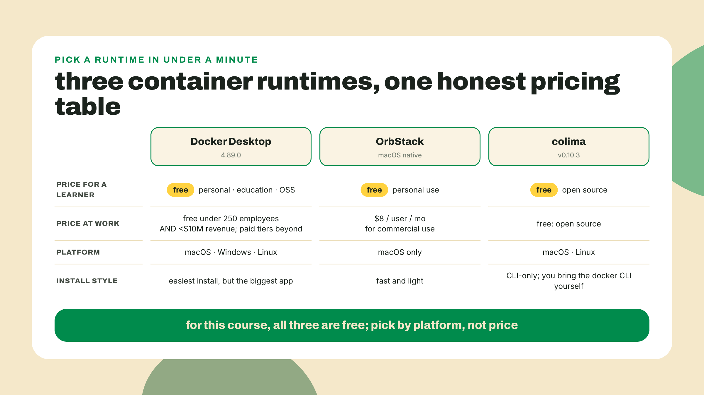
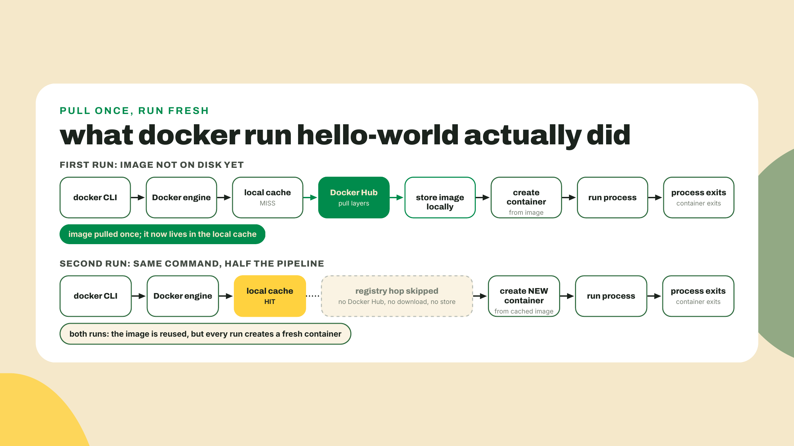
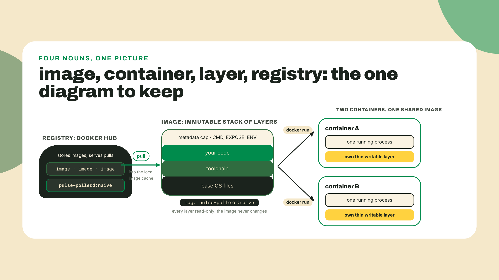
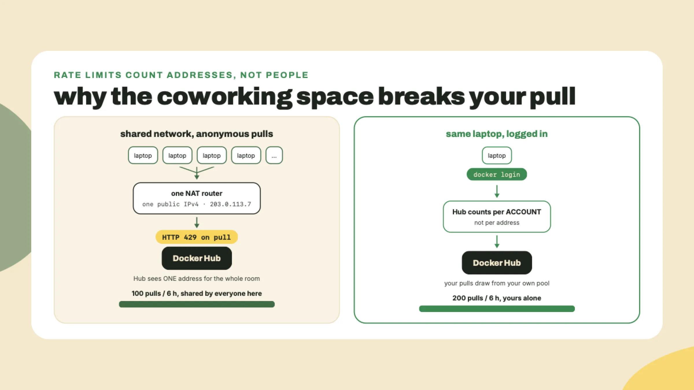
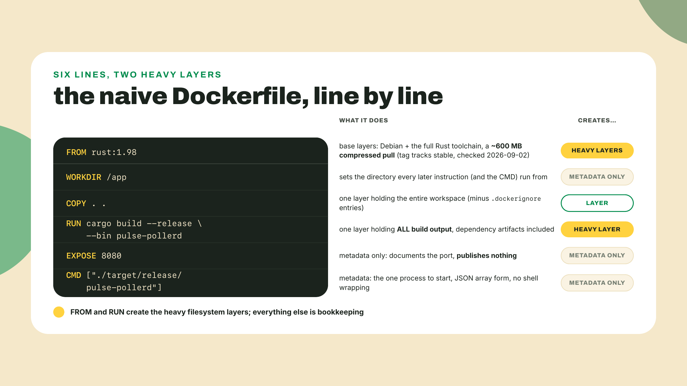
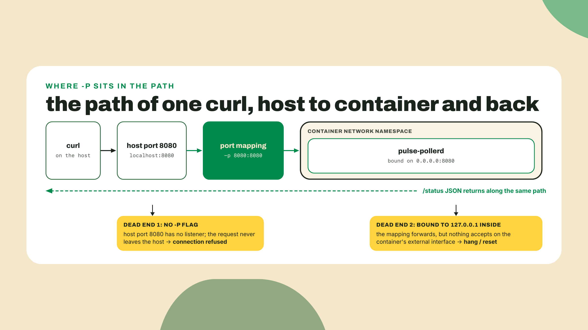
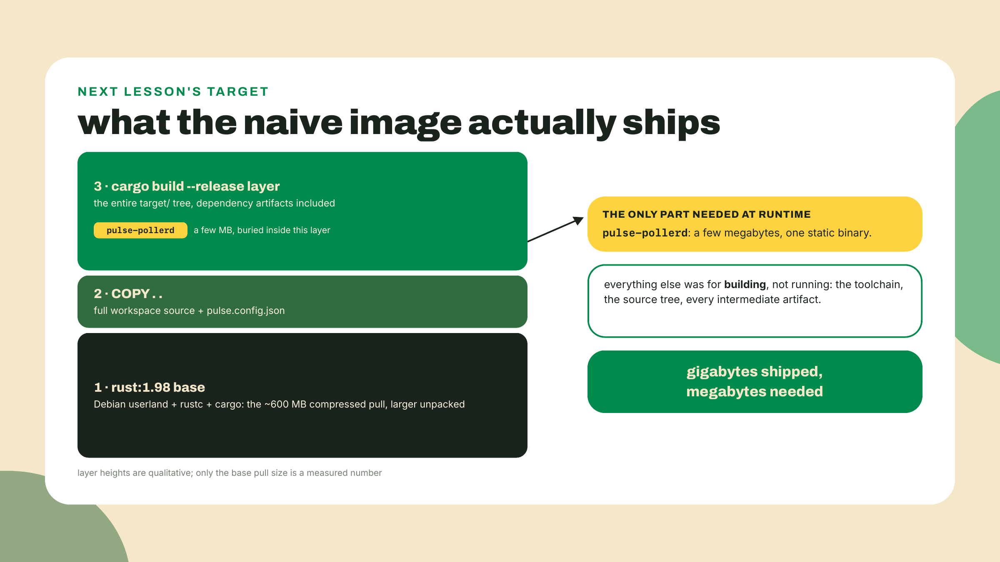

# Containers 101: put the poller in a box

## Summary

m06-l1 turned the CLI into `pulse-pollerd`: a tokio poll loop wrapping the engine crate, with the worked axum `/status` drop-in answering on port 8080. It runs forever, but only on your machine. Today we fix the "only on your machine" part. You will install a container runtime, run your first container inside the first quarter of this lesson, build the one mental model that makes Docker stop being magic, and then write the most honest Dockerfile possible for the poller: naive, single-stage, and gloriously overweight. A scaffolding note, out loud: this course assumes you have never touched Docker, so this is a fully worked first contact. The Dockerfile is a completion problem with exactly three TODOs, and the solo challenge is a single env-var change. The training wheels come back off next lesson.

First, thirty seconds of reconnaissance. Open a terminal and ask whether a container runtime is already on your machine:

```bash
docker version
```

Version numbers for both Client and Server mean a runtime is already installed and running; you will skim the install step below. `command not found`, or a client that answers while the server half errors out, is the expected result for most of you, and installing a runtime is this lesson's first job. Either way you now know which path you are on.

## The box the industry agreed on

Take the release binary CI built for you in m05-l3 and hand it to a friend. If they run a different Linux distro, there is a decent chance it dies on a glibc version older than the one your CI runner linked against, with an error message that names a symbol version and helps nobody. If they are on macOS and CI built for Linux, it does not start at all; wrong executable format, full stop. And even when the binary runs, your poller reads `pulse.config.json` from its working directory and expects port 8080 to be free, assumptions your machine satisfies and theirs might not. "Works on my machine" stops being a joke the moment someone files it as a bug report. The fix the industry converged on is not shipping the binary. It is shipping the machine-shaped box the binary runs in: the filesystem, the libraries, the config, the port expectations, all frozen together so the only thing the target machine contributes is a kernel.

Before any theory, you need the box-runner installed. Do this now.

### Pick a runtime, run a container

Docker the *format* is open and standard. Docker the *desktop app* is a product with a license, and there are three sane ways to get a runtime on your machine:



Why three options exist is a story with a date. On 2021-08-31, Docker announced that Docker Desktop would stop being free at work: any business over 250 employees or over $10M revenue would need a paid subscription, with a grace period to 2022-01-31. That one announcement is why OrbStack and colima became household names among mac developers. The thresholds still stand today, and for you, right now, they are irrelevant: personal use, education, and small businesses stay free on all three. Pick by taste (versions checked 2026-09-02; Docker ships monthly, so your digits may run higher):

**Docker Desktop** (macOS, Windows, Linux) is the default path and what I assume in this lesson. Download the installer from the Docker Get Started page linked at the end of this section, run it, launch the app once so the engine starts. Current release is 4.89.0, running Engine 29.7.2 under the hood.

**OrbStack** (macOS): `brew install orbstack`. Free for personal use, $8/user/mo when a company pays.

**colima** (macOS/Linux): `brew install colima docker`, then `colima start`. Free OSS, no GUI, and the `docker` CLI talks to it exactly as it would to Desktop.

On Linux the calculus is simpler: Docker Engine itself is open source and free everywhere, including at work, and installs from your distro's package path per the Get Started docs. The licensing story above is about the Desktop app, which on Linux is a convenience rather than a necessity.

Whichever you chose, the proof of life is the same:

```bash
docker run hello-world
```

First run, you get pull progress bars, then a message that begins:

```text
Hello from Docker!
This message shows that your installation appears to be working correctly.
```

Run it a second time. No progress bars, instant output. That difference is not a warmed-up cache on Docker's side; it is the entire architecture of the thing showing itself on your first command, and it is worth one diagram before we go further.

While the evidence is fresh, one more command:

```bash
docker ps -a
```

`docker ps` alone lists *running* containers, and right now that list is empty, because hello-world's process printed and exited. The `-a` shows the exited ones too, and there are two: one per `docker run`, each with an auto-generated name, both stopped, both created from the same single image. Nothing was reused between runs except the template. Clean them up with `docker rm` and the names or IDs the listing shows, or start forming the habit the lab uses: `--rm` on the run itself, so the corpse never lingers.



### Image, container, layer, registry

Four words carry this entire module, so let's pin them down while the hello-world output is still on your screen.

An **image** is an immutable, layered filesystem plus some metadata: which command to run, which ports the author intended, which environment variables to set. It is a template. It does nothing by itself.

A **container** is a running process that has been handed that filesystem as its root, plus a thin writable layer on top so it can scribble without touching the template. `docker run` stamps one out of an image the way `cargo run` stamps a process out of a binary. Three runs, three containers, one image.

A **layer** is one cached step of building an image. Every instruction in a Dockerfile produces one, stacked read-only on top of the last, and the running container's writable layer sits above the whole stack: when the process writes a file, the change lands there, and when it modifies a file from a lower layer, the file is copied up first and changed in the copy. The template underneath is never touched, which is why three containers can share one image without stepping on each other, and why everything a container writes dies with it unless you deliberately arrange otherwise. You will watch layers scroll by in the lab, priced individually.

A **registry** is where images live so other machines can pull them. You already know this shape twice over: npm is a registry of packages and crates.io is a registry of crates; Docker Hub is a registry of filesystems. Publish once, pull anywhere, resolve by name and tag instead of name and semver. The analogy is close enough to lean on and honest enough to bound: image tags are mutable labels, not immutable versions, so `rust:1.98` can point at a rebuilt image tomorrow in a way `serde@1.0.229` never will. Docker Hub is the default registry, it is where `hello-world` and the `rust` base image come from, and it is a service with rate limits we will deal with honestly in a minute. A **tag** is the human-readable label after the colon, the `:naive` in `pulse-pollerd:naive`. A **base image** is simply the image your image starts from, the `FROM` line's argument, contributing its layers as your foundation.



Now the model that makes all of this collapse into something you can reason about. The tempting picture, the one the word "container" plants in your head, is a small virtual machine: a little computer you start, log into, and poke around in. Build that picture out and you expect to ssh in, install things, reboot it.

It is not that. A container is a process wearing a filesystem. One process, started by your kernel like any other, except the kernel shows it a different root directory and a fenced-off view of the world. Here is the test that settles it: what happens when the process exits? The container is over. Nothing stayed up, because there was no machine, only the process. `hello-world` printed its message, exited, and its container ended in the same breath. That is also why the second `docker run` created a *new* container instead of reattaching to the old one: containers are as disposable as processes, because that is what they are.

If the whole arrangement needs one picture from outside software: the intermodal shipping container. Before the standardized steel box, loading a cargo ship meant longshoremen hand-stacking barrels and crates, every ship a special case. The box standardized the *interface*, and suddenly the crane, the ship, the truck, and the port stopped caring what was inside. Docker is that box for software: the registry is the port, the image is the sealed container, and any host with a runtime is a ship that can carry it. Where the analogy breaks, and it does: a steel box is inert cargo, while our box comes with the instruction to start exactly one process. Carry the analogy as far as logistics and drop it before behavior.

One honesty footnote before someone on a Mac catches me: on macOS and Windows, Linux containers cannot run on the host kernel directly, so Desktop, OrbStack, and colima each quietly manage a Linux VM and run your containers inside it. The model still holds; your containers are processes on *that* kernel. You just paid for the illusion with some RAM, which is part of the bill we will total up shortly. And notice what the model changes about your debugging reflexes: the box's filesystem, environment, and network are the image author's world, not your machine's, so "it works in the container" and "it works on my host" are now separate claims with separate evidence. That separation is the portability win wearing its work clothes.

### Log in before the first real pull

The lab below pulls the `rust` base image from Docker Hub, and I want you to log in first, because the failure you avoid is genuinely nasty to diagnose. Scenario: you are at a coworking space, a campus, or inside a CI runner. Your build dies pulling a base image with a 429 error. At home, the identical build works. Nothing in the error mentions why.

What is happening: unauthenticated Docker Hub pulls are capped at 100 pulls per 6 hours *per IPv4 address* (or per IPv6 /64 subnet), and behind a shared NAT, everyone in the building is spending the same allowance. You did nothing; the fifty laptops around you did. A free Docker Hub account moves you to your own allowance of 200 pulls per 6 hours, attached to your account instead of the building's IP. Both figures are Docker's own, read off docs.docker.com/docker-hub/usage/ on 2026-09-06, and they are the ones that survived the 2025 policy saga: only the paid Pro, Team, and Business plans get an unlimited pull rate. Check the table yourself before you quote a number at a colleague; that is the habit, not the digit. The CI variant of this failure is the one that bites teams: hosted runners share their cloud provider's egress addresses with thousands of strangers, so an anonymous pull that worked all sprint starts flaking the week something popular ships. Same cause, same fix, and now you can diagnose it from the symptom pattern alone: location-dependent, reproducible, and 429 rather than not-found.



So: create the free account at hub.docker.com, then:

```bash
docker login
```

Enter the username and the token or password it asks for; `Login Succeeded` is your checkpoint. (The free Personal plan also carries one private image repository, which is more hosting than this course will ask of it.) That is the whole fix. When even 200 per 6 hours is not enough, or you want your own images hosted next to your code, GitHub's registry GHCR is the escape hatch, and it is exactly where we push the poller's image in m06-l4. Not today.

I will confess where my own hours have gone in this territory, because it was not the rate limit. It was running a container, curling `localhost:8080`, getting nothing, and concluding my app was broken. The app was fine. I had forgotten the port mapping, so my request never entered the box at all. You will wire that mapping deliberately in the lab, and when we get there you will see why the inside and the outside of a container are different networks.

### What the box costs

The trade-off, stated before you build anything, because this one is measured in gigabytes. A naive image ships your entire build environment: toolchain, dependency caches, source. The `rust:1.98` base image alone is roughly 600 MB compressed on Docker Hub (I watched it come down the wire while checking this lesson on 2026-09-02), and it unpacks to considerably more; add your `target/` directory and the image for a few-megabyte binary lands in the gigabytes. Port mappings and layer caches are new places for bugs to live that did not exist when you ran `cargo run`. And on macOS there is that managed Linux VM idling in your RAM. You accept all of it because "runs the same everywhere" is the foundation CI, registries, and every later module of this course stand on. The weight, at least, is fixable, and fixing it is literally next lesson.

**Go deeper (the 20%).** this lesson gives you the mental model, the login, and your first image; the guided tour of the wider platform, volumes, container networking, the full CLI, lives in Docker's official Get Started path: [https://docs.docker.com/get-started/](https://docs.docker.com/get-started/). Bookmark it, walk its first two sections this week. One meta-lesson attached for free: Docker used to host this material at a "workshop" URL, and this course's own link checker caught that URL quietly redirecting elsewhere while this lesson was being fact-checked. Verify links before you trust last year's bookmarks, including mine. The lab below needs none of the bookmarked material.

## Lab: pulse-pollerd:naive

Terminal open at the `pulse-rs` workspace root, the one holding `Cargo.toml` with `[workspace]`, `crates/pulse-engine`, `crates/pulse-cli`, `crates/pulse-pollerd`, and `pulse.config.json`. We are going to box the poller with the most obvious Dockerfile that can possibly work, on purpose, and read the wreckage honestly.

1. **Fence the build context first.** When Docker builds an image, it ships the "build context", by default your entire current directory, to the engine. Your workspace contains a `target/` directory with gigabytes of build cache, and `COPY . .` would happily drag it into the image. Create `.dockerignore` at the workspace root:

```text
target/
.git/
```

Same idea as `.gitignore`, different audience: this trims what the build can even see. (Honest note on the second line: the station's `.git/` actually lives one level up at the repo root, since m04-l3 moved `pulse-rs/` inside the station repo, so it never enters this build context at all. The ignore line costs nothing and saves anyone building from a standalone clone, which is why it stays.) Do it before the first build and you will never know how slow the alternative was.

2. **Complete the Dockerfile.** Create a file named `Dockerfile` at the workspace root. Here is the skeleton, with the lesson's three TODOs:

```dockerfile
# TODO 1: pick the base image. We need a full Rust toolchain to compile,
# and we pin the stable minor: rust:1.98
FROM ???

WORKDIR /app

# TODO 2: what does the build need copied in? The whole workspace: every
# crate, the root Cargo.toml, and pulse.config.json the poller reads.
COPY ??? ???

RUN cargo build --release --bin pulse-pollerd

EXPOSE 8080

# TODO 3: the command the container runs when it starts. One process,
# remember: this IS the container.
CMD ???
```

Work the three TODOs against what you know, then check against the filled version:

```dockerfile
FROM rust:1.98

WORKDIR /app

COPY . .

RUN cargo build --release --bin pulse-pollerd

EXPOSE 8080

CMD ["/app/target/release/pulse-pollerd"]
```



One pre-flight check before the glosses, and it will save some of you a baffling crash. Back in m05-l1 you created the station-root `pulse.config.json` and pointed the Rust side at it, one file, not two copies, and the suggested move was a symlink. `COPY` copies the link, not the bytes: the link's target lives outside this build context, so inside the image it dangles, and the poller dies at startup unable to open a file that `ls` swears is right there. Run `ls -l pulse.config.json` at the `pulse-rs` root; if you see an arrow, replace the link with a real copy (`cp` the target over it) before building, and COMMIT the replacement, not just the local fix: m06-l4's CI job builds this exact image from a fresh checkout on a runner, where a tracked symlink pointing outside the build context dangles just as badly, two lessons after anyone remembers why. The one-file discipline honestly ends at the image boundary, because a sealed filesystem cannot follow a pointer back to your laptop; keeping the two copies in agreement is now a real (small) maintenance duty, and it is the box's price, not the box's bug.

Four glosses the skeleton comments could not fit. `rust:1.98` pins the toolchain minor the way `rust-toolchain` pins it locally; the tag exists on Docker Hub and tracks the current stable, so bump it when your workstation bumps. `WORKDIR /app` is quietly load-bearing for us: the poller reads `pulse.config.json` relative to its working directory, and because `COPY . .` lands the file in `/app` and the `CMD` process starts there, the same relative path that worked on your host resolves inside the box; change the WORKDIR without moving the config and you have built an image that starts and immediately cannot find its own targets. `EXPOSE 8080` is pure documentation, and this matters: it does *not* open any port. Publishing a port is a runtime decision made with `-p`, which is step 4's whole job. And `CMD` uses the JSON-array form so your binary runs as the container's one process directly, no shell in between.

3. **Build it, and read the layers.** From the workspace root:

```bash
docker build -t pulse-pollerd:naive .
```

The `-t` tags the result; the `.` is the build context you just fenced. The very first lines of output are your `.dockerignore` receipt: a `transferring context` line with a size. A clean workspace transfers in megabytes; if you see hundreds of megabytes or worse, `target/` or `.git/` leaked into the context, and fixing the ignore file now saves every build from here to the capstone. Then expect minutes: the base image pull, followed by a cold `cargo build --release` of the whole workspace inside the box. Watch the output structure while it runs: one numbered step per filesystem-touching instruction, `[1/4] FROM`, `[2/4] WORKDIR`, and so on, each becoming a layer, with the cargo step doing essentially all the waiting. (Six instructions, a denominator of 4: `EXPOSE` and `CMD` are metadata, so BuildKit gives them no numbered step, the same 0B story `docker history` tells in step 5.) The tail should end with something like:

```text
 => exporting to image
 => => naming to docker.io/library/pulse-pollerd:naive
```

Save that tail; the checkpoint wants it. Then rebuild immediately without changing anything: `docker build -t pulse-pollerd:naive .` again. Seconds, not minutes, with `CACHED` printed next to the steps. Layers are the cache, and the build log is where you watch it work.

4. **Run it with the door open.** The poller listens on 8080 *inside* the container, and inside is a different network from your host. `curl localhost:8080` on your machine knocks on your host's port 8080, where nothing is listening. The `-p` flag builds the bridge:

```bash
docker run --rm -p 8080:8080 pulse-pollerd:naive
```

Read `-p 8080:8080` as `host:container`: requests to host port 8080 get forwarded to the container's 8080. The two numbers do not have to match, which is exactly the seam the challenge pulls on. (`--rm` deletes the container when it exits, a politeness habit worth forming now.) While it runs, a plain `docker ps` in another terminal shows the container alive with its port mapping printed in the PORTS column, which is where I look first whenever a "broken" containerized service crosses my desk. Then, from that second terminal:

```bash
curl -s localhost:8080/status
```

You should get the same `/status` JSON as m06-l1: per-target state, latency, last-poll timestamp, now served from inside the box. If curl hangs or resets while the container logs look healthy, check two suspects in order. First, did you actually pass `-p`? (The confession above is yours to skip now.) Second, the bind address: a server bound to `127.0.0.1` inside the container is only reachable from inside the container, which for one process is a very quiet place. The m06-l1 drop-in binds `0.0.0.0:8080`; if yours says `127.0.0.1`, change it to `0.0.0.0` and rebuild. On your host that distinction barely mattered. In the box it is everything.



5. **Weigh it, and write the number down.** Stop the container (Ctrl-C in its terminal), then:

```bash
docker images pulse-pollerd
```

Look at the SIZE column. Your poller binary is a few megabytes. The image you just shipped it in will sit in the gigabytes, three orders of magnitude of packaging around the thing you actually made. Record the exact number somewhere you will find again next lesson; we re-measure this same image after the multi-stage rebuild, and I want your before to be your own.

Do not take the total on faith either; ask the image itself where the weight lives:

```bash
docker history pulse-pollerd:naive
```

One row per layer, newest first, each with its own size. Read it against the Dockerfile you wrote: the `RUN cargo build` row is the heaviest one YOU caused, roughly half a gigabyte of frozen `target/` output, while the base toolchain rows below it are the true giants, each in the same half-gigabyte class or bigger, because a Debian userland plus rustc plus cargo outweighs any one project's build. The `COPY . .` row carries your source tree, and the `EXPOSE`, `CMD`, and `ENV`-class rows all report 0B because metadata weighs nothing. This is the same per-layer accounting the build log hinted at, now with a scale next to it.

Where did the weight come from? Nothing mysterious: the final image is every layer you watched scroll by. The full Rust toolchain from `FROM`. Your entire source tree from `COPY . .`. And the heaviest one, the `RUN cargo build` layer, which froze the whole `target/` directory, dependency artifacts and all, into the shipped filesystem. None of that is needed to *run* the binary; all of it was needed to *build* the binary, and a single-stage Dockerfile cannot tell the difference. That sentence is next lesson.



That is the lab: the poller answers from inside a box that any Docker host on Earth can run, and the box is comically overweight. Both halves of that sentence are the point.

## Challenge

Solo, one seam, no new concepts: make the poller's port configurable by environment variable. Why env vars, when the poller already has a perfectly good config file? Because an image is immutable and one image should serve many deployments: same box, different port on your laptop, in CI, and on whatever host eventually runs it. Environment variables are the knob a container's operator can turn without rebuilding, which is why they are the config idiom of every containerized service you will ever read. Three moves. In `pulse-pollerd`'s startup, read `POLLER_PORT` and fall back to 8080 when it is absent or unparseable; `std::env::var("POLLER_PORT")` gets you a `Result`-shaped start, and the tail of the chain is one you have already written: m05-l3's overflow demo read its argument with `.nth(1).and_then(|s| s.parse().ok()).unwrap_or(250)`. Steal that and adapt it, because two things differ and both follow from where the value comes from. `args().nth(1)` hands you an `Option` while `env::var` hands you a `Result`, so yours needs a leading `.ok()` to get onto the same track; and the fallback is 8080, not 250. Landing on `.ok().and_then(|s| s.parse().ok()).unwrap_or(8080)` is the point of the exercise, not the starting line. In the Dockerfile, add `ENV POLLER_PORT=8080` above the `CMD` to document the default in the image itself. Rebuild, then run it moved:

```bash
docker run --rm -e POLLER_PORT=9090 -p 9090:9090 pulse-pollerd:naive
```

Acceptance: `curl -s localhost:9090/status` answers, and running without `-e` still answers on 8080. If 9090 hangs, reread step 4's two suspects; the second one cannot hurt you twice, but the first absolutely can.

## Checkpoint

Gate on doing, four pastes: the `Hello from Docker!` output from your install check; the tail of the naive build log; a host-side `curl -s localhost:8080/status` response served from the container; and the `docker images` SIZE line you recorded for next lesson. `docker login` should have said `Login Succeeded` along the way, even though nothing forced you to.

What you can now do, concretely: install and verify a container runtime and explain what you paid for it on your OS; read `docker ps -a`, a build log, and `docker history` as evidence rather than noise; explain image, container, layer, registry, and tag with one diagram; and take any binary you own from `cargo run` to answering through a published port from inside a box.

The 30-second retrieval before you close the terminal: which one does `docker run` create, an image or a container? (A container; images are only ever created by builds.) And the four nouns in one breath: registry stores images, image is the immutable layered template, layer is one cached build step, container is a running process wearing that filesystem.

If the runtime install fought you, and on some corporate machines it genuinely does, tell me which OS and which runtime in the course feedback; the runtime-picker table at the top of this lesson is the section I most expect to need tuning per cohort, and real failure reports are how it earns its keep.

You shipped a working box that weighs gigabytes for a binary measured in megabytes, and you have the exact number written down. Next lesson: two Dockerfiles, one idea. Multi-stage builds cut that image by an order of magnitude, with your own Rust before-and-after doing the arguing, and the same technique carried straight into a slim Node image for the fleet. Keep that number handy.
