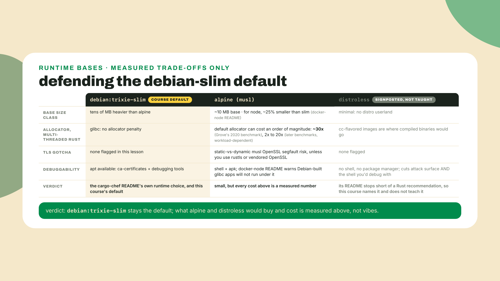
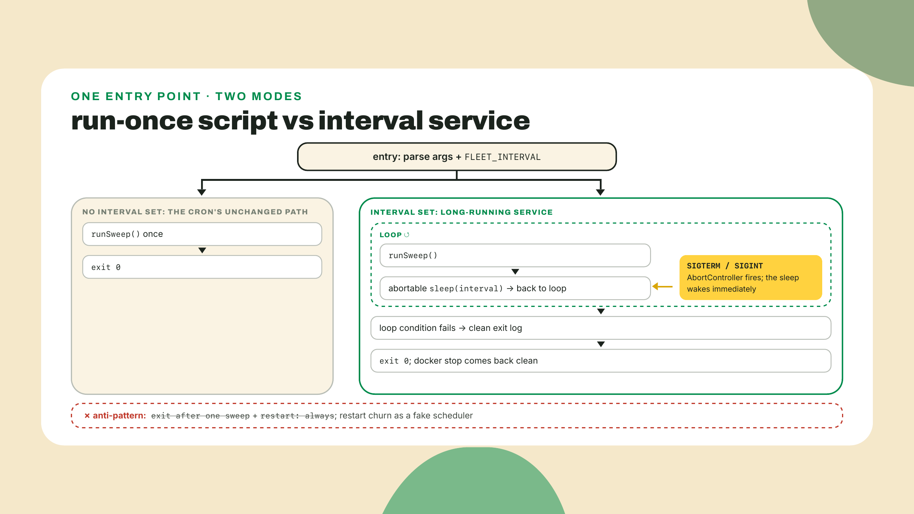
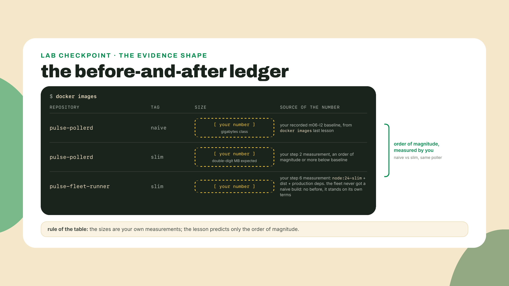

# Two Dockerfiles, one idea: multi-stage honesty

## Summary

m06-l2 installed a container runtime, built the image-container-layer-registry mental model, and shipped the poller's first naive image, its multi-gigabyte weight left on your screen on purpose. Today that weight comes off. One idea, applied twice: build in one box, ship only what runs in another. The Rust image gets the cargo-chef treatment, three build stages plus a debian slim runtime; the TS fleet gets its own node slim multi-stage build; both get measured against your recorded baseline. Along the way the fleet-runner grows an interval service mode, because a container wants one long-lived foreground process, not a script that exits. The scaffolding contract: the Rust Dockerfile is worked in full, the node Dockerfile you author from the same pattern with TODOs only at stage boundaries, and the `.dockerignore` challenge is entirely solo. The Containers 101 training wheels are off.

## Build in one box, ship in another

Start with the evidence. Terminal open, before any reading:

```bash
docker images pulse-pollerd
```

There it is, the number you wrote down last lesson, still in the gigabytes, for a binary you could attach to an email. And the weight is not a one-time embarrassment sitting on your disk. Every machine that ever pulls this image pays it again: the CI runner on every push, every teammate's first `docker run`, the future you on a new laptop, all of them downloading a full Rust toolchain and your entire build cache to run a few megabytes of compiled poller. Minutes and bandwidth, multiplied by every pull, forever.

The fix is one idea, and I want to state it in its smallest form before any Dockerfile syntax. A single-stage Dockerfile cannot tell "needed to build" from "needed to run", so it ships both. A multi-stage Dockerfile is just two boxes in one file: a build box with the whole toolchain, and a runtime box that starts nearly empty. Between them, one instruction, `COPY --from`, carries artifacts forward. And here is the rule that decides everything about what ships: the final image is the final stage's base plus whatever you explicitly `COPY` into it. Nothing else. The build box, gigabytes of it, is left behind on the build machine like scaffolding after the building opens.


That is the whole idea. Everything else in this lesson is engineering around two follow-up questions: how do you keep the build box fast when you rebuild it fifty times a day, and how small should the runtime box honestly be?

### cargo-chef: stop recompiling the world

The naive image had a second problem hiding behind its size, and you felt it in the lab: every rebuild was a cold `cargo build --release` of the entire workspace. The culprit is layer cache invalidation order (Docker reuses a cached layer only if the instruction and every input above it are unchanged; the first changed layer invalidates everything below). Our naive file did `COPY . .` and then built, which means any edit to any file, a comment in `main.rs`, a README typo, invalidated the copy layer and forced the build layer to recompile every dependency crate from zero. The dependencies did not change. Tokio did not change. You paid for them anyway, every time.

The fix is dependency-layer caching: arrange the Dockerfile so dependencies compile in their own layer, keyed only on the manifests, with your source arriving afterwards. Then a code-only edit invalidates the cheap source layers and the expensive dependency layer stays cached. Cargo makes this awkward to do by hand, because `cargo build` wants real source files present, not just `Cargo.toml`. Which is exactly the gap cargo-chef exists to fill.

cargo-chef (0.1.78, checked against crates.io on 2026-09-02) is a cargo subcommand with two verbs. `cargo chef prepare` scans your workspace and writes a recipe file, a JSON description of your dependency graph with your source stripped out. `cargo chef cook` builds just the dependencies from that recipe, a `target/` full of compiled crates and nothing of yours. The recipe only changes when your manifests change, so the cook layer survives every code edit you will ever make. Its README claims up to 5x faster builds; that is the author's number, and step 3 has you measure your own. A credit, because the origin is good: Luca Palmieri wrote cargo-chef for Zero to Production in Rust, and the three-stage Dockerfile you are about to write is lifted from his README on purpose. Do not reinvent a wheel the ecosystem already load-tested.

The README canon is four stages, three for building (chef, planner, builder) plus the runtime box that ships, and the shape matters more than the syntax:


Why does the planner stage exist at all, instead of cooking directly? Because the recipe is the cache key. `prepare` reruns on every edit, but it is cheap and its output is deterministic: same manifests in, byte-identical `recipe.json` out. The builder stage copies only that file before cooking, so Docker compares the recipe, sees no change, and skips the cook. Your dependency compile is now keyed on your dependency graph instead of on your source tree, which is what we wanted the whole time.

### The node side, by hand

The fleet has the same disease in a different body. A naive node image would `COPY . .` and `pnpm install`, and every source edit would re-download and re-link the entire dependency tree. The cure is the same idea, and here you get to see it without a helper tool, because node's manifests are enough on their own: copy the lockfile and the `package.json` files first, install into their own layer, and only then copy source. cargo-chef automates for Rust exactly what you are about to do manually for node. Once you have written both, neither is magic.


Two node-specific decisions in that image deserve their why. The base is `node:24-slim`: Node 24 is the active LTS as of 2026-09-02 (Node 26 takes the torch on 2026-10-28; the digit bumps, nothing else changes). And pnpm gets installed explicitly, `npm i -g pnpm@11.25.0`, not the `corepack enable` one-liner from older Dockerfiles: on 2025-03-19 Node's TSC voted corepack out, and from Node 25 onward it is not in the box. Node 24 still carries it, so the old line works today and breaks on the next base bump, the worst kind of works. An image build wants deterministic, self-contained steps, so install the tool you need, pinned. And the digit here is not a freshness claim, it is an agreement: 11.25.0 is what m03-l1's `packageManager` field says, and an image whose pnpm disagrees with the workspace's will argue with you at `--frozen-lockfile`. npm's `latest` has since moved to the 12 line (12.3.4 on 2026-09-06, with 11 living on under `latest-11`), which is the point rather than a problem: a Dockerfile that took whatever `latest` served on build day would have silently changed pnpm majors between two builds of the same commit. Match the workspace, not the tag.

One more seam, and it is the interesting one. Why not just `COPY --from` the built `node_modules` into the runtime stage, the way we copy the Rust binary? Because a pnpm workspace's `node_modules` is a web of symlinks into the workspace, and `pulse-fleet`'s dependencies include `pulse-core`, which lives outside anything you would naively copy. Carry the directory out of context and the links dangle. pnpm ships a command for exactly this: `pnpm deploy` extracts one package from a workspace into a self-contained directory, real files, production dependencies only, workspace packages included. The build stage's last line will be:

```bash
pnpm --filter pulse-fleet --prod deploy --legacy /out
```

We run it with `--prod` and with `--legacy`, and the legacy flag deserves honesty: pnpm's current deploy wants a workspace-wide setting called `inject-workspace-packages`, which trades away the symlink freshness your dev loop has leaned on since m03-l4. The legacy copier asks for no such trade and is precisely right inside a throwaway build stage. Both behaviors are documented on pnpm's deploy page, verified 2026-09-02.

I will confess where this pattern's tuition came from, because I paid it in the stupidest currency, waiting. An old dashboard project of mine had `COPY . .` sitting one line above the install. Every commit, and I mean every commit, CI re-downloaded the node universe, four extra minutes, dozens of times a week, for months. Nobody noticed because it had always been that slow. The fix was moving one line up two lines. Read your build logs the way you read `docker history` last lesson; slow that is evenly distributed feels like weather, and it is usually one misplaced layer.

### One process, running forever

There is a mismatch we have been politely ignoring: the poller is a daemon, born to run forever, but the fleet-runner is a script. It sweeps its targets once, writes its results, and exits, because GitHub Actions cron re-invokes it on a schedule and that was the right shape for that home. Put that shape in a container and you get a box that starts, works for two seconds, and dies. Compose, next lesson, would dutifully restart it forever, and I have watched teams ship exactly that: a restart policy cosplaying as a scheduler, logs that read like a crash chronicle, process startup paid on every sweep. You can recognize the anti-pattern from a single `docker ps` cell:

```text
STATUS
Restarting (0) 2 seconds ago
```

Exit code zero, restarting anyway, forever. Restart policies are for recovering from failure. Scheduling is the program's job. A container wants one long-lived foreground process, so the honest fix is to give the runner a real service mode, an interval loop in the code itself, built in this lesson, not assumed. That is lab step 4, and the flag it adds is an interface: next lesson's compose file drives it through an environment variable, so the names we choose today are frozen the moment we choose them.

### Image-size honesty

Now the question every container tutorial answers too fast: how small should the runtime box be? The internet's reflex answer is alpine, a musl-based distribution whose base image is around ten megabytes, and for the node image the numbers even look friendly: the docker-node README quotes `node:alpine` at roughly 25% smaller than `node:slim`. For Rust, the same move means building against `x86_64-unknown-linux-musl` and shipping a static binary into a tiny box. Smaller image, faster pulls, what is the catch?

The catch has a name and a date. In May 2020, Andy Grove of Apache Arrow and DataFusion published "Why does musl make my Rust code so slow?": his multi-threaded benchmark ran about 30x slower on musl than glibc. Not percent. Times. The culprit is musl's default allocator, which degrades hard under multi-threaded allocation, and our poller is precisely a multi-threaded tokio process. Later measurements put the penalty at 2x to 20x by workload; every number belongs to its benchmark, not yours. Grove tried the standard fix, jemalloc. It segfaulted. His actual fix was moving to debian slim and abandoning musl: the man who wrote the musl complaint landed on the exact base this course teaches. ripgrep went the other way and made it work, shipping jemalloc on its musl builds to this day. Both are honest engineering answers. Neither is "alpine is smaller, use alpine".


There is a second alpine trap, and this one does not degrade, it detonates. A Rust binary built for the musl target links musl statically; alpine's own libraries, including its OpenSSL, link musl dynamically. Put a statically-musl'd binary that also links C OpenSSL into an alpine box and the two musls meet at TLS handshake time; the documented result is a segfault. The openssl crate's `vendored` feature is one way out; the course canon is blunter and matches every Rust rules file in this repo: use rustls, no C TLS dependency, no linkage clash to have. The satisfying part: you already live by it. reqwest 0.13 defaults to rustls (checked against the 0.13.4 feature list on docs.rs), so the m06-l1 poller has no OpenSSL to clash. It still needs CA certificates to verify the servers it probes, which is why the runtime stage installs exactly one package, `ca-certificates`, and nothing else.

So the honest comparison, on the axes that matter:



The trade-off, stated once and plainly: the smallest image is not the fastest binary. musl buys you a ten-megabyte base and can cost you an order of magnitude of allocator throughput; debian slim costs tens of megabytes more and just works; distroless cuts attack surface and also cuts the shell you would reach for at 2 a.m. Multi-stage builds add their own quiet cost too, the one you now know how to pay: cache invalidation order becomes a design concern, and a Dockerfile with its layers in the wrong order recompiles the world every build while looking perfectly correct. Base image choice is a measured trade-off. Measure, choose, write the why in a comment, move on.

## Lab: cut both images

Two terminals, two workspaces: `pulse-rs` for the poller, `pulse-station` for the fleet. Your naive baseline number from m06-l2 goes at the top of a scratch note; every measurement below lands next to it.

1. **Rewrite the poller's Dockerfile.** In `pulse-rs`, replace last lesson's naive Dockerfile wholesale. This one is worked in full; read the annotations against the four-stage flowchart above:

```dockerfile
FROM rust:1.98 AS chef
RUN cargo install cargo-chef --locked --version 0.1.78
WORKDIR /app

FROM chef AS planner
COPY . .
RUN cargo chef prepare --recipe-path recipe.json

FROM chef AS builder
COPY --from=planner /app/recipe.json recipe.json
RUN cargo chef cook --release --recipe-path recipe.json
COPY . .
RUN cargo build --release --bin pulse-pollerd

FROM debian:trixie-slim AS runtime
RUN apt-get update \
 && apt-get install -y --no-install-recommends ca-certificates \
 && rm -rf /var/lib/apt/lists/*
WORKDIR /app
COPY --from=builder /app/target/release/pulse-pollerd /usr/local/bin/pulse-pollerd
COPY pulse.config.json .
ENV POLLER_PORT=8080
EXPOSE 8080
CMD ["pulse-pollerd"]
```

   The glosses, stage by stage. `AS chef` names a stage so later stages can `FROM` or `COPY --from` it; the chef stage is the shared toolchain, `rust:1.98` (last lesson's stable pin, tag re-checked 2026-09-02) plus cargo-chef installed once, `--locked` so its own lockfile is honored, `--version 0.1.78` so the layer does not silently change. The planner copies everything but produces only `recipe.json`. The builder copies the recipe alone, cooks the dependencies into the layer that outlives your edits, then copies your source and builds your crates. The runtime stage starts from `debian:trixie-slim`, the cargo-chef README's own choice, installs `ca-certificates` (a probe daemon that cannot verify TLS is a paperweight), and receives exactly two files: the binary and the config. `ENV POLLER_PORT=8080` keeps your m06-l2 challenge working. Everything the earlier stages created is left behind.

2. **Build, measure, verify.** Your `.dockerignore` from last lesson still fences `target/` and `.git/`, so the context transfer stays small. Then:

```bash
docker build -t pulse-pollerd:slim .
docker images pulse-pollerd
```

   The first build is honest about its cost: it compiles your dependency tree once inside the cook layer, so expect minutes, comparable to the naive build. The payoff is the SIZE column: `pulse-pollerd:slim` should land an order of magnitude under your naive number, gigabytes down to low hundreds of megabytes; mine measured 121 MB against a 2.06 GB naive, a 17x cut, and most of the remainder is the slim Debian base itself plus ca-certificates around one binary and one JSON file. If some tutorial promised you double-digit megabytes, that is the alpine and static-musl neighborhood, and the theory section already priced that trip. Write the number next to the baseline. Then prove it still works:

```bash
docker run --rm -p 8080:8080 pulse-pollerd:slim
```

   From the second terminal, `curl -s localhost:8080/status` must answer with the same JSON as always. If instead the container dies naming a missing `.so` file, you have met the classic multi-stage failure: the "file not found" that is really a linker error, the runtime stage lacking a shared library the binary links against. Rerunning the failing container (`docker run --rm pulse-pollerd:slim`) prints the missing library's name; for the full list, run ldd where the tools and the Linux binary both live, the builder stage: `docker build --target builder -t pulse-pollerd:builder .` then `docker run --rm pulse-pollerd:builder ldd /app/target/release/pulse-pollerd`. (Your host is no help: macOS has no ldd, and your host binary is not the Linux binary anyway.) Our stack avoids the common case by construction, rustls instead of C OpenSSL, but the diagnostic is yours for life.

3. **Prove the cache does what I claimed.** Open any source file in `pulse-engine` or `pulse-pollerd`, change a log message or add a comment, save, rebuild with the same command, and read the log. The planner reruns and emits a byte-identical recipe, the `cargo chef cook` step prints `CACHED`, and the only compile work is your own crates: seconds to low minutes instead of the full dependency build. The README's up-to-5x claim is Luca's measurement on his projects; the ratio you just produced is yours, and yours is the one you get to quote. Now change a line in `Cargo.toml`, rebuild, and watch the cook layer honestly invalidate: the recipe changed, so the dependencies recompile once. That is the entire caching contract, demonstrated in two rebuilds.

4. **Give the fleet-runner a service mode.** Over to `pulse-station`, and be precise about WHICH fleet file, because the station carries two. The container runs `packages/pulse-fleet/src/fleet.ts`, the config-driven prober, run-once since birth: it loads its config, sweeps every target through the `probeAll` pool, prints its summary counters, and exits. (It writes no results file; `status.json` belongs to the OTHER `fleet.ts`, the one at the package root that the m01-l3 cron invokes, and nothing in this step goes near it.) First move: make the run-once shape explicit by wrapping the existing sweep body, config load through `probeAll` through the summary print, in one function, `async function runSweep(configPath: string): Promise<void>`, changing nothing inside it. Then replace the entry's argument handling with this:

```ts
const args = process.argv.slice(2);

const flagAt = args.indexOf("--interval");
const intervalRaw = flagAt === -1 ? process.env.FLEET_INTERVAL : args[flagAt + 1];
if (flagAt !== -1 && intervalRaw === undefined) {
  console.error("--interval needs a value in seconds");
  process.exit(1);
}
const positional =
  flagAt === -1 ? args : args.filter((_, i) => i !== flagAt && i !== flagAt + 1);

const configPath = positional[0];
if (!configPath) {
  console.error("usage: fleet [--interval <seconds>] <config-path>");
  process.exit(1);
}

let intervalSecs: number | undefined;
if (intervalRaw !== undefined) {
  intervalSecs = Number(intervalRaw);
  if (!Number.isFinite(intervalSecs) || intervalSecs <= 0) {
    console.error(`--interval wants a positive number of seconds, got "${intervalRaw}"`);
    process.exit(1);
  }
}

const stop = new AbortController();
process.on("SIGINT", () => stop.abort());
process.on("SIGTERM", () => stop.abort());

function sleep(ms: number, signal: AbortSignal): Promise<void> {
  return new Promise((resolve) => {
    if (signal.aborted) {
      resolve();
      return;
    }
    const timer = setTimeout(resolve, ms);
    signal.addEventListener(
      "abort",
      () => {
        clearTimeout(timer);
        resolve();
      },
      { once: true },
    );
  });
}

if (intervalSecs === undefined) {
  await runSweep(configPath);
} else {
  console.error(`fleet-runner: service mode, sweeping every ${intervalSecs}s`);
  while (!stop.signal.aborted) {
    await runSweep(configPath);
    await sleep(intervalSecs * 1_000, stop.signal);
  }
  console.error("fleet-runner: received stop signal, exiting cleanly");
}
```

   Read the interface first, because it is now frozen and next lesson's compose file depends on it: one positional config path, an optional `--interval <seconds>` flag, a `FLEET_INTERVAL` environment variable as the flag's fallback, run-once when neither is set. The m01-l3 cron keeps working untouched for the blunter reason named above: it never calls this file, it runs the package-root writer. One deliberate divergence to name before someone quotes m06-l1 at me: that lesson argued the tokio ticker beats sleeping at the bottom of the loop, and this loop sleeps at the bottom. On purpose. Its period is sweep time plus interval, noise for a once-a-minute runner, while the abortable sleep buys the clean shutdown a container needs; the poller keeps the ticker because over there the schedule IS the product. The sleep is the m02-l3 `AbortController` pattern pointed inward: `SIGTERM` or Ctrl-C aborts the signal, breaking the loop condition and waking the sleep immediately, so a stop during a ten-minute nap does not wait ten minutes. The signal handling is not decoration. Inside a container your process is PID 1, and `docker stop` sends SIGTERM; a node process that ignores it gets ten silent seconds then SIGKILL, which is how services end up with truncated writes and no goodbye in the logs.



   Test it on the host before boxing it: `npx tsx src/fleet.ts pulse.config.json --interval 10` from `packages/pulse-fleet` should print the service-mode line, complete a sweep, pause ten seconds, sweep again, and exit cleanly on Ctrl-C with the goodbye line. Two sweeps in the log is the acceptance evidence, and the checkpoint wants it.

5. **Author the node Dockerfile.** Yours this time. The pattern is everything above; the TODOs are exactly the stage boundaries, which is to say the three decisions multi-stage exists for. At the `pulse-station` repo root, create `Dockerfile.fleet`, the explicit name, not the bare default, because this file lives at the repo root (the build needs the whole pnpm workspace as its context) while the poller's own `Dockerfile` lives down in `pulse-rs/`, and next lesson's compose file and CI job will reference the fleet's file by exactly this name:

```dockerfile
FROM node:24-slim AS base
RUN npm i -g pnpm@11.25.0

FROM base AS build
WORKDIR /app
# Dependency layer first, so a code edit cannot invalidate the install.
# TODO 1: COPY exactly what pnpm needs to resolve the workspace:
#   pnpm-lock.yaml, pnpm-workspace.yaml, the root package.json,
#   and each packages/*/package.json at its own path.
COPY ??? ???
RUN pnpm install --frozen-lockfile
# Source arrives AFTER the install layer.
# TODO 2: COPY the rest of the workspace in.
COPY ??? ???
RUN pnpm --filter pulse-core build \
 && pnpm --filter pulse-fleet build
RUN pnpm --filter pulse-fleet --prod deploy --legacy /out

FROM node:24-slim AS runtime
WORKDIR /app
# TODO 3: COPY --from the deployed bundle at /out into /app,
# and COPY the fleet's config file in next to it.
COPY ??? ???
COPY ??? ???
CMD ["node", "dist/fleet.js", "pulse.config.json"]
```

   Three small pieces of wiring before it can build, all yours to place:

   - **A `build` script in `pulse-fleet` that emits `dist/`.** The boring, correct choice is `tsc` with a `tsconfig.build.json` that extends your strict config and sets `outDir: "dist"`, `rootDir: "src"`, and, easy to miss and required, `include: ["src"]`, because the package root also carries loose scripts (`fleet.ts`, `probe.ts`, `smoke.ts`) and a `tests/` directory that violate `rootDir` the moment tsc sweeps them in. There is no `noEmit` to flip off: the strict base never set it, m01-l3's CI passes it as a flag, so an explicit `"noEmit": false` here is harmless documentation. (Build `pulse-core` first, as the Dockerfile already does; its m03-l4 build emits the declarations the fleet's compile reads.)
   - **`"files": ["dist"]` in `pulse-fleet`'s `package.json`**, so `pnpm deploy` knows what to carry.
   - **TODO 1's answer, which preserves paths.** Each package manifest copies to its own directory, `packages/pulse-fleet/package.json` to `packages/pulse-fleet/`, because pnpm resolves the workspace by shape. If your install layer reruns on every code edit, you copied too much into TODO 1; the layer-order visual above is the debugging map.

6. **Build it, run it, measure both.** One fence first, and in this repo it is load-bearing, not cosmetic: `pulse-station` has no `.dockerignore` yet, and building without one does not merely embarrass you, it fails. The unfenced context weighs in near 1.8 GB, about 1.5 GB of it `pulse-rs/target/`, and worse, `COPY . .` lands your host's macOS-built `node_modules` on top of the container's fresh Linux install; the in-container `pnpm --filter ... build` then notices the mismatched modules directory, tries to replace it, and aborts the whole image build with `ERR_PNPM_ABORTED_REMOVE_MODULES_DIR_NO_TTY`. So create `.dockerignore` at the `pulse-station` root with the two entries that unblock the build:

```text
node_modules
pulse-rs/target/
```

   Neither directory was ever a real input, because the build compiles inside the container from a clean install. Then, from the `pulse-station` root:

```bash
docker build -f Dockerfile.fleet -t pulse-fleet-runner:slim .
docker run --rm -e FLEET_INTERVAL=15 pulse-fleet-runner:slim
```

   Note the `transferring context` size the build log prints: even with the two-line fence it is far from tidy, since `.git/`, coverage output, and every `dist/` still ride along, and the challenge finishes the job with numbers. The run should print the service-mode line and then sweep every fifteen seconds; let two sweeps land, then `docker stop` it from the other terminal (`docker ps` for the name) and watch the clean-exit line arrive inside a second, your abortable sleep doing its job against a real SIGTERM. Then the final accounting:

```bash
docker images
```

Read the SIZE column into the shape below, your baseline note supplying the naive row:



   Both slim tags next to your naive baseline, order of magnitude on screen, in your own numbers. That table plus the two-sweep log excerpt is the lesson's whole burden of proof.

**Go deeper (the 20%).** multi-stage builds, `COPY --from`, and layer caching are the working 80% of the build system; the machinery underneath is BuildKit, the builder that has been Docker's default for years (Docker's own docs no longer even state a since-version). This lesson deliberately does not print BuildKit's current version, and the reason is instructive: the digit checked on 2026-09-02, v0.32.2, was superseded by v0.33.0 the same afternoon. Nothing here depends on either, and a version number in prose that nothing depends on is a decoration with a shelf life. Read it off github.com/moby/buildkit/releases the day you need it. Its documentation at [https://docs.docker.com/build/buildkit/](https://docs.docker.com/build/buildkit/) (verified live 2026-09-02) is the bookmark: cache mounts, secrets that never touch a layer, multi-platform builds, custom frontends. Nothing in this lesson or the next depends on the bookmarked material; when a build need outgrows what you learned today, that page is where the answer lives.

## Challenge

Solo, finishing the fence step 6 started: the two-line `.dockerignore` unblocked the build, but the context still hauls everything else in the repo. Complete the file and prove it with numbers, not vibes. Time the current state cold (`time docker build --no-cache -f Dockerfile.fleet -t pulse-fleet-runner:slim .`) and note the `transferring context` size. Then fence the rest of the dead weight, `.git/`, `coverage/`, every `dist/`, keeping step 6's two entries at the top, and re-run both measurements. Acceptance: the context transfer collapses to the kilobyte range (mine measured 9.89 kB; single-digit megabytes passes if you keep something bulky on purpose), the cold build gets measurably faster, and the image still builds and runs its interval loop. Register which entry did the heavy lifting: `pulse-rs/target/` alone carried about 1.5 of the original 1.8 gigabytes, why a stock list of `node_modules`, `dist/`, `.git/` would have left this context essentially uncut, and why you measure instead of copying lists. One subtlety worth discovering: the build compiles inside the container from a clean install, so nothing in `node_modules` was ever a context input. If ignoring something breaks the build, it was a real input and the error names it; that feedback loop is much friendlier than `.gitignore`'s.

## Checkpoint

Gate on doing, two pastes. First, the `docker images` table: your recorded naive baseline against `pulse-pollerd:slim`, the order-of-magnitude-or-better cut visible, with `pulse-fleet-runner:slim` alongside on its own terms (no naive fleet build ever existed to compare it against). Second, a log excerpt showing the containerized fleet-runner completing two interval sweeps and then exiting cleanly on `docker stop`, no restarts involved. If you also caught the cook layer printing `CACHED` on a code-only rebuild in step 3, you have personally verified the claim this lesson attributed instead of asserting, which is the habit that outlasts any particular tool.

What you can now do, concretely: split any Dockerfile into build and runtime stages and predict what ships from the COPY lines alone; order layers so dependency installs survive code edits, by hand in node and via cargo-chef in Rust; pick a runtime base as a measured trade-off and say out loud what alpine would cost your allocator and your TLS; and turn a run-once script into a signal-respecting service, which is the difference between a program that can live in a container and one that merely starts in it.

If the pnpm deploy step fought you, or the stage-boundary TODOs took more attempts than felt fair, say so in the course feedback with the error text; the node Dockerfile is this lesson's newest scaffolding and the reports decide whether the TODOs are pitched right.

Two lean images that run anywhere. Also: two lean images that exist on exactly one laptop, and "anywhere" starts with a registry other machines can pull from. Next lesson wires the station together locally, one compose file replacing both of your hand-typed run commands, and then the course's one CI pipeline learns to build both images and push them to GHCR, where SHIP #3 becomes an image a stranger's machine can pull.
