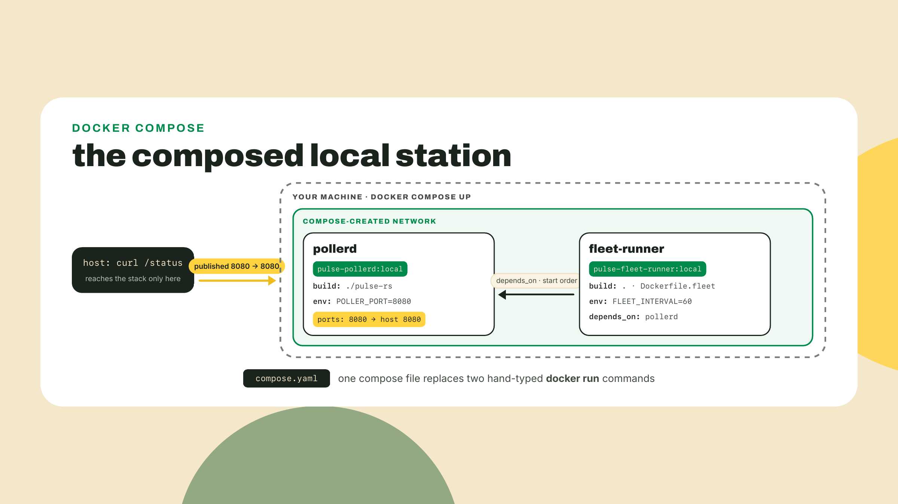
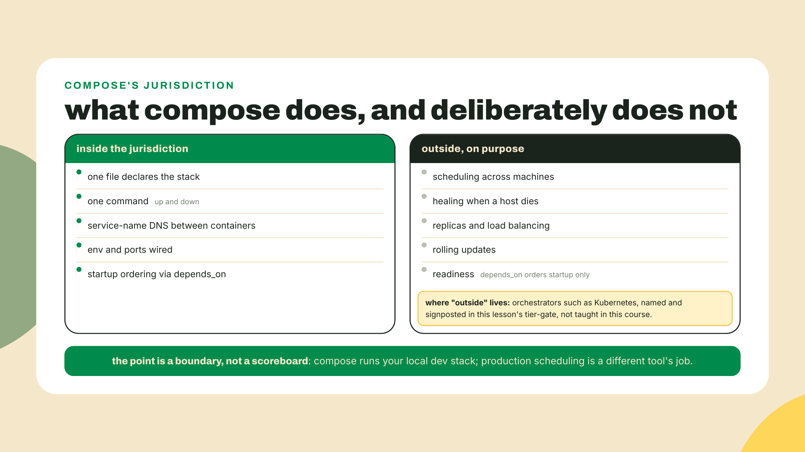
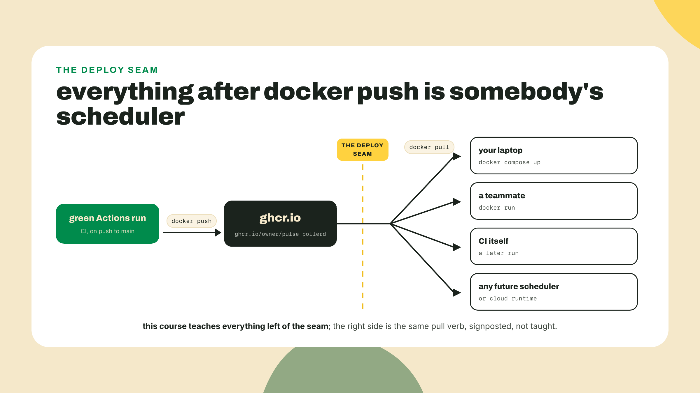
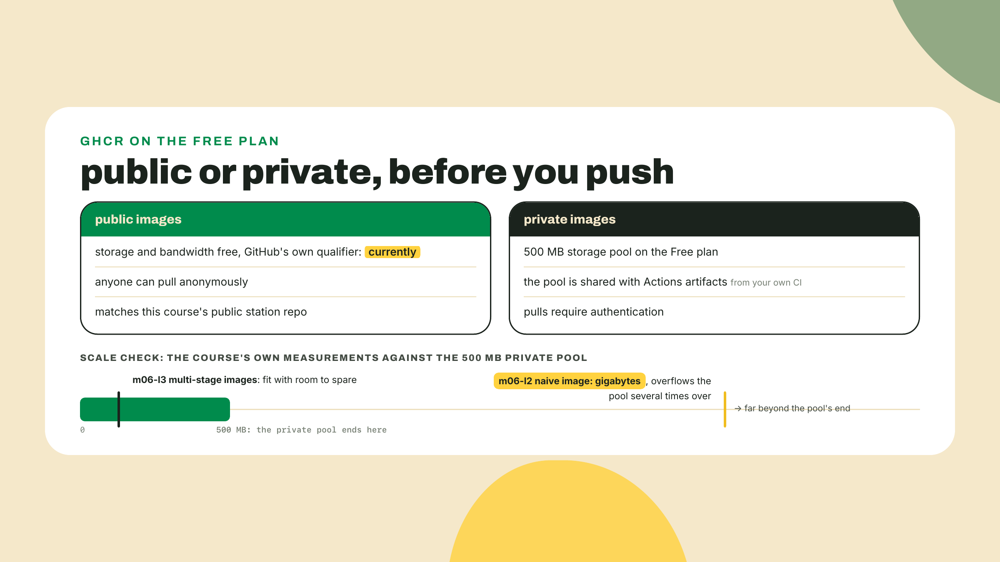
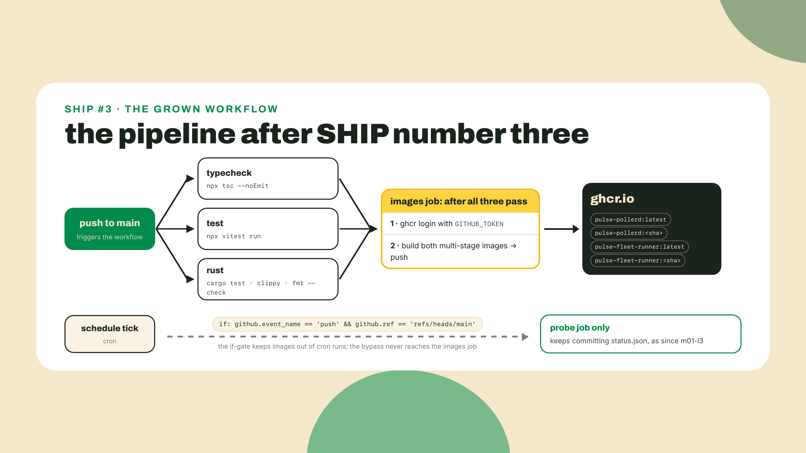
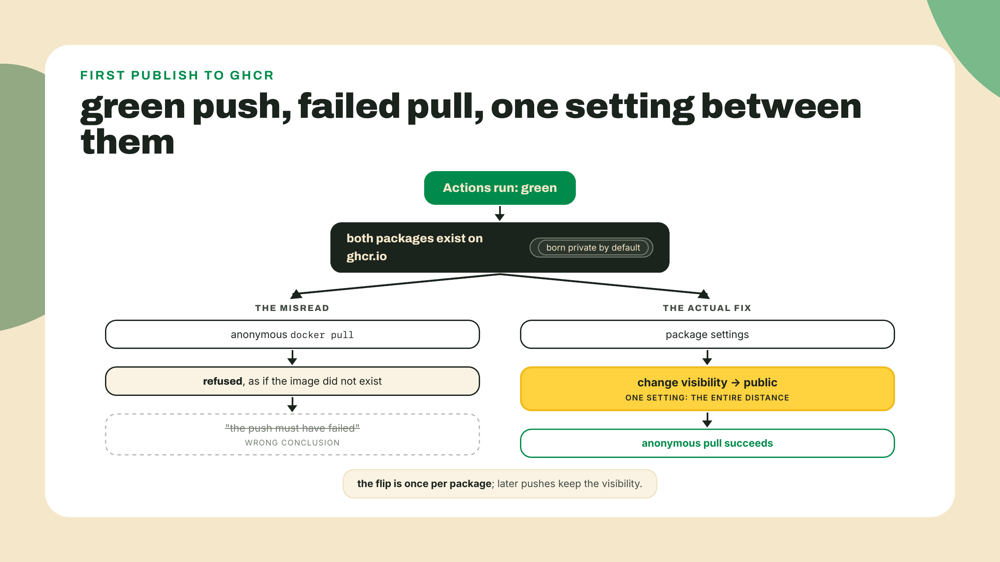
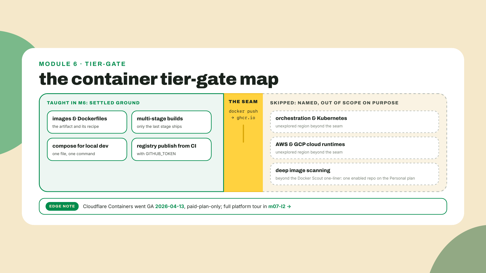

# Compose for local, GHCR from CI

## Summary

m06-l3 cut both images by an order of magnitude: cargo-chef 3-stage on debian-slim for the poller, node slim multi-stage with pinned pnpm for the fleet-runner, which also gained its interval service mode. So you now own two lean images and, if you are honest, two terminal tabs babysitting them with hand-typed `docker run` flags. Worse: those images exist on exactly one machine on Earth, yours. CI cannot pull what only you have. Neither can the future module that re-ships this poller with chain probes. Today closes both gaps, and the second one is SHIP #3: one compose file replaces the tab-babysitting, and the course's one Actions pipeline learns to push both images to `ghcr.io`, where any machine with a docker daemon can pull them. How the work splits: the compose file and the CI job are completion problems with narrow TODOs, and the log-prefix-plus-profile challenge at the end is fully yours. The platform ceremony stays the minority of the word count on purpose; the idea in the middle, where deployment actually begins, is the teaching center.

## Two halves of runs-anywhere

### Up the station

No new install today, for most of you: Docker Desktop and OrbStack ship Compose as a plugin of the `docker` CLI itself. The exception is m06-l2's colima path, whose `brew install colima docker` gave you a bare docker CLI with no compose plugin; close the gap with `brew install docker-compose`, then teach the CLI where Homebrew puts plugins by adding `"cliPluginsExtraDirs": ["/opt/homebrew/lib/docker/cli-plugins"]` to `~/.docker/config.json` (colima's documented wiring). Everyone confirms the same way: `docker compose version` should print a version string, not a command-not-found. At the root of your station repo, next to `pnpm-workspace.yaml` and `pulse-rs/`, create `compose.yaml`:

```yaml
services:
  pollerd:
    build:
      context: ./pulse-rs
    image: pulse-pollerd:local
    ports:
      # TODO 1: publish the poller's port. host:container, and the
      # container side is whatever POLLER_PORT says below.
      - "????:????"
    environment:
      POLLER_PORT: "8080"

  fleet-runner:
    build:
      context: .
      dockerfile: Dockerfile.fleet
    image: pulse-fleet-runner:local
    environment:
      # TODO 2: the runner's sweep interval, in seconds. Pick a value
      # you can watch without falling asleep. 60 is honest.
      FLEET_INTERVAL: "????"
    depends_on:
      - pollerd
```

Two TODOs, both single values you already know: the port mapping is the same `8080:8080` you have typed with `-p` since m06-l2, and the interval is whatever you passed to `--interval` last lesson. Fill them, then:

```bash
docker compose up
```

Watch what one command just did. It built both images from their Dockerfiles (the poller's at `pulse-rs/Dockerfile` where m06-l2 put it, the fleet's at the repo root as `Dockerfile.fleet` because its build context needs the whole pnpm workspace), created a private network for them, started `pollerd` first because the runner declares `depends_on`, and now streams both services' logs into one terminal, each line prefixed with the service that wrote it. From a second terminal, `curl -s localhost:8080/status` answers exactly as it did when you were typing the run flags by hand. Two tabs of babysitting, retired by one short YAML file.

While the pair runs, take the ten-second inventory in that second terminal:

```bash
docker compose ps
```

One row per service: name, the image it runs, its state, and, for the poller, the port mapping in the same `host:container` shape `-p` taught you. This is the paste the checkpoint asks for, and it is where I look first whenever a composed stack misbehaves, for the same reason `docker ps` was the first stop in m06-l2: state and ports answer half of all "it's broken" reports before any log is read.

Why two services, though? You could build one fat image that runs both programs and skip the YAML entirely. The answer is m06-l3's own rule coming back with interest: one container, one foreground process. The poller and the runner have different restart needs, different logs, different update cadences (you will rebuild the TS image far more often than the Rust one), and stuffing them into one box welds all of that together and hands you a supervisor problem inside the container. Compose exists precisely so that keeping processes separate stops costing you terminal tabs.



### The file, walked

Now the anatomy, field by field, because you will read a hundred of these files in the wild and write a dozen. A **service** is compose's unit: one image, one container recipe, one name. The name is load-bearing twice. It prefixes the log stream you are watching, and it becomes a DNS hostname on that private network, so containers can reach each other by name; add `http://pollerd:8080/status` as a target in the fleet's config and your TS fleet probes your Rust poller across the network compose built, no IP addresses harvested from anywhere. `build` points at a context and optional Dockerfile, and `image` names what the build produces; we tag these `:local` so they never collide with the multi-stage tags you measured last lesson. `ports` and `environment` are your `-p` and `-e` flags, written down. `depends_on` orders startup, and here is the honesty the docs owe you and this course will collect on: it waits for the pollerd *container to start*, not for the poller to be *ready*. Starting is a process fact; ready is an application opinion. If the runner's first sweep fires before the poller's socket is open, that sweep fails and the next one succeeds, which is exactly the resilient behavior your fleet learned in m02: treat a refused connection as a Down probe, not a crash.

When an app genuinely cannot tolerate that, a database that must accept connections before a migration runs, say, compose does have the stronger form: give the dependency a `healthcheck` (a command compose runs inside the container until it succeeds) and write the dependency as `depends_on` with `condition: service_healthy`. Then compose waits for readiness as *you* defined it, not for mere startup. Our station does not need it, the fleet's backoff already absorbs a slow-starting poller, so we name the tool and leave it in the drawer. Reaching for readiness machinery a retry loop already covers is how compose files grow to two hundred lines.

One recap-sized check while you are here. Last lesson froze the runner's interface on purpose: `--interval` on the CLI, the `FLEET_INTERVAL` environment variable as its fallback, flag winning when both are present, run-once when neither is set. The compose file above speaks the env half of that contract, which is the container idiom for the same reason `POLLER_PORT` exists: one immutable image, many deployments, the knob on the outside. If your runner reads only the flag, go back and wire the m06-l3 fallback before `up`; the image itself must never need rebuilding to change its schedule.

Here is the whole daily loop on one card, run from the directory holding your compose file:

```bash
docker compose up -d           # start both services, detached
docker compose ps              # both services, their state, their published ports
docker compose logs -f         # tail the interleaved stream from both containers
docker compose up -d --build   # after you edit code; compose reuses images otherwise
docker compose down            # stop and remove the containers and the network
```

The daily driver commands, all space-form: `docker compose up -d` for detached once you trust the pair, `docker compose ps` to see both services with their state and ports, `docker compose logs -f` to tail the interleaved stream, `docker compose up -d --build` after you edit code (compose reuses images unless told to rebuild), and `docker compose down` to stop and remove containers and the network in one motion. That last one is the politeness habit `--rm` gave you, scaled to the whole stack, and it is worth being precise about what survives it: `down` removes the containers and the network, while the images stay in your local cache, so the next `up` is fast. Nothing your station wrote inside a container survives `down`, and for us that is acceptable because nothing in either box writes anything worth keeping: the poller's state rebuilds from probing, and the containerized sweep is `src/fleet.ts`, the config-driven prober m06-l3 was careful to disambiguate, which writes no results file at all, it prints its summary counters to stdout and exits. (`status.json` belongs to the OTHER `fleet.ts`, the package-root script the m01-l3 cron invokes, and that one never went in a box.) The channels that survive in this deployment are the log stream (which the challenge makes grep-friendly) and the durable `status.json` the Actions cron keeps committing, which never stopped being the canonical copy. The day a service needs in-container data that outlives its container, you will meet volumes, which this course leaves in the same drawer as readiness checks.

A confession about the command's shape: I still type `docker-compose`, hyphen and all, when I am tired, because 2020 tutorials burned it into my hands. That hyphenated binary is Compose v1, long dead. The thing you are using is Compose v2, the `docker compose` space-form plugin, and one naming wrinkle is worth saying once so nobody on your team "corrects" you: the *architecture* is called v2, while the release *tags* on the project are v5.x, v5.5.0 being the latest as I write this on 2026-09-02. Version strings drift; the space form is the stable fact.

### Where compose's jurisdiction ends

Say out loud what this file is: a local-dev contract. And say what it is not: a deployment story. Compose schedules nothing beyond your one machine. If the poller crashes at 3am, compose can restart the container if you ask, but if the *machine* dies, nothing anywhere notices. It heals nothing across hosts, balances nothing, rolls nothing out gradually. The moment you want restarts-on-failure across machines, or two replicas behind one address, or an update that swaps versions without downtime, you have left compose's jurisdiction for orchestrators, and this course deliberately does not teach those; the tier-gate at the end of this lesson names them properly. What compose buys inside its jurisdiction is real and daily: the whole stack in one file, checked into the repo, so `git clone` plus `docker compose up` is the entire onboarding document for the next person. You will see production-cosplay compose files in the wild, a `restart: always` standing in for operations. Read them as what they are: a small team being honest that one machine is all they need yet.



### The registry is the deploy seam

Now the second half, and the idea this module has been walking toward. Your images run anywhere a docker daemon lives, but they *exist* in exactly one place. A **registry** fixes existence. You have met the shape twice: npm stores packages, crates.io stores crates, a registry stores images. You even logged into one, Docker Hub, back in m06-l2, to pull base images politely. Today you push to a different one: **GHCR**, the GitHub Container Registry at `ghcr.io`, chosen because it lives next to the repo, the pipeline, and the token you already have, no new account, no new billing relationship.

An image reference there reads `ghcr.io/<owner>/<name>:<tag>`: registry host, then your GitHub namespace, then the image name and tag. One sharp edge worth knowing before the lab: image names must be lowercase, so if your GitHub username has capital letters, the tag you push must fold them down; the lab's CI job does this mechanically so you never think about it again.

Could you push from your laptop instead of from CI? Mechanically, yes: create a classic personal access token with the `write:packages` scope, `docker login ghcr.io` with it, tag, push. The lab does not do that, and the reason is worth owning because it shapes how real teams publish. A laptop PAT is a long-lived credential sitting in your keychain with write access to every package you own, and a laptop push publishes whatever happened to be in your working tree, tested or not. The workflow's `GITHUB_TOKEN` is the opposite on both axes: minted fresh for each run, dead minutes later, scoped to the one repo by the permissions you will write in the YAML, and it can only publish a commit that just survived your gates. The registry seam is exactly where you want a machine's discipline instead of a human's memory. So the course canon is CI-push only, and the PAT route stays in your back pocket for the day you need to push a one-off experiment somewhere private.

Here is the collapse, and it is the sentence this module ends on. The registry is the deploy. Everything after `docker push` is somebody's scheduler: your laptop running `docker compose up`, a teammate's `docker run`, some future orchestrator, a cloud runtime you have never heard of. They all begin with the same verb, `pull`, against the same address. Which means the ship you are about to perform is different in kind from SHIP #1's cron and SHIP #2's dashboard URL: those shipped *behavior*; this ships an *artifact other machines can run*. A boundary note said plainly, so the promise stays honest: the station's poller keeps running locally, via compose or `docker run`. This lesson does not give the poller a public URL, and no tunneling or self-hosting is taught here. The ship is the registry itself.



### What the push costs

The money paragraph, honest and short. Public container images on GHCR are free to store and serve, and GitHub's own billing page hedges that with one word, "currently," a vendor's adverb you should read as pricing weather, not climate. Private images bill against a pool instead: the Free plan gives you 500 MB of private package storage, and, the part that bites, that pool is *shared with your Actions artifacts*, so your CI's own uploads compete with your image layers. Run the number against your own history: the naive image you measured in m06-l2 weighed gigabytes, which means it would have overflowed that entire private pool several times over, by itself, before your first artifact. Your multi-stage images fit comfortably. That is last lesson's work paying rent. One distinction keeps the mental model straight when you read the billing page yourself: storage is about the bytes your layers occupy at rest, while pulls spend transfer, a separate meter; keeping an image private does not get cheaper because nobody downloads it. For this course's station, whose repo has been public since m01-l3, public images are the honest default and the free one.



## Lab: SHIP #3

The re-ship. Same repo, same `.github/workflows/pulse.yml` you have grown since m01-l3, already gating on vitest since m02-l4 and on cargo test, clippy, and fmt since m04-l3. It gains one job. The job is worked below except the tag scheme, which is your TODO; the visibility flip and the clean-machine pull are yours to perform because performing them is the lesson.

1. **Gate the job before you write it.** Your workflow triggers on both `push` and the cron schedule. The probe job should keep firing 48 times a day; an image build should not, because nothing about the images changes when a schedule ticks. The job you are about to add therefore opens with an `if` that runs it only for pushes to `main`. Read the condition in the YAML below and say the two clauses to yourself before moving on: right event, right branch.

2. **Add the `images` job.** Append this to `pulse.yml`, at the same indent level as your existing jobs:

   ```yaml
     images:
       if: github.event_name == 'push' && github.ref == 'refs/heads/main'
       needs: [typecheck, test, rust]
       runs-on: ubuntu-latest
       permissions:
         contents: read
         packages: write
       steps:
         - uses: actions/checkout@v7
         - name: log in to ghcr
           run: echo "${{ secrets.GITHUB_TOKEN }}" | docker login ghcr.io -u "${{ github.actor }}" --password-stdin
         - name: owner, lowercased
           run: echo "OWNER=$(echo '${{ github.repository_owner }}' | tr '[:upper:]' '[:lower:]')" >> "$GITHUB_ENV"
         - name: build and push pollerd
           run: |
             docker build -t "ghcr.io/$OWNER/pulse-pollerd:latest" pulse-rs
             docker push "ghcr.io/$OWNER/pulse-pollerd:latest"
             # TODO: also tag this same build with the commit SHA and push that tag too
         - name: build and push fleet-runner
           run: |
             docker build -f Dockerfile.fleet -t "ghcr.io/$OWNER/pulse-fleet-runner:latest" .
             docker push "ghcr.io/$OWNER/pulse-fleet-runner:latest"
             # TODO: same here, latest AND the commit SHA
   ```

   Three glosses where the interesting decisions live. `needs: [typecheck, test, rust]` makes the registry sit downstream of every gate you have built; an image cannot ship from a commit the tests rejected, which is the whole point of having gates. The `permissions` block is the workflow declaring, in the open, that its token may write packages; you met this block in m01-l3 when `contents: write` let the probe commit `status.json`, and the same recap in half a sentence covers the token itself: pushes made with `GITHUB_TOKEN` do not retrigger the workflow, so no recursion. Forget `packages: write` and the push step dies with a 403 that *looks* like a wrong-password problem; it is not, no secret is missing, the token simply was not granted the scope, and now you know to read that 403 as a permissions-block problem forever. The lowercasing step is the sharp edge from earlier, filed down: `tr` folds your username so the image reference is always legal.

3. **Fill the tag TODO.** Two tags per image, `latest` and the commit SHA, pushed separately. Why both: `latest` is a mutable convenience pointer, fine for humans; the SHA tag is an immutable receipt that says exactly which commit produced this image, and it is what you would deploy from if you ever needed to roll back. Inside the job, the SHA is `${{ github.sha }}`. The shape for the poller, yours to mirror for the runner:

   ```bash
   docker build -t "ghcr.io/$OWNER/pulse-pollerd:latest" -t "ghcr.io/$OWNER/pulse-pollerd:${{ github.sha }}" pulse-rs
   docker push "ghcr.io/$OWNER/pulse-pollerd:latest"
   docker push "ghcr.io/$OWNER/pulse-pollerd:${{ github.sha }}"
   ```

4. **Push and watch.** One m06-l2 echo before you do: if `pulse-rs/pulse.config.json` was ever a symlink on your machine, confirm the real-file replacement is COMMITTED, not just sitting in your working tree; the runner builds from a fresh checkout, where a tracked symlink pointing outside the build context dangles and the poller image dies at startup, two lessons downstream of its cause. Then commit, push, open the Actions tab. The images job waits for your three gates, then builds both multi-stage images on the runner and pushes four tags. Green run, no errors, both pushes logged. Save the run URL; the checkpoint wants it.

   While it runs, read the build log with last lesson's eyes and notice something missing: the `CACHED` lines. Your laptop rebuilds the poller in seconds because cargo-chef's dependency layer sits in your local cache; the runner is a fresh machine every run, so it compiles the world cold, every time, and the images job will be your pipeline's slowest by a wide margin. That is not a bug in your Dockerfile, it is the price of ephemeral runners, and the fix (persisting build cache across CI runs) is real, documented, and deliberately not taught here; file it next to orchestration as a thing you will reach for when the cold builds start to hurt. The `if`-gate from step 1 is what keeps this cost bounded: you pay it per merge, never per cron tick.



5. **Now try to use it, and meet the gotcha.** The run is green, so the images are public, right? Test the claim the way any stranger's machine would:

   ```bash
   docker logout ghcr.io
   docker pull ghcr.io/<your-username>/pulse-pollerd:latest
   ```

   The pull fails, denied, as if the image did not exist. Do not conclude the push failed; a failed push fails the step and the run, and yours was green. This is GHCR's first-publish default: every new package is born **private**, visible to you and nobody else, and an anonymous pull is refused without confirming the package even exists. The fix is a setting, not code. On github.com, open your profile's **Packages** tab, click `pulse-pollerd`, then **Package settings**, then in the danger zone **Change visibility** to Public and type the package name to confirm. Do the same for `pulse-fleet-runner`. This is a one-time flip per package; future pushes to the same package keep its visibility.



6. **The proof that travels.** This is the module's interim check, and it is deliberately the same command a stranger would run. Still logged out of `ghcr.io`, or better, on a second machine that has never seen your code:

   ```bash
   docker pull ghcr.io/<your-username>/pulse-pollerd:latest
   docker run --rm -p 8080:8080 ghcr.io/<your-username>/pulse-pollerd:latest
   ```

   Then `curl -s localhost:8080/status` from another terminal. That JSON is your poller, running from an image your machine pulled from the public internet, built by a CI runner you never touched, from a commit your gates approved. The GHCR pull is the proof: not "works on my machine" but "works on any machine that can pull."

## Challenge

Solo, two seams, no new concepts. First, make the interleaved logs grep-friendly: give each service's own log lines a stable one-line shape, something like a `sweep` summary line per interval for the runner and a per-poll line for the poller, so `docker compose logs -f` reads as a timeline instead of two monologues shuffled together. You are editing your own programs' output, not compose; the runner's line is a `console.log` in the interval loop, the poller's a `println!` (or the log line you already emit) in the poll loop. The test of a good shape is that `docker compose logs | grep sweep` tells the last hour's story on its own. Second, profiles: mark the `fleet-runner` service with `profiles: ["fleet"]`, then put `COMPOSE_PROFILES=fleet` in a `.env` file next to `compose.yaml` so plain `docker compose up` still starts both services, while `COMPOSE_PROFILES="" docker compose up` brings up only the poller. Compose reads that `.env` file on its own; nothing sources it. Acceptance: both variants behave as described, and `docker compose config --services` shows the service list changing between them, two names in the default case, one when the profile is emptied.

## The tier-gate: what this course skipped, and where it lives

Every ship boundary in this course owes you a map of what it left out, and the container tier's map matters more than most because the ecosystem above it is enormous. This is a map, not an apology: the skipped territory was skipped because the 80% of the dev lifecycle you came here for does not require it. Three names, honestly signposted.

**Orchestration**, Kubernetes chief among them, is everything on the far side of the deploy seam: a fleet of machines that pull your images, keep the declared number of copies running, replace the ones that die, and roll new versions out gradually. Read that sentence again and notice it is your compose file's vocabulary, services and images and desired state, stretched across many machines; that is why learning compose honestly is the right first rung even though compose is not the ladder. Kubernetes is out of scope on purpose, this course has no sibling to hand you to for it, and you now hold the exact concept, images on a registry, that every orchestrator consumes.

**Cloud runtimes**, AWS and GCP and their managed container services, same verdict: they are pull-side consumers of the seam you just built, and teaching any one of them would have cost a module this course spent on the two languages instead. **Image scanning depth** gets one honest line: Docker Scout will scan for known-vulnerable layers, its Personal plan includes 1 enabled repo, and that is your free entry point when the station's images start carrying dependencies you did not write. One piece of color for the map's edge, because it says something true about where this industry is: on 2026-04-13 Cloudflare Containers went GA, the edge-functions platform admitting some workloads just want a Linux box, but it sits behind the $5/mo Workers Paid plan, which fails this course's no-card rule; the platform family it belongs to gets its full tour in m07-l2.



## Checkpoint

Gate on doing, three pastes: your `docker compose ps` output showing both services Up while `curl -s localhost:8080/status` answers from the composed stack; the URL of the green Actions run whose images job pushed both packages; and the logged-out or second-machine `docker pull` of your own GHCR image followed by the first lines of its `docker run` output. That third paste is the one that would have been impossible at breakfast.

One calibration ask before you close the terminal. This lesson bet that the compose file needed only two TODOs and the CI job only one, on the theory that three lessons of Docker and eighteen of pipeline-growing earned that thinness. If either felt like filling in a form instead of building, or if the visibility flip caught you even with the warning printed above it, say which in the course feedback; the fade schedule is tuned by exactly these reports.

The station now runs anywhere a docker daemon lives, and that sentence was the module's whole promise. But notice what it still concedes: the station runs in one place at a time, some single machine's daemon, somewhere. Next module the probes stop living in a region at all. The same station logic goes to Cloudflare's edge, deployed to hundreds of cities at once, in both of your languages, TypeScript first and then the Rust payoff. The registry was the deploy; everything after `docker push` is somebody's scheduler. Time to go meet the schedulers.
