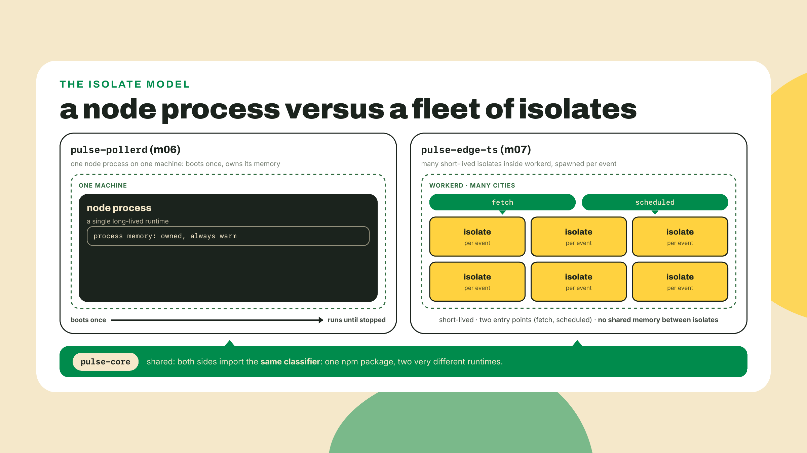
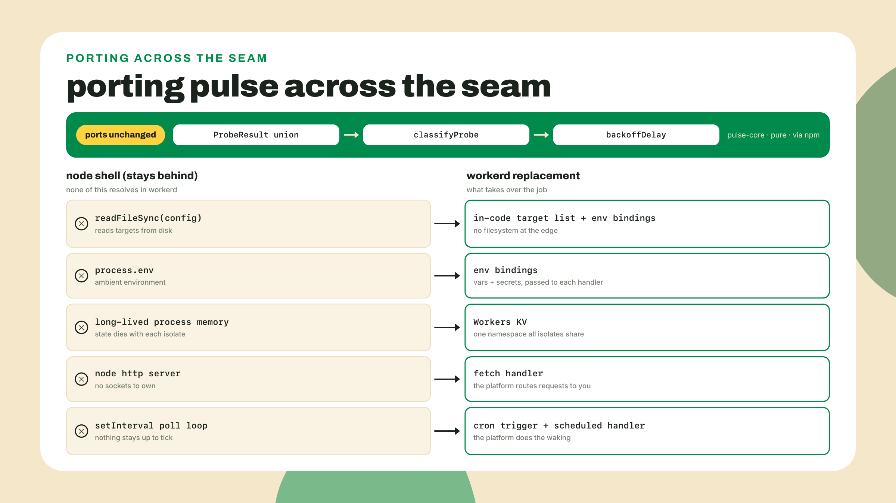
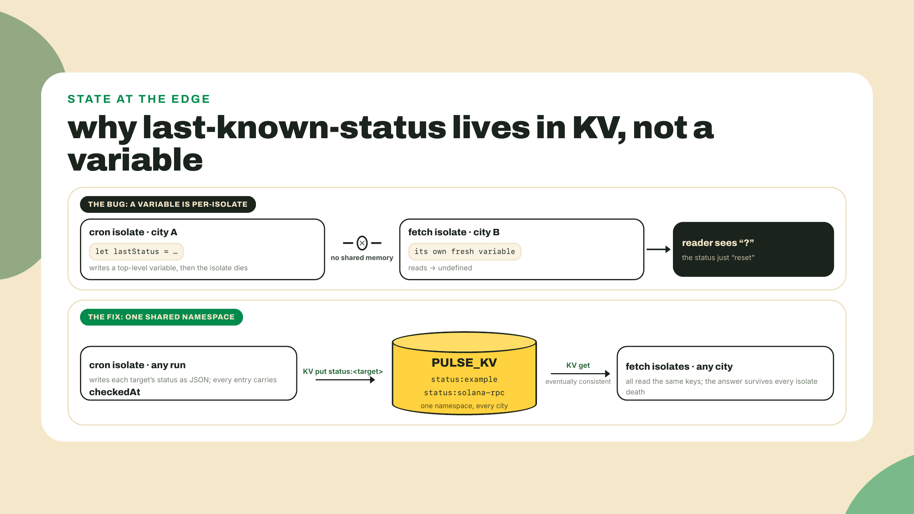
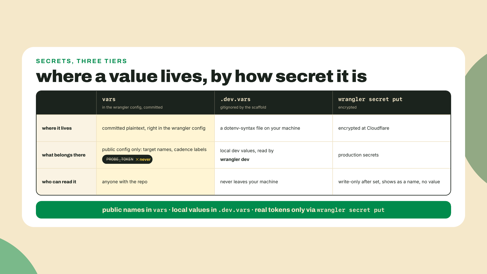
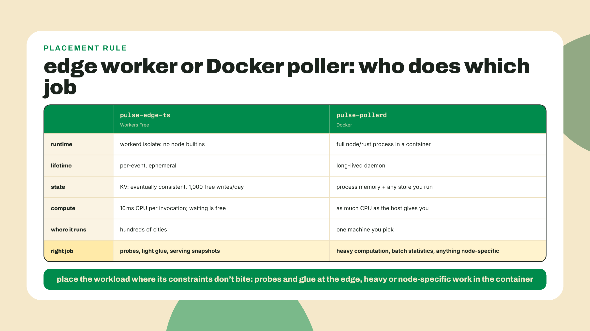
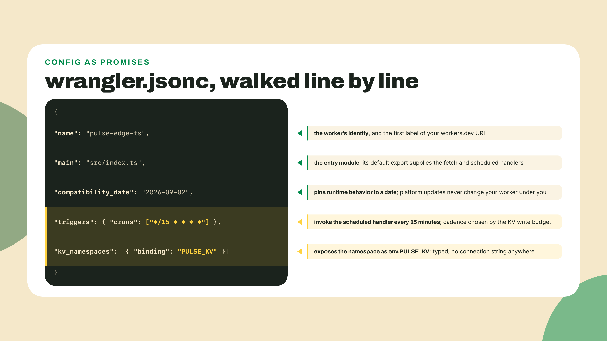
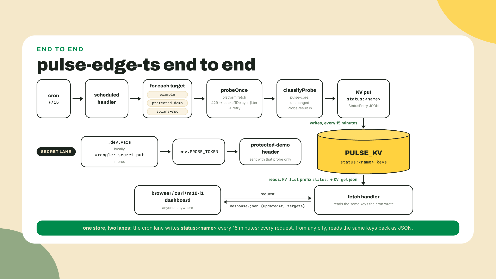

# A worker in every city: TS at the edge + KV

## Summary

m06-l4 closed the container tier: the poller and fleet-runner run locally under compose, both images live on GHCR pushed by CI, and the tier-gate named what we skipped (K8s, cloud, scanning depth). So the station now measures the internet from a dashboard on Vercel, a cron on Actions, and a poller in a box. Every one of those measures it from exactly one place. Today that changes: you deploy `pulse-edge-ts`, a Cloudflare Worker that runs the same pulse-core classifier on a schedule, remembers last-known-status in Workers KV, holds one real secret properly, and probes the Solana public RPC as just another target. The scaffolding this module keeps thinning: the worker skeleton and config are given, the KV wiring and the cron loop are completion TODOs you finish, and the second probe-target kind at the end is fully yours. You have shipped to three platforms already; the fourth one should feel less like a tutorial and more like recognition.

## Your code in hundreds of cities

Here is the pain, and it is one your own station has quietly had since module one. A probe that runs in one region tells you about that region's route to the target, not about the target. Your Actions cron runs wherever GitHub happened to schedule it. Your poller runs in your house. When either of them says "degraded, 900ms," you genuinely cannot tell whether the target slowed down or one transatlantic cable had a bad afternoon. The fix is not a bigger server. The fix is your code running in hundreds of cities at once, and a free tier hands it to you in the first ten minutes of this lesson. Do this now:

```bash
npm create cloudflare@latest -- pulse-edge-ts
```

The scaffolder (Cloudflare calls it C3, and it comes down through npm, no install beyond this line) asks a short series of questions. Answer: start with the `Hello World example`, template `Worker only`, language `TypeScript`, git `Yes`, and when it offers to deploy, say `No`, because we want to read what we ship first. Two 2026-09-04 prompt notes: C3 now also offers an AGENTS.md file, answer no; and inside the station repo the git `Yes` quietly no-ops (C3 detects the parent repository). Both are fine. You get a folder containing `src/index.ts`, a `wrangler.jsonc` config, and `wrangler` itself pinned as a dev dependency (v4 line, 4.128.0 when I checked on 2026-09-02), which is why every wrangler command in this lesson runs through `npx`. Now:

```bash
cd pulse-edge-ts
npx wrangler dev
```

Open the printed localhost URL, see `Hello World!`, stop the dev server, and ship it for real:

```bash
npx wrangler deploy
```

The first deploy walks you through browser login and picking a `workers.dev` subdomain, then prints a live URL shaped like `pulse-edge-ts.<your-subdomain>.workers.dev`. Open it on your phone. That is SHIP #4, a fourth platform live before the theory section is over, and the whole rest of this lesson is upgrading what answers at that URL. (The ships so far, in order: #1 the Actions cron in m01-l3, #2 the Vercel dashboard URL in m03-l3, #3 the GHCR images in m06-l4, #4 here. Next lesson's Rust twin lands a second URL under this same ship, because the platform is the ship and the second engine is the point.)

### What a Worker actually is

Your poller is a node process: it boots, it owns memory, it runs until something kills it. A Worker is none of those things. Your code runs inside an isolate, a lightweight sandbox inside Cloudflare's runtime `workerd`, and the platform spins isolates up in whichever of its cities traffic arrives in, runs your handler for one event, and freely throws the isolate away. No boot you control, no memory you keep, no process that is "the" server. The contract is a pair of handlers: `fetch` runs when a request arrives, `scheduled` runs when a cron fires. That is the entire programming model.



The honest one-liner, and it collapses most of the mystique: the edge is not a faster server, it is your code where the user already is. Everything strange about Workers falls out of that. Node builtins exist only as shims, because there is no node and no OS underneath: a filesystem call has no disk to reach. No long-lived memory, because there is no "the machine" for it to live on. A 10 ms CPU budget per invocation on the free tier, because a thousand cities can afford to run you only if you are small. And the parts of your codebase that survive this environment unchanged are exactly the parts m03-l1 forced you to make pure. We will cash that claim in a minute.

One paragraph on Pages, because the internet will try to route you there. Cloudflare historically shipped a second product, Pages, for static sites, and 2023-era tutorials for "deploy your status page" will point at it. When I probed the Pages docs for this lesson on 2026-09-01, Cloudflare's own banner read: "Workers supports most Pages use cases and offers a broader feature set. It is Cloudflare's primary platform for building applications. Start new projects with Workers." That is a vendor sunsetting a product by recommendation, in plain sight, and it settles the question for us: this course builds Workers, full stop, and static assets ride along on Workers when we need them. The durable lesson outranks the platform trivia. Read the vendor's current docs, not blog posts from the year the tutorial was written; you watched Docker's docs pull the same quiet migration on this course's own link checker back in m06-l2.

### The seam: what ports, and what fails loudly

Now the engineering spine of this lesson. In m03-l1 you split the station into pulse-core (the `ProbeResult` union, `classifyProbe`, the backoff helpers, all pure logic) and app packages that do I/O around it. In m03-l4 you published the core to npm under your scope. That decision pays for itself today, because the worker is a brand-new project outside your workspace, and it can pull the engine like any stranger would:

```bash
npm i @YOUR_NPM_USERNAME/pulse-core
```

Everything in that package imports into workerd unchanged. Classifiers, types, `backoffDelay`: pure functions over plain data, no opinions about where they run. That is the whole reason the extraction discipline existed, and this is the third consumer proving it (the Vercel dashboard was the second).

What does not port is everything around the core, and workerd fails loudly at exactly the seam, though the failure moved since the early Workers era. Current workerd ships a Node compatibility layer, on by default at recent compatibility dates, so `import { readFileSync } from "node:fs"` no longer fails the build; the import resolves and `readFileSync` is a real function. What is missing is the machine underneath it. The only filesystem a worker sees is its own read-only bundle, mounted at `/bundle`, so the moment that function reaches for the fleet's config file the runtime refuses to even start, naming the path it could not find. Some APIs do not get that far: `child_process.spawn` exists as a name and throws `ERR_METHOD_NOT_IMPLEMENTED` the instant you call it. This is not a bug to route around; it is the platform drawing the pure-core/IO-shell boundary for you, in red: the modules are shimmed, the operating system is absent. Each side of the seam has a platform-native replacement: file I/O becomes fetch (the network is the disk here), env access becomes typed bindings on the `env` object your handlers receive, and persistent state becomes KV. The port is not "make the fleet run at the edge." It is "import the core, rewrite the shell."



One more word on those bindings, because they are the platform's quiet best idea and the worker's whole relationship to the outside world. In the fleet, configuration and capability arrived ambiently: `process.env` was a global grab-bag any module could reach into, and nothing in a function's signature told you it needed a database or a token. A Worker inverts that. Every capability your code may touch (the KV namespace, the secret, plain config vars) is declared in the wrangler config, and the runtime hands them to your handler as one typed `env` parameter. Nothing is ambient. Read a handler's signature and you know its entire blast radius. It is dependency injection enforced by the platform rather than by team discipline, and the TypeScript story completes it: `wrangler types` reads your config and `.dev.vars` and generates the `Env` interface, so adding a binding without updating types is not a mistake you can quietly make. Coming from module three, this should rhyme: it is the exports-map idea again, a curated public surface replacing reach-anywhere access, applied to infrastructure instead of modules.

### KV: the only memory you are given

The station's job is last-known-status, and an isolate cannot remember it. A top-level variable works in `wrangler dev` for a few requests, then "resets", because the isolate you wrote to died, or the next request landed in a different city. Worker memory does not survive invocations and does not span locations. It worked in dev is the classic state bug on this platform, and the cure is the platform's shared store: Workers KV, a global key-value namespace your worker reaches through a binding. The API is small enough to show whole:

```ts
await env.PULSE_KV.put("status:example", JSON.stringify(entry));
const stored = await env.PULSE_KV.get<StatusEntry>("status:example", "json");
const list = await env.PULSE_KV.list({ prefix: "status:" });
```

Put, get (with `"json"` doing the parse for you), list by prefix. KV is eventually consistent: a write lands in one location and propagates outward, so a read in another city can briefly see the previous value. For a status page whose entries say "as of this timestamp," that staleness window is genuinely fine, and saying so out loud is the design skill: you are choosing eventual consistency because the data model already carries its own freshness field.



KV on the free plan is metered, and the numbers shape the design more than you might expect: 100,000 reads per day, 1,000 writes per day (per the pricing page, probed 2026-09-01). Reads are abundant; writes are the scarce resource. Run the arithmetic for our worker before writing a line: a cron every 5 minutes is 288 runs a day, and writing one key per target means 288 times the target count. Three targets is 864 writes, which fits under 1,000 with almost no headroom; a fourth target tips over the cap. Every 15 minutes is 96 runs, 288 writes for three targets, and room to grow the target list. That is why the config below says `*/15`. The budget did the designing, exactly the way `CAP=25` sized your pool in m02-l3.


### Cron, secrets, and the one paragraph of money

The cron trigger is configuration, not code. Your `wrangler.jsonc` grows a `triggers` block with a crons array, and the platform invokes your `scheduled` handler on that beat, from its own infrastructure. No laptop involved, same promise as the M1 Actions cron, minus the runner spin-up. Testing it locally would be miserable if you had to wait out real clock time, so `wrangler dev` exposes a plain HTTP route that fires the handler on demand:

```bash
curl "http://localhost:8787/cdn-cgi/handler/scheduled"
```

(If that route 404s on your wrangler version, use the older spelling of the same door: start dev with `npx wrangler dev --test-scheduled` and curl `"http://localhost:8787/__scheduled?cron=*+*+*+*+*"` instead; wrangler has carried both across the v4 line.) That route earns its keep fast when your only entry point fires on a schedule; you will hit it a dozen times in the lab.

Secrets next, and this is a taught habit now, not a footnote, because the worker needs a real one: a header token for a protected demo target. The rule has three tiers. Plain config that anyone may read goes in the wrangler config `vars` block, and only that, because that file is committed. Local development secrets go in `.dev.vars`, dotenv syntax, gitignored by the scaffold, read automatically by `wrangler dev`. Production secrets go up with `npx wrangler secret put <KEY>`, which prompts for the value, stores it encrypted, and never shows it again; not readable in the dashboard, not readable by wrangler, visible only as a name. A token in the `vars` block is committed plaintext with a config file's innocent face. That is the whole hygiene model, and m09-l2 will sweep it across all four platforms.



Now the money paragraph, numbers stated once and plainly, all from the pricing page probed 2026-09-01. Workers Free: 100,000 requests a day, and 10 ms of CPU per invocation. KV free: the 100,000 reads and 1,000 writes a day you just budgeted against. The subtle number is the CPU one, so hold it up to the light: 10 ms meters compute, not waiting. Time spent awaiting a fetch is free; a tight synchronous loop is what blows the budget. Make it concrete with our own domain: suppose a later version kept probe history and you decided the worker should compute rolling percentiles over ten thousand samples on every request. Sorting ten thousand numbers is real CPU, do it a few times over and you are brushing the meter, and the failure mode is not a bill, it is invocations erroring out mid-computation while your request count sits nowhere near the daily cap. Meanwhile the current worker awaits three fetches and spends well under a millisecond actually computing. That asymmetry is the tier's whole personality: a probe worker fits it beautifully because its life is 99% waiting on other people's servers, and heavy computation still belongs in the Docker poller, where CPU is yours by the hour instead of metered by the millisecond. On the card question: nowhere in Cloudflare's docs or pricing does the vendor print a "no credit card" promise, so I will not put those words in its mouth; what I can say is that every 2026 report of the Workers Free signup we could find had no card requested as of the 2026-09-01 probe. If your signup asks for one, that is a course-feedback note I want.

### The Solana ramp: the chain joins the target list

The station has been drifting Solana-ward since M2, and today the chain becomes a monitored target, with no ceremony and no new library. Solana's public RPC speaks JSON-RPC over plain HTTP POST, and its cheapest question is `getHealth`:

```bash
curl -s https://api.mainnet.solana.com -X POST -H "content-type: application/json" \
  -d '{"jsonrpc":"2.0","id":1,"method":"getHealth"}'
```

A healthy node answers `{"jsonrpc":"2.0","result":"ok","id":1}`. That hostname is the form Solana's own cluster docs print today, and it is the one this course uses everywhere; M8 opens by telling you what the older spelling you will meet in tutorials is and why it still resolves.

One production honesty note before your worker ever probes it: that curl succeeding does not promise the same POST succeeds from inside workerd. Public RPC endpoints run anti-abuse policy on more than request rate; they discriminate on client fingerprint and egress, and as of a 2026-09-04 re-verification, the identical getHealth POST that returns `ok` from curl comes back like this from a `wrangler dev` isolate on the same machine and IP:

```text
{"jsonrpc":"2.0","error":{"code":403,"message":"Your IP or provider is blocked from this endpoint"},"id":1}
```

Providers block some clients wholesale, through no fault of your code. That is the first real ops lesson of a monitor: one upstream is a single point of refusal, so a station carries a documented fallback. Ours is `https://solana-rpc.publicnode.com`, keyless, same JSON-RPC (verified answering `ok` from inside workerd, 2026-09-04). `api.mainnet.solana.com` stays canonical; step 7 tells you when to reach for the fallback. To the worker, this is one more target: POST instead of GET, measure the latency, feed the result to the same `classifyProbe` every other part of the station uses. No `@solana/kit` yet, deliberately; M8 introduces it when we start caring what is inside the responses. Today the transport answering promptly is the health signal.

Be precise about what that signal is, because monitoring tools that overstate their own measurements are how outage pages end up lying. `getHealth` is the node you asked reporting on itself: it says "ok" when that node believes it is caught up with the cluster, and an unhealthy or lagging node answers with a JSON-RPC error body instead. It is one machine's self-assessment behind a load balancer, not a verdict on Solana. Your probe therefore measures exactly two honest things: whether the public RPC answered you, and how fast, from whichever city your isolate ran in. That is precisely what a status station should record, and precisely how the entry should be read. When M8 starts decoding response bodies with kit, the station graduates from "the RPC endpoint answers" to "and here is what the chain says," and the difference between those two sentences is a distinction you now own.

One discipline carries over uncut. The public RPC allows 100 requests per 10 seconds per IP, and a 429 from it means the same thing a 429 meant in m02-l3: you are being told a budget, and hammering it digs the hole deeper. The backoff you built there, `backoffDelay` plus equal jitter, comes through the pulse-core import and wraps the RPC probe in the lab. The whole argument of M8 is in this paragraph in miniature: the chain is just another endpoint, with real latencies and real limits, and the engineering manners you built for flaky HTTP are the manners chain probing needs.

This section ran long, so let me name the trade-off and close the theory. The edge gives you proximity and scale you do not operate, and the price is a deliberately narrow runtime: node builtins as shims with no OS behind them, no long-lived memory, no threads, 10 ms of metered CPU, and shared state only through an eventually consistent store with a 1,000-write daily allowance. The edge is where probes belong, not where everything belongs. Say the division of labor out loud, because you now operate both halves: the worker measures and remembers the latest answer; the poller, with a real filesystem, unmetered CPU, and whatever process memory it wants, is where history accumulates and statistics get computed when the station grows those ambitions. The M6 container tier still exists for a reason, and when Cloudflare shipped Containers to GA on 2026-04-13 (paid plans only), the platform itself conceded the point: some workloads just want a Linux box. Yours keeps its box on GHCR; today's probes get the cities.



**Go deeper (the 20%).** this lesson taught the platform through one worker's worth of it: isolates, the two handlers, KV, cron, secrets. The guided tour of everything else (R2, D1, Durable Objects, Queues, the dashboard) lives in Cloudflare's own get-started guide: [https://developers.cloudflare.com/workers/get-started/guide/](https://developers.cloudflare.com/workers/get-started/guide/) (URL checked 2026-09-02). Bookmark it, walk it after the lab. Nothing below depends on it.

## Lab: pulse-edge-ts

The fade, stated: steps 1 and 2 you already did in the opener. The skeleton and config in steps 3 to 5 are given with the KV pair and the cron loop as holes you fill. Step 6 is secrets, worked tersely. The second target kind afterward is the challenge, fully yours.

1. **Confirm the scaffold state.** You have `pulse-edge-ts/` deployed with hello-world from the opener. If not, run the two commands from the top of the lesson now. Everything below edits this project.

2. **Install the engine and prove the seam.** Two commands, one failure on purpose:

   ```bash
   npm i @YOUR_NPM_USERNAME/pulse-core
   ```

   (Skipped the m03-l4 npm publish? No account needed: `npm pack` inside `packages/pulse-core`, the same tarball move m03-l4 used for inspection, then `npm i ../packages/pulse-core/<scope>-pulse-core-0.1.0.tgz`; installing from a local tarball is new here, and it is one command.) Then, at the top of `src/index.ts`, paste the fleet's config-loading move:

   ```ts
   import { readFileSync } from "node:fs";
   const config = JSON.parse(readFileSync("./pulse.config.json", "utf8"));
   ```

   and run `npx wrangler dev`. The import itself resolves, because current workerd ships a Node compatibility shim, and then the runtime refuses to start:

   ```text
   ✘ [ERROR] The Workers runtime failed to start.
   ...
   Uncaught Error: no such file or directory, readAll '/bundle/pulse.config.json'
     ... in readFileSync
   ```

   Read that path. `/bundle` is the only filesystem a worker has, its own uploaded code, read-only. That refusal is the seam from the theory section, live on your screen: the module ported, the machine did not. Delete both lines. The core import in the next step resolves clean, and now you know why the difference exists.

3. **Replace the config.** Open `wrangler.jsonc` and make it this (your namespace id arrives in step 4; leave the placeholder until then):

   ```jsonc
   {
     "name": "pulse-edge-ts",
     "main": "src/index.ts",
     "compatibility_date": "2026-09-02",
     "triggers": {
       "crons": ["*/15 * * * *"]
     },
     "kv_namespaces": [
       { "binding": "PULSE_KV", "id": "<your-namespace-id>" }
     ]
   }
   ```



4. **Create the namespace.** One command, then one paste:

   ```bash
   npx wrangler kv namespace create PULSE_KV
   ```

   The output prints the namespace id and the exact binding snippet; replace `<your-namespace-id>` in your config with the real id. From here, handler code reaches the store as `env.PULSE_KV`, and the scaffold's type generation keeps `Env` honest: run `npm run cf-typegen` (the scaffold ships it; it runs `wrangler types` under the hood, so `npx wrangler types` if your template named it differently) any time bindings change.

5. **The worker, with two holes.** Replace `src/index.ts` with the skeleton below. Everything is given except the two TODOs: the KV put/get pair, and the cron loop's per-target body with backoff on the RPC target. Fill them before reading the finished versions that follow.

   ```ts
   import {
     classifyProbe,
     backoffDelay,
     type ProbeResult,
   } from "@YOUR_NPM_USERNAME/pulse-core";

   interface Env {
     PULSE_KV: KVNamespace;
     PROBE_TOKEN: string;
   }

   interface Target {
     name: string;
     url: string;
     kind: "http" | "solana-getHealth";
     headers?: Record<string, string>;
   }

   interface StatusEntry {
     name: string;
     verdict: ReturnType<typeof classifyProbe>;
     result: ProbeResult;
     checkedAt: string;
   }

   const TIMEOUT_MS = 3000;
   const MAX_RETRIES = 2;
   const BASE_MS = 500;
   const CAP_MS = 4000;

   const sleep = (ms: number) => new Promise((resolve) => setTimeout(resolve, ms));

   // pulse-core exports the frozen (kind, value) boundary form. A dns-error
   // carries a hostname, not a reading, so it is decided here, not there.
   function verdictOf(result: ProbeResult): ReturnType<typeof classifyProbe> {
     switch (result.kind) {
       case "ok":
         return classifyProbe("ok", result.latencyMs);
       case "timeout":
         return classifyProbe("timeout", result.budgetMs);
       case "http-error":
         return classifyProbe("http-error", result.status);
       case "dns-error":
         return "down";
     }
   }

   function targetList(env: Env): Target[] {
     return [
       { name: "example", url: "https://example.com/", kind: "http" },
       {
         name: "protected-demo",
         url: "https://httpbin.org/bearer",
         kind: "http",
         headers: { authorization: `Bearer ${env.PROBE_TOKEN}` },
       },
       { name: "solana-rpc", url: "https://api.mainnet.solana.com", kind: "solana-getHealth" },
     ];
   }

   async function probeOnce(target: Target): Promise<ProbeResult> {
     const controller = new AbortController();
     const timer = setTimeout(() => controller.abort(), TIMEOUT_MS);
     const started = Date.now();
     try {
       const res =
         target.kind === "solana-getHealth"
           ? await fetch(target.url, {
               method: "POST",
               headers: { "content-type": "application/json" },
               body: JSON.stringify({ jsonrpc: "2.0", id: 1, method: "getHealth" }),
               signal: controller.signal,
             })
           : await fetch(target.url, { headers: target.headers, signal: controller.signal });
       await res.text();
       if (res.ok) {
         return { kind: "ok", latencyMs: Date.now() - started };
       }
       return { kind: "http-error", status: res.status };
     } catch {
       if (controller.signal.aborted) {
         return { kind: "timeout", budgetMs: TIMEOUT_MS };
       }
       return { kind: "dns-error", host: new URL(target.url).hostname };
     } finally {
       clearTimeout(timer);
     }
   }

   async function probeWithBackoff(target: Target): Promise<ProbeResult> {
     let result = await probeOnce(target);
     for (let attempt = 0; attempt < MAX_RETRIES; attempt++) {
       if (!(result.kind === "http-error" && result.status === 429)) break;
       const delay = backoffDelay(attempt, BASE_MS, CAP_MS);
       const jittered = delay / 2 + Math.random() * (delay / 2);
       await sleep(jittered);
       result = await probeOnce(target);
     }
     return result;
   }

   export default {
     async scheduled(controller: ScheduledController, env: Env, ctx: ExecutionContext) {
       const checkedAt = new Date().toISOString();
       for (const target of targetList(env)) {
         // TODO 1: probe this target (with backoff), classify the result with
         // verdictOf, assemble a StatusEntry, and put it into PULSE_KV
         // under the key `status:${target.name}` as JSON.
       }
     },

     async fetch(request: Request, env: Env): Promise<Response> {
       // TODO 2: list PULSE_KV keys with the "status:" prefix, get each entry
       // as JSON, and return { updatedAt, targets } via Response.json, with a
       // CORS header so a browser page may read this endpoint.
       return Response.json({ updatedAt: new Date().toISOString(), targets: [] });
     },
   } satisfies ExportedHandler<Env>;
   ```

   Read what is already decided for you before filling holes, five notes:

   - **The probe shell** is a rewrite of m02-l3's `probeOnce` in platform fetch, same four exits into the same union; only a 429 goes around the retry loop, jittered, exactly the fleet's discipline, now aimed at the RPC cap of 100 requests per 10 seconds per IP.
   - **Latency comes from `Date.now()` deltas** because workerd is not node and `performance.now()` there is deliberately coarsened for timing-attack reasons; millisecond fields read off a coarse clock are honest enough for a status page.
   - **One labeling shortcut to own consciously:** the catch's non-timeout arm files EVERY network-layer failure, TLS handshake and connection reset included, under the `dns-error` name. If that overstatement itches after the paragraph above about tools that overstate their measurements, good; the rename m02-l3 offered (`network-error`, with the compiler walking you to every switch) is one errand away.
   - **The skeleton hand-declares `Env`** so this page is self-contained, but in your repo the `npm run cf-typegen` output from step 4 is the authoritative `Env`; once `PROBE_TOKEN` exists in `.dev.vars` (step 6), re-run the typegen and retire the local interface in favor of the generated one, which is the mechanism step 4 sold.
   - **The loop is sequential on purpose:** three probes every 15 minutes needs no pool, and the CPU meter only runs while you compute, so the awaits cost nothing.

   Now the completed TODO 1 body, for after you have written yours:

   ```ts
   const result = await probeWithBackoff(target);
   const entry: StatusEntry = {
     name: target.name,
     verdict: verdictOf(result),
     result,
     checkedAt,
   };
   await env.PULSE_KV.put(`status:${target.name}`, JSON.stringify(entry));
   console.log(`${target.name}: ${entry.verdict}`);
   ```

   And TODO 2:

   ```ts
   const list = await env.PULSE_KV.list({ prefix: "status:" });
   const targets: StatusEntry[] = [];
   for (const key of list.keys) {
     const entry = await env.PULSE_KV.get<StatusEntry>(key.name, "json");
     if (entry) targets.push(entry);
   }
   return Response.json(
     { updatedAt: new Date().toISOString(), targets },
     { headers: { "access-control-allow-origin": "*" } },
   );
   ```

   Two lines here are interface, not implementation, so treat them as frozen. First, the response shape: `{ updatedAt, targets }` where each entry carries `name`, `verdict`, `result`, and `checkedAt`. This JSON is the exact surface the M10 capstone polls when the dashboard grows an edge column, so the field names you ship today are the field names a future page depends on. Second, the CORS header: the capstone reads this endpoint from a browser, browsers block cross-origin reads by default, and `access-control-allow-origin: *` is the honest setting for a public, read-only status snapshot. Nothing here is sensitive; the endpoint's whole purpose is to be read by strangers. (If that header is new to you, do not detour; the browser side of the story gets its proper treatment in the capstone, when a page of ours actually does the fetching.)

   The `console.log` line is not decoration; it is what `wrangler tail` shows you in step 7. Note what the classifier line proves: `classifyProbe`, unmodified, published from your workspace weeks ago, is now producing verdicts in an isolate. The `verdictOf` wrapper around it is four lines of adapter, not a second classifier: it only unpacks each variant into the `(kind, value)` pair the published boundary takes, and rules on the one variant that has no numeric reading to give it. Every band, every threshold, every judgment is still the package's. Same code as the dashboard, same code as the CLI.

   Scaffold hygiene: the C3 template shipped `test/index.spec.ts`, vitest specs asserting the fetch handler returns `Hello World!`. It stopped doing that the moment you pasted the skeleton, so those specs are red from here on. Delete the file, or rewrite its assertions against the `{ updatedAt, targets }` shape; knowingly failing tests teach everyone to ignore the test command.



6. **Wire the secret, both halves.** Locally, create `.dev.vars` in the project root (the scaffold's gitignore already covers it; verify with `git check-ignore .dev.vars`):

   ```bash
   echo 'PROBE_TOKEN=local-dev-token' > .dev.vars
   ```

   For production:

   ```bash
   npx wrangler secret put PROBE_TOKEN
   ```

   Type any value at the prompt. Small honesty credit to httpbin here: its `/bearer` endpoint returns 200 for any bearer token and 401 for none, which makes it a free protected-target stand-in; the token's value does not matter, the plumbing does. What you are practicing is the three-tier rule with real commands, and the acceptance check at the end grep-proves it.

7. **Run it locally, then ship it.** Start `npx wrangler dev`, then force the cron in a second terminal:

   ```bash
   curl "http://localhost:8787/cdn-cgi/handler/scheduled"
   ```

   (Same fallback as the theory section if this 404s: `npx wrangler dev --test-scheduled` plus the `/__scheduled?cron=*+*+*+*+*` route.) Watch the dev terminal print three verdict lines, then hit `http://localhost:8787/` and read your JSON snapshot. Then:

   ```bash
   npx wrangler deploy
   npx wrangler tail
   ```

   Leave `tail` running until the quarter-hour ticks over and the cron fires in production; the same three log lines arrive from Cloudflare's infrastructure with no machine of yours involved. That command deserves a sentence of respect, because it is your first taste of observability on a platform where you cannot ssh anywhere: `tail` streams live logs and exceptions from every city your worker runs in, into your terminal, and it is the difference between "the cron probably fired" and watching it fire. The Cloudflare dashboard shows the same story in its worker view if you prefer clicking to streaming; either one is acceptable evidence. Checkpoint: `curl -s https://pulse-edge-ts.<your-subdomain>.workers.dev/` returns JSON with one entry per target, and the `solana-rpc` entry carries a verdict from the latest `getHealth` probe. If that entry instead reads `down` with `{"kind":"http-error","status":403}`, that is the theory section's blocklist refusing your isolate, not a bug: your worker just handled a real refusal correctly. Swap the target to the documented fallback and re-fire the cron:

   ```ts
   { name: "solana-rpc", url: "https://solana-rpc.publicnode.com", kind: "solana-getHealth" }
   ```

   The entry goes `up`; keep whichever endpoint answers you, and note the swap. (Deployed workers egress from Cloudflare datacenter IPs, which public-RPC anti-abuse also polices, so the fallback matters in production too.) Open it on your phone, off wifi, for the full effect.

8. **Force a failure and watch it surface.** Change the `example` target's URL to `https://definitely-not-a-real-host.example`, redeploy, and after the next cron fire re-curl the snapshot. The entry now shows the `dns-error` variant and a `down` verdict, timestamped. (Some runs file a `timeout` instead, when the failing DNS lookup outlives the 3-second abort; either is honest, the verdict is `down` both ways, and a re-fire usually shows the `dns-error` spelling.) That loop (break a target, see the store say so on the next beat) is the station's entire reason to exist, now running from hundreds of cities. Restore the URL and redeploy.

## Challenge

Add a second probe-target kind, end to end, without touching the given plumbing: an expected-status-code check. A target like `{ name: "redirect-check", url: "https://example.com/missing", kind: "expect-status", expectStatus: 404 }` should classify `up` when the response status equals `expectStatus` (a 404 can be the correct answer; a health check for a page that must not exist is a real monitoring pattern), and fall through to the normal classification otherwise. You will need to extend the `Target` type, teach `probeOnce` the new kind, and decide what `ProbeResult` variant an expectation match maps to; there is a clean answer using the union as it stands. Acceptance: `npx wrangler deploy` succeeds; your workers.dev JSON shows the new target correctly classified; the forced-failure loop from step 8 still works; and the secret exists in prod via `npx wrangler secret list`. Then commit the worker project (`git add pulse-edge-ts && git commit`) before the final check: `git grep -i probe_token` finds only the binding name, never a value, and your committed config contains no secret. The commit comes first because `git grep` searches tracked files only; on an uncommitted project it finds nothing and proves nothing.

## Checkpoint

What you can now do, concretely: explain what an isolate is and predict which of your modules will and will not run in one before trying; scaffold, develop, and deploy a Worker with `npm create cloudflare@latest` and `npx wrangler deploy`; persist shared state in KV and size a write budget against a free-tier cap; run a real cron at the edge and test it locally through the scheduled route; and keep a secret out of git on the third platform in a row.

The 30-second retrieval before you close the tab: why did the status object stop living in a variable, and where does CPU time get spent in this worker? You are reaching for: isolate memory neither survives invocations nor spans cities, so shared state goes to KV; and the 10 ms budget meters compute only, so a worker that mostly awaits fetches barely spends any. If both came out clean, the platform's model is yours.

If the seam bit you somewhere this lesson did not predict (a dependency of a dependency reaching for a node builtin is the classic), send the module name in the course feedback; the porting table above grows from exactly those reports.

The TS half of the station now runs in hundreds of cities. Next lesson is the payoff the whole Rust arc was building toward: the same pure engine from M4, compiled to WASM, deployed to the same edge with the same `wrangler deploy`. One platform contract, two languages.
