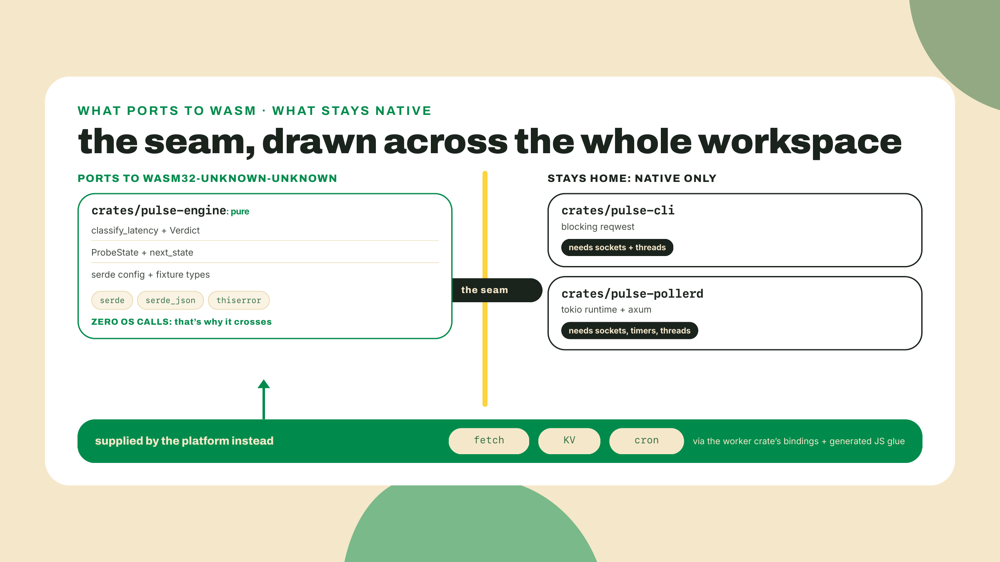
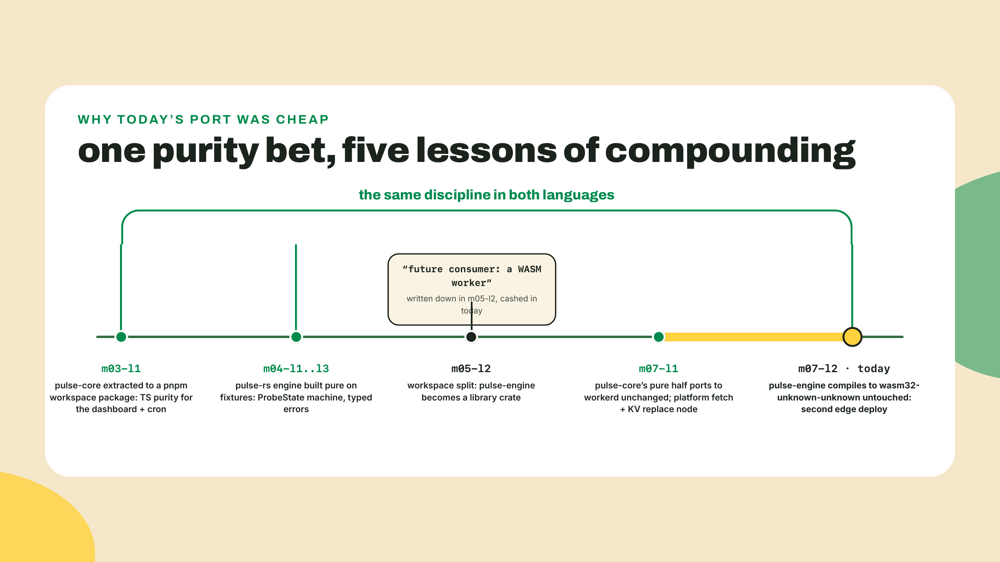
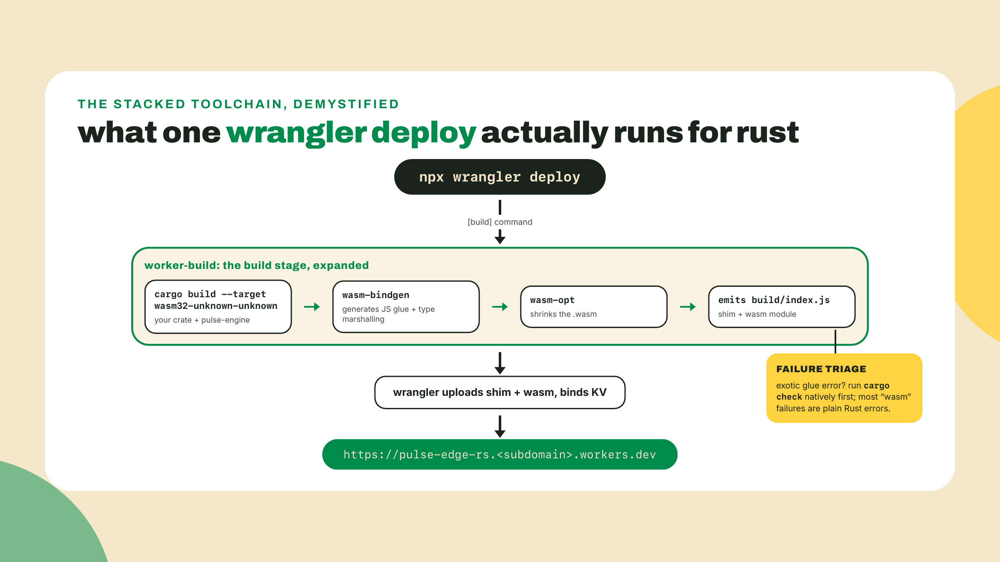
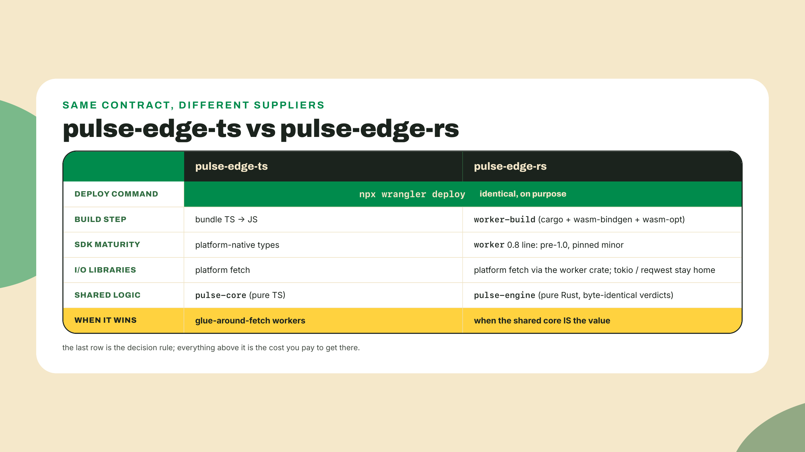
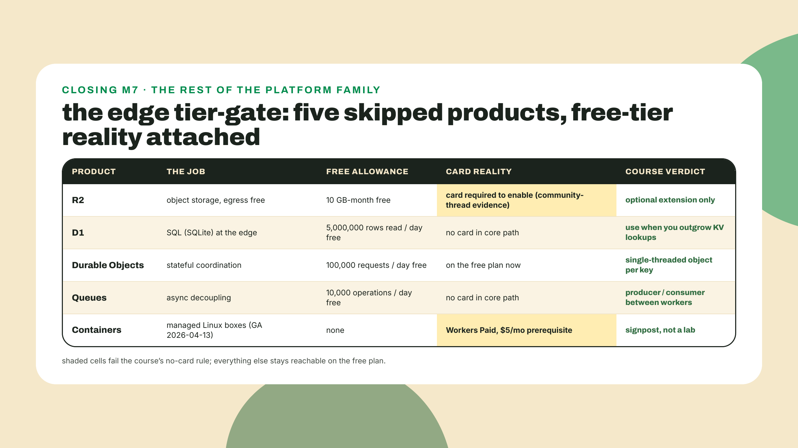
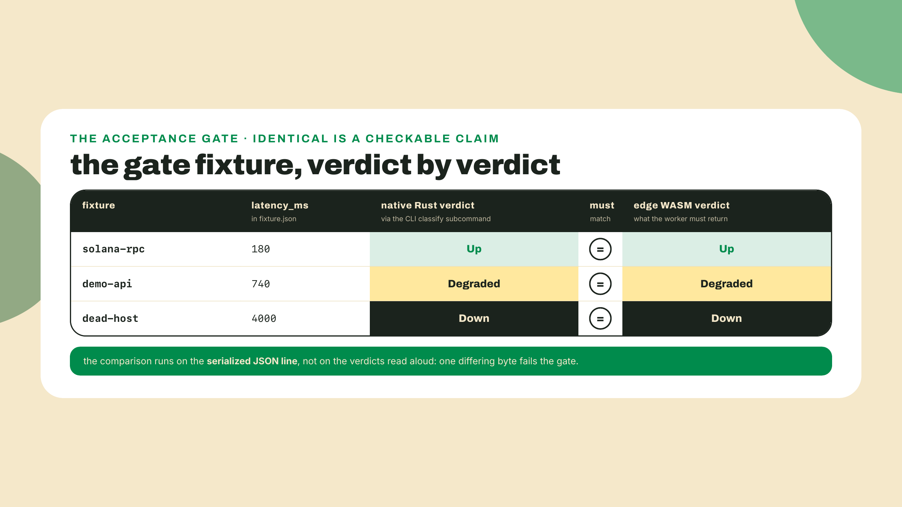
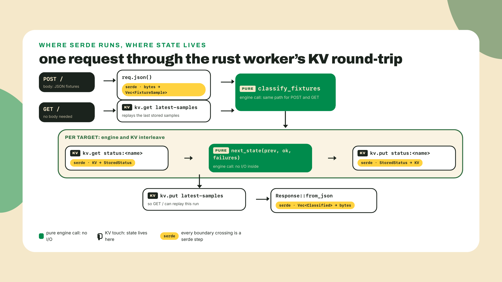
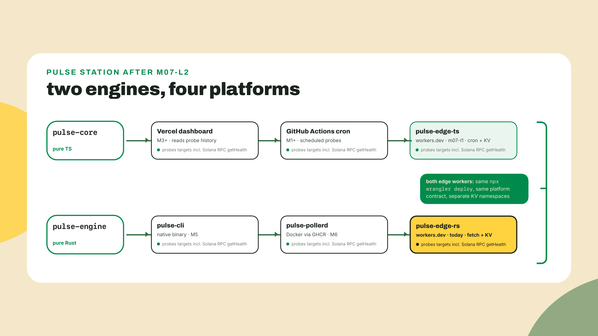

# The payoff: Rust on the same edge

## Summary

m07-l1 shipped the TS worker: pulse-core's pure logic running on a cron in hundreds of cities, last-known-status parked in KV, the secret handled like an adult, and Solana's getHealth already sitting on the probe list. That was engine one. The station has two. Today the Rust engine gets the same treatment: you compile `pulse-engine` to WebAssembly, wrap it in a workers-rs project, and land the station's second live workers.dev URL with the exact deploy command you ran yesterday. The autonomy contract, out loud, priced honestly: the generated template arrives working, the real handler arrives complete on the page, and your hands-on TODOs are the wiring around it, the engine dependency, the CLI's classify arm, and the KV get and put pair; the closing transition-table route is the lesson's one fully solo build. Thinner than some labs, deliberately, because the thesis is that the port itself is small. You have done this exact deploy one lesson ago. The delta is the language. The delta being ONLY the language is the whole lesson.

## The bet pays out

Back in M4 I made you keep the Rust engine pure: the classifier, the state machine, the serde types, all of them functions from values to values, no socket or file handle anywhere in the crate. In m05-l2 we split that purity into its own workspace crate and I listed what a pure core can feed, ending with "even a WASM worker in the deploy tier". It is later in the deploy tier. Two commands start the collection:

```bash
rustup target add wasm32-unknown-unknown
cargo install cargo-generate
```

The first teaches your existing toolchain to emit WebAssembly instead of native machine code. Same rustc, new backend, one added standard library build. The second installs `cargo-generate`, a scaffolding tool that stamps out projects from Git template repos, and it exists in this lesson because Cloudflare's official Rust path starts with it:

```bash
cargo generate cloudflare/workers-rs
```

Pick the `hello-world` template when it asks, name the project `pulse-edge-rs`, and run it at the root of your station repo so it lands next to `pulse-rs/` and the TS worker. The template also asks one question this paragraph would otherwise leave you guessing on, "Enable panic=unwind and abort recovery?": take the default, false. Do not deploy it yet. First, ten minutes of understanding what you just targeted, because `wasm32-unknown-unknown` is the most honest target name in the entire toolchain.

### An OS called unknown

A Rust compilation target names three things: architecture, vendor, operating system. `x86_64-apple-darwin`, `x86_64-unknown-linux-gnu`. Read the WASM one the same way: 32-bit WASM architecture, unknown vendor, unknown operating system. Unknown OS is not a placeholder waiting for a value. It is the specification. The compiled module may assume no threads, no sockets, no filesystem, no clock it did not ask for, no environment variables. It is pure computation in a sealed box, and anything from the outside world has to be handed in through an interface the host chooses to expose.

That should sound familiar, because it is the exact shape of your engine crate. `classify_latency` takes a latency and returns a `Verdict`. `next_state` takes a state, an outcome, and the consecutive-failure count, and returns a state. The serde types turn bytes into values and back. None of it ever opened a connection; the CLI, the poller, and the TS worker all did the I/O and fed the engine values. On the edge, the host is workerd, the same runtime from m07-l1, and what it hands into the box is the platform contract you already know: fetch, KV bindings, cron triggers, delivered to Rust through a JS glue layer the tooling generates for you.



### The refusal drill

Claims about what "doesn't port" are cheap, so let's buy the real error. From inside your engine crate, commit first, then sabotage it on purpose:

```bash
cargo add tokio --features full
cargo build --target wasm32-unknown-unknown
```

The build dies inside mio, tokio's OS event-loop layer, and the error is unusually polite about why:

```text
error: This wasm target is unsupported by mio. If using Tokio, disable the net feature.
  --> mio-1.2.2/src/lib.rs:44:1
   |
44 | compile_error!("This wasm target is unsupported by mio. If using Tokio, disable the net feature.");
```

I ran this exact sabotage while writing the lesson; every error block on this page is pasted from my terminal, not typed from memory. And look at what the error is actually saying: mio's job is wrapping epoll and kqueue, the OS facilities for waiting on sockets. On a target whose OS is named unknown there is nothing to wrap, so the crate refuses at compile time. reqwest fails more sneakily, and the sneak is worth knowing: the crate itself compiles on wasm32 because it carries a browser backend, but the `blocking` module your CLI uses since m05-l3 is conditionally compiled away, so the moment your code touches it you get `error[E0433]: could not find 'blocking' in 'reqwest'`. Same law, different messenger: the async arsenal is not banned from WASM by policy. It is anchored to native by the OS calls underneath it, and the compiler enforces the anchor. Now `git checkout` the Cargo.toml AND the Cargo.lock, because `cargo add` rewrote both and the failed build pulled tokio's pins into the lockfile, and let the engine go back to being portable.

This is the pure-core and IO-shell seam completing its arc. m07-l1 proved it in TypeScript, where the enforcement was workerd's runtime refusing to start on a filesystem read: the module shimmed, the operating system absent. Rust proves it at compile time, before anything ships. Two languages, one law: logic that never touched the OS goes anywhere; I/O belongs to the shell, and every host gets its own shell.



### Reading the template you just generated

Open `pulse-edge-rs/`. cargo-generate left you a real, deployable project, and the habit this course applies to every scaffold applies here: read the artifact before running it. `Cargo.toml` first:

```toml
[package]
name = "pulse-edge-rs"
version = "0.1.0"
edition = "2021"

[lib]
crate-type = ["cdylib"]

[dependencies]
worker = { version = "0.8" }
worker-macros = { version = "0.8" }
```

Three field-by-field observations. `crate-type = ["cdylib"]` tells cargo to produce a C-style dynamic library instead of a binary, which is the shape wasm-bindgen knows how to consume. The `worker` crate is the Rust SDK for the Workers platform: your types for `Request`, `Response`, `Env`, and the KV binding. And the pin says `"0.8"`, not a bare latest, because worker is pre-1.0. Say the m05-l2 rule out loud: under semver, a 0.x minor is allowed to break you the way a 2.0 would elsewhere, so the pin holds the 0.8 line on purpose and you read release notes before choosing 0.9. As I write, probed on crates.io 2026-09-02, the line sits at 0.8.5, published 2026-06-12. Freshness note: re-check that digit when you do this lab; a pre-1.0 SDK is exactly the kind of dependency whose current minor matters. (The template also pins its own edition at 2021 while your workspace runs 2024; that is the m05-l2 survey playing out in one manifest, the ecosystem boarding late while your own host-side crates ride the current edition under that lesson's dated carve-out, and its rule covers this too: the template's edition is the template's contract. Different editions across a path dependency are fine; editions are per-crate, which is precisely why they can exist at all.)

The template's `src/lib.rs` is eight lines and you can already read every one of them:

```rust
use worker::*;

#[event(fetch)]
async fn fetch(
    _req: Request,
    _env: Env,
    _ctx: Context,
) -> Result<Response> {
    Response::ok("Hello World!")
}
```

`#[event(fetch)]` is the worker crate's macro marking this function as the fetch handler, the same contract slot your TS worker filled with an exported `fetch` method. There is an `#[event(scheduled)]` twin for cron, taking a `ScheduledEvent` instead of a `Request`, and it is worth knowing this worker could run on a schedule with one function and one wrangler.toml line. We deliberately do not: the TS worker already crons, the capstone's hub topology wants this one answering on demand, and giving both workers the same job would teach you copy-paste, not architecture. Yes, the function is `async`, and that is worth a beat given the refusal drill you just ran: async Rust works fine in a worker. What is missing on the unknown target is tokio's OS-backed I/O, not the async language feature. workerd drives these futures itself, through the JS event loop it already owns.

Now `wrangler.toml`, where the trick hides:

```toml
name = "pulse-edge-rs"
main = "build/index.js"
compatibility_date = "2026-09-02"

[build]
command = "cargo install -q \"worker-build@^0.8\" && worker-build --release"
```

`main` points at a JavaScript file that does not exist yet. The `[build]` block is why: every `wrangler deploy` first runs `worker-build`, which compiles your crate for wasm32-unknown-unknown, runs wasm-bindgen to generate the JS glue that marshals types across the boundary, runs wasm-opt to shrink the module, and emits `build/index.js` as the entry shim. Three tools stacked under one command. I am naming them so the build output does not read as noise, and that is all we do with them; worker-build, wasm-bindgen, and wasm-opt are plumbing this course does not teach. One practical consequence is worth keeping though: when a build error mentions wasm-bindgen glue and looks exotic, run `cargo check` in your native workspace first. Real type errors surface there with normal spans, and you debug Rust in Rust instead of through the glue.



### KV through Rust types

One more piece of the worker crate before the collapse, because the lab leans on it: the KV binding. Everything you learned about KV yesterday still holds and does not get re-taught here: it is the platform's persistent key-value store, eventually consistent, write-limited on the free tier, and the reason a stateless worker can remember anything at all. What changes in Rust is purely the type story, and the type story is good. `env.kv("PULSE_STATUS")` looks the binding up by name and hands you a `KvStore`. Reads come back through a builder that ends in `.json::<T>().await?`, which means KV hands you an `Option<T>` of your own engine type, already deserialized, or `None` when the key has never been written. Writes go the other way: serialize with `serde_json::to_string`, then `kv.put(key, value)?.execute().await?`, where the `.execute()` is the builder actually firing (forgetting it is the classic first-week bug, because the line without it compiles fine and does nothing). Serde standing on both ends of the pipe is the point to notice. The same derive lines that fed the CLI's JSON output and the poller's `/status` endpoint now define the wire format of your edge storage, in a third runtime, without new code. When people say Rust's ecosystem converges hard on serde, this is what converging buys.

### One contract, two languages

Here is the collapse the whole module has been walking toward. Yesterday you deployed TypeScript with `npx wrangler deploy`. In the lab below you will deploy Rust with `npx wrangler deploy`. Not an analogous command. The same command, and the platform cannot tell the difference, because what the platform defines is a contract: a fetch handler shape, a scheduled handler shape, bindings declared in config, one deploy verb. Anything that satisfies the contract is a worker. Ask yourself the discriminating question: what, exactly, did wrangler need to know about your language to run yesterday's deploy? Nothing. It ran a build command from a config file and uploaded what came out, and it will do precisely that again today. So the artifact you are shipping to Cloudflare was never really "a TypeScript app" or "a Rust app"; it is a contract implementation, and the language is a supplier standing behind it. That is the durable lesson to carry out of this module, because you will meet it again everywhere platforms live: the container contract in M6 did not care that the box held Rust, only that a process listened on a port; the JSON-RPC contract next module will not care what wrote the request, only that the bytes parse. When a platform defines the seam, the language stops being an architectural decision and becomes a per-component choice, made on each component's actual merits.

And with that stated, the honest cost table, because the collapse cuts both ways. The Rust path stacks three build tools under the deploy, rides a pre-1.0 SDK whose minors can break between sittings, and forfeits tokio and reqwest at the seam. For a worker that is mostly glue around fetch, the TS worker you built yesterday is the lower-friction default, full stop. You pay the WASM toll when the value is the shared Rust core itself: one classifier, one state machine, one set of serde types, already tested, already trusted by the CLI and the poller, now answering from the edge without a rewrite. For the station's engine that trade is worth it. The heuristic to take with you: count the lines that are yours. If the worker's substance is platform calls with a thin logic sprinkle, write it in the platform's home language and move on; if the substance is a core you maintain, test, and trust elsewhere in Rust, port the core and keep one implementation of the truth. Knowing WHICH side of that judgment a given service falls on is precisely the skill this course is selling.



**Go deeper (the 20%).** this lesson teaches the workers-rs path at working depth: the target, the template, the handler macros, KV from Rust, and the deploy. The full binding catalog, Durable Object classes in Rust, send-safety wrappers, and the rest of the SDK's surface live in Cloudflare's Rust-language docs for Workers: [https://developers.cloudflare.com/workers/languages/rust/](https://developers.cloudflare.com/workers/languages/rust/) (URL checked 2026-09-02). Bookmark it; the lab below needs none of the bookmarked material.

### The tier-gate: what we skipped, and where it lives

M7 closes the edge tier, so before the lab, the map of the platform family we deliberately did not build on. This wants to be a catalog; I will keep it to a map, a few honest lines per product, because knowing what you skipped and why is a real skill and pretending the platform is only Workers plus KV would be a lie of omission.

**R2** is object storage, S3-shaped and S3-API-compatible: files, images, probe-history dumps, anything blob-sized. The free tier is genuinely generous, 10 GB-month stored and egress free, and free egress is R2's whole pitch against S3. But multiple Cloudflare community threads report that enabling R2 requires linking a payment method even for free-tier use, and that fails this course's no-card rule. So R2 is a clearly-labeled optional extension for learners who choose to link a card, never a core-path step; KV carries our state. If you do link a card someday, storing each probe run's raw JSON in R2 is the natural first use, and the worker crate speaks to it with the same binding pattern you are about to use for KV.

**D1** is SQL at the edge, SQLite under the hood, 5,000,000 rows read per day free. It answers the question KV cannot: queries. The moment you want "every target that was Degraded in the last hour", key lookups stop being the right shape and D1 is where the platform sends you, no card demanded.

**Durable Objects** are stateful coordination: a single-threaded object with its own storage, where every request for a given key routes to the same instance, which is how the platform does "exactly one of these exists" without you running a server. 100,000 requests per day free, and they are on the free plan now, which was not always true. If the station ever needed a per-target rate limiter or a live counter that cannot race, this is the tool.

**Queues** buy async decoupling between workers, producer on one side and consumer on the other, 10,000 operations per day free. The job they do for an edge fleet is the same job a message queue does anywhere: absorb a burst now, process it calmly later.

**Cloudflare Containers**, GA on 2026-04-13, is the platform admitting out loud that some workloads just want a Linux box: your M6 Docker images, managed, next to your workers. It will look like the missing piece of this course's story, and architecturally it almost is. It is also Workers Paid only, a $5/mo prerequisite, so under the no-card rule it stays a signpost here, not a lab. When you have five dollars a month and a reason, the M6 images you already push to GHCR are exactly what it runs.

No sibling course in this catalog owns these products, so this map plus the official docs is the honest hand-off: the bolded line is the job description, and the platform's own documentation is where you go the day the station needs one.



## Lab: pulse-edge-rs

This is the station's second edge ship, the Rust twin of m07-l1's worker. The fetch handler accepts probe fixtures or the last KV-stored samples, runs them through the SAME classifier and state machine the CLI and the Docker poller use, and returns classified JSON from the edge.

1. **Deploy the hello world first.** From `pulse-edge-rs/`, before touching anything:

   ```bash
   npx wrangler deploy
   ```

   Authentication carries over from m07-l1's browser login (on a fresh machine, `npx wrangler login` first). wrangler itself does not carry over, because yesterday's careful v4 pin lives in `pulse-edge-ts/package.json` and this cargo-generate project has no package.json, so the bare `npx wrangler` here fetches wrangler fresh; accept npx's prompt, or keep the pinned habit with `npx wrangler@4 deploy`. Either way the first run installs worker-build, compiles the template, and prints your second live workers.dev URL. Curl it, see `Hello World!`, and appreciate what just happened: your first Rust-to-WASM-to-edge pipeline worked before you understood it, which is the correct order for pipelines. Now we make it earn the URL.

2. **Wire the engine crate.** A wiring question worth settling before any code: path dependency or git dependency? Path, and I verified the whole chain before writing this page: a crate outside the workspace can depend on `pulse-engine` by path, cargo resolves the engine's `workspace = true` dependency subscriptions against the engine's own workspace, and the result compiles for wasm32-unknown-unknown clean. Add the dependencies to `pulse-edge-rs/Cargo.toml`:

   ```toml
   [dependencies]
   worker = { version = "0.8" }
   worker-macros = { version = "0.8" }
   serde = { version = "1.0.229", features = ["derive"] }
   serde_json = "1.0.151"
   pulse-engine = { path = "../pulse-rs/crates/pulse-engine" }
   ```

   Then give the engine the one new module both consumers will share. Fixtures are about to become a cross-language wire format, so they belong in the pure core: create `crates/pulse-engine/src/fixture.rs`:

   ```rust
   use crate::engine::{classify_latency, LatencyMs, Verdict};
   use serde::{Deserialize, Serialize};

   #[derive(Debug, Serialize, Deserialize)]
   pub struct FixtureSample {
       pub name: String,
       pub latency_ms: u64,
   }

   #[derive(Debug, Serialize)]
   pub struct Classified {
       pub name: String,
       pub latency_ms: u64,
       pub verdict: Verdict,
   }

   pub fn classify_fixtures(samples: &[FixtureSample]) -> Vec<Classified> {
       samples
           .iter()
           .map(|s| Classified {
               name: s.name.clone(),
               latency_ms: s.latency_ms,
               verdict: classify_latency(LatencyMs(s.latency_ms)),
           })
           .collect()
   }
   ```

   Declare it and re-export in the engine's `lib.rs` (`pub mod fixture;` plus `pub use fixture::{Classified, FixtureSample, classify_fixtures};`), and make the derive audit exhaustive while you are in there, because step 4's given code depends on every item: `Verdict` needs `Serialize` (and a spot in the lib.rs root re-exports, since the worker will name `pulse_engine::Verdict` directly), and `ProbeState` needs `Deserialize` added next to the `Serialize` it picked up in m06-l1, because KV is about to round-trip it, AND it must still carry the full m04-l3 canon, `Debug, Clone, Copy, PartialEq, Eq`. The `Copy` in particular is load-bearing: step 4's `StoredStatus` derives `Clone, Copy` while holding a `ProbeState`, which only compiles when the state enum is `Copy` itself, so if your derive list ever drifted, restore it now rather than meeting the derive error inside code this page called complete. If your module or field names drifted from mine over the modules, keep yours and adapt; the interface that matters is the exported function names and the JSON shape.

3. **Give the CLI the other half of the gate.** The acceptance test for this lesson is the same fixture producing identical verdicts from native Rust and edge WASM, so the CLI needs a `classify` subcommand. In `pulse-cli`'s command enum, one new variant and one new arm:

   ```rust
   /// Classify a JSON fixture set from stdin and print the verdicts as JSON
   Classify,
   ```

   ```rust
   Command::Classify => {
       use pulse_engine::{FixtureSample, classify_fixtures};
       let raw = std::io::read_to_string(std::io::stdin())?;
       let samples: Vec<FixtureSample> = serde_json::from_str(&raw)?;
       println!("{}", serde_json::to_string(&classify_fixtures(&samples))?);
   }
   ```

   One line of wiring before that arm compiles, because the CLI has never needed JSON output until now: give `pulse-cli` the workspace's serde_json subscription in its `Cargo.toml` dependencies, `serde_json = { workspace = true }`. The `use` inside the arm brings the two engine names into scope; nothing else changes.

   Write a shared fixture at the station repo root as `fixture.json`:

   ```json
   [{"name":"solana-rpc","latency_ms":180},{"name":"demo-api","latency_ms":740},{"name":"dead-host","latency_ms":4000}]
   ```

   And run it from the `pulse-rs/` workspace directory, stated because both halves of the command depend on it: `-p` needs the cargo workspace as its cwd, and `../fixture.json` reaches the repo root from exactly one level down:

   ```bash
   cd pulse-rs
   cargo run -p pulse-cli -- classify < ../fixture.json
   ```

   ```text
   [{"name":"solana-rpc","latency_ms":180,"verdict":"Up"},{"name":"demo-api","latency_ms":740,"verdict":"Degraded"},{"name":"dead-host","latency_ms":4000,"verdict":"Down"}]
   ```

   That line is your native ground truth. The edge must reproduce it exactly.



4. **Replace the toy logic.** Swap the template's `src/lib.rs` for the real handler. Two TODOs are left where the KV pair goes; everything else is complete:

   ```rust
   use pulse_engine::{classify_fixtures, next_state, FixtureSample, ProbeState};
   use serde::{Deserialize, Serialize};
   use worker::*;

   #[derive(Debug, Serialize, Deserialize, Clone, Copy)]
   struct StoredStatus {
       state: ProbeState,
       consecutive_failures: u32,
   }

   #[event(fetch)]
   async fn fetch(req: Request, env: Env, _ctx: Context) -> Result<Response> {
       let url = req.url()?;
       match url.path() {
           "/" => classify_handler(req, env).await,
           _ => Response::error("not found", 404),
       }
   }

   async fn classify_handler(mut req: Request, env: Env) -> Result<Response> {
       let kv = env.kv("PULSE_STATUS")?;
       let samples: Vec<FixtureSample> = if req.method() == Method::Post {
           req.json().await?
       } else {
           // TODO 1: read the "latest-samples" key from KV as Vec<FixtureSample>,
           // defaulting to an empty Vec when the key has never been written.
           Vec::new()
       };
       let classified = classify_fixtures(&samples);

       if req.method() == Method::Post {
           for c in &classified {
               let key = format!("status:{}", c.name);
               let prev: StoredStatus = kv
                   .get(&key)
                   .json()
                   .await?
                   .unwrap_or(StoredStatus { state: ProbeState::Pending, consecutive_failures: 0 });
               let ok = matches!(c.verdict, pulse_engine::Verdict::Up);
               let failures = if ok { 0 } else { prev.consecutive_failures + 1 };
               let next = next_state(prev.state, ok, failures);
               let stored = StoredStatus { state: next, consecutive_failures: failures };
               // TODO 2: write `stored` back to KV under `key`, serialized with serde_json.
           }
       }

       Response::from_json(&classified)
   }
   ```

   Read the shape before filling the holes. POST means "here are fresh samples, classify them and advance the per-target state". GET means "classify whatever KV saw last", and it is deliberately a pure read: the verdicts are recomputed, but the `for` loop that advances state sits behind the POST gate, so looking at the worker moves nothing and writes nothing. That gate is load-bearing twice over. m04-l3 defined `consecutive_failures` as consecutive PROBE failures, and a probe happens when samples arrive, not every time someone looks; an ungated loop would let three idle GETs, or one crawler wandering onto the public workers.dev URL, walk a Degraded target to Down with zero new probe data. And every KV put spends the daily write budget m07-l1 sized with almost no headroom; reads must not spend it. The verdicts come from `classify_fixtures` and the POST path advances through `next_state`: the same two functions, the same four-state machine, the same thresholds that have answered in the CLI since M4 and in the poller since M6. The worker authors no logic. It is a shell around the engine, which has been this course's definition of a good shell since m03-l1.

5. **Complete the KV pair.** This is the taught piece of the lab, so here are the two lines, with the reasoning. TODO 1:

   ```rust
   kv.get("latest-samples")
       .json::<Vec<FixtureSample>>()
       .await?
       .unwrap_or_default()
   ```

   And TODO 2, plus one extra put at the end of the POST branch so GET has something to read next time (place it right before `Response::from_json`, gated on the method you already matched):

   ```rust
   kv.put(&key, serde_json::to_string(&stored)?)?.execute().await?;
   ```

   ```rust
   if req.method() == Method::Post {
       kv.put("latest-samples", serde_json::to_string(&samples)?)?.execute().await?;
   }
   ```

   Notice serde standing on both ends of the pipe: `.json::<T>()` deserializes what KV stored, `serde_json::to_string` serializes what you put back, and the types crossing the pipe are the engine's own. This is the same KV your TS worker used conceptually, but a separate namespace in practice, so create one and bind it:

   ```bash
   npx wrangler kv namespace create PULSE_STATUS
   ```

   Paste the id block the command prints into `wrangler.toml`:

   ```toml
   [[kv_namespaces]]
   binding = "PULSE_STATUS"
   id = "<the-id-wrangler-printed>"
   ```

   The binding name is what `env.kv("PULSE_STATUS")` looks up at runtime; the id is which actual namespace answers. Two workers, two namespaces, zero shared state: per the capstone's hub topology, this worker probes independently and never consumes the poller.



6. **Run it locally before you ship it.** The dev loop you had for the TS worker exists for Rust too, same command:

   ```bash
   npx wrangler dev
   ```

   wrangler runs the worker-build pipeline and serves your worker on `localhost:8787`, with the KV binding pointed at a local simulation so nothing you POST here touches the real namespace. Feed it the fixture and eyeball the verdicts:

   ```bash
   curl -s -X POST -H "content-type: application/json" --data @../fixture.json http://localhost:8787/
   ```

   The loop is slower than the TS one, because every code change replays a Rust compile before the reload, and that is an honest cost of the toll you chose. It is still a compile-test loop on your own machine, which beats debugging through a deploy every single time.

7. **Deploy and run the gate.** Same verb as yesterday, then the two lines that close the module:

   ```bash
   npx wrangler deploy
   ```

   ```bash
   cargo run -p pulse-cli -- classify < ../fixture.json
   curl -s -X POST -H "content-type: application/json" --data @../fixture.json https://pulse-edge-rs.<your-subdomain>.workers.dev/
   ```

   Same JSON verdicts. If you want the byte-level receipt, mind the CLI's trailing newline and let diff say nothing:

   ```bash
   diff <(cargo run -q -p pulse-cli -- classify < ../fixture.json) \
        <(curl -s -X POST -H "content-type: application/json" --data @../fixture.json https://pulse-edge-rs.<your-subdomain>.workers.dev/; echo)
   ```

   One binary ran on your laptop. The other ran as WebAssembly in whichever of Cloudflare's cities was closest to you. The classifier neither knows nor cares. Then prove the round-trip has a memory: plain `curl -s` GET the URL and watch the last POSTed samples come back classified, `npx wrangler deploy` again, GET again. KV survives the redeploy because it was never inside the worker; the worker is stateless and replaceable, the namespace persists.



## Challenge

Fully solo, pure engine data, no new I/O: expose `GET /transitions` returning the ProbeState machine's legal transition table as JSON. You have everything: the m04-l3 transition rules live in `next_state`, the router is the `match` on `url.path()` that arrived written in step 4 (extending it is a one-arm edit), and `Response::from_json` serializes anything `Serialize`. Be precise about the table's shape before you code it, because `next_state` takes THREE inputs, and a `(from, probe_ok, to)` pair-keyed table cannot express the Degraded ladder at all: for `(Degraded, false)` the answer depends on the failure count. So the table's rows are `(from, probe_ok, consecutive_failures, to)`, and enumerating `consecutive_failures` over 0 through 3 covers every behavior change, since the machine's only guard sits at three. Derive the rows by calling `next_state` in three nested loops rather than writing them out by hand; a derived table can never drift from the code. Acceptance: the route answers on the live URL, the rows show the m04-l3 rules (the `Degraded, false` rows flip to Down exactly when the count reaches three, and any success, even from Down, recovers straight to Up), and `cargo check` in the worker project stays clean. If you want the mirror-check: the table your route serves should match the match arms you wrote in m04-l3, arm for arm, with the guard visible as the count where the Degraded rows change.

## Checkpoint

Gate on doing, two pastes: the two-line side-by-side from lab step 7 showing identical verdicts from `pulse-cli classify` and the curl, and the GET-after-redeploy output proving the KV round-trip outlived a deploy. (If you took the challenge, the URL of your `/transitions` route answering is the bonus third; like every challenge in this course it is extra evidence, not the gate.) That first paste is the module's thesis compressed into two terminal lines, and it is a genuinely 30-second win to show someone.

What you can now do, concretely: compile a pure Rust crate to wasm32-unknown-unknown and explain from the target's own name why tokio and reqwest cannot come along; scaffold, wire, and deploy a workers-rs project whose logic is a workspace crate you already trusted; read a pre-1.0 pin as a decision rather than staleness; run KV from Rust with serde on both ends of the pipe; and place R2, D1, Durable Objects, Queues, and Containers on a map with their free-tier reality attached.

The retrieval question before you close the terminal: your teammate adds reqwest to the engine crate "just for one quick probe helper" and the WASM build breaks. What is the one-sentence review comment? (I/O belongs to the shell; the engine stays pure so every host, native or unknown, can carry it.)

If worker-build or the wasm target fought your machine, tell me the OS and the error in the course feedback. The Rust edge toolchain is the youngest thing this course ships, that pre-1.0 pin is honest about it, and real failure reports decide whether this lesson's triage box grows.

The station now runs in two languages on four platforms, and every one of those surfaces is already probing a Solana RPC endpoint, on a chain whose target slot time dropped from 400ms to 300ms, a quarter shorter, the very week this course was researched; next module hands you the instruments to check that number yourself. Next module we stop treating that endpoint as just another URL: kit reads from TypeScript, raw JSON-RPC from Rust, and one signed devnet transfer to prove you can write, not just watch. The engines are done. Time to point them at the chain for real.
