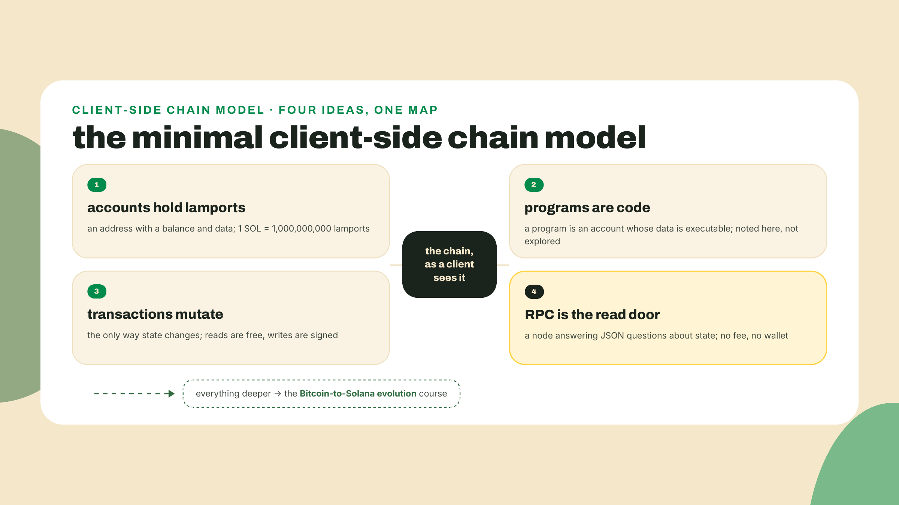
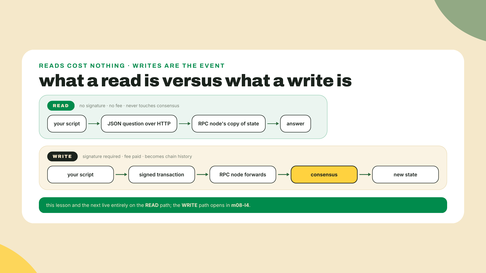
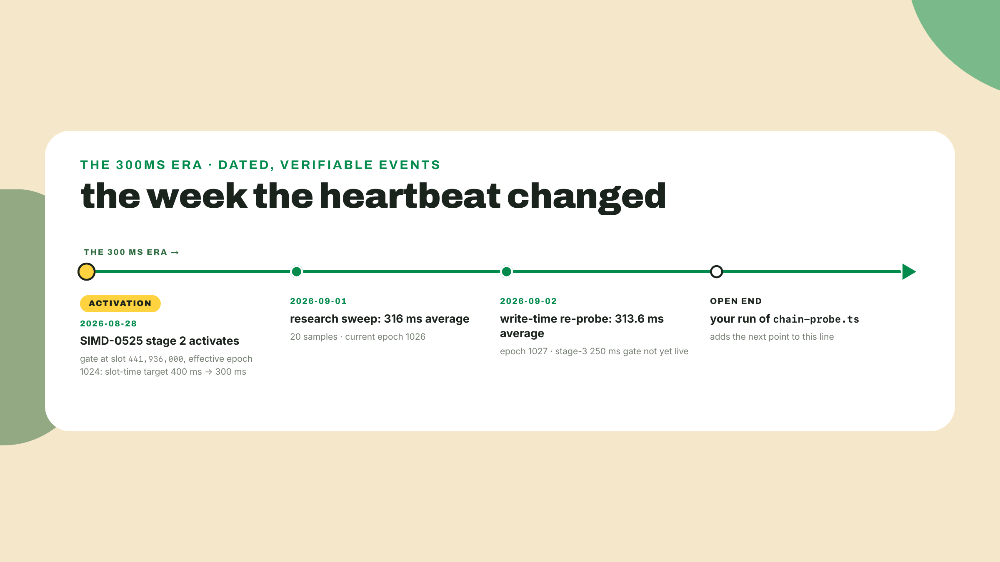
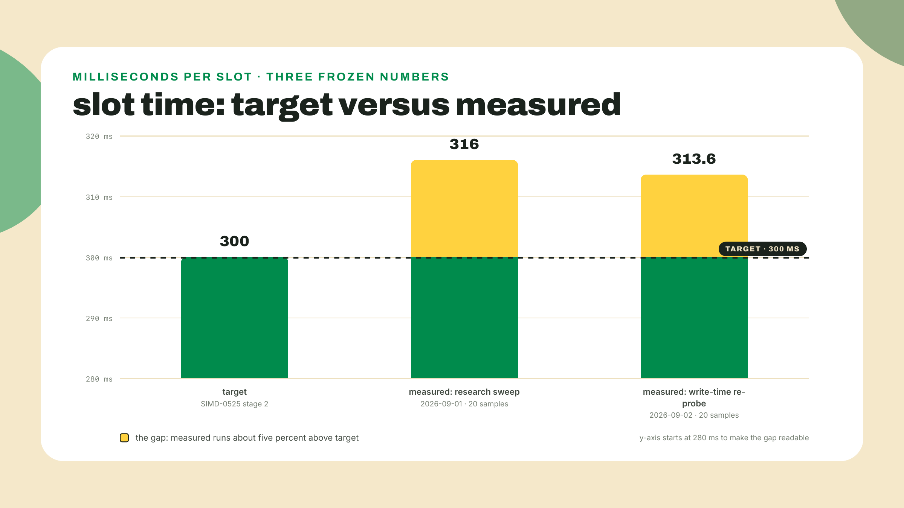
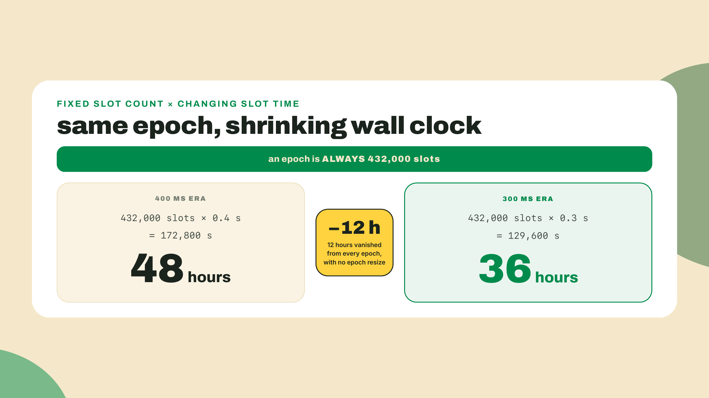
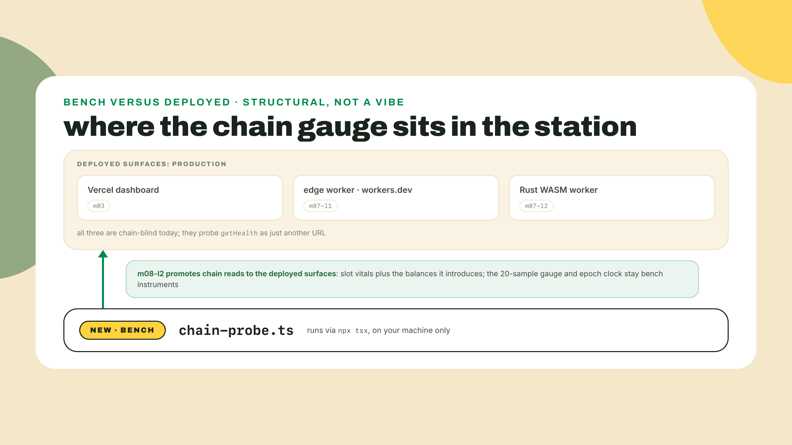
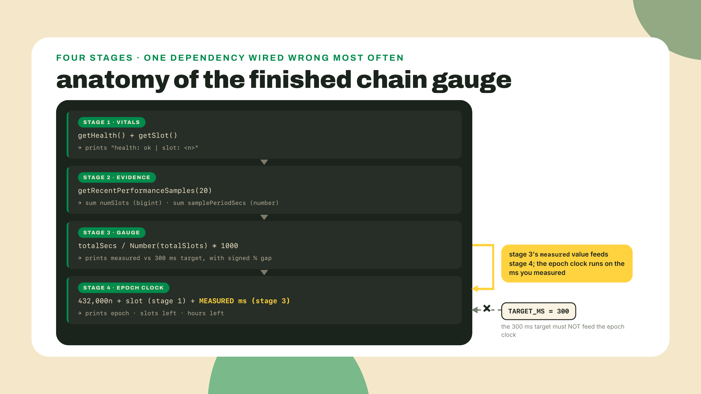
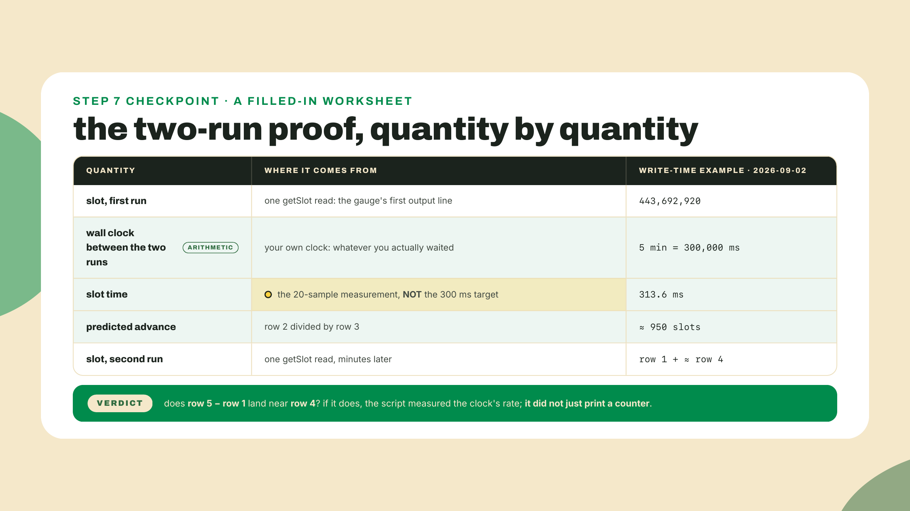

# A chain is a target: the minimal model + first reads

## Summary

M7 closed the edge tier: the Rust engine runs as WASM at a second workers.dev URL, and both edge workers already probe Solana's getHealth endpoint as one target among several. The structural ramp is done. Today the Solana tier opens, and it opens the way this course opened: by measuring something. You will build `chain-probe.ts`, a bench script that reads a live blockchain's vitals, measures its actual heartbeat over 20 samples, compares that against the network's published 300ms target, and derives a wall-clock epoch countdown from one fixed constant. Along the way you get the smallest useful model of what a chain even is to a client: four ideas, one sentence each, with everything deeper handed off by name. A word on how M8 runs: guided-but-learner-led. I work the RPC setup and one sample on screen; you write the 20-sample aggregation, the target-versus-measured line, and the epoch arithmetic yourself from stated contracts, and the min/max extension at the end is yours alone. You have shipped seven modules of probes. You do not need me hovering.

## Measure something first

Your station has been probing `https://api.mainnet.solana.com` since m07-l1 put it on the worker's target list, and so far the relationship has been transport-shallow: a POST that either answers promptly or, as m07-l1 documented, greets your isolate with a 403 and gets swapped for the publicnode fallback. Either way, nobody has asked it a real question yet. Paste this into your terminal right now:

```bash
curl -sS https://api.mainnet.solana.com -X POST \
  -H "Content-Type: application/json" \
  -d '{"jsonrpc":"2.0","id":1,"method":"getHealth"}'
```

```
{"jsonrpc":"2.0","result":"ok","id":1}
```

That is a blockchain answering a JSON question over plain HTTP. No wallet, no key, no fee, no account anywhere. The same POST-a-JSON-body shape you have been sending since the M2 HTTP lessons, pointed at a network that has processed over half a trillion transactions (its own getTransactionCount told me so while I wrote this), and it answers anyone who asks. Now do it from TypeScript, in the station repo. The station has been a pnpm workspace since m03-l1, so installs go through pnpm (the `-w` flag says "yes, I mean the workspace root", so every package in the workspace can resolve the install; a stray `npm i` here would scribble a competing package-lock.json into a pnpm repo):

```bash
pnpm add -w @solana/kit@^8
```

Freshness note: that resolves to 8.2.0 as of 2026-09-02, and the digit matters more than usual here. Kit shipped two majors inside just over nine weeks this summer (7.0.0 at the end of June, mere weeks after the 6.10.0 minor, then 8.0.0 by late August), which is exactly why this course's rule is to pin what your dependencies peer against and to re-check install lines the day you run them, not the day a tutorial was written.

The script itself goes where the station's bench scripts live: `packages/pulse-fleet/`, next to `probe.ts` and `fleet.ts`. That placement is load-bearing, not tidiness: pulse-fleet carries the `"type": "module"` field and the `tsx` runner these scripts need, and the workspace root has neither, so `npx tsx` run there dies on the top-level await ("Top-level await is currently not supported with the cjs output format"). Create `packages/pulse-fleet/first-read.ts`:

```typescript
// packages/pulse-fleet/first-read.ts
import { createSolanaRpc } from "@solana/kit";

const rpc = createSolanaRpc("https://api.mainnet.solana.com");

console.log(await rpc.getHealth().send());
console.log(await rpc.getSlot().send());
```

```bash
cd packages/pulse-fleet
npx tsx first-read.ts
```

```
ok
443692227n
```

Three working lines. The `n` suffix on that second number is kit handing you a `bigint`, because slot counts are u64 values and kit refuses to lie about that at the type level. File that away: today it is a nicety, next lesson, when the numbers are balances, it is the difference between correct and silently wrong. And that big number itself? That is the chain's heartbeat counter, and the rest of this lesson is about what it means and how fast it beats.

## The minimal model, derived

### What does a client actually need to know?

Here is the question that shapes this whole tier. Your station wants to display live Solana data. What is the minimum you must understand about a blockchain to do that honestly?

The maximal answer is a curriculum: consensus, validators, the account model as a system, program execution, cryptographic signatures, fee markets. Real topics, and this catalog teaches them, but not here. Requiring all of that before a first read is how tutorials lose people in week one, and worse, it is unnecessary: you just read live chain state with three lines and none of that knowledge.

The naive minimal answer fails too, though. "It's just an API" got you the getHealth probe in M7, but it collapses the moment you ask a second question. Why did that read cost nothing when everyone says blockchains have fees? Why does the docs page talk about accounts and slots and epochs? An API whose vocabulary you cannot parse is an API you will misuse. So the honest minimum sits between: you need exactly the ideas that make the read side of the API legible, and nothing a program author needs. There are four, and the selection rule is worth stating because it is the same 80/20 rule this course has applied to two languages already: an idea makes the list only if a question you will personally hit before the end of this module forces it. Not "important to blockchains." Forced, by your own code, this week.

**Accounts hold lamports.** An account is an address with a balance and some data. The balance is denominated in lamports, the smallest unit of SOL: 1 SOL is 1,000,000,000 lamports, an integer, no decimals at the ledger level (the M2 money-math lesson told you why). That is the noun of the system. One line in node proves the shape:

```typescript
const LAMPORTS_PER_SOL = 1_000_000_000n;
console.log(2n * LAMPORTS_PER_SOL); // 2000000000n: two SOL, as the ledger stores it
```

**Programs are code.** The logic that moves balances around lives in programs. A program is also an account, one whose data happens to be executable code. Noted, not explored: that one sentence is all the client side needs.

**Transactions mutate.** State changes exactly one way: a signed transaction. Reads are free questions; writes are signed, fee-paying events that go through consensus. That is the verb of the system, and this lesson contains zero of them.

**RPC is the read door.** An RPC node holds a copy of chain state and answers JSON questions about it, which is what you just did twice. No transaction, no fee, no wallet. The door you have been knocking on since M7.

That is the entire model, and the count survives pressure from both sides. Try to shrink it to three by dropping "programs are code" and the first explorer page you open stops parsing: half the accounts on it are marked executable and you have no slot in your head for what that means. Try to grow it to five, with PDAs, say, or token accounts, and you will find nothing in this module's code ever touches the fifth idea, which by the selection rule disqualifies it. Four is not a round number I liked; it is what the questions force.

Where do token balances actually live, why can addresses be derived, what exactly can a program do and not do, how does the chain's history work? All real questions, all deliberately outside these four sentences, and all owned by a named sibling: the Bitcoin-to-Solana evolution course in this catalog walks the account model as a system, program execution, PDAs, and chain history from first principles. This lesson teaches what a client needs. Pretending four sentences cover the rest is how tutorials produce confident confusion, so I will not, and the handoff has a name instead.



### Reads are questions, writes are events

Of the four ideas, the asymmetry between reading and writing is the one that shapes this entire module, so it earns a second look before we start measuring.

When your probe called getSlot, no validator recorded that it happened. Nothing was signed, nothing was paid for, nothing touched consensus. An RPC node looked at its copy of state and answered, the way any web server answers a GET. That is why the public endpoint can be free and open: answering questions is cheap. Fees exist to pay for the expensive thing, which is mutating replicated state that thousands of machines must agree on. A write is a signed transaction that competes for inclusion in a block; a read never becomes a transaction at all.

The practical consequence for the station: three lessons of this module are free reads from two languages, and then one carefully earned write. Devnet, the practice cluster where that write will happen, is this module's one new platform, and it arrives in m08-l4 with a keypair and a faucet (a file-based signer, deliberately not a wallet; m08-l4 makes that distinction sharp). Today and next lesson stay on the read side of the door, on mainnet, where the worst you can do is ask too many questions too fast. Which, as you will see shortly, the endpoint has opinions about.



### The heartbeat sped up the week this course was researched

Now the vocabulary for what getSlot actually returned. A slot is the network's scheduling unit, its heartbeat: every slot, one validator has the right to produce a block. Slot and block are not synonyms, the slot is the tick of the clock and the block is what lands in it, but for a client's purposes the slot counter is the clock, and it only goes up. An epoch is 432,000 slots, a fixed constant of the network, and clusters is the word for the networks themselves: mainnet, where value lives, plus devnet and testnet for practice and staging.

How fast is the heartbeat? This is where the lesson gets a date on it. On 2026-08-28, four days before this course's research sweep, SIMD-0525 stage 2 activated on mainnet and took the slot-time target from 400ms down to 300ms. That is a quarter off the interval, which is a third more slots per second: the chain you are probing sped up the week this material was written. A fundamentals course launching now teaches a chain whose heartbeat changed last week, which tells you something about why every number in this course carries a date.

One footgun in how that fact gets cited, because it will bite anyone who checks sources. The SIMD-0525 document's own frontmatter still said Draft while the change was live on mainnet. The proof is not the spec, it is the chain, and the two numbers the challenge will poke at deserve lines of their own:

- The stage-2 feature gate records an activation slot of **441,936,000**. Divide by 432,000 and you get exactly 1023, no remainder: that slot is the opening tick of epoch 1023.
- The behavior switched on at the start of epoch **1024**, one boundary later, because that is how Solana feature gates work: activation lands during one epoch, the switch flips at the next boundary. Keep that one-epoch lag in your head.

Anyone can decode the gate account from public RPC; I re-checked while writing this on 2026-09-02, still there, still active, one getAccountInfo call. Cite the on-chain gate, never a spec's status line. There is also a stage 3 targeting 250ms; as of this writing its gate was not live, and the measurement you are about to take will confirm the chain still runs at stage-2 pace. If stage 3 lands after this lesson ships, your gauge gets more interesting, not wrong. That is the point of building a gauge instead of memorizing a number.



### Targets versus measurements

So the network says 300ms. Is that what it does?

The research sweep asked, the honest way: getRecentPerformanceSamples, an RPC method that returns the node's own recorded slot timings in 60-second windows. Twenty samples, averaged, on 2026-09-01: 316ms. Not 300. About five percent above target, and that gap is not a scandal, it is what live systems look like. A target is an engineering intention; a measurement is what happened, network weather included. My own re-run while writing this lesson came back 313.6ms. Same story, different day.

The sharp objection first, because you should be raising it: is that 16ms gap real, or is it your own HTTP round trip leaking into the numbers? It is real, and the reason is worth owning before the lab. getRecentPerformanceSamples does not time anything on your side of the wire; it returns the node's own recorded history, how many slots actually happened in each 60-second window it already logged. Your connection latency decides when you receive those records, not the values inside them. A measurement scheme where your latency did pollute the result exists, and you will build it in the lab as a deliberate throwaway, precisely so you feel the difference between timing something yourself and asking a system for its logs.

If this feels familiar, it should. It is the oldest lesson in this course wearing chain clothes: M1 had you measure your own latency instead of trusting a number in a README, and M2 taught you that claimed and measured are different columns. Now the system under test is a blockchain, and the discipline transfers unchanged. Your own dashboard makes uptime claims; the honest version of your station publishes what it measures, not what it hopes. The harsh reality is: every system you will ever operate has a gap between its target and its behavior, and the teams that know the size of their gap are the ones you can trust.

For a station that has spent seven modules learning to measure other people's endpoints, a target that ships with its own public measurement API feels like being handed the answer sheet. Most infrastructure makes you guess. This chain hands you getRecentPerformanceSamples and dares you to check.



### The epoch clock falls out of the arithmetic

Here is the part I find quietly delightful. Epochs are defined in slots, not in time: 432,000 slots, always, before the speedup and after it. Which means wall-clock epoch length is a derived quantity, and when slot time moved, every epoch on the calendar silently shrank.

Do the arithmetic once by hand, because the lab makes your script do it forever after. At the old 400ms target: 432,000 slots times 0.4 seconds is 172,800 seconds, which is 48 hours. At 300ms: 432,000 times 0.3 is 129,600 seconds, 36 hours. Nobody resized epochs, nobody announced a calendar change, and yet everything keyed to epoch boundaries, staking cycles, validator schedules, now turns over half a day sooner. One fixed constant, one measured variable, and the wall-clock answer falls out of a multiplication. Your gauge will compute the remaining hours of the current epoch from the slot time it just measured, which means your epoch clock stays correct even if stage 3 lands and shrinks epochs again to 36 times five sixths, the 250ms target over the 300ms one, which you can now work out yourself.



### The read door is free, capped, and honest about it

Last piece of the model before we build: the door itself. The URL this course prints is `https://api.mainnet.solana.com`, the current form in Solana's own cluster docs. Older tutorials, and plenty of them, use `api.mainnet-beta.solana.com`; that legacy alias still answers, so recognize it when you see it, but write the current form. From here on, this course writes only the current name.

The public endpoint is free, and it is honest about what free means. The documented caps:

| Cap | Limit |
| --- | --- |
| Requests per IP | 100 per 10 seconds |
| Requests per IP, single method | 40 per 10 seconds |
| Concurrent connections per IP | 40 |
| Data per IP | 100 MB per 30 seconds |

The docs then say the quiet part in plain words: these endpoints are "not intended for production applications." Free, open, rate-capped, explicitly a bench tool. Which is precisely the trade-off you are accepting today, and I want it named rather than discovered. Run the budget arithmetic the m02-l3 way: one execution of the gauge you are about to build spends three requests, so the per-IP cap would tolerate the entire lab, the challenge, and thirty paranoid re-runs inside a single ten-second window. A deployed dashboard with fifty visitors, each browser refreshing a live panel, blows through 100 requests per 10 seconds before you finish reading this sentence. Same endpoint, same caps, opposite verdicts. That mismatch is next lesson's opening problem, not a footnote. Meanwhile the bench discipline: sample with a delay, never hammer getSlot in a tight loop, and treat 429s as the endpoint telling you the truth about what it is for.

**Go deeper (the 20%).** the canonical reference for clusters and their public endpoints, including every rate limit above, devnet and testnet URLs, and explorer links, is Solana's own clusters page: https://solana.com/docs/references/clusters (verified live 2026-09-02). Bookmark it; this lesson deliberately taught only the mainnet read path, and that page owns the rest.

## Lab: solana-probes-v0, the chain gauge

The artifact this tier starts building is `solana-probes-v0`, and its first piece is `chain-probe.ts`: a standalone bench script in `packages/pulse-fleet` that prints the chain's vitals, its measured heartbeat, and the epoch countdown. Deliberately v0, deliberately a bench prototype. Next lesson productionizes these reads into the deployed dashboard and the edge worker; today's job is getting the measurement right on your own machine first, the same bench-then-deploy rhythm the station has followed since M3.

The fade, stated plainly: steps 1 through 3 are worked, I show the code. Steps 4 and 5 hand you a contract and you write the code. If you want the honest version of this lesson, do not scroll ahead to check yourself until your version runs.



**1. Scaffold the file.** In the station repo, create `packages/pulse-fleet/chain-probe.ts` next to `first-read.ts` and the other bench scripts, and run everything in this lab from that directory, for the module-and-tsx reason the opener named. You already installed `@solana/kit@^8` at the root in the opener; the only other tool is `tsx`, which has been in pulse-fleet's dev dependencies since the bench scripts moved into the workspace (if you are somehow in a fresh folder outside the station: `npm i -D tsx`, and give its package.json `"type": "module"`). Start with the vitals you already know how to read:

```typescript
import { createSolanaRpc } from "@solana/kit";

const SLOTS_PER_EPOCH = 432_000n;
const TARGET_SLOT_MS = 300;

const rpc = createSolanaRpc("https://api.mainnet.solana.com");

const health = await rpc.getHealth().send();
const slot = await rpc.getSlot().send();
console.log(`health: ${health} | slot: ${slot}`);
```

The two constants at the top are the lesson's two anchors: the fixed epoch length as a `bigint` (it will divide the `bigint` slot number, and mixed bigint-number arithmetic is a TypeScript compile error, which is the type system doing you a favor), and the target as a plain number, because milliseconds math stays comfortably in `number` range.

**2. Take one naive sample.** Before reaching for the proper instrument, measure the heartbeat the way you would measure anything: two readings and a clock. This is the worked sample loop, and it is also a rate-cap-respecting one, two calls ten seconds apart, not a hot loop:

```typescript
// packages/pulse-fleet/naive.ts - a throwaway, not part of the gauge
import { createSolanaRpc } from "@solana/kit";

const rpc = createSolanaRpc("https://api.mainnet.solana.com");

const before = await rpc.getSlot().send();
await new Promise((r) => setTimeout(r, 10_000));
const after = await rpc.getSlot().send();

const slotMs = 10_000 / Number(after - before);
console.log(`${after - before} slots in 10s -> ~${slotMs.toFixed(0)}ms per slot`);
```

My run: `34 slots in 10s -> ~294ms per slot`. Close to target, and noisy, because ten seconds is a tiny window and your own request latency smears both endpoints of it. It proves the concept and shows the weakness in one throwaway file. To do better you would sample for minutes, and it turns out you do not have to, because the node has been sampling for you.

**3. Fetch the real samples.** `getRecentPerformanceSamples` returns the node's own recorded performance windows, each one 60 seconds of chain time with the number of slots that actually happened in it. Twenty samples is twenty minutes of measured history in a single request, no loop, no rate-cap anxiety, and no request-latency smear, because the timings inside the samples are the node's records, not your round trips. Add to `chain-probe.ts`:

```typescript
const samples = await rpc.getRecentPerformanceSamples(20).send();
console.log(samples[0]);
```

Run `npx tsx chain-probe.ts` once to see the shape of one sample. The fields you need: `numSlots` (a `bigint`, slots produced in the window) and `samplePeriodSecs` (a `number`, the window length). Delete the `console.log(samples[0])` line once you have looked; the gauge prints conclusions, not raw material.

**4. Write the aggregation and the gauge line (you).** The contract your code must satisfy:

- Sum `numSlots` and `samplePeriodSecs` across all 20 samples, then compute average milliseconds per slot as total seconds over total slots, times 1000. Sum first, then divide once: averaging the per-sample averages would weight a short window equally with a long one.
- `numSlots` is a `bigint`; convert with `Number()` at the division. Slot counts per window are a few hundred, nowhere near precision loss, and say so in a comment so future-you does not panic.
- Print one gauge line: measured average to one decimal, the 300ms target, the percentage gap with a sign, and the sample count. Mine reads: `slot time: 313.6ms measured vs 300ms target (+4.5%) over 20 samples`.

**5. Write the epoch clock (you).** Second contract, and it is the arithmetic from the theory section made executable:

- Current epoch: the slot number divided by `SLOTS_PER_EPOCH`, in `bigint` arithmetic, which floors for free.
- Slots remaining: the epoch length minus the slot's position within the epoch, via the `%` operator, which `bigint` also supports.
- Hours remaining: slots remaining times your measured milliseconds, divided by 3,600,000. Use the measured value, not the target; the clock should tell the truth your gauge just established.
- Print it as one line with the epoch number, slots remaining, and hours to one decimal.

Before you run the finished script, check its shape against the map below. Not the code, the structure: four stages, three printed lines, and a strict rule about which number feeds which. If your version computes the epoch clock from the 300ms target instead of the measured average, it compiles, runs, and quietly tells a worse truth.



**6. Run it.** Full output from my write-time run, 2026-09-02:

```
health: ok | slot: 443692920
slot time: 313.6ms measured vs 300ms target (+4.5%) over 20 samples
epoch 1027: 403080 slots / ~35.1h remaining
```

Your slot and epoch numbers will be higher, your measured average should land roughly in the 300-330ms band as of research time, and the gap line should show a small positive percentage. Anything wildly outside that band, check the sum-then-divide order first; it is where most versions of this script go wrong.

**7. Prove it is a clock.** The checkpoint that separates a gauge from a lucky print: run it again a few minutes later. The slot number should have advanced by roughly your elapsed time divided by your measured slot time. Five minutes is 300,000ms, which at ~314ms per slot is about 950 slots. If your two runs bracket that arithmetic, your script is not just reading a counter, it has measured the counter's rate, and you now know a blockchain's clock speed the same way you knew your API's latency in M1: because you measured it yourself.



One more thing before you call it done: this script's three output lines are its interface, so keep them clean, labeled, and one-line-per-fact. Be precise about what gets promoted, though, so next lesson cannot disappoint you: m08-l2 lifts the vitals-class reads (the slot, plus the balance reads it introduces) onto the deployed surfaces, while the 20-sample gauge and the epoch clock stay bench instruments on purpose, too request-hungry for a per-visitor panel living under the public caps. The gauge keeps paying rent right here, every time you re-run it to check the chain's pace against a claim, which is a thing you will now do for years. v0 is a prototype, not an excuse.

## Challenge

Two rungs, no guidance. First, extend the gauge: report the minimum and maximum slot time across the 20-sample window alongside the average, and flag any individual sample that ran slower than twice the target. That is the M1 latency-stats thinking, spread and outliers, pointed at chain data; my window today spanned 309.3ms to 326.1ms with nothing flagged, and a flagged sample on a quiet day is worth being suspicious of (start with your own arithmetic before blaming the chain).

Second, the graded `epoch-clock` challenge in the platform hands you an `epochClock(slot, slotMs)` function with three planted bugs: it rounds the epoch instead of flooring, reports slots elapsed instead of remaining, and fumbles the milliseconds-to-hours conversion. All three are bugs your lab code just avoided; the fix is transferring what you did in step 5 into someone else's broken draft. The acceptance anchor is worth internalizing before you start: at slot 441,936,000 with 300ms slots it must report epoch 1023 with a full 432,000-slot, 36.0-hour epoch remaining, because 441,936,000 divided by 432,000 is exactly 1023 and a boundary slot belongs to the epoch it opens. If you can explain that, the floor bug is already solved in your head. (And yes, this is the theory section's gate slot on purpose: the slot SITS in epoch 1023, while the feature it activated switched on at epoch 1024, the one-epoch lag from the timeline. Your `epochClock` answers where a slot is, not when a feature takes effect.)

## Checkpoint

What you can now do, concretely: explain a blockchain to another developer in four sentences without hand-waving, and name where the deeper story lives; read live chain state from TypeScript with kit against the public mainnet RPC; measure a network's real slot time and state the gap from its target with a number; and turn a raw slot count into a wall-clock epoch countdown from one fixed constant. Your `chain-probe.ts` runs, and its second run proved its own arithmetic.

The 30-second retrieval, out loud before you close the tab: which of the four ideas explains why today cost you nothing? (RPC is the read door; reads never become transactions.) And why did epochs get shorter in August when nobody changed the epoch? (Epochs are 432,000 slots, fixed; slot time is the variable, so wall-clock length moved with it.)

One ask while it is fresh: this is the course's first lesson where the system under test is a chain rather than something you deployed, and I want to know if the four-idea model held up or if a fifth question kept nagging you during the lab. Tell me which. If the model needs a fifth sentence, that is exactly the feedback that reshapes this tier.

You can measure the chain's heartbeat from a bench script. But look at what is deployed: the Vercel dashboard, the edge workers, every surface with a URL is still chain-blind, probing getHealth like it is any other endpoint. Next lesson the reads go to production, a live Solana panel on every deployed surface, and the discipline you built for flaky HTTP in M2 turns out to be exactly what a rate-capped public RPC demands. Bring your gauge.
