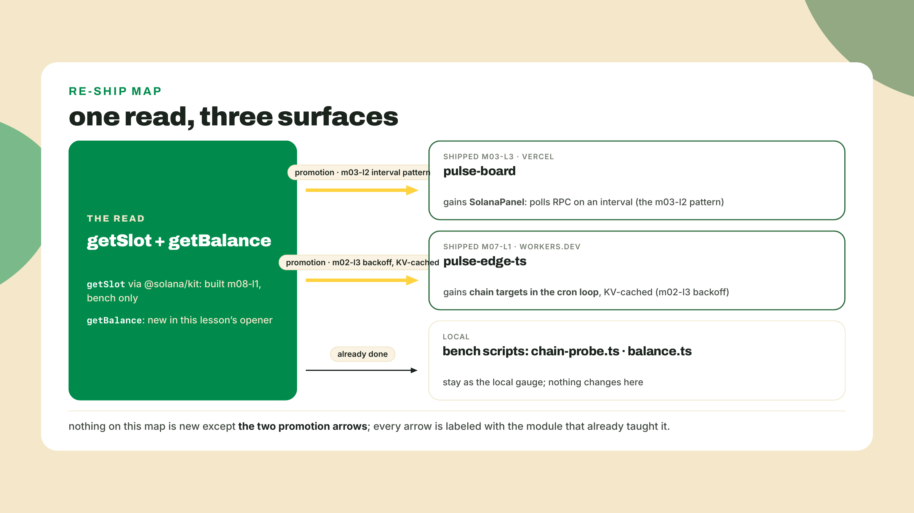
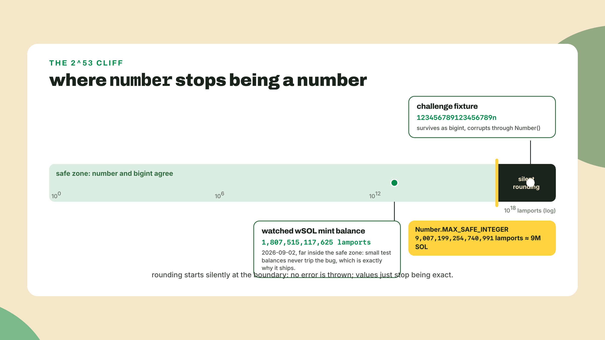
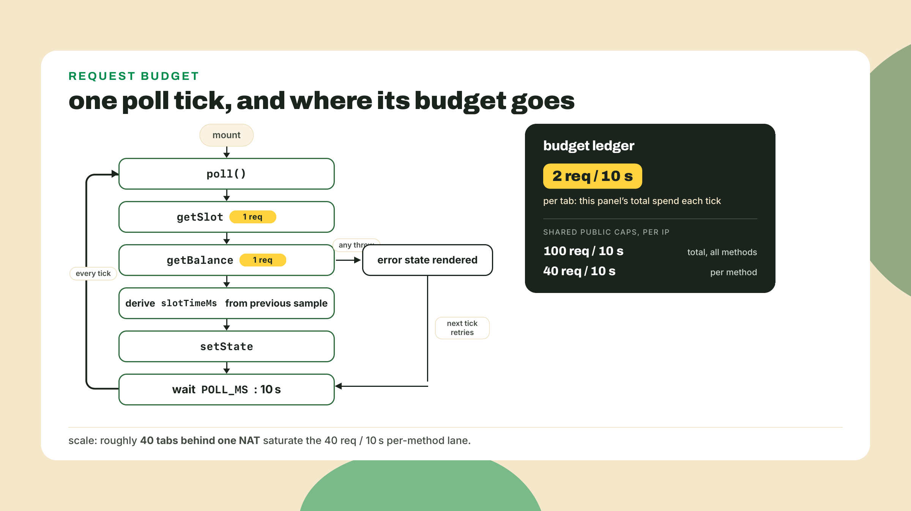
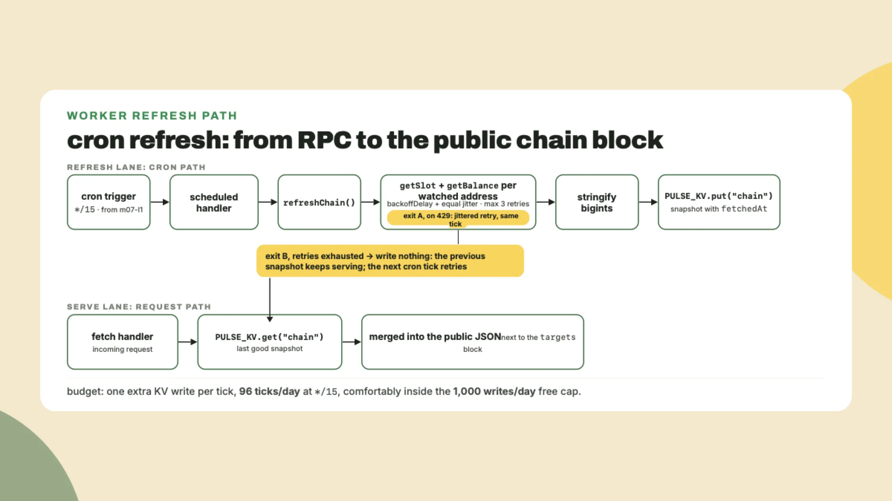
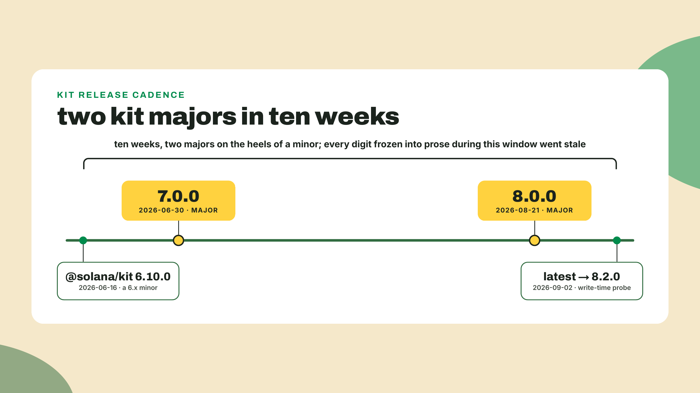
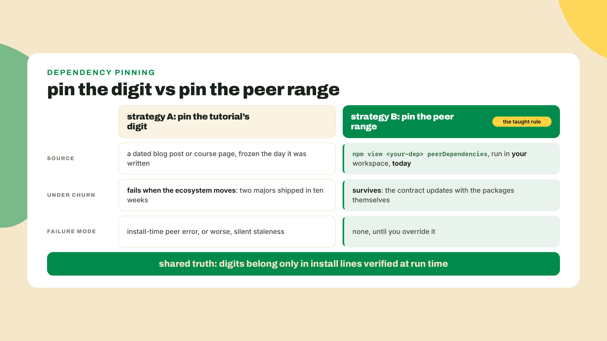
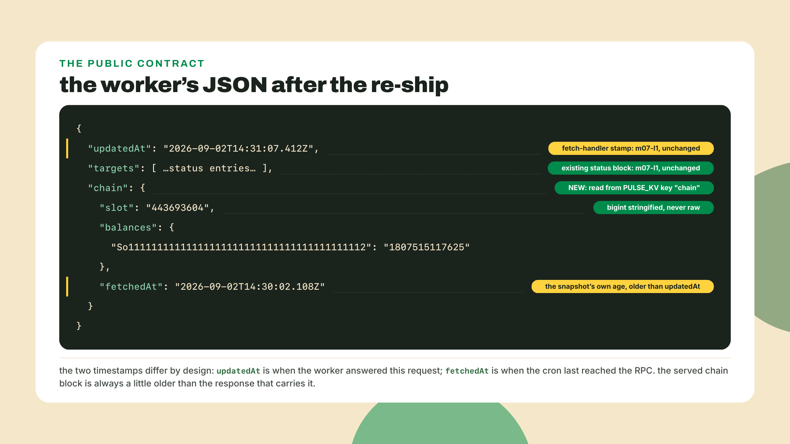

# Reads in production: the Solana panel

## Summary

Last lesson you built the bench gauge: `chain-probe.ts` measures slot time against the 300ms target, derives the epoch countdown from the fixed 432,000-slot epoch, and gave you the four-idea client model, with everything deeper handed to the btc-to-sol course by name. It works. It also runs on exactly one machine, yours, in a terminal nobody else will ever see. A gauge nobody can see is a gauge that does not exist.

Today is the course's biggest re-ship, and I want to say the quiet part first: nothing in this lesson is new except the target. The read is one line you already understand. The polling is m03-l2's. The cache is m07-l1's KV. The backoff is m02-l3's. What changes is where it all runs: the same chain read, promoted to every deployed surface the station owns. By the end, the Vercel dashboard renders a live Solana panel and the worker's public JSON carries a cached chain snapshot, both on the URLs you already shipped.

Prove the read first. In the station repo, where `@solana/kit@^8` has been installed since last lesson, drop this into `packages/pulse-fleet/balance.ts` next to `chain-probe.ts` and run it from that directory (the bench-script home from last lesson, with the `"type": "module"` and tsx the scripts need):

```ts
import { createSolanaRpc, address } from "@solana/kit";

const rpc = createSolanaRpc("https://api.mainnet.solana.com");
const watched = address("So11111111111111111111111111111111111111112");

const { value: lamports } = await rpc.getBalance(watched).send();
console.log(lamports);
```

```bash
npx tsx balance.ts
# 1807515117625n
```

That address is the wrapped-SOL mint, a busy mainnet account that will still exist next year; the number you get will differ from my 2026-09-02 run. Note the `n`. That balance is a `bigint`, it is in lamports, and the reason kit refuses to hand you a plain number is the first thing production teaches today.

How this lesson runs, out loud: the canonical read and the panel skeleton are worked on screen once; the polling wiring, the KV cache key, and the backoff budget are yours to compose from patterns you already own; the second-watched-address extension at the end is fully solo. That is the M8 fade and it does not reverse.

## The same read, every surface

### A chain read is just another probe

Here is the collapse that makes this lesson small: a chain read is just another probe. It is an HTTP POST to a rate-capped endpoint that usually answers fast, sometimes answers slow, and occasionally refuses you. Which means every production question it raises was answered weeks ago, in module two, before this course had said the word Solana. How often may I call it? Budget. What if it fails? Backoff, then degrade to last known status. Who pays when fifty browsers ask at once? Everyone behind the shared cap, together. The only genuinely new material today is one datatype and one discipline, and both fit in a section each.



The station's shape after today, concretely: `pulse-board` (Vercel) polls the chain directly and renders slot, measured slot time, and one watched balance. `pulse-edge-ts` (Cloudflare) folds slot and balance reads into its existing 15-minute cron, writes the result to KV under a `chain` key, and serves it in the public JSON next to the `targets` block it already publishes. Two deploys, zero new platforms, and the acceptance test is two browser tabs showing the same slot within one refresh of each other.

### The number that lies politely

JavaScript has one number type, a 64-bit float, and it is exact for integers only up to `Number.MAX_SAFE_INTEGER`: 2^53 minus 1, which is 9,007,199,254,740,991. In lamports, that is about 9 million SOL. Above that line, `number` arithmetic does not throw, does not warn, does not even wobble visibly. It rounds. `9007199254740993` becomes `9007199254740992` and the console prints it with total confidence. For a view counter, who cares. For a balance display, that is the polite lie that ships a wrong number to someone's screen.

Real mainnet accounts sit above that line, exchange wallets and stake pools among them, which is why kit types every u64 as `bigint` and never as `number`. This is not a performance choice; bigint parsing is, if anything, slower. It is a correctness door policy: no balance can be silently corrupted on the way into your program. The corruption opportunity moves to your side of the door, and it has exactly one shape: the moment you route a lamports value through `Number` so you can do float math on it, you have reintroduced the bug kit exists to prevent.



So the panel's formatting contract is BigInt math all the way to the string. Division gives whole SOL, remainder gives the fraction, and the display convention is fixed: nine fractional digits, left-padded, trailing zeros trimmed, no decimal point on whole values.

```ts
export function lamportsToSol(lamports: bigint): string {
  const whole = lamports / 1_000_000_000n;
  const frac = lamports % 1_000_000_000n;
  if (frac === 0n) return whole.toString();
  const digits = frac.toString().padStart(9, "0").replace(/0+$/, "");
  return `${whole}.${digits}`;
}
```

The `padStart` is load-bearing and it is where this function is usually written wrong: a remainder of `2_500_000n` is not ".25", it is nine digits worth of fraction with two leading zeros, ".0025". My run of this exact function against today's mainnet balance: `1807515117625n` in, `"1807.515117625"` out, and `123456789123456789n` round-trips to `"123456789.123456789"` without losing a digit. That last value is above 2^53 on purpose; it is the fixture the coding challenge will beat your version with. One adjacent footgun while we are here, because it bites in the worker section: `JSON.stringify` throws a `TypeError` on bigint. Anywhere a lamports value crosses into JSON, you convert to string explicitly first. The panel never JSONs its bigints, but the KV snapshot must.

### The panel: the dashboard learns to tell the time

The dashboard already knows how to poll: m03-l2 built the `useEffect` interval with cleanup and a cancelled flag, and that skeleton transfers whole. What changes is the data source (the RPC, through kit, instead of a raw status file) and one derived metric: measured slot time. Two consecutive `getSlot` samples give you a slot delta and a wall-clock delta; divide and you have the chain's heartbeat as your panel observes it, sitting next to the 300ms target. And yes, this is the naive two-sample method last lesson built as a throwaway, revived on purpose, so say the trade out loud instead of letting it look like amnesia: the bench gauge wanted twenty minutes of the node's own recorded history to JUDGE the chain, and your round-trip smear would have polluted that verdict; the panel wants a rough live heartbeat at a ten-second refresh for zero extra requests, and `getRecentPerformanceSamples` per tick would spend a third request per tab against the shared caps to buy precision a status panel does not need. The smear rides along in each panel reading, a few milliseconds of noise at these windows, and the label's job is to present the number as the observation it is, not as last lesson's measurement. The slot arithmetic happens in bigint, and only the final small delta crosses to `number` for the division, which is the correct direction to cross: a delta of a few dozen slots is nowhere near the cliff.

Install kit where the panel lives (from `packages/pulse-board`):

```bash
pnpm add @solana/kit
# resolved to 8.2.0 on 2026-09-02; the digit rule below explains why yours may differ
```

The worked skeleton, `src/SolanaPanel.tsx`; it compiles clean under strict mode against the kit that install line just resolved, because I checked before pasting it here:

```tsx
import { useEffect, useState } from "react";
import { createSolanaRpc, address } from "@solana/kit";
import { lamportsToSol } from "./lamports";

const RPC_URL = "https://api.mainnet.solana.com";
const WATCHED = address("So11111111111111111111111111111111111111112");
const POLL_MS = 10_000;
const TARGET_SLOT_MS = 300;

type PanelState =
  | { phase: "loading" }
  | { phase: "error"; message: string }
  | { phase: "ready"; slot: bigint; slotTimeMs: number | null; lamports: bigint };

const rpc = createSolanaRpc(RPC_URL);

export function SolanaPanel() {
  const [state, setState] = useState<PanelState>({ phase: "loading" });

  useEffect(() => {
    let cancelled = false;
    let last: { slot: bigint; at: number } | null = null;

    async function poll() {
      try {
        const slot = await rpc.getSlot().send();
        const { value: lamports } = await rpc.getBalance(WATCHED).send();
        const now = Date.now();
        let slotTimeMs: number | null = null;
        if (last && slot > last.slot) {
          slotTimeMs = (now - last.at) / Number(slot - last.slot);
        }
        last = { slot, at: now };
        if (!cancelled) setState({ phase: "ready", slot, slotTimeMs, lamports });
      } catch (err) {
        if (!cancelled) setState({ phase: "error", message: String(err) });
      }
    }

    poll();
    const id = setInterval(poll, POLL_MS);
    return () => {
      cancelled = true;
      clearInterval(id);
    };
  }, []);

  if (state.phase === "loading") return <p>reading the chain...</p>;
  if (state.phase === "error") return <p>chain read failed: {state.message}</p>;

  return (
    <section>
      <h2>Solana</h2>
      <p>slot {state.slot.toString()}</p>
      <p>
        slot time{" "}
        {state.slotTimeMs === null
          ? "measuring..."
          : `${state.slotTimeMs.toFixed(0)}ms (target ${TARGET_SLOT_MS}ms)`}
      </p>
      <p>watched balance {lamportsToSol(state.lamports)} SOL</p>
    </section>
  );
}
```

Every structural beat is the m03-l2 board: the discriminated `PanelState`, the cancelled flag, the cleanup that keeps hot reload at exactly one live poller. The first tick shows "measuring..." for slot time because a rate needs two samples; that is honesty, not a bug.

Now the budget, because this component spends a shared resource on every tick. The public RPC caps are 100 requests per 10 seconds per IP, and 40 per method in the same window. This panel makes 2 requests per tick, and at `POLL_MS` of ten seconds that is 2 requests per 10 seconds per open tab, 1 per method. Fine for you, fine for the handful of people you send the URL to. But run the arithmetic the m02-l3 way before trusting it: the per-method lane fills at around 40 tabs polling on the same cadence behind one NAT, an office, a venue, a dorm. Past that, every visitor behind that IP starts eating 429s, and your panel shows errors caused by its own popularity. Last lesson called this mismatch the deployed-dashboard problem and promised it; the worker section is the answer, and the honest status of THIS panel is: direct reads are correct at your traffic, and the moment they are not, the cached snapshot you are about to build is where the panel points instead. That rewiring is deliberately left for the capstone, which polls the worker's public JSON from the dashboard as its one new edge.



### The worker: cache the chain, serve the cache

The worker's relationship to the chain is different in kind, and it comes from m07-l1's architecture rather than from anything Solana-specific. The dashboard polls while a human watches it. The worker runs on a cron with nobody watching, writes what it learned to KV, and serves the last known truth to anyone who asks, from memory of the world rather than a fresh look at it. Chain data slots into that model without a single structural change: one more refresh in the scheduled handler, one more key in KV, one more block in the public JSON.

The snapshot contract, and the one place bigint discipline meets JSON:

```ts
export interface ChainSnapshot {
  slot: string;      // bigint, stringified: JSON.stringify throws on raw bigint
  balances: Record<string, string>;  // address -> lamports as string, same reason
  fetchedAt: string; // ISO timestamp: the snapshot's honesty field
}
```

`fetchedAt` is not decoration. A cache that hides its age is a dashboard that lies; the JSON consumer decides what stale means, and it can only decide if you stamp it. The refresh itself is the m02-l3 kata wearing chain clothes: wrap each read in backoff (equal jitter, the `backoffDelay` you extracted into pulse-core in m03-l1), and on final failure write nothing, so the previous snapshot keeps serving while the next cron tick retries. Degrade to stale, never to blank. For a status surface that property is the whole game, and you built it in module two without knowing this lesson was coming.



This architecture assumes kit runs inside workerd at all, an assumption worth distrusting: the worker is not node, and half the npm registry finds that out the hard way. I ran the smoke test while writing this: a hello-world worker, `npm i @solana/kit`, `createSolanaRpc(...).getSlot().send()` in the fetch handler, `wrangler dev`. Kit loaded, resolved, and executed cleanly inside the isolate. The package ships an explicit `workerd` export condition, and the runtime provides the Web Crypto kit wants, so this is supported territory, not luck. My probe's actual response was still an error, and it is worth reading: HTTP 403, "Your IP or provider is blocked from this endpoint." The same 403 came back for a plain `fetch` POST from the same isolate, so it was not kit, it was the public endpoint's blocklist disliking my probe environment's egress. Two lessons in one error body. First, transport is not your risk; the shared endpoint's policy is, and a blocked provider is one more failure mode your degrade path already absorbs. Second, this is precisely why the snapshot architecture wins: when a read path gets refused, the worker's public JSON keeps serving the last truth it learned instead of forwarding the refusal to every visitor.

Two practicalities before the lab wires it. Kit's workerd build resolves to its node build, so your `wrangler.jsonc` compatibility date matters: dates of 2026-08-04 or later enable node compatibility by default, and the m07-l1 scaffold is newer than that, so you are covered; an older date needs the `nodejs_compat` flag added by hand. And the escape hatch, stated because a promise beats a mystery: if kit-in-the-worker ever fights you, the fallback is a one-table edit, not a rewrite. Your worker already speaks raw JSON-RPC to this exact endpoint, since m07-l1's `getHealth` probe is a plain fetch POST. `getSlot` and `getBalance` are two more method strings in that same style, and the architecture (cron, KV, backoff, degrade) does not change by one line. The reason kit is the taught path anyway is the datatype: kit hands you lamports as bigint, while `JSON.parse` on a raw RPC response hands you a `number` that has already rounded anything above the cliff before your code ever sees it.

### Pin the rule, not the digit

You may have noticed this lesson has not told you which kit version to install, only shown what `pnpm add` resolved to on my machine on a stated date. That is deliberate, and it is the m03-l1 peers lesson arriving at its payoff. Between 2026-06-16 and 2026-08-21, kit shipped three releases in just over nine weeks, two of them majors: the 6.10.0 minor, then 7.0.0, then 8.0.0, per npm's own timestamps. Any tutorial that froze a digit in prose during that stretch rotted before its author's next coffee, twice over, and this course refuses to join them. The install line you run is verified the day you run it; prose digits are not.



So the pin comes down to a rule: read what your workspace's own dependencies peer against, and pin to that. The generated-client packages under `@solana-program/*` declare, in their `peerDependencies`, exactly which kit majors they were built against, and npm enforces that contract at install time. The reading takes one command. Here is the live output from my write-time probe:

```bash
npm view @solana-program/system version peerDependencies
# version = '0.14.1'
# peerDependencies = { '@solana/kit': '^8.0.0' }
```

Today, that output names the major my install lines resolved to. The day you run it, it may name the next one, and then THAT is your answer, whatever any tutorial or this very page says. The rule cuts both ways, which is what makes it a rule instead of advice: pin below the peer range and the install fails loudly; force past a peer error with an override flag and you ship a version mismatch that fails at runtime instead, which is strictly worse, because the package manager was reading the contract for you and you told it to stop. Your station has no `@solana-program/*` packages yet, reads need none, so today the honest pin is simply what `pnpm add @solana/kit` resolves. The rule is in your hands for the day a generated client enters the tree, and the deeper habit generalizes past Solana entirely: the durable fact in any fast ecosystem is never the digit, it is where the digit is authoritatively written down. Go on in this catalog and you will meet the same rule taught twice more, on purpose: the payments course teaches it as a per-workspace seam, two workspaces in one repo pinned to different kit majors because their dependencies peer differently, and the Anchor V2 course's m08 drills it against a generated client's declared peer range. Three courses, one rule, from three directions, because it is the single habit that survives this ecosystem's release pace.



### Where kit is heading, and when free stops being enough

One box about the future, so the docs do not ambush you. The kit site's upgrade guide now leads with a plugin-style API: `createClient()` with `.use(...)` composition. It is kit's own work, it is where the library is heading, and the panel does not use it. The plugin packages backing it sat at 0.19.0 on my write-time probe, and you spent a whole lesson on what pre-1.0 means: minors carry breaking-change rights. The pipe-and-RPC style this lesson teaches is the documented stable path, the dialect the kit ecosystem's own examples and generated clients speak today, so everything you wired here is foundation, not a dead end. When the plugins cross 1.0, re-run this calculus; docs-page ordering is marketing, package versions are evidence.

And the cost ledger for what you built, because every architecture is a bill. The snapshot the worker serves is up to one cron interval stale, fifteen minutes at your current schedule, plus whatever eventual consistency adds on top. That is the price, and what it buys is survival: the alternative was spending the shared 100-per-10-seconds budget on page views, which at any real traffic converts your dashboard into a 429 generator for everyone behind the same IP. For a status panel, last-known-values with an honest `fetchedAt` is the right side of that trade. Know what you did NOT build, though: the moment your product needs push-fresh chain data, websockets, streaming, indexed history, you have outgrown polling-and-cache entirely. That depth, along with everything about landing transactions, belongs to the client-side mastery course, in production as I write; until it ships, those topic names are your search terms. This lesson reads state, full stop.

When the public endpoint itself stops being enough, there is a sanctioned next step that fits this course's no-card rule: Helius offers a free tier at $0 with 1,000,000 credits a month and 10 requests per second, no credit card, per its published pricing as of 2026-09-02. Swapping it in is a URL change in one constant, the same probe discipline applies, and that single paragraph is all this course has to say about providers. The entire migration, when the day comes:

```typescript
// the one line that changes when you outgrow the public door
const RPC_URL = "https://api.mainnet.solana.com"; // -> your provider URL, nothing else moves
console.log(new URL(RPC_URL).host);
```

**Go deeper (the 20%).** this lesson taught you the production read pattern; the full API surface, every RPC method, subscriptions, and the plugin roadmap live in the kit documentation at https://solanakit.com, which is the resource to bookmark, probed live on 2026-09-02. Everything RPC-shaped you meet from here on is a variation on the read-poll-cache-degrade shape you now own.

## Lab: promote the read

Estimated 45 minutes of building. Steps 1 and 2 are worked above; from step 3 you are composing owned patterns against stated contracts.

1. **Bench check (done).** If `npx tsx balance.ts` printed a bigint in the opener, the read works from your machine and your kit install is current. If it printed a 403 with "blocked from this endpoint," read the worker section's smoke-test story again: your network's egress is on the endpoint's blocklist, and the lab still works because the deployed surfaces run from other networks. Note which error you got; that literacy is the lesson.

2. **The formatter.** Create `packages/pulse-board/src/lamports.ts` with `lamportsToSol` exactly as specified in the contract (nine padded digits, trimmed, no point on wholes). This file is also the coding-challenge target, and its fixture list is the acceptance test: `2500000n` renders `0.0025`, `1n` renders `0.000000001`, `123456789123456789n` round-trips exactly.

3. **The panel.** Add `SolanaPanel.tsx` from the worked skeleton, mount it in `App.tsx` next to the existing board, and mount it OUTSIDE the board's early returns: the worked App returns early on loading and on error, and a panel placed below those returns vanishes whenever the status source is down, which is precisely when you want the chain panel still visible. Then run `npm run dev`. Checkpoint: slot renders within a tick, slot time reads "measuring..." once and then a number in the low 300s, and the watched balance shows with a plausible fraction. Then push. The m03-l3 pipeline does the rest, and your production vercel.app URL is now a chain gauge. Open it on your phone.

4. **The worker refresh, yours to write.** In `pulse-edge-ts`: `npm i @solana/kit` (npm, not pnpm, and that is correct here: the worker is its own npm project outside the station's pnpm workspace, exactly as m07-l1 scaffolded it), then a `refreshChain(kv)` that implements the `ChainSnapshot` contract. The composition is fully specified by things you own: each read wrapped in retries driven by pulse-core's `backoffDelay` with equal jitter (base 500, cap 5000, the m02-l3 base and cap; 3 retries max is this worker's own tighter budget, since a cron tick has no reason to wait out the fleet's five), bigints stringified before `JSON.stringify`, `fetchedAt` stamped, `PULSE_KV.put("chain"...)` on success, and on exhausted retries: return without writing. Call it from the scheduled handler after the existing target loop.

5. **Serve it.** Extend the fetch handler's JSON: read the `chain` key and return it beside `targets`. Local check first: `npx wrangler dev`, hit the scheduled test route (`curl "http://localhost:8787/cdn-cgi/handler/scheduled"`), then `curl http://localhost:8787/` and find the chain block. Then `npx wrangler deploy`.

6. **Poke production.** The gate, verbatim from the course's checker:

   ```bash
   curl -s https://pulse-edge-ts.<your-subdomain>.workers.dev/ | grep -o '"chain"'
   ```

   Two tabs: the Vercel panel and the workers.dev JSON. Same slot, within one refresh of each other. That is the 30-second win.

   One escape hatch, because the smoke-test story can come for your deploy too: if the grep finds nothing and `npx wrangler tail` shows every refresh dying in 403 "blocked from this endpoint" errors, your worker's egress is on the public endpoint's blocklist, and degrade-to-stale has nothing to degrade to, since no snapshot was ever written on a fresh deploy. Three honest exits. Swap `RPC_URL` to the keyless fallback m07-l1 documented, `https://solana-rpc.publicnode.com` (no account, one constant, verified answering getHealth from inside workerd on 2026-09-04); or swap it for a provider URL (the Helius free tier from the cost section: signup, no card, one constant changes); or keep the public endpoint and submit the tail output showing the 403s as your gate evidence instead. A correctly built worker refused by an endpoint's IP policy has demonstrated everything this step exists to test, including the failure literacy, and a worker that fails over to a documented fallback has demonstrated one thing more.

7. **Kill the chain, watch it degrade.** In local dev, typo the RPC URL constant, fire the scheduled route, and confirm the served JSON still carries the previous snapshot with its older `fetchedAt`. One noise warning so you do not hunt a phantom bug: with the host unresolvable, wrangler's scheduled test route may answer `exception` and workerd may log uncaught "internal error" lines even while your `refreshChain` catches and degrades correctly; the pass condition is the served JSON still carrying the old snapshot, not a clean response from the test route. Un-typo. If a failed refresh blanked your chain block instead, your `refreshChain` wrote something on the failure path; fix that before anything else, it is the property the whole design exists for.



## Challenge: the second address rides free

Solo, no scaffold. Add a second watched address to the panel and the worker, chosen by you, any mainnet account you find interesting. The constraint that makes it a design exercise, stated tightly so the lazy solution fails it: the worker keeps exactly ONE refresh pass, one backoff budget, and one KV write per tick, with every watched balance riding inside that same pass. Bolting on a second `refreshChain` call, a second backoff envelope, or a second KV key satisfies the letter of "it works" and fails the exercise; the extra `getBalance` call itself is the one legitimate new request. You will find the seam in your step-4 code within a minute of looking: restructuring `WATCHED` from constant to list, if you did not already build it that way, is the whole trick, and deciding whether the panel's direct polling should also batch is your call to make and defend in a code comment.

Alongside it, the `lamports-to-sol` coding challenge is live in the course runner: the starter ships the classic unpadded-remainder bug, rendering `2500000n` as `0.2500000`, two orders of magnitude wrong on a money display. The tests include the above-2^53 fixture, so a sneaky `Number()` conversion cannot pass. BigInt division, remainder, string work, nothing else.

Acceptance for the whole lesson: both deployed URLs answer with live chain data; a killed RPC target degrades to last-known-status instead of erroring; a balance above 2^53 lamports renders correctly through your formatter.

## Checkpoint, and what the station just became

Say what you can now do, because it is a lot dressed as a little: read chain state with kit on every surface you own, keep money-sized integers honest from RPC to pixel, budget a shared rate cap across a fleet of strangers' browsers, cache a read behind a cron with an honest timestamp and a degrade path, and choose a dependency version by reading the contract your own tree declares instead of trusting a stranger's frozen digit. The retrieval question before you close the tab: your panel shows a balance of exactly `9007199254740993` lamports; why can you trust it? Say the answer in one sentence, and if the word bigint is not in it, reread the cliff section.

Feedback ask, specific this time: step 4 was the largest block of unguided composition the course has given you. Tell me where it creaked. If you reached for the m02-l3 lesson to re-derive the backoff shape, that is the fade working; if you reached for it because the contract here underspecified something, that is a bug in this lesson, and I want the line number.

The TS half of the station now reads the chain in production, bench to browser to edge. But the station has a second language and a third surface: the Docker poller from M6 is still chain-blind, and it does not get kit, because nobody wrapped the wire for Rust the way kit wraps it for TS, and next lesson that turns out to be the best thing about it. The Rust path goes straight at the JSON-RPC wire with reqwest and serde_json, and the discovery waiting there is that everything M4 and M5 taught you about parsing untrusted JSON and modeling errors IS Solana client code.
