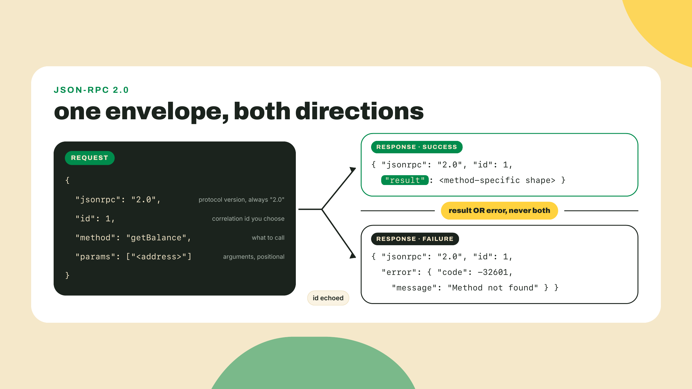
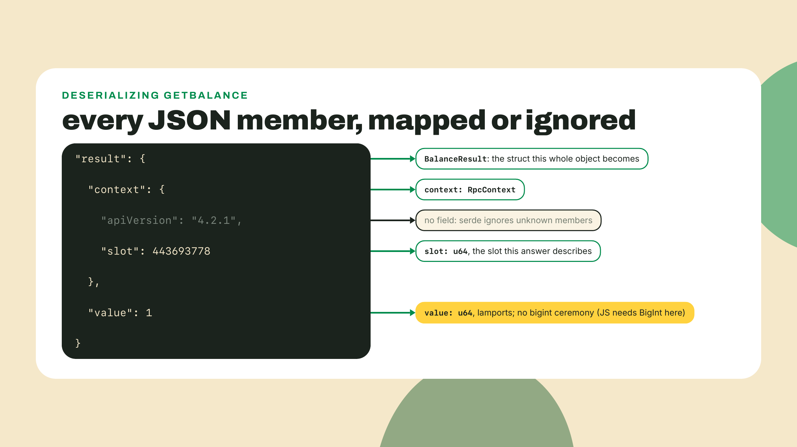
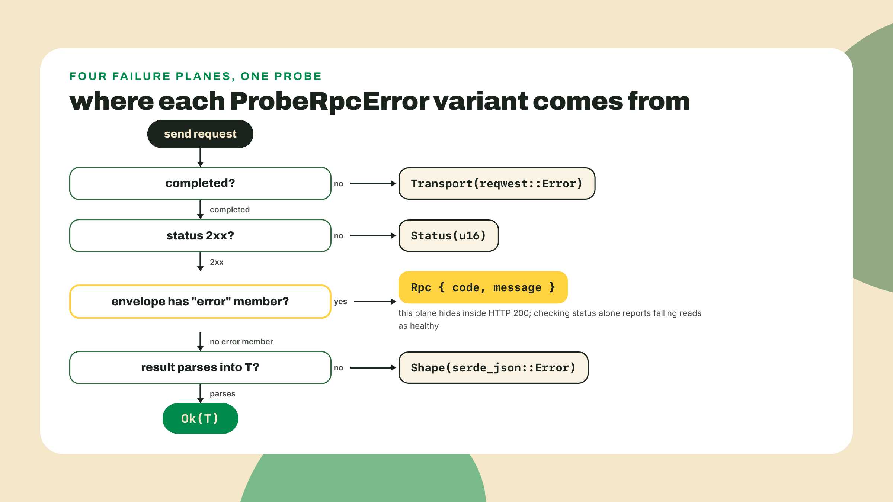
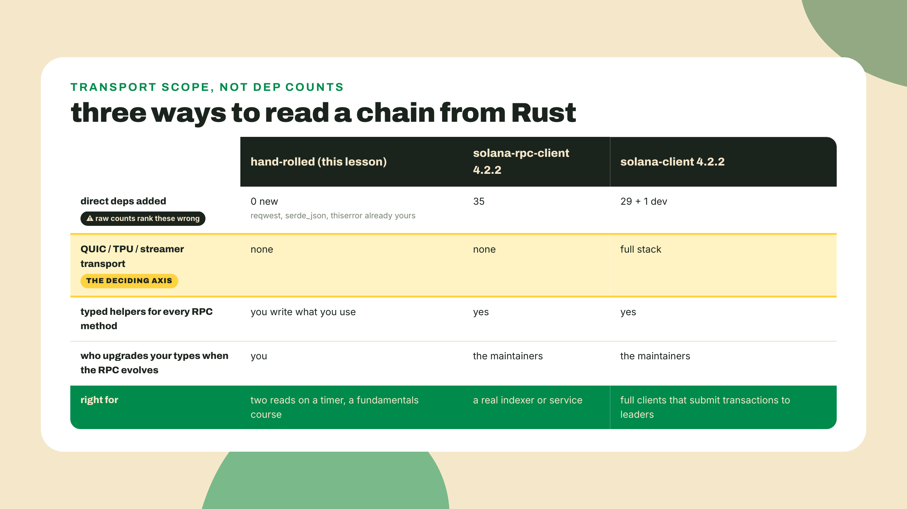
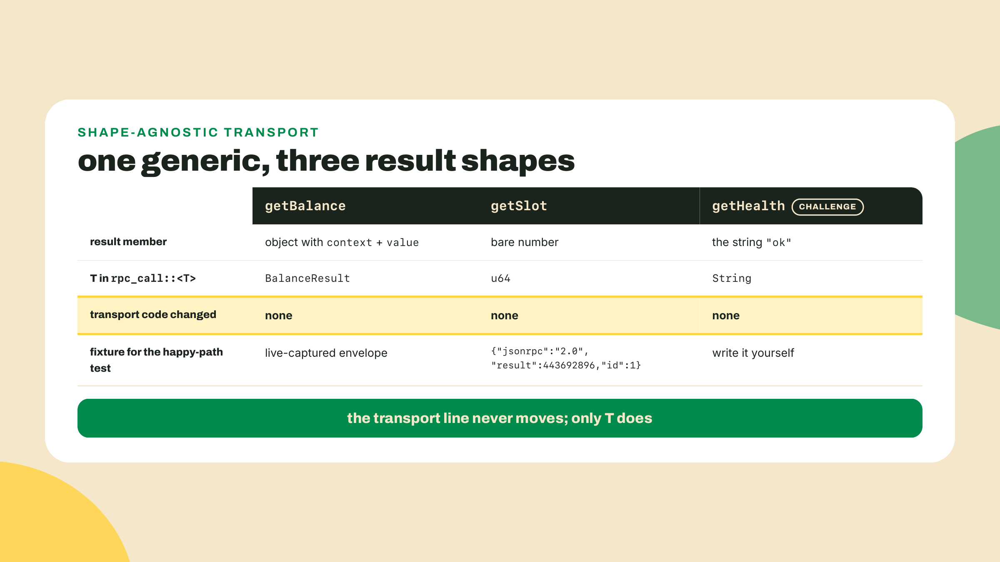
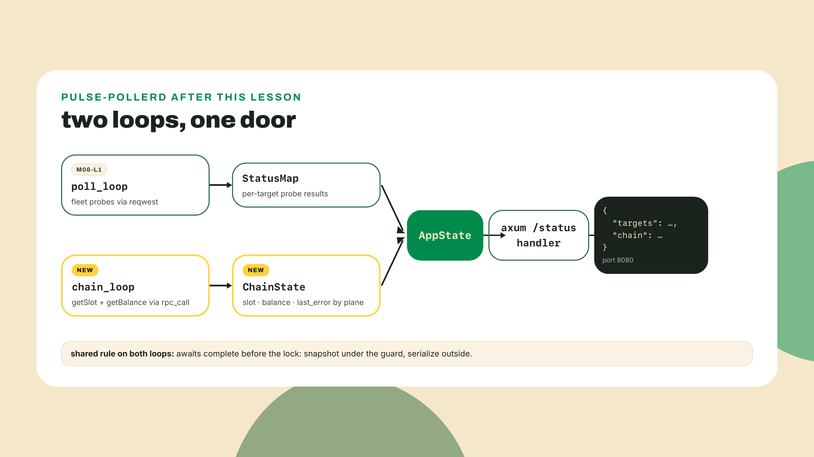
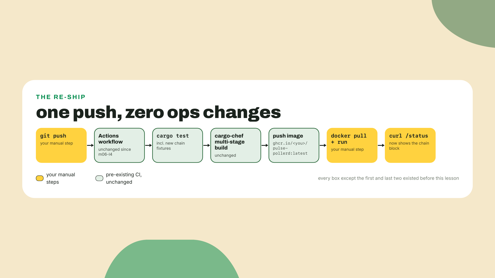

# The Rust path: raw JSON-RPC

## Summary

m08-l2 productionized the TypeScript reads: the Vercel dashboard renders the live Solana panel and the edge worker serves a KV-cached chain snapshot, both re-shipped to their existing URLs with the backoff budget applied. Which leaves exactly one surface chain-blind: the Docker poller from M6, the Rust one. Today it learns to watch slots and balances, and it does so without a single new crate, because the chain speaks a protocol you already own every tool for. The fade contract, out loud: this is a guided-but-learner-led lesson. I work one POST and one response struct for you. You write the getSlot probe, the full error enum, and the `/status` wiring from contracts, and the challenge extension is solo. That is a step up in autonomy from m06-l1's completion skeletons, on purpose, because every line in this lesson is a skill you already drilled.

## No magic underneath

Do this first, before any theory. Open `crates/pulse-pollerd/Cargo.toml` and make one edit to a line that has been sitting there since m06-l1:

```toml
reqwest = { version = "0.13", features = ["json"] }
```

That is not a new dependency. It is a feature flag on a crate you have shipped twice, and after m05-l2 you can read it: opt into reqwest's serde integration, the `.json()` request and response helpers, which the poller never needed while it only cared about status codes. Pin freshness: reqwest is 0.13.4 on crates.io as of 2026-09-02, thiserror 2.0.20, serde_json 1.0.151; your patch digits may be higher and that is fine.

Now create `crates/pulse-pollerd/examples/chain.rs`:

```rust
#[tokio::main]
async fn main() -> Result<(), Box<dyn std::error::Error>> {
    let body = serde_json::json!({
        "jsonrpc": "2.0", "id": 1, "method": "getBalance",
        "params": ["Vote111111111111111111111111111111111111111"]
    });
    let resp: serde_json::Value = reqwest::Client::new()
        .post("https://api.mainnet.solana.com")
        .json(&body)
        .send()
        .await?
        .json()
        .await?;
    println!("{resp:#}");
    Ok(())
}
```

Run it: `cargo run -p pulse-pollerd --example chain`. Here is what mainnet sent back when I ran it while writing this, verbatim:

```json
{
  "id": 1,
  "jsonrpc": "2.0",
  "result": {
    "context": {
      "apiVersion": "4.2.1",
      "slot": 443693778
    },
    "value": 1
  }
}
```

Look at what just happened. You read a balance from Solana mainnet, from Rust, and the entire client was a POST you could have typed from memory. `serde_json::json!` built the request, a macro you have used since the config lesson. `reqwest` carried it, the crate that has probed your fleet since m05-l3 in blocking form and since m06-l1 in async form. serde parsed the answer. There is no Solana crate in your tree and there never will be in this course, because there is no magic underneath: the chain speaks plain JSON over HTTP. Everything you learned about parsing and errors IS Solana client code. That sentence is the lesson; the rest of this file is making it production-grade.

(The `value: 1` is real, by the way. That address is the vote program, and its program account holds exactly 1 lamport. You will swap in an address you actually care about during the lab.)

### The envelope, named

The shape you just printed is JSON-RPC 2.0, a remote-procedure-call convention from 2010 that Solana adopted wholesale. The request envelope has four fields and you wrote all of them: `jsonrpc` is the literal string `"2.0"`, `id` is any client-chosen value the server echoes back so you can match responses to requests, `method` names the procedure, and `params` is an ordered array of arguments, empty when the method takes none. The response envelope echoes `jsonrpc` and `id` and then carries exactly one of two members: `result` when the call succeeded, or `error` when it failed. Hold onto that either-or. It is about to matter more than anything else in this lesson.



Why does `id` exist at all, if the server just echoes it? Because JSON-RPC was designed for clients that pipeline: fire five requests down one connection, receive five responses in whatever order the server finishes them, and match each answer back to its question by id. The protocol even allows batching, an array of request envelopes answered by an array of responses in one round trip. Our poller sends one request at a time and awaits it, so a constant `id: 1` is completely fine, and I want you to notice that this is a decision you just got to make, consciously, because you own the envelope. A client library would have made it for you, invisibly, along with fifty others. Owning the envelope means the whole protocol surface is yours to use or ignore, and it also means that when you eventually want pipelining or batching, nobody has pre-built it: that is the trade, visible from the very first field.

One aside on manners while we are hand-rolling HTTP clients. During this course's research I probed the crates.io API for the version pins above, and a bare `curl` with no User-Agent came back as a 403 with an empty body, not JSON. I re-verified that today; it still does. The registry your own toolchain talks to refuses clients that will not identify themselves. Public APIs enforce etiquette, and the week you start writing raw HTTP clients against them is the week that stops being trivia. Solana's public endpoint has its own version of this: the rate limits you learned to respect in the TS backoff work apply to this poller too.

### Typed structs: the serde payoff

`serde_json::Value` was fine for the example, but the poller cannot ship on it. Reaching into a `Value` with string keys is exactly the untyped fishing that m02-l2 taught you to refuse in TypeScript. This is the same discipline, third appearance: zod parses unknown JSON at the boundary into a type or fails loudly, serde did it for your config file in m05-l1, and now it does it for a chain. Parse, don't validate, now pointed at mainnet.

The structs for that getBalance reply:

```rust
use serde::Deserialize;

#[derive(Debug, Deserialize)]
pub struct RpcContext {
    pub slot: u64,
}

#[derive(Debug, Deserialize)]
pub struct BalanceResult {
    pub context: RpcContext,
    pub value: u64,
}
```

Walk the fields against the JSON you printed. `result` is an object with two members, so `BalanceResult` has two fields. `context` tells you which slot the node answered at, useful metadata for a monitor, and `value` is the balance in lamports. The `apiVersion` string inside context has no struct field, and that is deliberate: serde ignores unknown fields by default, so you type only what you consume and the response can grow without breaking you. And notice what `value: u64` is quietly doing. In the TypeScript panel last lesson, lamports forced the bigint ceremony because JavaScript numbers lose precision past 2^53. Rust's `u64` holds the full range natively. The workaround was a JavaScript problem; do not import it where the language does not have the disease.

The classic first-try failure here is deserializing straight into the value's shape, pointing a bare `u64` at `result` and watching the parse fail, because `result` wraps context and value and flattening it by hand does not survive contact with the actual bytes. When a field is renamed or missing, this whole approach fails the parse as a `Result` value you route on. Not a runtime surprise three functions later. That property is about to become the backbone of the error design.



### Four ways to fail, one enum

Here is the trap that separates toy chain readers from real ones, and I can show it to you live. Send a mistyped method name to mainnet and watch both channels:

```bash
curl -s -o /dev/null -w "%{http_code}\n" https://api.mainnet.solana.com \
  -X POST -H "Content-Type: application/json" \
  -d '{"jsonrpc":"2.0","id":1,"method":"getBalanceTypo","params":[]}'
# 200
```

HTTP said 200. The body said:

```json
{"jsonrpc":"2.0","error":{"code":-32601,"message":"Method not found"},"id":1}
```

A JSON-RPC error arrives inside an HTTP success. The transport layer did its job perfectly: it delivered a well-formed reply that happens to say "error" in the envelope's own vocabulary. A poller that checks `response.status()` and nothing else will mark a failing read as healthy forever, and a monitor that reports wrong is worse than no monitor, because people believe it. So the failure model for a chain probe has four distinct planes, and they deserve four distinct names:

1. **Transport.** The request never completed: DNS failure, connection refused, timeout. reqwest hands you its own error.
2. **HTTP status.** A reply arrived but the status is not 2xx: a 429 from rate limiting, a 502 from a dying proxy.
3. **RPC error.** HTTP succeeded and the envelope's `error` member is populated. The trap plane.
4. **Shape.** HTTP succeeded, no error member, but the JSON does not parse into your types: a renamed field, a wrong envelope, an API change.

Four planes, four remediations. A transport error might mean your network; retry with backoff. A 429 means slow down. An RPC error means your request is wrong; no retry will fix a typo'd method. A shape error means the world changed and your types need a maintainer. In m09-l2, when the station gets structured logging, each plane becomes a greppable name, and the difference between "the RPC was down" and "we were parsing it wrong" becomes one grep instead of one afternoon.

This is the thiserror payoff the M5 error lessons set up. One enum, one variant per plane, and the whole taxonomy is a type the compiler enforces:



One footgun to disarm before the lab, because it lives on plane one. reqwest's default client sets no overall request timeout. None. A hung RPC node does not error; it holds your connection open, and everything awaiting it, indefinitely. Your m06-l1 poll loop already applies a per-request timeout to fleet probes, and the m06-l1 discipline applies unchanged here: every chain probe carries an explicit timeout, because a poller stalled on one read is a station with its eyes closed.

### The crate question, answered honestly

Fair question at this point: the Rust Solana ecosystem ships client crates, so why is a Solana course teaching you to hand-roll JSON-RPC instead of reaching for `solana-client`?

Start with the asymmetry you may already be feeling. Last lesson the TypeScript surfaces got a client library, kit, and nobody hand-rolled anything. This lesson the Rust surface goes straight at the wire. That is not inconsistency; it is the same right-sizing call landing differently on different ground. On the TS side, kit is the ecosystem's canonical client, the sibling frontend course builds its whole practice on it, and this course's job was to hand you off speaking that dialect. On the Rust side there is a typed path too, and we will name it properly in a moment, but a fundamentals reader making two reads on a timer gets something better than a library here: a lab where the serde discipline from M5 and the error taxonomy from the same module stop being exercises and become a working chain client. The hand-rolled path pays double tuition. It reads the chain AND it proves that everything you learned about parsing and errors was Solana client code all along.

Because of what `solana-client` is. It is the kitchen-sink client: alongside RPC reads it bundles a full transaction-submission transport stack, QUIC and UDP clients, the TPU client that talks directly to block leaders, connection caching, the streamer machinery. That is the equipment of a system that fires transactions at validators. Our poller asks two questions on a timer. A fundamentals reader never calls any of that transport, and pulling it in means compiling it, auditing it, and riding its release churn for nothing.

Now the part where I keep the argument honest, because there is a lazier version of it that a careful learner will catch. The lazy version says "use `solana-rpc-client` instead, it's the slim one," and waves at dependency counts. Count for yourself: as of this course's research, `solana-client` 4.2.2 has 29 direct dependencies plus one dev-dependency, and `solana-rpc-client` 4.2.2 has 35. The "slim" crate has MORE direct deps by raw count; it pulls a stack of light type-crates that add up. What it does not pull is any of the QUIC, TPU, or streamer transport machinery. So the defensible claim is scoped: slim in transport scope, not in dep count. Argue from the axis that actually differentiates. If your evidence is a number, someone will check the number, and if the number is wrong your correct conclusion dies with it.



So the honest trade-off, in full. Hand-rolled JSON-RPC is the floor with total transparency: zero Solana-crate churn, and every line reuses a skill this course already taught you. The cost is that YOU own the envelope. New methods mean new structs. Commitment levels, response encodings, batched requests: all manual, all yours. (Commitment level, since I just named it: an optional parameter choosing how final an answer must be before the node gives it to you. We accept the default in this course and leave the tuning where it belongs, in the docs below.) Nobody upgrades your types when the RPC evolves; your shape tests catch the break and then a human, you, fixes it. For a poller doing two reads, that trade is correct. A real indexer or a trading system graduates to `solana-rpc-client` and the granular `solana-*` crates, which is exactly why they live in the box below and not in this lesson.

**Go deeper (the 20%).** the canonical reference for every JSON-RPC method this lesson's pattern can reach, request params, response shapes, commitment levels, and the envelope spec itself, is Solana's RPC HTTP methods page: https://solana.com/docs/rpc/http (verified live 2026-09-02). Bookmark it; it is the missing half of today's pattern, and when your reads outgrow hand-rolled, the typed path is `solana-rpc-client` plus the granular `solana-*` crates, adopted with the dependency-reading discipline from m05-l2. Nothing in today's lab depends on any of that.

## Lab: pollerd grows chain probes

The build. By the end, `/status` answers with the fleet targets it already reports plus a chain block, and the GHCR image re-ships without you touching a single ops file.

1. **Manifest, thirty seconds.** You already flipped reqwest's `json` feature in the do-early. Add one subscription to `crates/pulse-pollerd/Cargo.toml`:

   ```toml
   thiserror = { workspace = true }
   ```

   The version lives at the workspace root where m05-l2 declared it (2.0.20). Read the whole `[dependencies]` block when you are done and let it register: pulse-engine, serde, serde_json, tokio, axum, reqwest, thiserror. Every one predates this lesson. The workspace gains nothing new today; that is the point, and it stays true through the final push.

2. **The error enum, yours, from a contract.** Create `crates/pulse-pollerd/src/chain.rs` and author `ProbeRpcError` yourself with `#[derive(Debug, Error)]`. The contract, one variant per plane from the theory section:

   - `Transport` wraps `reqwest::Error`. Use `#[from]`, the m05-l2 conversion muscle, so `?` lifts reqwest failures into your type automatically.
   - `Status` carries the offending code as a `u16`.
   - `Rpc` is a struct variant carrying `code: i64` and `message: String` lifted from the envelope's error object.
   - `Shape` wraps `serde_json::Error`, also `#[from]`.

   Write a `#[error("...")]` message for each that you would want to read in a log at 2am, and give the enum one small method: `pub fn plane(&self) -> &'static str`, returning `"transport"`, `"http_status"`, `"rpc"`, or `"shape"`. Four static strings. That method looks like nothing today; it is the greppable name m09-l2's structured logging will lean on.

3. **The transport line and the worked probe.** Here is my half of the fade contract: the generic call, the parse split out for testability, and the worked getBalance. Read it, then type it into `chain.rs`:

   ```rust
   use std::time::Duration;

   use serde::Deserialize;

   const RPC_TIMEOUT: Duration = Duration::from_secs(5);

   #[derive(Debug, Deserialize)]
   struct RpcErrorObject {
       code: i64,
       message: String,
   }

   fn parse_rpc_response<T: serde::de::DeserializeOwned>(text: &str) -> Result<T, ProbeRpcError> {
       let envelope: serde_json::Value = serde_json::from_str(text)?;
       if let Some(err) = envelope.get("error") {
           let err: RpcErrorObject = serde_json::from_value(err.clone())?;
           return Err(ProbeRpcError::Rpc { code: err.code, message: err.message });
       }
       let result = envelope.get("result").cloned().unwrap_or(serde_json::Value::Null);
       Ok(serde_json::from_value(result)?)
   }

   pub async fn rpc_call<T: serde::de::DeserializeOwned>(
       client: &reqwest::Client,
       url: &str,
       method: &str,
       params: serde_json::Value,
   ) -> Result<T, ProbeRpcError> {
       let body = serde_json::json!({
           "jsonrpc": "2.0",
           "id": 1,
           "method": method,
           "params": params,
       });
       let resp = client
           .post(url)
           .timeout(RPC_TIMEOUT)
           .json(&body)
           .send()
           .await?;
       let status = resp.status();
       if !status.is_success() {
           return Err(ProbeRpcError::Status(status.as_u16()));
       }
       let text = resp.text().await?;
       parse_rpc_response(&text)
   }

   pub async fn get_balance(
       client: &reqwest::Client,
       url: &str,
       address: &str,
   ) -> Result<BalanceResult, ProbeRpcError> {
       rpc_call(client, url, "getBalance", serde_json::json!([address])).await
   }
   ```

   Add the `RpcContext` and `BalanceResult` structs from the theory section above these. Then walk the seams, because two decisions in here are load-bearing. First, `parse_rpc_response` takes a `&str`, not a network response, which makes the entire failure taxonomy testable with string fixtures and no network; you will exploit that in step 4. Second, the parse goes through `serde_json::Value` before your typed struct, so the error member gets checked before the result member is interpreted, and a response with neither member falls through to a `Shape` error when `Null` refuses to become your type. The `?` operators do the routing silently: a send failure lifts into `Transport`, a from_str or from_value failure into `Shape`, both via the `#[from]` conversions you wrote in step 2. The taxonomy is not a comment. It is the type system doing the classification.

   Honestly, a generic `rpc_call<T>` plus one enum is most of what a client SDK is. Everything else is convenience wrappers, and now you get to write two of them.

4. **Your probe and your proof.** Write `get_slot` yourself. Its result envelope is not an object at all: `getSlot` returns a bare number as `result`, so the whole function is `rpc_call` with `T = u64`, method `"getSlot"`, and empty `json!([])` params. One reveal to feel: your generic handles a completely different response shape with zero transport changes.

   Then the tests, in a `#[cfg(test)] mod tests` at the bottom of `chain.rs`. The acceptance bar is a deserialize-happy-path and one malformed fixture per probe. Two worked fixtures from me, captured live from mainnet on 2026-09-02, so your tests assert against real bytes:

   ```rust
   #[test]
   fn balance_happy_path() {
       let fixture = r#"{"jsonrpc":"2.0","result":{"context":{"apiVersion":"4.2.1","slot":443692897},"value":1},"id":1}"#;
       let parsed: BalanceResult = parse_rpc_response(fixture).expect("fixture parses");
       assert_eq!(parsed.value, 1);
       assert_eq!(parsed.context.slot, 443692897);
   }

   #[test]
   fn error_in_a_200_routes_to_rpc_variant() {
       let fixture = r#"{"jsonrpc":"2.0","error":{"code":-32601,"message":"Method not found"},"id":1}"#;
       let parsed = parse_rpc_response::<u64>(fixture);
       assert!(matches!(parsed, Err(ProbeRpcError::Rpc { code: -32601, .. })));
   }
   ```

   You write the rest: a slot happy path (`result` is `443692896`, assert the number comes through), a malformed balance fixture (delete the `context` member and assert `Err(ProbeRpcError::Shape(_))` with `matches!`), and a missing-result fixture (an envelope with neither member, same assertion). `cargo test -p pulse-pollerd`, green. Notice what you just did NOT need: a network, a mock server, an async runtime in the tests. The `&str` seam bought all of that.



5. **Wire it into `/status`, from a contract.** The poller currently serves one map of fleet targets. The target shape after this step, the same JSON the verify gate curls:

   ```json
   {
     "targets": { "…": "everything /status already reported" },
     "chain": {
       "slot": 443693778,
       "balance_lamports": 1,
       "watched_address": "Vote111111111111111111111111111111111111111",
       "last_error": null,
       "last_poll": 1788336000
     }
   }
   ```

   The contract types, in `chain.rs`:

   ```rust
   use std::sync::{Arc, Mutex};

   use serde::Serialize;

   #[derive(Clone, Default, Serialize)]
   pub struct ChainStatus {
       pub slot: Option<u64>,
       pub balance_lamports: Option<u64>,
       pub watched_address: String,
       pub last_error: Option<String>,
       pub last_poll: u64,
   }

   pub type ChainState = Arc<Mutex<ChainStatus>>;
   ```

   The wiring is yours, and it is m06-l1's architecture replayed in miniature, so build it by analogy, not from scratch. Write an `async fn chain_loop(chain: ChainState)` that makes its own `reqwest::Client`, ticks a `tokio::time::interval` every 30 seconds, awaits `get_slot` and `get_balance` for your watched address, and then, with both results already in hand, takes the lock once and writes the fields: successes into `slot` and `balance_lamports`, any failure into `last_error` as `format!("{}: {e}", e.plane())` so the plane name leads the message. The m06-l1 lock rule applies verbatim and I will not apologize for repeating it: both awaits finish BEFORE the lock is taken, never hold the guard across an await. In `main`, spawn `chain_loop` next to the existing `poll_loop` spawn, then bundle the two states into a small `AppState { targets, chain }` struct (derive `Clone`), switch the router's `.with_state` to it, and update `status_handler` to lock each map briefly, clone snapshots, and return a `StatusResponse { targets, chain }`. Swap `WATCHED_ADDRESS` for an address you care about, or keep the vote program and its lonely lamport. `cargo run -p pulse-pollerd`, then `curl -s localhost:8080/status` and read your station's first chain block.



6. **Break it on purpose.** Acceptance for the taxonomy is not that it compiles; it is that failure degrades instead of detonating. Change the RPC URL to something unresolvable, `https://rpc.invalid`, and run the poller. The process must stay up, `/status` must keep serving, and on a fresh boot the chain block should read like this:

   ```json
   {
     "targets": { "…": "still serving, unchanged" },
     "chain": {
       "slot": null,
       "balance_lamports": null,
       "watched_address": "Vote111111111111111111111111111111111111111",
       "last_error": "transport: error sending request",
       "last_poll": 1788336030
     }
   }
   ```

   The exact message after `transport:` will vary with your OS and resolver, and that is fine; the plane name in front of it is the part your code guarantees. If you break it against a running poller instead, `slot` and `balance_lamports` hold their last honest values while `last_error` fills in, which is precisely the behavior you want a monitor to have: stale-but-labeled beats blank. Put the real URL back and watch the next tick heal it: `last_error` returns to `null`, the slot number resumes climbing. A wrong URL costing you one field in a JSON response instead of a process is the entire argument for step 2, demonstrated in ninety seconds.

7. **The re-ship.** Commit, push, and do nothing else. The M6 pipeline picks up the commit, runs your tests including the new fixtures, builds the same cargo-chef multi-stage Dockerfile, and pushes the image to GHCR, because the workspace, the Dockerfile, and the workflow are untouched since m06-l4. That is the demonstration the lesson has been walking toward: code that lands inside an already-shipping system inherits its ship. When the run is green, prove it end to end from the outside, the way a stranger would:

   ```bash
   docker pull ghcr.io/<you>/pulse-pollerd:latest
   docker run --rm -p 8080:8080 ghcr.io/<you>/pulse-pollerd:latest
   # in another terminal:
   curl -s localhost:8080/status
   ```

   Fleet targets, plus a chain block, with a live mainnet slot in it, served by an image any machine on earth can pull. The station's third surface just got its eyes.



## Challenge

Solo. Add a `get_health` probe. `getHealth` answers with the string `"ok"` as its entire `result`, a third shape your structs have not met: not an object, not a number, a bare string. If you route it through `rpc_call`, the function is two lines, and that is the test of whether you understood the design: the taxonomy and the generic must absorb a new method without a single edit to the transport line. Surface it in the chain block however you see fit, a `healthy: Option<bool>` field is one clean answer. Write both tests: a happy-path fixture you author yourself in the live-captured style, and a malformed one. And think through the failure route before you run anything: an unhealthy node reports through the envelope's error member, which means the answer arrives on plane three, already classified by code you wrote in step 2, and your `plane()` string says `"rpc"` before you have read a single log line. Acceptance: `cargo test -p pulse-pollerd` green with your two new fixtures, and `/status` showing the health field against the real endpoint. Your TS edge worker has been probing this exact method since m07-l1 (the Rust worker classifies; it makes no outbound calls); you now know precisely what that probe was doing.

## Checkpoint

What you can now do, concretely: read state from Solana mainnet in Rust with a five-line POST built entirely from crates you already shipped; type an RPC response so that a renamed field is a routed `Result`, not a runtime surprise; classify every way a chain read can fail into four planes and say which of them hides inside an HTTP 200; and defend the no-Solana-crate decision on the axis that survives an audit, transport scope, while conceding the dep-count axis that does not.

The 30-second retrieval before you close the terminal: why can a completely failed read arrive as HTTP 200? (JSON-RPC reports failures inside its own envelope; the transport succeeded at delivering a reply that says error, so you must check the `error` member, not just the status.) And the crate argument in one sentence? (`solana-client` bundles a QUIC and TPU submission transport a two-read poller never calls; that scope, not raw dependency counts, is the argument, and the counts actually point the other way.)

One calibration ask. This lesson handed you the error enum as a prose contract instead of a code skeleton, the first time the course has done that. If authoring it from the four bullet points felt like real work, that is the intended difficulty; if it felt underspecified and you had to guess at shapes, say so in the feedback, because m09 leans harder on contract-driven steps and I want the ramp honest.

The station now reads the chain from every surface it has, in both languages: the dashboard, the edge worker, and a Docker image with typed mainnet reads inside it. Which means every claim this course has made about the stack is now proven except one: that it can WRITE. Next lesson is the module's payoff. One signed transfer on devnet, framed as the station's write-path health check, with an honesty box about faucets and a local validator in your back pocket for the day the faucet is dry. The probe that mutates.
