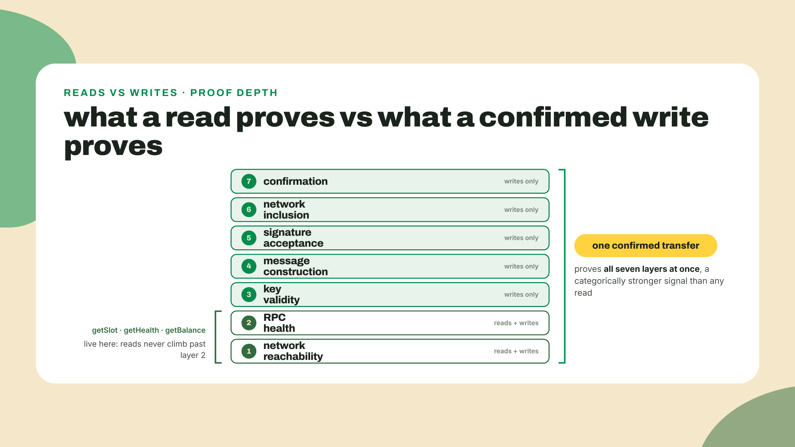
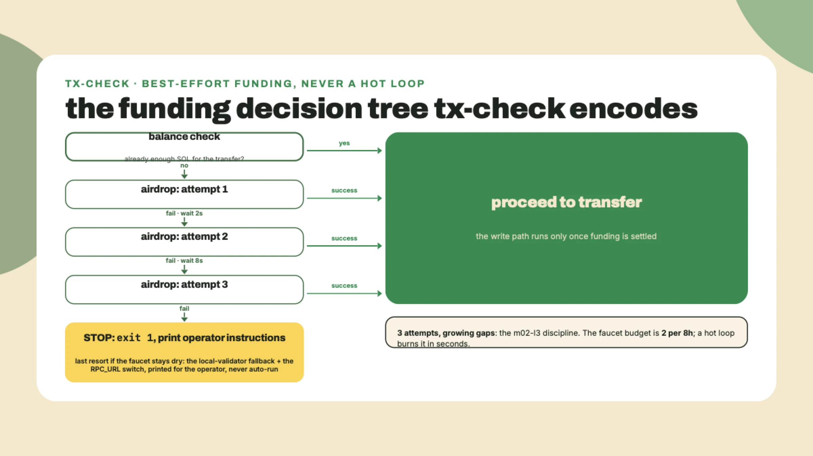
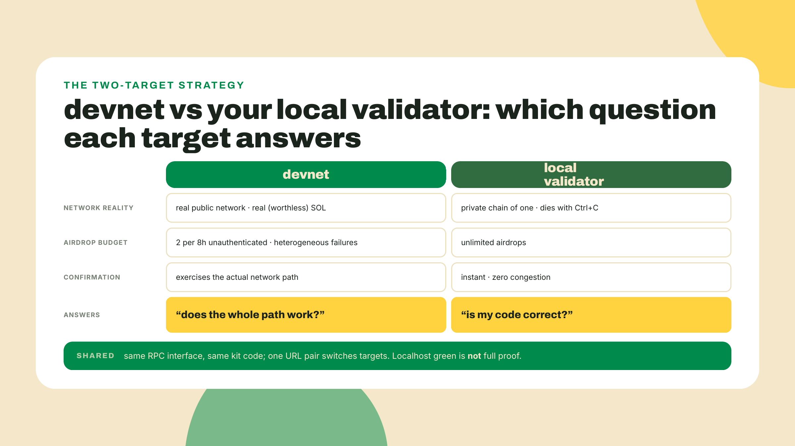
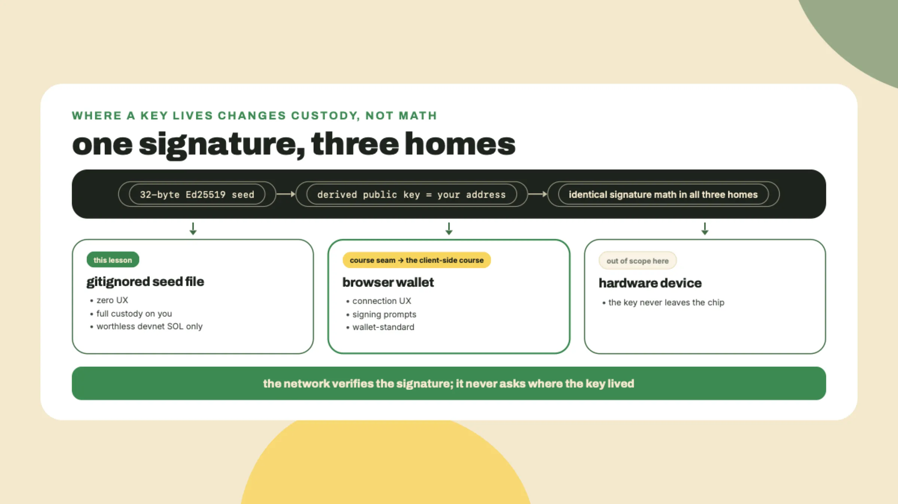
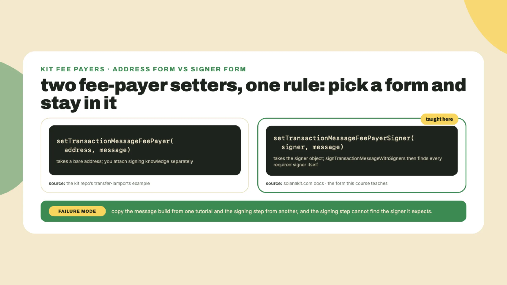
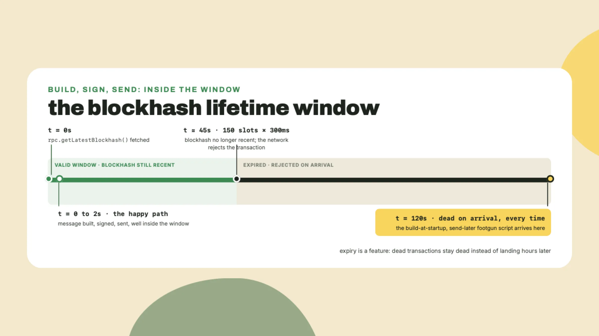
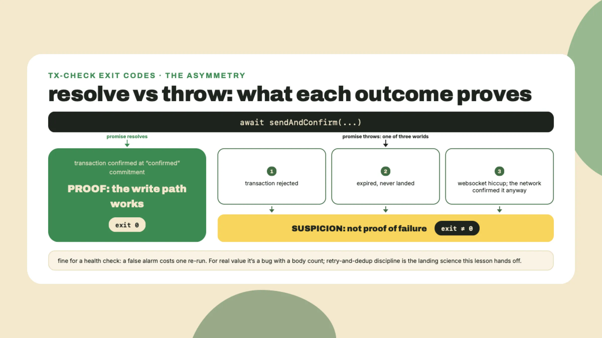
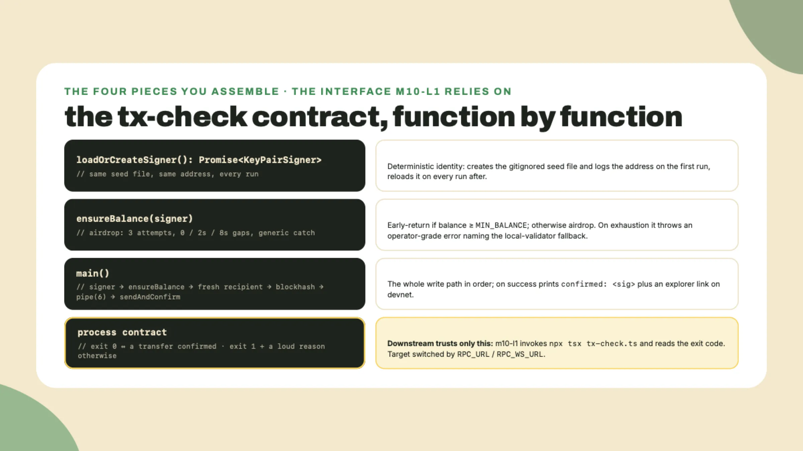
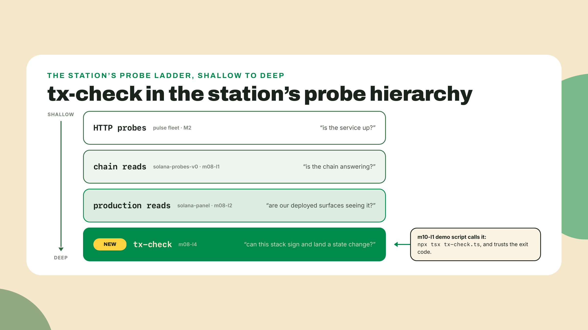

# The write path health check: one transfer

## Summary

m08-l3 gave the Rust poller its chain probes: typed reqwest reads parsed with serde_json, a thiserror failure taxonomy for everything the RPC can throw, and a re-ship of the GHCR image through the M6 pipeline without touching a line of it. Every surface of the station now reads the chain. Nothing writes to it. Today that changes: you ship `tx-check`, a script that signs one real SOL transfer, lands it on devnet, prints the signature, and exits nonzero if any link in that chain lies. That confirmed signature is SHIP #5, and it is the single strongest health signal this course will teach you to emit. Fading, out loud: this is the module's difficulty spike, and you get the pipe flow walked once on screen with every step explained. Then you assemble the script yourself, including the airdrop-with-fallback logic and the target switch. The balance-delta verification at the end is fully solo. Next module hands you checklists, not walkthroughs.

## The probe that mutates

Before any theory, one command. Today's transfer lands on devnet, so ask devnet directly whether it is even alive, with the same envelope you have POSTed since M7:

```bash
curl -s https://api.devnet.solana.com -X POST -H 'content-type: application/json' \
  -d '{"jsonrpc":"2.0","id":1,"method":"getHealth"}'
```

`{"jsonrpc":"2.0","result":"ok","id":1}` means the target of everything below is answering. Now the theory.

Three lessons of reads have proven the station can ask. They prove nothing about whether this stack can act. A read can succeed while the write path is completely broken: wrong key bytes, a malformed message, an expired blockhash, a network that accepts your transaction and then shrugs. Reads share exactly two failure surfaces with writes, connectivity and RPC health, and you have those covered six ways already. Everything above that line, key validity, message construction, signature acceptance, inclusion, confirmation, is invisible to a read. There is exactly one way to see it: sign something real and watch it land.



That is the frame for today's artifact, and it is worth saying plainly before any code: `tx-check` is a health check, not a demo. Uptime pages the world over show green dots that mean "the server answered a ping", and you have built exactly that class of probe since M2, on purpose, because it is the right first rung. But a chain client that can only read is a monitoring station for a system it cannot touch. The probe that mutates is a different species: it puts a signed claim into the world and asks the network to commit to it. When that commitment comes back, you have proven your keys, your message-building code, your signing, the network's willingness to include you, and its confirmation machinery, all in one 30-second run. No combination of reads gets you any of that.

So the plan is honest and small: get a throwaway key, get it some worthless devnet SOL, send a fraction of it back out, and demand a confirmed signature as the receipt. The transfer itself is deliberately tiny, 0.001 SOL from your throwaway to a fresh second address, because the amount is not the point. The receipt is. And the first step is asking a faucet for money, which is why the first honest thing this lesson does is plan for the faucet to say no.

### Beg before you build

Do this now, before any theory. In the station repo, make a workspace for the script and install the two packages it needs:

```bash
mkdir tx-check && cd tx-check
npm init -y
npm i @solana/kit@^8 @solana-program/system@^0.14
npm i -D typescript tsx @types/node
```

Version note: `@solana/kit` resolves to 8.2.0 and `@solana-program/system` to 0.14.1 as of 2026-09-02, and system's peer range is `^8.0.0`, which is why the kit digit is 8. Same rule as m08-l2: pin what your `@solana-program/*` deps peer against, and re-check the digits when you install, because kit has shipped two majors inside just over nine weeks before.

Now the begging. Solana's devnet is a real network running real validators, and the SOL on it is worthless by design: you cannot buy it, you can only ask a faucet. An airdrop is exactly what it sounds like, a transaction somebody else signs that credits your address, which means your very first funded balance arrives through the same write path you are about to exercise yourself. The official faucet is faucet.solana.com, and its terms are printed right on the page: 2 requests per 8 hours unauthenticated, more if you sign in with GitHub. Two per eight hours. Run the arithmetic on what a naive retry loop does to that: a loop firing once per second exhausts the entire 8-hour allowance before you can read the first error message, and then guarantees the dry-faucet state it was written to escape. That is not a rate limit you retry your way through, it is a budget you spend like one.

And here is the part most tutorials hide: the airdrop fails in multiple ways, and not the same way twice. During this course's research probes, on the same day, one request came back with an internal error and an independent re-probe came back with a 429 rate-limit pointing at the faucet page. When I ran the exact script you are about to build, while writing this lesson on 2026-09-02, attempt one failed with an internal JSON-RPC error and attempts two and three failed with plain HTTP 429s. Same minute, two different failure shapes. So the rule your code must encode: branch on failure generally, never on one specific error code. Any handler that pattern-matches "the" airdrop error breaks on the other one.

My favorite detail from the research sweep, and your first color of the day: faucet.solana.com carries explicit instructions for AI agents, steering them toward a proof-of-work faucet or a local validator instead. Probed live on 2026-09-01. The rate limit has a welcome mat for the machines it is limiting. Take the hint the faucet itself is giving: the fallback is not an apology, it is the documented path.



Programmatically, the ask goes through kit's `airdropFactory`, which wraps the request-and-confirm dance for you. You will wire it into `tx-check` in the lab with exactly the shape in that flowchart: three attempts, growing gaps, then a loud, useful failure. The backoff thinking is the same jittered discipline you hand-rolled for 429s in m02-l3. Faucets are rate-limited HTTP services. Everything you learned about being polite to those applies here unchanged.

### The fallback you rehearse before you need it

A fallback you have never exercised is a rumor. So this lesson does not offer the local validator as an aside for the unlucky: everyone installs it, everyone runs it once, and nobody ever hard-blocks on a dry faucet again. This is also the moment you stop renting other people's chains entirely. The Solana CLI toolchain ships a complete local test chain, and owning one changes what you can build for the rest of this course and after it.

One pinned command, probed live against solana.com's install docs on 2026-09-02:

```bash
curl --proto '=https' --tlsv1.2 -sSfL https://solana-install.solana.workers.dev | bash
```

That script installs the latest stable Agave release of the toolchain. Freshness reality, in two data points: the docs' own sample output shows `solana-cli 3.0.10`, and the machine this lesson was verified on pulled `3.1.10`. Yours will likely be newer than both. Confirm it took:

```bash
solana --version
# solana-cli 3.1.10 (src:7bc9c805; feat:1620780344, client:Agave)
```

Then start your own chain:

```bash
solana-test-validator
```

That one command boots a full single-node Solana cluster on your machine: RPC on `http://127.0.0.1:8899`, websockets on `ws://127.0.0.1:8900`, a genesis block minted seconds ago, and a faucet with no budget because you own the mint. The name in that version string, Agave, is the validator client itself, the same software the public clusters run, which is why your local chain answers the exact JSON-RPC interface your reads have been hitting since m08-l1. It keeps running in that terminal until you Ctrl+C it, slots ticking in the corner, and it writes its ledger to a `test-ledger/` directory in whatever folder you started it from. Delete that directory and the next boot mints a fresh genesis: a brand-new chain, zero history, every balance reset. There is something clarifying about that. The intimidating global object your station has been carefully probing for a module turns out to be software you can start, stop, and wipe like any other process. Honestly, having an entire chain on localhost is a godsend, and it costs one command.

Sit with what you now own for a second, because it outlives this lesson. Every read your station makes, every script in this module, works against this chain by switching one URL pair. When a later experiment needs fifty funded accounts, or a thousand transactions in a tight loop, or a test that must start from empty state, the public devnet would rate-limit you into misery and your local chain will not even notice. And to set expectations honestly: none of the Academy's on-chain courses will demand this install from you, they grade in hosted and in-process environments on purpose. The local validator is your personal power tool for experiments too greedy for shared infrastructure, not a prerequisite anything downstream assumes.

The trade, because there is always one: your local chain is a private chain of one. Airdrops always land, transactions always confirm, nothing is congested, and none of it proves anything about the public network path. Green against `solana-test-validator` proves your code. Green against devnet proves your code and the network between you and it. Know which question each target answers, and make your script able to ask both.



### A key with nothing to lose

Every write needs a signer, and this course gives you the minimal honest one: a fresh 32-byte random seed, saved to a file, loaded with kit's `createKeyPairSignerFromPrivateKeyBytes`. That helper takes exactly 32 bytes of private key material and derives the public half itself, verified against kit 8.2.0. The key lives in `.keys/devnet-throwaway.seed` inside the tx-check folder, and the name is the security policy: it is a throwaway, it will only ever hold worthless devnet SOL, and it goes into `.gitignore` before the first run, not after.

That ordering is the actual lesson. A committed keypair file is a leaked key forever. Git history does not forget, force-pushes do not reliably scrub, and the habit of gitignoring key material before it exists is worth more than any single key. Even a devnet key: the SOL is worthless, but the habit transfers to keys that are not.



Two glosses before we build with it, both load-bearing. First, the signer. The 32 bytes are an Ed25519 private key seed, and the signature math is identical whether the key lives in a file, a hardware device, or a browser wallet. Where the key lives changes custody and UX, never cryptographic strength, so nothing about this file-based signer is a toy: it produces exactly the signatures mainnet validators verify. Second, the two nouns the next section leans on. An instruction is one unit of work addressed to one program: "system program, move N lamports from A to B". A transaction message is the envelope: one or more instructions plus the metadata the network needs, who pays the fee and how long the envelope stays valid. You build the message, you sign the message, the network executes the instructions inside it. Keep those two levels separate in your head and the pipe below reads itself.

What you are deliberately not getting here is a wallet. No browser extension, no connect button, no signing popup. Wallets handle devnet fine, so the exclusion is not technical: it is a boundary. Wallet-standard, connection UX, and everything a signing prompt involves belong to the client-side mastery course, in production as I write; expect the wallet and transaction-landing depth there. A file full of random bytes is the signer that keeps this lesson about the thing it teaches: how a transaction message gets built, signed, and confirmed. The moment you catch yourself wanting a real wallet is the exact moment that territory begins, and until the course ships, wallet-standard is the term to search.

### The pipe, one honest step at a time

Now the center of the lesson. Kit builds transactions as a pipeline of small pure transforms over a message value, and the canonical shape is a `pipe` call. Here is the whole thing, exactly as it will sit in your script, and then we take it apart step by step. Every identifier here is verified against the installed packages: this exact code compiles under strict TypeScript and landed a confirmed transfer while this lesson was being written.

```typescript
const { value: latestBlockhash } = await rpc.getLatestBlockhash().send();

const message = pipe(
  createTransactionMessage({ version: 0 }),
  (m) => setTransactionMessageFeePayerSigner(signer, m),
  (m) => setTransactionMessageLifetimeUsingBlockhash(latestBlockhash, m),
  (m) =>
    appendTransactionMessageInstruction(
      getTransferSolInstruction({
        source: signer,
        destination: recipient.address,
        amount: lamports(TRANSFER_LAMPORTS),
      }),
      m,
    ),
);

const signed = await signTransactionMessageWithSigners(message);
assertIsTransactionWithBlockhashLifetime(signed);
const sendAndConfirm = sendAndConfirmTransactionFactory({ rpc, rpcSubscriptions });
await sendAndConfirm(signed, { commitment: "confirmed" });

const signature = getSignatureFromTransaction(signed);
```

**Step 1: `createTransactionMessage({ version: 0 })`.** A transaction message is the unsigned work order: who pays, what instructions run, and how long the order is valid. It starts empty. The version field picks the modern message format; version 0 is what current tooling produces, and that is all you need to know here.

**Step 2: `setTransactionMessageFeePayerSigner(signer, m)`.** Every transaction names one account that pays the fee, and this sets yours. One attribution beat, because it will save you from a classic copy-paste failure: kit ships two fee-payer setters. The kit repository's own transfer example uses the address form, `setTransactionMessageFeePayer`, which takes a bare address. Kit's documentation at solanakit.com teaches the Signer form used above, which takes the signer object itself so the later signing step knows exactly who must sign. This course teaches the Signer form, on solanakit.com's authority. Both forms are real. Mixing halves of tutorials that chose differently is the classic way this flow breaks.



**Step 3: `setTransactionMessageLifetimeUsingBlockhash(latestBlockhash, m)`.** This is the step with a clock in it. The message gets stamped with a recent blockhash, and the network only accepts the transaction while that blockhash is still recent, a window of 150 blocks, which at the 300ms slot time you measured in m08-l1 is about 45 seconds. (It was a minute back when slots targeted 400ms, which is why you will still meet 'about a minute' in older write-ups.) Why would a network do that to you? Because the alternative is worse: without an expiry, a transaction that failed to land could sit in the void and execute hours later, after you gave up and sent a replacement. The lifetime is why unlanded transactions die cleanly instead of haunting you. The practical rule falls straight out: fetch the blockhash inside the send path, right before you build the message, never at script start. A script that builds its message at startup, does two minutes of other work, then sends, will fail confirmation every single time, and now you know why before it happens to you.



**Step 4: `appendTransactionMessageInstruction(getTransferSolInstruction({...}), m)`.** An instruction is one unit of work for one program; a transaction message carries a list of them. Ours carries exactly one: a system-program SOL transfer, built by `getTransferSolInstruction` from `@solana-program/system` with a source signer, a destination address, and an amount. The `lamports()` helper brands the amount with the right type; a lamport, from m08-l1, is the base unit, one billionth of a SOL, and amounts are bigints because u64 does not fit in a JavaScript number.

**Step 5: `signTransactionMessageWithSigners(message)`.** Because the fee payer went in as a signer object, this one call finds every required signer attached to the message and produces the signed transaction. No manual key juggling. The `assertIsTransactionWithBlockhashLifetime` line after it is a type-level guard that tells the compiler what we know, that this transaction carries a blockhash lifetime, which the confirm step requires.

**Step 6: `sendAndConfirmTransactionFactory({ rpc, rpcSubscriptions })`.** The factory takes your RPC connections once and returns a send-and-confirm function you can reuse. Notice it wants both connections, and the second one finally explains why this script opens a websocket at all: instead of polling "did it land yet?" in a loop, the confirm half subscribes to a notification for your signature and waits for the network to speak. Its contract is the whole point of this lesson: the returned function submits the signed transaction and resolves only when the network has confirmed it at your chosen commitment, or throws. Not "sent". Confirmed. We pass `commitment: "confirmed"`, which means a validator included your transaction in a block and a supermajority of the cluster has voted on that block. There are shallower and deeper levels on that dial, and the full commitment story, along with what finality really buys you, is deeper client-side territory than a health check needs. For a health check, "the cluster voted on it" is exactly the right bar: strong enough to mean something, fast enough to run on demand.

One more honesty beat about that contract, because it defines your exit codes. Resolving is proof. Throwing is not always the mirror image of proof: a throw can mean the transaction was rejected, or that it expired unlanded, or merely that your websocket hiccuped while the network went ahead and confirmed it anyway. For tx-check this asymmetry is fine, a health check should be paranoid, and a false alarm costs you one re-run. For anything moving real value, "the send threw, therefore it did not happen" is a bug with a body count, and the retry-and-dedup discipline that handles it properly is part of the landing science this course hands off. Know the seam exists; do not cross it today.



The pipe is six calls, and each one carries a why. That is the entire pattern this course teaches for writes, and it is deliberately the floor: raw keypair signer, default fees, no retry sophistication. On a congested day a default-fee transaction can simply not land, and this lesson accepts that as a teachable outcome rather than smuggling in half a landing course.

Which brings us to the 20% box, as hand-off prose rather than links, because these seams are course-sized, not paragraph-sized. Transaction landing science, priority fees, retry-and-blockhash strategy, and everything wallet-shaped are a client-side craft of their own: the moment you need a landing guarantee or a browser wallet, that is the seam to go study properly, as a course of study, not a blog post. Token transfers, this one moved native SOL only, belong to the digital assets course, which walks the token programs properly. This lesson hands you the minimal honest write; deeper study teaches you to make it production-grade.

### Confirm, view, done

One beat, as promised, because the explorer walkthrough got trimmed to pay for your local validator. The signature `getSignatureFromTransaction` returns is a base58 string that uniquely names your transaction forever. Paste it into any Solana explorer with the cluster set to devnet, or just print the link the script builds: `https://explorer.solana.com/tx/<signature>?cluster=devnet`. You will see the transfer, the fee, the slot it landed in, and the two balances changing. That page is the public, third-party receipt that your stack can act. Look at it once, enjoy it, close the tab.

## Lab: tx-check

The frame, before the steps: `tx-check` is not a demo, it is a station feature. It is the write-path health check, runnable on demand, answering the one question no read can: can this stack sign and land, not just read? It prints a confirmed signature and exits 0, or it fails loudly and exits nonzero, which makes it composable: m10-l1's demo script will call it by exactly that contract. You saw the pipe walked once above. Now you assemble the script around it yourself.

1. **Gitignore first.** In the station repo root, before any key exists:

```bash
echo "tx-check/.keys/" >> .gitignore
echo "test-ledger/" >> .gitignore
git add .gitignore && git commit -m "chore: ignore devnet throwaway keys and local ledger"
```

(The ledger line is deliberately unanchored: `solana-test-validator` writes `test-ledger/` into whatever directory you start it from, and step 7 only says "a second terminal", so an unanchored pattern covers the repo root, `tx-check/`, and anywhere else you launch it. A directory-pinned pattern would leave the checkpoint's `git status` proof full of noise the first time you started the validator one folder over.)

2. **Scaffold the script.** Create `tx-check/tx-check.ts` with the constants and imports. The target switch is two env vars with devnet defaults; this is the interface, so keep the names exact:

```typescript
import { readFileSync, writeFileSync, existsSync, mkdirSync } from "node:fs";
import { randomBytes } from "node:crypto";
import {
  createSolanaRpc,
  createSolanaRpcSubscriptions,
  createKeyPairSignerFromPrivateKeyBytes,
  generateKeyPairSigner,
  airdropFactory,
  lamports,
  pipe,
  createTransactionMessage,
  setTransactionMessageFeePayerSigner,
  setTransactionMessageLifetimeUsingBlockhash,
  appendTransactionMessageInstruction,
  signTransactionMessageWithSigners,
  sendAndConfirmTransactionFactory,
  getSignatureFromTransaction,
  assertIsTransactionWithBlockhashLifetime,
  devnet,
  type KeyPairSigner,
} from "@solana/kit";
import { getTransferSolInstruction } from "@solana-program/system";

const RPC_URL = process.env.RPC_URL ?? "https://api.devnet.solana.com";
const WS_URL = process.env.RPC_WS_URL ?? "wss://api.devnet.solana.com";
const SEED_PATH = ".keys/devnet-throwaway.seed";
const TRANSFER_LAMPORTS = 1_000_000n; // 0.001 SOL
const MIN_BALANCE = 5_000_000n; // transfer plus fees, with slack

const rpc = createSolanaRpc(devnet(RPC_URL));
const rpcSubscriptions = createSolanaRpcSubscriptions(devnet(WS_URL));
```

   One wrinkle worth its comment: `devnet()` is a type-level brand. It costs nothing at runtime and tells the compiler this endpoint supports airdrops, which `airdropFactory`'s types require. Your local validator honors the same airdrop contract, so the brand holds for `http://127.0.0.1:8899` too.

3. **Write `loadOrCreateSigner`.** Contract: if `SEED_PATH` exists, read its 32 bytes and return `createKeyPairSignerFromPrivateKeyBytes(seed)`. If not, `mkdirSync` the `.keys` folder, write `randomBytes(32)` to the file, log that a new throwaway was created, then load it the same way. The function returns `Promise<KeyPairSigner>`. Deterministic reload matters: the same seed file must produce the same address on every run, or your devnet balance strands on an address you can no longer sign for.

4. **Write `ensureBalance(signer)`.** Contract: read the balance with the same `rpc.getBalance(signer.address).send()` line the solana-panel ships, and return early if it clears `MIN_BALANCE`. Otherwise build `airdropFactory({ rpc, rpcSubscriptions })` and attempt an airdrop of `lamports(1_000_000_000n)`, one devnet SOL, at most three times with delays of 0, 2 and 8 seconds: the m02-l3 backoff shape, sized for a faucet whose budget is 2 per 8 hours. Catch failures generally and log the message; do not match on any specific code, you know why. After the third failure, throw one rich error that tells the operator exactly what to do next: start `solana-test-validator` and re-run with `RPC_URL=http://127.0.0.1:8899 RPC_WS_URL=ws://127.0.0.1:8900`.

5. **Assemble `main`.** Log the target URL, load the signer, ensure balance, then a fresh `generateKeyPairSigner()` as the recipient so the transfer visibly moves value to a second address, then the pipe exactly as walked, then print `confirmed: <signature>` and the explorer link when the target is devnet. Close the file with the exit-code contract:

```typescript
main().catch((err) => {
  console.error("tx-check FAILED:", (err as Error).message);
  process.exit(1);
});
```



6. **First run, against devnet.** `npx tsx tx-check.ts`. Two things can happen, and both are lesson content. If the faucet cooperates you get the payoff immediately: the confirmed line, the explorer link, exit 0. If it is dry you get what I got on 2026-09-02, pasted verbatim from the verification run of this exact script:

```text
target: https://api.devnet.solana.com
new throwaway seed written to .keys/devnet-throwaway.seed (gitignored)
balance: 0 lamports at 77Stnr644XdriXqnvnt6ZF1TeSBv2PneRS4QoTJ788vX
airdrop attempt 1 failed: JSON-RPC error: Internal JSON-RPC error (Internal error)
airdrop attempt 2 failed: HTTP error (429): Too Many Requests
airdrop attempt 3 failed: HTTP error (429): Too Many Requests
tx-check FAILED: airdrop failed after 3 attempts. Faucet may be dry (budget: 2/8h unauthenticated). Fallback: start solana-test-validator, then re-run with RPC_URL=http://127.0.0.1:8899 RPC_WS_URL=ws://127.0.0.1:8900
```

   Read that log like an operator. Attempt one and attempt two failed differently, inside the same minute, which is the heterogeneous-failure claim from the honesty box observed live. The script did not crash, did not loop, did not match on either code: it spent its three budgeted attempts, printed instructions a human at 2am could follow, and exited 1. That is not a failed lab step. That is your script handling a best-effort, budgeted dependency exactly as designed, and it is the smallest production system you have ever written.

7. **The fallback run, mandatory for everyone.** Even if devnet worked first try. In a second terminal, `solana-test-validator`, wait a few seconds for it to boot, then:

```bash
RPC_URL=http://127.0.0.1:8899 RPC_WS_URL=ws://127.0.0.1:8900 npx tsx tx-check.ts
```

   Expected shape, from the verification run of this exact code:

```text
target: http://127.0.0.1:8899
balance: 0 lamports at 77Stnr644XdriXqnvnt6ZF1TeSBv2PneRS4QoTJ788vX
airdrop landed
confirmed: 5Qe3VztdDPtXVcyzM7egpwMkgVL3itWfCkFo7Pt4AndgTDEfXAr9tM83nNzU6J4F3dsJiPFv5ZhuKuMLP8Do2mxN
```

   Your address and signature will differ, the shape will not. The airdrop lands instantly because you own the faucet. And now the fallback is not a rumor: you have exercised it, the same logic m09-l2 will apply to alarms. A dry faucet can never hard-block you again, and as a side effect you now own a complete local chain for everything you build next.

8. **The other target.** Whichever network you have not gotten a confirmation from yet, run against it now, changing nothing but the two URLs. One of them may still refuse you, if the faucet stayed dry inside its 8-hour window; the gate below accounts for that honestly. The point of this step is the switch itself: one script, two chains, zero code changes.



## Challenge

Solo, and it composes everything this module built. Right now tx-check proves a transaction confirmed. Make it prove the transfer meant what it said, semantically. Read both balances before the transfer and after it, sender and recipient, using the same `getBalance` read m08-l2 taught you. Then assert two things: the recipient's balance rose by exactly `TRANSFER_LAMPORTS`, and the sender's balance fell by `TRANSFER_LAMPORTS` plus a fee that is greater than zero. Print the fee your transaction actually paid, in lamports, and format the SOL amounts with your m08-l2 BigInt formatter, never parseFloat. Do not hardcode an expected fee: measure it, print it, and let the assertion only demand that it exists. You will notice the sender lost slightly more than it sent. Reads were free because they mutate nothing; the fee is the other side of that asymmetry, the price of the write, paid by the fee payer you set in step 2 of the pipe. Why fees are what they are, and how to bid for landing when it matters, is transaction-landing craft, the client-side mastery course's territory once it ships.

Two implementation notes, both places I expect first attempts to wobble. Order matters: take the before snapshots after `ensureBalance` returns, or the airdrop credit will pollute your sender delta, and take the after snapshots only once `sendAndConfirm` has resolved, since at `confirmed` commitment both reads will then reflect the transfer. And the arithmetic is bigint end to end: the deltas, the fee, the comparison against `TRANSFER_LAMPORTS`, all of it in `n`-suffixed math, exactly the discipline the m08-l2 formatter was built to protect. Acceptance: the script still exits 0 on a confirmed and now semantically verified transfer, exits 1 if the deltas ever disagree with the amount, and prints the measured fee both raw and formatted.

## Checkpoint

Gate on doing, one terminal paste: the `confirmed: <signature>` line, from devnet if the faucet let you in this window, from your local validator otherwise, plus the explorer link if it was devnet. Then the evidence that the switch works: the same script passing against the other target with only the two URLs changed, allowing that a dry faucet may keep the devnet run pending until your 8-hour window resets. And the negative proof: `git status` showing no key file anywhere near staging, because `.keys/` was ignored before the seed existed. The local-validator run is not optional evidence; everyone has one by now.

A 30-second win that took eight modules to earn, so take the beat. Every module of this course is standing inside that signature: the TypeScript and the tooling from M1 to M3, the backoff discipline from M2 wrapped around a faucet, the ops thread that shipped the surfaces now reading the chain, and a signed message a real network agreed to execute. Sixty-four bytes of proof that your stack can act.

If the faucet's failure modes surprised you in some new fourth way this lesson did not list, that is genuinely useful signal: drop the exact error text in the course feedback. The airdrop honesty box is built from observed failures, and it grows the same way your fallback rehearsal did, by someone hitting the wall first and writing it down.

The station now reads from every surface and has proven it can write. That makes it a real system, which means it can really fail. Next module you start running it like someone who has been paged: auditing the dependency tree it stands on, then wiring logs and alarms so that even the monitor's own death is loud.
