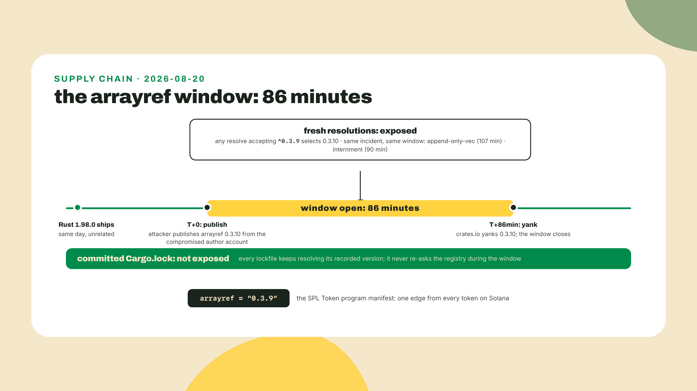
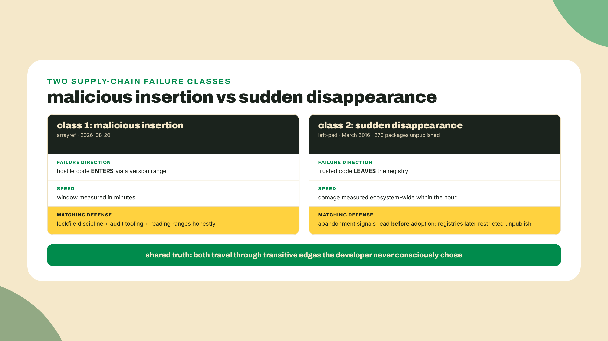
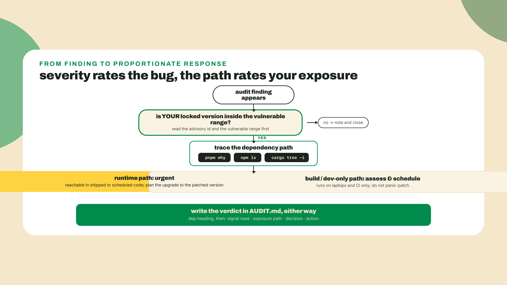
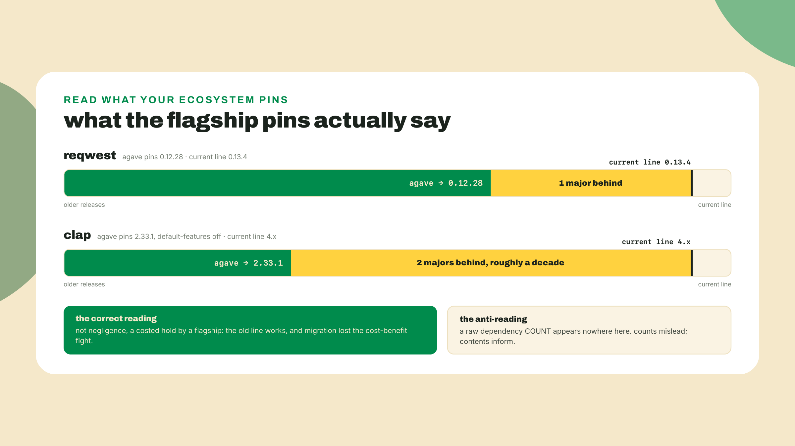
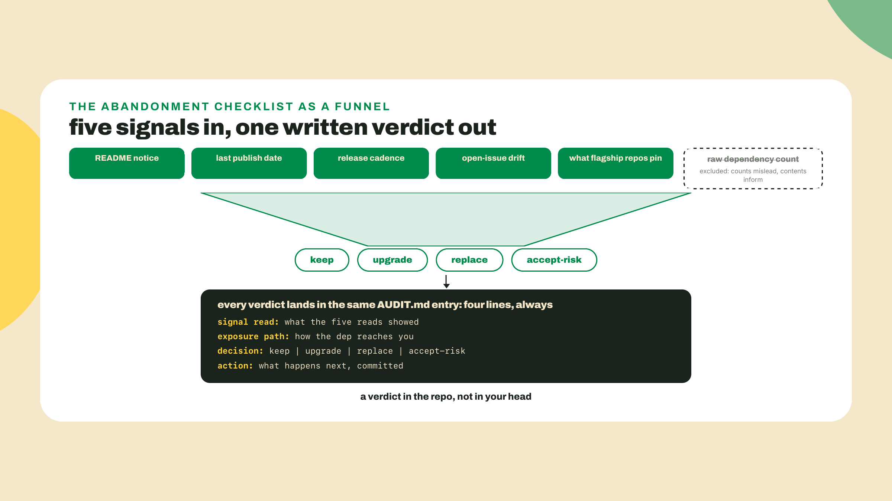
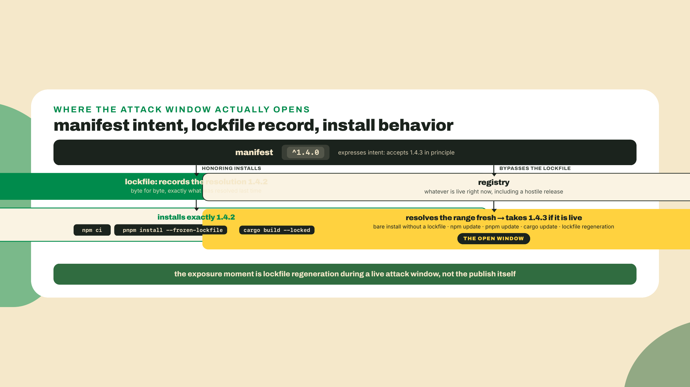
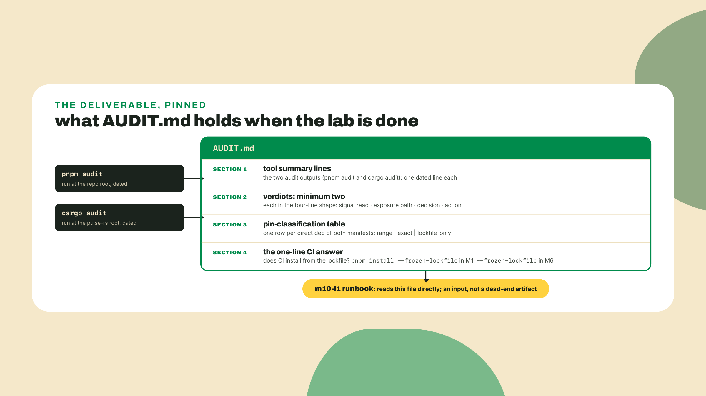
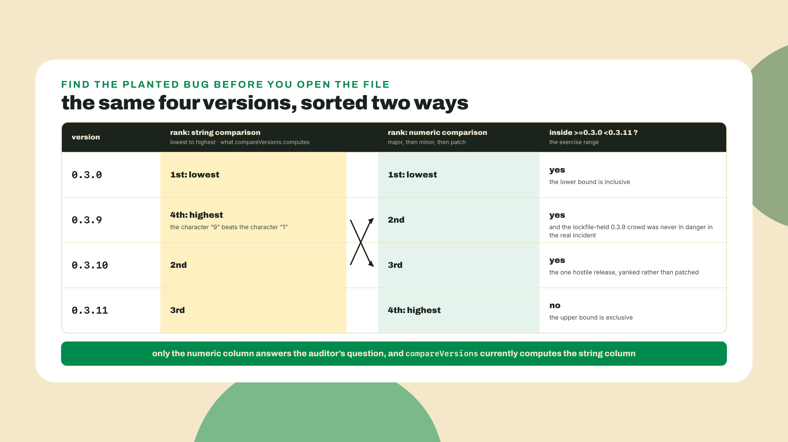

# Supply chain: the 86-minute attack

## Summary

m08-l4 proved the write path. The station signed and landed a real devnet SOL transfer with the kit pipe flow, `tx-check` holds the receipt, the airdrop honesty box got exercised for real, and the local-validator fallback is installed and was used at least once. Your stack reads the chain from both languages and can prove it lands transactions. So today we look at what all of that is standing on: five lockfiles (the TS workspace's, the Rust workspace's, the two edge projects' own, and `tx-check`'s, the standalone scaffold m08-l4 built around the signing keypair), several hundred packages you did not write, and a changelog that other people, some of them hostile, get to append to. This lesson you run `npm audit` and `cargo audit` against your own tree, learn to read what comes back down to advisory id, vulnerable range, and dependency path, formalize the sign-reading you did informally in m03-l4 into a checklist, pick a pin philosophy you can defend, and commit `AUDIT.md` to the station repo. How the reps run: one advisory read end to end with me, the checklist handed to you as an artifact, every verdict after the first written unguided. The capstone will take the checklist away too.

## The attack surface with a changelog

On 2026-08-20, the same day Rust 1.98.0 shipped, an attacker took over a crate author's account and republished `arrayref` as 0.3.10, with a build script that downloaded a payload. It was live for 86 minutes before being yanked. Why that date belongs in a Solana course: SPL Token's program manifest depends on `arrayref = "0.3.9"`. The malicious version sat one dependency edge from every token on Solana.

Before unpacking any of it, point the tools at your own tree. From the station repo root, where `pnpm-lock.yaml` lives:

```bash
pnpm audit
```

That is the canonical `npm audit` for a pnpm workspace: same registry audit endpoint, read from pnpm's lockfile. In any npm-locked repo the spelling is `npm audit`, and that is the spelling the wider ecosystem's docs describe; you learned in m03-l1 to read a repo's `packageManager` field before typing, and it pays off again here. Then the Rust side. `cargo audit` is a cargo subcommand you install once:

```bash
cargo install cargo-audit --locked
cd pulse-rs
cargo audit
```

(cargo-audit is at 0.22.2 as I write this, 2026-09-02; take whatever `cargo install` gives you. The `--locked` flag builds the tool from its own committed lockfile, which, given what this lesson is about, is the only respectable way to install an audit tool.) It fetches the RustSec advisory database and checks every crate in `Cargo.lock` against it, which is why you run it where the lockfile lives, the workspace root, not inside a member crate that has none.

Both commands will print either findings or a clean result. Hold whatever you got; by the end of the theory you will be able to read it properly, and either outcome passes this lesson. The gate is the written verdicts, not a lucky tree.

Now the story, told straight, because the timeline is the lesson.

### 86 minutes, minute by minute

The arrayref attack was not clever code. It was an account takeover: the attacker gained control of the author's crates.io account and published a new patch version of a crate that had not needed one. The malicious 0.3.10 did not even carry the payload in its own code: it added a dependency on a typosquatted proc-macro crate, and THAT crate's build script downloaded and executed the payload at compile time, which means the target was not the crate's users' users, it was every developer and CI machine that would compile the tree in the window. Two sibling crates from the same author went the same way in the same incident, append-only-vec for 107 minutes and internment for 90. Nextron Systems spotted it; the Rust security response yanked all three. The write-up lives at blog.rust-lang.org, dated 2026-08-20, and it is worth your ten minutes.

Sit with the SPL Token detail for a second, because it is the part that makes this a Solana lesson and not a general hygiene sermon. The manifest line `arrayref = "0.3.9"` looks like a pin. It is not. Cargo's bare version is caret semantics, meaning it accepts any semver-compatible upgrade, and 0.3.10 is compatible with 0.3.9 by the rules. Any fresh dependency resolution performed during those 86 minutes, a new clone, a CI job without a committed lockfile, a `cargo update`, would have selected the malicious version without anyone asking for it. Every committed `Cargo.lock` held the line at its recorded version and was never in danger. Same range, same window, two completely different outcomes, and the only variable was whether a lockfile stood between the manifest and the registry.



That is one of the two founding incidents. The other one is a decade older and failed in the opposite direction.

### Two ways a tree fails you

March 2016. A developer in a naming dispute unpublishes his 273 npm packages, one of them an eleven-line utility called left-pad, and builds break across the ecosystem within the hour, because thousands of packages, including the era's biggest frameworks, transitively depended on it. npm's own post-mortem, titled "kik, left-pad, and npm" and dated 2016-03-23, is still live, and it reads like the ecosystem discovering, in public, that its dependency graph was a shared load-bearing wall nobody had inspected.

Notice these are different failure classes. arrayref was malicious insertion: something new and hostile entered the tree through a version range. left-pad was sudden disappearance: something old and trusted left the tree, and everything leaning on it fell over. Your station's tree is exposed to both, in both ecosystems, and they call for different defenses. Insertion is what audit tools and lockfiles are for. Disappearance is what the abandonment checklist later in this lesson is for, because a package does not have to vanish in an afternoon to disappear; most of them just quietly stop being maintained, and the README is the last to know.



### Reading an audit report like an adult

Back to whatever your two commands printed. An audit finding, npm or cargo, has the same five load-bearing parts, and I want you to read them in a deliberate order, because the report's layout suggests the wrong one.

A finding carries an advisory id: GHSA-prefixed in the npm world, RUSTSEC-prefixed in the Rust world, a stable name you can look up, cite in `AUDIT.md`, and check back on next month. It carries a severity, one word like moderate or high. It carries a vulnerable range, the exact versions affected, written in the same comparator language as your manifests, something like `>=0.3.0 <0.3.11`. It carries a patched version, the smallest upgrade that exits the range. And it carries a dependency path, the chain of edges from something you chose to the thing that is vulnerable.

Here is the shape a cargo audit finding takes, fields labeled the way the tool prints them:

```text
Crate:     <name>
Version:   <the version your Cargo.lock resolved>
Title:     <one-line description of the vulnerability>
Date:      <advisory publication date>
ID:        RUSTSEC-<year>-<number>
Solution:  upgrade to >= <patched version>
Dependency tree:
<name> <version>
└── <the chain of crates that pulled it in, up to your own>
```

The order to read in: id, range, patched version, then the path, and only then the severity. Severity rates the bug in the abstract, as if every user of the crate ran it in the worst position. The path rates your exposure, and your exposure is the thing you are actually deciding about. A high-severity advisory sitting in a devDependency of your dashboard's build tooling never ships in the production bundle; it still runs on your laptop and in CI, so it is not nothing, but it is an assessment, not an outage. The same advisory on a runtime path in `pulse-fleet`, code that executes every thirty minutes with your credentials in scope, is a different morning. Same severity string, different decisions. Read the path before you act; the tools that print severity in red are optimizing for your attention, not your judgment.

The path is also the field you can interrogate directly, and these three commands are the audit reader's best friends:

```bash
pnpm why <package>
npm ls <package>
cargo tree -i <crate>
```

`pnpm why` and `npm ls` walk the path from your manifest down to the flagged package; `cargo tree -i` inverts the tree and walks up from the flagged crate to whatever of yours depends on it. Ten seconds with these beats ten minutes of scrolling report output.



One warning about the button the report offers you. `npm audit fix` will rewrite your tree to exit vulnerable ranges, and under `--force` it will apply semver-major bumps to do it. That is a tool proposing migrations, not applying patches. Read what it wants to change before you let it; a security fix that silently jumps a dependency two majors has traded a known vulnerability for unknown breakage, and you will find out which one costs more at the worst possible time.

And the deeper caveat, the one that makes the second half of this lesson exist: an audit is signal, not proof. The advisory database contains what someone found, verified, and filed. A clean report means no known advisory matches your lockfile. It does not mean your tree is safe; an abandoned crate that nobody is watching can be silently vulnerable forever, accumulating not safety but silence. cargo audit checks every crate in `Cargo.lock` against the database, nothing gets skipped for being unmaintained, so the blind spot is never in what the tool scans. It is in what the database knows.

### The abandonment checklist

Which is why the tool gets a partner. In m03-l4 you watched tsup, the long-reigning default TypeScript bundler, announce its own retirement in one README line: "This project is not actively maintained anymore. Please consider using tsdown." You read that sign in the wild once. Now we systematize the reading, because you were doing five checks by feel and a checklist is how a skill survives being handed to someone else, including future you at 2am.

For any dependency you are evaluating, existing or prospective, run these five reads:

| Signal | Where to look | What it tells you |
|---|---|---|
| README notice | the repo's front page, first screen | Maintainers who quit often say so. tsup did. Believe them the first time. |
| Last publish date | `npm view <pkg> time.modified`, crates.io page | Recency of the newest release. Old is not damning alone; old plus the other signals is. |
| Release cadence | the releases page, the CHANGELOG | A living project has a rhythm. A project whose rhythm stopped has a date of death, even without an announcement. |
| Open-issue drift | issues opened vs closed over recent months | Issues piling up unanswered means nobody is home, whatever the README claims. |
| What flagship repos pin | the manifests of the ecosystem's serious projects | The strongest signal, read on, because it cuts both ways. |

That last row deserves its own paragraph, and you have already met the evidence. reqwest's current line is 0.13.4, and agave, the validator implementation, still pins 0.12.28. agave also pins `clap = "2.33.1"` with default features off, the decade-old major you cold-read in m05-l2, while clap's current line is 4.x. You read both pins in m05-l2 and learned the cold read: a flagship holding an old version is not negligence, it is a costed decision by people with more at stake than you, and it tells you the old line still works and the upgrade has lost the cost-benefit fight so far. Now open `docs/pin-reads.md`, the three verdicts m05-l2 had you commit, and mark each one against the five-row checklist above, which you did not have when you wrote them. Where a row would have changed your verdict, say so in the file and date the revision rather than editing the original away. Grading your own cold read against a checklist you have since acquired is the cheapest calibration exercise in this course, and it only works because you wrote the verdict down before you knew the answer. "Read what your ecosystem pins" is evidence about maintenance reality and migration cost in both directions: a dep that flagships are fleeing is a warning, and a dep that flagships happily hold at an old major is load-bearing and stable there.

Now the correction that keeps the checklist honest, and it is one this course's own research had to make mid-stream: raw dependency counts are not on the list, on purpose. It is tempting to argue "this crate pulls in 30 packages, it is heavy and risky." Counting is how our research initially misjudged the Solana client crates; the "slim" RPC client turned out to carry more direct dependencies than the "kitchen-sink" one, because its deps were dozens of tiny type crates while the big one carried a full networking stack in fewer, heavier pieces. A learner who counts will reach the wrong verdict with full confidence. Read what the dependencies are, not how many there are. Counts mislead; contents inform.



Run the five reads and you land on one of four verdicts: keep, upgrade, replace, or accept-risk. Every verdict gets written down, and the shape is fixed, because a verdict that lives in your head is a mood, and a verdict in the repo is a decision the next person can audit:

```markdown
### <dependency>
- signal read: <the one or two signals that decided it>
- exposure path: <runtime, build-time, or dev-only, and the edge it enters through>
- decision: keep | upgrade | replace | accept-risk
- action: <the concrete next step, or "none, revisit <date>">
```

That written verdict is the real deliverable of this lesson, and it is the piece teams actually lack. Everyone runs audits. Almost nobody writes down what they decided about the results, so every alert gets re-litigated from scratch by whoever sees it next.



### Pins, ranges, and the lockfile that outranks both

Last piece of theory, and it is the one the 86 minutes were secretly about. You have three pinning instruments, and every one of them is just choosing which way you would rather be wrong.

Semver ranges, the `^1.4.0` in package.json and the bare `"0.3.9"` in Cargo.toml, auto-heal: a patched version ships and your next resolution takes it without a manifest edit. The same mechanism auto-ingests: a malicious version ships inside the range and your next resolution takes that too. The 86-minute window exists because ranges resolve forward; that is not a flaw in semver, it is the entire deal you signed.

Exact pins, `=0.3.9` in Cargo, `1.4.2` bare in npm, freeze known-good. They also freeze known-bad: the day a real vulnerability is patched, your exact pin holds you on the vulnerable version, silently, until a human edits a file. During the arrayref window an exact pin was armor. During the months after some future advisory, the same pin is the exposure.

And the lockfile is the real pin, with a condition attached. Your manifest range expresses intent; the lockfile records an actual resolution, byte for byte; and an install that honors the lockfile reproduces that resolution exactly, whatever the range would prefer today. The condition: the lockfile only protects installs that actually read it.

```bash
npm ci
pnpm install --frozen-lockfile
cargo build --locked
```

Those are the honoring spellings, and two of them are already in your station: the M1 Actions workflow ran `npm ci` from the day you wrote it until m03-l1 rewired it to `pnpm install --frozen-lockfile` when the workspace went pnpm, and the M6 Dockerfile installs with `--frozen-lockfile` too. One asymmetry to note before you audit any CI job against this list: cargo honors a committed `Cargo.lock` by default, so a plain `cargo build` or `cargo test` on a clone already installs the recorded versions, and `--locked` adds strictness (fail loudly instead of quietly updating when manifest and lockfile disagree) rather than switching lockfile-reading on. npm is the opposite; bare `npm install` will happily rewrite the lockfile, which is why `npm ci` exists. So an unflagged `cargo test` in a workflow is not forward-resolution exposure the way a bare `npm install` is; classify it accordingly when you write the CI line in step 5. A bare `npm install` on a fresh clone with no lockfile present resolves forward and would have eaten arrayref. Play the worked example through once, with npm numbers this time: your manifest says `^1.4.0`, your lockfile recorded 1.4.2, and a malicious 1.4.3 published this morning. Tonight's CI build under `npm ci` installs 1.4.2 and is fine. The dangerous moment is not the publish. It is the next `pnpm update`, the next lockfile regeneration, the next "let me just refresh deps while I am in here," performed while the malicious version is live. The window opens on your side of the registry.



So which instrument do you use? Per dependency class, and on purpose. Ranges plus a committed lockfile plus honoring installs is the sane default: you get auto-heal at the moments you choose, and reproduction everywhere else. Exact pins earn their place on dependencies where any surprise is unacceptable and you commit to manually tracking advisories, the same trade agave made with clap. And a lockfile without `npm ci` in CI is a decoration; check your workflows, not your intentions. There is no configuration in which you are not wrong somewhere. An attacker publishing into your range beats the range; a patch you never adopt beats the exact pin; a regenerated lockfile beats the lockfile. You are picking which failure mode you prefer per dependency class and writing the choice down, and that written choice is precisely what a verdict is. Security by paperwork sounds deflating until the paperwork is the only thing in the room that remembers why the pin is there.

**Go deeper (the 20%).** this lesson taught you to run the tools and read their output; the tools go deeper than one lesson. The cargo-audit docs at docs.rs/cargo-audit cover the fix subcommand, CI integration, and self-checks; cargo-deny at embarkstudios.github.io/cargo-deny extends auditing to license and source policy for teams that need bans and allowlists; and the npm audit reference at docs.npmjs.com (CLI commands, npm-audit) documents signature verification and the audit endpoint's exact behavior. All three URLs verified live 2026-09-02. Nothing in the lab below depends on the bookmarked material.

One honest scope note, no hand-off attached: everything above is dev-lifecycle supply-chain hygiene, protecting the code you build and ship. Smart-contract security, the auditing of on-chain program logic, is a different field entirely and this course does not teach it or pretend to.

## Lab

The audit layer goes over the whole estate: the TS workspace (fleet, core, dashboard), the Rust workspace (engine, CLI, and the pollerd daemon), the two edge projects riding along outside both, `pulse-edge-ts` (its own npm project since m07-l1, with its own `@solana/kit` install that the root lockfile knows nothing about) and `pulse-edge-rs`, and `tx-check`, the m08-l4 write-path scaffold, also its own npm project outside the workspace and the tree whose dependencies sit closest to a signing key. Five lockfiles, five passes. About 45 minutes. The worked part is step 3; from step 4 on, the checklist is yours and I am gone.

1. **Run the TS audit at the station repo root.** The root is where `pnpm-lock.yaml` lives, and the audit reads the lockfile, so location matters:

   ```bash
   pnpm audit
   ```

   Read the summary line before anything else: how many advisories, at what severities, across how many packages. In an npm-locked repo the same command is `npm audit`; our workspace went pnpm in m03-l1, and the audit follows the lockfile.

   Then do it again in `pulse-edge-ts`. That worker is its own npm project, created outside the workspace in m07-l1, so the root lockfile you just audited says nothing about it, including its own `@solana/kit` install. (Kit lives in the workspace too, since M8: the root install from m08-l1 and pulse-board's from m08-l2; `pnpm why @solana/kit` draws that half of the map in seconds. Same package, and by the end of this step three lockfiles' jurisdictions, which is exactly the who-covers-what reading this pass exists to teach.) `cd` there and run `npm audit`. Then the pass that matters most per byte: `cd` into `tx-check`, the standalone project m08-l4 scaffolded with `npm init -y`, and run `npm audit` on its lockfile too. That tree holds the kit pipeline that touches your signing keypair, and neither the root lockfile nor pulse-edge-ts's says a word about it; skip it and the sweep has audited everything except the code standing next to a private key. Three commands, three lockfiles, and the TypeScript half of the estate is covered. Two lockfiles are still untouched, both on the Rust side, both in the next step; "I audited the station" is not true until they are done, and the whole point of counting lockfiles is to notice that before you say it.

2. **Run the Rust audit at the pulse-rs workspace root.** Install first if you skipped the theory's install line:

   ```bash
   cargo install cargo-audit --locked
   cd pulse-rs
   cargo audit
   ```

   It scans `Cargo.lock` against the RustSec database, so the workspace root, where the lockfile lives, is the only correct place to stand. A member crate directory without its own lockfile gives you nothing. Then the fifth pass, and it is not optional for exactly the reason `tx-check` was not: `pulse-edge-rs` sits outside the workspace with its own `Cargo.lock` from m07-l2, so nothing you have run so far says a word about it. `cd` there and run `cargo audit` again. Five lockfiles, five passes, and now the sentence from step 1 is true.

3. **Read one finding end to end, with me.** If either tool flagged something, that is your specimen. Read the advisory id and say it out loud. Read the vulnerable range and check your locked version against it. Read the patched version. Then trace the path: `pnpm why <package>` or `cargo tree -i <crate>`, and classify the exposure: runtime, build-time, or dev-only. Now write the verdict in the four-line shape from the theory. If both tools came back clean, likely, since this stack is fresh, the worked rep runs on the checklist instead: pick one dependency from either lockfile, run all five abandonment reads on it for real (`npm view <pkg> time.modified`, the releases page, the issue tracker, the flagship manifests), and write the same four-line verdict. Either way you have now produced one verdict with supervision. That was the last supervised one.

4. **Write `AUDIT.md` at the station repo root.** Structure it as: the two tool summary lines with today's date, then your verdicts. Minimum two verdicts, each a dependency heading over the template's four fields: signal read, exposure path, decision, action. Real findings first if you have them; if the tree is clean, choose two dependencies deliberately, one from each lockfile, and run the checklist against them. Choose at least one you have never consciously thought about. The gate never depends on the advisory database's mood.

5. **The pin-classification pass.** Open both manifests and both lockfiles. For every direct dependency of the TS packages and the Rust workspace, classify what the MANIFEST says: a range (caret, tilde, or comparators), an exact pin, or a specifier so loose (bare, wildcard, or absent constraint) that the lockfile is doing all the pinning work; call that third label lockfile-only. Yes, with a committed lockfile every ranged dep is ALSO pinned in practice; the classification is about the manifest's stated intent, and the third label is reserved for deps whose manifest states none. One table in `AUDIT.md`, one row per direct dep. Then answer the question that decides whether any of it matters, in one written line: does CI install from the lockfile? Check the M1 workflow for `pnpm install --frozen-lockfile` (the m03-l1 rewire; `npm ci`'s job in pnpm spelling), the M6 Dockerfile for `--frozen-lockfile`, and note what you find. A lockfile nobody installs from enforces nothing.



6. **Commit.**

   ```bash
   git add AUDIT.md
   git commit -m "audit layer: tool reports, verdicts, pin classification"
   git push
   ```

   This file is not a one-off. The m10-l1 runbook consumes it directly.

7. **Optional extension, clearly optional: a non-gating CI report.** Add an audit step to the M1 workflow that reports but never fails the build:

   ```yaml
   - name: dependency audit (report only)
     run: pnpm audit || true
   ```

   (`npm audit || true` in an npm-locked repo.) Non-gating is deliberate for now: you have not yet decided, as policy, which findings should block a merge, and a gate you have not reasoned about is a gate you will bypass the first time it annoys you. The runbook lesson revisits the question with your verdicts in hand. This edit lands after step 6's commit, so give it its own: `git add .github && git commit -m "ci: report-only dependency audit"` and push.

Acceptance bar, plainly: both audit commands ran at the correct roots with output you can show; `AUDIT.md` exists and is committed, with at least two verdicts in the four-part shape and the pin-classification table covering every direct dependency of both manifests; and the one-line CI answer is written down.

## Challenge

Open `pnpm-lock.yaml` and pick a transitive dependency you have never heard of. Not one you chose; one that arrived as a dependency of a dependency, the kind of name that makes you go "what is that and why do I ship it." Run the full five-signal checklist against it, cold: README, last publish, cadence, issue drift, who else pins it. Write its four-line verdict and add it to `AUDIT.md`. No scaffold and no peeking back at my worked read. The point of the drill is that the method works on total strangers, because your tree is mostly total strangers, and after today that stops being an uncomfortable fact you avoid and starts being a list you work through.

Then a second rep, in code, because the range check you did by eye in step 3 is exactly one function: the semver-vuln-matcher challenge, in this lesson's coding-challenge panel like every graded rep in this course. An advisory names a vulnerable range like `>=0.3.0 <0.3.11`, and the auditor's question is whether your installed version sits inside it. One honesty note on that range before you trust it as history: it is written in advisory grammar and borrows the arrayref version numbers, but it is an exercise range, not the real incident's advisory. The actual incident had exactly one hostile release, 0.3.10, yanked rather than patched (no 0.3.11 ever shipped as a fix), and the lockfile-held 0.3.9 crowd was never in danger. The exercise range exists because it puts a single-digit patch and a double-digit patch on either side of a boundary, which is precisely where the planted bug lies: the starter's `isVulnerable` and its range parsing are done, and the bug lives in `compareVersions`, which compares version strings as strings, and lexicographically `'0.3.9'` sorts above `'0.3.10'`, because the character `'9'` beats `'1'`. Fix it to compare numerically, component by component, major then minor then patch. Seven tests grade it, opening with the incident's digits: the malicious `0.3.10` must land inside the exercise range and `0.3.11` outside it. The hints in the starter escalate from where the string comparison lies to the missing-component edge; spend them in order.



## Checkpoint

What you can now do, concretely: run `npm audit` and `cargo audit` at the roots where their lockfiles live and say why the root matters; read a finding in the right order, id, range, patch, path, and only then severity, and classify exposure as runtime, build-time, or dev-only before reacting; run the five-signal abandonment checklist on any package, including one you have never seen; explain what a clean audit does and does not tell you; and defend a pin philosophy per dependency class, including exactly which install commands make the lockfile real.

The 30-second retrieval before you close the tab: during the 86 minutes arrayref 0.3.10 was live, who was exposed and who was not, and what single artifact made the difference? (Fresh resolutions inside the compatible range were exposed; every install honoring a committed lockfile was not. The lockfile was the difference, and only because something installed from it.) If you had to look back up, reread the layered install diagram; that one picture is this lesson.

One ask while it is fresh: if both of your audits came back clean, tell me in the feedback whether the checklist-driven verdicts in step 4 felt like real work or busywork. The step exists so the gate never depends on the advisory database having a bad week, but if it read as filler to most of you, the next revision picks the two deps for you and makes them nastier.

Your dependency tree now has a written audit trail: tools run at the right roots, verdicts a stranger could follow, pins classified and enforced on purpose. But the station itself is still running on trust. If the poller silently dies tonight, if the cron stops firing, nothing anywhere makes a sound. Next lesson the station learns to observe itself: structured logs that answer questions instead of narrating, each platform's log reality read honestly, and an alarm wired to the one failure nobody's dashboard shows, the monitor's own death.
