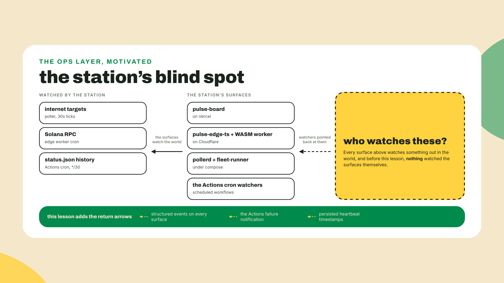
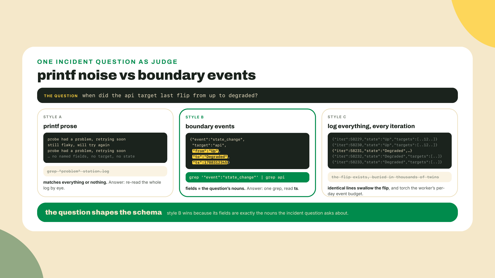
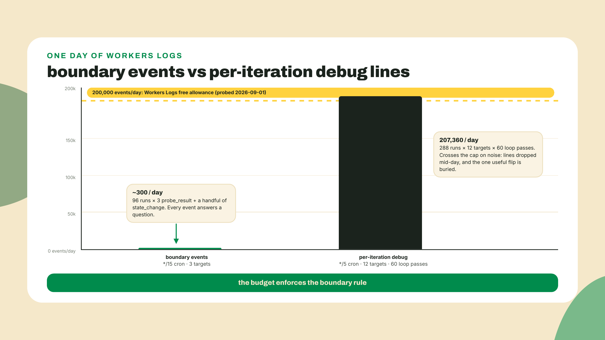
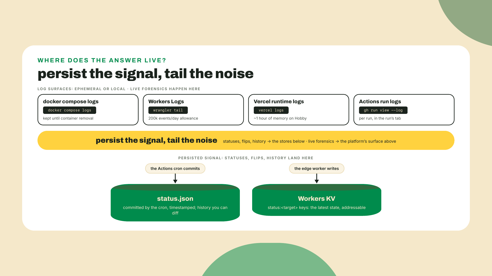
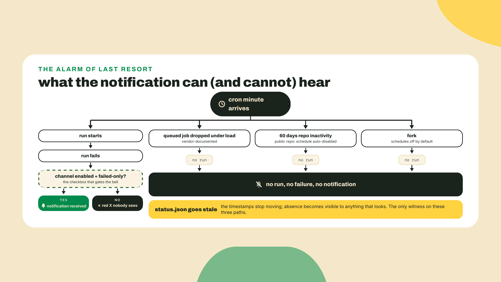
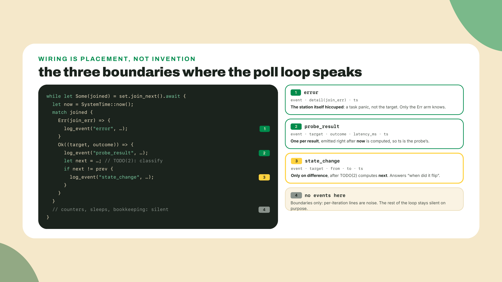
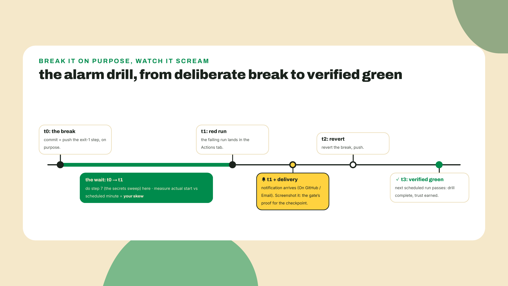

# Observe the observer: logs, errors, alarms

## Summary

m09-l1 audited the tree: `npm audit` and `cargo audit` ran at both workspace roots, AUDIT.md landed with keep, upgrade, replace, or accept-risk verdicts, and both lockfiles got a pin-philosophy read. The station's dependencies now have a paper trail. Today the station itself gets one. You will make the poller emit structured JSON log events at its boundaries, give the TS fleet and the edge worker the same event shape, learn each platform's free-tier log reality as a design constraint, turn on the one alarm that fires when a scheduled run fails (and meet the three silent deaths it structurally cannot hear), and finish the four-platform secrets sweep as a single table. The fade contract, out loud: this is the checklists-over-walkthroughs rung, the last scaffold of the course. The event shape is given once as a field list, one incident grep is worked in full, and the poller wiring, worker wiring, notification setup, and sweep table are yours to drive from checklists on surfaces you have already shipped. After this, m10-l1 hands you a blank page and asks for the whole station from memory.

## Nothing watches the watcher

Your station watches a Vercel dashboard, two edge workers, a Docker poller, and a blockchain. Count the watchers pointed back at it: zero. If the poller dies at 3 a.m., or the cron silently stops firing, the only witness is an absence, and absences do not send emails. Module 6 called a monitor you have to remember to invoke a rumor with a command line. Same knife, one level up: an unobserved monitor is just a rumor.

Let's make the poller talk first and theorize after. Open `crates/pulse-pollerd/src/main.rs` and add one helper above `poll_loop` (serde_json is already a dependency from m06-l1, nothing to install):

```rust
use serde_json::json;

fn log_event(value: serde_json::Value) {
    println!("{value}");
}
```

Then, in the drain loop, right after the point where `now` is computed and before the `map.insert` that writes the target's status, emit one event per probe result:

```rust
let outcome = if ok { "up" } else { "down" };
log_event(json!({
    "event": "probe_result",
    "target": name,
    "outcome": outcome,
    "latency_ms": latency_ms,
    "ts": now,
}));
```

Run `cargo run -p pulse-pollerd`, give it one 30-second tick, and watch the raw lines land among the rest of the output. Then Ctrl-C it (one daemon at a time; it owns port 8080) and run it again, filtered:

```bash
cargo run -p pulse-pollerd 2>/dev/null | grep '"event":"probe_result"'
```

One JSON line per probe, machine-filterable, each carrying who, what, how fast, and when. That is the whole trick of this lesson, performed in the first ten minutes. The rest is doing it deliberately, on every surface, and then making sure the station's own death is at least as loud as its targets'.



### Events, not prose

Here is the 3 a.m. question this lesson keeps returning to: "when did the api target last flip from up to degraded?" Now look at the two logging styles that could try to answer it. The first is what most of us write by instinct, and I have been guilty of it for years: `println!("probe had a problem, retrying soon")`. Prose. Warm, readable top to bottom, and useless at 3 a.m., because "a problem" matches everything and anchors nothing. The second style treats the question as the schema: a state change is an event, with a target, a from, a to, and a timestamp, so the incident query is one grep with the field name in it.

The station's event shape, given once, here, as the contract all three logging surfaces share:

- Every event carries `event` (one of `probe_result`, `state_change`, `error`), `target`, and `ts` (unix seconds).
- `probe_result` adds `outcome` (`up` or `down`) and `latency_ms`.
- `state_change` adds `from` and `to`, spelled in the emitting surface's own vocabulary: engine names (`Pending`, `Up`, `Degraded`, `Down`) on the poller, ProbeResult variant names on the fleet, verdict names on the edge; stable names within a surface, not one shared enum.
- `error` adds `message`, and means the station itself hiccuped, not that a target went down. A down target is a `probe_result`; a panicked probe task is an `error`. Keeping those apart is what makes the error stream worth alarming on. When the failing surface is a chain read, `error` also carries `plane`, the four-verdict string from the `plane()` method m08-l3 made you write, because a chain read sits right on the seam between station-hiccuped and target-down, and the plane is what lets the 3 a.m. reader rule which side.

One line per event, to stdout, and nothing else. In the Rust poller that is plain `serde_json` line-writing through the helper you just added, deliberately not a framework. In the fleet and the worker it is `console.log(JSON.stringify(...))`. Stdout matters more than it looks: the Docker logging pipeline, `wrangler tail`, and the Actions run log are all just readers of standard output, so by writing lines there you inherit three platforms' log plumbing for free.



Why boundaries and not everything? Because a log event is a claim that something changed at an edge worth remembering: a result came back, a state flipped, the station itself failed. A line per loop iteration records that time passed. Volume is not answerability. You will feel the difference the moment you grep a week of compose logs, and your wallet will feel it on the worker side. The name is older than computing: the ship's logbook is named for the literal log sailors threw overboard to measure speed, a boundary measurement with a timestamp. Sailors did not journal every wave.

You may have noticed what the field list leaves out: log levels. No `debug`, `info`, `warn` dial anywhere. That is a decision, not an oversight. Levels answer "how loudly should I say this", and for a station with three boundary kinds the event name already answers it: `probe_result` is routine, `state_change` is notable, `error` is the station asking for attention. A severity dial earns its keep when one process emits dozens of event kinds from ten subsystems and you need to turn whole categories down without redeploying. Until the station is that world (the `tracing` crate in the go-deeper box), a level field would be one more decision per call site buying nothing a grep on `event` does not already give you.

Structured logging also has a cost, and naming it is only fair: ceremony. `log_event(json!({...}))` is uglier than a print statement, every field is a small decision, and none of it makes the happy path run better. You pay that tax precisely so the 3 a.m. grep works. Observability is insurance, and insurance is boring right up until the night it isn't.

### Four platforms, four memories

The station now logs. Where those logs go, and how long they live, differs per platform, and the free tiers are honest about being partial. Constraints, not complaints:

**Docker, local.** `docker logs <container>` and `docker compose logs <service>` read everything a container ever wrote to stdout, kept until the container is removed. Add `-f` to follow live. This is your longest local memory and the surface the incident grep drill below runs against.

**Cloudflare Workers.** Two tools. `npx wrangler tail` streams live events from every city your worker runs in, your only real-time forensics on a platform with no ssh. And Workers Logs collects events with a free allowance of 200,000 events per day (per Cloudflare's pricing page, probed 2026-09-01). That number sounds enormous until you do loop arithmetic. A hypothetical chatty worker on a 5-minute cron makes 288 runs a day; give it a dozen targets and a debug line per target per inner-loop pass, say 60 passes, and 288 × 12 × 60 is 207,360 lines. Over budget, on noise. Requests and log events are separate meters, so your traffic can be nowhere near its cap while your logs get dropped mid-afternoon. The budget is the platform enforcing this lesson's own rule: log at boundaries and the same day costs a few hundred events.



**Vercel.** On Hobby, runtime logs are retained for roughly an hour (per Vercel's limits docs, checked 2026-09-01). Sit with that: a user reports your function erroring Saturday morning, you open the dashboard Monday, and you find roughly nothing. By design. Our board is static files today, so what the station has on Vercel right now are build logs, but this constraint is inherited the day the board grows its first function, and it reframes what platform logs are for. Since 2025-04-23, when Vercel flipped Fluid compute on by default, serverless there has quietly meant "servers you don't manage": concurrency inside instances, Active CPU billing, and the same deal on history. The platform runs your function. It does not archive your past.

**GitHub Actions.** Each run keeps its full log in the Actions tab, per run, browsable after the fact. This is where your cron's stdout lands, step by step, and where you will read the alarm drill's red run. It is also the only one of the four surfaces that records when a run actually started versus when it was scheduled to, which makes it the raw data for the skew measurement in the lab. One habit transfers unchanged: if your workflow prints structured events, the run log inherits them, and a grep over a downloaded log answers questions the same way `docker compose logs` does.

The seam sentence that organizes all four, and the design your station already follows without having named it: **persist the signal, tail the noise.** Anything the station must remember lives in `status.json` and KV, written there on purpose, since module 1. Logs are for the question of the moment, tailed live or grepped recent. If you catch yourself needing a log line from last Saturday, that line was a signal wearing a log costume, and it belongs in the persisted state instead. Monday-morning archaeology of Saturday's incident from free-tier platform logs alone is impossible on purpose.



### The alarm of last resort

Now the sharpest beat of the lesson. Suppose your cron workflow fails at 3 a.m. tonight, with everything at its defaults. What does GitHub do? Probably nothing you will see. The Actions notification channel defaults to "Don't notify". There is a red X in a tab you are not looking at, and that is the entire alert. An unconfigured alarm is not an alarm; it is a decoration with an opinion.

Turning it on is a settings walk, required in the lab below: Notification settings, then **System**, then **Actions**, pick a delivery channel (On GitHub, Email, or both), and check **Only notify for failed workflows**, because a green-run email every 30 minutes trains you to delete exactly the message that will one day matter.

Two behaviors of this channel are worth knowing before you own a shared repo. Notifications for scheduled workflows go to the workflow's creator, the account that first committed the cron. And per GitHub's docs, if a scheduled workflow is disabled and then re-enabled, notifications go to the user who re-enabled it rather than the user who last modified the cron syntax. In a solo station that is trivia. In any shared repo, it means the pager can silently change hands through an innocent toggle, so know who owns it.

And now the honest part, the reason this alarm is "of last resort" and not just "the alarm". A failure notification requires a run that runs and fails. GitHub's own docs, verbatim: "Scheduled events can be delayed during periods of high loads of GitHub Actions workflow runs. High load times include the start of every hour. If the load is sufficiently high enough, some queued jobs may be dropped." Best effort, in writing, from the vendor. A dropped run produces no red X and no email. Neither does the 60-day trap you met in m01-l3: in a public repo, 60 days without repository activity and the schedule switches off, cleanly, with nothing failing. The keepalive commit you learned there as the countermeasure keeps its m01-l3 hedge in full force here: community practice says commits reset the clock, purpose-built keepalive actions exist because enough people believe it, and GitHub has never defined what "activity" means, so it stays reported-in-practice, never policy. Forks start with schedules off entirely. Three documented ways the heartbeat stops in pure silence, and the notification channel is structurally deaf to all of them.

How big is the schedule delay when jobs do run? I have not quoted a number, and I won't: GitHub documents that delay exists and never documents its size. This is the same discipline as the chain the station watches. Solana targets 300ms slots; on 2026-09-01 a 20-sample probe of the real network measured 316ms. Systems have targets, and you measure anyway. Your cron has a target minute (and a floor: the shortest interval GitHub schedules is 5 minutes), so the lab has you measure your own skew from the run history instead of trusting a number nobody published.

So the alarm gets a backstop the platform cannot drop: the heartbeat persists where absence is visible. Every cron run commits `status.json` with timestamps. A run that never happens leaves the file stale, and staleness is a fact anything can check: you, glancing at the board's data age; or a future probe, treating your own repo as a target. The notification catches loud deaths. The timestamps catch quiet ones. Naming what the alarm cannot catch is not a caveat on the ops lesson; it is the ops lesson.



### Never log the environment

One rule ties the logging beat to the secrets beat, and it is short enough to memorize: never log the environment. Not `process.env`, not `std::env::vars()`, not an error object that helpfully embeds its config context. The sweep you are about to complete exists to keep secrets out of git; a log line that serializes the environment copies them into retained logs instead, which on some platforms outlive the incident and on all platforms travel further than you think. Your event schema is your ally here: the four field lists above contain no field that could carry a secret, so as long as boundaries emit only the schema, the sweep and the logs stay in agreement.

The sweep itself is the lesson's fourth beat and the lab's quietest deliverable: one table, four platforms, answering "where does each secret live so it never lands in git or a log line". You have met every row already, one platform at a time: repo secrets feeding workflow env in module 1, `vercel env pull` in module 3, `.dev.vars` plus `npx wrangler secret put` in module 7 with a promise that m09-l2 would sweep it across all four. This is that sweep. New to the table are only the operating notes, including one hard limit worth writing down: Vercel caps the total size of your environment variables, names and values, at 64KB. The table format is in the lab; it should read like something you would tape to the monitor, because that is roughly its job.

**Go deeper (the 20%).** this lesson teaches structured logging as plain serde_json line-writing, which is the right size for one daemon with one stdout. The Rust ecosystem's deeper answer is the `tracing` crate: spans, levels, subscribers, structured fields threaded through async call stacks, the thing you reach for when one request touches ten functions and you want the story reassembled. Its front door is [https://docs.rs/tracing/latest/tracing/](https://docs.rs/tracing/latest/tracing/) (URL checked 2026-09-02). Bookmark it, read it when the station grows past one process's worth of story. Nothing in the lab below depends on it.

## Lab: the ops layer

The fade, stated once more so nobody is surprised mid-lab: one drill is worked in full (the incident grep in step 3). Everything else is a checklist against code and platforms you already own. Budget half your time for steps 5 through 7; one of them waits on a cron on purpose.

1. **Finish the poller's events.** You emitted `probe_result` in the opener. Three emits remain, driven by the field list from the theory section: two fresh boundaries and one debt m08-l3 pre-paid:

   - `state_change`: your drain loop computes the next state inline, inside the `map.insert` call (`state: next_state(prev, ok, count)`), so hoist it first: `let next = next_state(prev, ok, count);` above the insert, with `next` in the struct literal. The emit goes between the hoisted line and the insert, only on difference from `prev`. The fragment, where `next` is your hoisted state:

   ```rust
   if next != prev {
       log_event(json!({
           "event": "state_change",
           "target": name,
           "from": prev,
           "to": next,
           "ts": now,
       }));
   }
   ```

   If the compiler objects that `ProbeState` cannot be compared with `!=`, add `PartialEq` to the engine enum's derive list, the same one-word move as adding `Serialize` in m06-l1.

   - `error`: the drain loop's `let ... else` skip currently swallows the one genuine station-level failure it sees, a panicked probe task, without a trace. Swap it for a match so the `Err` arm can speak before it skips:

   ```rust
   let (name, ok, latency_ms) = match joined {
       Ok(result) => result,
       Err(join_err) => {
           log_event(json!({
               "event": "error",
               "message": join_err.to_string(),
               "target": "pollerd",
               "ts": SystemTime::now()
                   .duration_since(UNIX_EPOCH)
                   .expect("system clock is set before 1970")
                   .as_secs(),
           }));
           continue;
       }
   };
   ```

   (No new imports needed for that arm: `SystemTime` and `UNIX_EPOCH` have sat in this file's `use std::time::{...}` line since the m06-l1 skeleton.)

   - chain `error`, the boundary m08-l3 pre-paid: your `chain_loop` already folds each failure's plane into `last_error` for `/status`; give the same failures a voice on stdout. In the failure path, after both awaits have finished and before the lock is taken, emit one event per `Err` you are holding. Your variable names are your own; the shape is one emit per failed read, and the balance read gets this block's twin:

   ```rust
   if let Err(e) = &slot {
       log_event(json!({
           "event": "error",
           "target": "chain",
           "plane": e.plane(),
           "message": e.to_string(),
           "ts": now,
       }));
   }
   ```

   This is the moment m08-l3 promised when it made you write `plane()`: four static strings, now greppable names on the log stream. Point the poller at that lesson's unresolvable RPC URL and one tick prints (your own 2 a.m. message where mine is; the plane in front is the part the enum guarantees):

   ```text
   {"event":"error","message":"could not reach the RPC endpoint: error sending request for url (https://rpc.invalid/)","plane":"transport","target":"chain","ts":1788350402}
   ```

   And the 3 a.m. difference between "the RPC was down" and "we were parsing it wrong" is now `grep '"plane":"transport"'` versus `grep '"plane":"shape"'`: one grep instead of one afternoon, exactly as billed.

   `cargo run -p pulse-pollerd` and confirm the probe lines still flow. Checkpoint: one tick produces one `probe_result` line per target, the first tick after boot produces `state_change` lines announcing `Pending` targets waking up, and a sabotaged RPC URL produces `error` events wearing their plane.



2. **Rebuild under compose.** From the repo root: `docker compose up --build -d`, then prove the pipeline end to end:

   ```bash
   docker compose logs pollerd | grep '"event":"probe_result"' | tail -n 3
   ```

   Three JSON event lines, each carrying `target`, `outcome`, and `latency_ms`. That command is also this lesson's verify gate, so make it pass before moving on. Note what you did not build: the poller writes stdout, and Docker's logging pipeline does the collection, storage, and replay for free.

3. **The incident grep, worked.** Stage a real incident without touching a line of code: cut the poller's cable. Find your compose network and container, then disconnect:

   ```bash
   docker network ls          # note the <project>_default network name
   docker network disconnect <project>_default $(docker compose ps -q pollerd)
   ```

   Give it two ticks (65 seconds is comfortable), reconnect with the same command and `connect`, and give it one more tick to recover. Your targets just lived through a full episode: up, degraded, up. Now answer the 3 a.m. question with one pipeline:

   ```bash
   docker compose logs pollerd | grep '"event":"state_change"' | grep '"to":"Degraded"'
   ```

   Each hit is one flip, timestamped. Read the `ts` of the last one and convert it (macOS: `date -r <ts>`; Linux, GNU spelling: `date -d @<ts>`). The grep plus its one matching line is a complete incident report. Then run the recovery question yourself, same pipeline, `"to":"Up"`, and check the recovery followed the reconnect. Thirty seconds, no dashboard, no ssh. Grep is the entire query engine, which is exactly the point of one-line JSON events.

4. **Same shape, TS surfaces.** Checklist, no walkthrough:

   - In the fleet's interval service mode, log one `probe_result` per report, and a `state_change` when a target's variant differs from the previous pass (`from`/`to` carry ProbeResult variant names; the fleet has no engine states). The whole helper is one line: `const logEvent = (e: Record<string, unknown>): void => { console.log(JSON.stringify(e)); };`
   - In `pulse-edge-ts`, replace the m07-l1 verdict line (`` console.log(`${target.name}: ${entry.verdict}`) ``, prose, as charged) with the event shape: `event`, `target`, `outcome` mapped from your entry's verdict (`up` stays `up`; anything else maps to `down`; the full verdict already lives in the KV snapshot), `latency_ms` if your entry measured one, and `ts: Math.floor(Date.now() / 1000)` to match the poller's seconds.
   - Deploy, then watch it live: `npx wrangler tail`, force the cron once locally or wait out the quarter hour, and confirm the events arrive as JSON, not prose.
   - Budget check while you are here: with boundary events, your worker's day is a few hundred events against the 200,000 allowance. Leave a margin note in the code above `logEvent` saying so, for the future you tempted to add a debug line inside a loop.

   First rebuild, or the checkpoint fails with no stated cause: fleet-runner still runs step 2's image. `docker compose up --build -d fleet-runner`, then one tick. Checkpoint: `docker compose logs fleet-runner | grep '"event":"probe_result"'` FINDS matching event lines (matches are the pass condition here, the mirror image of the secrets grep later, where silence is), and `wrangler tail` shows the same shape from the edge.

5. **Turn the alarm on.** GitHub, Notification settings, **System**, **Actions**: set delivery (On GitHub, Email, or both) and check **Only notify for failed workflows**. Two footnotes from the theory section belong in your head as you click: this channel defaulted to "Don't notify" until just now, and scheduled-run notifications bind to the workflow's creator, today you; note it in the table for any future shared repo.

6. **The alarm drill.** An alarm you have never heard is a hypothesis. Break the cron on purpose: add a step with `run: exit 1` at the top of the station workflow's job, commit, push. Then let the schedule fire it, not your push, because the scheduled path is the one the alarm exists for. Expect one decoy first: your workflow also triggers on push, so the exit-1 commit itself produces an immediate red run and, with notifications freshly on, likely an email within minutes. That one is NOT the proof; the gate's evidence is the scheduled failure, and the Actions tab's event column (schedule versus push) is how you tell them apart. While you wait, do step 7. When the red run lands, three things to collect: the notification itself (screen or email, this is the gate's proof), the run's log in the Actions tab showing your deliberate failure, and one measurement. Compare the run's actual start time against the cron's scheduled minute, for the last few runs while you are there, and write the skew down in a comment in the workflow file. That number is yours, measured. Then revert the breaking commit, and watch the next run go green. Broken, heard, fixed, verified: that cycle is the drill, and you only trust alarms you have heard.



7. **The secrets sweep.** Create `SECRETS.md` in the station repo (or a section of your runbook, m10-l1 will absorb it either way) and complete this table for your actual station, one honest row per platform:

   | Platform | Committed config | Local dev | Production secrets | Operating notes |
   |---|---|---|---|---|
   | GitHub Actions | workflow YAML, no values | n/a, runs remote | repo secrets, injected via `env:` | notifications bind to the workflow's creator; disable then re-enable reassigns them; public-repo schedules auto-disable after 60 idle days |
   | Vercel | `vercel.json` | `vercel env pull` into gitignored `.env.local` | per-environment env vars, dashboard or CLI | total size of env vars, names and values, capped at 64KB; `VITE_`-prefixed values are baked into the public bundle by design |
   | Cloudflare | wrangler config, `vars` for public config only | `.dev.vars`, gitignored | `npx wrangler secret put <KEY>` | write-only after set; visible as a name, never a value |
   | Docker / local | `compose.yaml`, Dockerfile, no `ENV` secrets | `--env-file` / compose `env_file`, `node --env-file` for bare Node | not a prod platform here; images stay secret-free | `docker history` prints every image layer, including any `ENV` you baked in |

   Then verify the table's central claim mechanically: `git grep -i` for your actual secret names and values finds binding names only, never a value, in the repo, the wrangler config, and every Dockerfile. Cross-check the anti-leak rule from theory: skim your three `logEvent`/`log_event` call sites and confirm no call serializes an environment, a config object, or a caught error's full context.

8. **Commit the ops layer.** Nothing above committed itself, and m10-l1 assumes this state is in the repo:

   ```bash
   git add -A
   git commit -m "ops layer: structured events, alarm drill, secrets sweep"
   git push
   ```

## Challenge

Fully yours. Pick one incident question your current events cannot answer. The worked example of the genre: "how long was the last degraded episode?", which today requires eyeballing two greps and doing timestamp arithmetic by hand. Choose your question, then add the one event or field that makes it answerable with a single grep (for the example: a `recovered` field on the up-flip carrying seconds-since-degraded, or a dedicated `episode` event at recovery). Re-stage the network-disconnect incident and demonstrate the grep answering your question in one line. Acceptance: the new field or event appears in exactly one boundary's emit, the schema stays secret-free, and the answering pipeline is a single command you paste into `SECRETS.md` under a new `## Incident queries` heading, the first entry of a list that will grow (m10-l1's runbook absorbs the whole file; re-commit after pasting).

## Checkpoint

The gate, three proofs, matching the lesson's three promises. One: the incident grep, `docker compose logs pollerd` piped through a `state_change` filter, answers "when did target X last go degraded" with a matching JSON line. Two: the alarm drill produced a real notification from a deliberately failed scheduled run, and the run after the fix is green. Three: `SECRETS.md` covers all four platforms and the repo greps clean of secret values. If all three hold, the station is observed, alarmed, and hygienic.

The 30-second retrieval before you close the tab: which three ways can the cron stop with no failure notification, and where does the station's defense against silent death live? You are reaching for: dropped under load, 60-day auto-disable, fork default-off; and the persisted heartbeat, `status.json` timestamps, where absence is visible to anything that looks.

If a platform's log surface behaved differently than this lesson claimed (retention windows and allowances are the churniest facts in this course, and vendors move them without ceremony), send the platform and what you saw through the course feedback; the constraint boxes above get re-probed from exactly those reports.

Every rung on the ladder is now built: the station is audited, observed, and alarmed. One thing has never happened. All of it, assembled and verified end to end, as one system, from memory. That is the capstone, and it opens with you drawing the whole station, every component and every edge, on a blank page before you wire the final panel. Bring a blank page.
