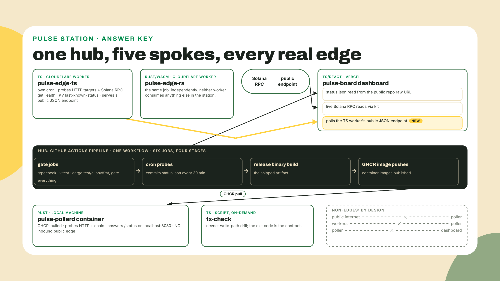
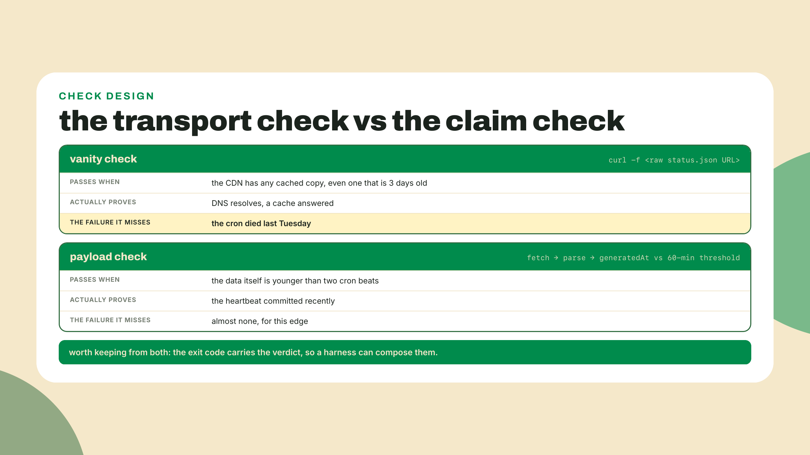
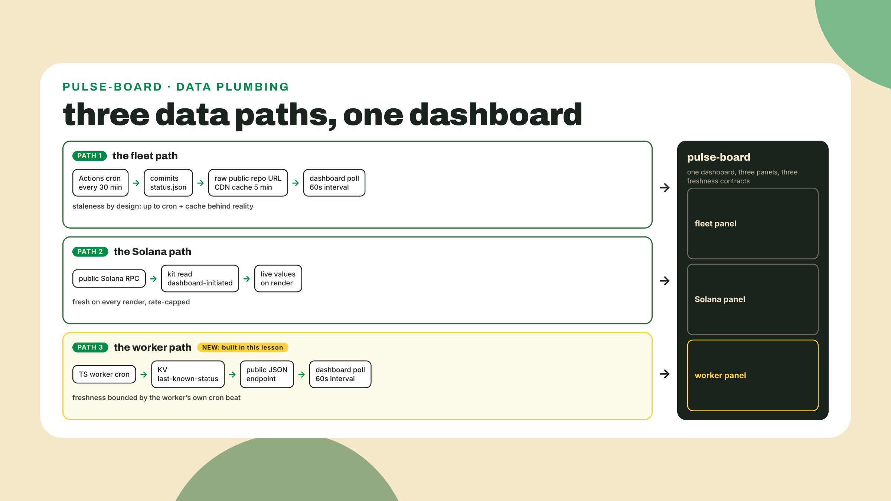
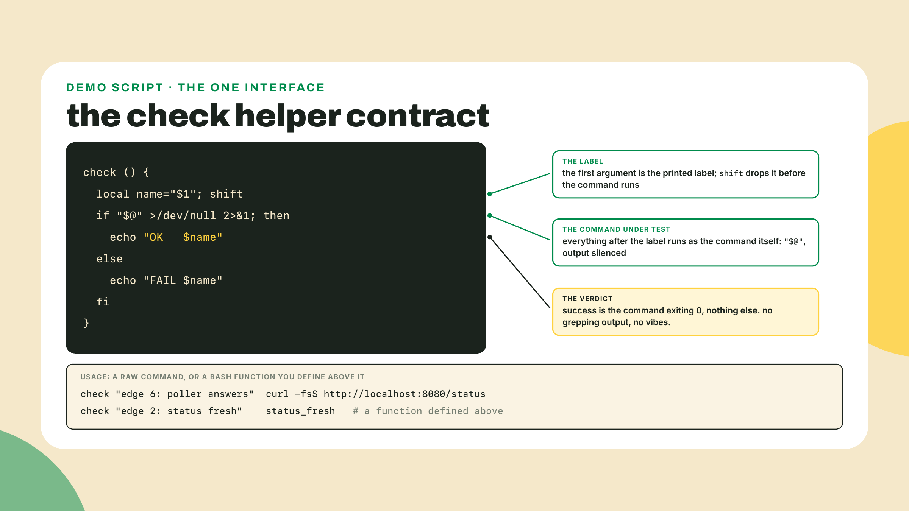
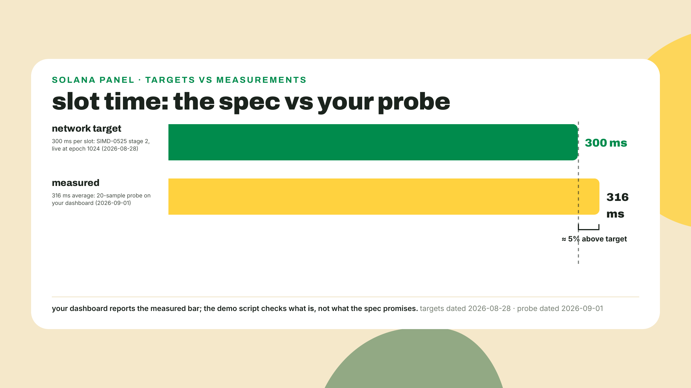
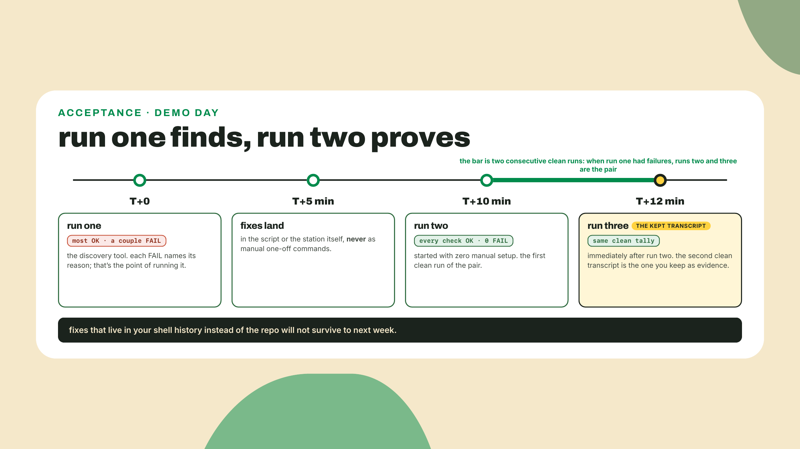
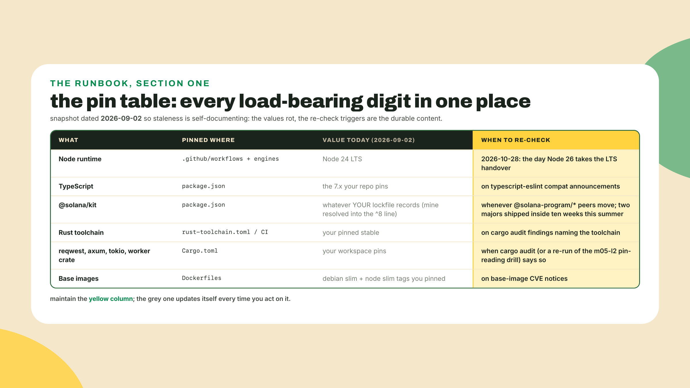
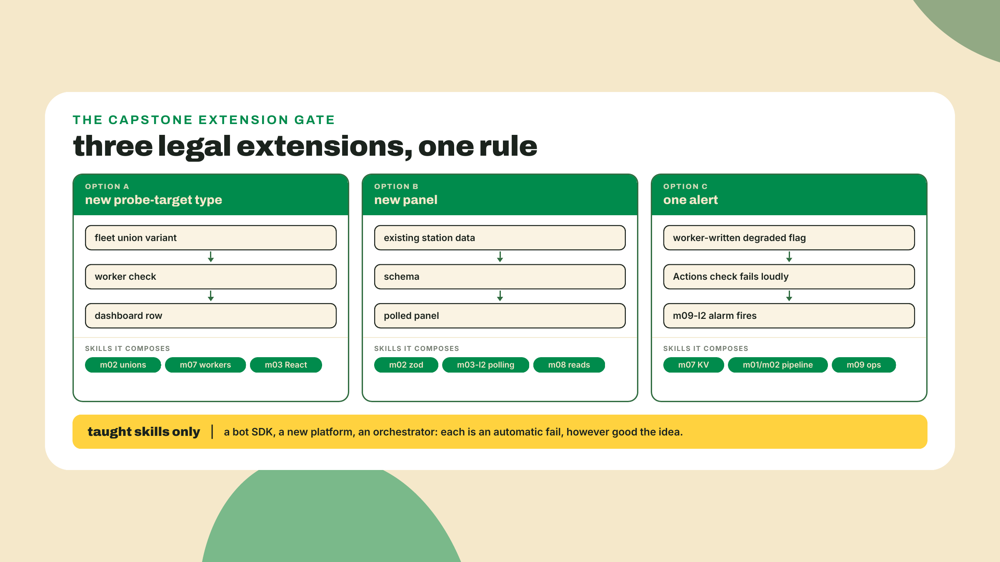

# Assembly: the station, whole

## Summary

m09-l2 laid the ops layer over every surface: the poller emits structured JSON logs you grepped a real incident out of, each platform's log reality is mapped and written down, the Actions failure-notification alarm is switched on, and the four-platform secrets sweep table came back clean. Which means there is nothing left to build before the thing you have been building for ten modules gets assembled and proven. Today you verify the complete Pulse Station end to end, edge by edge, against a demo script you author as you go; you build the capstone's one and only new piece of wiring; you write the README another dev could operate the station from; and then you ship one extension with no scaffold at all. The fading, stated out loud because it completes here: the assembly is checklist-guided, the new dashboard panel is semi-guided (I name the composition, you write the code), and the extension is fully solo. No worked examples anywhere in this lesson except one deliberate exception, the step-3 freshness check, worked in full because it is the exact spot where false-green demo scripts are born. You have not needed more than that for two modules, and pretending otherwise now would be an insult.

## Draw it before you build it

Before you wire anything, close the laptop lid on the docs and draw your station from memory. Paper, whiteboard, the back of a receipt, anything. Every component, its language, its platform, and every data-flow edge, in the hub shape. You have thirty seconds and here is the answer shape up front, because this checkpoint is designed to be a win:

```text
      [ spoke ]        [ spoke ]
            \            /
[ spoke ] -- ( one pipeline ) -- [ spoke ]
                  |
              [ spoke ]

arrows only where data actually moves
```

One pipeline in the middle as the heartbeat, independent spokes around it, arrows only where data actually moves. If you can draw it in thirty seconds, you already understand a polyglot distributed system well enough to assemble it. If one arrow feels fuzzy, that fuzz is exactly what the next three hours burn off.

Go. Draw it. Then come back and check yourself against the reference.



Score yourself honestly. Components are the easy half; most people get all six. The edges are where the drawing earns its thirty seconds, and the wrong arrows matter more than the right ones. The classic mistake, and I drew it myself the first time I sketched this diagram for the course outline, is an arrow from the poller to the dashboard. It feels like it should exist. The poller has the richest data in the station, chain reads and all, and the dashboard is the face. But no such edge exists, and no edge into the poller exists either: it runs on your machine, poked from your machine, with no public surface at all. The other two traps: an arrow from either worker into the poller (the workers are deliberately independent, that is the whole point of them), and an arrow from GHCR to a running container somewhere in the cloud (a registry is storage, not hosting, which is the shorthand worth coining here for what m06-l4 taught; the pull happens on your machine).

Here is the collapse worth carrying out of this course: a distributed system is just programs that agree on a diagram. That is not a metaphor. Every component you deployed holds up its end of exactly one contract, the arrows on this drawing, and nothing else. You drew the diagram from memory. The rest of this lesson is making reality match it, one arrow at a time, with a receipt for each.

## The station, edge by edge

Two definitions before the walk, both of which you will use for the rest of your career.

A **hub topology** is the shape your station has: one heartbeat in the middle, independent spokes around it. The alternative worth naming is a chain, where A feeds B feeds C feeds D, and any hop dying takes everything downstream with it. Your station has no chains longer than one hop. The dashboard going down affects nothing but the dashboard. A worker going down leaves its twin, the poller, and the pipeline untouched. Only the hub is load-bearing for the system as a whole, and m09-l2 spent a lesson making sure the hub's death is loud.

A **demo script** is the runbook drill that proves the system: one check per edge, each printing OK or FAIL, rerunnable on demand. It is the difference between "I believe my station works" and "here is the transcript." You will author it as you verify, one check per edge, which means by the end of the lab the proof and the system exist as a pair. That pairing is the actual deliverable of a capstone. Anyone can assemble something once; the demo script is what makes it operable.

Since you are about to author a script's worth of them, one per edge and roughly ten in all once edge 5 gets a check per worker and edge 8 one per audit tool, the taste question is worth thirty seconds: what makes a check trustworthy? Three properties. It observes the claim, not the transport: HTTP 200 from a CDN says "a cache has bytes," while a timestamp inside the payload says "my cron ran within the hour," and only one of those is the thing you actually care about. It is rerunnable with no manual state: no "first delete the old container," no "works if you ran the other script recently," because a check with setup instructions is a chore, not a check. And it fails loudly with a reason, because `FAIL` with no explanation just moves the debugging to a worse moment. Every check you write today should survive all three questions, and the one I work for you in step 3 is chosen precisely because it is where most people write the vanity version.



So: the eight edges, each named with the module that built it, because this walk doubles as the course's last spaced retrieval. Read the middle column slowly and notice it is a table of contents for your last ten weeks.

| # | Edge | Built by | Proof |
|---|---|---|---|
| 1 | Actions pipeline green, six jobs | m01-l3, gates from m02-l4 + m04-l3, jobs from m05-l3 + m06-l4 | latest completed run succeeded |
| 2 | Cron publishes status.json | m01-l3, typed by m02 | payload timestamp under 60 min old |
| 3 | Dashboard renders fleet + Solana panels | m03-l2, m03-l3, m08-l2 | both panels live at the Vercel URL |
| 4 | Dashboard polls the TS worker (NEW) | today, from m03-l2 + m07-l1 | third panel live |
| 5 | Two workers, independent | m07-l1, m07-l2, chain reads m08-l2 | both workers.dev URLs answer with per-target JSON |
| 6 | GHCR poller runs locally | m06-l2 through m06-l4, chain reads m08-l3 | localhost:8080/status answers with chain data |
| 7 | Write path healthy | m08-l4 | tx-check exits 0 with a confirmed signature |
| 8 | Audit + alarm green | m09-l1, m09-l2 | audits clean or verdicted, notifications confirmed on |

Edge 1 deserves a paragraph because it is the hub, and because verifying it is a reading exercise, not a building one. Your one workflow grew for ten modules: the vitest gate arrived in m02-l4, the cargo test, clippy, and fmt gates in m04-l3, the release-binary job in m05-l3, the GHCR image pushes in m06-l4. Tests in both languages gate the cron. The cron probes and commits `status.json`. Nothing here gets constructed today; today you read the latest run like an operator and check every job in the chain went green. And while you are in there, notice the thing that looks like a bug and is not: the cron's own `status.json` commit never retriggers the workflow. That is GitHub's recursion guard working. Events created with the workflow's `GITHUB_TOKEN` do not spawn new workflow runs, precisely so a workflow that commits cannot accidentally trigger itself forever. There is a documented escape hatch (use a PAT or a GitHub App token when you genuinely want downstream runs), and your station wants no such thing. A feature, not a fix.

Edges 3 and 4 are the dashboard's story, and it is worth seeing that the dashboard is now a one-page summary of the entire course:



The new edge, number 4, is the only construction in this capstone, and the reason it exists is stated out loud: it requires zero new skills. It is the m03-l2 polling pattern pointed at the m07-l1 endpoint. Your dashboard has polled a public JSON URL on an interval since module 3; your TS worker has served its KV snapshot as public JSON since module 7. Aim the first at the second and the dashboard grows a worker-status panel. No new API, no new platform, no new package. That is the course's thesis in one panel: at some point new capability stops coming from new tools and starts coming from composing the ones you own.

Now the honesty section, because a capstone that hides its seams is a demo, and naming them is what makes this a system. Three seams, all deliberate.

The poller is local-only. The free tier bought you three public surfaces (Vercel, two workers.dev URLs), not four. Exposing the poller would mean tunneling or paid hosting, both out of scope on purpose; the container is poked from your own machine and that is the design, not a shortcut. Second, the dashboard's fleet path tolerates staleness by design: a 30-minute cron plus a 5-minute CDN cache means the fleet panel can trail reality by over half an hour, which you have known since m03-l2 taught you to read `cache-control: max-age=300` in devtools. Third, and biggest: the whole hub trusts one pipeline. If Actions is down, or the 60-day inactivity auto-disable fires on your public repo, the heartbeat stops. Every mitigation you own for that came from m09: the failure notification is your alarm of last resort, and the disable policy is why the runbook you write today has a re-enable drill in it. One pipeline is a real single point of failure and the station carries it with open eyes, because the alternative on a free tier is a second scheduler you would also have to monitor.

One thing this lesson deliberately does not have: a go-deeper box. There is no canonical book chapter for "assemble the system you already built." The runbook's further-reading row simply points back at the m01-l1 taught-versus-bookmarked map, and the next lesson, the conclusion, reprints that map with fresh eyes.

## Lab: assemble, verify, document

Structure, so you can pace yourself: step 1 builds the harness, steps 2 through 9 walk the eight edges, checklist-guided, and you author one demo-script check per edge as you verify it. Step 10 is the double run. Step 11 is the README. Budget the bulk of your time for edge 4 (step 5, the new panel) and the README (step 11); everything else is verification of things that already work.

1. **The harness.** Create `scripts/demo.sh` in the station repo. I am giving you the harness and one worked check; every other check is yours to author, and that is the assignment, not a gap. The contract: each check prints one `OK` or `FAIL` line, and the script exits nonzero if anything failed.

```bash
#!/usr/bin/env bash
set -u
PASS=0; FAIL=0

# --- edit these four lines to your station ---
REPO="YOUR_USER/pulse-station"
DASHBOARD_URL="https://your-board.vercel.app"
WORKER_TS_URL="https://pulse-edge-ts.your-subdomain.workers.dev"
WORKER_RS_URL="https://pulse-edge-rs.your-subdomain.workers.dev"

check () {
  local name="$1"; shift
  if "$@" >/dev/null; then
    echo "OK   $name"; PASS=$((PASS+1))
  else
    echo "FAIL $name"; FAIL=$((FAIL+1))
  fi
}

# checks get authored here, one per edge, as you verify

echo
echo "$PASS OK, $FAIL FAIL"
[ "$FAIL" -eq 0 ]
```

One redirect choice in `check` is load-bearing: each command's stdout is thrown away, because chatty tools would bury the tally, but stderr is deliberately left alone. That is property three wearing bash. When a check fails, its reason, edge 2's `console.error` line, curl's `-S` messages, prints right above the FAIL verdict instead of vanishing into `/dev/null`; add `2>&1` to that redirect and every check you author today goes mute at exactly the moment it owes you an explanation.



2. **Edge 1: the heartbeat.** Open the Actions tab and read the latest few runs, plural, because no single run ever shows all six jobs together: the `if:` conditions are mutually exclusive by design. Gates plus the probe ride main pushes and the schedule; `release` fires only on v-tags, where the probe skips; `images` rides pushes. So a scheduled run showing release and images as skipped is a healthy run, not a broken one, and the census you are taking is "each job green on the trigger it belongs to," read across the recent history. Then script it. Your repo is public, so GitHub's REST API answers unauthenticated plain `curl` at `https://api.github.com/repos/$REPO/actions/runs?per_page=1&status=completed`; the latest completed run's `conclusion` field should read `success`, and `node -e` with a `fetch` has been your JSON-over-HTTP tool since module 1. Author the check. While the Actions tab is open, find the cron's own commit in the run history and confirm what is not there: no run triggered by it. You are looking at the `GITHUB_TOKEN` recursion guard behaving, and your check just encoded the healthy state.

3. **Edge 2: fresh status.json.** This one I work fully, because its footgun is the one that produces false-green demo scripts: checking HTTP 200 on a CDN-cached file proves the CDN has bytes, not that your cron is alive. The check must read the payload's own timestamp. The 60-minute threshold is the m03-l2 incident rule: one missed cron run is a hiccup, two is an incident.

```bash
STATUS_URL="https://raw.githubusercontent.com/$REPO/main/status.json"

status_fresh () {
  node -e '
    fetch(process.argv[1]).then(r => r.json()).then(j => {
      const age = (Date.now() - Date.parse(j.generatedAt)) / 60000;
      if (!(age < 60)) throw new Error("stale: " + age.toFixed(1) + " min old");
    }).catch(e => { console.error(e.message); process.exit(1); });
  ' "$STATUS_URL"
}
check "edge 2: status.json younger than 60 min" status_fresh
```

Run the script now. Two OK lines and a clean tally, and the harness pattern is proven. Everything from here is you.

4. **Edge 3: the dashboard's first two panels.** Open your Vercel URL in a browser. The fleet panel renders real rows colored by the pulse-core classifier; the Solana panel shows live kit reads. Look at the Solana panel for a second longer than you need to, because it is quietly the best gauge in the station: the chain your station watches changed its heartbeat mid-course. SIMD-0525 stage 2 took mainnet to 300ms slots at epoch 1024 on 2026-08-28, a quarter off the interval and therefore a third more slots per second, the exact distinction m08-l1 drilled, days before this course's research froze, and the 2026-09-01 probe measured 316ms against that 300ms target. Your panel is watching a heartbeat that changed while you were learning to measure it, and it shows what is, not what the spec promises. That is the discipline of this entire course in one number pair. Script check: `curl -fsS` on the dashboard URL, and name it honestly, something like `edge 3: dashboard deploy answers (transport only)`, because by this lesson's own taxonomy this is the vanity kind: it proves the deploy serves bytes, not that panels render. Panels are a browser fact and the closing screenshot is their evidence, so the script carries this one consciously-labeled transport check as the accepted exception rather than a quiet contradiction of the taste section.



5. **Edge 4: the worker-status panel.** The capstone's one build. Semi-guided, as promised: here is the composition, and the code is yours.

   - **The pattern:** m03-l2, in full. A zod schema at the boundary, a `BoardState` discriminated union, `useState` plus `useEffect`, a `setInterval` poll with its cleanup function, parse-don't-validate on arrival.
   - **The target:** your TS worker's public JSON endpoint, the root route of `pulse-edge-ts.<your-subdomain>.workers.dev`, serving one entry per target with the `solana-rpc` verdict included, exactly as m07-l1 shipped it.
   - **The wall from lesson one, now from the server side:** this panel is the course's first deliberately cross-origin read of a surface you own, so collect the treatment m07-l1 deferred to the capstone. Your board's origin is its vercel.app URL; the worker answers from workers.dev; and m01-l1's rule governs unchanged: a page may always read its own origin, and a cross-origin response is readable only when the server opts in. The opt-in is the `access-control-allow-origin: *` header m07-l1 froze into the worker's JSON response, the honest setting for a public read-only snapshot, and for this panel it is the entire CORS surface: the poll is a plain GET with no custom headers, which the spec classes as a simple request, so no preflight `OPTIONS` ever fires and the one header does all the work. Prove the opt-in from the outside before you write a line of React: `curl -s -D - -o /dev/null "$WORKER_TS_URL" | grep -i access-control-allow-origin` prints the header or you stop here. And be precise about who owns the wall: delete that header from the worker and the same URL keeps answering curl while the panel dies with a CORS error in the browser console, because the wall is the browser's, never the network's. The fleet panel never needed this opt-in from you only because raw.githubusercontent.com sends the same `*` unconditionally, the header you read in devtools in m03-l2; this time the server saying yes is yours.
   - **The edits:** a second schema file for the worker's payload shape, a third fetch-and-poll effect, and a panel component that reuses the board's classifier colors. `VERDICT_COLOR` in `StatusRow.tsx` is a module-local const today, so put `export` in front of it first, then import it.
   - **The budget:** poll at the same 60-second interval the board already uses for status.json. The worker's KV snapshot only changes on the worker's own cron beat, so polling hotter buys you nothing, and this time the budget you would burn is not a CDN's, it is your own Workers free tier, the 100k requests per day you sized in m07-l1 (the REQUESTS meter; the 200,000-per-day figure from m09-l2 is the separate Workers Logs events meter, and the two never share a budget). A 60-second poll from a tab or three lives comfortably inside that budget forever. A hot loop does not.
   - **Acceptance:** third panel live on the deployed dashboard, worker targets visible with their statuses, and a demo-script check that fetches the worker URL and fails if the payload does not include the `solana-rpc` target. Presence, not verdict, on purpose: if your worker's egress sits on the public RPC's blocklist, that row shows an honest `down` with a 403, the m07-l1 fallback-endpoint swap is the fix, and a panel reporting a true refusal is a monitor working, not a check to soften.

6. **Edge 5: two workers, independently.** `curl` both workers.dev URLs, and read each for what it actually is, because the two hold deliberately different jobs; m07-l2 said so when it declined to give the Rust worker a cron, on the grounds that the same job twice teaches copy-paste, not architecture. The TS worker answers with the station snapshot: per-target entries including the `solana-rpc` getHealth verdict, written by its own cron, out of its own KV, each entry stamped `checkedAt`. The Rust worker answers the classification contract: `GET /` replays the last KV-stored fixture samples through the engine as `[{"name","latency_ms","verdict"}]`, and its state changes only when something POSTs it fresh samples. The point of this edge is what it does not contain: neither worker consumes the poller, the dashboard, or each other. And independence is checkable, not just assertable, because the two move on entirely different clocks: the TS worker's `checkedAt` values advance on its cron beat with nobody touching it, while the Rust worker's payload holds perfectly still until you feed it (try it: POST the station's `fixture.json` with a latency changed, watch its GET flip verdicts while the TS worker's timestamps ignore you completely). Two surfaces proxying one data source could not behave that way. If you want the full drill, the runbook version goes further: take one worker down (deploy a deliberately broken route, or just imagine it during a calmer week) and confirm the other three public surfaces did not blink. Author one check per worker, each against its own contract: the TS check on the snapshot's `solana-rpc` entry, the RS check on the per-target verdict JSON answering (POST `fixture.json` and grep for a verdict, or assert the GET returns an array). The Rust worker earning a check in the same script, with zero code shared between the two at runtime, is m07-l2's payoff sitting in plain sight.

7. **Edge 6: the poller, from the registry, on your machine.** The m06-l4 move, now as an operator:

```bash
docker run --rm -p 8080:8080 ghcr.io/<your-username>/pulse-pollerd:latest
```

Then, from another terminal, `curl -s localhost:8080/status`. The JSON that comes back includes the chain probes m08-l3 wired in: slot and balance reads, typed through serde, failures taxonomized through thiserror. Say the boundary out loud one more time, because your README will state it: this container has no public surface, nothing on the internet can reach it, and neither tunneling nor hosting for it is taught anywhere in this course. On purpose. Author the check against localhost.

8. **Edge 7: the write path.** The station can watch. Can it act? m08-l4 built the answer as a contract your demo script was promised by name: `tx-check` prints a confirmed signature and exits 0, or fails loudly and exits nonzero. So the check is one line: `check "edge 7: write path lands" bash -c 'cd tx-check && npx tsx tx-check.ts'`. Yes, that means the double run in step 10 lands two real devnet transfers a few minutes apart, and that is fine: 0.001 SOL of worthless devnet money per run is exactly what the throwaway key exists to spend, and a write-path check that is too precious to run twice is not a health check. If the faucet is dry today, you know the drill, you built it: the local validator fallback with `RPC_URL` and `RPC_WS_URL` pointed at 127.0.0.1, exercised by everyone once already, and the runbook records both modes. A confirmed signature here means your keys, your message construction, your signing, and the network's inclusion machinery all work. Green dots that only prove reads are the thing your station grew beyond.

9. **Edge 8: audit and alarm.** Two audits, one manual confirmation. `pnpm audit --audit-level=high` at the workspace root (m09-l1 ran the plain `pnpm audit`; the `--audit-level=high` flag is the capstone's tightening, gating the exit code on high-severity findings) and `cargo audit` in the Rust workspace, both as demo-script checks; if your m09-l1 verdict file accepts a specific advisory, encode that acceptance in the check rather than lowering the audit bar to make it pass, because a check that goes green by asking easier questions is worse than no check. Mechanically, per tool: `cargo audit` takes `--ignore RUSTSEC-XXXX-NNNN` per accepted id (or an `[advisories] ignore` list in a committed `.cargo/audit.toml`, the durable spelling, and the path is not decoration: cargo-audit reads project config from `.cargo/audit.toml` only, and an `audit.toml` at the bare project root is silently ignored, valid TOML and all); pnpm's parallel of that durable spelling is `pnpm.auditConfig.ignoreCves` (and `ignoreGhsas`) in package.json: list the accepted advisory ids there, commit it next to your verdicts, and the bare `pnpm audit --audit-level=high` exit code becomes trustworthy again. The alarm cannot be scripted from the outside, so it becomes the runbook's one manual line: GitHub notification settings, the Actions channel, delivery on, only-failed-workflows checked, exactly where m09-l2 left it. Confirm it is still on and record the confirmation in the README.

10. **Run it twice.** `bash scripts/demo.sh && bash scripts/demo.sh`. The acceptance bar is deliberately worded: all checks green on a second consecutive run with zero manual fixes between runs. Expect the first run to fail somewhere; finding out where is the run's whole job. The usual suspects, in the order they usually surface: a URL still carrying my placeholder text in the config block, the poller container not actually running because you `Ctrl-C`'d it an hour ago, a freshness check written against a field name your fleet spells differently, and the sneakiest one, a check that passed only because your browser warmed the CDN cache thirty seconds earlier. Fix each one in the script or the station, never in your head, and run again. If run two goes green untouched, stop and enjoy it for a second. A demo script that passes once is an anecdote. Twice, back to back, is a system.



11. **The README/runbook.** The last taught beat of the course, and the one that makes the station transferable. Write it for a specific imaginary reader: a competent dev who has never seen this repo and got paged about it. Four sections. The system diagram, which is your checkpoint drawing from the top of this lesson, corrected and committed. Per-surface operations: for each of the five surfaces, the run command, the deploy command, and the poke command that proves it lives, most of which you can lift straight from your demo script. Be concrete to the point of boredom here: the dashboard row says the Vercel URL and `npm run build` for the local smoke; the worker rows say `npx wrangler deploy` and their `curl`; the poller row says the full `docker run` line with the port mapping, because the paged reader does not remember your port choices; the pipeline row says where the Actions tab lives, the six job ids, and which trigger runs which, because no single run ever shows all six and a reader who does not know that will hunt a phantom failure in every scheduled run's skipped jobs. The test for this section is mechanical: could someone operate the station with your repo and this file, without you in the room? Every place the answer is "well, they would also need to know...", that knowledge goes in the file. Incident drills: the m09-l2 log grep walk, the faucet-dry fallback, and the two Actions drills the hub's honesty demands, what to do when the alarm email arrives, and how to re-enable the workflow when the 60-day auto-disable fires (the Actions tab's Enable workflow button, plus a keepalive commit as the countermeasure the ecosystem reaches for in practice). And the pin table. Plus the absorption m09-l2 promised out loud: fold `SECRETS.md` into the README as its secrets section, the four-platform table and the incident-queries list your challenge started, or keep it as a top-level file the README links in its first screen; either way the paged reader finds where every secret lives, and the first incident queries, from one entry point.



Copy the shape, not my values: the whole point, hammered since m05-l2 taught you to read agave's pins, is that the digits column is the least durable thing in the table and the re-check column is the most. The table's header carries its date. A pin table without a date is a rumor. And the further-reading row at the bottom of the README points at exactly one thing: the m01-l1 taught-versus-bookmarked map, which the next lesson reopens.

Then commit the capstone, because nothing in this lab committed itself and the next lesson assumes the repo is current:

```bash
git add -A
git commit -m "capstone: demo script, worker panel, README/runbook"
git push
```

## Challenge

The solo extension. The autonomy fade completes here: no scaffold, no composition named, no interface given. Pick exactly one:

(a) A new probe-target type, end to end: a new variant in the fleet's target union, the check logic in a worker, a row on the dashboard. You built a smaller version of this in the m07-l1 challenge; this one crosses the full stack.

(b) A new dashboard panel over data the station already produces. The station emits more than it displays: probe history is sitting in the git log as one status.json per cron run, the poller's /status carries chain reads no public surface shows, the workers hold per-target timestamps in KV. A history panel built from a handful of recent commits is the classic strong entry here, and note the boundary before you pick the poller option: the dashboard cannot reach your localhost, so surfacing poller data means the pipeline carries it, not a new edge into your house.

(c) One alert: some path by which a bad state becomes a loud state. The in-bounds shape worth stealing: a worker writes a degraded flag into its KV snapshot, and an Actions step reads the public endpoint and fails the run when the flag is set, which fires the m09-l2 alarm you just confirmed.



The one rule is the assignment itself: taught skills only. A Telegram bot SDK is a fine idea and an untaught dependency, so it fails. Deploying the poller to a Kubernetes cluster was signposted out of scope at the M6 tier-gate and stays there; orchestration is a different course's problem. The rule is not modesty, it is the test: this course spent ten modules replacing the reflex of reaching for a new tool with the skill of selecting from the ones you own. Prove it took.

Acceptance, all five: the extension is visible on a deployed surface; it appears in the README, diagram included if it added an edge; the demo script still passes twice consecutively with zero manual fixes; `git grep` for anything secret-shaped in every repo still comes back clean; and the extension is committed and pushed with the rest of the capstone.

## Checkpoint

What you can now do, concretely, and it is worth reading this list slowly because it is the course's terminal state: draw a polyglot distributed system from memory and know which arrows do not exist; verify an eight-edge system end to end against a demo script you authored; compose two taught patterns into a new production edge without a tutorial; operate the whole thing from a README with a dated pin table; and extend a live system solo, inside the boundaries of your own stack. Ten modules ago you installed Node.

The closing evidence pair, as promised at the top: your demo-script transcript, all checks OK on the second consecutive run, and one screenshot of the dashboard showing all three panels live. The 30-second retrieval before you close the tab: which three arrows on your diagram are deliberately absent? (Nothing into the poller, workers consume nothing, poller feeds no public surface.) And why does the cron's own commit not retrigger the pipeline? (The GITHUB_TOKEN guard: workflow-authored events spawn no runs, and your station counts on it.)

One ask while the sweat is fresh. This lesson bet everything on the checkpoint-then-verify shape, no worked examples, trusting two modules of fade to carry you. Tell me where it held and where it dropped you, and name the single edge whose check was hardest to author. If one edge consistently eats an hour of everyone's assembly time, that is exactly the feedback that reshapes this capstone.

The station is whole and the demo script proves it, twice. One lesson remains, and it wires nothing: no new tools, no new code. A map of exactly where you now stand, read against the courses that come next, which bookmarks from module 1 just became urgent, and which door in the catalog your station unlocks first. You built the system. Next we read the map it leaves you holding.
