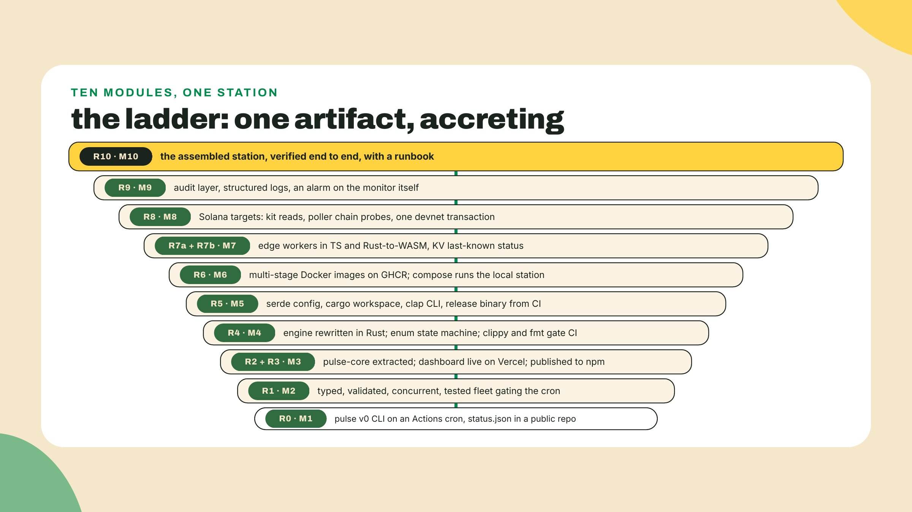
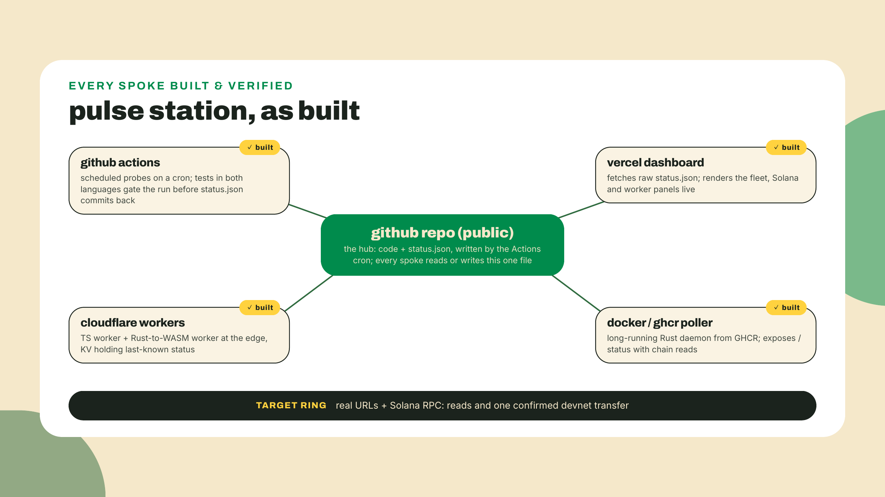
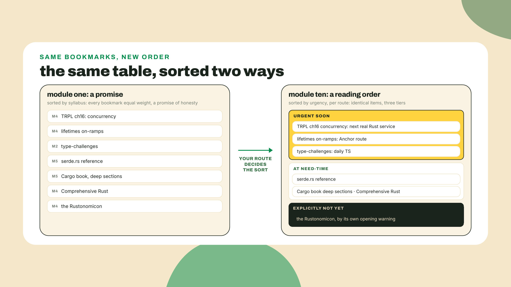
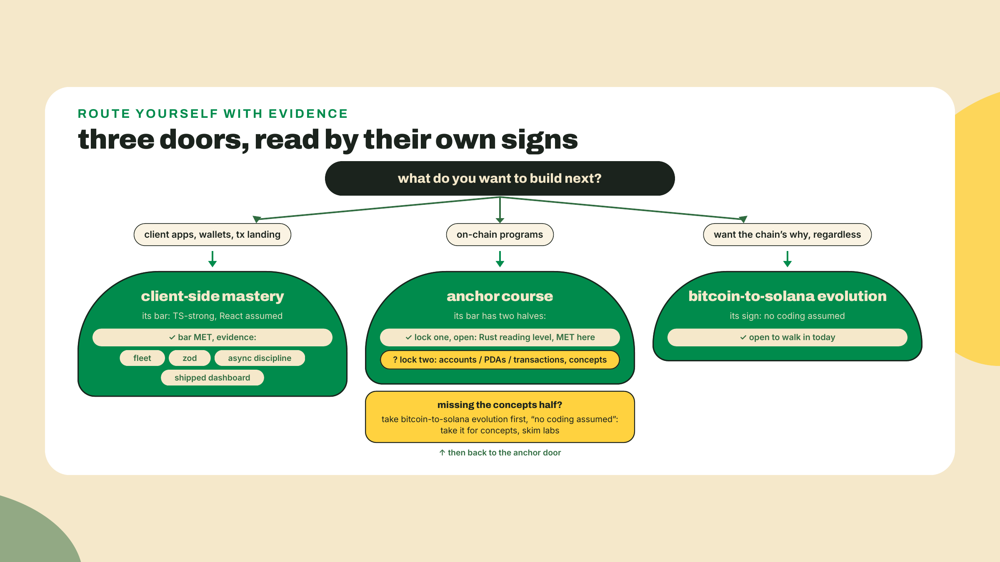
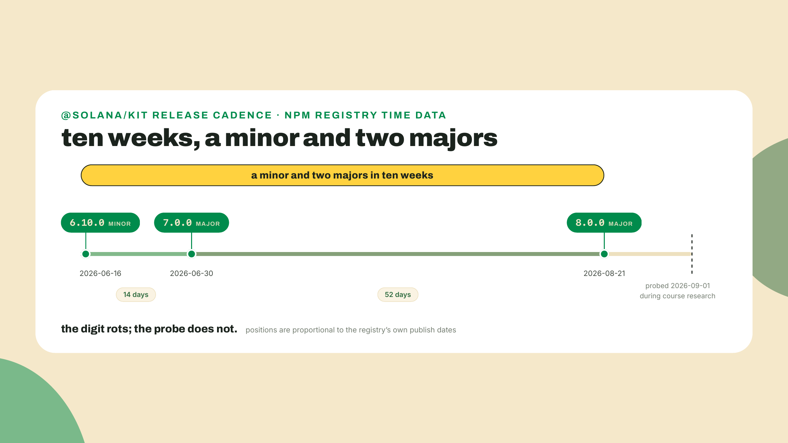
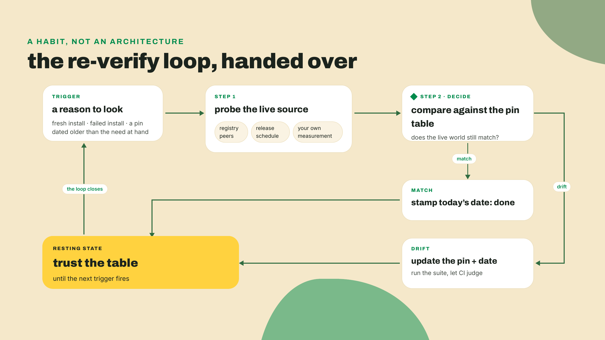

# Conclusion: the map you now own

Last lesson you assembled the whole station and proved it: the demo script passed end to end, the solo extension shipped with no scaffold anywhere near it, and the README and runbook mean another dev could operate what you built without you in the room. There is nothing left to build. So this lesson opens the way the course opened: by making you measure something. This time, the something is you.

Open a new tab, go to https://rust-lang.org (apex, no www, same as lesson one), press F12, click the Console tab, and paste the exact snippet from lesson one:

```js
const t0 = performance.now();
fetch(location.origin, { cache: "no-store" })
  .then(r => console.log(`${location.host}: ${(performance.now() - t0).toFixed(1)} ms (status ${r.status})`));
```

Then go to https://www.typescriptlang.org/play/ (trailing slash, same as always) and paste the second one:

```ts
const probe = { url: "https://www.rust-lang.org", timeoutMs: 3000 };
const wait = probe.timeout;
console.log(`waiting ${wait} ms`);
```

Same handful of lines. Same red squiggle under `timeout`. The code has not changed one character since module one. Now do the part that matters: grab anything you can write on and put down five lines about what you see NOW that you could not see then. Do not polish them. Mine, re-running it while writing this: the response shape is a union I would model as ok or error variants before touching it; this fetch has no timeout, no retry, no backoff, and I know exactly which of my own functions fixes that; `performance.now` is a monotonic clock and I know why that matters for measuring; this code runs in one place and I have shipped the same probe to four; and the squiggle is not a linter being fussy, it is a proof about my program that I now design for on purpose. The code did not change. You did. The rest of this lesson is the map of exactly how much, and of where the roads lead next.

## Summary

This is the conclusion, and it teaches nothing new on purpose. It does four things. It restates the build rung by rung, one honest sentence each, which is spaced retrieval wearing a victory-lap costume. It reprints the taught-versus-bookmarked table from lesson one, closing the promise that lesson made, and then re-sorts it by urgency for the route you pick. It reads your exit level against each sibling course's own stated prerequisite sentence, with evidence instead of vibes. And it hands over the last skill: the re-verify habit for every number this course printed that will rot. The lab produces three small artifacts and none of them are passive. Then the door.

## The map, closed

### The build, rung by rung

Here is what you actually did, module by module. Read it slowly; every line is a thing you can open on your own GitHub right now.

R0, module one: `pulse` v0, a strict TypeScript probe that fetched a URL and printed its latency, promoted onto a GitHub Actions cron that commits `status.json` back to a public repo. Your first ship was a heartbeat on a machine you do not own. R1, module two: the fleet grew types, a discriminated union for probe results, zod validation at the config boundary, a hand-rolled concurrency pool with real cancellation, and a vitest suite that gates the cron. R2 and R3, module three: the engine got extracted into `pulse-core` inside a pnpm workspace, a React dashboard went live on a Vercel URL any stranger can open, and the package published to npm where anyone can install it. R4, module four: the engine got rewritten in Rust, the union became an enum, errors became `Result` with thiserror, the state machine grew transition tests, and clippy plus fmt joined the CI gate. R5, module five: serde read the same config file the TypeScript fleet reads, the workspace split into crates, a clap CLI fronted it, and CI produced a release binary a clean machine can run. R6, module six: the poller moved into a multi-stage Docker image, an order of magnitude smaller than the naive one, published to GHCR, with compose running the local station. R7, module seven: probes reached the edge on Cloudflare Workers twice, once in TypeScript and once in Rust compiled to WebAssembly, both holding last-known status in KV. R8, module eight: Solana joined the target list, kit reads on the dashboard, chain probes in the poller, and one real devnet transaction confirmed with your own throwaway key. R9, module nine: audits over the whole tree, structured logs you can grep during an incident, and an alarm on the monitor itself. R10, last lesson: the whole station, verified edge by edge from one machine, transcript kept, with a runbook.



Notice what the ladder is not: it is not ten projects. It is one artifact that never got thrown away. The one-liner you re-ran ten minutes ago is still recognizably inside the release binary, the workers, and the container. That is the accretion argument this course bet on, and you are the evidence it worked.

The station's shape, one last time, because lesson one promised you would meet this drawing again and last lesson made you redraw it from memory. Two honest notes before you hold it against last lesson's answer key, because the two drawings are deliberately not the same picture. This reprint is the COURSE OPENER's drawing, repo-centric: the public repo at the hub, four spokes, drawn before module eight existed, so no `tx-check` spoke. m10-l1's operational reference redrew the same system pipeline-centric: Actions at the hub, the workers split into two spokes, `tx-check` counted, five spokes in all. Same components, same real edges, two centers of gravity, and both are true of one system: the opener asks where the data lives (the repo), the runbook asks what beats (the pipeline). Seeing that both drawings describe your one station, and knowing which one to reach for per question, is itself a graduation-grade skill; if you want this one to match the runbook's, adding the `tx-check` spoke is the only delta.



### The table, reprinted

Lesson one printed a table of what this course teaches versus what it bookmarks and called it the syllabus's honest twin. It also promised the final module would bring you back to it. This is that visit, and the 80/20 seam is course content to the very end. It is a reprint with one honest delta, flagged rather than smuggled: the fearless-concurrency row below is new today, added at exit because ten modules of ownership practice finally earned it a place; lesson one's table never carried it. The links below are the same canonical resources, verified live during this course's research pass and re-probed on 2026-09-02, the date lesson one prints. One of them is also a small joke at the course's expense: mid-June 2026, while our research was being assembled, Frontend Masters became Master.dev and every old URL started redirecting. A rebrand landed inside our own link list and demonstrated, live, why the re-verify habit applies to bookmarks too. Links rot. Verified links rot on a delay.

| Concept | Where it lived | Bookmarked to |
|---|---|---|
| JS fundamentals | Never taught; the prerequisite | MDN Learn Core Scripting: https://developer.mozilla.org/en-US/docs/Learn_web_development/Core/Scripting |
| Strict TypeScript config | M1 | TS Handbook intro: https://www.typescriptlang.org/docs/handbook/intro.html and Everyday Types: https://www.typescriptlang.org/docs/handbook/2/everyday-types.html |
| Discriminated unions, narrowing, exhaustiveness | M2 | Handbook narrowing, unions section: https://www.typescriptlang.org/docs/handbook/2/narrowing.html#discriminated-unions ; the type-challenges repo on GitHub as the drill |
| Generics you actually use | M2 | Handbook generics: https://www.typescriptlang.org/docs/handbook/2/generics.html |
| Validation at boundaries | M2 | Total TypeScript's free Zod tutorial: https://www.totaltypescript.com/tutorials |
| Async, concurrency, cancellation | M2 | MDN's async unit; TRPL ch17 for the Rust side: https://doc.rust-lang.org/book/ch17-00-async-await.html |
| Testing practice | M2 (vitest), M4 (cargo test) | vitest guide; node:test docs |
| Package and publish literacy | M3 | Node's learn path: https://nodejs.org/learn |
| React, consumer level | M3 | react.dev quick start; client depth belongs to the client-side sibling course (in production), read against the doors section below |
| Ownership and borrowing | M4 | The Brown interactive fork, quizzes and ownership visualizations: https://rust-book.cs.brown.edu/ |
| Errors as values | M4 | The Rust Book's error handling chapter: https://doc.rust-lang.org/book/ch09-00-error-handling.html |
| Enums, structs, traits in practice | M4 | The Book's enums chapter: https://doc.rust-lang.org/book/ch06-00-enums.html and generics and traits: https://doc.rust-lang.org/book/ch10-00-generics.html |
| serde, cargo, clap, a real CLI | M5 | serde.rs; the Cargo book; Rustlings after each Rust module: https://rustlings.rust-lang.org/ |
| tokio, know-when-you-need-it depth | M6 | TRPL ch17 async, same chapter as above: https://doc.rust-lang.org/book/ch17-00-async-await.html |
| Fearless concurrency, threads for real | Never taught; row added today | The Book's ch16, fearless concurrency, from the table of contents at https://doc.rust-lang.org/book/ |
| Rust syntax breadth | Never re-taught | Rust by Example: https://doc.rust-lang.org/rust-by-example/ ; Comprehensive Rust: https://google.github.io/comprehensive-rust/ |
| Lifetimes beyond reading, unsafe, macros | Never, signposted | The Rustonomicon, which opens by telling you not to read it yet: https://doc.rust-lang.org/nomicon/ |
| Containers | M6 | Docker Get Started: https://docs.docker.com/get-started/ |
| Deploying the TS app | M3 | Vercel getting started: https://vercel.com/docs/getting-started-with-vercel |
| The edge, both languages | M7 | Cloudflare Workers get started: https://developers.cloudflare.com/workers/get-started/guide/ |
| Solana depth, Anchor, wallet UX | Minimal client model, M8 | Sibling courses in this catalog, read against their own signs below |

In lesson one this table was a promise. Today it is a reading order, and reading orders are personal. So re-sort it. Which bookmarks just became urgent depends entirely on where you are going, but three promotions apply to almost everyone leaving this course.

First: TRPL ch16, fearless concurrency. The moment your next Rust service needs real threads instead of tokio tasks, that chapter stops being optional. You already hold everything it assumes, ownership included, which is exactly why it can enter the map today as a bookmark rather than a chapter. Second: lifetimes beyond reading. If your route is program authoring, read the Anchor course's actual relationship with them before you panic-study: its V2 labs strip the old `<'info>` annotations from account structs rather than demanding new ones, and what its checkpoints do demand is borrow reasoning, following the compiler's argument about which handle is live when. Its habit of just-in-time on-ramps covers traits and marker types, not lifetimes, so the deep lifetime chapter stays your bookmark, coming due at need-time, not before. Third: type-challenges, the TS gym. You write discriminated unions daily now; the drills turn that from a pattern you use into a muscle you own. Pick your three. Tie each to a route. Ignore the rest until they come due, because a bookmark hoard is just the thousand-hour trap with better organization.



### Reading the doors against their own signs

Now the part I refuse to hand-wave, because over-claiming your exit would un-earn everything the honesty boxes built since lesson one. Each sibling course in this catalog states its own prerequisite. The right way to leave here is to read those sentences the way you now read a Cargo.toml: as claims to verify against evidence you own. So let's do exactly that, door by door.

The client-side mastery course, this catalog's advanced track for wallets, transaction landing, and frontend data, is in production as I write, which means its sign is not printed yet and I will not invent one to quote. What you can hold against any client-track bar are receipts, not adjectives: a typed probe fleet with a discriminated-union core, zod boundaries that fail loudly at startup, a concurrency pool with cancellation you wrote by hand and then tested with fake timers, and the React dashboard you shipped to Vercel in module three and re-shipped with new panels twice after that. If your goal is the client half of Solana, that course is the door; until it ships, the door is the topic itself, wallet UX and transaction landing, and you arrive carrying evidence.

The Anchor course, the framework track for writing on-chain programs, wears the bluntest sign in the catalog, and reading it as written is this lesson's integrity moment: it assumes you already ship Anchor programs and want the V2 delta. That is a shipping bar, and no fundamentals course clears a shipping bar by itself. What you hold from here is real and partial: you write structs, enums, traits, `Result` with thiserror, and serde daily, and you read idiomatic Rust well enough to review it, which is the reading level that course's prose assumes. What you lack, it splits in two: accounts, PDAs, and transactions as concepts, which live in the Bitcoin-to-Solana evolution course, the concept course that walks how a chain's data model works and why Solana's is shaped the way it is; and shipped-program reps, which no course hands you. So the honest route for program authoring runs through the concept course first, then first programs written and shipped, and only then the Anchor V2 door. Rust confidence alone does not clear a shipping bar, and pretending otherwise sends you into advanced labs missing both the model and the reps they assume.

Read the Bitcoin-to-Solana course's own sign carefully, because it is narrower than folklore renders it: the course never claims no coding, its description promises you will "run, script, and explain" and ship an ops bot, and the reassurance it actually prints is lesson-scoped and Rust-only, "Never written a line of Rust? Good, you do not need to." Against your evidence the verdict is still comfortable: you over-qualify on every coding floor it has, Rust most of all, where its ask is zero and your practice is daily. Take it for the concepts, move fast through what you know, and treat its labs as quick reps rather than skipped ones; a course being below your coding level does not make its ideas below your idea level.



Two more doors in the catalog deserve their signs read, because the station maps onto them unevenly and saying how is what this section is for. The Solana payments and commerce course is the best-fit next door for the station's own skill set: its back-office middle, a checkout service, webhook handling, a settlement worker with retries and backoff, runs on exactly the muscles this course drilled, a typed TS service with parsing at the boundary, a scheduled worker loop, jittered backoff, and read-path retry discipline, so you would arrive there spending your attention on payments semantics instead of plumbing. The digital assets course is a real door with a taller sign, and the honest read is a reading order rather than a wall: the PDA half of its bar belongs to the concepts course, and the token-account background its own first module leans on is something this course consciously did not supply, so you arrive there owing it. m04-l2 spent the ATA rent figure as a worked constant and said on the spot that what an ATA actually IS belongs to that course, not this one. I am not going to invent a route for you: nothing here fills that gap and I have not checked every sibling syllabus for one, so treat it as an evening of reading you schedule before its module one rather than during.

Before the last door, the part of the map that makes the rest of it trustworthy: what you are NOT yet. You are not a program author; that road runs through concepts this course never taught and shipped-program reps it never assigned, before the Anchor course's door even opens. You are not a lifetimes-fluent Rust systems developer; you read lifetimes when the compiler prints them, and the deep material is bookmarked, not absorbed. You are not a wallet-UX or transaction-landing engineer; you shipped a dashboard that reads a chain, which is a different thing from shepherding a user's transaction into a block, and the client-side course exists because that difference is a whole discipline. Writing those three sentences costs me something, because every course wants to claim its graduates can do everything. But a map's value IS its edges. An exit map with no not-yet column is an advertisement, and you have spent ten modules learning to distrust those.

One more door deserves its named mention, and a disclosure repeated from lesson one. On 2023-04-25, ThePrimeagen shipped Rust for TypeScript Developers on what is now Master.dev, 5 hours 19 minutes, paid with a free preview. The market named this course's exact audience three years before this course existed. You just walked the whole road that title points down, both directions. If you want a second voice on the Rust half now that you have shipped with it, that remains the one paid resource this course names.

### The numbers that will rot, and the habit that will not

Every version digit this course printed was verified on the day it was written, and every one of them is dying on a schedule nobody publishes. That is not a flaw in the course. That is the terrain, and the last thing this course teaches is the reflex that survives it. Three cases, each carrying its rule.

Case one, the sharpest in the whole research file: between 2026-06-16 and 2026-08-21, @solana/kit shipped a minor and then two majors. 6.10.0 in mid-June, 7.0.0 two weeks later, 8.0.0 in late August. Just over nine weeks, two major bumps. During this course's own research window, our own internal notes went stale on that digit twice. I got to watch our own documentation rot in real time while writing a course about not trusting stale documentation, which is about as humbling as it sounds. The rule that survives: pin what your dependencies peer against, per workspace, and re-probe before every fresh install. The digit was never the knowledge. The probe is the knowledge.



Case two, runtimes. This course pinned Node 24 LTS and told you, with a dated footnote, that the LTS torch passes to v26 on 2026-10-28. That date is from Node's published release schedule, which is the entire point: runtimes rot politely, on calendars you can read. So read the schedule, not a blog post about the schedule. When you scaffold a project in March, the question is never what did my course say, it is what does the schedule say today.

Case three, the chain itself. Solana targets 300ms slots and, when this course measured twenty recent samples on 2026-09-01, the network averaged 316ms. Targets are marketing until measured, and your station measures. That habit, running your own probe instead of quoting someone's number, is the same reflex at a different layer, and you have now built it into a machine that exercises it every thirty minutes without you.

Where do the digits live, then? In your pin table, the one your runbook has carried since last lesson: every version this station depends on, in one place, each with the date you verified it. A few of yours will look something like this, with your own dates in the last column:

```markdown
| surface        | pin                        | why                              | verified   |
|----------------|----------------------------|----------------------------------|------------|
| Node           | 24 LTS                     | active LTS line; v26 2026-10-28  | 2026-09-02 |
| @solana/kit    | what deps peer against     | probe peers before install       | 2026-09-02 |
| rust toolchain | current stable via rustup  | six-week train; clippy in CI     | 2026-09-02 |
```

The middle column is doing the real work. A pin table that only stores digits is a list of future lies; a pin table that stores the rule next to each digit is a maintenance manual. Re-pinning is a one-line edit and the CI you built judges every re-pin for free. The habit, stated once, plainly, so you can repeat it to someone else: numbers in running systems are snapshots; keep them in one file, date them, and re-probe at need-time instead of trusting any frozen digit, this course's included. Especially this course's. A year from now, distrust every version number printed here and trust the method that produced them.



## Lab: three artifacts, none passive

The scaffold has been gone since last lesson; this lab is instructions, not steps you follow with me. It produces three small written artifacts. Thirty minutes, nothing to install, and everything you write lands in the station repo so it ships like everything else did.

1. **Finish the then-vs-now diff.** You wrote five rough lines at the top of this lesson. Clean them into five real ones and save them as `docs/then-vs-now.md` in the station repo. The test for each line: it must name something specific you now see in those two snippets, a union, a missing backoff, a runtime choice, a cost, a proof. "I know more TypeScript now" fails the test. "This response shape is a union and I would model it before touching it" passes.

2. **Write the route claim.** One sibling course, named, with a two-line claim that you meet its stated bar, or exactly how you will meet it. Evidence means pointing at things: the shipped dashboard, the enum state machine, the concept course you will take first. Append it to the same file. If you cannot write the claim in two lines, you have not picked a route yet, and that is worth knowing today rather than three weeks into the wrong course.

3. **Build the next-three reading list.** Append it below the route claim, same file, `docs/then-vs-now.md`; all three artifacts travel as one graduation record. From the reprinted table, pick exactly three bookmarks. For each, one line: the bookmark, and a because-clause tying it to your route. "TRPL ch16, because my route is the Rust poller growing real threads" is the shape. Three, not seven. The discipline is the artifact.

4. **Commit it.**

   ```bash
   git add docs/then-vs-now.md
   git commit -m "docs: graduation record (then-vs-now, route, next three)"
   git push
   ```

   Your station now carries its own graduation record, publicly, next to the code that earned it.

5. **Check the heartbeat.** Open your repo's Actions tab and confirm the cron is still green and `status.json` moved within the last hour. The station keeps beating whether or not you are watching. That is what you built.

## Challenge

Run the re-verify habit once, for real, before it has a chance to fade. Open your station's TS workspace and probe what your dependencies peer against today: `npm view` (npm has been on your machine since Node arrived in module one) against your kit-adjacent packages' `peerDependencies`, the exact move from module eight. Compare the answer to your pin table. If they agree, add today's date to the table's verified column and you are done in five minutes. If they disagree, you have caught your first real drift, and you know precisely what to do: update the pin, note the date, run the suite, let CI judge it. Either outcome is a win; the point is that you ran the probe on a day nobody told you to.

## Check your bearings

The course's last checkpoint is thirty seconds and out loud. Read your three artifacts to someone, or to the empty room: five diff lines, one route claim, three because-clauses. If they sound like evidence, you are done here. That read-aloud is also the honest self-test: a diff line you mumble past is one you should sharpen, and a route claim you cannot say with a straight face is a route you have not actually chosen. The quiz for this lesson walks the same ground: the honest reading of the Anchor door, what the re-verify habit says when an old install line fails, and what a surprise lifetime error means for a graduate who owns the map.

And with that, the aha this whole course was built to deliver, stated plainly: the 20% was never missing. It was never a hole in your education. You now know exactly where every piece of it lives, chapter by chapter, and, more importantly, you know when you will need each piece, because your route tells you. A lifetime error in an Anchor lab is not a gap. It is a bookmark coming due, and you will collect it like a reserved item.

There is no next lesson. There is a next course, and you can now read its prerequisite sentence with evidence in hand. Meanwhile the station keeps beating on its cron while you go: public, on your GitHub, a portfolio piece that answers the only interview question that matters, can you ship, with a URL instead of a paragraph. Pick your route. Open your first bookmark. Ship.
