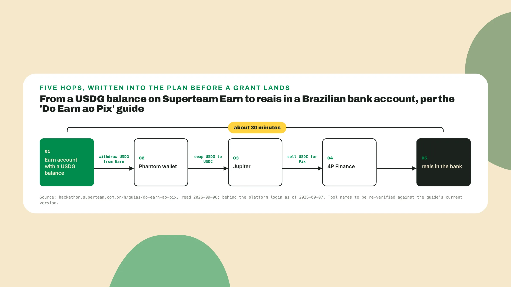
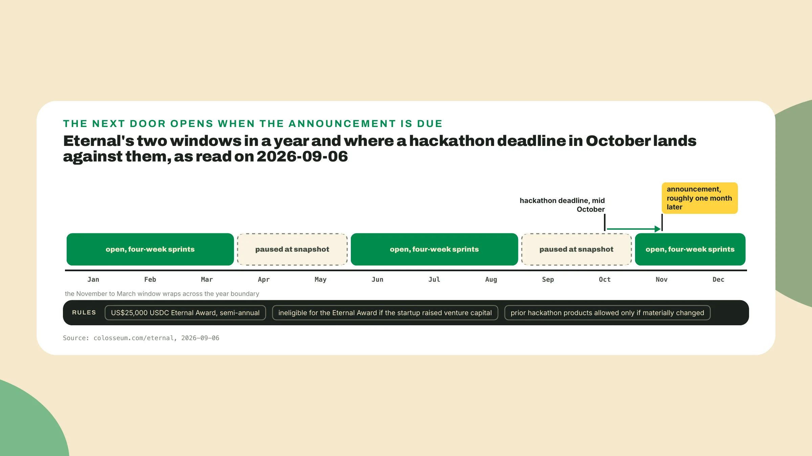
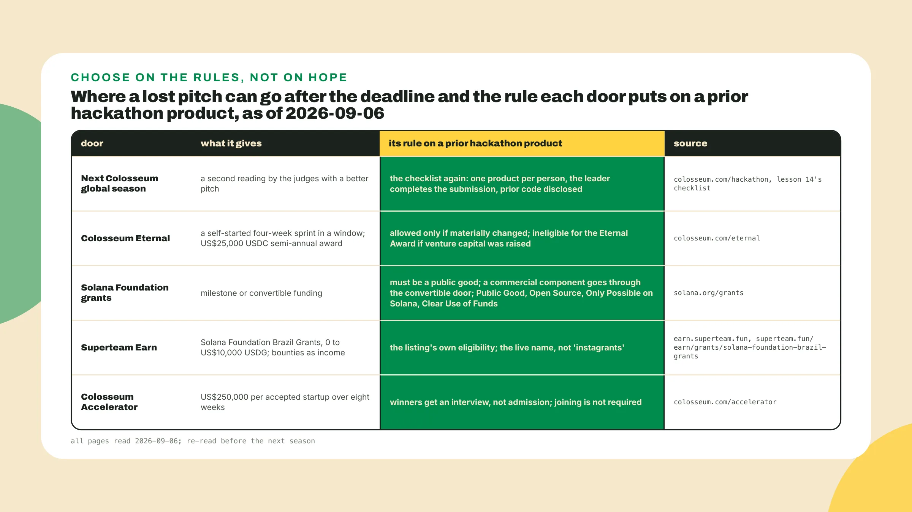

# After the deadline

Last lesson you assembled the package, converted the deadline, signed the disqualifier checklist and pressed submit. Keep the package open. This lesson reads it *from the far side of the deadline*.

## Why this matters

Sometimes the pitch is worse than the product and you lose. I have watched it happen to good teams and it has happened to me: the product did the thing, *the three minutes of video did not sell it*, and the only feedback was a winners page a month later without your name on it. The month between the deadline and that page is the stretch most teams spend refreshing it, and this lesson's file is written for it. **Planning the next season before the results arrive** can feel like conceding. It is the opposite, because the announcement takes a month and **the next window opens before it**.

Start the file now. **Make next-season-plan.md** next to the submission package, open colosseum.com/hackathon, find the part about what happens once submissions close, and copy the two sentences that matter with the date you read them. Read on 2026-09-06, the file starts like this:

```text
next-season-plan.md, Fiado, opened 2026-09-06
after submit:  'an even smaller group of teams is invited to a 15-minute Zoom interview'
announcement:  winners and the accelerator subset, roughly one month after the deadline
(colosseum.com/hackathon, 2026-09-06)
```

## Do this

1. **Write the after-map under those two lines.** As of the 2026 World's Fair season a submitted project has **five places to go**: the interview, the accelerator, the Foundation grants, Superteam Earn, and Eternal between seasons. The interview comes after the internal rounds and the shortlist from lesson 2, the first reading of your package with you in the room. Then the announcement names the winners and the subset going to the accelerator. Give the accelerator its own line, *because hackathon winners are guaranteed an interview for the Accelerator, not admission*, winners are not required to join, and the Accelerator invests **US$250,000** per accepted startup over eight weeks (colosseum.com/accelerator, 2026-09-06).

2. **Prepare the fifteen minutes.** Nobody publishes the interview questions, so the prep comes from the seven factors you copied in lesson 2. Fifteen minutes is **maybe three questions**, and the three a written answer cannot settle are why this team and why it is motivated (Founder + Market Fit), how you found the opportunity (Insight), and how the team prioritizes (Product + Execution, where the repo review already asked for features prioritized strategically). *I would hedge that to the most likely three rather than the three*, since the seven factors are the only thing that is published.

   **Write three notes**, each pointing at an artifact already in your toolkit repo, then write who takes the call: the storyteller from the team card and the builder, *because the prioritizing question gets asked to the person that did the cutting*. A month from now everyone will assume someone else is on the call. Fiado's notes:

```text
interview prep:  founder and market fit: the shop owner behind the till, named
                 how the opportunity was found: five conversations, week 1, evidence pack
                 how the team prioritizes: scope card non-goals, the week 3 cut and its reason
                 on the call: storyteller and builder
```

3. **Pick one funding path and quote its page.** The door is milestone, convertible, your regional grant on Earn, or the accelerator interview if you place. The Solana Foundation, as of solana.org/grants on 2026-09-06, names **two shapes and a third door**. Milestone grants are for public goods, paid against milestones. Convertible grants are for public goods with a commercial component, *a grant that can turn into an investment later*. RFPs are the Foundation asking for a specific thing.

   The guidelines are Public Good, Open Source, Only Possible on Solana, Clear Use of Funds, and **the first two decide your door**: a product with a Viability answer is not a public good in the milestone sense, and the page points that shape at convertible grants. Review takes about one week and a decision **about three weeks**, *so a filing the week after the deadline answers around the time the announcement arrives*.

   The regional door is Solana Foundation Brazil Grants, run by Superteam Brasil on Superteam Earn, **0 to US$10,000 USDG**, at superteam.fun/earn/grants/solana-foundation-brazil-grants. The older label instagrants is outdated, so the plan carries the live name and the link. Fiado's line reads convertible, *because the tab is commercial, with the open-source tab and reminder modules as the public-good part*.

4. **Write the Earn line and the rail to your bank.** On 2026-09-06 the Earn API returned **46 grants**, and the other one with Brazil in the name, 'The Touching Grass Fund (Brazil)' at 0 to US$500, *is the size of a bus to a final*, so it goes under logistics. Earn is also where the income is while the product finds its first ten shops, so Fiado's line adds **one bounty a week** for the builder between seasons.

   USDG on Earn is *a number on a screen until it reaches an account you can pay rent from*. Superteam Brasil's guide 'Do Earn ao Pix', at hackathon.superteam.com.br/h/guias/do-earn-ao-pix, sits **behind the platform login** as of 2026-09-07, so sign in to read it. Read on 2026-09-06 the rail runs like this: an Earn account and a Phantom wallet, withdraw the USDG from Earn to Phantom, swap USDG to USDC on Jupiter, sell the USDC for Pix on 4P Finance, **about 30 minutes** for the whole thing.

   **Verify the tool names** against the guide's current version first, *since the swap venue and the off-ramp change between seasons*. For a team outside Brazil the shape is the same with different names: your regional Superteam's listing on Earn, a wallet, a swap, an off-ramp your country allows.



5. **Copy Eternal's rule exactly as the page prints it.** Eternal, as of colosseum.com/eternal on 2026-09-06, is a set of self-started four-week sprints inside two windows a year, November to March and June to August, paused at a snapshot outside them, with a **US$25,000 USDC** Eternal Award paid semi-annually. Two rules decide what your project can take from it. A startup that raised venture capital is ineligible for the Eternal Award, *though not for entering a sprint*, which stays open to crypto developers and founders whenever Eternal is open. And prior hackathon products are allowed **only if materially changed**.

   Materially changed means the product that enters differs from the one you submitted in a way a reviewer can see, and the page prints **no threshold**. The same repo with a new README does not qualify. The same idea with the tab now settling for real shops and a rewritten reminder probably does, and *I would not bet a four-week sprint on the word probably*, so **write down what changed** before the sprint starts. A deadline in October puts the announcement around November, and **November is when the window opens**.



6. **Decide where a lost pitch goes, door by door.** If the pitch was worse than the product, keep working on the idea and bring it to the next hackathon whose rules allow it. Unruggable competed in four Colosseum hackathons and **won the grand prize on the fourth**, and Colosseum prints that on the company's card at colosseum.com/hackathon, read on 2026-09-08. Cloak (x.com/cloak_ag) placed third in a track and then took a **US$250,000** Colosseum pre-seed as of 2026-09-06. Bido (x.com/usebido) went from two friends in Superteam Brasil's mentoring to a raise in Silicon Valley *with no public figure on it*.

   The next Colosseum global season is **the plain path**, and the checklist you signed last lesson governs it again: one product per person, the leader completes the submission, prior code disclosed. *The slice from last season is prior code this season*, so **disclose it** and show the work done inside the new window.

   Fiado's paragraph: if it does not place, **Eternal in the November window** with the settlement flow moved from devnet to one real shop and the reminder rewritten around what the shop owner asked for, the pitch's first twenty seconds changed *because feedback round four said the notebook story took too long to land*, and the next global season resubmitted with the prior code disclosed.



7. **Finish the plan on one page.** Every line quotes a page and carries its date. On 2026-09-06 the season after World's Fair had no page, so the next-season line is **a dated slot** naming the page to re-read and when. The last line is one sentence on what changes in the pitch, *taken from the feedback log and not from your mood on submission day*. Fiado's finished plan:

```text
next-season-plan.md, Fiado, opened 2026-09-06

after submit:    15-minute Zoom interview for 'an even smaller group of teams';
                 winners and the accelerator subset announced roughly one month after
                 the deadline (colosseum.com/hackathon, 2026-09-06)
interview prep:  founder and market fit: the shop owner behind the till, named
                 how the opportunity was found: five conversations, week 1, evidence pack
                 how the team prioritizes: scope card non-goals, the week 3 cut and its reason
                 on the call: storyteller and builder
accelerator:     interview guaranteed for winners, not admission; not required to join;
                 US$250,000 per accepted startup over eight weeks
                 (colosseum.com/accelerator, 2026-09-06)
funding path:    convertible grant, Solana Foundation (public good with a commercial component);
                 guidelines: Public Good, Open Source, Only Possible on Solana, Clear Use of Funds;
                 review about one week, decision about three weeks (solana.org/grants, 2026-09-06)
earn:            Solana Foundation Brazil Grants, 0 to US$10,000 USDG,
                 superteam.fun/earn/grants/solana-foundation-brazil-grants (2026-09-06);
                 rail: Earn -> Phantom -> USDG to USDC on Jupiter -> Pix on 4P Finance, about 30 min
                 (hackathon.superteam.com.br/h/guias/do-earn-ao-pix, 2026-09-06; behind the platform login as of 2026-09-07)
between seasons: Eternal, November to March window, one four-week sprint; material change:
                 one real shop settling on the tab, reminder rewritten; no VC raised (the Award's condition)
                 (colosseum.com/eternal, 2026-09-06)
next season:     the season after World's Fair had no page on 2026-09-06; re-read
                 colosseum.com/hackathon each month and write the date here when it prints
pitch change:    first twenty seconds; the notebook story lands by second ten (feedback round 4)
```

## Done when

1. **next-season-plan.md** exists next to the submission package, with the two lines from colosseum.com/hackathon dated at the top.
2. **Three interview notes** each point at an artifact in your toolkit repo, with the names of who takes the call.
3. **One funding path** is chosen, with its live requirements quoted from its page and dated.
4. The next season is **named with a date**, or a dated slot names the page to re-read and when.
5. **One sentence** says what changes in the pitch, taken from the feedback log.

## Watch out

1. A win is **an interview for the Accelerator** and not admission, and the US$250,000 comes after a second decision you are not in the room for.
2. A commercial product filed through **the milestone door** spends the Foundation's week and yours for a no, because that shape goes through the convertible door.
3. **The identical product re-entered in Eternal** fails the materially changed rule, and a new README is not a change a reviewer can see.

## The pieces, one by one

Close the plan. This is **the course's concept map**, the whole of it, the pieces you built lesson by lesson. Every file sits in one repo, dated, quoting the page it came from, which is why *the second season costs a fraction of the first*: the season page gets re-pulled, the pitch gets rewritten, and the rest stays.

```text
four questions under every set of judging criteria:  is the problem real / does it work / does the story land / is this the team
Colosseum adds two:                 Viability, Traction
house rules:                        run before naming / pitch from day 0 / check every piece against the page

pieces: 1 the record, read             9 devnet slice, one real transaction
        2 Colosseum brief             10 narrative log + pitch v2
        3 team card + month plan      11 GTM one-pager + partner list
          + pitch v0                  12 deck + final pitch
        4 idea memo                   13 presentation video + demo video
        5 competitor map + sizing     14 submission package
        6 evidence pack + decision    15 next-season plan
          memo + pitch v1 + feedback log
        7 brief re-derived for an unseen season
        8 scope card + demo script

pitch thread:  v0 (piece 3) -> v1 (piece 6) -> v2 (piece 10) -> final (piece 12), four feedback rounds
carried:       the whole repo    re-pulled: the season page    rewritten: the pitch
```

## The takeaway

A submitted project has **five places to go**, and the plan names them before the results arrive: the interview, the accelerator (an interview for winners, not admission), the Foundation grants, Superteam Earn, and Eternal between seasons, each with its own rule on a prior hackathon product. A lost pitch is a file with a date on it and a line on what changes. *The two things that decide most outcomes are the video they open first and one product per person, and everything else in the course is how to make those two go well.*

## Next

There is no next core lesson. One optional lesson follows, on how to use a Superteam Brasil seasonal hackathon or an Earn side track before the season as a rehearsal for it, and its first action is **reading an edition's page in fifteen minutes**. Take it if a rehearsal is on your calendar. Skip it if the next global season is closer than the next local one.

The pitch that was worse than the product last time is now **a file with a date on it** and a line on what changes. The course ends here, and the next season opens on whatever page that file tells you to re-read.
