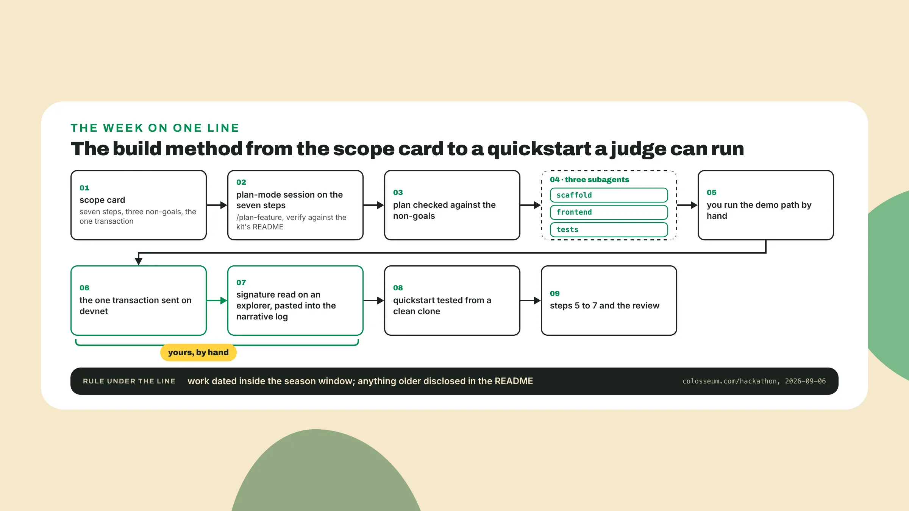
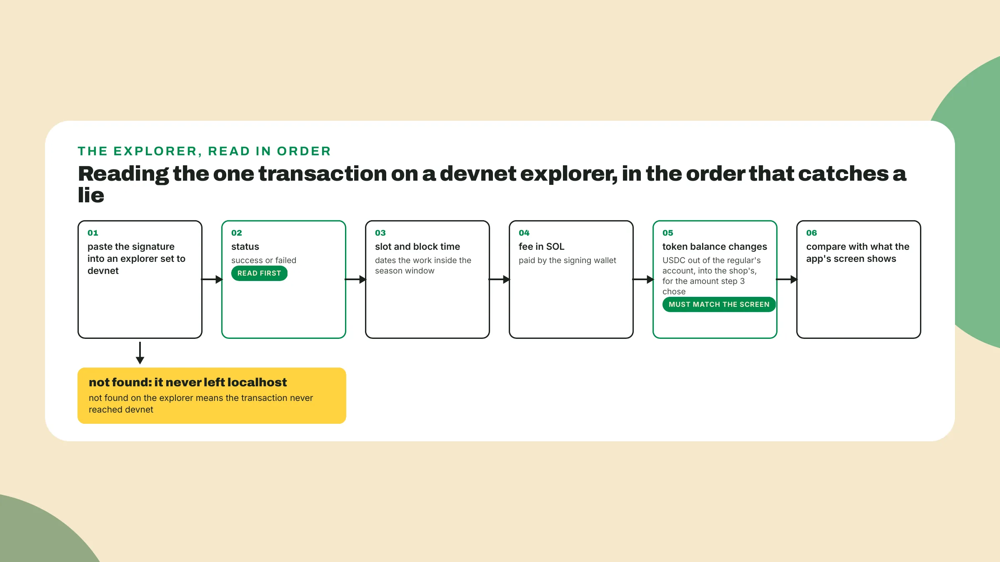
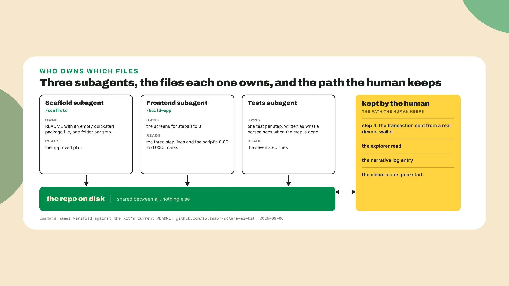
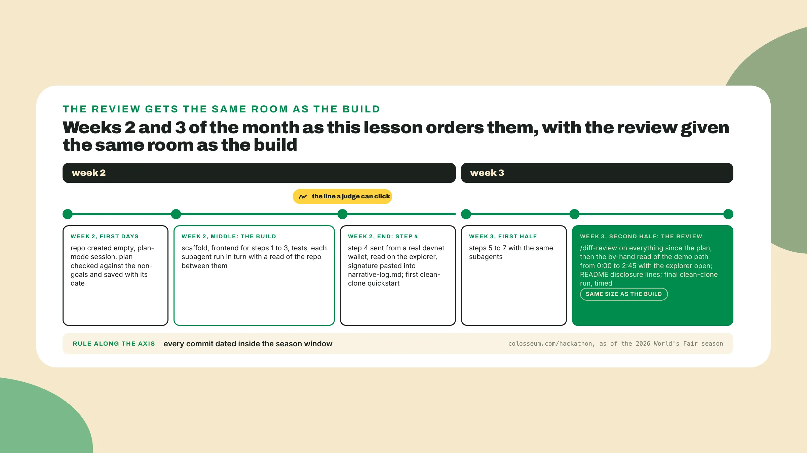

# Build it with an agent team

Last lesson you wrote demo script v0 with its four timestamps and cut the build to a scope card: one job, seven steps, seven non-goals, and the one transaction, a regular paying 15 of a 40 tab in USDC on devnet. **Keep both files open**, *since every prompt and every review this week comes out of them*.

## Why this matters

Colosseum's own FAQ, as of the 2026 World's Fair season, says it plainly: 'We have backed non-technical founders in our Accelerator who built MVPs entirely with AI coding tools' (colosseum.com/hackathon, 2026-09-06). *The judges do not care that an agent wrote the code.* They care that the thing works, that the work happened between the start and the end date of the season, and that they can **run it from your README**.

So the week has one idea: **the agent team builds the steps**, and you keep the demo path, the one transaction and the clean clone for yourself. The tools are Claude Code and the Solana AI Kit plugin from day 0, and *the kit's own tree is the first thing you read*. Clone it beside your toolkit repo:

```bash
git clone https://github.com/solanabr/solana-ai-kit
cat solana-ai-kit/.gitmodules
ls -l solana-ai-kit/plugin/skills
```

## Do this



1. **Count the submodule entries** in the first output and the symlinks in the last one. Read on 2026-09-06, at a last commit dated 2026-08-20, the first output had **18 entries**, among them colosseum, which points at ColosseumOrg/colosseum-copilot, solana-new, which points at sendaifun/solana-new, and helius, solana-dev, sendai, metaplex and jupiter. The last output had three, hackathon, idea-sprint and pitch-deck, each a symlink into .claude/skills, where the wrapper skill lives.

2. Open **one of the three wrapper skills** and read its header. Each says it was adapted from sendaifun/solana-new, MIT 2026 SendAI and Superteam, telemetry removed, and *that is why the wrapper is the version you run whenever both exist*.

The wrappers are **the kit's first layer**. The second is the kit's own commands and agents, and the four this week leans on are /plan-feature, /scaffold, /build-app and /diff-review.

The third is ext, which only arrives with the full install the README describes, and ext/solana-new holds the three skills a build week reaches for when a wrapper does not cover a thing: scaffold-project, build-with-claude and debug-program. The upstream skills there carry a bash preamble at the top that phones home before the skill runs, and the kit's hub page warns never to execute those preamble blocks, so open the skill file first, **skip the block at the top**, then run the skill. ext/colosseum is Colosseum Copilot and still needs the PAT from week 1.

Every command, skill and mode name on this page was read on 2026-09-06 against solanabr/solana-ai-kit main and against Claude Code's docs, and both move with their releases, so *if your output differs from these, your output wins*, and **verify each name** in the kit's current README before you type it.

3. **Create an empty repo** called fiado-warmup beside the toolkit. Colosseum, on the page read 2026-09-06, judges teams only on the work completed between the competition's **start and end dates**, pre-existing code must be disclosed, and misrepresenting either can disqualify a team, ban it and revoke a prize. *An agent will happily pull in a template you wrote last year*, so the repo starts empty on the first day of week 2 and anything older gets named in the README.

4. **Open Claude Code inside the repo** and open the planning session with /plan-feature. Plan mode is the Claude Code mode where the agent reads the repo and writes a plan and **edits nothing until you approve it**. Paste the transcript below as it stands. It is Fiado's scope card from last lesson in the kit's prompt shape, and *when you come back for your own slice, your card goes in place of these lines*:

```text
/plan-feature
Build the demo slice below. Plan only. Do not write files yet.
One job: a regular pays part of his tab from his own phone.
Step 1: the owner opens Fiado on her phone and opens a tab for a regular: his first name and his phone number.
Step 2: she adds today's purchase, 40, and the tab reads 40 owed; a link goes to his phone.
Step 3: the regular opens the link and sees the same 40 on his phone, no install, no login.
Step 4: he taps "pay part", types 15, and his wallet asks him to approve a USDC transfer on devnet, with a memo naming the tab. This is the one real transaction.
Step 5: the transfer confirms, both phones read 25 owed, and a link under the balance opens the signature on an explorer.
Step 6: the owner sets a due date for the 25.
Step 7: the reminder reaches the regular's phone with the 25 and the link.
The balance is derived from the tab's transfer history; the app keeps only the customer directory, the opening amount, the due date and the reminder.
Non-goals: accounts, login, signup, a shop profile, a settings screen; onboarding the regular onto a wallet, or funding it; reais in or out; paying a tab in full, or closing one; a second shop, a second owner; the supplier log and the loyalty stamps; a program of Fiado's own for the tab.
Order the plan so step 4 is built and run before steps 5 to 7 are started.
```

5. **Read the plan for ten minutes** and do nothing else, against three things. First, the non-goals: the plan will very likely propose a login, because most templates have one, and *the non-goal line is there so that you cut it now and not in week 3*. Second, the order: **step 4 before** steps 5 to 7, because everything after it depends on a transaction that exists.

Third, the shape of the transaction: the plan should say USDC, devnet, and a real transfer from the regular's wallet to the shop's, and if it says **mock, stub or simulate** anywhere near step 4, that is the plan telling you it intends to build a demo a judge cannot verify. Fiado's card carries no program of its own, so *if the plan proposes one it read past the card*. Approve only when the three checks pass, **save the plan as a file** with the date on its first line, and commit it, because a judge reading the repo can see it was written inside the window.

```bash
git add plan.md
git commit -m "plan approved, 2026-09-22"
```

6. **Split the plan into three subagents** with one job each, and write each job as a spec of a few lines taken from the card, *never from memory*. A subagent is a second agent that Claude Code starts for one task, and subagents **do not share memory**, so the only thing they share is the repo on disk.

The scaffold subagent runs the kit's /scaffold command against the approved plan and stops when the repo has a README with an empty quickstart section, a package file, and **a folder per step**. The frontend subagent builds the screens with /build-app, and its spec is the step lines plus the demo script's 0:00 and 0:30 marks. The tests subagent writes **one test per step**, as what a person sees when the step is done, and the test that checks the balance after step 4 should exist before step 4 does, *so the step has something to fail*.

**Run the scaffold first**, then the frontend for step 1 alone, then step 2, then step 3, one step per run, and read the repo between runs. *I think the acceleration is not uniform across kinds of work*: the scaffold lands in minutes, the transaction step takes an afternoon, and the afternoon is **the part a judge can check**.

7. Step 4 is yours. **Start the frontend**, open the tab from step 1, tap pay part in step 3, type 15, and pay it from the devnet wallet you created and funded from a devnet faucet on day 0. If it holds no devnet USDC, top it up from a devnet USDC faucet (verify the current one in the kit README) first, *because a transaction that fails for an empty balance teaches you nothing*. When the wallet confirms, the app shows **a signature**, the long base58 string that identifies one transaction on devnet.

**Copy it, open any explorer**, switch it to devnet, and paste it in. **Read the status line first**, because a transaction can be sent and still fail. Then the slot and the block time, *which date the work inside the season window in a way no commit message can*. Then the fee, paid in SOL by the wallet that signed. Then the token balance changes, USDC leaving the regular's account and arriving at the shop's, for the 15 step 3 chose. Then the memo, which names the tab. If the amount on the explorer is not the amount on the screen, **the screen is lying** and the explorer is not.



8. **Start a file called narrative-log.md** at the root of the repo and make this the first entry:

```text
date        the day step 4 ran, written like 2026-09-22
event       step 4 ran on devnet
signature   the full signature, pasted
explorer    the explorer link, set to devnet
amount      the USDC amount step 3 chose
seen        status, slot, fee, and the token balance change, all read on the explorer
```

That file grows through the polish pass, and the deck and both videos get cut from it, but *this first entry is the line a judge can click*.

9. **Test the quickstart** from a clean clone. A quickstart is the part of the README that takes a stranger from a clean clone to the running slice in a few commands, and *the judge reading your repo is that stranger*. Clone your own repo into a folder that has never seen it:

```bash
git clone <your-repo-url> fiado-clean
cd fiado-clean
```

Then do exactly what the README says, and nothing it does not say. If it forgot the environment file, the wallet setup or the devnet USDC, you stop, you **write the missing line** into the README, and you clone again into a new folder. Repeat until a clone that starts from nothing reaches the step 1 screen, and **time the last run**, because that number goes in the README too.

The agent wrote a first quickstart during the scaffold and it will read well, because it was written from inside a session that had the environment file the clone does not. *AI-written work can look correct and be wrong*, and the clean clone is the cheapest instrument you have for catching it, since it costs one folder and ten minutes.

Then **write the README's two disclosure lines** under the quickstart: what in the repo predates the season, if anything, and where it came from, or the date the repo was created if nothing does. *The same two lines go into the portal answers on submission day.*



10. Steps 5 to 7 **go to the same subagents** with the same kind of spec, one step per run. On Fiado's card the frontend subagent gets step 5 and step 7, the screen that reads 25 owed with the explorer link under it and the reminder arriving on the regular's phone, and the tests subagent gets step 6, *because a due date is easy to fake and a test that fires the reminder against a fixed date catches the fake*. Read the repo between each, then **stop building**.

11. **Run the kit's /diff-review** on everything the subagents wrote since the plan was approved, treat its output as a list of places to look and *never as a pass*, then read the demo path yourself, by hand, from the 0:00 mark to the 2:45 mark of the script with the explorer open on a second screen.

On Fiado the by-hand read finds this: step 5 shows 25 owed, the test passes, and the number is the 15 from the pay-part form subtracted from the 40, with the confirmed transaction **never read at all**, so the screen would show the same number if the transaction had failed. Nothing in the diff looks wrong, the test was written from the same assumption, and *a judge who pays a different amount in the interview watches the app lie*. The fix is small, the app reads the amount from the confirmed transaction and shows that, and **finding it took longer than building** the step did.

*My position is that AI-written code needs a different review and a longer one than code a person wrote*, because the person that wrote it is not in the room to tell you what they assumed, and teams underestimate that time. **Put the review on the calendar** as a block the same size as the build block, and when it finishes early, take the time back.

12. **Record Colosseum's weekly update** the day step 4 works. It is optional and strongly recommended, in the page's own words on 2026-09-06, and it is **one minute of video**, and the thing on screen is the transaction confirming, before the polish pass makes the screen prettier, *since a plain screen with a real signature is worth more to a judge than a designed one with a mock*.



13. Now yours: **your own slice** through all seven steps, alone, to devnet. An empty repo dated this week, your scope card in the planning prompt with your own seven steps and non-goals, the three checks before you approve, the same three subagents one step per run, and *the same rule about who keeps the transaction*. If your slice has a program in it, **/build-program and /deploy** are the kit's commands for that, and the polish pass runs the audit.

## Done when

- The quickstart works from a clean clone, following the README only, and **the last run is timed**.
- A **devnet signature** is in narrative-log.md with its explorer link, the link opens, and the amount on the explorer matches your script.
- The demo script's **1:30 mark** is reachable on screen from the step 1 screen without touching anything the script does not show.

## Watch out

- An agent that hits a devnet error will sometimes point the app at **a local validator or a mock**, and the signature it shows opens nothing. Not found means it never left localhost: fix the route, send again, read again, then write the log entry.
- The upstream skills in ext/solana-new run a **telemetry preamble** at the top of the file, and the damage is silent. Read the skill, skip the block, run the skill.
- An agent team ships fast and ships **plausible-but-wrong**, so the speed is bought with review time, and the review block belongs on the calendar at the build block's size.

## The takeaway

The agent team builds the steps, and you keep the demo path, the one transaction and the clean clone for yourself. What the build week produces is **one signature a judge can open and a README a judge can run**, and the review that catches the plausible-but-wrong step takes as long as the build did. *If the week came out as a list of features, read the first entry of narrative-log.md again.*

## Next lesson: make it look real

Next lesson you make the slice look real, which is a different job from making it prettier. The first action is to **open the step 1 screen** the frontend subagent built, take a dated screenshot of it today, and put it in narrative-log.md under the signature, *because a frontend a judge recognizes as agent-made in a second costs more points than a missing feature*. Keep the explorer tab open.
