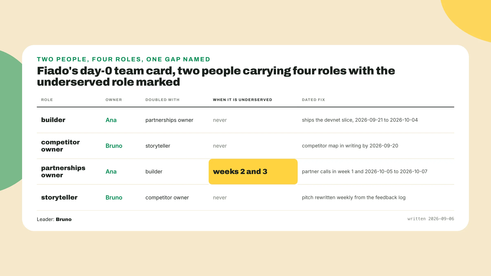
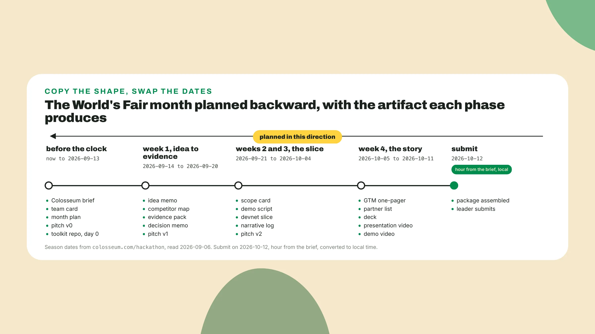
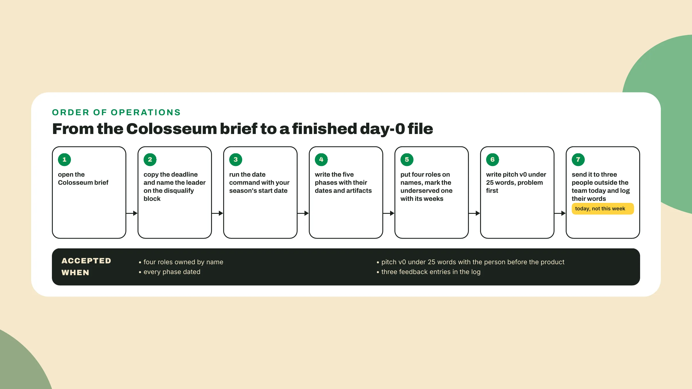

# The team on day 0

Last lesson you wrote the Colosseum brief: seven factors quoted from the live page, four questions mapped onto them, the deadline converted to your time zone. *Keep it open.* Its disqualify block gets **a person's name** next to it before you are done.

## Why this matters

The losing month has a shape I have watched many times: the month goes to code. The presentation gets planned near the end, with no month left to improve it, and the project was shown to too few people outside the team, so the feedback that would have fixed the pitch arrives too late. *The fix is not a better deck in week 4.* It is a sentence on day 0 and a person whose job is to keep rewriting it.

The one idea: the month is **planned backward from the package**, and the pitch is an artifact from day 0. Open a new file called **team-card.md** and put today's date on the first line. It is due *before the clock starts*, whatever your season is.

## Do this

1. **Create the toolkit repo**: make a folder named after your project and initialize git in it.

```bash
mkdir <your-project> && cd <your-project>
git init
```

**Save team-card.md at its root and commit it** before you close the day, *and every artifact the course produces from here lives in this repo*.

2. **Install the kit**. The course runs on Claude Code with the Solana AI Kit plugin from solanabr/solana-ai-kit, and the install command is the one in the kit's README, read on the day you run it. Read 2026-09-07 the kit's plugin/skills folder carried **three skills**, hackathon, idea-sprint and pitch-deck, at commit 353e9a1 from 2026-08-20. *The kit moves between editions, so the README wins over this lesson.* Open Claude Code inside the repo and ask it to **list the kit's skills**. If those three names come back, the kit is in. If not, the README is the next page.

3. **Fund a devnet wallet**. Create one with any wallet app or the Solana CLI, switch it to devnet, and fund its SOL from the devnet faucet the kit README points at. The devnet USDC comes from the source the kit README lists, read on the day you fund it, as of 2026-09-07. Read **two balances** on devnet, SOL for fees and devnet USDC for the tab. If either reads zero, fix it now. *The month has no slot for it later.*

4. **Put four roles on names** in team-card.md, one name next to each job. The builder ships the slice. The competitor owner finds out what the rivals do right and what they do wrong, in writing by the **end of week 1**. The partnerships owner sells the idea to adjacent projects before demo day, *so the team arrives with a few partners already on its side*. The storyteller owns the pitch sentence and the feedback log and **rewrites the sentence weekly** until it is the first line of the deck.

A team of two still names four jobs, *because the four questions on your brief do not shrink when the team does*. Assign the roles **only one person can do** first, then the doubles, and write the weeks a doubled role will be underserved. Alone, you own all four, and *the honest line is which two get an hour a week*. Fiado's roles, with the underserved one marked:



Then the portal's fields. As of the 2026 World's Fair season, Colosseum's submission asks for every teammate with their background and previous experience, and for the team's location. Every member has to **create an account**. The team leader adds the others during submission and must complete the submission **before the deadline**. *Solo participation is allowed.* So the card carries a background line per person, the location, and **the word leader** next to one name, copied onto the disqualify block of your brief today.

A seasonal hackathon or a side track will have its own page with its own deliverables and deadline. **Read that page the day you decide to enter**, and reuse the package you already have. Fiado's full card:

```text
team-card.md, Fiado, day 0, written 2026-09-06
pitch v0: A shop owner who loses the credit notebook loses forty small debts with it,
          so Fiado keeps the tab on-chain and reminds each regular.

role                 owner   doubled with         note
builder              Ana     partnerships owner   ships the devnet slice, weeks 2 and 3
competitor owner     Bruno   storyteller          map in writing by 2026-09-20
partnerships owner   Ana     builder              UNDERSERVED weeks 2 and 3; calls in week 1 and 2026-10-05 to 10-07
storyteller          Bruno   competitor owner     owns pitch v0 and the feedback log, rewrites weekly

leader:      Bruno (completes the submission before the deadline on the brief)
location:    <city, country, as the portal asks>
background:  Ana, web developer, three years shipping small business tools, grew up in a corner shop
             Bruno, writes for a living, first hackathon
```

5. **Plan the month backward**, under the card. **Write the last date first**: the season's end date on your brief, with the hour re-read on the live page and converted. As of the page on 2026-09-06 the World's Fair hackathon runs **September 14 to October 12, 2026**, which is 28 days, four weeks to the day. From the deadline walk back a week of story, two weeks of slice, a week of evidence, and before that now. Derive the boundaries from the start date *instead of typing them*:

```bash
python3 -c "from datetime import date, timedelta; s = date(2026, 9, 14); print(*[s + timedelta(days=7*i) for i in range(5)], sep='\n')"
```

The first line printed is the day the clock starts, the last is the deadline day, and the three between are **the phase boundaries**. If the live page moves a date, *change the one date inside the command and every line under it moves too*. **Put the five dates** on five phases, name the artifacts each phase ends with, and let the deadline line point at the brief for the hour. On the before-the-clock row, add **three dated lines** for steps 1 to 3. Fiado's: repo initialized 2026-09-06, kit installed the same day, Ana's devnet wallet holding SOL and devnet USDC, checked 2026-09-06. Its plan is the timeline below, five lines.



6. **Write pitch v0** under the date. One sentence, the problem before the product, under **25 words**: a person first, then the thing that person cannot do today, then your product. Fiado's product-first version is "Fiado is an on-chain credit tab for corner shops with stablecoin settlement and automated repayment reminders", sixteen words, *all of them true, and nobody in it*. Its v0 at the top of the card is 24 words, and the first eight are a shop owner, a lost notebook and forty small debts.

**Count the words**. If the first word is your product, keep that line as a record of day 0 and write a second under it that starts with a person. *It will be a bad sentence.* It exists, and that is the whole requirement for a v0.

7. **Set the feedback cadence**. A feedback log is a file with a date, a name and what that person did not get. Show the sentence to **three people a week** who are not on the card, and write down, in their words, the part they did not understand. *What they liked goes nowhere.* A reply of "cool" is not a log entry, so ask them what the sentence is about and write down what they say back. Put this week's three names in **today**, empty rows and all. Fiado's three sit at three distances from the problem:

```text
feedback-log.md
date         name, outside the team                              what they did not get, in their words
2026-09-07   Lucia, the shop owner, Ana's aunt                   (sentence shown this week)
2026-09-07   Jorge, a regular who keeps a tab                    (sentence shown this week)
2026-09-08   Marcos, entered a hackathon once, never ran a tab   (sentence shown this week)
```

**Send your sentence** to your three today. Fiado's three reactions will be in the log by **2026-09-13**, *which is why v1 is due at the end of week 1*.



## Done when

- **Four roles** are owned by name, and the leader's name is on the disqualify block of your brief.
- Every phase carries **a date the command printed**, and the deadline line points at the brief for the hour.
- Pitch v0 is **under 25 words** with the person before the product.
- The feedback log holds **three dated entries** in the people's own words.

## Watch out

- **A plan with no dates** is a list of good intentions, and the deadline is published in UTC, so the converted line from last lesson goes on the plan.
- A sentence that **starts with the product** asks a listener to care about a name they have never heard.
- A two-person team where the competitor owner is also the only builder, and **nobody says so**, gets a thin week-1 map. Say so on the card and date around it.

The storyteller **costs you a builder**, a quarter of the building hours on a team of four, *and it is the right trade* because the code shows up in very few of the seven lines on your brief and the storyteller's work in most of the others.

## The takeaway

The month is planned backward from the package, so **the deadline is the first date on the plan** and every phase is derived from it. Four roles are owned by name even on a team of two, because the four questions on your brief do not shrink when the team does. *The pitch exists from day 0 as one sentence that names a person before the product, and three people outside the team have already told you what they did not get.*

## Next

Week 1 starts next lesson, and the first thing you do is **throw away the idea** you came in with, *or prove it deserves to stay*. You put it next to two other problems you, or people near you, actually have, and score all three until one survives. Lesson 4 opens Claude Code inside this repo, and the sentence in your file is the first candidate.
