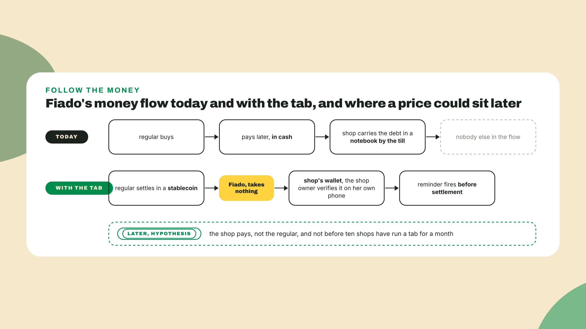
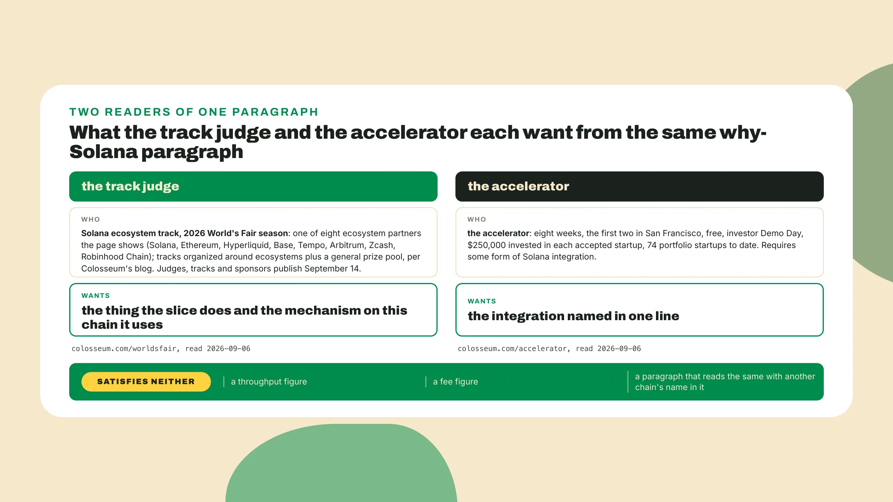
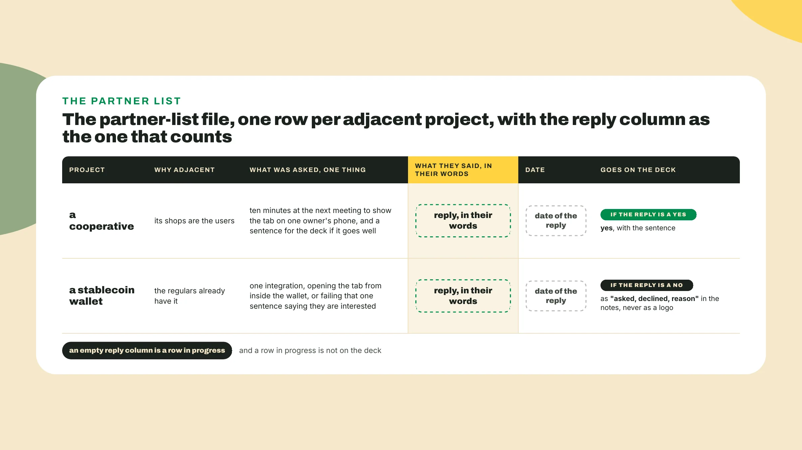

# Where the first hundred come from

Last lesson you ran the does-it-look-real pass on your tab screen, logged a week-2 update video into the narrative log, and rewrote the pitch as v2. **Open the log and pitch v2** side by side. Week 4 starts on those two files, and the first thing it asks is the question the log cannot answer on its own: *how does anyone find this?*

## Why this matters

Colosseum is multichain: as of the 2026 World's Fair season the season page shows eight ecosystem partners, Colosseum's blog says the prize tracks are organized around those ecosystems with a general prize pool, and the full list of judges, tracks and sponsors lands on September 14. The Colosseum Accelerator, read 2026-09-06, invests **$250,000** in each accepted startup and requires some form of Solana integration. So **Solana is a track you chose**, and a judge on a multichain panel gets to ask why, *a question the room used to assume and that now carries a score*.

Distribution is **a claim with evidence**: who the users are, where they already gather, and how the product reaches them through that place, *a hypothesis because you have not done it yet, a claim because a judge scores it anyway*. **Open a new file called gtm-one-pager.md** and put today's date on the first line.

## Do this

1. Under the date, **write one sentence naming a group** of about a hundred people who share your problem and the one place where you already reach them, a group with a meeting, a chat, a counter or a street, *small enough that you could stand in it*. Fiado's line, written 2026-10-05:

```text
gtm-one-pager.md, Fiado, started 2026-10-05
first 100 users: the regulars of five shops in Lucia's cooperative, about twenty tabs a shop,
                 reached through the shop owners at the cooperative's monthly meeting
```

If your line names a market and no place, keep it as a record of day one and **write a second line under it** with a place in it. A hundred people you can point at is the whole requirement, and *it is harder to write than it looks*.

2. **Write the distribution hypothesis** as the people flow: a person with the problem, the place they already gather, first contact with the product, the first 100 users. The page has to read as **two flows, people and money**, since Traction and Viability get read off the same page and both are questions about a flow. Fiado's hypothesis: *the unit of distribution is the shop, not the regular*, Lucia shows her own tab on her own phone at the cooperative's monthly meeting, and an owner that opens a tab brings around twenty regulars with it, because the regulars are already in the notebook. *A regular never has to be sold anything.*

3. **Write the price**, or the reason there is none. **Draw the money flow first**, who pays whom today and with the product. For Fiado today the regular buys, pays later in cash, and the shop carries the debt in a notebook by the till. With the tab the regular settles in a stablecoin to the shop's wallet, the reminder fires before the settlement and not after, *and Fiado sits between the two and takes nothing*.

That last clause is the whole pricing section for a project with one shop. A pricing slide for a product with no users is *a slide about nothing*. The honest line has **three parts**. Fiado's: none yet, the shop would pay, since the shop is the one that loses the notebook, and not before **ten shops** have run a tab for a month.



Viability is on the live factor list, and this is **where the page answers it**. None yet at the end of a drawn money flow reads as a decision the team made with its eyes open, *and the same words with no flow drawn read as a team that never thought about it*.

4. **Write why-now**, the thing that changed recently that makes the product possible or needed today and not three years ago, and point at the evidence pack from week 1 rather than re-arguing it. Fiado's: a stablecoin balance a regular can hold on a phone without a bank account, evidence in evidence-pack.md. Write it **before why-Solana**. It is *the easier of the two*, and it gives the why-Solana paragraph a reason to exist.

5. **Write why-Solana** for two readers. The track judge scores the Solana track, one of the eight ecosystem partners, and in the same season has seen the same category of project argued for each of the others, so the question in that judge's head is plain, *what does this slice do that this ecosystem makes easier*, and **the answer wanted is a mechanism**: something the slice does and the thing on the chain it does it with.

The accelerator, read on 2026-09-06, runs eight weeks, the first two in San Francisco, costs nothing to attend, ends in an investor Demo Day, has invested in 74 portfolio startups by the same date, and **requires some form of Solana integration**. That reader wants the integration **named in one line**.



The paragraph most teams write **satisfies neither reader**: a throughput figure, a fee figure, and the same paragraph on every track in the building with the chain's name swapped. A number about the chain is a claim about the chain, *and your slice is not in it*. **Fill this shape instead**, four sentences or so:

```text
why-Solana, the shape of the paragraph
the slice does:          <one thing, in the words of the demo>
on Solana it uses:       <the account, the transfer, the wallet, whatever the mechanism is>
on the next track over:  <the same thing, or what breaks>
for the accelerator:     <the integration in one line, with the transaction from the narrative log>
```

Fiado's paragraph is **marked OPEN on its page**, and *the raw material sits in a note beside it*. The slice lets a regular pay part of a tab and the shop see it land.

The mechanism is **the payment history itself**: each part-payment is a USDC transfer on devnet with a memo naming the tab, the balance both phones show is derived from those transfers, and the app keeps only the customer directory, so a shop and a customer can both read the record *without trusting the app or each other*, and the shop owner verifies a payment from her own phone, without a bank statement. Then **a wallet the regular already has**, whose users are on this chain. For the accelerator, the integration is **the settlement itself**, and the transaction is in the narrative log.

**Write Fiado's paragraph from that note**, then write yours, and run the test on both: *would the slice do the same thing on the next track over?* If yes, the paragraph is why-a-chain, and the honest version is about where the users and partners already are, which is still a mechanism. If no, **write down what breaks**. That sentence is the paragraph.

6. **Send two outreach messages** today. On day 0 you put a partnerships owner on the card. On Fiado's card that is Ana, doubled with builder, *marked underserved in weeks 2 and 3*, with the partner calls dated into week 1 and into **2026-10-05 to 2026-10-07**.

An adjacent project is one **whose users are your users**, or whose product your slice already touches. Each message asks for **one integration or one quote**, with a smaller ask beside it, and says what your product is in the sentence a stranger already understood in the feedback log. A message that asks to partner asks for nothing, *and it gets the same back*. The method is David's: **spend real hours selling the idea** to the projects that could integrate with your slice, because a team that arrives at demo day with a few partners already on its side has an edge, and *it is the one edge I would take over any feature in week 4*.



Ana's two messages go out on **2026-10-05**. The first goes to the coordinator of the cooperative and asks for **ten minutes at the October meeting** so Lucia can show the tab on her own phone, plus one sentence for the deck if the room likes what it sees. The second goes to the wallet the regulars already use and asks for one integration, opening the tab from inside the wallet, with **the fallback in the same message**: failing that, one sentence saying they are interested in the use case.

A message with only the big ask in it gets no reply. A message with a small ask beside it gets the small one, *which is a reply, which is a row*.

7. **Log every reply in partner-list.md**, one row per project: who, why adjacent, what was asked, what they said in their words, the date, and whether it goes on the deck. *An empty reply column is a row in progress.* A row with a reply, **even a no, is evidence**, and the only kind that goes on the deck. Fiado's file by the end of the week:

```text
partner-list.md, Fiado, week 4, started 2026-10-05

project        why adjacent           asked                     they said                          date        deck
cooperative    its shops are the      ten minutes at the        "yes, after the treasurer,         2026-10-06  yes, with
               users                  October meeting; one      bring Lucia's phone. we can                    the sentence
                                      sentence for the deck     say we are trying it in
                                                                three shops"
wallet         regulars already       open the tab from inside  "not before the end of the         2026-10-07  notes only:
               have it                the wallet; failing that  year. interesting, but the                     asked, declined,
                                      one sentence of interest  roadmap is fixed"                              reason
```

The yes goes **on the deck as a sentence**, the cooperative's name and the three shops. The no stays **off the deck as a logo** and goes in the notes as asked, declined, and the reason, because in the 15-minute interview a judge that asks about wallets gets *a true answer with a date on it*. In that interview a judge reads the partner slide, picks one name, and asks:

```text
judge:   Tell me about the cooperative.

team A:  We reached out to them. They seemed interested.
team B:  We asked for ten minutes at their October meeting. The coordinator said yes on
         2026-10-06, after the treasurer, and they are telling their shops they are trying
         it in three of them. Lucia shows the tab on her phone at that meeting.
```

Team A emailed five logos once, so it has **four names it cannot talk about**, and the judge picked at random. Team B has one name and one true story, *with a date, a person and a next step in it*.


## Done when

- The **first 100 users** are named as a group with a channel, and a market is not a group.
- The page reads as **two flows, people and money**, with pricing as a number or as none yet, the reason, and who would pay first.
- **Why-Solana** argues both the track and the accelerator, names the integration in one line, and names no benchmark.
- **Two outreach messages** went out today, and one reply is logged in their words with a date, even if the word is no.

## Watch out

- A why-Solana that opens with **a throughput or fee figure** reads the same with any other chain's name in it, and the track judge has read it from every other entry that morning.
- **A partner you emailed once** is a logo you cannot back, and it is worse than an empty slide, since an empty slide tells the judge nothing and a hollow logo tells the judge something about the team.
- **Ten messages in week 4** is the polish trap from last lesson wearing a different file name, a partner list and no video. *Two messages is the cap.*

**One real reply beats five logos**, and a logged no is still a reply: it tells the judge you asked, learned the reason, and know what has to change before that project says yes, and I would guess that half the teams in the room never asked anyone at all, *a guess I cannot back with a count*.

## The takeaway

Distribution is a claim with evidence: a group of about a hundred people you can point at, the place you already reach them, and a money flow drawn far enough that none yet reads as a decision. Why-Solana names **a thing the slice does and the mechanism on the chain that does it**, never a benchmark, and one reply logged in a partner's own words beats five logos. *If a number came out first, say it again with the number removed. It is usually still true, and better.*

## Next

Next lesson the pitch becomes a deck, and the first thing you do is **open a new file called deck-judge.md** and write seven headings in it before any slide has content. **Five to seven slides** for a judge, and a seasonal hackathon or a side track will have its own page with its own deliverables, so you read that page the day you decide to enter and reflow the same deck, because the one-pager, the narrative log and the sizing file are *the deck already, in the wrong shape*. The partner row with a real reply in it is the line a judge will believe first.
