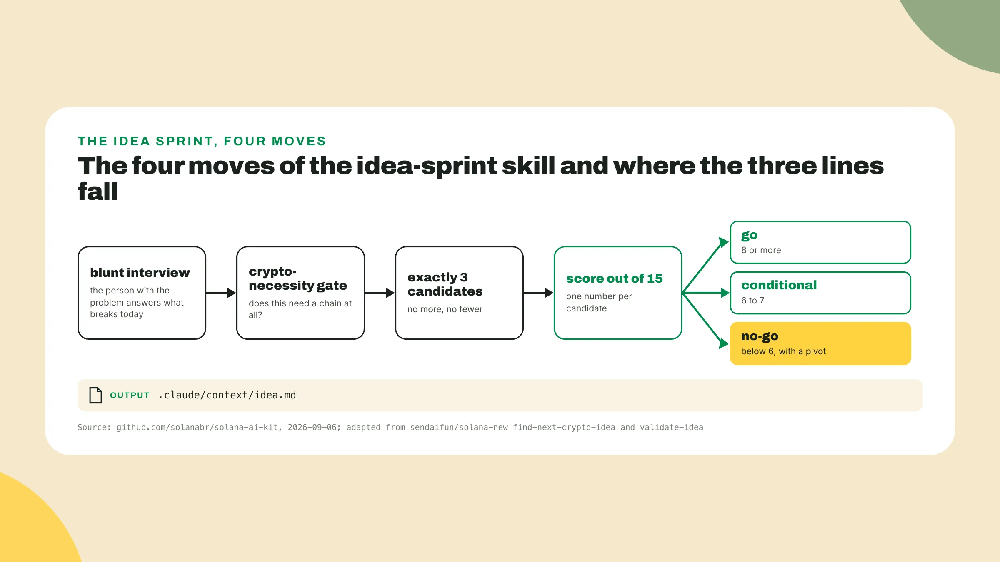
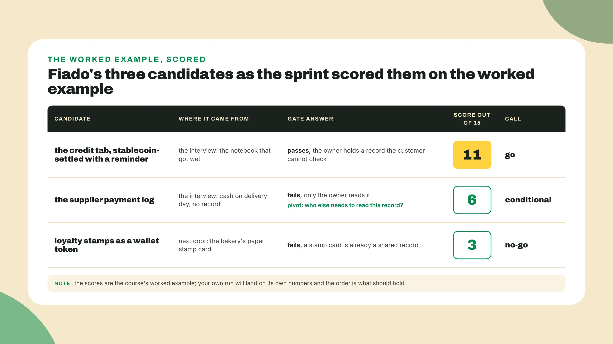
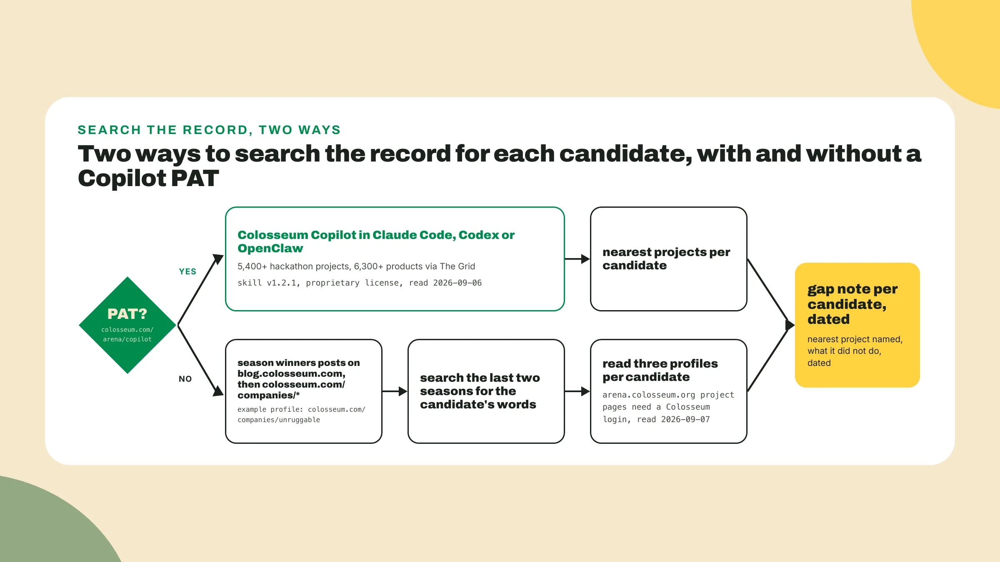

# Problems you actually have

Last lesson you wrote the team card, the dated month plan and a one-sentence pitch v0, and three people have already reacted to that sentence. **Keep the feedback log open**, *because the sentence is about to be tested harder than three friends could test it*.

## Why this matters

Week 1 starts here, and the first thing you do with your idea is **try to kill it**. The good hackathon ideas I watched win came from a problem someone on the team, or someone close to them, has or had, and the ones that started from "DeFi for X" mostly did not place. That is the split between **problem-first**, a person and a thing they cannot do today, and capability-first, a chain feature looking for someone to do it to. The seven factors do not score technology for its own sake, and *a judge reading the written answers can tell when the person was added in week 4*.

So today you generate three ideas problem-first and score them until one survives. **Open Claude Code** inside the toolkit repo you initialized on day 0, with the kit installed the way lesson 3 did it, and start with step 1.

## Run the sprint on Fiado

A reminder before the first step: **Fiado is the course's example project**, nothing more. It is the corner-shop credit notebook from lesson 1, turned into a stablecoin-settled tab, and every lab in this course runs on it first *so you always have a worked example to copy*. You then run the same steps on your own problem.

1. **Ask for the idea-sprint skill** by name, with the Fiado problem as the input, in your own words:

```text
Run the idea-sprint skill. The problem: a corner shop owner extends credit to regulars
and keeps every tab in a paper notebook by the till. Last month the notebook got wet
and about forty open tabs became unreadable. Interview me as that shop owner.
```

*The exact invocation changes with the kit's releases*, so verify it against the **kit's current README** before you type it. The kit is at github.com/solanabr/solana-ai-kit.

2. **Answer the interview** as the shop owner, bluntly, *and do not steer it toward the tab idea*. The skill asks what happens today, what breaks, **who pays when it breaks**, and what the owner does about it, and it does not accept "it would be nice if" as an answer. Fiado's owner says the regulars buy on credit, some pay on the fifth when the salary comes in and some do not, the notebook got wet, the owner paid for it in money never collected and in regulars who stopped coming, and now photographs each page with a phone until the phone is full.

3. **Watch the crypto-necessity gate** ask one question of every candidate: built with a database and a web app, what would break? If nothing breaks, the idea does not need a chain, and *putting one under it is a cost the judge will see*. If something specific breaks, **write that sentence down**, because it is your why-Solana line for the month and it goes straight into the Insight answer.

   Fiado's answer is not "payments", since a shop can take a card today. What breaks is **the trust between two people** who do not trust a third one: the owner holds the record, and when the notebook is gone both are guessing. A tab that settles in a stablecoin on a chain neither of them runs is *a record both can read and neither can edit after the fact*.

4. **Expect exactly three candidates**, and take one from next door. Adjacent ecosystems, the shops, apps and habits right beside your problem, are full of things that work on paper, and *a thing that works on paper is often working on paper for a reason*.

   Fiado's three: the tab that settles in a stablecoin with a reminder on the date the customer chose, the supplier payment log for the cash the same owner hands distributors on delivery day with no record, and the paper loyalty stamps a bakery two streets over hands out, as a token a regular holds in a wallet. **The log fails the gate** because only the owner reads it, *so there is nobody to distrust*. **The stamp card fails** because it is already a record both parties can see.



5. **Read the score**. Each candidate gets a number out of 15, and the line the kit draws, as of 2026-09-06, is **at 8**: 8 or more is a go, 6 to 7 is a conditional, below 6 is a no-go with a pivot attached. A conditional has to name the one thing that would make it a go, and if the skill does not name it, ask, since *a conditional with no condition is a polite no*.

   On Fiado's run the tab lands at 11 for a go, the supplier log at 6 for a conditional with the pivot "who else needs to read this record?", and the loyalty token at 3 for a no-go. Your run will not land on those numbers, and what should hold is **the order and the calls**. If the loyalty token came out above the tab, **re-read your interview**, because the usual reason is that *you answered as a builder who likes tokens rather than as a shop owner who lost a notebook*. What the 15 points are made of moves between releases, so **read the breakdown** from the skill's own output on the day you run it.

```text
score out of 15, idea-sprint, github.com/solanabr/solana-ai-kit, read 2026-09-06
8 or more   go
6 to 7      conditional, the condition named
below 6     no-go, a pivot attached
```



6. **Open the file the skill wrote**:

```bash
cat .claude/context/idea.md
```

Read on 2026-09-06, the kit's idea-sprint writes **exactly three candidates** there, each with a score out of 15 and a go, conditional or no-go. As of 2026-09-06 the skill is adapted from two skills in sendaifun's solana-new collection, find-next-crypto-idea and validate-idea, and the repository says so. **Keep that credit in your notes**, *since the upstream is where you go when the kit changes*.

## Search the record, then run your own

7. **Find the past projects** nearest to each candidate and write down what they did not do. That is gap analysis, and *the gap is where your candidate lives*. What they did badly is a different note for a different lesson, and a candidate with no gap is **a clone of last season's winner**, which the judges have already scored once.

   As of the 2026 World's Fair season, Colosseum's blog reports that the Cypherpunk season, submissions due October 30, 2025 and winners announced December 13, 2025, had 9,000+ participants and **1,576 final projects**, across the tracks Infrastructure, Consumer, DeFi, Stablecoins, RWAs and Undefined. **Undefined is a track**, so *the categories are not a list of ideas to pick from*. Which search you run depends on a token.

   With a PAT: Colosseum Copilot is a skill that, as of 2026-09-06, indexes **5,400+ hackathon projects** from two years of submissions plus 6,300+ products through The Grid, and it runs in Claude Code, Codex and OpenClaw. The kit ships it as the ext/colosseum submodule, which points at github.com/ColosseumOrg/colosseum-copilot, version 1.2.1 on the day this was read, under a proprietary license. **Get the personal access token** from colosseum.com/arena/copilot after logging in, *because without it the skill will not answer*, and verify the version and the token page against the kit's current README. **Ask Copilot for the projects nearest** to each of your three candidates and *read the ones that were finished, not just submitted*.

   Without a PAT: open the **Cypherpunk and Frontier winners posts** on blog.colosseum.com, search each for your candidate's words, and follow the names into the company profiles at colosseum.com/companies. **Read three profiles for each candidate**. The hackathon page itself lists only the grand-prize winners, and the project pages on arena.colosseum.org ask for a Colosseum login before they show anything, read 2026-09-07, so *the blog posts are the open door*. It costs nothing, and *I would guess most teams that place did it the slow way at least once*.



8. **Write one gap note per candidate**, including the no-go, in a fixed shape: the nearest past project, its season, what it built, what it did not do, and the date you searched. Fiado's note names Yumi Finance, read from the Cypherpunk winners post on 2026-09-07, and *the shape is what you copy*:

```text
gap note, candidate 1, the credit tab, searched 2026-09-07
nearest:  Yumi Finance, Cypherpunk, DeFi Track first prize (blog.colosseum.com winners post)
it built: an onchain buy now, pay later product that handles underwriting through loan origination
it did not: hold a tab between a shop and a regular who already know each other; no underwriting, no loan, no new lender
second nearest: Corbits, Cypherpunk, Infrastructure Track second / did not: merchant tooling for x402 endpoints, no credit between the two parties
```

The no-go's nearest project is usually the one that tells you why it was a no-go, so **the score gets its receipt**. If the tab is the only candidate with a note, *you did not do a gap analysis, you looked for permission*. A candidate at 11 with a nearest project that already does everything it does **is not at 11 anymore**, and the memo says so, in the candidate's row, with the date.

9. Now your three. **Write down three people** you talked to in the last two weeks who complained about something: a parent, a landlord, the person at the counter, a teammate's cousin. *The closer you are to the person the better the interview goes*, and if none of the three is a problem you would personally pay to have fixed, find a fourth person before you run anything.

   **Run the sprint**, once per problem or once with all three, whichever the current skill supports, and answer bluntly. If you catch yourself typing the answer that leads to the idea you came in with, *that is the idea the sprint exists to test*, so type the true answer and let it score.

   Then **run the gap search** for all three and write the three notes into the idea memo, with one row marked chosen. If the chosen candidate scored below 8, take the pivot the skill attached, *since re-running the interview until the number you wanted appears is the same as not scoring at all*. The chosen row's first line is **a person and a problem**, in that order, the same rule as pitch v0, because the next three lessons read that line over and over.


## Done when

- The **idea memo** holds three candidates, each scored out of 15, each with the gate answered in one line.
- One candidate is marked chosen, its score is **8 or more**, and its first line is a person and a problem.
- Each of the three, the no-go included, has a **gap note** naming at least one past project, what it did not do, and the date searched.
- The memo's **source line** names .claude/context/idea.md and the Copilot query or the public pages you searched.

## Watch out

- Choosing the idea that shows off **the most technology**, because the seven factors do not score technology for its own sake.
- Running the record search **only after the idea is chosen**, because the whole point of three candidates is that the record can reorder them, and it does.
- Treating a memecoin, or **a clone of last season's winner**, as a gap.

A scored idea memo **kills ideas you love**, and that is its job, because the team that skips the score to protect a favorite does not avoid the scoring, it hands it to the judges in week 3, *who do it in silence and never send the pivot*. If your favorite scored below 6, **argue with the interview** rather than the number, and if the answers were honest the idea stays in the memo as a dated no-go that may come back at a 9 next season.

## The takeaway

An idea earns its place by surviving a blunt interview, the crypto-necessity gate and a score next to two rivals, **not by being the one you came in with**. The gate question, what would break with a database and a web app, is your why-Solana line for the month. *A chosen candidate is a person and a problem with a dated gap note beside it, and a score you hoped nobody would check is a score the judges will.*

## Next

The competitor owner earns the role next lesson: who does this today, outside the hackathon record, what they do right, what they get wrong, and *the one number a judge will ask you for that you do not have yet*. Your first action there is **copying the three questions** Colosseum asks under Potential Market Size into a new file, before a single competitor is named, so keep the brief and the memo where you can reach them.
