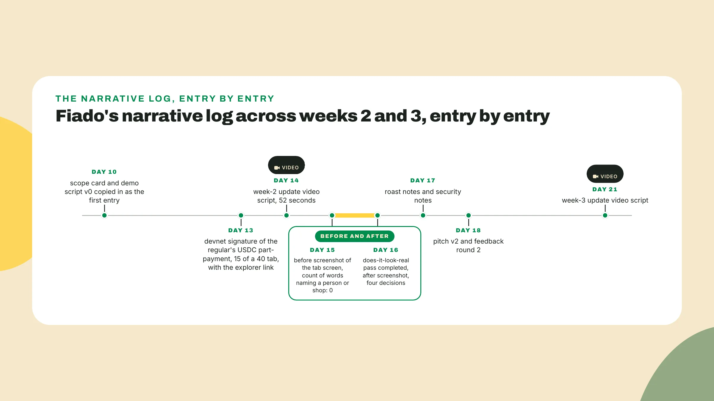
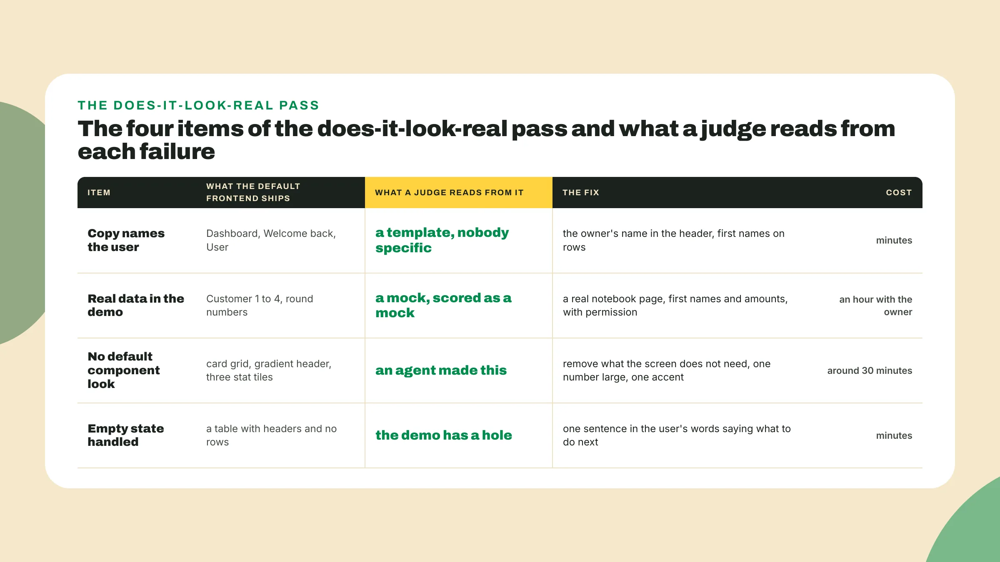
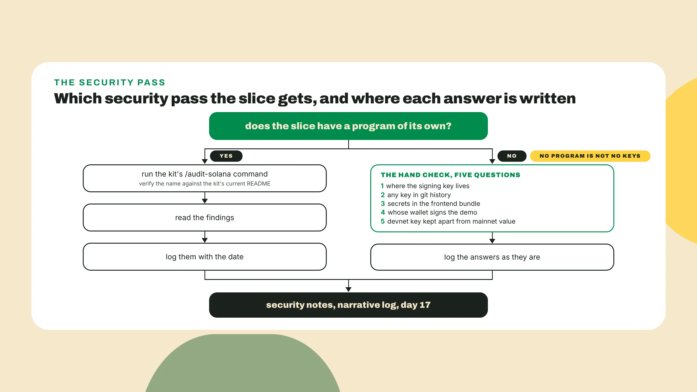
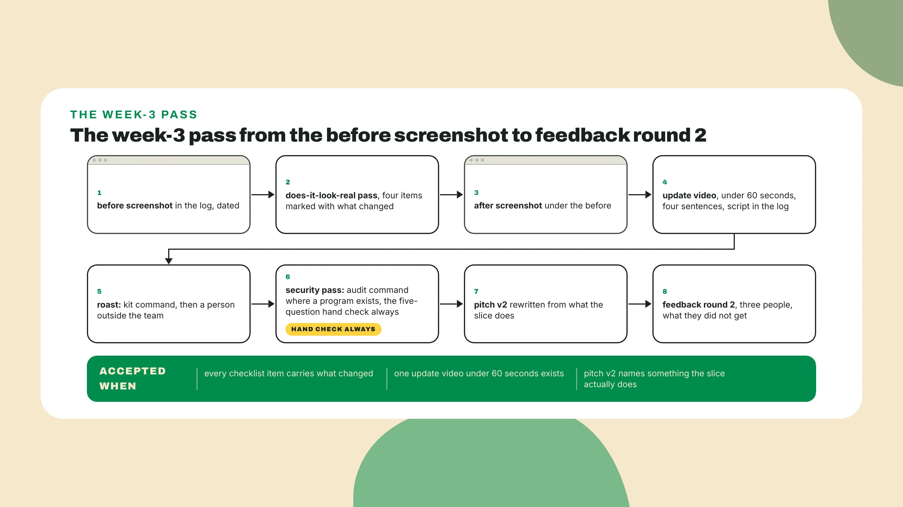

# Make it real, then say what changed

Last lesson you shipped the seven-step slice to devnet with an agent team, and the last line in your log is the transaction signature a judge can open. Keep the slice running on a second screen, because **nothing new gets built today**. Today it gets looked at, by you and by people that were not in the build, and *what they see gets written down*.

## Which one is yours

Two demos, same feature. One has a frontend that any judge who has used an agent tool recognizes in a second: the same layout, the same gradient, the same placeholder copy. The other looks like somebody cared about the person on the other side of the screen. The demos that placed **did not look AI-made**, and they were functional enough for a demo, and *nothing in that sentence says beautiful or complete*. **Find out which one yours is** before reading on.

## Do this

1. **Keep the narrative log**, starting with a before screenshot. Open the slice on the screen the demo spends the most time on, for Fiado the tab screen. Take a screenshot of it *exactly as it is*, paste it into the log under today's date, and write one line next to it: before the pass. Then read every word on that screen out loud, count the ones that name a person or a shop, and **write the count** next to the screenshot.

```text
narrative log, Fiado, day 15
screenshot:  tab-screen-day15.png (before the pass)
words on screen naming a person or a shop: 0
what the screen says instead: Dashboard, Welcome back, Total Balance
```

The count is **usually zero**, because that is what a frontend subagent ships *when nobody told it who the user is*. A narrative log is a dated record of the build, **kept while the build happens**: a screenshot whenever a screen changed, with the old one left above it, the signature of any transaction the demo will show, with its link, a decision whenever something was cut, in the words the team used at the time, and once a week the script of the update video. The deck and the two videos of week 4 get **cut from this file**.

Colosseum's weekly update is optional and strongly recommended, and its shape is **a one-minute video**, as of the hackathon page read on 2026-09-06. The script is **four sentences**: what changed this week, *shown and not described*, why it changed, with the decision from the log, what a judge would now see if they cloned the repo today, and what comes next week. **Under 60 seconds**, phone camera or screen recording, one take. A second take is fine. A third take is the polish trap. Fiado's week-2 script, as it went into the log on day 14:

```text
update video, week 2, Fiado, recorded day 14, 52 seconds
0:00  This week the tab moved from a mock to devnet. Here is the transaction where
      a regular pays 15 of a 40 tab, and here is the same tab reading 25 on the
      owner's phone.
0:18  We cut the customer signup. Two owners told us in week 1 that the tab lives
      on their phone, so only the owner opens tabs and the regular only sees a
      balance.
0:35  If you clone the repo today, the quickstart runs the seven steps and the
      first part-payment confirms on devnet.
0:46  Next week the screen stops saying Dashboard, and a real page from a real
      notebook goes on it.
```

The 0:18 line, *a decision with the week-1 evidence behind it*, is the sentence a judge asking **how the team prioritizes** wants to hear.



2. **Run the does-it-look-real pass** on that screen. Four items, each asking whether a person that has this problem *would believe the screen was made for them*. **The copy names the user**: the owner's name in the header, or at least your shop, and the regular's first name on each row, not Dashboard or Welcome back. **The demo shows real data**: a real page from a real notebook, first names and amounts, with the owner's permission, because from the moment Customer 1 through Customer 4 appear with round numbers *the rest of the demo is scored as a mock*.

**No default component look**: the card grid, the gradient header and the three rounded stat tiles come out, and the one number the owner cares about goes where her eye lands first, one font, one accent color, the total owed large, around 30 minutes. **The empty state is handled**: open the app as a new shop with no tabs, and if what appears is a table with headers and nothing under them, *the demo has a hole in it*, since that is the first screen a judge that clones the repo will see. There is **no fifth item** about taste.



Fiado's day-15 screen was the normal one, three stat tiles all showing zero since they were reading a different table, and if yours looks like it, *that is what the tool ships and not a failure*. The checklist for it, with **three items done**:

```text
does-it-look-real pass, Fiado, tab screen, day 16
copy names the user      changed: header "Dashboard" -> "Lucia's shop"; greeting
                         removed; each row carries the regular's first name
real data in the demo    changed: rows Customer 1 to 4 -> six regulars from Lucia's
                         notebook page, first names and amounts, with her permission
no default look          changed: three stat tiles -> one number, the total owed,
                         large at the top; card grid removed; one accent color
empty state handled      (yours to finish)
```

Lucia is the shop owner from the week-1 conversations, Ana's aunt, already in the feedback log from day 0 and round 1, and the log **records her permission with the date**, *because a judge may ask*. **Now the fourth item**: open Fiado as a shop with no tabs, the way a judge that just ran the quickstart would see it, take the screenshot, and write the empty state in Lucia's words, something like no tabs yet, open the first one from the notebook, with the button that does it right under the sentence. **Mark the item with what changed**, paste the after screenshot under the before, and date it.

3. **Roast the slice**, kit command first and then a person outside the build. A roast is a review by someone from outside the build, told to look for *what is wrong and not for what is nice*. The kit ships a /product-review command among its 30 commands, as of the solanabr/solana-ai-kit repository read on 2026-09-06, and that command is **the first roaster**. **Verify the command name** against the kit's current README before you run it, *since the kit tracks its main branch and names move*. Point it at the repo and the demo script.

**The second roaster** is a person that did not build the thing, with the same instruction: what is wrong, what is confusing, what would you not believe. **Log three lines per roaster**, *in the roaster's words*. Fiado's:

```text
roast notes, Fiado, day 17
person    the regular cannot tell from the screen what happens when the tab is
          paid in full
person    the total owed at the top has no date next to it
person    the word devnet appears in the footer where a shop owner would read it
          and not know what it means
command   the quickstart assumes a funded wallet and never says so
```

Two of the four became decisions in the log **the same afternoon**. The third, the date next to the total, waited for feedback round 2 to confirm *that somebody else wanted it too*.

4. **Run the security sanity pass**, in whichever shape applies, and the hand check either way. Where the slice has a program of its own, the kit's /audit-solana command reads it, from the same list of 30 commands with the same freshness note as the roast command. Where there is no program, and a slice cut to seven steps often has none, the pass is **a signing and key-handling check** a person does by hand, *because the demo signs something and somebody holds the key that signs it*.

**Five questions**, answers into the log as they are. Where does the key that signs the demo's transaction live, a file in the repo, an environment variable, or a wallet in the browser. Is that key, or any other, **in the git history**, *which a search for the usual key formats answers in a minute*. Does the frontend bundle ship anything secret. Does the demo sign with the owner's wallet or with a team key standing in for her, and does the script say which. Is the devnet key kept apart from any key that holds mainnet value, on a separate machine or at least in a separate file that is **never on the demo laptop**.

*Agent-built code can look correct and still carry a security hole*, and finding it is a cost the human pays, not the tool, **about an hour on day 17**. Fiado's answers: the demo signs with a devnet keypair in an environment variable that was, on day 13, briefly in a committed .env file. It was removed, **the key was rotated**, and the log says so with the date, *because a judge that finds it in the history with no note is worse than a judge that finds the note*.



5. **Rewrite the pitch as v2**, from what the slice does. Pitch v1 was written on day 7 from five conversations, before any code existed, *so it could only say what the team hoped*. The rule for v2 is that **every verb in the product half** names a thing the demo shows on screen.

```text
pitch v1 (day 7):   A shop owner who loses the credit notebook loses forty small
                    debts with it, so Fiado keeps the tab on her phone, shows each
                    regular the same balance, and settles it in a stablecoin.
pitch v2 (day 18):  A shop owner who loses the credit notebook loses forty small
                    debts with it, so Fiado opens the tab on her phone, shows the
                    regular the same balance, takes part of it in USDC, and sends
                    the regular the reminder for her.
changed:            "keeps the tab" -> "opens the tab" (the first screen the demo
                    shows; a form, not the transaction); "settles it in a
                    stablecoin" -> "takes part of it in USDC" (the one devnet
                    transaction, what the regular does on screen); the reminder
                    is back, since the slice fires one; "each regular" -> "the
                    regular", one at a time on screen
```

The problem half **did not move again**, and after two rounds of evidence and a build *that is probably the right problem*. The reminder is back because the slice fires it, and only that: whether it reduces late payment is **still the untested assumption** from the decision memo, so v2 claims the reminder is sent, which the demo shows.

6. **Run feedback round 2** with the same three people from round 1, *watching the demo this time instead of reading a sentence*. The storyteller runs it and the log gets **the day-0 shape**, what each person did not get and what changed. Fiado's:

```text
feedback log, round 2, day 18
1  Marcos, entered a         watched the demo; asked what happens when the
   hackathon once            regular pays the whole tab, does it close
                             changed: nothing in the sentence; a log decision
                             that the tab closes at zero and reopens on the
                             next entry; a line for the empty state
2  Lucia, the shop owner     watched her own page on the screen; asked who the
                             reminder goes to, her or the regular
                             changed: the sentence. the draft said "sends the
                             reminder"; v2 says "sends the regular the reminder
                             for her"
3  Jorge, a regular who      watched the demo; asked how he would check the
   keeps a tab               payment himself, without trusting the app
                             changed: nothing in the sentence; the explorer
                             link goes on the screen next to the total, so the
                             demo shows the signature without leaving the app
```

Three entries, one word-level change to the sentence, **two changes to the build**. The third entry is **the one to copy**: the signature you logged last lesson was in a file, and after round 2 it is on the screen, *one tap from the number the owner looks at*.

## Done when

The artifact is **the narrative log** with six things in it, and it is done when:

- Every checklist item carries what changed, in words, with **the after screenshot** dated under the before. An item that was already fine gets that written down too, *with why*.
- **One update video under 60 seconds** exists, its script is in the log, and a person that has not seen the slice *can say back what changed this week*.
- **Roast notes from two roasters** and security notes, hand check included, are in the log.
- **Pitch v2** names something the slice actually does: each verb in the product half points at the step of the demo that shows it, and a verb that points at nothing comes out *until the slice keeps it*.
- Feedback round 2 has **three entries in the day-0 shape**.



## Watch out

- **Screenshots taken only at the end**. A log written on the last day *has only the last day in it*.
- **A roast by the team itself**. The team built the thing and cannot see it any more, *the way you stop seeing a typo on a page you have read ten times*.
- **Skipping the key-handling check** because there is no program. No program is not no keys.

**Polish time is build time**, so the pass is a checklist and not a redesign: a checklist has four items and a fixed cost, around two hours in total, while a redesign finds a fifth item and a sixth, a new navigation and a color system, and is still open on day 21 when the week-3 update video should be recorded, so that team arrives in week 4 with a nicer screen and no video. **The same trade** lives inside the video: the first take is usually fine, the second usually better, and I would guess *the third is where most teams start losing the week*, call it a hunch.

## The takeaway

Polish is a checklist with four items and a fixed cost, not a redesign, and the narrative log is written on the days things change. A stranger who watches your 60-second update should be able to *say what changed this week*, and if they would describe the product instead, the minute was a pitch, and **the difference is the first sentence**.

## Next lesson: how does anyone find this

Week 4 starts next lesson with the question every judge asks and most teams dodge: how does anyone find this, and why Solana. The first thing you write is **the first 100 users**, as a group with a name and a channel that reaches them, *before any argument about the chain*. **Bring the log**, because the why-Solana paragraph is written from what the slice does, and the slice is in there with its signature on the screen.
