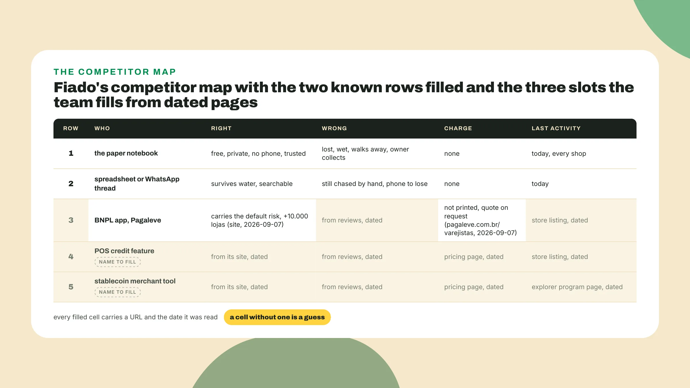
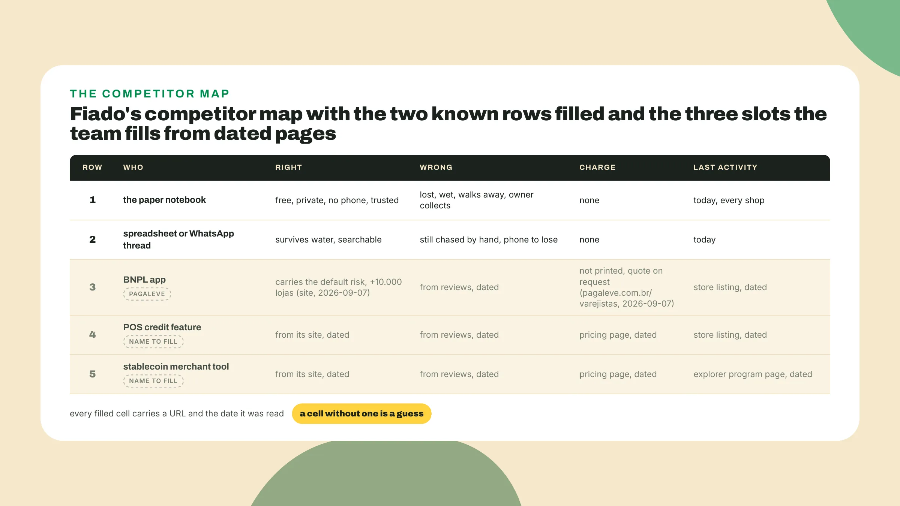
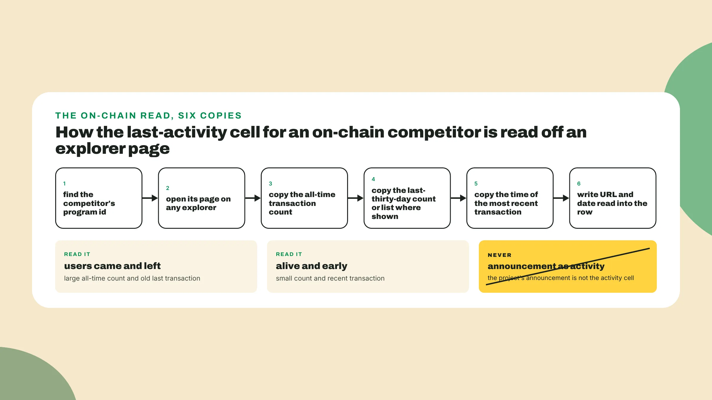
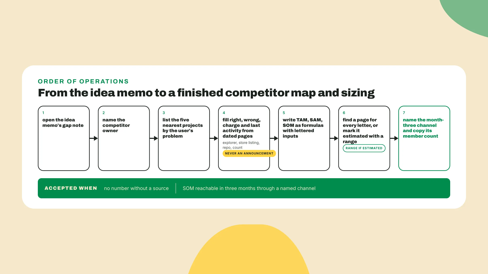

# Sizing at hackathon speed

Last lesson you scored three ideas and kept one, and the idea memo has the nearest past projects written beside the survivor. Open that memo. Its **gap note**, the line saying what those past projects did not do, is *the first row of the file you build today*.

## Why this matters

Picture the interview. A judge asks how big this is and the team says billions. The next question is how many people could use it next month, *and the room goes quiet*. The first number came off a slide someone found in a report. The second number nobody looked up. The second number is **the one that scores**, and by the end of today you have both, from sources a judge can click.

A number a judge can click is **a count on a public page**, with the URL and date next to it, that the judge can open during the review. The competitor map and the three sizing numbers are that shape applied twice. Start now: open colosseum.com/hackathon, find Potential Market Size in the judging section, and **create competitor-map-sizing.md** next to the idea memo in the toolkit repo.

## Do this

1. **Copy the factor's three questions** into the file, with the date on the first line. Read on **2026-09-06**, as of the 2026 World's Fair season, the factor says this:

```text
competitor-map-sizing.md, opened 2026-09-06
Potential Market Size, colosseum.com/hackathon, copied 2026-09-06
How big is the total addressable market for this project?
Is it already large, or small but growing rapidly?
What will be the impact of this project on the growth rate of their market?
```

Only the first question wants a big number. The second wants a direction, and the third wants what your project would do to that direction. A slide that says billions *answers one third of the factor*.

2. **Name the owner** of the map. The way I run a hackathon team, one person owns competitor research, and that is whoever was given the role on the team card on day 0. If nobody was given it, pick now, *because a map nobody owns gets half filled on the last night*.

Then have the owner practise the shape on earn.superteam.fun. On 2026-09-06 the home page showed **213,730+ users** and 2,680+ sponsors. On 2026-09-07 it printed 214,040 and 2,690. Write both readings into the file with the URL and the date. That is demand for a different product, but it has the shape every number in your file needs: **a count, a page, a date**, and a plus sign that tells you the page rounds down.

3. **List the five projects** nearest to yours by the user's problem, not by your stack, *so a paper notebook can be a competitor and a protocol with your architecture may not be*. **Five rows**, because three hides a competitor and ten hides the reader. If your idea is on-chain you will want five protocols, and that is your stack talking: go back to the pitch sentence from day 0, find the person in it, and ask what they use today. Their answer is row one. The header of the map, before any row, is one line:

```text
row  who  right  wrong  charge  last activity (source, date)
```

**Fill four cells** per row. Fill charge even when the answer is zero, *since it feeds the Viability line later*. Fill last activity from the explorer page, the app store listing's last update, the GitHub commit date or a public count that moved, **never from an announcement**, and if the announcement is all you can find, write "announcement only" in the cell, dated.

For Fiado, whose user is the corner shop that keeps its credit in a notebook by the till, the five rows run from the notebook to a fintech app that lends at the checkout. Row one is **the paper notebook**: free, private, works with no phone and no signal, gets lost or wet, charges nothing, *active today in every shop on the street*. Row two is **the spreadsheet or the WhatsApp thread**: survives water and is searchable, still chased by hand, charges nothing.

Row three is **a buy-now-pay-later app**, and the nearest one on the day this was read was Pagaleve: its retailer page prints revenue tiers and "A Pagaleve assume 100% dos riscos" with no merchant fee, so the charge cell reads not printed, quote on request, dated, and its home prints +10.000 lojas. Koin's Pix Parcelado page, read the same day, prints "3x sem juros ou em ate 24x" and no percentage.

Row four is **the credit feature** inside a card machine or point-of-sale system the shop already rents. Row five is **a stablecoin wallet or merchant tool** that already settles in a stablecoin and could add a tab. Rows four and five need a name, a pricing page and a last-activity read from pages you open today:

```text
competitor map, Fiado, 2026-09-06
row  who                              right                          wrong                        charge              last activity
1    the paper notebook               free, private, no phone        lost, wet, owner collects    none                today, every shop
2    spreadsheet / WhatsApp thread    survives water, searchable     still chased by hand         none                today
3    BNPL app: Pagaleve               carries default risk, +10.000 lojas (site, 2026-09-07)   <from reviews, dated>   not printed, quote on request (pagaleve.com.br/varejistas, 2026-09-07)   <store listing, dated>
4    POS credit feature: <name>       <from its site, dated>         <from reviews, dated>        <pricing page, dated>  <store listing, dated>
5    stablecoin merchant tool: <name> <from its site, dated>         <from reviews, dated>        <pricing page, dated>  <explorer program page, dated>
```

The angle brackets are yours to remove. A row that still has one on Friday *is a row the judge will ask about*.



4. **Read row five off the chain** first, *since it needs no one's permission*. A program on Solana has a page on any explorer, with a transaction count and the time of the last transaction, no login. **Copy three things** into the row: the all-time count, the last-thirty-day count or list where shown, and the time of the most recent transaction, then the URL and the date.

Now read what you copied. A large all-time count with a last transaction weeks ago is a product that **had users and lost them**. A small count with a transaction an hour ago is *a product that is alive and early*. Neither is what the project's own site says. A comparable, meaning a project that does a similar job for a similar user, may also publish its **TVL**, the value people have deposited into it, and that number with its date says how much money people already trust to that kind of product.

While the tab is open, **do the stablecoin read** for the sizing: the token page shows a holder count and the recent transfers. The holder count goes in as **an upper bound on people**, *because one person owns several wallets and a bot owns thousands*, and the transfers in the last thirty days go in as the activity read, both with the date. If the issuer publishes a regional number, copy that too and mark which page it came from, because the issuer's number and the explorer's number will not agree.

For rows three and four **the read is off-chain**: a store listing shows the last update date, a public repo shows the last commit, a pricing page shows the price and the date you read it, and the date of the most recent review is a last-activity signal. An Earn side track or bounty can serve too, where the listing shows **how many people applied**, *since that count says how many builders believed the sponsor's problem was worth their week*.



5. **Write the three numbers as arithmetic** before any value goes in. TAM is the total addressable market, everyone who has the problem. SAM is the part you could actually serve with this product, in this place, on this rail. SOM is the part of that you can reach in the first months, through a channel you can name.

Colosseum scores Potential Market Size with the three questions at the top of your file. A seasonal hackathon or a side track will have its own page with its own deliverables and deadline. **Read that page the day you decide to enter**, and reuse the package you already have. The slide gets written in week 4. The arithmetic gets written today, under one rule: **no number without the inputs**, and no input without a URL and a date. Fiado's arithmetic:

```text
sizing, Fiado, 2026-09-06

TAM = A x B
  A = number of small retail shops in Brazil          424,120 food-retail stores, all sizes, an upper bound
                                                       (ABRAS Ranking 2025, abras.com.br/dados-ranking-2025, read 2026-09-07)
                                                       corner shops only: estimated share of A, range
  B = yearly credit extended per shop on the tab      <estimate, source URL, date>

SAM = TAM x C x D
  C = share of those shops that run a fiado tab       <share, source URL, date>
  D = share whose customers can already pay in a
      stablecoin or through a rail the tab can use    <adoption count, source URL, date>
      context: Brazil received US$318.8 billion in crypto value, Jul 2024 to Jun 2025, all crypto
      (chainalysis.com/blog/latin-america-crypto-adoption-2025, 2025-10-02, read 2026-09-07); stablecoin share: slot

SOM = E, reachable by month three
  E = shops reachable through one cooperative or
      shop association the team can name              <member count, its own page, date>
```

Every letter is a page. A is a public count and **an upper bound**, since the ABRAS figure counts every food-retail store and not only corner shops, so the narrowing to corner shops goes beside it as an estimate with a range. B has no page and gets estimated from conversations next lesson, so write it as a range now with "estimated" next to it. C and D are shares, and *a share needs two counts, the top and the bottom, both dated*.

E is **the smallest number in the file** and the one the judge remembers. I treat an estimate as *a prediction that carries uncertainty, not a commitment*, and that is why B and C go into the file as a low and a high with the reasoning beside them rather than one confident figure.



6. **Name the month-three channel** and copy its count. Nobody can reach a percentage of SAM. A cooperative or a neighbourhood shop association can be reached, *by a person, with a phone*: it has a page, the page has **a member count or a list**, and that count with its URL and its date is E. Write the SOM line under the arithmetic in exactly this shape:

```text
SOM, Fiado: <E> shops, reachable through <association name, its page, date>,
by month three, because <the person who will introduce us, and what they agreed to>
```

The last clause is *next week's work*. The count is today's.

For the second question, direction, **copy the stablecoin adoption page** in D twice, today and on the earliest earlier date the page or an archive shows, and write the two readings side by side. If the page has no earlier reading, write "one reading, no trend" and **do not invent a slope**. The third question, mechanism, wants a sentence, and for Fiado it reads: *every shop that opens a tab brings its regulars onto the rail*, so the adoption count in D grows by the shop's customer count each time E grows by one.



## Done when

- **competitor-map-sizing.md** sits next to the idea memo, with the date on line one and Colosseum's three questions under it.
- The map has **five rows**, nearest by the user's problem, each with right, wrong, charge and last activity, and every last-activity cell points at an explorer page, a listing, a repo or a dated count.
- **TAM, SAM and SOM** are written as formulas with lettered inputs, and every input points at a URL and a date or is marked estimated with a low and a high.
- **SOM is a count** reachable in the first three months through a channel with a name, a member count and a page. A share of SAM in that line fails, *no matter how reasonable the share looks*.

## Watch out

- **A market-size number without its arithmetic** gets asked for, every time, and "a report said" is the answer that ends the conversation.
- **A wallet is not a user**, so an address count or a holder count goes in as an upper bound on people, never as a customer count.
- **A press release** is the competitor telling you what it wants you to think, and it never fills the last-activity cell.

A big TAM with no path to the first hundred users scores worse than **a small, reachable one**, since Traction and Viability sit next to Potential Market Size on the list and a month-three SOM feeds all three, so *honesty costs you the dramatic slide and buys you the interview*.

## The takeaway

Potential Market Size asks three questions, and a big number answers only the first. Every number in your file is **a count on a public page with a URL and a date**, a competitor's last activity is read off an explorer or a listing and never off an announcement, and a wallet count is an upper bound on people, never a customer count. *SOM is the smallest number in the file, reachable through a channel with a name, and it is the one the judge remembers.*

## Next

You now have a competitor map and three numbers, and the estimated ones in the file, B and C for Fiado, are ranges waiting for evidence. Next lesson opens by **writing down the one assumption** that, if wrong, makes the whole file worthless, and the cheapest test that could prove it wrong by Friday. *You spend the rest of the week trying to kill your own idea*, and you rewrite the pitch from whatever survives.
