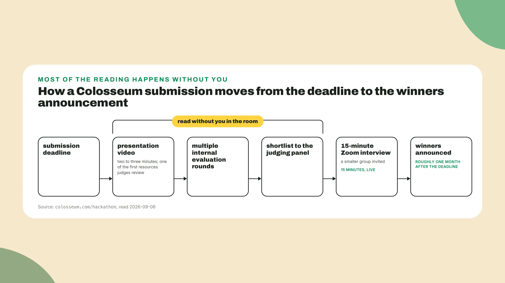
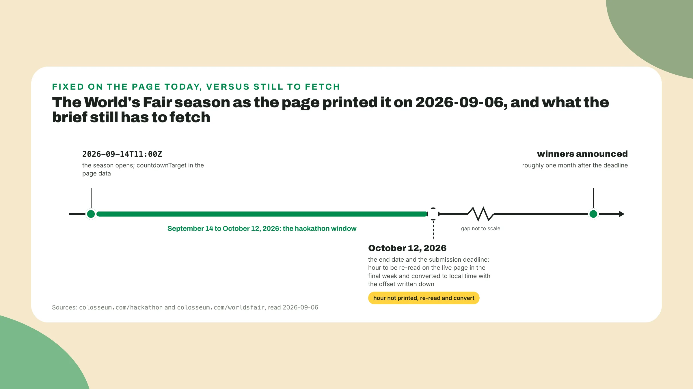

# What winning means at Colosseum

Last lesson you read the record: two seasons of side tracks, and the four hackathons Unruggable entered before it won one, read off its card on colosseum.com/hackathon. This lesson writes the file that says *what that record is worth to you*.

## Why this matters

Colosseum reviews your repository, and its hackathon page, as of the 2026 World's Fair season, says in its own words that the review is not looking at your language, your framework, your patterns or your code quality. *Read that twice.* The same page says that Colosseum hackathons are startup competitions. That is the one idea: **the judging criteria tell you exactly what gets scored**, and what gets scored is a company, not the code.

I always like giving the example of an in-person hackathon I won in Dubai, with an idea I thought too simple to place and no planned demo. It matched exactly what the organizers were looking for and the pitch sold it, and *none of that was about the code*. Luck is not a plan you can hand to a teammate. The brief is.

## Do this

1. Open colosseum.com/hackathon, find the judging section, and **copy the seven factor names** into a new file, colosseum-brief.md, exactly as written, dated on the first line. Read **2026-09-06**:

```text
Colosseum judging factors, colosseum.com/hackathon, read 2026-09-06
Founder + Market Fit
Insight
Product + Execution
Potential Market Size
Founder Communication
Viability
Traction
```

If the live page shows different names, **the page wins**, and write down what changed. Look closely at Viability: *notes carrying some other word in that slot are from another season*. The list also moves by page, since Colosseum's Eternal page lists **six factors without Traction**, read the same day. Copy the one on the page you are entering.

2. Under each name, **write the page's own question** in your short words.

Founder + Market Fit asks whether the team has the right skills and experience and why it is motivated. Insight asks for a unique insight, or a new technology or trend. Product + Execution asks how well the product works, how it stacks up against the competition and **how fast the team ships**. Potential Market Size asks how big the TAM is, the total market the product could address, and whether it is large, *or small but growing rapidly*. Founder Communication asks whether the founders communicate the vision clearly. Viability asks whether this can become a scalable, sustainable business. Traction asks whether the product already has demand or revenue, and how durable that is.

Count the ones a judge could answer by opening your code: **one**, and only part of that one.

3. **Copy the repo review** under the factors, both halves:

```text
repo review, colosseum.com/hackathon, read 2026-09-06
looks for:      significant work during the hackathon window
                work by the team, not by a third party
                features prioritized strategically
not looking at: language, framework, patterns, code quality
```

Prioritized strategically tells you exactly what your slice has to show: they want to see that you **left things out on purpose**, and *a commit history shows that more honestly than a deck can*.

4. Record **how the score is produced**. The page, read 2026-09-06, says a submission goes through multiple internal evaluation rounds, a shortlist then goes to the judging panel, a smaller group is invited to a 15-minute Zoom interview, and winners are announced **roughly one month** after the submission deadline. It also says which artifact gets opened early: the presentation video of two to three minutes is, in its words, one of the first resources judges review. Write both in the brief, and *name who stays reachable through the month after the deadline*.


5. **Sort the seven** into the four questions a judge has to decide, and write them under the factors as four lines:

```text
is the problem real:     Insight, Potential Market Size, Viability (asked with money attached)
does the thing work:     Product + Execution (the competition and ship speed are the same question over time)
does the story land:     Founder Communication (written answers, video, 15-minute interview)
can this team carry it:  Founder + Market Fit, the repo review (work by the team), the interview
```

Traction is not a new question. It is the first two answered with **evidence instead of argument**: people already use it, so the problem is real, and it holds up, so the thing works. Viability and Traction are the two lines a startup competition adds. Next to each question, note what your project can already say and **write "open" where it cannot**. Fiado's Viability line reads "who pays for the tab: still open", and its Traction line is a target, "one shop on the tab before the deadline", never a claim, *because a number made up on day 0 is worse than a blank*.



6. **Copy the deadline and convert it** with a tool. The page, read 2026-09-06, says the World's Fair hackathon runs September 14 to **October 12, 2026**, and the submission deadline is the season's end date. It prints the opening as a timestamp and the end as a date, so the brief carries the date, *a note to re-read the hour on the live page in the final week*, and the converted local line once it exists. Practice on the string the page does print, the opening moment:

```bash
python3 -c "from datetime import datetime; print(datetime.fromisoformat('2026-09-14T11:00Z').astimezone())"
```

That prints the moment in your machine's time zone with the offset attached. **Python 3.11 or newer** reads the trailing Z on its own, on an older one replace the Z with +00:00, and verify the behaviour against the datetime docs for your version. When the deadline hour appears on the page, paste it in place of that string and store the result with the UTC original beside it, *so a teammate in another zone can redo the sum*.



7. **Quote the lines that disqualify**, taken from the page:

```text
disqualifies, colosseum.com/hackathon, read 2026-09-06
one product submission per team, and so one per individual: nobody enters a second project on the side
the team leader completes the submission before the deadline: the brief names who holds that role
misrepresenting the development history, or failing to disclose pre-existing code: disqualifies, bans, revokes a prize
```

The page adds that a Code of Conduct violation can disqualify as well, a fourth line you copy without commentary. If you build with an agent team and pull in your own older code, **the third line is yours**: write down what existed before the window opened and say so in the submission, *because a commit history that starts the day before the season reads like the thing the page bans*.

8. **Give one other hackathon's page** fifteen minutes and write three lines: what it asks, under which of the four questions, and what it disqualifies. A seasonal hackathon or a side track will have its own page with its own deliverables and deadline. Read that page the day you decide to enter, and reuse the package you already have. Whatever that page names, **tag it with one of the four questions**, *because a shorter page never asks a fifth*. The shape, where the angle brackets are the only part you replace:

```text
<hackathon>, <url>, read <date>
asks:         <the criteria as named on the page>, each tagged with one of the four questions
disqualifies: <the page's own lines>
```

**Not a table**: three lines is enough to decide whether to enter and what to adapt.

## Done when

- Every factor in **colosseum-brief.md** is a quote from the live page and carries the date.
- Each of **the four questions** points at one or more factors, with a note or an "open" under each.
- The deadline is in your time zone **with the offset written**, and a second tool (the clock app on your phone counts) gives the same answer.
- What judges open first, the interview step and **the disqualifying lines** are in the file, dated.
- The fifteen-minute read of one other page produced **three lines, not a table**.

## Watch out

- Colosseum is open to builders across all blockchain ecosystems, with dedicated ecosystem prize tracks, and the Accelerator requires some form of Solana integration, so **Solana is a track you enter**, and the reason your project is on Solana goes into your Insight line.
- Dates, prizes and tracks move every season and the factors have only held so far, so re-read the page in the final week: *my guess, from watching teams rather than from any count*, is that a deadline **converted once and never re-read** loses more hackathons than a bad demo.
- Colosseum's seven cover everything a shorter page asks, but Viability and Traction cost Fiado's solo builder about a week of the month talking to a shop owner, a week a Colosseum season scores twice, under Traction and again under Founder Communication when the story opens the video, and a rehearsal page with no such line **scores it nowhere**, *so choose on purpose and write why*.

## The takeaway

Colosseum scores a company, not the code: the seven factors sort into four questions, **real problem, it works, the story lands, this team**, with Viability and Traction asking two of them with money and evidence attached. The code lives in one line of the seven, and a judge meets your project first through a two-to-three-minute video, without you in the room. *Every piece you build from here is checked against those four questions before it moves on.*

## Next lesson: a sentence before the clock

Next lesson the clock has not started yet and you already have a pitch. **One sentence, written on day 0**, before there is a team card or a month plan. *You will hate it, which is the point*, because the four questions you just sorted are the questions that sentence has to survive.
