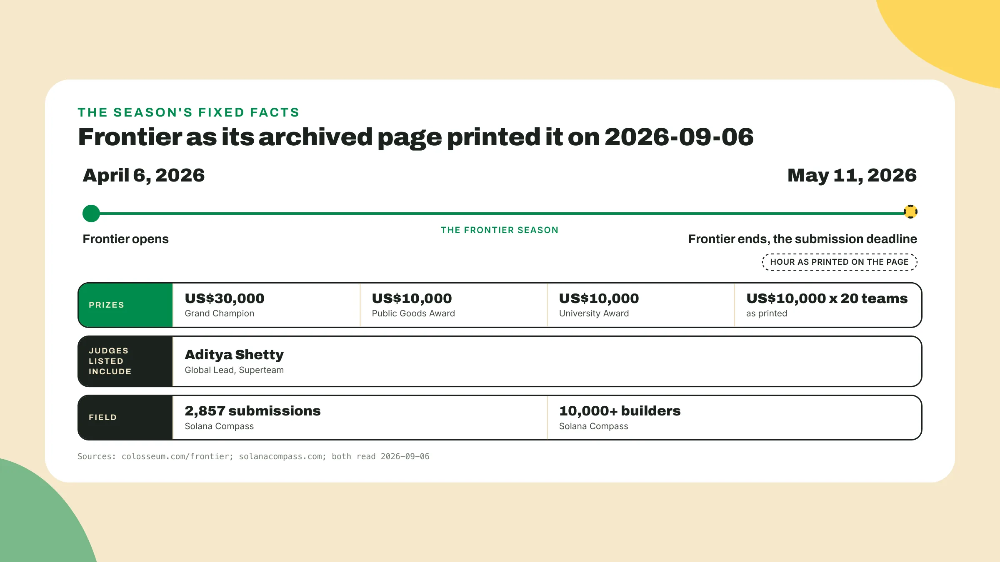
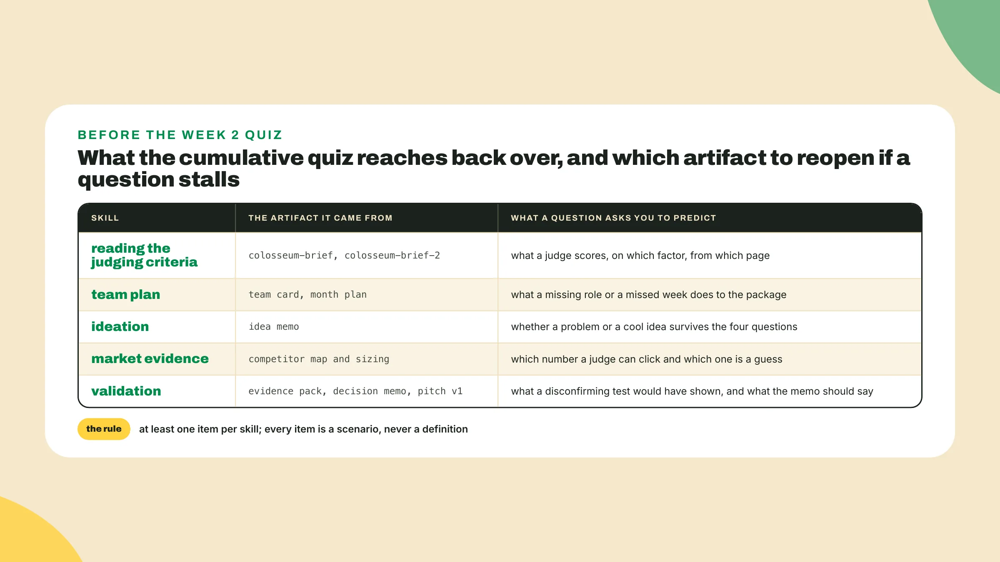
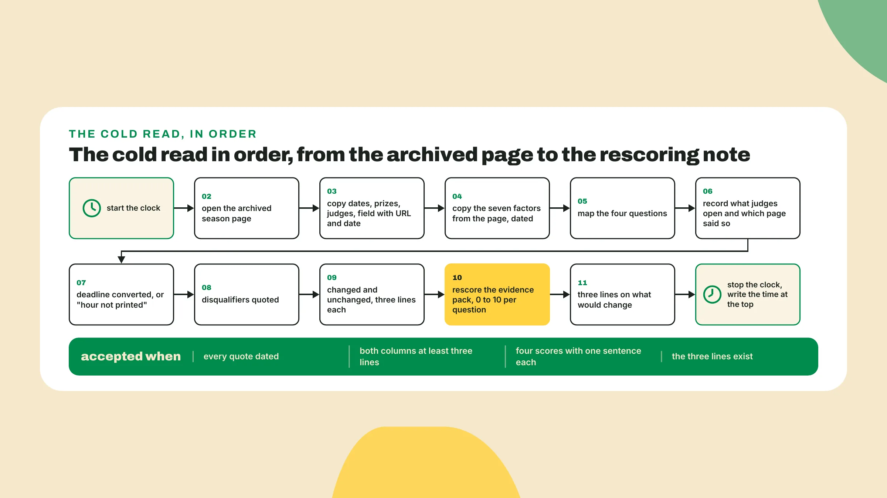

# Re-derive winning for a Colosseum season you have never seen

Last lesson you ran the test that could have killed the idea, decided in writing in the decision memo, and rewrote the pitch as v1 on top of the evidence pack. Keep the pack open, *it gets scored again before the end*.

## Why this matters

Here is a Colosseum season that already ended, on pages you have never read. Thirty minutes from now you will know **what winning meant there**, what changed between that season and the one in your first brief, what did not, and whether your evidence pack would have scored. That is *the skill this course exists to install*.

A cold read is **rebuilding the brief** from a page you have never seen, with nothing copied from a brief you already have. Rescoring is scoring the evidence pack again, against the judging criteria you just rebuilt, to see if the number moves. The clock is there because *a season page read without one takes a week*, spread over arguments and re-reads.

**Start the clock now**, open colosseum.com/frontier, and create colosseum-brief-2.md next to the first brief.

## Do this: the thirty-minute drill

1. **Paste this skeleton** into colosseum-brief-2.md, nothing filled yet. Do not open your first brief while you fill it. That is *the point of the exercise and the one way to fail it*.

```text
colosseum-brief-2.md, Frontier, read cold on <today's date>
season dates:
prizes:
judges:
factors:         (quoted from the page, dated)
a real problem:
it works:
the story lands:
this team:
colosseum adds:  Viability / Traction
judges open:
deadline local:
disqualifies:
changed since:   (three lines minimum)
unchanged:       (three lines minimum)
rescoring:       (0 to 10 per question, one sentence each)
```

2. **Copy the lines that change first**, dates, prizes, judges and field, each with its URL and read date on the same line. Frontier ran from **April 6 to May 11, 2026**. The prize list on colosseum.com/frontier, read on 2026-09-06, shows a US$30,000 Grand Champion, a US$10,000 Public Goods Award, a US$10,000 University Award, and US$10,000 for each of twenty teams. The judges listed include Aditya Shetty, Global Lead at Superteam. Solana Compass, read the same day, counts 2,857 submissions and 10,000+ builders.

   Twenty teams at US$10,000 means a project that won nothing still had **twenty-three paid places** above it, counting the three named awards, and that is the number a team of two plans against rather than the US$30,000. 2,857 is the field your project was one row in. A judge from Superteam tells you *who read that season and nothing about who reads the next one*, so the judges line goes in the changed column before you open a second season.



3. **Copy the judging criteria from the page**, never from memory. Find the judging section on the archived page, or on colosseum.com/hackathon where the season page points to it, and paste what is printed with the URL and the date on the same line. Read on **2026-09-06** it is the list in the fence below, and if the page you open prints something else, *the page wins and the difference goes in the changed column*.

   Then **map the four questions** to the factors and add the judges-open line, naming which page it came from. If the season page says nothing about it, the line reads "not stated on the season page, taken from colosseum.com/hackathon" and carries both dates. Fiado's first half:

```text
colosseum-brief-2.md, Fiado, Frontier, read cold 2026-09-06

season dates:   April 6 to May 11, 2026 (colosseum.com/frontier, 2026-09-06)
prizes:         US$30,000 Grand Champion; US$10,000 Public Goods Award;
                US$10,000 University Award; US$10,000 x 20 teams (same page, same date)
judges:         include Aditya Shetty (Global Lead, Superteam)
factors:        Founder + Market Fit; Insight; Product + Execution; Potential Market Size;
                Founder Communication; Viability; Traction (colosseum.com/hackathon, 2026-09-06)
a real problem: Insight, Founder + Market Fit, Potential Market Size
it works:       Product + Execution (the devnet slice, not built yet in week 1)
the story lands: Founder Communication, in the written answers, the video, the interview
this team:      Founder + Market Fit, the repo review
colosseum adds: Viability (who pays for the tab); Traction (one shop before the deadline)
judges open:    the presentation video first, then the repo review, then the 15-minute
                interview for a smaller group (colosseum.com/hackathon, 2026-09-06)
deadline local:
disqualifies:
changed since:
unchanged:
rescoring:
```

4. **Finish the second half**. The page prints **May 11, 2026** as the end of the season, and the end date is the deadline. Find the hour if the archived page prints one and convert it to your time zone with the offset next to the UTC original, or write "hour not printed". Then copy the disqualifiers from the page, quoted, dated, three lines at least, and not from your first brief. If they read the same as the first brief's, that is a finding for the unchanged column. If they read differently, *that is a bigger finding for the changed column, difference spelled out*.

```text
deadline local:  May 11, 2026, hour as printed on colosseum.com/frontier (read <date>),
                 converted: <local time, offset>   or   "hour not printed"
disqualifies:    <line 1, quoted, dated>
                 <line 2, quoted, dated>
                 <line 3, quoted, dated>
read in:         <minutes on the clock>
```

5. **Stop the clock** and write the minutes at the top of the file. *An honest forty is worth more than a rounded thirty*, and I would put the first honest number nearer forty and under twenty by the third season. Next season's number goes under it, and the gap between the two is the only score this lesson keeps.

6. **Open the second archived season** and write the changed and unchanged note. Cypherpunk's results are on blog.colosseum.com, tracks and winners on one page. Read on 2026-09-07, submissions were due **October 30, 2025** and the winners were announced December 13, 2025, and *the December date is the announcement, not the season*. It drew 9,000+ participants and 1,576 final projects across six tracks, Infrastructure, Consumer, DeFi, Stablecoins, RWAs and Undefined. Its Grand Champion took US$30,000 USDC, each track first took US$25,000, the University Award went to Pythia at US$10,000 and the Public Good award to Samui Wallet at US$10,000.

   **Give five of the thirty minutes** to the side track. Superteam Earn's endpoint for the season, superteam.fun/api/hackathon/cypherpunk, read on 2026-09-07, still returns **41 side tracks** totalling US$341,750, and the page at earn.superteam.fun/hackathon/cypherpunk renders from it, so *read the endpoint when the page shows placeholders*. The index at earn.superteam.fun/hackathon/all describes itself as the place to submit to side tracks of the latest Solana Global Hackathon, with FAQs on how a side track differs from a main Colosseum track.

   Cointelegraph Brasil reported Superteam Brasil's numbers for that season as 299 registered participants, **52 projects submitted**, 7 classified and 2 awarded. Against 1,576 final projects worldwide, *52 is a short field, one dated line in the brief and not a set of judging criteria of its own*.

   Now **sort what moved** from what did not, three lines each side, against the season in your first brief (the 2026 World's Fair, as of 2026-09-06). Fiado's note:

```text
changed since:   dates: submissions due October 30, 2025 (Cypherpunk) against
                 April 6 to May 11, 2026 (Frontier)
                 prize shape: six track firsts at US$25,000 against twenty teams at US$10,000
                 tracks: six named on Cypherpunk, Frontier's copied from its page, not assumed
                 judges: a list of names is a list for one season
                 field: 1,576 final projects against 2,857 submissions, not counted the same
                 way, both kept with their source
unchanged:       the seven judging factors (colosseum.com/hackathon, 2026-09-06)
                 the portal's field list (same page, same date)
                 the 15-minute interview step (same page, same date)
```

7. **Rescore the evidence pack** against the seven factors. Score **0 to 10** on each of the four questions, one sentence each, then a line each for Viability and Traction, then three lines on what would change for your project, and *if a line says nothing changes, say why*.

   Fiado's week 1 numbers: a real problem 7 (five dated conversations with owners that keep the notebook), it works 3 (no devnet slice yet, scored on the plan), the story lands 5 (pitch v1 rewritten from evidence, one feedback round of three), this team 6 (a founder that has stood in the shop, repo work to come), Viability as the memo answered it, Traction near zero until one shop is on the tab.

   Fiado's three lines: nothing in the four questions moves, because *the factors read the same and the evidence is the evidence*. The prize shape moves what a good result looks like, since twenty teams at US$10,000 means the plan aims at **a paid place** before it aims at the champion. The judges line names a person for one season, so the pitch does not get written for a name.

8. **Take the cumulative quiz** at the end of this lesson. It reaches back over **five skills**, at least one question per skill, and every item is a scenario where you predict what a judge or a portal does, never a definition. If a question lands on something you have to look up, *that is the artifact to reopen before week 2*.



The whole drill in order, to check your file against:



## Done when

- **colosseum-brief-2.md** is complete and every quoted line carries its URL and its date.
- The changed column has **at least three lines**, and so does the unchanged column.
- The rescoring gives **a 0 to 10** on each of the four questions with one sentence each, and the three lines on what would change exist even if two of them say nothing changes.
- **The minutes** are written at the top of the file, honestly.
- **The cumulative quiz** is taken.

## Watch out

- **Copying the current season's brief** and editing the dates is practising editing, and next season's page will still take that team a week.
- Did the factors change because the prizes did? No. **Check each line separately**, against the page, every season, because the day the factors do change is the day this course needs a rewrite, and you will only see it on the line itself.
- 1,576 final projects and 2,857 submissions are **not counted the same way**, so write both with their source and do not subtract one from the other.

This lesson produces nothing the package uses, the scope card next lesson reads the same evidence pack and pitch v1, and its value is paid out next season, *when the page takes twenty minutes instead of a lost week*.

## The takeaway

Dates, prizes and judges change every season, and the seven factors, the portal's field list and the interview step held across Frontier, Cypherpunk and the World's Fair season. **The unchanged column is what this course is built on**, and the changed column is what you copy fresh from the page each time. *If the page takes you twenty minutes next season instead of a lost week, this lesson did its job.*

## Next

Weeks 2 and 3 start next lesson, and the first thing you write is not code. It is **the three-minute demo script**, what is on screen at each mark and the one real transaction, and it decides what you build. You rebuilt a brief from a page you had never seen. *Next season it takes you a coffee*, and the three lines in your unchanged column will still be there when you open it.
