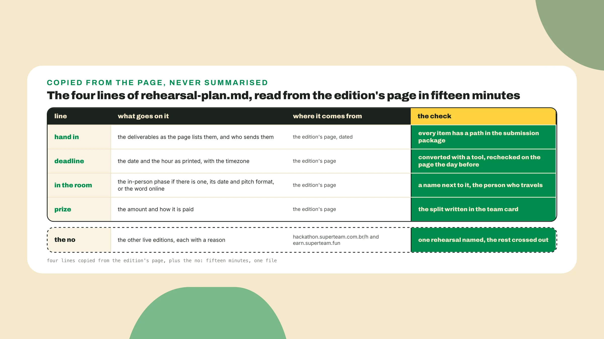
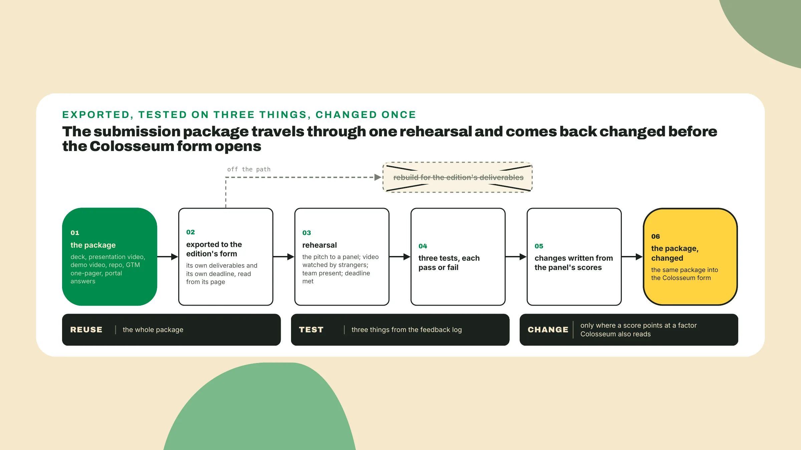
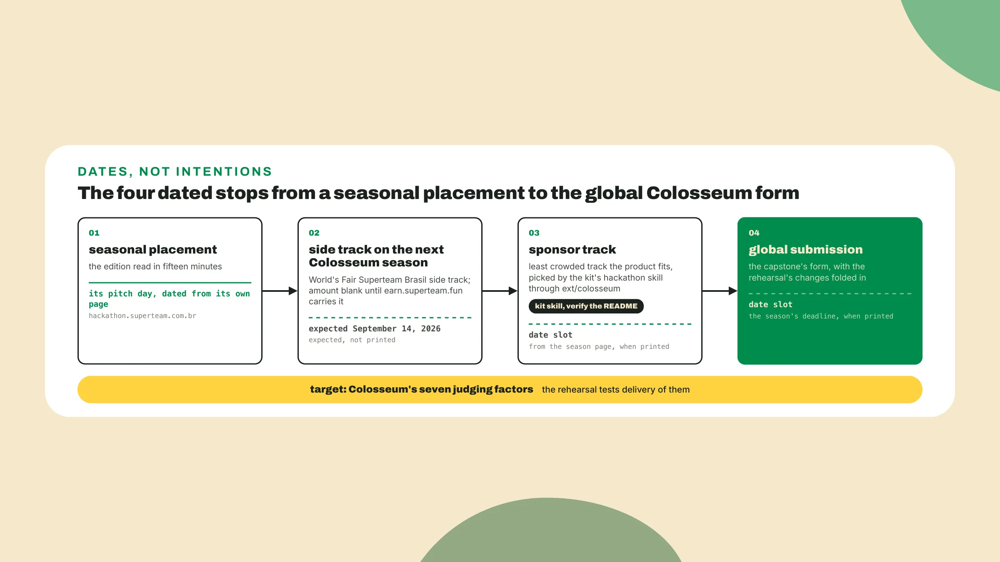

# Rehearse the season before the season

Last lesson you wrote the next-season plan and named the date the next Colosseum window opens. This optional lesson works backward from that date in the next local window, *and when no Superteam Brasil edition or Earn side track is live, it waits*.

## Why this matters

Open hackathon.superteam.com.br/h and **create a file called rehearsal-plan.md**.

Superteam Brasil put a **US$10,000 USDG side track**, a regional prize attached to the Colosseum season, on Colosseum's Frontier season, the row you read in lesson 1. One season earlier, on Cypherpunk, 299 people registered through Superteam Brasil's funnel, 52 projects were submitted, 7 classified and 2 awarded, per Cointelegraph Brasil, read 2026-09-06. The article does not spell out the 7, *and I read it loosely as the region's own selection*, so **keep the four numbers exact**. One of the two, Cloak (x.com/cloak_ag), **placed third** in the global Stablecoin Track with US$15,000, behind MCPay's first with US$25,000, and as of 2026-09-06 its site says it is backed by a US$250,000 pre-seed through the Colosseum Accelerator. *Third was enough.*

A rehearsal is any **seasonal hackathon or Earn side track** that takes the package you have and tests how you deliver it, the same package under a smaller spec and a shorter clock. It costs a week of the month and a second set of forms, *so the plan names one and says no to the rest in writing*.

## Do this

1. **Read the edition's page** in fifteen minutes and *not one more*. Pick the edition whose dates sit closest to today and **write four lines** into rehearsal-plan.md: what you hand in, when, who has to be in a room, and how the prize is paid. The four lines:

```text
rehearsal-plan.md, edition read on ____
edition      the edition's name, and the page it was read from
hand in      the deliverables as the page lists them, and who sends them
deadline     the date and the hour as the page prints them, with the timezone
in the room  the in-person phase if there is one: its date, and what the pitch format is
prize        the amount, and how it is paid
```

A seasonal hackathon or a side track will have its own page with its own deliverables and deadline, so **read that page the day you decide to enter** and reuse the package you already have. Copy what the page prints and **nothing beyond it**: a rule the page names but does not link stays out of the plan, and so does a panel the page leaves unnamed. The deadline line carries **the hour and the timezone** as printed, the way lesson 14 converted Colosseum's, *since the wrong direction on one offset is the whole rehearsal lost*.

If the page has no in-person phase, **write online on that line**, *since an empty line reads as unread*. If no edition is live, **write the date you looked** and the date you will look again, and the side track becomes the rehearsal.

**Pick one edition** only. As of 2026-09-06 Superteam Brasil had **three editions live at once** on hackathon.superteam.com.br, overlapping between mid August and September 12, with the World's Fair side track expected two days after the last of them. A team of two that enters all three **rehearses nothing** and arrives on September 14 with three half-packages and no scores it had time to read.

I would take the in-person one when somebody can be in the room, *because presence is the one test the Colosseum portal will never give you*, and the online one otherwise. **Write the no** next to the others with a reason beside it.



2. **Pick the three things to test**, *from your feedback log and not from the edition's criteria*. A rehearsal buys the four things Colosseum will judge that you **cannot test at a desk**: the pitch out loud to strangers who score it, the demo video with a real transaction watched by someone new, the team present on a date you did not choose, and a deadline met once with a prize behind it, and *every one of those has failed a team with a working product*.

The log has run since day 0, three people a week, and holds four rounds by the capstone, pitch v0 to the two videos, so **take the three lines that repeat**. If two rounds say the same person could not tell who pays, the test is **the Viability answer said out loud** inside the pitch, and a pass is that someone on the panel repeats it back unprompted, *or at least does not ask it*.

If the video round said nobody noticed the transaction happen, the test is the demo video with **the real transaction**, and a pass is that the room reacts at that second and not at the slide after. If the team card has a role owned twice by one person, the test is **presence**, one in the room and one on a call, and a pass is that nobody asks where the rest of the team is. Write each test as a sentence with **the word pass** in it, *since a test without a pass condition is a hope*. *Three, not five.*

3. **Export the package as it is**: the deck, both videos, the repo, the GTM one-pager, and the portal answers rewritten into the edition's form. If the edition wants a shorter deck than yours, **cut it in a copy** and keep the original as the Colosseum deck. Fiado's reuse line reads: the whole package exported, a deck copy cut to the edition's length, both videos as they are, *since a video re-edited for a rehearsal is a rebuild by another route*. What changes afterwards is decided from the panel's scores, only where a score points at a factor Colosseum also reads, and it goes into the package **before the Colosseum form opens**.



4. **Name one side track** and one sponsor track for the next Colosseum season. On Cypherpunk the side track was US$11,200, Superteam Brasil with Tangem Wallet, and on Frontier **US$10,000 USDG**, Superteam Brasil alone, both read on earn.superteam.fun on 2026-09-06, *and the number moves every season*. As of 2026-09-06 the World's Fair Superteam Brasil side track was expected to be announced on **September 14, 2026**, so until it is on earn.superteam.fun the plan holds a dated slot for it and no amount.

A sponsor track is a prize track inside the global season put up by one sponsor around its own theme, *and a real product fits one or two honestly*. **Run the kit's hackathon skill**, which picks the least crowded track your product fits using live crowdedness through its ext/colosseum extension, as the solana-ai-kit README described it on 2026-09-06, and verify its name and flags against the kit's current README first. A product forced into an empty track **reads as forced**, and *Founder + Market Fit is the line that notices*.

Bido (x.com/usebido) is *a shape of this path I have seen happen*: two friends with no project idea went through Superteam Brasil's mentoring sessions, the kind that sits in an edition's online phase, and went on to raise in Silicon Valley, and the round size **has no public source**, so it is not written here. Cloak and Bido both passed through **a Superteam Brasil hackathon** before the global one, and both paths are shorter than the four Colosseum hackathons on Unruggable's card at colosseum.com/hackathon, the one you read in lesson 1, *from two honorable mentions to a track win to the grand prize*.



5. **Write the plan on one page**. Put the four stops on one line with **a date next to each**, seasonal placement, side track, sponsor track, global submission, and where a date is not on a page yet, the date you will check again. Then the three tests, then the next season's line, then one sentence on what changes in the package after, *written as a promise with a date and empty until the rehearsal has happened*. Fiado's plan, written 2026-09-06, is the shape to copy:

```text
rehearsal-plan.md, Fiado, written 2026-09-06

rehearsal      the edition closest to today, its page on hackathon.superteam.com.br, read ____
hand in        the deliverables as the page lists them, sent by the leader by the printed hour, timezone written
in the room    the in-person date if there is one, and its pitch format: the storyteller travels
prize          the amount and how it is paid, with the split written in the team card
reuse          the whole package, exported; a deck copy cut to the edition's length
tests          1. ____ (pass: ____)
               2. ____ (pass: ____)
               3. ____ (pass: ____)
side track     World's Fair Superteam Brasil side track, expected September 14, 2026
               earn.superteam.fun; amount blank until the page carries it
sponsor track  chosen by the kit's hackathon skill once the season page is up; check date: ____
changes        written after the pitch day, from the panel's scores, before the Colosseum form opens
```

*The tests are blank on purpose*: open Fiado's feedback log, four rounds deep, find **the three lines that repeat**, and write each with a pass. **Recheck the hand-in hour** on the edition's page the day before, the way you re-read the Colosseum deadline in the final week.

## Done when

- **The edition is dated** with its deliverables and its deadline as the page printed it, timezone included.
- **Three tests** are named, each with what a pass looks like.
- **One side track** and one sponsor track are named for the next season with a dated source, or a dated slot where the page is not up.
- **One sentence** says what changes in the package after, with the day you will know.

## Watch out

- **The edition's own criteria** are not the target. Colosseum's seven factors from lesson 2 are, and a criterion the edition scores and Colosseum does not is information about that edition, not a reason to move a slide.
- **Last season's side-track amount** is not this season's, and it is the easy mistake because the old number is already in your head.
- **Nobody in the room** at an in-person final turns the rehearsal into a form, and that is the mistake that costs the most.

## The takeaway

A rehearsal is **the same package under a smaller spec and a shorter clock**, and it buys the things a desk cannot test: the pitch out loud to strangers who score it, the demo watched by someone new, the team present on a date you did not choose, and a deadline met once with a prize behind it. The edition's page is read in fifteen minutes and copied, never summarised. *A plan that names one rehearsal, three tests and one date, and says no to the others, is a plan. One that names three editions is a calendar.*

## Next

That is the optional lesson, and the last piece of the course. The next season page is already up somewhere, and you know how to **read it, in fifteen minutes**, with a date on the first line. When the side-track page goes up, the number goes into the plan with the date next to it, and the month runs the way you already know.
