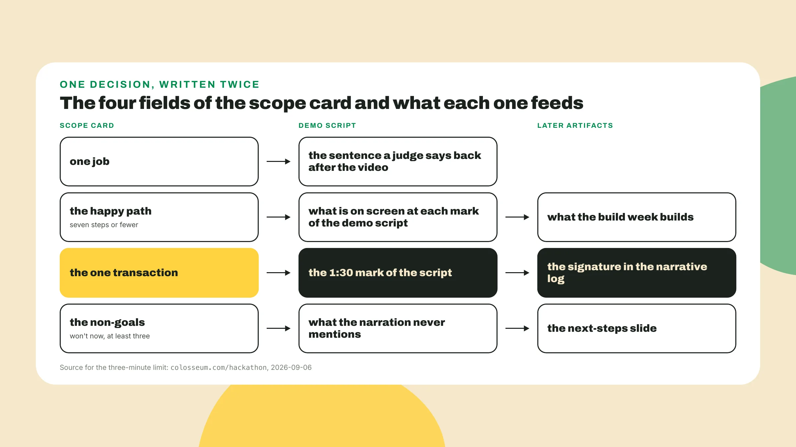
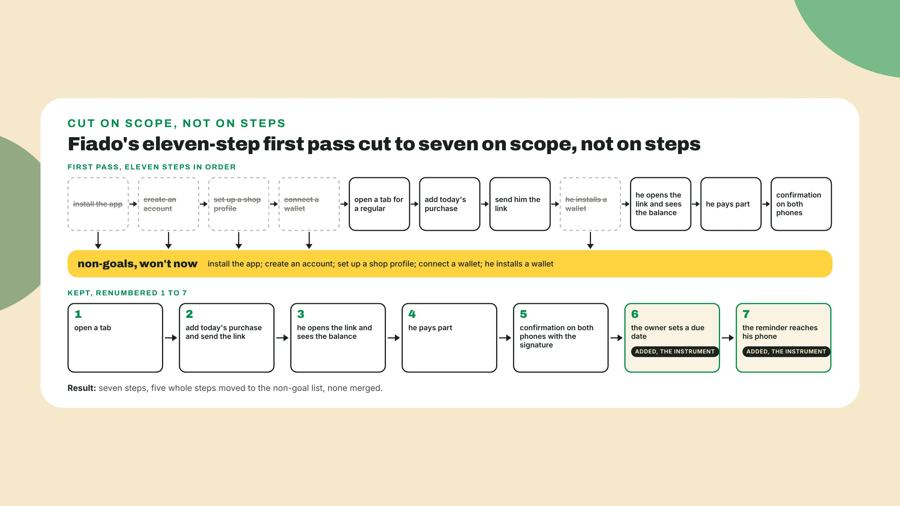
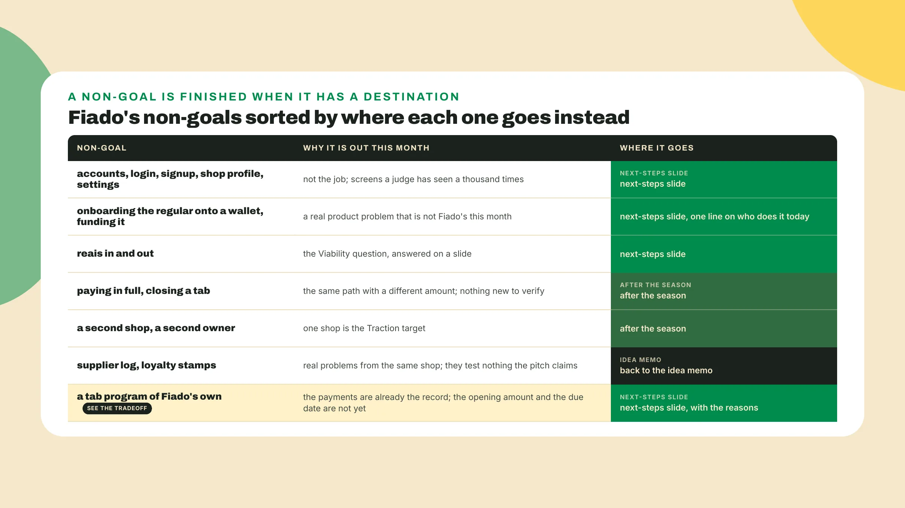
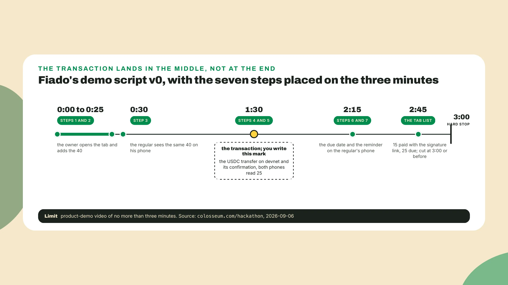

# Scope to the three-minute demo

Last lesson you rebuilt a Colosseum brief from Frontier's archived page against a clock, wrote the minutes at the top of colosseum-brief-2.md, and rescored Fiado's evidence pack 0 to 10 on factors you copied instead of remembered. It works **scored a 3**, on a plan, because nothing was built. Today that number starts to move, *and the first thing you build is still not code*.

## Why the demo comes before the code

The projects that placed were not 100 percent complete. They were **complete enough for a demo** to be made, and the demo had been decided before the code was. You write the three minutes a judge will watch, *and then you build only what those three minutes show*.

Three minutes is the page's number. As of the 2026 World's Fair season, Colosseum asks for a product-demo video of **no more than three minutes** explaining how the product works, and a separate presentation video of two to three minutes that it calls one of the first resources judges review. Three minutes, *with a real transaction in it*.

## Do this

1. **Create demo-script.md** next to the evidence pack and put four lines in it, one per mark, with what is on the screen at each one. Nothing else, and no code editor open:

```text
demo-script.md, v0, <today's date>
0:00  on screen:
0:30  on screen:
1:30  on screen:
2:45  on screen:
the one transaction:
```

Give it **ten minutes**. If a mark stays blank, leave it blank. *A blank mark is information about your scope*, and it is the reason this file exists before the repo does. The kit's hackathon skill puts the bar the file is aiming at in its checklist: **a demo under three minutes** with a real transaction, a public repo with a working quickstart, a devnet link and a program ID, and a deck if the hackathon requires one. Verify that list against the kit's current README, *since checklists move*.

2. **Pick the one job** with two questions: can a judge verify it on screen in three minutes, and which assumption from your evidence pack does it test. Most ideas start too broad, and my position from the MVP worksheet is to *pick one job to validate first*. An MVP is a slice of **4 to 6 weeks**, and a hackathon gives you two, so your slice is smaller than the one the worksheet was written for.

For Fiado the job is that a regular **pays part of his tab** from his own phone, since opening a tab is a form and *a judge cannot tell a form that writes to a chain from a form that writes to nothing*, and the reminder still carries the decision memo's note "needs a tab". The supplier log and the loyalty stamps from the idea memo test nothing the pitch claims.



3. **Write the happy path** the way a user would walk it, with the shop open and the owner behind the till, and do not edit while you write. Then count it. If the happy path runs past **seven steps** you are over-scoping, and the fix is to cut whole steps to the non-goal list until it fits, *never to fold three steps into one so the count comes out right*.

Fiado's first pass came out at **eleven**. Install, account, shop profile and wallet connection went to the non-goals as whole steps, the regular installing a wallet went with them, and the due date and the reminder came back as steps 6 and 7, the instrument for the claim nobody could test in week 1. That is seven, *with nothing merged*.



4. **Write the scope card** on one page with four fields: the one job, the happy path, the one transaction, and the non-goals. Name the non-goals out loud, *because a non-goal that lives in someone's head gets built in week 3*. Fiado's card, as it goes in the repo next to the evidence pack:

```text
scope-card.md, Fiado, weeks 2 and 3, <date>

one job:   a regular pays part of his tab from his own phone

happy path:
  1  the owner opens Fiado on her phone and opens a tab for a regular:
     his first name and his phone number
  2  she adds today's purchase, 40, and the tab reads 40 owed; a link goes to his phone
  3  the regular opens the link and sees the same 40 on his phone, no install, no login
  4  he taps "pay part", types 15, and his wallet asks him to approve a USDC
     transfer on devnet
  5  the transfer confirms, both phones read 25 owed, and a link under the balance
     opens the signature on an explorer
  6  the owner sets a due date for the 25
  7  the reminder reaches the regular's phone with the 25 and the link

the one transaction:
  the USDC transfer at step 4, from the regular's wallet to the owner's wallet,
  on devnet, with a memo naming the tab; its signature is on screen at step 5;
  the balance both phones show is derived from the tab's transfer history

non-goals (won't now):
  accounts, login, signup, a shop profile, a settings screen
  onboarding the regular onto a wallet, or funding it
  reais in or out (the fiat on-ramp and off-ramp)
  paying a tab in full, or closing one
  a second shop, a second owner
  the supplier log and the loyalty stamps from the idea memo
  a program of Fiado's own for the tab (the payments are already the on-chain
  record, one memo-tagged transfer each; the customer directory, the opening
  amount, the due date and the reminder stay on a plain backend; a tab program
  goes on the next-steps slide)
```

The amounts are the script's own, **40 on the tab and 15 paid**, so that two phones can show the same number changing, and any small pair works. Read each step the way a camera would. If a step has no screen it is not a step, it is plumbing, *and plumbing goes under a step, never beside one*. Under the card write Lucia's note from feedback round 1, that her customers should never have to meet **the word stablecoin**, as a constraint for every screen the regular sees: his screen says pay part and an amount, his wallet says USDC because wallets do, and the narration says Solana once, at 1:30, to the judge and not to him.

5. **Give every non-goal a destination**. Each line says not this month, and the better lines also say where the thing goes instead, *since a non-goal with no destination gets argued about again in week 3* by someone that was not in the room when it was cut. The list has **at least three lines**, and the first line is the one the team most wanted to build. If the list feels short and comfortable, go back to your eleven-step path, or whatever the count was, and read what got removed, *because those are your first lines*. Fiado's list sorts into **three destinations**, the next-steps slide, after the season, and back to the idea memo.



6. **Name the one transaction** with two questions: is it the money actually moving, in the direction the pitch says, and can the viewer see it confirm. For Fiado that is a **USDC transfer on devnet** from the regular's wallet to the owner's, one token transfer with a memo naming the tab and not a program call, *because it is the lightest integration that still proves the value in the sentence*. The balance both phones show is derived from the transfer history for that tab, so the number the regular reads is one anyone can recompute from the explorer *without trusting the app*.

Write **three notes** on the card for the build week. Devnet USDC is a test token that comes from a faucet, so the regular's wallet is **funded before recording**. The signature goes into the narrative log the day it exists, with the explorer link, *since it is the single line a judge can click*. And the confirmation sits at **1:30** and not at the end, where a viewer that has stopped paying attention would miss it. If your project has no money moving, the one transaction is whatever state change the pitch claims and a stranger could verify: a record written, a token minted, a signature that proves who did what and when.

7. **Fill the four marks** from the seven steps. A mark is a screen plus one sentence of narration and nothing more, *and no feature gets narrated that is not on the screen at that moment*. Fiado's script v0, with the 1:30 mark left for you:

```text
demo-script.md, Fiado, v0, <date>

0:00  on screen: the owner's phone, Fiado open on an empty tab list. She taps new tab and
      types the regular's first name and phone. Narration, one sentence: what a tab is at
      a corner shop. By 0:25 she has added today's purchase and the tab reads 40 owed.
      (steps 1 and 2)

0:30  on screen: the second phone. The regular opens the link from his messages and sees
      40 owed, the same number, no install, no login. Narration: the owner and the regular
      are reading one balance, which is the thing the notebook could never do. (step 3)

1:30  on screen: <write this mark: steps 4 and 5. Name the transaction, what the viewer
      sees while it confirms, and what both phones read after it does>

2:15  on screen: the owner's phone. She sets a due date for the 25. The regular's phone
      lights up with the reminder, the 25 and the link. Narration: the reminder is the
      claim the team is testing this week, with one shop. (steps 6 and 7)

2:45  on screen: the owner's tab list, one row, 15 paid with the signature link, 25 due
      on the date. Narration, one sentence: what is not in this demo and where it lives.
      Cut at 3:00 or before.
```

**Write Fiado's 1:30 mark** from steps 4 and 5 of the card, in the shape the other marks use: what is on screen, one sentence of narration, the step numbers in parentheses. It has to name the transaction, say what the viewer sees while it confirms, and say what both phones read after. Then read the whole script out loud **with a timer running** and see where 1:30 actually lands. If the transfer confirms after 2:00 on your read, *the marks before it are too long, not the transfer*.

Notice what each mark removes from the repo: step 2 needs **an amount field and no catalogue**, step 3 needs a link that opens in a browser and no customer app, and step 7 needs one message on one phone, so which service sends it is *a build-week decision*.

8. **Now yours**, from your evidence pack and your pitch v1, alone: the one job, the happy path counted and cut, the non-goals with destinations, the one transaction and its direction, then the four marks with the transaction at or near 1:30. The same day **write the next-steps slide**, two lines, naming the architecture the demo stops short of and why it is not there yet, for Fiado a tab program that puts the opening amount and the due date beside the payments.

A judge scoring Product + Execution reads that slide as a team that chose, the features prioritized strategically that the repo review asks for, *and a judge that finds the gap in the interview instead reads it as a team that hid it*. **Date both files**, commit them next to the evidence pack, and expect a v1 when the build changes them.



## Done when

- The happy path is **seven steps or fewer** and every step is something a camera can see.
- The non-goal list has **at least three lines** and the first line hurts a little.
- The script names **the one transaction** and what the viewer sees when it confirms.

## Watch out

- **A happy path with a login**, a signup and a settings screen in it is the footgun this lesson exists to name.
- An agent builds **a settings screen in seconds** and a judge gives it zero points, so choose the job by what a judge can evaluate, *not by what the agent builds fastest*.
- If nothing in the demo leaves a signature, it is **a video of a website** and gets scored as one, since a judge cannot verify a mock.

The tradeoff: a slice that demos well in three minutes is often **not the architecture you would ship**, and a hackathon month cannot build both, so *I would rather show a transfer that confirms and a slide that says what is next than an architecture nobody can watch*.

## The takeaway

The demo is decided before the code is, and the code is only what the three minutes show. A scoped slice fits in one breath, something like *"she opens a tab, he pays part of it, the reminder fires"*, and if it takes two breaths one step is carrying a second job, and that step is **your next non-goal**. Every non-goal gets a destination, so nobody argues about it again in week 3.

## Next

Next lesson opens with **the kit cloned and counted**, then a one-hour warm-up where you run a given plan-mode transcript for Fiado's first three steps and watch the transaction land, and only then your own seven steps go into a plan-mode session and the agent team builds them on devnet. You will be surprised how fast it goes, then by what it got plausibly wrong, *and today's script is how you will know which is which*.
